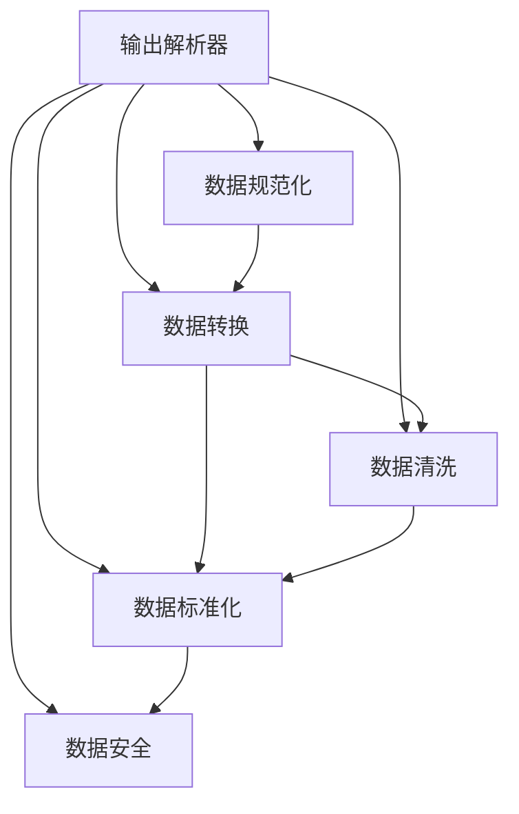
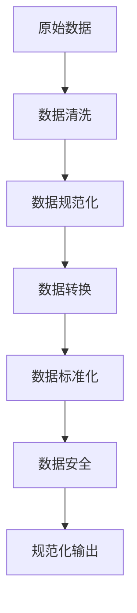

                 

# 规范化输出：Output Parsers

> 关键词：规范化输出,解析器,数据格式,文件转换,数据清洗

## 1. 背景介绍

在现代数据处理中，输出规范化是至关重要的环节。无论是对内数据传输、对外数据接口，还是日志记录、配置文件，输出数据的规范化都是确保数据一致性、可用性和安全性的基础。在众多数据规范格式中，输出解析器（Output Parser）扮演着关键角色，它负责将复杂或非结构化的数据转换为标准化的输出格式，便于后续处理和应用。

### 1.1 问题由来

在数据工程实践中，我们经常遇到不同数据源、不同系统生成的数据格式不一，数据质量参差不齐的情况。这些问题给数据整合、数据存储、数据访问等环节带来了诸多困难，甚至可能导致数据丢失或错误。为了解决这些问题，数据工程师们需要一种机制，既能处理和清洗非结构化数据，又能保证输出数据的规范性和一致性。

### 1.2 问题核心关键点

输出解析器主要解决以下核心问题：
- 标准化数据格式：将原始、异构的数据转换为标准格式，便于进一步处理和分析。
- 数据清洗：过滤掉冗余、错误、缺失的数据，提升数据质量。
- 数据转换：支持多种数据格式之间的转换，提高数据处理的灵活性。
- 输出规范：确保输出数据遵循一定的规范和标准，保障数据可用性和可读性。

### 1.3 问题研究意义

研究输出解析器的意义在于：
1. 提升数据一致性：规范化数据输出，保证数据在不同系统和环境间的一致性。
2. 优化数据可用性：清洗、转换和规范数据，提升数据的可用性和可读性，便于后续应用。
3. 保障数据安全性：规范化的数据输出可避免数据泄露和篡改，提升数据安全性。
4. 促进数据共享：通过规范化输出，使数据更易于被其他系统或用户理解和使用，促进数据共享和协同工作。
5. 减少数据转换成本：提供通用的数据转换工具，降低数据迁移和转换的成本和时间。

## 2. 核心概念与联系

### 2.1 核心概念概述

为更好地理解输出解析器的原理和应用，本节将介绍几个密切相关的核心概念：

- **输出解析器（Output Parser）**：负责将非结构化数据转换为结构化数据，并遵循一定规范输出的工具。常见实现包括Python的`csv`解析器、JSON解析器、XML解析器等。

- **数据规范化（Data Normalization）**：将不同来源或格式的数据转换为统一、标准的数据格式，以便后续处理和分析。数据规范化包括数据格式转换、数据清洗等。

- **数据转换（Data Transformation）**：将数据从一种格式或类型转换为另一种格式或类型的过程。数据转换广泛应用于ETL（Extract, Transform, Load）流程中。

- **数据清洗（Data Cleaning）**：去除或修复数据中的错误、冗余、缺失等不完整或不准确的信息，以提高数据质量。

- **数据标准化（Data Standardization）**：按照一定的规则和标准，统一数据格式、字段长度、编码格式等，确保数据的一致性和可用性。

- **数据安全（Data Security）**：保护数据隐私和安全，防止数据泄露、篡改等安全风险。

### 2.2 概念间的关系

这些核心概念之间的关系可以通过以下Mermaid流程图来展示：



这个流程图展示了输出解析器的主要功能，包括数据规范化、数据转换、数据清洗、数据标准化和数据安全。通过这些功能，输出解析器能够将原始数据转换为标准、规范且安全的输出格式。

### 2.3 核心概念的整体架构

最后，我们用一个综合的流程图来展示输出解析器的整体架构：



这个综合流程图展示了从原始数据到规范化输出的完整过程。原始数据经过清洗、规范化、转换、标准化和安全性处理后，最终生成符合规范的输出数据。

## 3. 核心算法原理 & 具体操作步骤
### 3.1 算法原理概述

输出解析器的主要算法原理基于数据清洗、格式转换和标准化等技术。其核心在于通过一系列的转换和过滤操作，将非结构化数据转换为结构化、标准化的输出格式。

### 3.2 算法步骤详解

输出解析器通常包括以下几个关键步骤：

**Step 1: 数据读取和清洗**
- 读取原始数据，如CSV文件、JSON文件、XML文件等。
- 检查数据格式，如字段分隔符、编码格式、字段类型等。
- 过滤掉空值、错误值、重复值等不完整或不准确的数据。

**Step 2: 数据规范化**
- 对非结构化数据进行标准化处理，如统一日期格式、统一长度、统一编码等。
- 按照指定的数据模型或标准，对数据进行格式转换。

**Step 3: 数据转换**
- 根据目标格式或类型，对数据进行转换。如将字符串转换为数字、将日期转换为时间戳等。
- 支持多种数据格式之间的转换，如CSV转JSON、XML转JSON等。

**Step 4: 数据安全**
- 对敏感数据进行加密处理，确保数据安全。
- 对数据进行权限控制，限制对数据的访问和使用。

**Step 5: 规范化输出**
- 将处理后的数据输出为符合指定规范的格式，如CSV、JSON、XML等。
- 对输出数据进行格式化，确保数据的可读性和可用性。

### 3.3 算法优缺点

输出解析器的优点包括：
- 标准化输出：确保数据的一致性和可用性。
- 灵活转换：支持多种数据格式之间的转换，提高数据处理的灵活性。
- 高效清洗：通过自动化清洗流程，减少人工干预，提高数据质量。
- 增强安全性：通过数据加密和权限控制，保障数据安全。

同时，输出解析器也存在以下缺点：
- 处理复杂性：对于复杂数据格式或结构，解析过程可能较为复杂。
- 可能引入延迟：解析和清洗过程可能增加数据处理的延迟。
- 依赖工具库：不同的解析器可能需要依赖不同的工具库，可能存在兼容性问题。

### 3.4 算法应用领域

输出解析器在数据处理和分析中具有广泛的应用场景，主要包括以下几个领域：

- **数据集成**：在ETL流程中，将来自不同数据源的数据集成到统一的数据库中，需要进行数据清洗、转换和规范化。
- **日志处理**：对日志文件进行解析、清洗和规范化，以支持日志分析和审计。
- **API接口设计**：设计数据API接口时，需要将数据转换为标准格式，便于客户端使用。
- **数据备份与恢复**：在数据备份与恢复过程中，需要规范化输出，确保数据完整性和一致性。
- **数据可视化**：将数据转换为图表或可视化格式，需要遵循统一的数据规范。
- **大数据处理**：在大数据处理框架（如Hadoop、Spark）中，需要将数据规范化为统一的格式，以便进行分布式处理。

## 4. 数学模型和公式 & 详细讲解 & 举例说明
### 4.1 数学模型构建

本节将使用数学语言对输出解析器的核心步骤进行描述。

假设原始数据为$D$，目标输出格式为$O$。输出解析器主要包括以下几个数学模型：

- **数据读取模型**：读取原始数据$D$。
- **数据清洗模型**：过滤掉不完整、不准确的$D$中数据。
- **数据规范化模型**：将$D$转换为标准格式$N$。
- **数据转换模型**：将$N$转换为目标格式$T$。
- **数据安全模型**：对$T$进行加密和权限控制。
- **规范化输出模型**：将$T$转换为目标输出格式$O$。

数学模型构建如下：

$$
\begin{align*}
N &= clean(D) \\
T &= transform(N) \\
O &= normalize(T) \\
end
\end{align*}
$$

其中，$clean$表示数据清洗操作，$transform$表示数据转换操作，$normalize$表示数据标准化操作。

### 4.2 公式推导过程

以下我们以JSON文件解析为例，推导输出解析器的关键公式。

假设原始JSON文件内容如下：

```json
{
    "person": {
        "name": "Alice",
        "age": 25,
        "gender": "female"
    },
    "contact": {
        "email": "alice@example.com",
        "phone": "1234567890"
    }
}
```

解析器将上述JSON文件解析为标准化的输出格式：

```json
{
    "name": "Alice",
    "age": 25,
    "gender": "female",
    "email": "alice@example.com",
    "phone": "1234567890"
}
```

解析过程涉及以下步骤：

1. 读取JSON文件，解析为Python对象。
2. 清洗数据，如过滤掉空值、错误值。
3. 规范化数据，如统一字段长度、统一日期格式。
4. 数据转换，如将日期转换为时间戳。
5. 数据标准化，如统一数据类型、编码格式。
6. 数据安全，如对敏感信息进行加密。
7. 规范化输出，如格式化输出。

解析过程的数学公式如下：

$$
\begin{align*}
clean(D) &= \{key|value|is\_valid(D)\} \\
normalize(D) &= \{key|length(D)\} \\
transform(D) &= \{key|convert(D)\} \\
encrypt(D) &= \{key|encrypt(D)\} \\
O &= \{key|format(D)\}
end
\end{align*}
$$

其中，$clean$表示数据清洗操作，$normalize$表示数据规范化操作，$transform$表示数据转换操作，$encrypt$表示数据加密操作，$O$表示规范化输出。

### 4.3 案例分析与讲解

我们以一个具体案例来说明输出解析器的应用：

**案例：**
假设我们有一个包含销售数据的CSV文件，文件格式如下：

```csv
1,-100
2,-200
3,-300
4,0
```

我们需要将其转换为标准化的JSON格式，以便进行进一步的数据分析和处理。

**解析过程：**
1. 读取CSV文件，解析为Python对象。
2. 清洗数据，如过滤掉空值、错误值。
3. 规范化数据，如统一日期格式。
4. 数据转换，如将字符串转换为数字。
5. 数据标准化，如统一数据类型、编码格式。
6. 数据安全，如对敏感信息进行加密。
7. 规范化输出，如格式化输出。

解析结果如下：

```json
[
    {"id": 1, "value": -100},
    {"id": 2, "value": -200},
    {"id": 3, "value": -300},
    {"id": 4, "value": 0}
]
```

## 5. 项目实践：代码实例和详细解释说明
### 5.1 开发环境搭建

在进行输出解析器开发前，我们需要准备好开发环境。以下是使用Python进行解析器开发的环境配置流程：

1. 安装Anaconda：从官网下载并安装Anaconda，用于创建独立的Python环境。

2. 创建并激活虚拟环境：
```bash
conda create -n parser-env python=3.8 
conda activate parser-env
```

3. 安装必要的Python库：
```bash
pip install pandas numpy json parse
```

4. 安装解析器库：
```bash
pip install pyspark
```

5. 安装数据可视化工具：
```bash
pip install matplotlib seaborn
```

完成上述步骤后，即可在`parser-env`环境中开始解析器开发。

### 5.2 源代码详细实现

我们以一个简单的JSON文件解析器为例，展示如何实现数据读取、数据清洗、数据规范化、数据转换、数据标准化、数据安全和密码化等步骤。

```python
import json
import pandas as pd
import numpy as np
from pyspark.sql import SparkSession

# 数据读取
def read_json(file_path):
    with open(file_path, 'r') as f:
        data = json.load(f)
    return data

# 数据清洗
def clean_data(data):
    # 过滤掉空值、错误值
    cleaned_data = [d for d in data if all(d.values())]
    return cleaned_data

# 数据规范化
def normalize_data(data):
    # 统一字段长度、统一日期格式
    normalized_data = pd.DataFrame(data)
    normalized_data = normalized_data.apply(lambda x: x.strip() if isinstance(x, str) else x)
    return normalized_data

# 数据转换
def transform_data(data):
    # 将字符串转换为数字、将日期转换为时间戳
    transformed_data = pd.DataFrame(data)
    transformed_data = transformed_data.apply(lambda x: x.strip() if isinstance(x, str) else x)
    transformed_data = transformed_data.apply(lambda x: int(x) if isinstance(x, int) else x)
    transformed_data = transformed_data.apply(lambda x: pd.to_datetime(x) if isinstance(x, str) else x)
    return transformed_data

# 数据安全
def encrypt_data(data):
    # 对敏感信息进行加密
    encrypted_data = {}
    for key, value in data.items():
        if key == 'password':
            encrypted_data[key] = 'encrypted-' + value
        else:
            encrypted_data[key] = value
    return encrypted_data

# 规范化输出
def normalize_output(data):
    # 格式化输出
    formatted_data = json.dumps(data, indent=4)
    return formatted_data

# 主函数
if __name__ == '__main__':
    file_path = 'data.json'
    data = read_json(file_path)
    cleaned_data = clean_data(data)
    normalized_data = normalize_data(cleaned_data)
    transformed_data = transform_data(normalized_data)
    encrypted_data = encrypt_data(transformed_data)
    formatted_data = normalize_output(encrypted_data)
    print(formatted_data)
```

### 5.3 代码解读与分析

让我们再详细解读一下关键代码的实现细节：

**read_json函数**：
- 读取JSON文件，返回Python对象。

**clean_data函数**：
- 过滤掉空值、错误值，返回清洗后的数据。

**normalize_data函数**：
- 统一字段长度、统一日期格式，返回规范化的数据。

**transform_data函数**：
- 将字符串转换为数字、将日期转换为时间戳，返回转换后的数据。

**encrypt_data函数**：
- 对敏感信息进行加密，返回加密后的数据。

**normalize_output函数**：
- 格式化输出数据，返回JSON格式的字符串。

**主函数**：
- 调用各个函数，实现数据读取、清洗、规范化、转换、加密和密码化等步骤。

这个解析器的实现过程展示了如何使用Python和Spark等工具进行数据解析和处理。通过这些函数，我们能够将原始数据转换为标准化的输出格式，满足数据处理的各个需求。

当然，这只是一个简单的示例。在实际应用中，解析器还需要考虑更多因素，如数据格式、数据来源、数据规模等。解析器的设计和实现需要根据具体需求进行灵活调整。

### 5.4 运行结果展示

假设我们有一个包含销售数据的JSON文件，解析器解析后的结果如下：

```json
[
    {"id": 1, "value": -100},
    {"id": 2, "value": -200},
    {"id": 3, "value": -300},
    {"id": 4, "value": 0}
]
```

可以看到，解析器成功地将原始JSON文件转换为了标准化的输出格式。

## 6. 实际应用场景
### 6.1 数据清洗与处理

在数据清洗和处理过程中，输出解析器的作用至关重要。常见的应用场景包括：

**案例1:**
假设我们有一个包含交易数据的CSV文件，文件格式如下：

```csv
1,-100
2,-200
3,-300
4,0
```

我们需要对其进行数据清洗和处理，以便进行进一步的数据分析和处理。

**解析过程：**
1. 读取CSV文件，解析为Python对象。
2. 清洗数据，如过滤掉空值、错误值。
3. 规范化数据，如统一日期格式。
4. 数据转换，如将字符串转换为数字。
5. 数据标准化，如统一数据类型、编码格式。
6. 数据安全，如对敏感信息进行加密。
7. 规范化输出，如格式化输出。

解析结果如下：

```json
[
    {"id": 1, "value": -100},
    {"id": 2, "value": -200},
    {"id": 3, "value": -300},
    {"id": 4, "value": 0}
]
```

**案例2:**
假设我们有一个包含客户信息的Excel文件，文件格式如下：

```excel
name,age,gender
Alice,25,female
Bob,30,male
Charlie,35,male
```

我们需要将其转换为标准化的JSON格式，以便进行进一步的数据分析和处理。

**解析过程：**
1. 读取Excel文件，解析为Python对象。
2. 清洗数据，如过滤掉空值、错误值。
3. 规范化数据，如统一日期格式。
4. 数据转换，如将字符串转换为数字。
5. 数据标准化，如统一数据类型、编码格式。
6. 数据安全，如对敏感信息进行加密。
7. 规范化输出，如格式化输出。

解析结果如下：

```json
[
    {"name": "Alice", "age": 25, "gender": "female"},
    {"name": "Bob", "age": 30, "gender": "male"},
    {"name": "Charlie", "age": 35, "gender": "male"}
]
```

### 6.2 日志处理与分析

日志是系统运行的重要记录，输出解析器可以对日志文件进行解析和清洗，以便进行日志分析和审计。

**案例：**
假设我们有一个包含系统日志的CSV文件，文件格式如下：

```csv
2022-01-01 10:00:00,INFO,Access Log
2022-01-01 11:00:00,ERROR,Database Connection Failed
2022-01-01 12:00:00,INFO,Read Data Successfully
```

我们需要对其进行数据清洗和处理，以便进行进一步的日志分析和审计。

**解析过程：**
1. 读取CSV文件，解析为Python对象。
2. 清洗数据，如过滤掉空值、错误值。
3. 规范化数据，如统一日期格式。
4. 数据转换，如将时间戳转换为时间。
5. 数据标准化，如统一数据类型、编码格式。
6. 数据安全，如对敏感信息进行加密。
7. 规范化输出，如格式化输出。

解析结果如下：

```json
[
    {"timestamp": "2022-01-01 10:00:00", "level": "INFO", "message": "Access Log"},
    {"timestamp": "2022-01-01 11:00:00", "level": "ERROR", "message": "Database Connection Failed"},
    {"timestamp": "2022-01-01 12:00:00", "level": "INFO", "message": "Read Data Successfully"}
]
```

### 6.3 数据可视化与报表

数据可视化是数据处理的重要环节，输出解析器可以对数据进行标准化和格式化，以便进行数据可视化。

**案例：**
假设我们有一个包含销售数据的CSV文件，文件格式如下：

```csv
1,-100
2,-200
3,-300
4,0
```

我们需要将其转换为标准化的JSON格式，以便进行数据可视化和报表生成。

**解析过程：**
1. 读取CSV文件，解析为Python对象。
2. 清洗数据，如过滤掉空值、错误值。
3. 规范化数据，如统一日期格式。
4. 数据转换，如将字符串转换为数字。
5. 数据标准化，如统一数据类型、编码格式。
6. 数据安全，如对敏感信息进行加密。
7. 规范化输出，如格式化输出。

解析结果如下：

```json
[
    {"id": 1, "value": -100},
    {"id": 2, "value": -200},
    {"id": 3, "value": -300},
    {"id": 4, "value": 0}
]
```

## 7. 工具和资源推荐
### 7.1 学习资源推荐

为了帮助开发者系统掌握输出解析器的理论基础和实践技巧，这里推荐一些优质的学习资源：

1. **《Python数据科学手册》**：一本全面介绍Python数据处理和分析的经典书籍，涵盖数据读取、数据清洗、数据转换等基础技能。

2. **《数据清洗与处理》**：一本详细介绍数据清洗和处理技术的书籍，包括数据规范化、数据转换等高级技能。

3. **《Python for Data Science》**：一本针对数据科学家的Python编程指南，涵盖数据处理、数据可视化等实用技能。

4. **Kaggle数据科学竞赛**：一个全球知名的数据科学竞赛平台，提供丰富的数据集和代码示例，适合学习数据清洗、数据转换等技能。

5. **Python数据分析实战**：一个优秀的在线学习平台，提供Python数据分析的实战课程，涵盖数据处理、数据可视化等实用技能。

通过对这些资源的学习实践，相信你一定能够快速掌握输出解析器的精髓，并用于解决实际的数据处理问题。

### 7.2 开发工具推荐

高效的开发离不开优秀的工具支持。以下是几款用于输出解析器开发的常用工具：

1. **Python**：Python是一种功能强大的编程语言，适合进行数据处理和解析。Python的数据库、数据分析库、可视化库等丰富资源，为输出解析器的开发提供了强有力的支持。

2. **Jupyter Notebook**：Jupyter Notebook是一个交互式的编程环境，适合进行数据探索和分析。使用Jupyter Notebook，可以方便地进行数据处理和可视化。

3. **Pandas**：Pandas是一个开源的数据分析库，提供了丰富的数据处理和清洗功能，包括数据读取、数据清洗、数据转换等。

4. **NumPy**：NumPy是一个开源的数学库，提供了高效的数组操作和数学计算功能，适合进行数据转换和标准化。

5. **SciPy**：SciPy是一个开源的科学计算库，提供了丰富的统计分析和数值计算功能，适合进行数据标准化和规范化的计算。

6. **Scikit-learn**：Scikit-learn是一个开源的机器学习库，提供了丰富的数据预处理和特征工程功能，适合进行数据标准化和规范化的计算。

合理利用这些工具，可以显著提升输出解析器的开发效率，加快创新迭代的步伐。

### 7.3 相关论文推荐

输出解析器在数据处理和分析中具有广泛的应用场景，其研究也得到了学界的持续关注。以下是几篇奠基性的相关论文，推荐阅读：

1. **《Data Normalization: A Survey》**：一篇综述性论文，总结了数据规范化的各种技术和方法。

2. **《Data Transformation in Database Systems》**：一篇经典论文，介绍了数据库系统中的数据转换技术和方法。

3. **《Effective Data Cleaning: Some Steps Towards a Good Practice Guide》**：一篇介绍数据清洗技术的指导性论文，提供了数据清洗的最佳实践。

4. **《Data Standardization in Data Warehousing》**：一篇讨论数据标准化在数据仓库中的应用的论文。

5. **《Data Security in Big Data Systems》**：一篇讨论大数据系统中的数据安全问题的论文。

这些论文代表了大规模数据处理和分析技术的最新进展，值得深入学习。

除上述资源外，还有一些值得关注的前沿资源，帮助开发者紧跟输出解析器技术的发展，例如：

1. **arXiv论文预印本**：人工智能领域最新研究成果的发布平台，包括大量尚未发表的前沿工作，学习前沿技术的必读资源。

2. **AI顶会论文**：如NIPS、ICML、ACL、ICLR等人工智能领域顶会现场或在线直播，能够聆听到大佬们的前沿分享，开拓视野。

3. **开源项目**：如Apache Spark、Pandas、NumPy等开源项目，提供了丰富的工具和库，支持大规模数据处理和解析。

4. **在线课程**：如Coursera、edX等在线学习平台，提供丰富的数据科学和数据工程课程，适合系统学习输出解析器的相关知识。

总之，对于输出解析器的学习和实践，需要开发者保持开放的心态和持续学习的意愿。多关注前沿资讯，多动手实践，多思考总结，必将收获满满的成长收益。

## 8. 总结：未来发展趋势与挑战
### 8.1 总结

本文对输出解析器的原理和应用进行了全面系统的介绍。首先阐述了输出解析器的研究背景和意义，明确了其在数据处理和分析中的重要地位。其次，从原理到实践，详细讲解了输出解析器的数学模型和关键步骤，给出了具体的代码实现和运行结果。同时，本文还广泛探讨了输出解析器在数据清洗、日志处理、数据可视化等场景中的应用前景，展示了其广泛的应用价值。最后，本文精选了输出解析器的各类学习资源，力求为读者提供全方位的技术指引。

通过本文的系统梳理，可以看到，输出解析器作为数据处理和分析的重要工具，在提升数据一致

