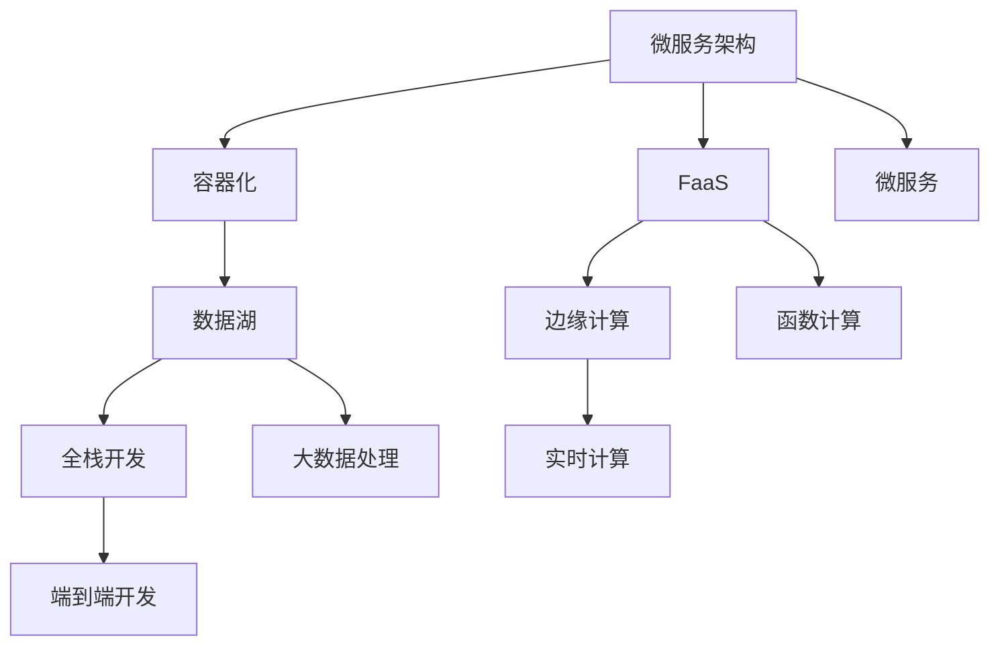
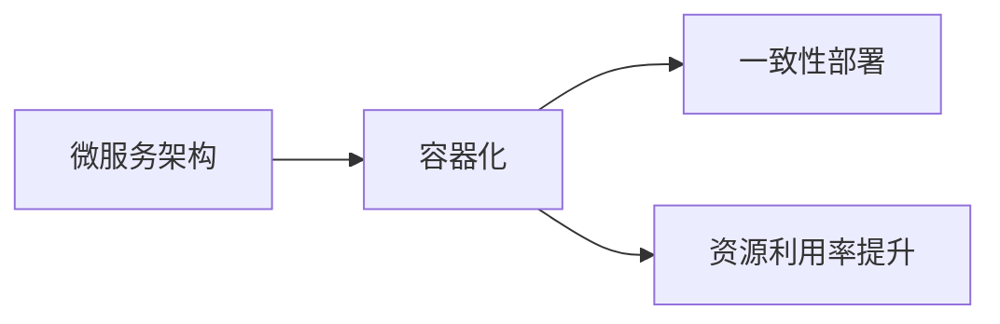
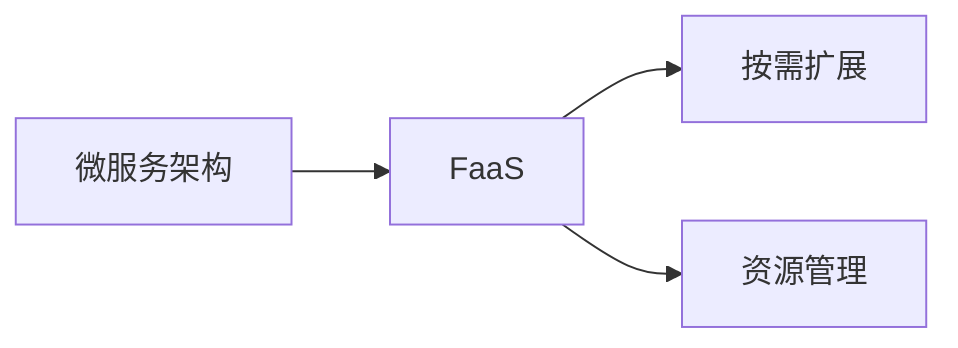
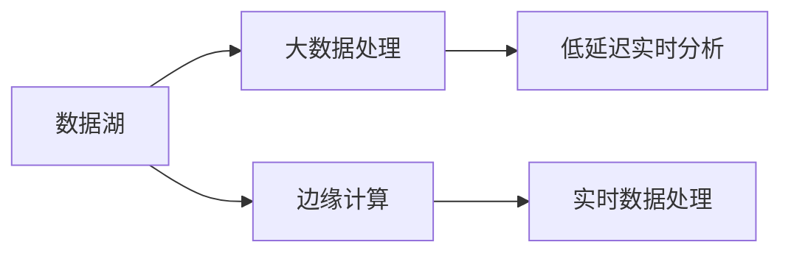
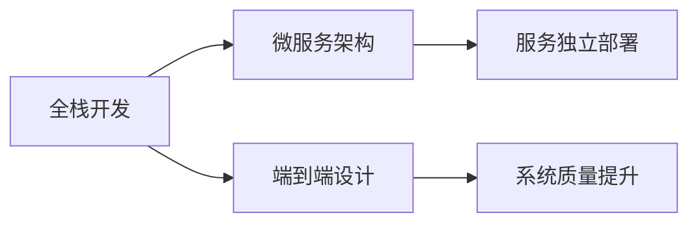
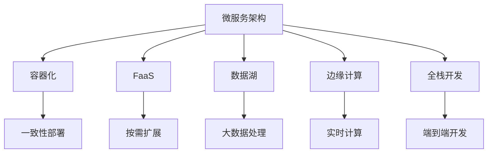

                 

# 计算产业技术栈的重大变化

> 关键词：计算产业, 技术栈, 微服务, 容器化, 函数即服务(FaaS), 数据湖, 边缘计算, 全栈开发

## 1. 背景介绍

### 1.1 问题由来

随着技术的快速演进和市场需求的不断变化，计算产业的技术栈也在持续发生重大变化。这些变化不仅影响了产品的设计和实现方式，也对企业的技术架构、运营模式和市场竞争格局产生了深远影响。

在传统软件工程时代，大多数软件由单一的、垂直的架构构成。随着互联网和云计算技术的普及，微服务架构逐渐成为主流，使软件可以更容易地扩展、维护和升级。容器化和函数即服务(FaaS)等新兴技术进一步推动了这种演变。

近年来，随着大数据和人工智能的兴起，数据的采集、存储、处理和分析变得日益复杂，传统数据栈已经难以应对新的需求。数据湖和边缘计算等新技术应运而生，为大数据处理提供了全新的解决方案。

在硬件方面，服务器、存储和网络等基础设施的升级也带来了显著的变化。比如，从传统的物理服务器到虚拟化环境，再到云计算资源的按需弹性，极大地提升了资源利用效率和系统的扩展性。

本文将聚焦于这些关键技术的变化，探讨它们对计算产业生态系统带来的影响。通过深入剖析这些技术的发展趋势和潜在挑战，希望能为计算产业从业者提供有价值的参考。

### 1.2 问题核心关键点

要理解计算产业技术栈的重大变化，需要关注以下几个关键点：

- **微服务架构**：如何通过服务化的方式提升系统的可扩展性和可维护性？
- **容器化和FaaS**：如何实现高效的应用部署和运行，同时提高资源利用率？
- **数据湖和边缘计算**：如何应对大数据处理和实时计算的需求？
- **全栈开发**：如何实现端到端的系统设计和开发，提升整体开发效率？

这些关键技术的发展和应用，推动了计算产业生态系统的全面升级，为企业提供了更强大的计算能力、更高的效率和更灵活的部署方式。

## 2. 核心概念与联系

### 2.1 核心概念概述

为更好地理解这些关键技术的变化及其影响，本节将介绍几个密切相关的核心概念：

- **微服务架构**：将应用分解为多个小服务，每个服务独立运行、独立部署、独立扩展。微服务架构提升了系统的可维护性和可扩展性，但也带来了服务间的通信和数据一致性等挑战。

- **容器化**：使用容器技术（如Docker）来封装应用和依赖，实现跨环境的一致性部署和运行。容器化显著提升了应用的部署效率和资源的利用率。

- **函数即服务(FaaS)**：即按需提供函数计算服务，开发者只需编写函数代码，无需关心底层运行环境和资源管理。FaaS降低了应用的运维成本，提高了系统的灵活性和可扩展性。

- **数据湖**：通过统一存储和管理系统的大量数据，支持数据的实时分析和离线处理。数据湖为大数据处理提供了全新的平台，能够应对海量数据的存储和处理需求。

- **边缘计算**：将计算资源部署到靠近数据源的位置，提供低延迟、高带宽的计算能力。边缘计算能够支持实时数据处理和分析，提升系统的响应速度和可靠性。

- **全栈开发**：从应用架构设计、前后端开发、数据库设计到云平台部署，全面覆盖开发流程，提升整体开发效率和系统质量。

这些核心概念之间的逻辑关系可以通过以下Mermaid流程图来展示：



这个流程图展示了几项关键技术之间的联系：

1. 微服务架构通过服务化实现应用解耦和独立扩展。
2. 容器化技术支持微服务的封装和部署。
3. FaaS提供了函数的弹性计算能力，支持微服务的按需扩展。
4. 数据湖支持大规模数据的存储和分析，是微服务架构中的重要组成部分。
5. 边缘计算提供了靠近数据源的计算能力，提升了微服务架构的响应速度。
6. 全栈开发涵盖了从架构设计到云部署的整个开发流程，提升了系统的整体开发效率。

### 2.2 概念间的关系

这些核心概念之间存在着紧密的联系，形成了计算产业技术栈的整体框架。下面我们通过几个Mermaid流程图来展示这些概念之间的关系。

#### 2.2.1 微服务架构与容器化



这个流程图展示了微服务架构和容器化之间的紧密联系。微服务架构将应用拆分成多个服务，而容器化技术通过封装服务及其依赖，实现了跨环境的一致性部署和资源的高效利用。

#### 2.2.2 微服务架构与FaaS



这个流程图展示了微服务架构与FaaS之间的联系。微服务架构需要频繁扩展和更新，而FaaS提供了函数的弹性计算能力，支持微服务的按需扩展和资源管理。

#### 2.2.3 数据湖与边缘计算



这个流程图展示了数据湖与边缘计算之间的联系。数据湖支持大规模数据的存储和分析，而边缘计算提供了低延迟的计算能力，支持数据的实时处理和分析。

#### 2.2.4 全栈开发与微服务架构



这个流程图展示了全栈开发与微服务架构之间的联系。全栈开发涵盖了从架构设计到云部署的整个开发流程，提升了微服务架构的设计和部署效率，提高了系统的整体质量和可靠性。

### 2.3 核心概念的整体架构

最后，我们用一个综合的流程图来展示这些核心概念在大语言模型微调过程中的整体架构：



这个综合流程图展示了从微服务架构到全栈开发，再到数据湖和边缘计算等各项关键技术之间的联系。通过这些关键技术的协同工作，可以构建一个高效、可扩展、易于维护的计算产业生态系统。

## 3. 核心算法原理 & 具体操作步骤

### 3.1 算法原理概述

计算产业技术栈的重大变化，本质上是多方面技术演进的结果。这些变化推动了系统架构、应用部署、数据处理等方面的演进，带来了更高效、更灵活、更可维护的计算环境。

以微服务架构为例，其核心思想是通过将应用拆分成多个独立的服务，实现服务的微服务化和分布式部署，提升了系统的可扩展性和可维护性。容器化和FaaS技术进一步推动了这种演变，通过封装和按需计算的方式，提升了应用的部署效率和资源利用率。

在数据处理方面，数据湖和边缘计算技术为大规模数据的存储和实时处理提供了全新的解决方案。数据湖支持海量数据的存储和离线分析，而边缘计算则提供了靠近数据源的低延迟计算能力，支持实时数据的处理和分析。

在开发模式上，全栈开发进一步推动了端到端开发流程的优化，提升了整体开发效率和系统质量。

### 3.2 算法步骤详解

以下详细介绍基于微服务架构的计算产业技术栈的重大变化，并给出具体操作步骤：

#### 3.2.1 微服务架构

**Step 1: 设计服务边界**
- 根据应用需求，将应用拆分成多个独立的服务。每个服务应具备单一功能，例如登录服务、订单服务、支付服务等。
- 明确服务之间的接口和通信协议，例如REST API、gRPC等。

**Step 2: 实现服务**
- 为每个服务编写独立的代码和依赖。可以使用Spring Boot、Django等框架进行服务开发。
- 实现服务的测试和部署。使用Docker、Kubernetes等工具进行服务的打包和部署。

**Step 3: 服务注册与发现**
- 使用服务注册中心（如Consul、Eureka）对服务进行注册和发现。
- 配置负载均衡和容错机制，确保服务的高可用性和稳定性。

#### 3.2.2 容器化

**Step 1: 服务容器化**
- 将服务代码打包成Docker镜像，确保服务在各种环境中的一致性部署和运行。
- 编写Dockerfile文件，配置服务依赖、环境变量和运行命令。

**Step 2: 容器编排**
- 使用Kubernetes等容器编排工具进行服务集群的管理和调度。
- 定义服务部署的策略和资源限制，例如CPU、内存、网络带宽等。

**Step 3: 容器化运维**
- 使用Prometheus、Grafana等工具进行容器集群的监控和告警。
- 使用ELK Stack等日志管理工具进行容器日志的收集和分析。

#### 3.2.3 函数即服务(FaaS)

**Step 1: 函数开发**
- 编写函数代码，实现特定的业务逻辑。
- 将函数代码上传到FaaS平台（如AWS Lambda、Azure Functions等）。

**Step 2: 函数部署**
- 配置函数的触发器和事件源，例如HTTP请求、消息队列、定时任务等。
- 设置函数的运行时环境和内存限制，确保函数的高效运行。

**Step 3: 函数运维**
- 使用云平台提供的监控和日志工具进行函数的运行状态监控。
- 配置函数的自动扩展和资源调整，确保函数在高负载下的稳定运行。

#### 3.2.4 数据湖

**Step 1: 数据采集**
- 使用ETL工具（如Apache Nifi、Data Pipeline）进行数据的采集和清洗。
- 将清洗后的数据导入数据湖（如Amazon S3、Hadoop HDFS等）进行存储。

**Step 2: 数据存储和处理**
- 使用数据湖管理系统（如Cloudera、Data Lake）进行数据的存储和管理。
- 使用Spark、Hive等大数据处理工具进行数据的离线和实时处理。

**Step 3: 数据分析和可视化**
- 使用数据可视化工具（如Tableau、Power BI）进行数据的可视化展示。
- 使用机器学习算法（如TensorFlow、PyTorch）进行数据的分析和预测。

#### 3.2.5 边缘计算

**Step 1: 边缘设备部署**
- 将边缘计算设备（如Raspberry Pi、IoT设备）部署到靠近数据源的位置。
- 配置设备的网络、存储和计算资源，确保设备的稳定运行。

**Step 2: 应用和数据部署**
- 将计算应用和数据部署到边缘计算设备上。
- 使用MQTT、AMQP等消息队列进行设备之间的数据通信。

**Step 3: 边缘计算运维**
- 使用边缘计算平台（如AWS Greengrass、IBM Edge Container）进行设备的监控和管理。
- 配置设备的告警和日志收集，确保设备的高可用性和稳定性。

### 3.3 算法优缺点

基于微服务架构的计算产业技术栈的重大变化，具有以下优点：

1. **高效扩展**：微服务架构能够灵活扩展，适应不同的业务需求。
2. **独立部署**：每个服务独立部署，减少了系统故障的概率。
3. **快速迭代**：服务独立开发和部署，可以快速进行功能迭代和更新。
4. **资源优化**：容器化技术提高了资源的利用率，减少了计算成本。
5. **弹性计算**：FaaS提供了弹性计算能力，按需扩展资源。

同时，也存在以下缺点：

1. **复杂管理**：多个服务之间的管理和协调变得更加复杂。
2. **通信开销**：服务之间的通信增加了系统的复杂性和开销。
3. **数据一致性**：服务之间的数据一致性问题需要额外考虑和管理。
4. **部署难度**：服务数量增加后，部署和运维的难度也随之增加。
5. **性能瓶颈**：服务间的通信瓶颈可能影响系统的整体性能。

### 3.4 算法应用领域

基于微服务架构的计算产业技术栈的重大变化，已经广泛应用于各种领域，例如：

1. **电商系统**：将订单服务、库存服务、支付服务等拆分成独立的服务，实现系统的可扩展和可维护。
2. **金融系统**：将交易服务、风控服务、结算服务等拆分成独立的服务，提升系统的可靠性和安全性。
3. **物联网应用**：将传感器数据、设备控制等应用拆分成独立的服务，实现设备之间的通信和数据共享。
4. **媒体平台**：将视频服务、音频服务、社交服务等拆分成独立的服务，提升平台的扩展性和用户体验。
5. **智能制造**：将设备监控、生产计划、订单管理等应用拆分成独立的服务，实现工业互联网的智能化和自动化。

这些领域的应用展示了微服务架构的广泛适用性和强大的能力，为计算产业的发展提供了新的方向和机遇。

## 4. 数学模型和公式 & 详细讲解 & 举例说明

### 4.1 数学模型构建

本节将使用数学语言对基于微服务架构的计算产业技术栈的重大变化进行更加严格的刻画。

记微服务架构为 $M=\{M_1, M_2, ..., M_n\}$，其中每个服务 $M_i$ 表示单一功能的服务，例如登录服务、订单服务、支付服务等。假设 $M_1$ 的输入为 $I_1$，输出为 $O_1$；$M_2$ 的输入为 $I_2$，输出为 $O_2$；以此类推。

**数据流模型**：假设 $M_1$ 将 $I_1$ 作为输入，输出 $O_1$；$M_2$ 将 $O_1$ 作为输入，输出 $O_2$；以此类推。整个系统可以表示为有向图 $G=(V, E)$，其中 $V=\{M_1, M_2, ..., M_n\}$ 表示服务节点，$E$ 表示服务之间的通信边。

### 4.2 公式推导过程

以下我们以电商系统为例，推导微服务架构的数学模型。

假设电商系统有订单服务 $M_1$、库存服务 $M_2$ 和支付服务 $M_3$，其数据流模型可以表示为：

```
M_1: I_1 --> O_1 --> M_2
      |            |
      |            |
      v            v
M_3: I_3 --> O_3
```

其中 $I_1$ 表示订单信息，$O_1$ 表示库存信息，$I_3$ 表示支付信息，$O_3$ 表示支付结果。

对于服务 $M_1$，其输入和输出可以表示为：

$$
I_1 = (I_{1a}, I_{1b}, ..., I_{1k})
$$

$$
O_1 = (O_{1a}, O_{1b}, ..., O_{1l})
$$

其中 $I_{1a}, I_{1b}, ..., I_{1k}$ 表示订单信息的各个属性，例如订单号、商品信息等；$O_{1a}, O_{1b}, ..., O_{1l}$ 表示库存信息的各个属性，例如库存数量、商品状态等。

同理，对于服务 $M_2$ 和 $M_3$，可以表示为：

$$
I_2 = (O_{1a}, I_{3a}, ..., I_{3b})
$$

$$
O_2 = (O_{2a}, O_{2b}, ..., O_{2c})
$$

$$
I_3 = (I_{3a}, I_{3b}, ..., I_{3c})
$$

$$
O_3 = (O_{3a}, O_{3b}, ..., O_{3c})
$$

其中 $I_{2a}, I_{2b}, ..., I_{2c}$ 表示库存信息的各个属性；$O_{2a}, O_{2b}, ..., O_{2c}$ 表示订单信息的各个属性；$I_{3a}, I_{3b}, ..., I_{3c}$ 表示支付信息的各个属性；$O_{3a}, O_{3b}, ..., O_{3c}$ 表示支付结果的各个属性。

### 4.3 案例分析与讲解

**电商系统案例分析**

假设电商系统需要实现订单的生成、库存的更新和支付的完成。可以使用微服务架构将订单服务、库存服务和支付服务拆分成独立的微服务。

- **订单服务**：处理订单的创建、查询、修改等操作，输出订单信息。
- **库存服务**：处理库存的增减、查询等操作，输出库存信息。
- **支付服务**：处理支付的确认、查询等操作，输出支付结果。

将这三个微服务连接起来，可以实现完整的订单处理流程。具体步骤如下：

1. 用户在电商平台上提交订单，订单服务接收到订单信息 $I_1$。
2. 订单服务将订单信息 $I_1$ 传递给库存服务，库存服务根据订单信息查询库存信息 $O_1$。
3. 库存服务将查询结果 $O_1$ 返回给订单服务。
4. 订单服务根据库存信息 $O_1$ 生成订单，并将订单信息 $I_1$ 传递给支付服务。
5. 支付服务根据订单信息 $I_1$ 和支付信息 $I_3$ 生成支付结果 $O_3$。
6. 支付服务将支付结果 $O_3$ 返回给订单服务，订单服务将支付结果更新到订单信息中。
7. 订单服务将更新后的订单信息 $I_1$ 和支付结果 $O_3$ 返回给用户。

通过这种微服务架构的设计，电商系统能够灵活扩展、快速迭代，同时提高了系统的可靠性和稳定性。

## 5. 项目实践：代码实例和详细解释说明

### 5.1 开发环境搭建

在进行微服务架构的计算产业技术栈的重大变化实践前，我们需要准备好开发环境。以下是使用Python进行Flask开发的环境配置流程：

1. 安装Anaconda：从官网下载并安装Anaconda，用于创建独立的Python环境。

2. 创建并激活虚拟环境：
```bash
conda create -n flask-env python=3.8 
conda activate flask-env
```

3. 安装Flask：
```bash
pip install flask
```

4. 安装其他必要的工具包：
```bash
pip install Flask-RESTful
pip install Flask-SQLAlchemy
pip install gunicorn
```

完成上述步骤后，即可在`flask-env`环境中开始微服务架构的计算产业技术栈的重大变化实践。

### 5.2 源代码详细实现

这里我们以一个简单的电商订单系统为例，给出使用Flask框架进行微服务架构实践的代码实现。

首先，定义订单服务：

```python
from flask import Flask, jsonify
from flask_sqlalchemy import SQLAlchemy

app = Flask(__name__)
app.config['SQLALCHEMY_DATABASE_URI'] = 'sqlite:///order.db'
db = SQLAlchemy(app)

class Order(db.Model):
    id = db.Column(db.Integer, primary_key=True)
    customer_name = db.Column(db.String(80))
    product_name = db.Column(db.String(120))
    quantity = db.Column(db.Integer)

@app.route('/orders', methods=['POST'])
def create_order():
    order = Order(customer_name=request.json['customer_name'], product_name=request.json['product_name'], quantity=request.json['quantity'])
    db.session.add(order)
    db.session.commit()
    return jsonify({'order': order.id}), 201
```

然后，定义库存服务和支付服务：

```python
from flask import Flask, jsonify
from flask_sqlalchemy import SQLAlchemy

app = Flask(__name__)
app.config['SQLALCHEMY_DATABASE_URI'] = 'sqlite:///inventory.db'
db = SQLAlchemy(app)

class Inventory(db.Model):
    id = db.Column(db.Integer, primary_key=True)
    product_name = db.Column(db.String(120))
    quantity = db.Column(db.Integer)

@app.route('/inventory', methods=['GET'])
def get_inventory():
    inventory = Inventory.query.all()
    return jsonify([{'product_name': product.product_name, 'quantity': product.quantity} for product in inventory])

app = Flask(__name__)
app.config['SQLALCHEMY_DATABASE_URI'] = 'sqlite:///payment.db'
db = SQLAlchemy(app)

class Payment(db.Model):
    id = db.Column(db.Integer, primary_key=True)
    order_id = db.Column(db.Integer)
    amount = db.Column(db.Float)

@app.route('/payment', methods=['POST'])
def make_payment():
    payment = Payment(order_id=request.json['order_id'], amount=request.json['amount'])
    db.session.add(payment)
    db.session.commit()
    return jsonify({'payment': payment.id}), 201
```

接下来，定义微服务架构的接口：

```python
from flask import Flask, jsonify
from flask_restful import Api, Resource
from order_service import Order
from inventory_service import Inventory
from payment_service import Payment

app = Flask(__name__)
api = Api(app)

class OrderResource(Resource):
    def post(self):
        order = Order.create_order()
        return jsonify({'order_id': order.id})

class InventoryResource(Resource):
    def get(self):
        inventory = Inventory.get_inventory()
        return jsonify(inventory)

class PaymentResource(Resource):
    def post(self):
        payment = Payment.make_payment()
        return jsonify({'payment_id': payment.id})

api.add_resource(OrderResource, '/orders')
api.add_resource(InventoryResource, '/inventory')
api.add_resource(PaymentResource, '/payment')
```

最后，启动微服务架构的计算产业技术栈的重大变化实践：

```python
if __name__ == '__main__':
    app.run(debug=True)
```

以上就是使用Flask框架进行微服务架构的计算产业技术栈的重大变化实践的完整代码实现。可以看到，Flask框架的简洁高效，使得微服务架构的构建变得相对简单。

### 5.3 代码解读与分析

让我们再详细解读一下关键代码的实现细节：

**订单服务**

- `app.config['SQLALCHEMY_DATABASE_URI']`：设置数据库连接字符串。
- `db.Model`：定义订单模型，包含订单信息的基本属性。
- `@app.route`：定义路由和HTTP方法。
- `db.session.add`和`db.session.commit`：添加和提交订单到数据库。

**库存服务和支付服务**

- `app.config['SQLALCHEMY_DATABASE_URI']`：设置数据库连接字符串。
- `db.Model`：定义库存和支付模型，包含库存和支付信息的基本属性。
- `@app.route`：定义路由和HTTP方法。
- `db.session.add`和`db.session.commit`：添加和提交库存和支付到数据库。

**微服务架构的接口**

- `api.add_resource`：添加资源到API中。
- `@app.route`：定义路由和HTTP方法。
- `OrderResource.post`、`InventoryResource.get`和`PaymentResource.post`：实现资源的具体方法。

通过上述代码实现，我们可以清晰地看到微服务架构的构建方式，每个服务独立运行、独立部署、独立扩展，实现了系统的可扩展性和可维护性。

## 6. 实际应用场景

### 6.1 智能制造系统

智能制造系统将传统的制造流程与自动化、信息化技术相结合，通过微服务架构实现系统的可扩展和可维护。

在智能制造系统中，微服务架构可以帮助企业实现：

- **设备监控**：将传感器数据、设备状态等应用拆分成独立的服务，实现设备之间的通信和数据共享。
- **生产计划**：将生产调度、订单管理等应用拆分成独立的服务，实现生产流程的优化和调度。
- **供应链管理**：将物流、库存、采购等应用拆分成独立的服务，实现供应链的高效管理和协调。

微服务架构能够支持智能制造系统的实时计算和数据分析，提升系统的响应速度和可靠性，为企业的智能化转型提供支持。

### 6.2 金融交易系统

金融交易系统需要处理高并发、高吞吐量的交易请求，对系统的可扩展性和可用性要求很高。

通过微服务架构，金融交易系统可以实现：

- **交易服务**：处理交易的创建、查询、修改等操作，实现交易的记录和处理。
- **风控服务**：处理交易的风控审核、风险评估等操作，提升交易的安全性和合规性。
- **结算服务**：处理交易的结算、对账等操作，实现资金的清算和结算。

微服务架构能够支持金融交易系统的快速迭代和扩展，提升系统的可靠性和安全性，为金融行业的数字化转型提供支持。

### 6.3 物流管理系统

物流管理系统需要处理大量的运输、仓储、配送等数据，对系统的扩展性和实时性要求很高。

通过微服务架构，物流管理系统可以实现：

- **运输服务**：处理运输的计划、调度、跟踪等操作，实现运输的高效管理和调度。
- **仓储服务**：处理仓储的入库、

