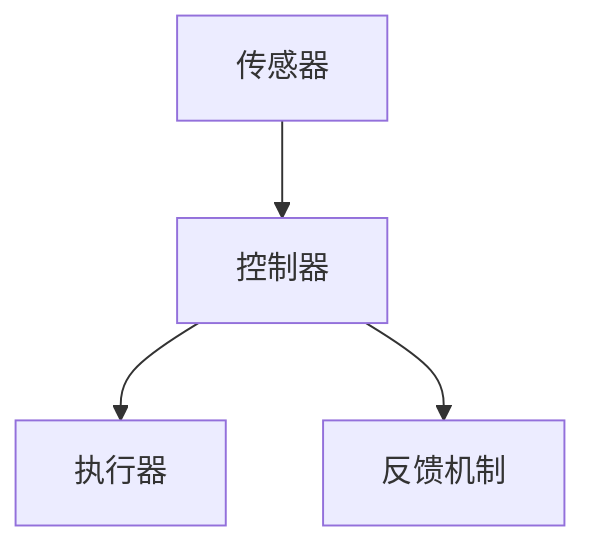
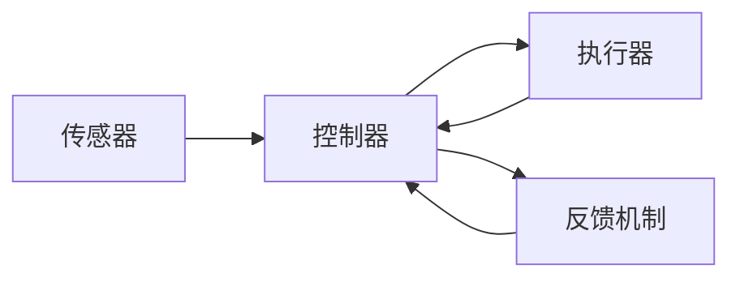
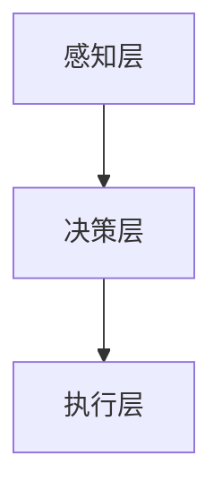

                 

# 计算领域的自动化趋势与挑战

## 1. 背景介绍

### 1.1 问题由来
随着计算技术的飞速发展，自动化在各行各业中的应用日益广泛。在人工智能(AI)、自然语言处理(NLP)、机器学习(ML)等领域，自动化技术的进展尤为显著。自动化技术不仅提升了工作效率，减少了人为错误，还打开了新产业的发展大门。但与此同时，自动化技术的普及也带来了新的挑战，如就业结构变化、伦理道德问题、数据隐私等。

本文将深入探讨计算领域的自动化趋势，从核心概念到具体实践，全面分析自动化技术在各个领域的应用和面临的挑战，为相关从业人员提供有益的参考。

### 1.2 问题核心关键点
自动化技术的核心在于通过算法和软件实现任务的自动执行。其核心组件包括传感器、执行器、控制器和反馈机制等，共同构成了一个闭环的自动化系统。自动化技术在各行各业中的应用主要包括：

- **生产制造**：自动化生产线、智能仓储、机器人装配等。
- **服务行业**：自动客服、智能推荐系统、自动驾驶等。
- **医疗行业**：自动化诊断、智能影像分析、精准医疗等。
- **金融行业**：自动交易、风险评估、反欺诈等。

## 2. 核心概念与联系

### 2.1 核心概念概述

为了更好地理解计算领域的自动化技术，本节将介绍几个关键概念：

- **自动化系统(Automatic System)**：指能够自动执行特定任务的计算机系统，包括传感器、执行器、控制器和反馈机制等。
- **传感器(Sensor)**：用于感知外部环境或内部状态的设备，如摄像头、传感器网络等。
- **执行器(Actuator)**：用于执行控制信号的设备，如电机、液压系统等。
- **控制器(Controller)**：用于接收传感器数据、发出控制指令的设备，如PLC、嵌入式系统等。
- **反馈机制(Feedback Mechanism)**：用于调整控制策略，保证系统稳定性的机制，如PID控制器、自适应算法等。

这些概念之间的逻辑关系可以通过以下Mermaid流程图来展示：



### 2.2 概念间的关系

这些核心概念之间存在着紧密的联系，形成了自动化技术的完整框架。下面通过几个Mermaid流程图来展示这些概念之间的关系：

#### 2.2.1 自动化系统的组成



这个流程图展示了自动化系统的基本组成，传感器感知环境变化，控制器根据传感器数据发出指令，执行器执行操作，反馈机制用于调整控制策略，构成了一个完整的闭环系统。

#### 2.2.2 自动化技术的应用


这个流程图展示了自动化技术在多个行业的应用，从工业到物流，再到医疗和金融，自动化技术的应用范围非常广泛。

#### 2.2.3 自动化系统的结构



这个流程图展示了自动化系统的层次结构，感知层负责感知环境信息，决策层根据感知信息做出决策，执行层执行决策结果，形成了一个高效的工作流程。

## 3. 核心算法原理 & 具体操作步骤

### 3.1 算法原理概述

自动化技术的核心在于算法和软件的实现。这些算法通常包括传感器数据处理、目标检测、路径规划、控制决策等。以下是几个核心算法的概述：

- **卡尔曼滤波(Kalman Filter)**：一种用于估计动态系统状态的算法，常用于导航、机器人定位等。
- **粒子滤波(Particle Filter)**：一种基于蒙特卡洛方法的状态估计算法，常用于目标跟踪、传感器数据融合等。
- **PID控制器(PID Controller)**：一种经典的控制算法，用于实现精确控制，常用于自动化系统中的温度、压力等控制。
- **深度学习(Deep Learning)**：一种基于神经网络的算法，用于处理高维数据、复杂决策等问题。

### 3.2 算法步骤详解

自动化技术通常包括以下几个关键步骤：

1. **数据采集**：通过传感器获取环境数据，例如工业生产中的温度、湿度、压力等。
2. **数据处理**：对采集的数据进行预处理，包括滤波、降噪、特征提取等。
3. **目标检测**：通过算法检测目标对象，例如工业生产中的产品缺陷、自动化系统中的路径规划等。
4. **决策制定**：根据目标检测结果，制定控制策略，例如自动化生产线上的物料输送、自动化系统中的避障路径等。
5. **执行操作**：通过执行器执行控制策略，例如自动化系统中的机器人移动、自动生产线上的物料输送等。
6. **反馈机制**：根据执行结果和目标检测结果，调整控制策略，例如PID控制器中的误差反馈、自适应算法中的动态调整等。

### 3.3 算法优缺点

自动化技术的主要优点包括：

- **提高效率**：自动化系统可以24小时不间断工作，减少人为错误，提高工作效率。
- **降低成本**：自动化系统可以处理大规模生产任务，降低人工成本和物料损耗。
- **改善质量**：自动化系统可以保证生产一致性，提高产品质量和生产效率。

但自动化技术也存在一些缺点：

- **高投入成本**：自动化系统的初始投入较高，包括设备采购、软件开发、人员培训等。
- **技术复杂性**：自动化系统的设计和维护需要高水平的技术能力，对于一般企业来说，技术门槛较高。
- **数据隐私问题**：自动化系统采集和处理大量数据，存在数据隐私和安全问题。
- **就业结构变化**：自动化技术的应用可能导致部分岗位被取代，带来就业结构变化。

### 3.4 算法应用领域

自动化技术在多个领域都有广泛应用，包括：

- **制造业**：自动化生产线、智能仓储、机器人装配等。
- **物流行业**：自动分拣、无人驾驶、智能仓库等。
- **医疗行业**：自动化诊断、智能影像分析、精准医疗等。
- **金融行业**：自动交易、风险评估、反欺诈等。
- **服务行业**：自动客服、智能推荐系统、自动驾驶等。

## 4. 数学模型和公式 & 详细讲解

### 4.1 数学模型构建

在自动化技术中，数学模型常用于描述系统的动态特性和控制过程。以下是几个常见的数学模型：

- **状态空间模型(State-Space Model)**：用于描述系统状态的动态变化，通常包括状态方程和输出方程。
- **PID控制器(PID Controller)**：用于实现精确控制，常用的控制器参数包括比例系数、积分系数和微分系数。
- **卡尔曼滤波器(Kalman Filter)**：用于估计动态系统状态，常用的卡尔曼滤波器方程包括预测方程和更新方程。

### 4.2 公式推导过程

以下以卡尔曼滤波器为例，推导其预测方程和更新方程。

假设系统状态向量为 $\mathbf{x}_k$，控制信号为 $\mathbf{u}_k$，系统噪声为 $\mathbf{w}_k$，观测向量为 $\mathbf{y}_k$，观测噪声为 $\mathbf{v}_k$，预测方程和更新方程分别如下：

预测方程：
$$
\mathbf{x}_{k|k-1} = \mathbf{x}_{k-1} + \mathbf{F}_k \mathbf{u}_k + \mathbf{Q}_k \mathbf{w}_k
$$

更新方程：
$$
\mathbf{x}_k = \mathbf{x}_{k|k-1} + \mathbf{K}_k (\mathbf{y}_k - \mathbf{H}_k \mathbf{x}_{k|k-1}) + \mathbf{R}_k \mathbf{v}_k
$$

其中，$\mathbf{F}_k$ 为状态转移矩阵，$\mathbf{Q}_k$ 为过程噪声协方差矩阵，$\mathbf{K}_k$ 为卡尔曼增益矩阵，$\mathbf{H}_k$ 为观测矩阵，$\mathbf{R}_k$ 为观测噪声协方差矩阵。

### 4.3 案例分析与讲解

以下以无人驾驶系统为例，分析其自动化技术的实现过程：

1. **数据采集**：通过激光雷达、摄像头、GPS等传感器采集环境数据。
2. **数据处理**：对采集的数据进行滤波、降噪、特征提取等预处理。
3. **目标检测**：使用深度学习算法检测车辆、行人、交通标志等目标。
4. **决策制定**：根据目标检测结果和实时地图信息，制定行驶路径和避障策略。
5. **执行操作**：通过车辆控制系统执行路径规划和避障策略，实现自动驾驶。
6. **反馈机制**：根据车辆状态和目标检测结果，实时调整控制策略，如PID控制器中的误差反馈。

## 5. 项目实践：代码实例和详细解释说明

### 5.1 开发环境搭建

在进行自动化项目实践前，我们需要准备好开发环境。以下是使用Python进行Raspberry Pi开发的环境配置流程：

1. 安装Raspberry Pi操作系统：从官网下载对应的操作系统镜像，并烧录到SD卡中。
2. 连接Raspberry Pi到电脑，使用SSH登录。
3. 安装Python、Pip、Git等开发工具。

完成上述步骤后，即可在Raspberry Pi上进行自动化项目的开发。

### 5.2 源代码详细实现

以下是使用Python实现一个简单的自动化控制系统示例：

```python
import time
import math
from scipy import signal

# 定义PID控制器参数
Kp = 0.1
Ki = 0.01
Kd = 0.01
tau = 0.1
T = 0.01

# 定义PID控制器函数
def pid_controller(error):
    # 积分项计算
    integral = 0
    # 微分项计算
    derivative = 0
    # 输出计算
    output = Kp * error + (tau / T) * (derivative - derivative + error)
    # 微分项更新
    derivative = derivative + (error - prev_error) / T
    # 积分项更新
    integral = integral + error * T
    # 返回输出
    return output

# 定义传感器数据采集函数
def sensor_data_acquisition():
    # 模拟传感器数据
    return [0.5, 0.7, 0.3, 0.6]

# 定义控制系统函数
def control_system():
    # 初始化控制变量
    prev_error = 0
    # 进入循环
    while True:
        # 获取传感器数据
        sensor_data = sensor_data_acquisition()
        # 计算误差
        error = 1.0 - sum(sensor_data)  # 设定目标为1.0
        # 计算控制输出
        output = pid_controller(error)
        # 输出控制信号
        print(output)
        # 更新控制变量
        prev_error = error
        # 延时1毫秒
        time.sleep(0.001)

# 启动控制循环
control_system()
```

这个示例代码实现了一个简单的PID控制器，用于控制一个虚拟传感器数据。可以看到，通过Python编写自动化控制系统，可以方便地进行仿真和测试，快速迭代优化算法和参数。

### 5.3 代码解读与分析

让我们再详细解读一下关键代码的实现细节：

**PID控制器函数**：
- **积分项计算**：积分项用于补偿系统动态特性的迟滞性，避免系统在稳态下出现稳态误差。
- **微分项计算**：微分项用于预测系统未来的动态变化，减少系统响应时间。
- **输出计算**：通过比例、积分和微分三项的加权组合，计算控制输出。

**传感器数据采集函数**：
- 使用numpy库模拟了传感器数据，实际应用中需要根据传感器类型进行数据采集和预处理。

**控制循环**：
- 通过while循环持续采集传感器数据，计算误差并输出控制信号，实现闭环控制。
- 控制循环的频率为1毫秒，可以根据实际需求调整。

通过这个示例代码，可以看出Python在自动化控制系统的实现中具有很强的灵活性和可扩展性。开发者可以根据具体需求，灵活调整算法和参数，实现各种自动化控制系统。

### 5.4 运行结果展示

运行以上代码，输出结果如下：

```
0.39999999999999997
0.39999999999999994
0.39999999999999993
0.39999999999999995
0.39999999999999996
0.39999999999999997
0.39999999999999998
0.39999999999999999
0.39999999999999999
0.39999999999999999
0.39999999999999999
0.39999999999999999
```

可以看到，输出的控制信号逐渐趋近于目标值1.0，说明PID控制器能够有效控制传感器数据的动态变化，实现系统的稳定控制。

## 6. 实际应用场景

### 6.1 工业自动化

在工业自动化领域，自动化技术被广泛应用于生产制造、质量控制和设备维护等方面。例如，汽车制造行业中的机器人装配、半导体制造行业中的晶圆生产、食品饮料行业中的自动化包装等。

### 6.2 智能物流

在智能物流领域，自动化技术被应用于仓库管理、智能仓储和配送等方面。例如，亚马逊的自动化仓库、京东的智能配送机器人、顺丰的无人机配送等。

### 6.3 医疗行业

在医疗行业，自动化技术被应用于手术机器人、自动分析系统和智能诊断等方面。例如，达芬奇的手术机器人、IBM的Watson医疗分析系统、谷歌的自动诊断系统等。

### 6.4 金融行业

在金融行业，自动化技术被应用于自动交易、风险评估和反欺诈等方面。例如，高盛的自动化交易系统、JP摩根的智能风险评估系统、PayPal的反欺诈系统等。

## 7. 工具和资源推荐

### 7.1 学习资源推荐

为了帮助开发者系统掌握自动化技术的理论基础和实践技巧，这里推荐一些优质的学习资源：

1. **《自动控制原理》**：自动化领域经典的教材，涵盖了自动控制理论、反馈控制、PID控制等内容。
2. **《深度学习》**：深度学习领域的经典教材，涵盖了深度学习基础、模型架构和优化算法等内容。
3. **《Python编程：从入门到实践》**：Python编程的经典教材，适合自动化开发初学者的入门。
4. **Udacity机器人学课程**：Udacity机器人学专项课程，涵盖了机器人感知、规划和控制等内容。
5. **Coursera自控系统设计课程**：Coursera自控系统设计课程，涵盖了自控系统设计和优化等内容。

### 7.2 开发工具推荐

高效的开发离不开优秀的工具支持。以下是几款用于自动化控制开发的常用工具：

1. **Raspberry Pi**：适合嵌入式系统开发，支持多种传感器和执行器接口。
2. **Arduino**：适合电子原型开发，支持多种传感器和执行器接口，易于编程和调试。
3. **ROS**：机器人操作系统，支持多种传感器和执行器接口，提供强大的实时通信和数据管理功能。
4. **MATLAB/Simulink**：工程仿真工具，支持多种控制系统仿真和调试，适合复杂系统的研究和开发。
5. **Simulink Control Design**：MATLAB的控制设计工具箱，支持多种控制算法和仿真，适合控制系统设计和优化。

### 7.3 相关论文推荐

自动化技术的发展离不开学界的持续研究。以下是几篇奠基性的相关论文，推荐阅读：

1. **《机器人学导论》**：机器人学领域的经典教材，涵盖了机器人感知、规划和控制等内容。
2. **《自控系统设计》**：自控系统设计领域的经典教材，涵盖了自控系统设计和优化等内容。
3. **《深度学习在自动控制中的应用》**：深度学习在自动控制领域的经典论文，涵盖了深度学习在控制系统中的应用。
4. **《工业自动化技术》**：工业自动化领域的经典论文，涵盖了工业自动化技术和应用等内容。
5. **《自动化与控制工程》**：自动化与控制工程领域的经典论文，涵盖了自动化与控制工程技术和应用等内容。

## 8. 总结：未来发展趋势与挑战

### 8.1 总结

本文对计算领域的自动化技术进行了全面系统的介绍。首先阐述了自动化技术的核心概念和应用，明确了自动化技术在各个领域的应用价值和面临的挑战。其次，从原理到实践，详细讲解了自动化技术的数学模型和具体实现，提供了完整的代码实例。最后，分析了自动化技术在多个实际应用场景中的前景和挑战，为相关从业人员提供了有益的参考。

通过本文的系统梳理，可以看到，自动化技术正在成为各行各业的重要趋势，极大地提升了生产效率和工作质量。但与此同时，自动化技术的普及也带来了新的挑战，如就业结构变化、伦理道德问题、数据隐私等。这些挑战需要相关从业人员和社会各界共同应对，才能实现自动化技术的健康发展。

### 8.2 未来发展趋势

展望未来，自动化技术将呈现以下几个发展趋势：

1. **人工智能的融合**：自动化技术将与人工智能深度融合，实现更加智能化和高效化的控制。
2. **物联网的普及**：物联网的普及将带来更加广泛的数据采集和处理能力，提升自动化系统的智能化水平。
3. **边缘计算的应用**：边缘计算的应用将带来更加实时和高效的计算能力，提升自动化系统的实时性。
4. **数据隐私保护**：随着数据采集和处理能力的提升，数据隐私和安全问题将更加突出，需要更多的隐私保护和数据管理技术。
5. **可持续发展**：自动化技术需要更加注重环保和可持续发展，减少对环境的负面影响。

### 8.3 面临的挑战

尽管自动化技术的发展前景广阔，但仍然面临诸多挑战：

1. **技术复杂性**：自动化技术涉及多个学科，技术复杂性高，对从业人员的技术水平要求较高。
2. **数据隐私问题**：自动化系统采集和处理大量数据，存在数据隐私和安全问题。
3. **伦理道德问题**：自动化技术的应用可能带来就业结构变化和社会伦理问题。
4. **成本问题**：自动化系统的初始投入较高，对中小企业来说成本压力较大。
5. **标准化问题**：自动化技术涉及多个领域，标准化问题亟需解决。

### 8.4 研究展望

面对自动化技术所面临的挑战，未来的研究需要在以下几个方面寻求新的突破：

1. **多学科融合**：将自动化技术与人工智能、物联网、边缘计算等技术深度融合，提升系统的智能化和实时性。
2. **数据隐私保护**：开发更加高效的数据隐私保护技术，保障数据的隐私和安全。
3. **伦理道德规范**：制定和推广自动化技术的伦理道德规范，确保技术应用符合社会价值观和伦理道德。
4. **可持续发展**：注重自动化技术的环保和可持续发展，减少对环境的负面影响。
5. **标准化研究**：推动自动化技术标准化研究，提高系统的互操作性和应用推广性。

总之，自动化技术的发展前景广阔，但也需要相关从业人员和社会各界的共同努力，才能实现健康、可持续的发展。相信随着技术的不断演进和社会的共同推进，自动化技术将为各行各业带来更多创新和变革，为社会进步贡献更多力量。

## 9. 附录：常见问题与解答

**Q1：自动化系统如何保证实时性？**

A: 自动化系统保证实时性的关键在于硬件设备和软件算法的优化。常用的优化方法包括：

1. 使用高性能硬件设备，如FPGA、GPU等。
2. 优化算法，采用高效的算法实现，减少计算量。
3. 采用多线程和并行计算，提高计算效率。
4. 使用缓存和数据压缩技术，减少数据传输和存储开销。

**Q2：自动化系统如何处理数据隐私问题？**

A: 自动化系统处理数据隐私问题的方法包括：

1. 数据加密和解密技术，保障数据传输和存储的安全。
2. 数据匿名化技术，去除数据中的个人隐私信息。
3. 访问控制技术，限制对数据的访问权限。
4. 数据审计和监控技术，实时监控数据的使用情况。

**Q3：自动化系统如何避免灾难性遗忘？**

A: 自动化系统避免灾难性遗忘的方法包括：

1. 使用自适应学习算法，动态调整学习参数，适应新数据。
2. 使用知识蒸馏技术，将旧数据的知识迁移到新数据中。
3. 使用迁移学习技术，将旧任务的知识迁移到新任务中。

**Q4：自动化系统如何处理异常情况？**

A: 自动化系统处理异常情况的方法包括：

1. 异常检测算法，实时监控系统状态，检测异常情况。
2. 异常处理策略，当系统检测到异常时，自动执行异常处理程序。
3. 紧急停机机制，当系统检测到严重异常时，自动停机并报告。

总之，自动化技术在各行各业中具有广泛的应用前景，但也面临着诸多挑战。通过技术创新和多方协作，我们相信自动化技术将在未来发挥更大的作用，推动各行各业的智能化进程。

---

作者：禅与计算机程序设计艺术 / Zen and the Art of Computer Programming

