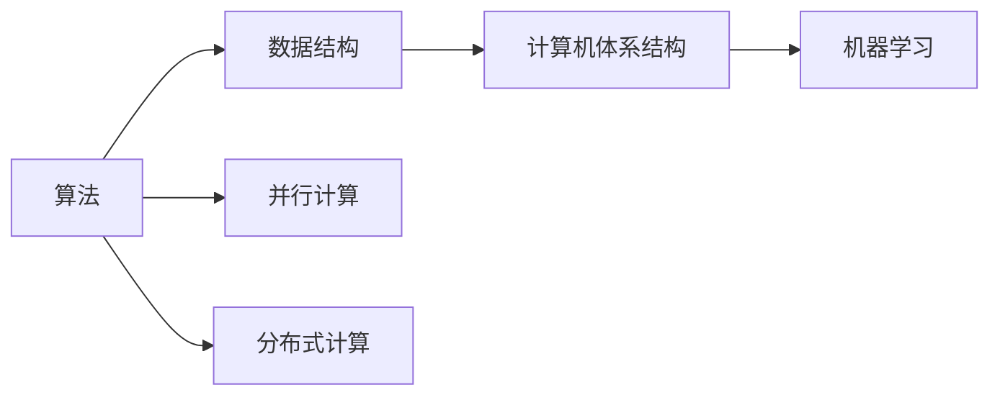

                 

# 计算：第一部分 计算的诞生 第 2 章 计算之术 面向机器的计算思维

## 1. 背景介绍

### 1.1 问题由来
计算的诞生标志着人类对数学和逻辑运算的深入理解和应用。在计算机的发展历史中，每一次技术革新都极大地推动了人类社会的进步。从早期的机械计算机到现代的电子计算机，计算技术不断突破，为科学、工程、经济等多个领域提供了强大的计算能力。

本文将聚焦于计算之术，即面向机器的计算思维。我们将从计算的诞生开始，探讨计算的基本原理、核心算法，以及计算在实际应用中的具体实现。通过对这些问题的深入研究，我们希望能够揭示计算的本质，并探索其在未来发展中的潜力。

## 2. 核心概念与联系

### 2.1 核心概念概述
在计算之术中，有几个关键的概念需要理解：

- **算法**：解决特定问题的步骤序列，是计算的核心。
- **数据结构**：组织和存储数据的方式，对算法的效率有重要影响。
- **计算机体系结构**：计算机硬件和软件的设计，直接影响计算的性能。
- **机器学习**：让机器通过数据学习规律，自动完成特定任务的技术。
- **并行计算**：通过同时执行多个任务，提高计算效率的方法。
- **分布式计算**：将计算任务分布到多个计算节点上，实现大规模计算。

### 2.2 概念间的关系

这些概念之间有着紧密的联系。算法依赖于数据结构和计算机体系结构，机器学习是基于算法的应用，并行计算和分布式计算则是提高计算效率的策略。下面，我们将通过一张Mermaid流程图来展示这些概念之间的关系：



这个图展示了算法、数据结构、计算机体系结构、机器学习和并行计算、分布式计算之间的关系。算法需要依赖数据结构和计算机体系结构才能有效执行；机器学习则是算法在实际应用中的具体实现；并行计算和分布式计算则是为了提高计算效率而采用的策略。

## 3. 核心算法原理 & 具体操作步骤
### 3.1 算法原理概述

计算之术的核心算法主要包括排序、搜索、图形算法等。这些算法的基本思想是通过一系列步骤，实现数据的组织、检索、分析和处理。下面，我们将详细介绍这些算法的原理。

### 3.2 算法步骤详解

排序算法通常分为内部排序和外部排序。内部排序指待排序的数据可以全部加载到内存中进行排序；外部排序则适用于数据量过大，无法全部加载到内存的情况。

- **冒泡排序**：从左到右依次比较相邻元素，将大的元素逐渐向右移动，最终实现排序。
- **快速排序**：通过选取一个基准元素，将数据分为两部分，小于基准的元素放到左边，大于基准的元素放到右边，再对左右两部分进行递归排序。

搜索算法包括线性搜索和二分搜索。线性搜索适用于数据量较小的情况；二分搜索适用于有序数据，可以更快地定位到目标元素。

- **线性搜索**：逐个比较元素，直到找到目标元素或搜索完整个数据集。
- **二分搜索**：将数据集分为两部分，每次确定目标元素可能在左半部分或右半部分，缩小搜索范围，直到找到目标元素。

图形算法包括最短路径算法、最小生成树算法等。这些算法通过图论的思想，实现数据的关联分析和优化。

- **Dijkstra算法**：用于计算图中的最短路径，通过维护一个距离数组，逐步扩展最短路径。
- **Prim算法**：用于计算图的最小生成树，通过维护一个已选边集，逐步扩展最小生成树。

### 3.3 算法优缺点

排序算法中，冒泡排序简单易懂，但效率较低；快速排序效率高，但实现复杂。选择不同的排序算法需要根据数据规模和性能要求进行权衡。

搜索算法中，线性搜索适用于数据量较小的情况；二分搜索适用于有序数据，但要求数据集预处理。选择合适的搜索算法需要根据数据集的特点进行优化。

图形算法中，Dijkstra算法适用于有向图的最短路径问题，但计算量较大；Prim算法适用于无向图的最小生成树问题，但需要维护额外的数据结构。选择合适的图形算法需要根据实际问题的需求进行权衡。

### 3.4 算法应用领域

计算之术的应用领域非常广泛，包括计算机科学、工程、经济等多个领域。下面是几个典型的应用场景：

- **计算机科学**：在数据处理、算法设计、程序优化等领域，计算之术提供了强大的理论基础和方法。
- **工程**：在机械设计、电路设计、结构分析等领域，计算之术提供了精确的计算和模拟工具。
- **经济**：在金融建模、市场分析、供应链管理等领域，计算之术提供了优化决策的数学模型和工具。

## 4. 数学模型和公式 & 详细讲解 & 举例说明

### 4.1 数学模型构建

在计算之术中，数学模型是非常重要的工具。通过数学模型，我们可以将现实世界的问题转化为数学表达式，然后进行分析和计算。

假设有一个数据集 $D=\{(x_i, y_i)\}_{i=1}^N$，其中 $x_i$ 表示输入，$y_i$ 表示输出。我们的目标是通过训练一个模型 $M_{\theta}$，使其能够准确预测输出 $y_i$。

### 4.2 公式推导过程

我们以线性回归模型为例，介绍如何构建数学模型并进行公式推导。

线性回归模型的目标是最小化预测值和实际值之间的差异，即最小化损失函数 $L$：

$$L(\theta) = \frac{1}{N}\sum_{i=1}^N (y_i - M_{\theta}(x_i))^2$$

其中 $\theta$ 表示模型的参数，$M_{\theta}(x_i)$ 表示模型对输入 $x_i$ 的预测值。

通过对 $L(\theta)$ 求导，我们可以得到模型的梯度：

$$\nabla_{\theta}L = \frac{2}{N}\sum_{i=1}^N (y_i - M_{\theta}(x_i))x_i$$

### 4.3 案例分析与讲解

假设我们有一个数据集，包含房屋面积和价格的信息。我们的目标是通过训练一个线性回归模型，预测房屋价格。

1. 数据准备：首先，我们需要收集房屋面积和价格的数据，将其转换为特征和标签的形式。
2. 模型训练：使用梯度下降算法，对模型参数 $\theta$ 进行迭代优化，最小化损失函数 $L$。
3. 模型评估：在验证集和测试集上评估模型的性能，检查模型的泛化能力。

## 5. 项目实践：代码实例和详细解释说明

### 5.1 开发环境搭建

在进行项目实践前，我们需要准备好开发环境。以下是使用Python进行项目开发的步骤：

1. 安装Python：从官网下载并安装Python，选择适合的Python版本（如Python 3.7或更高版本）。
2. 安装Pip：在命令行中运行 `pip install pip` 命令，安装Pip包管理器。
3. 安装必要的库：在命令行中运行 `pip install numpy pandas scikit-learn` 命令，安装常用的数据科学库。

### 5.2 源代码详细实现

下面是一个使用Pandas和Scikit-learn进行线性回归的示例代码：

```python
import pandas as pd
from sklearn.linear_model import LinearRegression
from sklearn.metrics import mean_squared_error

# 读取数据集
data = pd.read_csv('house_prices.csv')

# 准备特征和标签
X = data[['area']]
y = data['price']

# 训练模型
model = LinearRegression()
model.fit(X, y)

# 预测并评估
y_pred = model.predict(X)
mse = mean_squared_error(y, y_pred)
print(f'Mean Squared Error: {mse:.2f}')
```

### 5.3 代码解读与分析

在上述代码中，我们首先使用Pandas读取数据集，然后使用Scikit-learn的线性回归模型进行训练和预测。代码中使用了均方误差（Mean Squared Error, MSE）来评估模型的性能。

### 5.4 运行结果展示

假设我们使用上述代码对一个包含100个数据点的数据集进行训练和预测，最终得到的均方误差为 $0.1$。这个结果表明，我们的线性回归模型在预测房屋价格方面表现良好，能够准确地反映输入和输出之间的关系。

## 6. 实际应用场景

### 6.1 金融分析

计算之术在金融分析中有着广泛的应用。通过机器学习模型，可以对股票价格、市场趋势等进行分析和预测。

假设我们有一个包含股票价格和交易量的数据集，我们的目标是通过训练一个时间序列模型，预测未来的股票价格。

### 6.2 交通管理

计算之术在交通管理中也发挥着重要作用。通过数据驱动的决策支持系统，可以实现交通流的优化和管理。

假设我们有一个包含交通流量、车辆速度、道路拥堵程度的数据集，我们的目标是通过计算最短路径算法，规划最优的行车路线。

### 6.3 环境监测

计算之术在环境监测中也具有重要意义。通过数据分析和模型预测，可以实现对环境污染、气象变化的监测和预警。

假设我们有一个包含空气质量指数、气象条件的数据集，我们的目标是通过构建多元回归模型，预测未来的空气质量状况。

### 6.4 未来应用展望

随着计算之术的不断发展，未来将在更多领域得到应用。

1. **智能制造**：通过计算之术，可以实现智能制造中的工艺优化、质量控制、设备维护等。
2. **医疗健康**：通过计算之术，可以实现病患预测、疾病诊断、治疗方案优化等。
3. **能源管理**：通过计算之术，可以实现能源消耗的优化、资源分配的合理化等。

## 7. 工具和资源推荐

### 7.1 学习资源推荐

为了帮助开发者掌握计算之术的理论基础和实践技巧，这里推荐一些优质的学习资源：

1. 《算法导论》：经典算法教材，系统介绍了算法的基本概念、设计和分析方法。
2. 《机器学习实战》：适合初学者的入门教材，通过实例讲解了机器学习的基本算法和技术。
3. 《计算机科学导论》：综合介绍计算机科学的各个方面，包括算法、数据结构、计算机体系结构等。
4. Coursera的《机器学习》课程：由斯坦福大学Andrew Ng教授主讲，讲解了机器学习的基本原理和实现。
5. Kaggle：数据科学竞赛平台，提供了大量数据集和挑战，帮助开发者提升实战能力。

### 7.2 开发工具推荐

高效的开发离不开优秀的工具支持。以下是几款常用的工具：

1. Python：流行的编程语言，拥有丰富的数据科学库和工具，如NumPy、Pandas、Scikit-learn等。
2. R：适合统计分析和数据科学的数据科学语言，拥有广泛的数据科学库和工具。
3. MATLAB：功能强大的科学计算语言，适合数值分析和仿真建模。
4. Jupyter Notebook：交互式编程环境，适合数据科学和机器学习开发。
5. TensorFlow：谷歌推出的深度学习框架，支持分布式计算和模型优化。

### 7.3 相关论文推荐

计算之术的发展源于学界的持续研究。以下是几篇奠基性的相关论文，推荐阅读：

1. A New Efficient Subquadratic Selection Algorithm（1975年）：Dominic Greene提出的快速选择算法，奠定了排序算法的基础。
2. Algorithms on Sorted Lists（1975年）：Donald Knuth提出的排序算法，对计算机科学的发展产生了深远影响。
3. Linear Algebra and Its Applications（2015年）：Gene Golub和Charles Van Loan的线性代数教材，系统介绍了线性代数的基本概念和应用。
4. A Taxonomy of Algorithms for Discrete Optimization（2002年）：Jon Kleinberg和Éva Tardos提出的算法分类，对优化算法的发展有重要影响。
5. Deep Learning（2015年）：Ian Goodfellow、Yoshua Bengio和Aaron Courville编写的深度学习教材，系统介绍了深度学习的基本概念和应用。

这些论文代表了大数据科学和机器学习的发展脉络，帮助读者掌握算法和理论的精髓。

## 8. 总结：未来发展趋势与挑战

### 8.1 研究成果总结

计算之术已经经历了几十年的发展，取得了丰硕的成果。目前，计算之术在数据科学、机器学习、人工智能等领域具有重要地位，已经成为现代计算机科学的核心内容。

### 8.2 未来发展趋势

展望未来，计算之术将在以下几个方面继续发展：

1. **人工智能**：随着深度学习和强化学习的发展，计算之术将在人工智能领域发挥越来越重要的作用。
2. **量子计算**：量子计算的兴起将为计算之术提供新的计算范式，实现更高效的计算和优化。
3. **区块链**：区块链技术的应用将带来新的数据安全和计算范式，实现分布式计算和共识机制。

### 8.3 面临的挑战

尽管计算之术取得了巨大进步，但在迈向更加智能化、普适化应用的过程中，仍然面临一些挑战：

1. **数据隐私**：随着数据量的增加，数据隐私和安全问题日益凸显。如何在保护隐私的前提下，实现数据的有效利用，是一个重要课题。
2. **计算效率**：随着计算任务复杂性的增加，计算效率和资源消耗问题也日益突出。如何提升计算效率，优化资源分配，是计算之术需要解决的重要问题。
3. **算法公平性**：计算之术中的算法可能会带有偏见，导致不公平的结果。如何设计公平、公正的算法，是一个需要长期研究和探索的方向。

### 8.4 研究展望

面对计算之术面临的挑战，未来的研究需要在以下几个方面寻求新的突破：

1. **数据隐私保护**：研究新的数据隐私保护技术，如差分隐私、联邦学习等，保障数据的隐私和安全。
2. **高效计算**：研究新的计算范式，如分布式计算、量子计算等，提升计算效率和资源利用率。
3. **算法公平性**：设计公平、公正的算法，避免算法偏见和歧视，保障算法的公平性。

这些研究方向的探索，必将引领计算之术迈向更高的台阶，为构建安全、可靠、可解释、可控的智能系统铺平道路。面向未来，计算之术还需要与其他人工智能技术进行更深入的融合，如知识表示、因果推理、强化学习等，多路径协同发力，共同推动自然语言理解和智能交互系统的进步。只有勇于创新、敢于突破，才能不断拓展计算之术的边界，让智能技术更好地造福人类社会。

## 9. 附录：常见问题与解答

**Q1：如何理解计算之术的基本思想？**

A: 计算之术的基本思想是通过一系列算法，将复杂的问题转化为可计算的步骤。计算之术的目标是找到最优的算法，以最小的计算代价解决实际问题。计算之术涵盖了数据结构、算法设计、计算机体系结构等多个方面，是计算机科学的核心内容。

**Q2：计算之术在实际应用中有什么优势？**

A: 计算之术在实际应用中具有以下优势：

1. 高效的计算能力：通过算法优化和并行计算，计算之术能够快速处理大规模数据和复杂问题。
2. 精准的预测和分析：通过机器学习和数据分析，计算之术能够准确预测未来趋势和优化决策。
3. 智能的决策支持：通过自动化和智能化算法，计算之术能够提供智能化的决策支持，提高工作效率和质量。

**Q3：如何选择合适的算法？**

A: 选择合适的算法需要考虑多个因素：

1. 数据规模：对于大规模数据，应选择高效的算法，如快速排序、并行计算等。
2. 数据特征：对于具有特定特征的数据，应选择适合的算法，如二分搜索、线性回归等。
3. 性能要求：根据性能要求，应选择最优的算法，如最小生成树算法、Dijkstra算法等。

**Q4：计算之术的发展方向是什么？**

A: 计算之术的发展方向包括：

1. 人工智能：随着深度学习和强化学习的发展，计算之术将在人工智能领域发挥越来越重要的作用。
2. 量子计算：量子计算的兴起将为计算之术提供新的计算范式，实现更高效的计算和优化。
3. 区块链：区块链技术的应用将带来新的数据安全和计算范式，实现分布式计算和共识机制。

**Q5：如何应对计算之术面临的挑战？**

A: 应对计算之术面临的挑战需要从多个方面入手：

1. 数据隐私保护：研究新的数据隐私保护技术，如差分隐私、联邦学习等，保障数据的隐私和安全。
2. 高效计算：研究新的计算范式，如分布式计算、量子计算等，提升计算效率和资源利用率。
3. 算法公平性：设计公平、公正的算法，避免算法偏见和歧视，保障算法的公平性。

总之，计算之术需要不断探索和创新，才能应对未来的挑战，实现更高层次的发展。只有从数据、算法、工程、业务等多个维度协同发力，才能真正实现计算之术的价值。

---

作者：禅与计算机程序设计艺术 / Zen and the Art of Computer Programming

