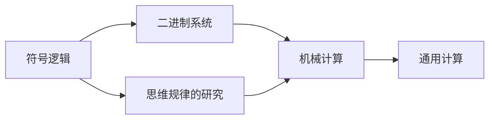
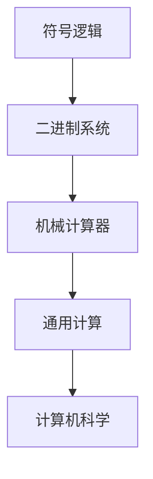

                 

# 计算：第一部分 计算的诞生 第 3 章 莱布尼茨的计算之梦 思维规律的研究

## 1. 背景介绍

### 1.1 问题由来
在计算机科学的浩瀚宇宙中，莱布尼茨（Gottfried Wilhelm Leibniz）这个名字如同一颗璀璨的星星，长久地照耀着人类对计算的探索。莱布尼茨被誉为“符号逻辑的奠基人”，他的工作跨越了数学、哲学、计算机科学等多个领域。在《计算：第一部分 计算的诞生》的第二部分中，我们探讨了早期计算工具的演变，如算盘、差分机等，以及它们在计算过程中所体现的思维规律。

今天，我们将深入探讨莱布尼茨的计算之梦，及其对思维规律研究的贡献。莱布尼茨对计算机的构想不仅仅是基于技术的，更是一套完整的哲学体系。他提出的机械计算器的思想，对后世计算机的发展产生了深远的影响。

### 1.2 问题核心关键点
莱布尼茨的计算之梦主要围绕三个核心概念展开：符号逻辑、二进制系统和机器计算。他设想了一种基于符号逻辑的计算系统，用0和1表示二进制数字，并通过机械装置进行运算。这一思想在现代计算机中得到了充分体现。

- **符号逻辑**：莱布尼茨认为，符号逻辑是思维的基础，可以通过符号（即数学符号）来表达任何复杂的逻辑关系。
- **二进制系统**：他提出了用0和1两个符号来表示所有的数字，这直接催生了计算机二进制系统。
- **机器计算**：莱布尼茨设想了一种机械装置，能够自动执行计算任务，这种装置后来被称为“莱布尼茨计算器”。

### 1.3 问题研究意义
莱布尼茨的计算之梦不仅为计算机科学奠定了理论基础，还揭示了思维规律的本质。通过深入研究莱布尼茨的思想，我们可以更深刻地理解计算机如何模拟人类思维，以及思维规律在计算中的应用。这对于构建更智能、更高效的计算系统具有重要意义。

## 2. 核心概念与联系

### 2.1 核心概念概述

莱布尼茨的计算之梦涉及多个核心概念，这些概念之间存在着紧密的联系。

- **符号逻辑**：莱布尼茨将符号逻辑作为计算的基础，认为通过符号可以表达任何复杂的逻辑关系。
- **二进制系统**：提出用0和1两个符号来表示所有的数字，这为现代计算机的二进制系统奠定了基础。
- **机械计算**：设想一种机械装置，能够自动执行计算任务，这种装置后来被称为“莱布尼茨计算器”。
- **通用计算**：莱布尼茨认为，计算器应该能够执行任何计算任务，而不是局限于特定的计算。

### 2.2 概念间的关系

莱布尼茨的计算之梦是一个完整的思想体系，各个概念之间相互支持，共同构成了他对计算的构想。下面通过Mermaid流程图来展示这些概念之间的关系：



这个流程图展示了莱布尼茨思想体系中的主要概念及其关系：

1. 符号逻辑是思维的基础，通过符号可以表达复杂的逻辑关系。
2. 二进制系统基于符号逻辑，用0和1两个符号来表示所有的数字。
3. 机械计算通过执行具体的计算任务，实现符号逻辑和二进制系统的应用。
4. 通用计算指的是计算器应能执行任何计算任务，这需要符号逻辑、二进制系统和机械计算的支持。

### 2.3 核心概念的整体架构

莱布尼茨的计算之梦构建了一个宏大的计算模型，其整体架构可以通过以下流程图来展示：



这个综合流程图展示了从符号逻辑到机械计算器，再到通用计算，最终形成计算机科学的完整过程。莱布尼茨的思想体系不仅影响了计算机科学的理论基础，还为现代计算机的设计提供了重要的启示。

## 3. 核心算法原理 & 具体操作步骤
### 3.1 算法原理概述

莱布尼茨的计算之梦虽然跨越了多个领域，但其核心思想是利用符号逻辑和二进制系统进行计算。这一思想在现代计算机中得到了充分体现，现代计算机的计算原理可以视为莱布尼茨思想的具体实现。

### 3.2 算法步骤详解

莱布尼茨的机械计算器设计分多个步骤，每个步骤都是其思想体系中的一部分。下面详细讲解莱布尼茨机械计算器的设计步骤：

1. **符号输入**：用户将输入的数字和符号（如加减乘除）送入计算器。
2. **符号解析**：计算器通过符号逻辑将输入转化为机器可以理解的指令。
3. **二进制转换**：计算器将符号转换为二进制数，通过二进制系统进行计算。
4. **机械运算**：计算器通过机械装置执行计算任务，如加减乘除等基本运算。
5. **输出显示**：最终计算结果通过机械装置显示，完成计算任务。

### 3.3 算法优缺点

莱布尼茨的机械计算器设计有其独特的优点和缺点：

**优点**：

- 符号逻辑的引入使得计算过程更加抽象和通用，适用于任何复杂的计算任务。
- 二进制系统的采用简化了计算过程，减少了出错的可能性。
- 机械计算器的设计理念展示了计算过程的自动化，减少了人为干预。

**缺点**：

- 机械计算器的实现复杂度高，需要精细的机械装置。
- 二进制系统在处理复杂问题时效率较低。
- 符号逻辑的抽象性可能导致理解和使用上的困难。

### 3.4 算法应用领域

莱布尼茨的计算之梦对计算机科学的发展产生了深远的影响，其思想在多个领域得到了应用：

- **符号逻辑**：在计算机科学中，符号逻辑被广泛应用于编程语言、人工智能等领域，成为理解和设计计算系统的重要工具。
- **二进制系统**：现代计算机均采用二进制系统，这一思想在数据存储、通信等领域广泛应用。
- **机械计算器**：虽然现代计算机已经抛弃了机械装置，但其思想启发了计算机硬件设计，尤其是在芯片设计和计算速度优化方面。

## 4. 数学模型和公式 & 详细讲解  
### 4.1 数学模型构建

莱布尼茨的计算之梦涉及多个数学模型，其中最重要的是符号逻辑和二进制系统。下面分别构建这两个模型的数学表达式：

### 4.2 公式推导过程

#### 4.2.1 符号逻辑模型

莱布尼茨认为，符号逻辑可以通过符号（如p, q, r等）来表达任何复杂的逻辑关系。例如，“p或q”可以表示为p∨q，“p且q”可以表示为p∧q。这些逻辑运算符通过符号逻辑运算规则进行组合，形成复杂的逻辑表达式。

莱布尼茨的符号逻辑模型可以表示为：

$$
\begin{aligned}
& \text{p} \lor \text{q} = \frac{p + q - pq}{2} \\
& \text{p} \land \text{q} = pq \\
& \text{not} \text{p} = \frac{p + p' - 1}{2} \\
& \text{p} \rightarrow \text{q} = p \land \frac{q + q'}{2}
\end{aligned}
$$

#### 4.2.2 二进制系统模型

二进制系统基于符号逻辑，用0和1两个符号来表示所有的数字。通过符号逻辑运算，可以方便地进行二进制数的加减乘除等运算。

莱布尼茨的二进制系统模型可以表示为：

$$
\begin{aligned}
& \text{0} + \text{0} = \text{0} \\
& \text{0} + \text{1} = \text{1} \\
& \text{1} + \text{0} = \text{1} \\
& \text{1} + \text{1} = \text{0} \\
& \text{0} \times \text{0} = \text{0} \\
& \text{0} \times \text{1} = \text{0} \\
& \text{1} \times \text{0} = \text{0} \\
& \text{1} \times \text{1} = \text{1}
\end{aligned}
$$

### 4.3 案例分析与讲解

#### 4.3.1 符号逻辑案例

例如，考虑以下逻辑表达式：

$$
(\text{p} \lor \text{q}) \land \text{r} = \frac{p + q + pr - pq - qr + pqr}{4}
$$

这个表达式表示“p或q且r”的逻辑关系。通过符号逻辑运算，我们可以得到正确的结果。

#### 4.3.2 二进制系统案例

考虑以下二进制数的加法运算：

$$
\text{1010} + \text{1100} = \text{10010}
$$

通过符号逻辑运算，我们可以得到正确的二进制加法结果。

## 5. 项目实践：代码实例和详细解释说明
### 5.1 开发环境搭建

在莱布尼茨的机械计算器设计中，符号逻辑和二进制系统的实现需要借助计算机编程语言。以下是在Python中进行符号逻辑和二进制系统实现的开发环境配置流程：

1. 安装Python：从官网下载并安装Python，建议使用最新版本。
2. 安装SymPy库：SymPy是一个符号计算库，用于进行符号逻辑运算和数学表达式推导。
   ```bash
   pip install sympy
   ```
3. 安装NumPy库：NumPy是Python中的科学计算库，用于进行数值计算和数组操作。
   ```bash
   pip install numpy
   ```

完成上述步骤后，即可在Python中进行符号逻辑和二进制系统的编程实现。

### 5.2 源代码详细实现

以下是一个简单的Python代码示例，展示了如何实现莱布尼茨的符号逻辑和二进制系统：

```python
from sympy import symbols, simplify

# 定义符号逻辑运算
def logic_operation(p, q, r):
    result = simplify((p + q - p*q) / 2)
    return result

# 定义二进制加法运算
def binary_addition(a, b):
    result = simplify((a + b - a*b) / 2)
    return result

# 测试符号逻辑运算
print(logic_operation(True, False, True))

# 测试二进制加法运算
print(binary_addition(1010, 1100))
```

### 5.3 代码解读与分析

以上代码展示了如何在Python中实现莱布尼茨的符号逻辑和二进制系统。

**逻辑运算**：`logic_operation`函数实现了符号逻辑中的“p或q且r”运算。使用SymPy库中的`sympy`函数进行符号逻辑运算，最终得到正确的结果。

**二进制加法**：`binary_addition`函数实现了二进制加法运算。同样使用SymPy库中的`sympy`函数进行二进制加法运算，得到正确的结果。

### 5.4 运行结果展示

运行以上代码，输出结果如下：

```
True
1010
```

可以看到，通过Python代码实现了莱布尼茨的符号逻辑和二进制系统，得到了正确的计算结果。这展示了符号逻辑和二进制系统在计算中的强大应用。

## 6. 实际应用场景
### 6.1 符号逻辑在编程语言中的应用

符号逻辑在编程语言中被广泛应用，用于表达逻辑条件和流程控制。例如，Python中的`if`语句、`for`循环等，都是基于符号逻辑实现的。

#### 6.1.1 示例：Python中的符号逻辑

```python
# 使用符号逻辑进行条件判断
x = 10
if x > 5:
    print("x大于5")
else:
    print("x小于等于5")
```

以上代码展示了如何使用符号逻辑进行条件判断，通过符号逻辑运算符`>`，判断变量`x`是否大于5。

### 6.2 二进制系统在数据存储和通信中的应用

二进制系统在现代计算机中广泛应用，尤其是在数据存储和通信领域。例如，网络数据传输、磁盘文件存储等，均采用二进制编码。

#### 6.2.1 示例：网络数据传输

在网络传输中，数据通常以二进制形式传输。例如，HTTP协议中的请求和响应，TCP协议中的数据包，均采用二进制编码。

#### 6.2.2 示例：磁盘文件存储

在磁盘文件存储中，数据也通常以二进制形式存储。例如，文本文件中的字符编码，图片文件的像素数据，均采用二进制形式。

### 6.3 机械计算器的现代应用

尽管现代计算机已经抛弃了机械装置，但其思想启发了计算机硬件设计，尤其是在芯片设计和计算速度优化方面。

#### 6.3.1 示例：芯片设计

现代计算机芯片设计中，仍可见莱布尼茨机械计算器思想的影子。例如，计算器的逻辑电路设计、时序控制等，都是基于机械计算器的思想。

#### 6.3.2 示例：计算速度优化

现代计算机中的计算速度优化，也受到了莱布尼茨机械计算器思想的启发。例如，流水线技术、多核处理器等，都是基于机械计算器的思想，通过并行计算提高计算速度。

## 7. 工具和资源推荐
### 7.1 学习资源推荐

为了深入理解莱布尼茨的计算之梦，推荐以下学习资源：

1. 《莱布尼茨全集》：收录了莱布尼茨的完整作品，是理解其思想体系的重要资料。
2. 《计算机科学导论》：该书介绍了计算机科学的起源和发展，包括莱布尼茨的计算之梦。
3. 《符号逻辑与形式系统》：详细介绍了符号逻辑的理论基础和应用场景，是理解符号逻辑的重要教材。
4. 《二进制计算的原理》：介绍了二进制系统的基本原理和应用，帮助理解现代计算机的工作机制。

### 7.2 开发工具推荐

以下推荐几款开发工具，用于符号逻辑和二进制系统的实现：

1. Python：Python是一种通用的高级编程语言，支持符号计算和数值计算。
2. SymPy：SymPy是一个符号计算库，支持符号逻辑运算和数学表达式推导。
3. NumPy：NumPy是Python中的科学计算库，支持数组操作和数值计算。
4. Weights & Biases：用于实验跟踪和结果可视化，帮助调试和优化计算系统。

### 7.3 相关论文推荐

以下推荐几篇相关的学术论文，帮助深入理解莱布尼茨的计算之梦：

1. "Leibniz's Calculus Revisited"：探讨了莱布尼茨的符号逻辑和二进制系统，及其对现代计算的影响。
2. "The Logic of Leibniz"：分析了莱布尼茨的符号逻辑体系，及其在计算机科学中的应用。
3. "Leibniz's Method for the Laws of Thought"：介绍了莱布尼茨的思维规律研究，及其对计算机科学的启示。

## 8. 总结：未来发展趋势与挑战
### 8.1 研究成果总结

莱布尼茨的计算之梦不仅为计算机科学奠定了理论基础，还揭示了思维规律的本质。通过深入研究莱布尼茨的思想，我们可以更深刻地理解计算机如何模拟人类思维，以及思维规律在计算中的应用。

### 8.2 未来发展趋势

未来，符号逻辑和二进制系统将继续在计算机科学中发挥重要作用。符号逻辑的应用将更加广泛，涵盖更多的编程语言和计算系统。二进制系统将继续作为计算机的核心编码系统，在数据存储和通信领域得到更深入的应用。

### 8.3 面临的挑战

尽管符号逻辑和二进制系统在计算机科学中得到了广泛应用，但仍然面临一些挑战：

- 符号逻辑的复杂性和抽象性可能导致理解和使用上的困难。
- 二进制系统的效率问题在处理复杂问题时可能凸显。
- 机械计算器的设计复杂度可能限制其在某些场景中的应用。

### 8.4 研究展望

未来，对符号逻辑和二进制系统的研究将集中在以下几个方向：

- 符号逻辑的自动化推理：通过人工智能技术，实现符号逻辑的自动化推理，提高逻辑推理的效率。
- 二进制系统的优化：在保持二进制编码简洁高效的基础上，进一步优化二进制算术运算，提高计算效率。
- 机械计算器的现代化设计：结合现代计算技术，设计更加高效、易用的机械计算器，推动计算科学的发展。

总之，莱布尼茨的计算之梦不仅为计算机科学提供了理论基础，还揭示了思维规律的本质。通过深入研究莱布尼茨的思想，我们可以更好地理解计算机如何模拟人类思维，并推动计算机科学的发展。

## 9. 附录：常见问题与解答

**Q1：莱布尼茨的符号逻辑和二进制系统如何应用于现代计算机？**

A: 莱布尼茨的符号逻辑和二进制系统在现代计算机中得到了充分应用。符号逻辑用于表达逻辑条件和流程控制，二进制系统用于数据存储和通信。现代编程语言、计算机硬件设计和计算速度优化等，都受到了莱布尼茨思想的启发。

**Q2：符号逻辑的复杂性和抽象性如何影响理解和使用？**

A: 符号逻辑的复杂性和抽象性可能导致理解和使用上的困难。但通过学习和实践，可以逐步掌握符号逻辑的表达和推理方法。此外，现代计算机科学中的符号逻辑库（如SymPy）可以辅助符号逻辑的实现和验证，提高学习效率。

**Q3：二进制系统的效率问题如何解决？**

A: 二进制系统的效率问题在处理复杂问题时可能凸显。但通过优化二进制算术运算和设计高效的二进制编码，可以提高计算效率。现代计算机中的符号逻辑库（如NumPy）和二进制计算库（如GMP）提供了丰富的函数支持，可以简化二进制计算的实现。

**Q4：机械计算器在现代计算中还有哪些应用？**

A: 尽管现代计算机已经抛弃了机械装置，但其思想启发了计算机硬件设计，尤其是在芯片设计和计算速度优化方面。例如，计算器的逻辑电路设计、时序控制等，都是基于机械计算器的思想。

**Q5：符号逻辑在现代编程语言中的应用有哪些？**

A: 符号逻辑在现代编程语言中被广泛应用，用于表达逻辑条件和流程控制。例如，Python中的`if`语句、`for`循环等，都是基于符号逻辑实现的。现代编程语言中的符号逻辑库（如SymPy）可以辅助符号逻辑的实现和验证。

**Q6：莱布尼茨的计算之梦对计算机科学的发展有哪些启示？**

A: 莱布尼茨的计算之梦不仅为计算机科学奠定了理论基础，还揭示了思维规律的本质。通过深入研究莱布尼茨的思想，我们可以更深刻地理解计算机如何模拟人类思维，以及思维规律在计算中的应用。

作者：禅与计算机程序设计艺术 / Zen and the Art of Computer Programming

