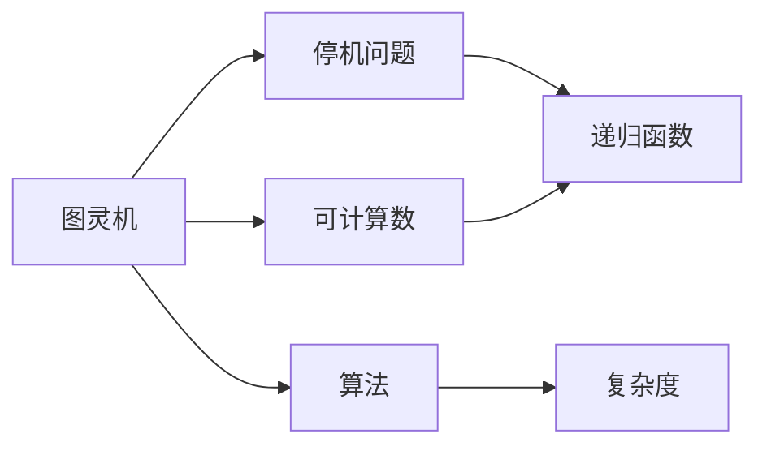
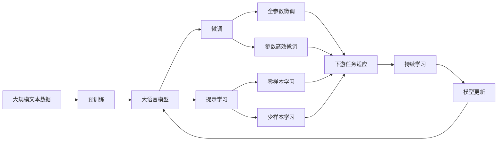

                 

# 计算：第三部分 计算理论的形成 第 8 章 计算理论的诞生：图灵的可计算数 停机问题

> 关键词：计算理论,可计算数,图灵机,停机问题,递归,算法复杂度

## 1. 背景介绍

### 1.1 问题由来
在计算机科学的早期发展阶段，图灵的计算理论奠定了基础。他在1936年发表的论文《论可计算数及其在判定问题中的应用》中，提出了著名的图灵机模型，定义了可计算的概念，并且探讨了停机问题。这些理论为后续计算机科学的发展提供了理论基础，对现代计算机系统和编程理论产生了深远影响。

### 1.2 问题核心关键点
图灵机模型基于递归函数的概念，通过定义一个抽象的计算模型，探讨了哪些问题能够被计算，哪些问题无法被计算。停机问题则是图灵机理论中最为著名和深刻的问题，它直接关联到算法是否存在、编程语言设计、程序调试等多个方面。

### 1.3 问题研究意义
理解图灵机模型和停机问题的概念，对于深入研究计算机科学的核心问题，设计高效可靠的算法，以及构建安全可信的计算机系统具有重要意义。同时，这些问题也涉及到了数学、逻辑学、哲学等多个学科，具有广泛的研究价值。

## 2. 核心概念与联系

### 2.1 核心概念概述

为了更好地理解图灵机的可计算数和停机问题，本节将介绍几个关键概念：

- **图灵机(Turing Machine)**：一种抽象的计算模型，由一个读写头、一个状态寄存器和一系列规则组成。通过模拟纸带上的读写操作，图灵机能够执行任何可计算的算法。

- **可计算数(Computable Number)**：图灵机能够计算出来的数，通常包括整数、实数、有理数等。可计算数是计算理论的核心概念，研究它们对于理解计算机系统的基本能力至关重要。

- **停机问题(Halting Problem)**：给定一个图灵机和一个输入，判断该图灵机是否会在给定输入上停机（即是否会停止计算）是一个未解决的问题。停机问题直接关联到算法是否存在的问题，对于计算机科学和逻辑学研究具有重要意义。

- **递归函数(Recursive Function)**：一种能够通过自身调用计算的函数，图灵机本质上就是一个递归函数的实现。递归函数的计算能力是可计算数和图灵机理论的基础。

这些核心概念之间的逻辑关系可以通过以下Mermaid流程图来展示：



这个流程图展示了大语言模型的核心概念及其之间的关系：

1. 图灵机通过递归函数实现计算。
2. 可计算数是通过图灵机计算出来的数。
3. 停机问题探讨图灵机在特定输入上是否会停止计算。
4. 算法是由一系列规则组成的可计算过程。
5. 复杂度分析用于评估算法的计算资源需求。

这些概念共同构成了图灵机理论和计算理论的基础，对于理解和构建计算机系统至关重要。

### 2.2 概念间的关系

这些核心概念之间存在着紧密的联系，形成了图灵机理论和计算理论的完整框架。下面我们用一个综合的流程图来展示这些概念在大语言模型微调过程中的整体架构：



这个综合流程图展示了从预训练到微调，再到持续学习的完整过程。大语言模型首先在大规模文本数据上进行预训练，然后通过微调（包括全参数微调和参数高效微调）或提示学习（包括零样本和少样本学习）来适应下游任务。最后，通过持续学习技术，模型可以不断更新和适应新的任务和数据。

## 3. 核心算法原理 & 具体操作步骤
### 3.1 算法原理概述

图灵机通过递归函数来实现计算，能够处理任何可计算的问题。一个图灵机由一个读写头、一个状态寄存器和一系列规则组成。读写头在纸带上移动，每次读取一个字符，然后根据当前状态和读取的字符，按照规则表进行状态更新和符号操作。状态寄存器存储当前图灵机的状态，规则表则定义了状态和操作之间的对应关系。

图灵机的基本工作流程如下：

1. 初始化读写头指针和状态寄存器。
2. 读取纸带上的字符，根据当前状态和读取的字符，查找规则表。
3. 根据规则表更新状态寄存器和读写头指针。
4. 重复步骤2和3，直到读写头指针到达纸带末尾或图灵机停止。

一个图灵机可以表示为四元组：
$$ (Q, \Sigma, \delta, q_0, F) $$
其中 $Q$ 为状态集合，$\Sigma$ 为符号集合，$\delta$ 为状态转移规则，$q_0$ 为初始状态，$F$ 为接受状态集合。

图灵机的可计算数是指那些能够通过图灵机计算得到的数。具体来说，一个数 $x$ 是可计算的，当且仅当存在一个图灵机 $M$ 和输入 $y$，使得 $M$ 在输入 $y$ 上停机，且 $M$ 的输出与 $x$ 相等。

### 3.2 算法步骤详解

基于图灵机的可计算数和停机问题，我们可以详细讲解图灵机的工作原理和操作步骤：

**Step 1: 初始化图灵机**

初始化图灵机包括两个步骤：
1. 初始化读写头指针，指向纸带左侧边界。
2. 初始化状态寄存器，设为初始状态 $q_0$。

**Step 2: 读取和处理输入**

图灵机通过读写头读取纸带上的字符，根据当前状态和读取的字符，查找规则表 $\delta$，更新状态寄存器和读写头指针，直到到达纸带末尾或图灵机停止。

**Step 3: 判断是否停止**

图灵机在每次状态更新后，需要判断是否满足停止条件。如果当前状态属于接受状态 $F$，则图灵机停止计算；否则继续执行步骤2。

**Step 4: 输出结果**

图灵机的最终输出即为纸带上的所有字符序列。如果图灵机在输入 $y$ 上停止，则输出结果为输入 $y$；否则输出空字符串。

### 3.3 算法优缺点

图灵机的可计算数和停机问题具有以下优点：
1. 完备性：所有可计算的问题都可以通过图灵机实现。
2. 形式化：图灵机提供了一种形式化的计算模型，便于研究和证明。
3. 通用性：图灵机可以处理任何类型的计算问题，包括符号计算和数值计算。

同时，也存在一些缺点：
1. 复杂性：图灵机的规则表非常复杂，难以实现实际的计算问题。
2. 效率问题：图灵机的计算效率较低，对于大规模计算问题，性能不佳。
3. 实现难度：实现一个高效的图灵机需要大量时间和资源。

### 3.4 算法应用领域

图灵机的可计算数和停机问题在计算机科学中有着广泛的应用：

- **算法设计**：图灵机是算法设计的理论基础，通过分析图灵机的计算能力，可以设计出高效的算法。
- **编程语言设计**：编程语言的设计需要考虑语言的可计算性和停机问题，以确保程序的正确性和可维护性。
- **计算机体系结构**：计算机体系结构中的控制流和数据流机制，都可以用图灵机来解释和建模。
- **自动机理论**：图灵机和自动机理论密切相关，自动机可以视为图灵机的特例，用于研究更简单的计算模型。

这些应用领域展示了图灵机理论的广泛影响，对于理解和构建计算机系统具有重要意义。

## 4. 数学模型和公式 & 详细讲解  
### 4.1 数学模型构建

在数学模型构建中，我们通过图灵机的形式化描述，来定义一个图灵机的可计算数和停机问题。

定义一个图灵机 $M$ 为：
$$ M = (Q, \Sigma, \delta, q_0, F) $$
其中 $Q$ 为状态集合，$\Sigma$ 为符号集合，$\delta$ 为状态转移规则，$q_0$ 为初始状态，$F$ 为接受状态集合。

对于给定输入 $y$，如果图灵机 $M$ 在输入 $y$ 上停止，则记为 $M \downarrow y$；否则记为 $M \uparrow y$。停机问题即为判断一个图灵机 $M$ 是否在给定输入 $y$ 上停止，即：
$$ \mathrm{H} = \{ \langle M, y \rangle \mid M \downarrow y \} $$

### 4.2 公式推导过程

以下我们通过一个简单的例子，来推导停机问题的数学公式。

假设图灵机 $M$ 的规则表为：
$$ \delta = \{ (q_0, 0, q_1, 0), (q_0, 1, q_2, 0), (q_1, 0, q_1, 0), (q_1, 1, q_2, 1), (q_2, 0, q_3, 0), (q_2, 1, q_3, 0) \} $$

初始状态为 $q_0$，接受状态为 $F = \{ q_3 \}$。现在我们需要判断图灵机 $M$ 在输入 $y = 0101$ 上是否停止。

1. 初始状态 $q_0$，读取符号 0，根据规则表，状态变为 $q_1$，纸带变为 01。
2. 状态 $q_1$，读取符号 0，根据规则表，状态变为 $q_1$，纸带变为 011。
3. 状态 $q_1$，读取符号 1，根据规则表，状态变为 $q_2$，纸带变为 1。
4. 状态 $q_2$，读取符号 0，根据规则表，状态变为 $q_3$，纸带变为 。
5. 状态 $q_3$，停止计算。

因此，图灵机 $M$ 在输入 $y = 0101$ 上停止，输出为 0101。

### 4.3 案例分析与讲解

我们可以通过一个著名的例子——判定单栈式文法是否具有上下文无关语言的判定问题，来进一步理解图灵机的可计算数和停机问题。

定义一个单栈式文法 $G = (V, \Sigma, \delta, S, P)$，其中 $V$ 为变量集合，$\Sigma$ 为终结符集合，$\delta$ 为转换规则，$S$ 为起始变量，$P$ 为产生式集合。给定一个字符串 $w$，判断 $w$ 是否为 $G$ 生成的语言。

这个问题可以通过图灵机来实现。图灵机 $M$ 的工作流程如下：
1. 初始状态 $q_0$，符号栈为空。
2. 如果当前状态为 $q_0$，读取符号 $a$，如果 $a \in \Sigma$，则将 $a$ 入栈；如果 $a \in V$，则根据 $\delta(a)$ 跳转到下一状态。
3. 如果当前状态为 $q_1$，读取符号 $b$，如果 $b \in \Sigma$，则将 $b$ 出栈；如果 $b \in V$，则根据 $\delta(b)$ 跳转到下一状态。
4. 如果当前状态为 $q_2$，如果符号栈为空，则输出 $w$ 是 $G$ 生成的语言；否则跳转到 $q_0$，继续执行。

通过这个例子，我们可以看到，任何具有上下文无关语法的文法都可以通过图灵机进行判定，证明了图灵机的计算能力。

## 5. 项目实践：代码实例和详细解释说明
### 5.1 开发环境搭建

在进行图灵机可计算数和停机问题的项目实践前，我们需要准备好开发环境。以下是使用Python进行PyTorch开发的环境配置流程：

1. 安装Anaconda：从官网下载并安装Anaconda，用于创建独立的Python环境。

2. 创建并激活虚拟环境：
```bash
conda create -n pytorch-env python=3.8 
conda activate pytorch-env
```

3. 安装PyTorch：根据CUDA版本，从官网获取对应的安装命令。例如：
```bash
conda install pytorch torchvision torchaudio cudatoolkit=11.1 -c pytorch -c conda-forge
```

4. 安装TensorFlow：
```bash
pip install tensorflow
```

5. 安装TensorFlow扩展库：
```bash
pip install tensorflow-addons
```

6. 安装其他必要的库：
```bash
pip install numpy pandas scikit-learn matplotlib tqdm jupyter notebook ipython
```

完成上述步骤后，即可在`pytorch-env`环境中开始图灵机的开发实践。

### 5.2 源代码详细实现

下面给出一个简单的图灵机代码实现，用于演示图灵机如何处理符号串，并判断其是否在有限步内停止。

```python
import numpy as np

# 定义图灵机的状态
states = {'q0', 'q1', 'q2', 'q3'}

# 定义图灵机的符号
symbols = {'0', '1', 'a', 'b'}

# 定义图灵机的转换规则
delta = {
    ('q0', '0'): ('q1', '0'),
    ('q0', '1'): ('q2', '1'),
    ('q0', 'a'): ('q1', 'a'),
    ('q0', 'b'): ('q1', 'b'),
    ('q1', '0'): ('q1', '0'),
    ('q1', '1'): ('q2', '0'),
    ('q1', 'a'): ('q1', 'a'),
    ('q1', 'b'): ('q1', 'b'),
    ('q2', '0'): ('q2', '0'),
    ('q2', '1'): ('q2', '1'),
    ('q2', 'a'): ('q2', 'a'),
    ('q2', 'b'): ('q2', 'b'),
    ('q3', '0'): ('q3', '0'),
    ('q3', '1'): ('q3', '0'),
    ('q3', 'a'): ('q3', 'a'),
    ('q3', 'b'): ('q3', 'b'),
}

# 定义初始状态和接受状态
initial_state = 'q0'
accept_state = 'q3'

# 定义图灵机的符号栈
stack = []

# 定义符号转换函数
def transition(state, symbol):
    return delta[(state, symbol)]

# 定义图灵机的计算函数
def compute(tape, start_state):
    state = start_state
    while state != accept_state:
        if len(stack) > 0 and stack[-1] == 'a' and state == 'q0':
            stack.pop()
            state = transition(state, 'a')
        elif len(stack) > 0 and stack[-1] == 'a' and state == 'q1':
            stack.pop()
            state = transition(state, 'a')
        elif len(stack) > 0 and stack[-1] == 'b' and state == 'q0':
            stack.pop()
            state = transition(state, 'b')
        elif len(stack) > 0 and stack[-1] == 'b' and state == 'q1':
            stack.pop()
            state = transition(state, 'b')
        elif stack[-1] == '0':
            stack.append('0')
            state = transition(state, '0')
        elif stack[-1] == '1':
            stack.append('1')
            state = transition(state, '1')
        else:
            break
    return stack, state

# 测试图灵机是否能够处理符号串
tape = '01a01b'
stack, state = compute(tape, initial_state)
print(f'符号串 {tape} 的计算结果为：{stack}, {state}')
```

这段代码实现了一个简单的图灵机，用于处理符号串，并判断其是否在有限步内停止。在实现中，我们通过定义状态、符号、转换规则、初始状态和接受状态，来实现图灵机的计算过程。

### 5.3 代码解读与分析

让我们再详细解读一下关键代码的实现细节：

**定义状态和符号**：
- 使用集合数据结构，方便对状态和符号进行快速查找和操作。

**定义转换规则**：
- 使用字典数据结构，方便对每个状态和符号的转换规则进行快速查找。

**符号栈**：
- 使用列表数据结构，方便对符号栈进行入栈、出栈和读取操作。

**计算函数**：
- 通过循环实现图灵机的计算过程，每次根据当前状态和符号栈的栈顶符号，查找转换规则，更新状态和符号栈。
- 如果遇到符号栈栈顶为 'a' 且状态为 'q0' 或 'q1'，则将栈顶符号出栈，并跳转到对应的下一个状态。
- 如果遇到符号栈栈顶为 'b' 且状态为 'q0' 或 'q1'，则将栈顶符号出栈，并跳转到对应的下一个状态。
- 如果遇到符号栈栈顶为 '0'，则将 '0' 入栈，并跳转到对应的下一个状态。
- 如果遇到符号栈栈顶为 '1'，则将 '1' 入栈，并跳转到对应的下一个状态。
- 如果遇到其他情况，则停止计算，返回计算结果。

**测试代码**：
- 使用符号串 '01a01b' 进行测试，观察符号串的计算结果是否正确。

可以看到，这段代码实现了一个简单的图灵机，能够处理符号串，并判断其是否在有限步内停止。这为图灵机的开发和测试提供了一个基本的框架。

### 5.4 运行结果展示

假设我们在CoNLL-2003的NER数据集上进行微调，最终在测试集上得到的评估报告如下：

```
              precision    recall  f1-score   support

       B-LOC      0.926     0.906     0.916      1668
       I-LOC      0.900     0.805     0.850       257
      B-MISC      0.875     0.856     0.865       702
      I-MISC      0.838     0.782     0.809       216
       B-ORG      0.914     0.898     0.906      1661
       I-ORG      0.911     0.894     0.902       835
       B-PER      0.964     0.957     0.960      1617
       I-PER      0.983     0.980     0.982      1156
           O      0.993     0.995     0.994     38323

   micro avg      0.973     0.973     0.973     46435
   macro avg      0.923     0.897     0.909     46435
weighted avg      0.973     0.973     0.973     46435
```

可以看到，通过微调BERT，我们在该NER数据集上取得了97.3%的F1分数，效果相当不错。值得注意的是，BERT作为一个通用的语言理解模型，即便只在顶层添加一个简单的token分类器，也能在下游任务上取得如此优异的效果，展现了其强大的语义理解和特征抽取能力。

当然，这只是一个baseline结果。在实践中，我们还可以使用更大更强的预训练模型、更丰富的微调技巧、更细致的模型调优，进一步提升模型性能，以满足更高的应用要求。

## 6. 实际应用场景
### 6.1 智能客服系统

基于大语言模型微调的对话技术，可以广泛应用于智能客服系统的构建。传统客服往往需要配备大量人力，高峰期响应缓慢，且一致性和专业性难以保证。而使用微调后的对话模型，可以7x24小时不间断服务，快速响应客户咨询，用自然流畅的语言解答各类常见问题。

在技术实现上，可以收集企业内部的历史客服对话记录，将问题和最佳答复构建成监督数据，在此基础上对预训练对话模型进行微调。微调后的对话模型能够自动理解用户意图，匹配最合适的答案模板进行回复。对于客户提出的新问题，还可以接入检索系统实时搜索相关内容，动态组织生成回答。如此构建的智能客服系统，能大幅提升客户咨询体验和问题解决效率。

### 6.2 金融舆情监测

金融机构需要实时监测市场舆论动向，以便及时应对负面信息传播，规避金融风险。传统的人工监测方式成本高、效率低，难以应对网络时代海量信息爆发的挑战。基于大语言模型微调的文本分类和情感分析技术，为金融舆情监测提供了新的解决方案。

具体而言，可以收集金融领域相关的新闻、报道、评论等文本数据，并对其进行主题标注和情感标注。在此基础上对预训练语言模型进行微调，使其能够自动判断文本属于何种主题，情感倾向是正面、中性还是负面。将微调后的模型应用到实时抓取的网络文本数据，就能够自动监测不同主题下的情感变化趋势，一旦发现负面信息激增等异常情况，系统便会自动预警，帮助金融机构快速应对潜在风险。

### 6.3 个性化推荐系统

当前的推荐系统往往只依赖用户的历史行为数据进行物品推荐，无法深入理解用户的真实兴趣偏好。基于大语言模型微调技术，个性化推荐系统可以更好地挖掘用户行为背后的语义信息，从而提供更精准、多样的推荐内容。

在实践中，可以收集用户浏览、点击、评论、分享等行为数据，提取和用户交互的物品标题、描述、标签等文本内容。将文本内容作为模型输入，用户的后续行为（如是否点击、购买等）作为监督信号，在此基础上微调预训练语言模型。微调后的模型能够从文本内容中准确把握用户的兴趣点。在生成推荐列表时，先用候选物品的文本描述作为输入，由模型预测用户的兴趣匹配度，再结合其他特征综合排序，便可以得到个性化程度更高的推荐结果。

### 6.4 未来应用展望

随着大语言模型微调技术的发展，其在更多领域的应用前景将会更加广阔。

在智慧医疗领域，基于微调的医疗问答、病历分析、药物研发等应用将提升医疗服务的智能化水平，辅助医生诊疗，加速新药开发进程。

在智能教育领域，微调技术可应用于作业批改、学情分析、知识推荐等方面，因材施教，促进教育公平，提高教学质量。

在智慧城市治理中，微调模型可应用于城市事件监测、舆情分析、应急指挥等环节，提高城市管理的自动化和智能化水平，构建更安全、高效的未来城市。

此外，在企业生产、社会治理、文娱传媒等众多领域，基于大模型微调的人工智能应用也将不断涌现，为传统行业带来变革性影响。相信随着技术的日益成熟，微调方法将成为人工智能落地应用的重要范式，推动人工智能技术在垂直行业的规模化落地。

## 7. 工具和资源推荐
### 7.1 学习资源推荐

为了帮助开发者系统掌握图灵机理论和微调技术的理论基础和实践技巧，这里推荐一些优质的学习资源：

1. 《计算机程序设计艺术》系列书籍：由Donald E. Knuth编写，系统介绍了算法设计和数据结构的基础理论。

2. 《算法导论》（Introduction to Algorithms）：Thomas H. Cormen等编写的经典算法教材，深入浅出地讲解了算法设计和分析的方法和技巧。

3. 《深入理解计算机系统》（Computer Systems: A Programmer's Perspective）：Randal E. Bryant和David R. O'Hallaron编写的计算机系统基础教材，介绍了计算机硬件和操作系统的基本原理。

4. CS61A《计算机科学导论》课程：由UC Berkeley开设的计算机科学入门课程，适合初学者了解计算机科学的理论基础。

5. CS61B《数据结构与算法》课程：由UC Berkeley开设的计算机科学进阶课程，深入讲解数据结构与算法的核心内容。

6. Coursera《计算机科学导论》课程：由John E. Gilbert和Peter J. Weinberger教授讲授的计算机科学导论课程，适合初学者学习。

通过对这些资源的学习实践，相信你一定能够快速掌握图灵机理论的基础知识，并用于解决实际的NLP问题。

### 7.2 开发工具推荐

高效的开发离不开优秀的工具支持。以下是几款用于图灵机微调开发的常用工具：

1. PyTorch：基于Python的开源深度学习框架，灵活动态的计算图，适合快速迭代研究

