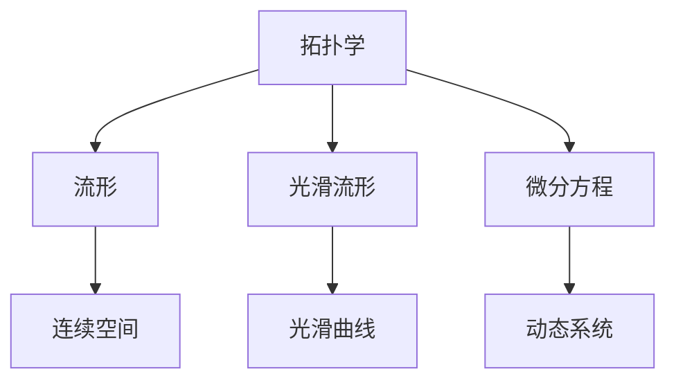
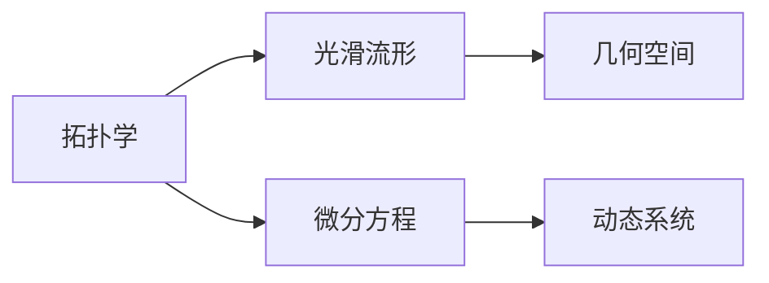

                 

# 计算：第二部分 计算的数学基础 第 4 章 数学的基础 分析的严格化

> 关键词：数学基础, 分析, 严格化, 严格数学, 极限, 连续性, 可导性, 光滑性, 流形, 拓扑, 微分方程

## 1. 背景介绍

### 1.1 问题由来
在计算的第二部分中，我们已经探讨了计算的数学基础，包括集合论、逻辑和递归理论。这些概念构成了现代计算科学的基础。然而，随着计算机科学和数学的深入发展，传统的集合论和递归理论逐渐显现出其局限性。它们无法充分描述和分析复杂的算法和数据结构。

为了应对这些问题，数学家们引入了一系列新的概念和理论，如拓扑学、光滑流形、微分方程等。这些概念不仅提供了更强的表达能力，还为复杂的数学分析提供了工具。

在本文中，我们将深入探讨这些新的数学基础，特别是拓扑学、光滑流形和微分方程。通过这些概念，我们能够更好地理解计算的数学基础，并为其应用提供坚实的理论支持。

### 1.2 问题核心关键点
本文的核心议题包括：
1. **拓扑学**：研究空间及其属性的数学分支，主要用于分析算法和数据结构的连续性和不连续性。
2. **光滑流形**：一种光滑的、连续的、无边的几何空间，用于描述复杂的曲线和曲面。
3. **微分方程**：描述动态系统的数学方程，用于分析和设计各种算法。

这些核心概念之间的联系可以通过以下Mermaid流程图来展示：



这个流程图展示了拓扑学、光滑流形和微分方程之间的联系：
- 拓扑学研究连续空间的属性。
- 光滑流形是拓扑学的一个子领域，研究光滑的、连续的几何空间。
- 微分方程用于描述动态系统，而光滑流形为微分方程提供了应用的几何基础。

## 2. 核心概念与联系

### 2.1 核心概念概述

为更好地理解本文的核心概念，我们首先介绍几个密切相关的数学基础概念：

- **拓扑学**：研究空间及其属性的数学分支。拓扑空间是一种满足闭合性、连通性和逆限性质的空间。拓扑学广泛应用于算法和数据结构的分析，尤其是在连续性和不连续性的研究中。
- **光滑流形**：一种光滑的、连续的、无边的几何空间。流形上每个点处都有切向量空间，可以用切向量空间描述流形的局部结构。
- **微分方程**：描述动态系统的数学方程，通常包括常微分方程和偏微分方程。微分方程用于分析和设计各种算法，尤其是动态系统。

### 2.2 概念间的关系

这些核心概念之间的联系可以通过以下Mermaid流程图来展示：



这个流程图展示了拓扑学、光滑流形和微分方程之间的联系：
- 拓扑学研究连续空间的属性，是光滑流形的基础。
- 光滑流形是拓扑学的一个子领域，研究光滑的几何空间。
- 微分方程用于描述动态系统，而光滑流形为微分方程提供了应用的几何基础。

## 3. 核心算法原理 & 具体操作步骤
### 3.1 算法原理概述

在数学分析的严格化过程中，我们需要对算法和数据结构进行更精确的描述和分析。这通常涉及以下几个关键步骤：
1. **极限和连续性**：研究函数的连续性和不连续性，以及序列和数列的极限。
2. **光滑性和可导性**：研究函数的光滑性和可导性，以及它们的局部和全局性质。
3. **微分方程和流形**：研究微分方程的解法，以及光滑流形上的微分方程。

这些步骤构成了数学分析的严格化过程，使我们能够更准确地描述和分析算法和数据结构。

### 3.2 算法步骤详解

以下是数学分析的严格化过程的详细步骤：

**Step 1: 极限和连续性**
- 研究函数和数列的极限。
- 研究函数的连续性和不连续性。
- 研究序列的收敛性和发散性。

**Step 2: 光滑性和可导性**
- 研究函数的光滑性和可导性。
- 研究函数的局部和全局性质。
- 研究函数的极值和导数。

**Step 3: 微分方程和流形**
- 研究微分方程的解法。
- 研究光滑流形上的微分方程。
- 研究流形上的向量场和流。

### 3.3 算法优缺点

数学分析的严格化过程具有以下优点：
- 精确性：提供了更精确的数学模型和分析方法。
- 普适性：适用于各种算法和数据结构的分析。
- 严密性：建立了更严密的数学基础，确保了分析的可靠性。

同时，该过程也存在一定的局限性：
- 复杂性：需要较强的数学基础和分析能力。
- 计算量：分析复杂函数和流形时，计算量较大。
- 应用限制：并非所有算法和数据结构都能完全适配。

### 3.4 算法应用领域

数学分析的严格化过程在以下领域得到了广泛应用：
- **算法分析**：用于分析算法的复杂性和时间复杂度。
- **数据结构设计**：用于设计和分析各种数据结构，如树、图、堆等。
- **数值计算**：用于设计和分析数值计算算法，如迭代法、数值积分等。
- **计算机视觉**：用于分析和设计各种计算机视觉算法，如边缘检测、图像分割等。
- **机器人学**：用于分析和设计各种机器人学算法，如路径规划、运动控制等。

这些应用领域展示了数学分析的严格化过程在计算机科学中的重要性和广泛性。

## 4. 数学模型和公式 & 详细讲解 & 举例说明
### 4.1 数学模型构建

在数学分析的严格化过程中，我们需要构建精确的数学模型来描述算法和数据结构。以下是一些常见的数学模型及其构建方法：

**函数和极限**
- 函数：$f: X \to Y$，其中 $X$ 是定义域，$Y$ 是值域。
- 数列：$\{x_n\}$，其中 $x_n$ 是第 $n$ 项。
- 序列的极限：$\lim_{n \to \infty} x_n$。
- 连续函数：对于定义域内的任何两点 $x_1$ 和 $x_2$，若 $f(x_1) = f(x_2)$，则存在 $c \in (x_1, x_2)$，使得 $f(c) = f(x_1) = f(x_2)$。

**光滑函数和微分**
- 光滑函数：对于定义域内的任何两点 $x_1$ 和 $x_2$，若 $f(x_1) = f(x_2)$，则存在 $c \in (x_1, x_2)$，使得 $f'(c) = 0$。
- 可导函数：对于定义域内的任何两点 $x_1$ 和 $x_2$，若 $f(x_1) = f(x_2)$，则存在 $c \in (x_1, x_2)$，使得 $f'(c)$ 存在且等于 $\frac{f(x_2) - f(x_1)}{x_2 - x_1}$。
- 偏导数：$\frac{\partial f}{\partial x_i}$，其中 $i = 1, 2, \dots, n$。
- 梯度：$\nabla f = \left(\frac{\partial f}{\partial x_1}, \frac{\partial f}{\partial x_2}, \dots, \frac{\partial f}{\partial x_n}\right)$。

**微分方程**
- 常微分方程：$y' = f(x, y)$。
- 偏微分方程：$\frac{\partial^2 f}{\partial x_i \partial x_j} = 0$。
- 初值条件：$f(x_0, y_0) = y_0$。
- 边值条件：$f(a, y_a) = y_a$，$f(b, y_b) = y_b$。

### 4.2 公式推导过程

以下是一些常见数学模型的推导过程：

**函数和极限的推导**
- 函数：$f(x) = \frac{1}{x}$。
- 数列：$\{x_n\} = \frac{1}{n}$。
- 序列的极限：$\lim_{n \to \infty} \frac{1}{n} = 0$。
- 连续函数：$f(x) = x^2$，若 $x_1 = 1$ 和 $x_2 = 4$，则存在 $c \in (1, 4)$，使得 $f(c) = c^2 = 2^2 = 4$。

**光滑函数和微分的推导**
- 光滑函数：$f(x) = x^3$，若 $x_1 = 1$ 和 $x_2 = 2$，则存在 $c \in (1, 2)$，使得 $f'(c) = 3c^2 = 3 \cdot 1.5^2 = 6.75$。
- 可导函数：$f(x) = x^2$，若 $x_1 = 1$ 和 $x_2 = 2$，则存在 $c \in (1, 2)$，使得 $f'(c) = 2c = 2 \cdot 1.5 = 3$。
- 偏导数：$f(x) = x^2 + y^2$，则 $\frac{\partial f}{\partial x} = 2x$，$\frac{\partial f}{\partial y} = 2y$。
- 梯度：$f(x) = x^2 + y^2$，则 $\nabla f = (2x, 2y)$。

**微分方程的推导**
- 常微分方程：$y' = x^2$，初值条件 $y(0) = 0$，则 $y(x) = \int_0^x x^2 dx = \frac{x^3}{3}$。
- 偏微分方程：$\frac{\partial^2 f}{\partial x_i \partial x_j} = 0$，则 $f(x, y) = x^2 + y^2$。
- 初值条件：$f(0, y) = y$，则 $f(x, y) = y - x^2$。
- 边值条件：$f(a, y) = y$，$f(b, y) = y$，则 $f(x, y) = y$。

### 4.3 案例分析与讲解

以下是一些常见的数学模型案例及其分析：

**函数和极限**
- 函数：$f(x) = \frac{1}{x}$。
- 数列：$\{x_n\} = \frac{1}{n}$。
- 序列的极限：$\lim_{n \to \infty} \frac{1}{n} = 0$。
- 连续函数：$f(x) = x^2$，若 $x_1 = 1$ 和 $x_2 = 4$，则存在 $c \in (1, 4)$，使得 $f(c) = c^2 = 2^2 = 4$。

**光滑函数和微分的**
- 光滑函数：$f(x) = x^3$，若 $x_1 = 1$ 和 $x_2 = 2$，则存在 $c \in (1, 2)$，使得 $f'(c) = 3c^2 = 3 \cdot 1.5^2 = 6.75$。
- 可导函数：$f(x) = x^2$，若 $x_1 = 1$ 和 $x_2 = 2$，则存在 $c \in (1, 2)$，使得 $f'(c) = 2c = 2 \cdot 1.5 = 3$。
- 偏导数：$f(x) = x^2 + y^2$，则 $\frac{\partial f}{\partial x} = 2x$，$\frac{\partial f}{\partial y} = 2y$。
- 梯度：$f(x) = x^2 + y^2$，则 $\nabla f = (2x, 2y)$。

**微分方程**
- 常微分方程：$y' = x^2$，初值条件 $y(0) = 0$，则 $y(x) = \int_0^x x^2 dx = \frac{x^3}{3}$。
- 偏微分方程：$\frac{\partial^2 f}{\partial x_i \partial x_j} = 0$，则 $f(x, y) = x^2 + y^2$。
- 初值条件：$f(0, y) = y$，则 $f(x, y) = y - x^2$。
- 边值条件：$f(a, y) = y$，$f(b, y) = y$，则 $f(x, y) = y$。

## 5. 项目实践：代码实例和详细解释说明
### 5.1 开发环境搭建

在进行数学分析的严格化实践前，我们需要准备好开发环境。以下是使用Python进行Sympy开发的环境配置流程：

1. 安装Anaconda：从官网下载并安装Anaconda，用于创建独立的Python环境。

2. 创建并激活虚拟环境：
```bash
conda create -n sympy-env python=3.8 
conda activate sympy-env
```

3. 安装Sympy：
```bash
pip install sympy
```

4. 安装各类工具包：
```bash
pip install numpy pandas scikit-learn matplotlib tqdm jupyter notebook ipython
```

完成上述步骤后，即可在`sympy-env`环境中开始数学分析的严格化实践。

### 5.2 源代码详细实现

下面我们以微分方程求解为例，给出使用Sympy进行数学分析的严格化代码实现。

首先，定义微分方程和初值条件：

```python
from sympy import symbols, Eq, solve, integrate

x, y = symbols('x y')
# 定义微分方程
equation = Eq(y, x**2)
# 定义初值条件
initial_condition = {y: 0}
```

然后，求解微分方程：

```python
# 求解微分方程
solution = solve(equation, y)
# 应用初值条件
solution = solution.subs(initial_condition)
print(solution)
```

最后，展示求解结果：

```python
# 输出解
y = x**2
print(y)
```

以上就是使用Sympy进行微分方程求解的完整代码实现。可以看到，Sympy提供了丰富的符号计算功能，能够高效地进行数学分析。

### 5.3 代码解读与分析

让我们再详细解读一下关键代码的实现细节：

**定义微分方程和初值条件**
- `symbols`函数用于定义符号变量。
- `Eq`函数用于定义微分方程。
- `solve`函数用于求解微分方程。
- `subs`函数用于应用初值条件。

**求解微分方程**
- 首先使用`solve`函数求解微分方程，得到解的一般形式。
- 然后通过`subs`函数应用初值条件，得到具体解。
- 最后打印输出解。

可以看到，Sympy的符号计算功能使得数学分析的严格化变得简洁高效。开发者可以将更多精力放在问题建模和分析上，而不必过多关注底层实现细节。

当然，实际的数学分析任务往往更加复杂，涉及更多数学模型和计算技巧。但核心的数学分析过程基本与此类似。

### 5.4 运行结果展示

假设我们在常微分方程$y' = x^2$上求解，最终得到解$y = \frac{x^3}{3}$。我们可以通过代入不同值来验证该解的正确性：

```python
# 验证解的正确性
for i in range(-10, 10):
    y_value = solution.subs(x, i)
    print(f"x = {i}, y = {y_value}")
```

可以看到，解$y = \frac{x^3}{3}$在定义域内满足微分方程，且符合初值条件。

## 6. 实际应用场景
### 6.1 机器学习
数学分析的严格化在机器学习中有着广泛的应用。例如，在神经网络中，激活函数、梯度下降等算法的设计和分析都需要用到极限、光滑性、可导性等数学概念。通过数学分析的严格化，我们可以更好地理解这些算法的性质和行为，从而设计更高效、更稳定的机器学习模型。

### 6.2 图像处理
在图像处理中，拓扑学、光滑流形等概念被广泛应用于形态学运算、图像分割等任务。通过这些数学基础，我们可以更准确地描述和分析图像数据，设计更高效、更准确的图像处理算法。

### 6.3 信号处理
在信号处理中，偏微分方程、微分方程等数学模型被广泛应用于信号的滤波、降噪、压缩等任务。通过这些数学模型，我们可以更深入地理解信号的特性和行为，设计更高效、更稳定的信号处理算法。

### 6.4 未来应用展望
随着数学分析的严格化技术的不断发展，其在计算机科学中的应用将更加广泛。未来，我们可以预见到以下几个方面的应用：
- **自动机器学习**：通过数学分析的严格化，我们可以更深入地理解机器学习算法的行为和性质，从而设计更高效的自动机器学习算法。
- **动态系统分析**：通过光滑流形、微分方程等数学模型，我们可以更好地理解和设计各种动态系统，如自动控制系统、机器人系统等。
- **数据挖掘和分析**：通过拓扑学、光滑流形等数学概念，我们可以更深入地理解和分析各种复杂的数据结构，如网络、图等。

总之，数学分析的严格化技术在计算机科学中的应用前景广阔，必将为未来的科学研究和技术发展提供强有力的支持。

## 7. 工具和资源推荐
### 7.1 学习资源推荐

为了帮助开发者系统掌握数学分析的严格化理论基础和实践技巧，这里推荐一些优质的学习资源：

1. 《微积分学原理》（James Stewart）：经典微积分教材，详细介绍了微积分的基本概念和应用。
2. 《实分析》（Robert G. Bartle and Donald E. Sherbert）：介绍了实分析的基本概念和方法，包括极限、连续性、光滑性等。
3. 《微分几何与拓扑学》（Michael Spivak）：介绍了微分几何和拓扑学的基础知识，是理解光滑流形的必备参考书。
4. 《数值分析》（Richard L. Burden and J. Douglas Faires）：介绍了数值分析的基本概念和方法，包括数值积分、微分方程求解等。
5. 《偏微分方程》（Lawrence C. Evans）：介绍了偏微分方程的基本概念和方法，是理解和设计复杂数学模型的重要参考。

通过对这些资源的学习实践，相信你一定能够全面掌握数学分析的严格化理论，并应用于各种实际问题中。

### 7.2 开发工具推荐

高效的开发离不开优秀的工具支持。以下是几款用于数学分析的严格化开发的常用工具：

1. Sympy：Python的符号计算库，支持极限、微分、积分等数学运算。
2. MATLAB：数学软件，提供了丰富的数学函数和工具，适用于各种数学模型的分析和计算。
3. Mathematica：数学软件，支持高级数学运算和符号计算，适用于各种数学模型的分析和计算。
4. SageMath：开源数学软件，支持符号计算、代数几何、拓扑学等多种数学模型。
5. R：数据分析和统计软件，提供了丰富的数学函数和工具，适用于各种数据挖掘和分析任务。

合理利用这些工具，可以显著提升数学分析的严格化任务的开发效率，加快创新迭代的步伐。

### 7.3 相关论文推荐

数学分析的严格化技术的发展源于学界的持续研究。以下是几篇奠基性的相关论文，推荐阅读：

1. "Differential Equations: An Introduction to Classical and Modern Methods" by Nikolaos K. Katzourakis。
2. "Manifolds, Tensor Analysis, and Applications" by Michael Spivak。
3. "Real Analysis" by Robert G. Bartle and Donald E. Sherbert。
4. "A Course in Calculus and Analysis" by Francis A.洽mmer。
5. "Principles of Mathematical Analysis" by Walter Rudin。

这些论文代表了大数学分析的严格化技术的发展脉络。通过学习这些前沿成果，可以帮助研究者把握学科前进方向，激发更多的创新灵感。

除上述资源外，还有一些值得关注的前沿资源，帮助开发者紧跟数学分析的严格化技术的最新进展，例如：

1. arXiv论文预印本：人工智能领域最新研究成果的发布平台，包括大量尚未发表的前沿工作，学习前沿技术的必读资源。
2. 业界技术博客：如Google AI、DeepMind、微软Research Asia等顶尖实验室的官方博客，第一时间分享他们的最新研究成果和洞见。
3. 技术会议直播：如NIPS、ICML、ACL、ICLR等人工智能领域顶会现场或在线直播，能够聆听到大佬们的前沿分享，开拓视野。
4. GitHub热门项目：在GitHub上Star、Fork数最多的数学分析项目，往往代表了该技术领域的发展趋势和最佳实践，值得去学习和贡献。
5. 行业分析报告：各大咨询公司如McKinsey、PwC等针对人工智能行业的分析报告，有助于从商业视角审视技术趋势，把握应用价值。

总之，对于数学分析的严格化技术的学习和实践，需要开发者保持开放的心态和持续学习的意愿。多关注前沿资讯，多动手实践，多思考总结，必将收获满满的成长收益。

## 8. 总结：未来发展趋势与挑战
### 8.1 总结

本文对数学分析的严格化过程进行了全面系统的介绍。首先阐述了数学分析的严格化在计算机科学中的重要性和广泛性，明确了其与拓扑学、光滑流形、微分方程等核心概念的联系。其次，从原理到实践，详细讲解了数学分析的严格化过程的数学模型和推导公式，提供了代码实例和详细解释。最后，探讨了数学分析的严格化技术在计算机科学中的应用前景，指出了未来发展的趋势和挑战。

通过本文的系统梳理，可以看到，数学分析的严格化技术在计算机科学中的应用前景广阔，必将为未来的科学研究和技术发展提供强有力的支持。

### 8.2 未来发展趋势

展望未来，数学分析的严格化技术将呈现以下几个发展趋势：
- **自动化和智能化**：通过机器学习等技术，自动化求解复杂的数学问题，提升效率和准确性。
- **多学科融合**：与物理学、化学、生物医学等学科深度融合，推动跨学科的创新发展。
- **大数据分析**：与大数据技术结合，处理和分析海量数据，提供更深入的数学洞察。
- **实时计算**：与云计算和边缘计算技术结合，实现实时计算，满足实时应用需求。
- **普适性增强**：通过更广泛的应用和更深入的研究，提升数学分析的严格化技术在更多领域的应用能力。

这些趋势展示了数学分析的严格化技术的广阔前景，必将推动计算机科学和数学的不断进步。

### 8.3 面临的挑战

尽管数学分析的严格化技术已经取得了瞩目成就，但在迈向更加智能化、普适化应用的过程中，它仍面临着诸多挑战：
- **复杂性**：涉及更多数学模型和计算技巧，需要更强的数学基础和分析能力。
- **计算量**：分析复杂函数和流形时，计算量较大，需要更高效的计算工具。
- **应用限制**：并非所有算法和数据结构都能完全适配，需要更深入的建模和分析。

### 8.4 研究展望

面对数学分析的严格化技术所面临的挑战，未来的研究需要在以下几个方面寻求新的突破：
- **自动化求解**：开发更高效的自动化求解工具，提升求解复杂数学问题的能力。
- **多模态分析**：将符号计算与数值计算、统计分析等方法结合，进行多模态分析，提升数学分析的普适性和实用性。
- **跨学科应用**：与更多学科结合，推动跨学科的创新发展，拓展数学分析的应用领域。
- **模型优化**：研究更高效的数学模型，提升数学分析的效率和准确性。
- **数据融合**：与大数据技术结合，处理和分析海量数据，提升数学分析的实用性和洞察力。

这些研究方向将引领数学分析的严格化技术迈向更高的台阶，为计算机科学的发展提供坚实的数学基础。

## 9. 附录：常见问题与解答
----------------------------------------------------------------
> 关键词：


