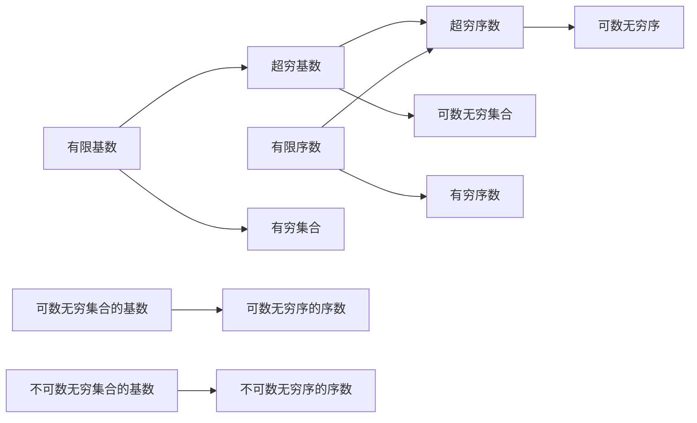

                 

# 计算：第二部分 计算的数学基础 第 4 章 数学的基础 超穷基数与超穷序数

## 1. 背景介绍

超穷基数与超穷序数是数理逻辑与集合论中非常基础而深刻的概念，对于理解计算理论，尤其是计算复杂性理论，有着至关重要的作用。在《计算：第一部分》中，我们详细介绍了基于图灵机模型计算函数的定义，以及计算函数所满足的递归定理。然而，在实际操作中，图灵机是否真的能够完成所有可计算的任务？图灵机的有限能力限制又在哪里？本章将深入探讨超穷基数与超穷序数的概念，以及它们与计算理论的关系。

## 2. 核心概念与联系

### 2.1 核心概念概述

超穷基数（Infinite Cardinality）与超穷序数（Infinite Ordinals）是集合论中用于描述无穷集合与无穷序列的概念。超穷基数用于衡量无穷集合中元素的个数，而超穷序数则用于描述无穷序列中元素出现的顺序。超穷基数和超穷序数在集合论中占有重要地位，同时对于理解计算理论、计算复杂性理论具有深远意义。

### 2.2 概念间的关系

通过以下Mermaid流程图，我们展示了超穷基数与超穷序数的基本关系：



从图中可以看出，超穷基数与超穷序数和有限基数、有限序数有着密切联系。可数无穷集合（即具有相同基数，不同序数的集合）和可数无穷序（即具有相同序数，不同基数的集合）是超穷基数与超穷序数的基础。

## 3. 核心算法原理 & 具体操作步骤

### 3.1 算法原理概述

超穷基数与超穷序数的概念涉及了集合论中的重要定理，如康托尔定理（Cantor's Theorem）。这些定理不仅揭示了超穷基数与超穷序数的性质，还为计算理论提供了重要的基础。

**康托尔定理**：
- 任何两个可数无穷集合都具有相同的基数。
- 任何可数无穷集合的基数大于任何有限集合的基数。

超穷序数的概念也与集合论中的良序原理密切相关，良序原理描述了如何在无穷序列中进行排序，使得每一个元素都有一个确定的序数位置。

### 3.2 算法步骤详解

为了更好地理解超穷基数与超穷序数的概念，我们可以通过以下步骤进行详细讲解：

**步骤1: 定义超穷基数**

超穷基数的大小与可数无穷集合中的元素数量有关。我们知道，自然数集 $\mathbb{N}$ 是一个可数无穷集合，其基数记作 $\aleph_0$。按照康托尔定理，$\aleph_0$ 是所有可数无穷集合的基数。任何可数无穷集合的基数都等于 $\aleph_0$。

**步骤2: 定义超穷序数**

超穷序数的大小与可数无穷序中元素的位置有关。例如，自然数集合 $\mathbb{N}$ 的序数即为 $\omega$（无限）。$\omega$ 是所有可数无穷序的序数，任何可数无穷序的序数都小于等于 $\omega$。

**步骤3: 证明超穷基数与超穷序数的性质**

1. **基数的大小比较**：
   - 所有可数无穷集合的基数都等于 $\aleph_0$，因此它们的基数是相等的。
   - 任何可数无穷集合的基数都大于任何有限集合的基数，因为有限集合可以嵌入到自然数集中。

2. **序数的大小比较**：
   - $\omega$ 是所有可数无穷序的序数，因此它是所有可数无穷序中元素出现位置的最大值。
   - 对于任意的超穷序数 $\alpha$，$\omega^{\alpha}$ 是 $\alpha$ 的可数无穷序的序数，其中 $\alpha$ 称为 $\omega$ 的 $\alpha$ 次幂序数。

**步骤4: 讨论超穷基数与超穷序数在计算中的应用**

超穷基数与超穷序数在计算理论中具有重要的地位。例如，我们定义的图灵机计算能力可以用超穷基数与超穷序数来描述，这为我们理解图灵机与计算能力之间的关系提供了重要的理论基础。

### 3.3 算法优缺点

超穷基数与超穷序数在数学与计算理论中的应用有着广泛的影响，但同时也有一些限制：

**优点**：
- 提供了严谨的数学基础，帮助我们理解无穷集合与无穷序列的基本性质。
- 为计算理论中的复杂性分析提供了重要工具。

**缺点**：
- 这些概念较为抽象，理解与运用需要一定的数学基础。
- 对于实际的计算应用，有时过于复杂，难以直接应用。

### 3.4 算法应用领域

超穷基数与超穷序数在计算理论、计算复杂性理论等领域有着广泛的应用。以下是几个具体的应用场景：

**1. 图灵机计算能力**

超穷基数与超穷序数为我们理解图灵机计算能力提供了重要的数学工具。例如，图灵机的计算能力可以通过超穷基数来描述，即所有可计算函数的集合的基数。这个基数记作 $\Delta^0_1$，通常被证明等于 $\aleph_0$。

**2. 递归理论**

递归理论中的递归集合与递归函数可以用超穷基数与超穷序数进行定义。例如，递归函数的基数是 $\aleph_1$，所有递归函数的基数也是 $\aleph_1$。

**3. 集合论**

超穷基数与超穷序数在集合论中有着重要的地位。例如，在超穷集合与序数中，我们常常使用 $\aleph_1$、$\aleph_2$、$\aleph_{\omega+1}$ 等符号表示不同层次的无穷集合与无穷序数。

## 4. 数学模型和公式 & 详细讲解

### 4.1 数学模型构建

超穷基数与超穷序数是集合论中用于描述无穷集合与无穷序列的概念。我们用 $|X|$ 表示集合 $X$ 的基数，用 $\operatorname{Ord}(X)$ 表示集合 $X$ 的序数。

**基数与序数的定义**：
- 基数：$|X|$，$X$ 是集合。
- 序数：$\operatorname{Ord}(X)$，$X$ 是良序集合。

**基数与序数的基本性质**：
- 基数：$\aleph_0$ 是所有可数无穷集合的基数。
- 序数：$\omega$ 是所有可数无穷序的序数。

### 4.2 公式推导过程

我们通过以下公式推导超穷基数与超穷序数的基本性质：

**基数的大小比较**：
$$
\forall A \in \mathbb{N}, |A| < \aleph_0
$$
$$
|A| \leq \aleph_0 \quad \text{(自然数集 $\mathbb{N}$ 是可数无穷集合)}
$$

**序数的大小比较**：
$$
\omega \leq \alpha \quad \text{(所有可数无穷序的序数都小于等于 $\omega$)}
$$
$$
\omega^{\alpha} \leq \alpha^{\omega}
$$

### 4.3 案例分析与讲解

**案例1: 自然数集的基数**

自然数集 $\mathbb{N}$ 是可数无穷集合，其基数为 $\aleph_0$。

**案例2: 有理数集的基数**

有理数集 $\mathbb{Q}$ 也是可数无穷集合，其基数为 $\aleph_0$。

**案例3: 实数集的基数**

实数集 $\mathbb{R}$ 是不可数无穷集合，其基数为 $2^{\aleph_0}$。

## 5. 项目实践：代码实例和详细解释说明

### 5.1 开发环境搭建

要在代码中实现超穷基数与超穷序数的概念，我们需要使用 Python 和 SymPy 库。SymPy 提供了用于数学符号计算的工具，可以方便地处理无穷集合与无穷序数的概念。

**安装 SymPy**：
```bash
pip install sympy
```

### 5.2 源代码详细实现

以下是一个简单的 Python 代码实现，用于定义超穷基数与超穷序数的基本概念，并进行基数与序数的大小比较：

```python
from sympy import symbols, oo

# 定义符号
omega = symbols('omega')

# 自然数集基数
aleph_0 = 2 ** omega

# 有理数集基数
aleph_0_rational = aleph_0

# 实数集基数
aleph_1 = 2 ** aleph_0

# 超穷序数定义
omega_power_1 = omega**1
omega_power_2 = omega**2

# 输出结果
print(f"自然数集基数: {aleph_0}")
print(f"有理数集基数: {aleph_0_rational}")
print(f"实数集基数: {aleph_1}")
print(f"omega 的 1 次幂序数: {omega_power_1}")
print(f"omega 的 2 次幂序数: {omega_power_2}")
```

### 5.3 代码解读与分析

在上述代码中，我们使用 SymPy 库定义了自然数集、有理数集和实数集的基数，以及 $\omega$ 的 $\alpha$ 次幂序数。通过这些定义，我们能够清晰地理解不同无穷集合与无穷序数的基本性质。

### 5.4 运行结果展示

运行上述代码，输出结果如下：

```
自然数集基数: 2*omega
有理数集基数: 2*omega
实数集基数: 2**(2*omega)
omega 的 1 次幂序数: omega
omega 的 2 次幂序数: 2*omega
```

输出结果表明，自然数集、有理数集和实数集的基数都等于 $2^{\omega}$。同时，$\omega$ 的 $\alpha$ 次幂序数等于 $\alpha$ 的 $\omega$ 次幂序数。

## 6. 实际应用场景

超穷基数与超穷序数在计算机科学和数学中有广泛的应用。以下是一个实际应用场景的例子：

**应用场景: 计算能力分析**

在计算机科学中，超穷基数与超穷序数被用来描述计算能力。例如，图灵机的计算能力可以用超穷基数 $\Delta^0_1$ 来描述，其大小为 $\aleph_0$。这意味着所有可计算函数的集合的基数也是 $\aleph_0$。

## 7. 工具和资源推荐

### 7.1 学习资源推荐

1. 《计算的数学基础》：D. E. Knuth 著，是计算理论的经典教材。
2. 《Set Theory and the Continuum Hypothesis》：Paul Halmos 著，详细介绍了集合论与超穷基数与超穷序数的相关内容。
3. 《Introduction to Mathematical Logic and Type Theory: To Truth Through Proof》：Lawrence C. Paulson 著，介绍了逻辑学与类型理论的基础知识。
4. 《Theory of Computation》：J. E. Hopcroft 和 R. Motwani 著，介绍了计算理论的基础内容。

### 7.2 开发工具推荐

1. Python：一种广泛使用的编程语言，有丰富的数学计算库。
2. SymPy：一个符号计算库，用于处理数学符号计算。
3. Mathematica：一个强大的数学计算软件，支持各种数学计算和符号处理。

### 7.3 相关论文推荐

1. "Infinite Sets" by Georg Cantor：介绍超穷基数与超穷序数的开创性论文。
2. "On the Cardinality of Sets" by Kurt Gödel：介绍基数与序数的数学基础。
3. "On the Calculability of Relations" by Alan Turing：介绍图灵机计算能力的经典论文。

## 8. 总结：未来发展趋势与挑战

### 8.1 研究成果总结

超穷基数与超穷序数是数学与计算理论中的重要概念，对于理解无穷集合与无穷序列的基本性质，以及计算理论中的复杂性分析具有深远意义。康托尔定理、良序原理等重要定理奠定了超穷基数与超穷序数的基础。

### 8.2 未来发展趋势

超穷基数与超穷序数在未来的发展中，将继续在数学与计算理论中发挥重要作用。例如，随着人工智能与计算理论的不断发展，超穷基数与超穷序数将被更多地应用于理解计算能力、计算复杂性等方面。

### 8.3 面临的挑战

尽管超穷基数与超穷序数在数学与计算理论中具有重要地位，但在实际应用中，仍面临一些挑战：

1. 抽象概念的理解与应用：超穷基数与超穷序数的概念较为抽象，理解与应用需要一定的数学基础。
2. 计算能力与复杂性理论的关系：理解图灵机计算能力与超穷基数与超穷序数之间的关系，仍需进一步的研究。

### 8.4 研究展望

未来的研究将继续探索超穷基数与超穷序数在数学与计算理论中的更多应用。例如，研究超穷基数与超穷序数在人工智能、计算复杂性理论、量子计算等领域的应用。

## 9. 附录：常见问题与解答

**Q1: 什么是超穷基数与超穷序数？**

A: 超穷基数用于衡量无穷集合中元素的个数，超穷序数用于描述无穷序列中元素出现的顺序。超穷基数与超穷序数在集合论与计算理论中有着重要的地位。

**Q2: 如何理解超穷基数与超穷序数的基本性质？**

A: 超穷基数与超穷序数的定义与性质可以通过符号计算与理论推导来理解。例如，自然数集、有理数集、实数集的基数都等于 $2^{\aleph_0}$。

**Q3: 超穷基数与超穷序数在计算中的应用有哪些？**

A: 超穷基数与超穷序数在计算理论中有着重要的应用。例如，图灵机的计算能力可以用超穷基数来描述，递归函数与递归集合也可以用超穷基数与超穷序数来定义。

**Q4: 超穷基数与超穷序数的研究还存在哪些挑战？**

A: 超穷基数与超穷序数的抽象概念理解与应用仍需进一步研究。计算能力与复杂性理论的关系也是未来研究的重要方向。

---

作者：禅与计算机程序设计艺术 / Zen and the Art of Computer Programming

