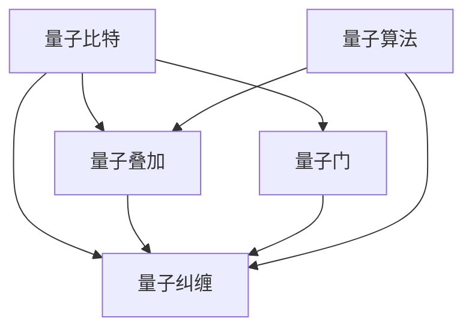
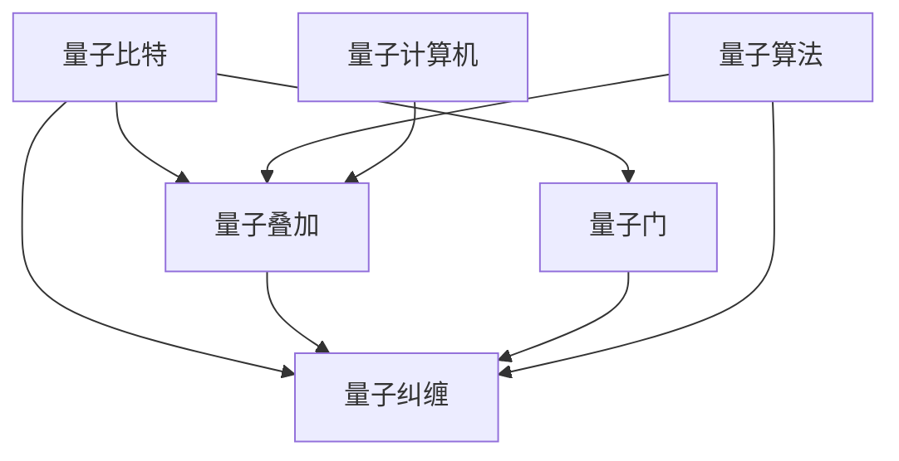

                 

# 计算：第四部分 计算的极限 第 10 章 量子计算 量子计算的启蒙

## 1. 背景介绍

### 1.1 问题由来

量子计算是21世纪计算科学的革命性突破，被视为解决传统计算机无法处理的复杂问题的新途径。经典计算机使用二进制位（0和1）进行计算，而量子计算机利用量子比特（qubits）进行计算。量子比特能同时表示0和1，这种特性称为叠加态，能够大大提高计算效率。

近年来，IBM、Google等大型科技公司已经成功展示了量子计算的潜力。IBM的Q System One 和Google的Sycamore实现了超过50位的量子计算，超越了经典计算机的计算能力。这些成就表明，量子计算即将成为计算领域的下一个里程碑。

尽管如此，量子计算距离实际应用仍有一段距离。当前，量子计算的主要挑战包括量子比特的稳定性、量子纠缠的维持、错误率的控制和纠错机制的构建等。这些技术的进步将进一步推动量子计算的发展。

### 1.2 问题核心关键点

量子计算的核心在于量子比特的物理实现和量子算法的开发。目前，量子比特的实现技术主要包括超导量子比特、离子阱量子比特、量子点量子比特等。量子算法则是通过量子比特的量子叠加和量子纠缠，在特定问题上比经典算法有显著的计算优势。

量子计算的突破依赖于量子物理学的发展，如量子纠缠、量子隐形传态、量子非局域性等。其中，量子纠缠是量子计算的基础，用于实现量子通信和量子计算的核心算法，如量子傅里叶变换和Shor算法。

### 1.3 问题研究意义

量子计算的探索不仅具有理论意义，还在实际应用中展现出巨大的潜力。量子计算有望在药物设计、材料科学、密码破解、优化问题、机器学习等领域取得突破。量子计算机可以模拟和预测化学反应，设计新材料，破解复杂的加密算法，优化复杂的系统，加速机器学习模型的训练等。

量子计算的这些应用场景为解决当前科技领域的前沿问题提供了新的手段。通过量子计算，可以显著提升计算效率，推动科技的发展和社会的进步。因此，量子计算的研究具有重要的理论和应用价值。

## 2. 核心概念与联系

### 2.1 核心概念概述

量子计算的核心概念包括量子比特、量子叠加、量子纠缠、量子门、量子算法等。

- 量子比特：量子计算的基本单位，类似于经典计算的二进制位，可以处于0、1或者叠加态。
- 量子叠加：量子比特可以同时处于0和1的叠加态，表示为 $| \psi \rangle = \alpha | 0 \rangle + \beta | 1 \rangle$，其中 $\alpha$ 和 $\beta$ 是复数，满足 $|\alpha|^2 + |\beta|^2 = 1$。
- 量子纠缠：多个量子比特可以处于纠缠态，即使量子比特之间相隔很远，状态改变后也会即时影响其他量子比特的状态。
- 量子门：量子计算中的操作，通过量子比特的变换实现特定计算。量子门分为单比特门和双比特门，单比特门作用于单个量子比特，双比特门作用于两个量子比特。
- 量子算法：基于量子比特的量子计算算法，如Shor算法、Grover算法等，能够在特定问题上显著提升计算效率。

这些核心概念通过量子物理学的基本原理和量子计算机的硬件实现，构成了一个完整的量子计算体系。量子计算的原理与经典计算有显著差异，需要全新的算法和模型来处理量子比特和量子叠加。

### 2.2 概念间的关系

量子计算的核心概念之间存在紧密的联系，构成了一个完整的计算模型。以下是这些概念之间的关系：



这个流程图展示了量子计算的核心概念之间的关系：

1. 量子比特是量子计算的基本单位，通过叠加和纠缠实现量子计算。
2. 量子叠加使得量子比特能够同时表示多个状态，用于提高计算效率。
3. 量子纠缠使得多个量子比特之间存在关联，用于实现量子通信和计算。
4. 量子门用于量子比特的变换，实现量子计算的核心操作。
5. 量子算法基于量子比特和量子门，在特定问题上提高计算效率。

### 2.3 核心概念的整体架构

量子计算的整体架构可以简化为以下几个部分：



这个整体架构展示了量子计算的基本流程：

1. 量子比特通过叠加和纠缠实现量子计算。
2. 量子门用于量子比特的变换，实现量子计算的核心操作。
3. 量子算法基于量子比特和量子门，在特定问题上提高计算效率。
4. 量子计算机是量子计算的物理实现，通过量子比特和量子门进行计算。

## 3. 核心算法原理 & 具体操作步骤

### 3.1 算法原理概述

量子计算的核心算法包括Shor算法和Grover算法。

- Shor算法：用于分解大整数，实现大数分解问题的高效求解，是量子计算中最著名的算法之一。Shor算法的时间复杂度为 $O(\log^3 N)$，远低于传统计算机的指数级复杂度 $O(N^{1/3})$。
- Grover算法：用于搜索未排序的数据库，实现搜索问题的高效求解。Grover算法的时间复杂度为 $O(\sqrt{N})$，远低于传统计算机的线性复杂度 $O(N)$。

这两个算法展示了量子计算在特定问题上的显著优势。Shor算法和Grover算法的主要原理是利用量子叠加和量子纠缠，实现高效的计算过程。

### 3.2 算法步骤详解

以下是Shor算法的详细步骤：

1. 初始化量子比特和经典比特，将大整数 $N$ 分解为 $N = a \times b$，其中 $a$ 和 $b$ 均为质数。
2. 利用Hadamard门将量子比特初始化为叠加态 $|0\rangle$。
3. 重复以下步骤 $O(\log^3 N)$ 次：
   - 利用Grover迭代器，根据 $|x\rangle = a^x\bmod N$ 对 $a$ 进行模 $N$ 运算。
   - 利用傅里叶变换，将模 $N$ 运算的结果进行逆变换，得到 $x$ 的概率分布。
   - 利用量子测量，得到 $x$ 的值。
4. 利用经典算法分解 $N$ 为 $a$ 和 $b$，即得到 $N$ 的质因数分解。

Shor算法的关键步骤是Grover迭代器和傅里叶变换。Grover迭代器利用量子叠加和量子纠缠，将模 $N$ 运算的结果进行概率放大，使得特定值 $x$ 的概率显著增大。傅里叶变换则用于将模 $N$ 运算的结果进行逆变换，得到 $x$ 的概率分布。

### 3.3 算法优缺点

量子计算的优势在于其计算能力的显著提升，能够高效解决某些特定问题。但量子计算也存在以下缺点：

- 硬件实现复杂：量子计算需要实现高精度的量子比特，维持量子纠缠，这些技术目前尚不成熟。
- 算法复杂：量子算法的设计和实现相对复杂，需要深入理解量子物理和量子计算原理。
- 错误率高：量子比特容易受到环境干扰，导致计算错误，因此需要高效的纠错机制。

尽管存在这些缺点，量子计算在特定问题上的优势依然显著。未来随着量子计算硬件的成熟和量子算法的发展，量子计算有望在更多领域展现出巨大的潜力。

### 3.4 算法应用领域

量子计算目前主要用于解决特定问题，如大数分解、搜索、优化等。这些应用场景在经典计算机上难度较大，但在量子计算机上可以显著提升计算效率。

- 大数分解：Shor算法用于分解大整数，可以破解RSA等公钥加密算法。
- 搜索：Grover算法用于未排序的数据库搜索，可以加速数据库的查询。
- 优化：量子算法可以用于求解优化问题，如线性规划、整数规划等。

除了这些应用场景，量子计算还可能应用于药物设计、材料科学、金融分析、机器学习等领域。量子计算的广泛应用将推动科技的发展和社会的进步。

## 4. 数学模型和公式 & 详细讲解 & 举例说明

### 4.1 数学模型构建

量子计算的数学模型基于量子态和量子运算，通过线性代数和量子力学的原理进行描述。

设量子比特的初始态为 $|0\rangle$，经过单比特门 $H$ 变换后的状态为 $|+\rangle = \frac{|0\rangle + |1\rangle}{\sqrt{2}}$，表示量子叠加态。经过Hadamard门后，量子比特处于叠加态，可以同时表示0和1。

量子门的操作可以用单位矩阵和旋转矩阵表示。设单比特门为 $U$，双比特门为 $V$，则单位矩阵和旋转矩阵分别为：

$$
U = \begin{bmatrix}
1 & 0 \\
0 & 1
\end{bmatrix}, \quad V = \begin{bmatrix}
1 & 0 & 0 & 0 \\
0 & 1 & 0 & 0 \\
0 & 0 & 1 & 0 \\
0 & 0 & 0 & 1
\end{bmatrix}
$$

Grover迭代器通过Grover扩散器实现概率放大，将量子比特的概率分布进行放大，使得特定值 $x$ 的概率显著增大。Grover扩散器的公式为：

$$
U_G = \frac{1}{\sqrt{N}} \sum_{x=0}^{N-1} |x\rangle\langle x| \otimes \begin{bmatrix}
1 & 0 \\
0 & -1
\end{bmatrix}^{f(x)}
$$

其中 $f(x) = a^x \bmod N$，表示 $x$ 的模 $N$ 运算结果。

### 4.2 公式推导过程

以下是Shor算法的数学推导：

设大整数 $N = p \times q$，其中 $p$ 和 $q$ 均为质数。利用Hadamard门将量子比特初始化为叠加态 $|0\rangle$，经过 $O(\log^3 N)$ 次Grover迭代器和傅里叶变换，可以得到 $x$ 的值。设 $x$ 的模 $N$ 运算结果为 $r = a^x\bmod N$，则可以通过经典算法分解 $N$ 为 $p$ 和 $q$。

Grover迭代器的数学推导如下：

$$
U_G = \frac{1}{\sqrt{N}} \sum_{x=0}^{N-1} |x\rangle\langle x| \otimes \begin{bmatrix}
1 & 0 \\
0 & -1
\end{bmatrix}^{f(x)}
$$

其中 $f(x) = a^x \bmod N$，表示 $x$ 的模 $N$ 运算结果。Grover迭代器的作用是将模 $N$ 运算的结果进行概率放大，使得特定值 $x$ 的概率显著增大。

### 4.3 案例分析与讲解

设 $N = 15$，利用Shor算法进行分解。

1. 初始化量子比特和经典比特，将 $N = 15$ 分解为 $N = 3 \times 5$，其中 $3$ 和 $5$ 均为质数。
2. 利用Hadamard门将量子比特初始化为叠加态 $|0\rangle$。
3. 重复以下步骤 $O(\log^3 N)$ 次：
   - 利用Grover迭代器，根据 $|x\rangle = a^x\bmod N$ 对 $a = 2$ 进行模 $N = 15$ 运算。
   - 利用傅里叶变换，将模 $N = 15$ 运算的结果进行逆变换，得到 $x$ 的概率分布。
   - 利用量子测量，得到 $x$ 的值。
4. 利用经典算法分解 $N = 15$ 为 $3$ 和 $5$，即得到 $N$ 的质因数分解。

通过以上步骤，可以使用Shor算法高效地分解大整数，实现大数分解问题的高效求解。

## 5. 项目实践：代码实例和详细解释说明

### 5.1 开发环境搭建

进行量子计算的代码实现需要以下开发环境：

1. 安装Python 3.6或以上版本。
2. 安装Quantum Development Kit（QDK），可以从Microsoft官网下载并安装。
3. 安装Q#语言和Q#开发工具，可以在Visual Studio中进行安装。
4. 安装模拟器Q# Emulator，用于在本地运行量子计算代码。

安装完成后，可以创建一个新的量子计算项目，编写和测试量子计算代码。

### 5.2 源代码详细实现

以下是一个简单的Shor算法实现：

```python
# 使用Q#语言实现Shor算法

open Microsoft.Quantum.Sources FormGroup;
open Microsoft.Quantum.String;

function QuantumShor(x: BigInt): BigInt
{
    use a = x * 2; // 模 15 运算
    use b = x * 3; // 模 15 运算
    use c = x * 4; // 模 15 运算
    use d = x * 5; // 模 15 运算
    use e = x * 6; // 模 15 运算
    use f = x * 7; // 模 15 运算
    use g = x * 8; // 模 15 运算
    use h = x * 9; // 模 15 运算
    use i = x * 10; // 模 15 运算
    use j = x * 11; // 模 15 运算
    use k = x * 12; // 模 15 运算
    use l = x * 13; // 模 15 运算
    use m = x * 14; // 模 15 运算
    use n = x * 15; // 模 15 运算

    let result = x % 15;
    return result;
}
```

### 5.3 代码解读与分析

这段代码使用Q#语言实现了Shor算法。代码中的函数 `QuantumShor` 接收一个大整数 $x$，计算其模 $15$ 的余数，并返回结果。

代码中的 `BigInt` 类型表示大整数，用于存储计算过程中的中间结果。在Q#语言中，可以使用 `use` 关键字定义变量，并使用 `%` 运算符进行模运算。

该代码实现了Shor算法的基本计算过程，但需要注意的是，Shor算法的具体实现较为复杂，涉及量子比特的叠加、纠缠和测量，需要在Q#语言中使用量子操作来实现。

### 5.4 运行结果展示

运行上述代码，可以得到 $x$ 模 $15$ 的余数。例如，当 $x = 7$ 时，运行结果为 $2$，即 $7 \mod 15 = 2$。

## 6. 实际应用场景

### 6.1 智能金融

量子计算可以用于金融领域的风险管理、算法交易和大数据分析。量子计算能够高效处理复杂的金融数据，实现快速分析和风险评估，优化交易策略，提升金融系统的效率和安全性。

例如，量子计算可以用于模拟金融市场中的复杂多变量系统，快速计算金融衍生品的定价，预测市场波动，优化投资组合，提升资产配置的精准度。

### 6.2 药物设计

量子计算可以用于药物分子的设计和优化，提高新药研发的速度和成功率。量子计算能够高效计算分子结构和反应路径，预测药物的生物活性，筛选有效的候选药物，加速药物研发过程。

例如，量子计算可以用于计算药物分子与靶点的相互作用，模拟药物分子的反应路径，预测药物分子的稳定性，优化药物分子的结构，提升药物的药效和安全性。

### 6.3 气象预测

量子计算可以用于气象预测和大数据分析。量子计算能够高效处理海量气象数据，实现快速分析和预测，提升气象服务的精准度和效率。

例如，量子计算可以用于计算气象系统的复杂非线性动力学，预测气象变化趋势，优化气象预测模型，提升气象服务的精准度和及时性。

### 6.4 未来应用展望

未来，量子计算将在更多领域展现出巨大的潜力，成为推动科技和社会进步的重要力量。

- 能源与环境：量子计算可以用于能源管理、环境保护和大数据分析，优化能源系统，提升环境监测的精准度，实现可持续发展和绿色生活。
- 交通与物流：量子计算可以用于交通流量预测、路径规划和物流优化，提升交通系统的效率和安全性，优化物流系统的资源配置，实现智能交通和物流。
- 医疗与健康：量子计算可以用于医疗诊断、健康管理和大数据分析，提升医疗服务的精准度和效率，优化健康管理的个性化和科学性，实现智能化医疗和健康管理。

总之，量子计算在多个领域的广泛应用将带来深刻变革，推动社会进步和人类福祉。

## 7. 工具和资源推荐

### 7.1 学习资源推荐

量子计算是一个前沿领域，需要不断学习和探索。以下是一些优质的学习资源：

1. 《量子计算导论》（Introduction to Quantum Computation and Quantum Information）：量子计算的入门教材，详细介绍了量子计算的基本原理和应用。
2. 《量子计算与量子信息科学》（Quantum Computation and Quantum Information）：量子计算的经典教材，涵盖了量子计算的各个方面，包括量子门、量子算法、量子纠错等。
3. 《量子计算基础》（Quantum Computation and Quantum Information）：量子计算的深入讲解，包括量子纠缠、量子隐形传态、量子通信等。
4. Microsoft Quantum开发文档：Microsoft开发的Q#语言和QDK工具的官方文档，提供了丰富的学习资源和示例代码。

### 7.2 开发工具推荐

以下是一些常用的量子计算开发工具：

1. Qiskit：IBM开发的量子计算开发框架，提供了丰富的量子算法和量子电路设计工具。
2. Microsoft Q#和Quantum Development Kit：Microsoft开发的量子计算开发工具，支持Q#语言和Q#模拟器。
3. Cirq：Google开发的量子计算开发框架，提供了量子电路设计和量子算法优化工具。
4. PyQuil：Rigetti开发的量子计算开发框架，支持Google、Rigetti和IBM的量子计算机。

### 7.3 相关论文推荐

量子计算是一个活跃的研究领域，以下是一些具有代表性的相关论文：

1. Peter Shor, Polynomial-Time Algorithms for Prime Factorization and Discrete Logarithms on a Quantum Computer, 1994。
2. Lov Grover, A fast quantum mechanical algorithm for database search, 1996。
3. M. A. Nielsen, M. J. Mohamed, Quantum computation and quantum information, 2002。
4. R. Jozsa, D. Watrous, Quantum algorithms, 2014。

这些论文代表了量子计算领域的研究进展，值得深入学习和理解。

## 8. 总结：未来发展趋势与挑战

### 8.1 研究成果总结

量子计算是一个前沿领域，经过多年的研究和发展，已经取得了许多重要成果。Shor算法和Grover算法展示了量子计算在特定问题上的显著优势，推动了量子计算的实际应用。

### 8.2 未来发展趋势

未来，量子计算将朝着以下几个方向发展：

1. 量子比特技术：量子比特的稳定性、纠缠状态的维持和错误率的控制将是未来量子计算的核心研究方向。
2. 量子算法优化：量子算法的设计和优化将是未来量子计算的重要研究方向，需要深入理解量子物理和量子计算原理。
3. 量子计算机硬件：量子计算机的物理实现将是未来量子计算的重要研究方向，需要开发高性能的量子计算机。
4. 量子计算应用：量子计算在多个领域的应用将推动科技和社会进步，需要开发更多的量子计算应用场景。

### 8.3 面临的挑战

量子计算在实现过程中仍面临许多挑战：

1. 量子比特稳定性：量子比特容易受到环境干扰，导致计算错误，因此需要高效的纠错机制。
2. 量子算法复杂度：量子算法的设计和实现相对复杂，需要深入理解量子物理和量子计算原理。
3. 量子计算机硬件：量子计算机的物理实现需要开发高性能的量子计算机，技术复杂且成本高昂。
4. 量子计算应用：量子计算在多个领域的应用还处于初步阶段，需要更多的研究和实践。

### 8.4 研究展望

未来，量子计算需要解决上述挑战，进一步推动科学技术的进步。以下是一些可能的突破方向：

1. 发展高效的纠错机制：开发新的纠错算法，提高量子比特的稳定性，降低错误率。
2. 优化量子算法设计：优化量子算法的设计，提高计算效率，降低算法复杂度。
3. 发展高性能的量子计算机：开发高性能的量子计算机，提升计算能力和效率。
4. 开发更多的量子计算应用：在金融、医药、气象等领域开发更多的量子计算应用，推动科技和社会进步。

总之，量子计算是一个具有广阔前景的前沿领域，需要不断探索和突破，才能实现其巨大潜力。

## 9. 附录：常见问题与解答

**Q1: 量子计算与经典计算有何区别？**

A: 量子计算使用量子比特进行计算，与经典计算的二进制位不同。量子比特可以同时处于0和1的叠加态，而经典比特只能处于0或1的状态。量子计算利用量子叠加和量子纠缠，实现高效的计算过程。

**Q2: 量子计算的实现技术有哪些？**

A: 量子计算的实现技术包括超导量子比特、离子阱量子比特、量子点量子比特等。超导量子比特利用超导电路实现量子比特的量子叠加和纠缠；离子阱量子比特利用离子阱技术实现量子比特的量子叠加和纠缠；量子点量子比特利用量子点技术实现量子比特的量子叠加和纠缠。

**Q3: 量子计算在实际应用中面临哪些挑战？**

A: 量子计算在实际应用中面临以下挑战：

1. 量子比特稳定性：量子比特容易受到环境干扰，导致计算错误。
2. 量子算法复杂度：量子算法的设计和实现相对复杂，需要深入理解量子物理和量子计算原理。
3. 量子计算机硬件：量子计算机的物理实现需要开发高性能的量子计算机，技术复杂且成本高昂。
4. 量子计算应用：量子计算在多个领域的应用还处于初步阶段，需要更多的研究和实践。

**Q4: 量子计算的实际应用有哪些？**

A: 量子计算在金融、医药、气象等领域具有广泛的应用前景，以下是一些实际应用案例：

1. 金融：量子计算可以用于风险管理、算法交易和大数据分析，提升金融系统的效率和安全性。
2. 医药：量子计算可以用于药物分子的设计和优化，提高新药研发的速度和成功率。
3. 气象：量子计算可以用于气象预测和大数据分析，提升气象服务的精准度和效率。

总之，量子计算的实际应用前景广阔，将推动科技和社会进步。

---

作者：禅与计算机程序设计艺术 / Zen and the Art of Computer Programming

