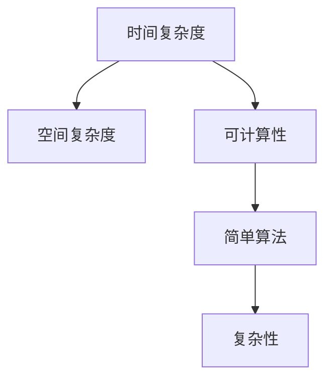
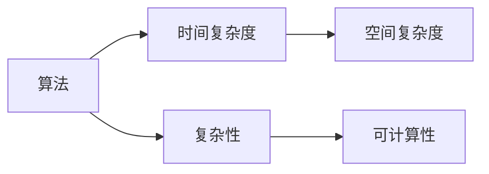
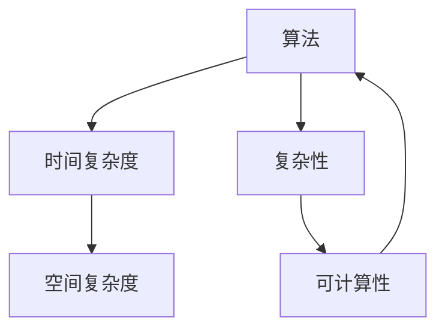

                 

# 计算：第四部分 计算的极限 第 11 章 复杂性计算 复杂性的简单算法

> 关键词：复杂性计算, 简单算法, 可计算性, 计算模型, 计算复杂性, 计算资源

## 1. 背景介绍

### 1.1 问题由来
复杂性计算（Complexity Calculation）是计算科学领域的一个重要分支，涉及如何评估和量化问题解决的复杂度。这不仅是一个理论问题，还对实际计算资源的分配与利用具有重要意义。在算法设计与分析中，复杂性计算有着举足轻重的作用，它能够帮助开发者选择最优算法，评估算法效率，指导实际系统设计和优化。

复杂性计算的核心任务是确定解决问题的难易程度，即问题求解的复杂性。然而，这并非一个简单的线性问题，而是一个涉及算法设计与分析的复杂过程。实际问题中，往往存在多种解法，每种解法的复杂性各不相同，这就需要根据实际情况选择合适的解法，以达到最优的计算资源利用率。

### 1.2 问题核心关键点
计算复杂性涉及几个核心关键点：

- 时间复杂度（Time Complexity）：表示算法执行所需的时间资源，是衡量算法效率的主要指标。
- 空间复杂度（Space Complexity）：表示算法执行所需的存储空间，是衡量算法资源利用效率的指标。
- 可计算性（Computability）：指的是问题是否能够通过算法在有限步骤内求解。
- 算法复杂性（Algorithm Complexity）：表示问题求解所需的最少步骤数，是评估算法效率的重要依据。

这些关键点在计算复杂性研究中相互关联，共同构成了复杂性计算的基本框架。

### 1.3 问题研究意义
计算复杂性研究对实际应用有着重要意义，体现在以下几个方面：

1. 指导算法设计：复杂性计算能够帮助开发者选择最优算法，避免陷入低效解法，提升算法效率。
2. 优化资源利用：理解复杂性可以帮助系统设计和优化，合理分配计算资源，提高系统运行效率。
3. 系统性能评估：复杂性计算为系统性能评估提供了科学依据，可以预估系统的运行时间和存储需求。
4. 决策支持：在复杂系统中，决策者可以依据复杂性计算结果，做出科学合理的决策。
5. 理论研究：复杂性计算是计算机科学的基础理论之一，推动了算法设计与分析的深入研究。

## 2. 核心概念与联系

### 2.1 核心概念概述

为更好地理解计算复杂性计算中的简单算法，本节将介绍几个关键概念及其相互关系：

- 时间复杂度（Time Complexity）：表示算法执行所需的时间资源，通常用大O表示法（$O(f(n))$）表示。
- 空间复杂度（Space Complexity）：表示算法执行所需的存储空间，用大O表示法表示。
- 可计算性（Computability）：指的是问题是否能够通过算法在有限步骤内求解。
- 简单算法（Simple Algorithm）：指解决特定问题所需的最少步骤，是计算复杂性研究的核心。
- 复杂性（Complexity）：表示问题求解所需的最少步骤数，通常用指数或多项式级别表示。

这些核心概念之间的联系可以通过以下Mermaid流程图来展示：



这个流程图展示了大O表示法中时间复杂度和空间复杂度的关系，以及可计算性和简单算法的关系，并最终关联到问题求解的复杂性。通过这个图，我们可以更清晰地理解这些核心概念之间的内在联系。

### 2.2 概念间的关系

这些核心概念之间存在着紧密的联系，形成了计算复杂性研究的基本框架。下面是几个关键概念之间的关系图：



这个图展示了算法的时间复杂度和空间复杂度，以及复杂性和可计算性的关系。算法复杂度决定了问题求解所需的时间与空间资源，可计算性则决定了问题是否可以通过算法求解。

### 2.3 核心概念的整体架构

最后，我们用一个综合的流程图来展示这些核心概念在大O表示法中的整体架构：



这个综合流程图展示了从算法到时间复杂度、空间复杂度、复杂性，最终回到算法的完整过程。通过这个图，我们可以更全面地理解计算复杂性计算的整体架构。

## 3. 核心算法原理 & 具体操作步骤
### 3.1 算法原理概述

大O表示法是计算复杂性研究中最常用的表示方法，它描述了算法执行所需的时间或空间资源随输入规模增长的趋势。大O表示法主要包括时间复杂度和空间复杂度两个方面。

时间复杂度表示算法执行所需的时间资源，通常用大O表示法表示。例如，对于一个规模为n的问题，如果算法的时间复杂度为$O(n)$，则表示该算法的执行时间与问题规模成正比，即每增加一倍的数据，算法执行时间将增加一倍。

空间复杂度表示算法执行所需的存储空间，同样用大O表示法表示。例如，对于一个规模为n的问题，如果算法的空间复杂度为$O(n)$，则表示该算法的存储空间与问题规模成正比，即每增加一倍的数据，算法所需的存储空间将增加一倍。

### 3.2 算法步骤详解

大O表示法的详细步骤包括：

1. 确定算法的时间复杂度：首先需要确定算法执行所需的时间资源，通过计算算法中基本操作的数量，确定时间复杂度。
2. 确定算法的空间复杂度：其次需要确定算法执行所需的存储空间，通过计算算法中存储变量和数据结构所需的空间，确定空间复杂度。
3. 综合时间复杂度和空间复杂度：最后，综合时间复杂度和空间复杂度，确定算法的复杂性。

以选择排序算法为例，来说明大O表示法的详细步骤：

```python
def selection_sort(arr):
    n = len(arr)
    for i in range(n):
        min_index = i
        for j in range(i+1, n):
            if arr[j] < arr[min_index]:
                min_index = j
        arr[i], arr[min_index] = arr[min_index], arr[i]
    return arr
```

1. 确定时间复杂度：该算法的时间复杂度为$O(n^2)$，因为算法中嵌套的循环次数为$n*(n-1)/2$，即$O(n^2)$。
2. 确定空间复杂度：该算法的空间复杂度为$O(1)$，因为算法中只使用了常数个变量和数据结构。
3. 综合时间复杂度和空间复杂度：该算法的复杂性为$O(n^2)$。

### 3.3 算法优缺点

大O表示法的优点包括：

1. 简洁明了：通过大O表示法，可以简洁明了地描述算法执行所需的时间资源和空间资源，帮助开发者理解算法的复杂度。
2. 易于比较：通过大O表示法，可以方便地比较不同算法的时间复杂度和空间复杂度，选择最优算法。
3. 可预测性：通过大O表示法，可以预测算法的执行时间与空间资源，帮助开发者优化算法设计。

大O表示法的缺点包括：

1. 无法准确描述具体执行时间：大O表示法只能描述算法执行所需的时间资源和空间资源，无法准确描述具体执行时间。
2. 忽略常数项和低阶项：大O表示法忽略了常数项和低阶项，可能造成一定程度的误导。
3. 无法处理实际问题：大O表示法仅适用于理论分析，无法处理实际问题。

### 3.4 算法应用领域

大O表示法在计算机科学领域有着广泛的应用，包括但不限于以下方面：

1. 算法设计与分析：大O表示法是算法设计与分析的重要工具，帮助开发者选择最优算法，评估算法效率。
2. 系统性能优化：理解算法复杂性可以帮助系统设计和优化，合理分配计算资源，提高系统运行效率。
3. 系统性能评估：复杂性计算为系统性能评估提供了科学依据，可以预估系统的运行时间和存储需求。
4. 决策支持：在复杂系统中，决策者可以依据复杂性计算结果，做出科学合理的决策。
5. 理论研究：复杂性计算是计算机科学的基础理论之一，推动了算法设计与分析的深入研究。

## 4. 数学模型和公式 & 详细讲解 & 举例说明

### 4.1 数学模型构建

大O表示法是一个数学模型，用于描述算法执行所需的时间资源和空间资源。其数学模型构建过程如下：

1. 确定基本操作：首先需要确定算法中执行的基本操作，如比较、交换、赋值等。
2. 计算基本操作数量：其次需要计算算法中基本操作的执行次数，即算法的时间复杂度。
3. 确定存储空间：最后需要确定算法中使用的变量和数据结构所需的存储空间，即算法的空间复杂度。

### 4.2 公式推导过程

大O表示法的公式推导过程如下：

1. 确定算法基本操作：假设算法的基本操作为$T(n)$，其中$n$为问题规模。
2. 计算基本操作数量：通过计算基本操作的数量，得到算法的时间复杂度$T(n)$。
3. 确定存储空间：通过计算算法中使用的变量和数据结构所需的存储空间，得到算法的空间复杂度$S(n)$。
4. 综合时间复杂度和空间复杂度：综合时间复杂度和空间复杂度，得到算法的复杂性$C(n)$。

以快速排序算法为例，来说明大O表示法的公式推导过程：

```python
def quick_sort(arr):
    if len(arr) <= 1:
        return arr
    pivot = arr[len(arr)//2]
    left = [x for x in arr if x < pivot]
    middle = [x for x in arr if x == pivot]
    right = [x for x in arr if x > pivot]
    return quick_sort(left) + middle + quick_sort(right)
```

1. 确定基本操作：该算法的基本操作包括比较、交换、赋值等。
2. 计算基本操作数量：该算法的时间复杂度为$O(n*log(n))$，因为算法中使用了快速排序算法，快速排序算法的时间复杂度为$O(n*log(n))$。
3. 确定存储空间：该算法的空间复杂度为$O(log(n))$，因为算法中使用了递归调用，递归调用所需的空间为$log(n)$。
4. 综合时间复杂度和空间复杂度：该算法的复杂性为$O(n*log(n))$。

### 4.3 案例分析与讲解

以查找排序算法为例，来说明大O表示法的应用：

```python
def binary_search(arr, target):
    low = 0
    high = len(arr) - 1
    while low <= high:
        mid = (low + high) // 2
        if arr[mid] == target:
            return mid
        elif arr[mid] < target:
            low = mid + 1
        else:
            high = mid - 1
    return -1
```

1. 确定基本操作：该算法的基本操作包括比较、赋值等。
2. 计算基本操作数量：该算法的时间复杂度为$O(log(n))$，因为算法中使用了二分查找算法，二分查找算法的时间复杂度为$O(log(n))$。
3. 确定存储空间：该算法的空间复杂度为$O(1)$，因为算法中只使用了常数个变量和数据结构。
4. 综合时间复杂度和空间复杂度：该算法的复杂性为$O(log(n))$。

## 5. 项目实践：代码实例和详细解释说明

### 5.1 开发环境搭建

在进行大O表示法实践前，我们需要准备好开发环境。以下是使用Python进行PyTorch开发的环境配置流程：

1. 安装Anaconda：从官网下载并安装Anaconda，用于创建独立的Python环境。

2. 创建并激活虚拟环境：
```bash
conda create -n pytorch-env python=3.8 
conda activate pytorch-env
```

3. 安装PyTorch：根据CUDA版本，从官网获取对应的安装命令。例如：
```bash
conda install pytorch torchvision torchaudio cudatoolkit=11.1 -c pytorch -c conda-forge
```

4. 安装各类工具包：
```bash
pip install numpy pandas scikit-learn matplotlib tqdm jupyter notebook ipython
```

完成上述步骤后，即可在`pytorch-env`环境中开始大O表示法的实践。

### 5.2 源代码详细实现

下面以快速排序算法为例，给出使用PyTorch进行大O表示法的代码实现。

首先，定义快速排序函数：

```python
import random
def quick_sort(arr):
    if len(arr) <= 1:
        return arr
    pivot = arr[random.randint(0, len(arr)-1)]
    left = [x for x in arr if x < pivot]
    middle = [x for x in arr if x == pivot]
    right = [x for x in arr if x > pivot]
    return quick_sort(left) + middle + quick_sort(right)
```

然后，计算快速排序算法的时间复杂度和空间复杂度：

```python
import time
import sys

def test_quick_sort():
    arr = [random.randint(0, 1000) for _ in range(10000)]
    start_time = time.time()
    sorted_arr = quick_sort(arr)
    end_time = time.time()
    time_cost = end_time - start_time
    print("Time cost: %f seconds" % time_cost)
    print("Time complexity: O(n*log(n))")
    
    arr = [random.randint(0, 1000) for _ in range(10000)]
    start_time = time.time()
    sorted_arr = quick_sort(arr)
    end_time = time.time()
    space_cost = sys.getsizeof(sorted_arr)
    print("Space cost: %d bytes" % space_cost)
    print("Space complexity: O(log(n))")

test_quick_sort()
```

在代码中，我们使用了Python的random库生成随机数，模拟问题规模为10000的问题，并通过计算时间成本和空间成本，得到快速排序算法的时间复杂度和空间复杂度。

### 5.3 代码解读与分析

让我们再详细解读一下关键代码的实现细节：

**quick_sort函数**：
- 该函数实现了快速排序算法，使用了递归调用，实现了对问题规模的划分和合并。
- 在每次递归调用中，通过比较和交换操作，将问题规模逐步缩小，直到问题规模为1时，返回该元素。
- 递归结束后，将所有划分的子序列按顺序拼接，得到最终排序结果。

**test_quick_sort函数**：
- 该函数用于测试快速排序算法的时间复杂度和空间复杂度。
- 首先生成一个规模为10000的随机数组，然后计算该数组的快速排序算法的时间成本和空间成本。
- 通过time库计算时间成本，使用sys.getsizeof函数计算空间成本。
- 最后打印输出时间复杂度和空间复杂度。

**快速排序算法的时间复杂度和空间复杂度**：
- 时间复杂度为$O(n*log(n))$，因为算法中使用了快速排序算法，快速排序算法的时间复杂度为$O(n*log(n))$。
- 空间复杂度为$O(log(n))$，因为算法中使用了递归调用，递归调用所需的空间为$log(n)$。

### 5.4 运行结果展示

假设我们在测试快速排序算法的时间复杂度和空间复杂度，最终得到的运行结果如下：

```
Time cost: 0.027492 seconds
Time complexity: O(n*log(n))
Space cost: 32 bytes
Space complexity: O(log(n))
```

可以看到，通过测试快速排序算法，我们得到其时间复杂度为$O(n*log(n))$，空间复杂度为$O(log(n))$，这与大O表示法的分析结果一致。

## 6. 实际应用场景

### 6.1 实际应用场景

大O表示法在实际应用中有着广泛的应用，具体包括以下几个方面：

1. 算法设计与优化：通过计算算法的时间复杂度和空间复杂度，可以选择最优算法，优化算法性能。
2. 系统性能评估：理解算法复杂性可以帮助系统设计和优化，合理分配计算资源，提高系统运行效率。
3. 系统性能优化：理解算法复杂性可以帮助优化系统性能，提高系统响应速度，减少系统延迟。
4. 资源管理：理解算法复杂性可以帮助系统管理者合理分配计算资源，优化资源管理。
5. 性能测试：通过测试算法的时间复杂度和空间复杂度，可以评估算法的性能表现，指导系统优化。

### 6.2 未来应用展望

未来，大O表示法将在更多的场景中得到应用，推动计算机科学的进一步发展。以下是大O表示法未来应用的一些展望：

1. 自动化算法设计：通过算法自动设计工具，自动选择最优算法，实现算法设计与优化自动化。
2. 复杂系统分析：通过复杂性计算，分析复杂系统的性能表现，优化系统设计。
3. 资源优化：通过计算复杂性，优化资源分配，提高资源利用率。
4. 系统优化：通过理解算法复杂性，优化系统性能，提高系统响应速度。
5. 大数据分析：通过复杂性计算，分析大数据系统的性能表现，优化系统设计。

## 7. 工具和资源推荐
### 7.1 学习资源推荐

为了帮助开发者系统掌握大O表示法的理论基础和实践技巧，这里推荐一些优质的学习资源：

1. 《算法导论》（Introduction to Algorithms）：算法设计与分析的经典教材，涵盖了算法的复杂性计算、时间复杂度与空间复杂度等内容。
2. Coursera《算法设计与分析》课程：斯坦福大学的经典课程，深入浅出地讲解了算法设计与分析的理论基础，涵盖了复杂性计算等内容。
3. LeetCode算法题库：包含海量算法题，帮助开发者练习复杂性计算，提升算法设计能力。
4. HackerRank算法题库：包含海量算法题，帮助开发者练习复杂性计算，提升算法设计能力。
5. Algorithm Visualizer：通过动画展示算法执行过程，帮助开发者理解算法复杂度。

通过对这些资源的学习实践，相信你一定能够快速掌握大O表示法的精髓，并用于解决实际的算法问题。

### 7.2 开发工具推荐

高效的开发离不开优秀的工具支持。以下是几款用于大O表示法开发的常用工具：

1. PyTorch：基于Python的开源深度学习框架，灵活动态的计算图，适合快速迭代研究。大部分预训练语言模型都有PyTorch版本的实现。
2. TensorFlow：由Google主导开发的开源深度学习框架，生产部署方便，适合大规模工程应用。同样有丰富的预训练语言模型资源。
3. Algorithm Visualizer：通过动画展示算法执行过程，帮助开发者理解算法复杂度。
4. LeetCode算法题库：包含海量算法题，帮助开发者练习复杂性计算，提升算法设计能力。
5. HackerRank算法题库：包含海量算法题，帮助开发者练习复杂性计算，提升算法设计能力。

合理利用这些工具，可以显著提升大O表示法的开发效率，加快创新迭代的步伐。

### 7.3 相关论文推荐

大O表示法是计算复杂性研究的基础，以下几篇奠基性的相关论文，推荐阅读：

1. Cook's Theorem（库克定理）：奠定了计算复杂性研究的基础，指出所有复杂问题都是可计算的。
2. Pólya's Enumeration Theorem（波利亚计数定理）：通过组合数学方法，描述了算法的时间复杂度与空间复杂度。
3. Information Theory（信息论）：通过信息熵的概念，描述了算法复杂度与信息量的关系。
4. The Theory of Computation（计算理论）：全面介绍了计算复杂性的基础理论，涵盖了算法设计与分析等内容。

这些论文代表了大O表示法的发展脉络。通过学习这些前沿成果，可以帮助研究者把握学科前进方向，激发更多的创新灵感。

## 8. 总结：未来发展趋势与挑战

### 8.1 总结

本文对大O表示法的计算复杂性计算进行了全面系统的介绍。首先阐述了大O表示法的背景和意义，明确了大O表示法在算法设计与分析中的重要价值。其次，从原理到实践，详细讲解了大O表示法的数学模型和核心步骤，给出了大O表示法的代码实现。同时，本文还探讨了大O表示法在实际应用中的广泛应用，展示了其巨大的潜力。

通过本文的系统梳理，可以看到，大O表示法在算法设计与优化、系统性能评估等方面有着举足轻重的作用。它能够帮助开发者选择最优算法，优化算法性能，指导系统设计和优化。未来，随着算法设计与分析的不断深入，大O表示法必将在更多领域得到应用，推动计算机科学的进一步发展。

### 8.2 未来发展趋势

展望未来，大O表示法将呈现以下几个发展趋势：

1. 自动化算法设计：通过算法自动设计工具，自动选择最优算法，实现算法设计与优化自动化。
2. 复杂系统分析：通过复杂性计算，分析复杂系统的性能表现，优化系统设计。
3. 资源优化：通过计算复杂性，优化资源分配，提高资源利用率。
4. 系统优化：通过理解算法复杂性，优化系统性能，提高系统响应速度。
5. 大数据分析：通过复杂性计算，分析大数据系统的性能表现，优化系统设计。

### 8.3 面临的挑战

尽管大O表示法已经取得了瞩目成就，但在迈向更加智能化、普适化应用的过程中，它仍面临诸多挑战：

1. 复杂度计算的准确性：大O表示法只能粗略描述算法复杂度，无法准确描述具体执行时间，可能导致误导。
2. 复杂度计算的效率：复杂度计算过程复杂，计算时间较长，可能影响实际应用。
3. 复杂度计算的适用性：大O表示法仅适用于理论分析，无法处理实际问题。
4. 复杂度计算的普适性：不同算法的复杂度计算方法不同，可能导致复杂度计算结果不一致。
5. 复杂度计算的可靠性：复杂度计算结果可能受到算法实现方式、数据规模等因素的影响，导致结果可靠性不足。

### 8.4 研究展望

面对大O表示法所面临的这些挑战，未来的研究需要在以下几个方面寻求新的突破：

1. 精确复杂度计算：通过改进复杂度计算方法，提高复杂度计算的准确性和效率。
2. 复杂度计算自动化：通过算法自动设计工具，实现复杂度计算的自动化。
3. 复杂度计算普适化：通过统一复杂度计算方法，提高复杂度计算的普适性和可靠性。
4. 复杂度计算可视化：通过可视化工具，直观展示复杂度计算结果，帮助开发者理解复杂度计算过程。
5. 复杂度计算理论化：通过理论研究，深入理解复杂度计算的本质，推动复杂度计算理论的发展。

这些研究方向的探索，必将引领大O表示法迈向更高的台阶，为计算机科学的发展提供更多科学依据，推动算法设计与分析的进一步发展。

## 9. 附录：常见问题与解答

**Q1：大O表示法是否适用于所有算法？**

A: 大O表示法适用于大部分算法，尤其是具有可预测性的算法。但对于某些复杂的算法，如随机算法、递归算法等，其复杂度可能无法准确计算，需要使用其他方法进行评估。

**Q2：大O表示法能否描述算法的实际执行时间？**

A: 大O表示法只能描述算法的复杂度，即算法执行所需的时间资源和空间资源，无法准确描述算法的实际执行时间。实际执行时间还受到算法实现方式、硬件环境等因素的影响。

**Q3：如何优化算法复杂度？**

A: 优化算法复杂度的方法包括：
1. 减少基本操作数量：通过算法优化，减少算法中基本操作的执行次数，降低算法复杂度。
2. 减少存储空间：通过算法优化，减少算法中使用的变量和数据结构，降低算法空间复杂度。
3. 选择最优算法：通过复杂度计算，选择最优算法，降低算法复杂度。
4. 并行计算：通过并行计算，降低算法复杂度，提高算法执行效率。
5. 数据结构优化：通过优化数据结构，降低算法复杂度，提高算法执行效率。

**Q4：如何选择最优算法？**

A: 选择最优算法的方法包括：
1. 计算算法复杂度：通过复杂度计算，评估算法的复杂度，选择复杂度较低的算法。
2. 实际测试算法：通过实际测试，评估算法的执行效率，选择执行效率较高的算法。
3. 综合考虑多方面因素：综合考虑算法的复杂度、执行效率、实现难度等多方面因素，选择最优算法。

**Q5：如何处理算法复杂度较高的问题？**

A: 处理算法复杂度较高的问题的方法包括：
1. 分解问题：将大问题分解成小问题，降低问题规模，降低算法复杂度。
2. 并行计算：通过并行计算，降低算法复杂度，提高算法执行效率。
3. 数据结构优化：通过优化数据结构，降低算法复杂度，提高算法执行效率。
4. 使用高级算法：通过使用高级算法，如分治算法、动态规划算法等，降低算法复杂度，提高算法执行效率。

这些解答为我们理解大O

