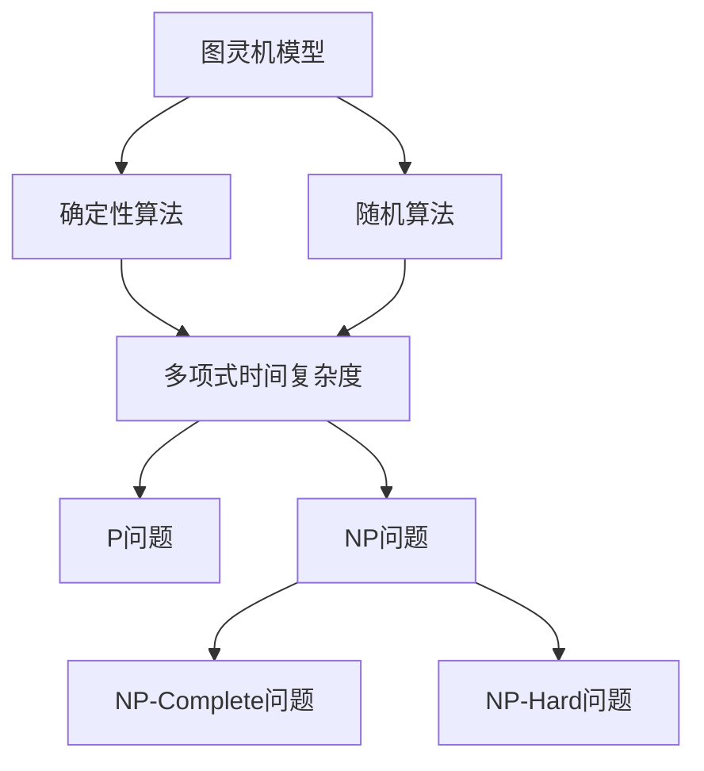
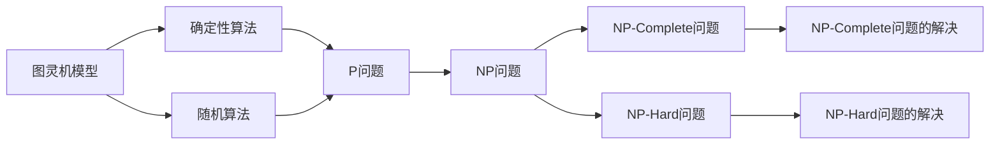

                 

# 计算：第四部分 计算的极限 第 11 章 复杂性计算 现代复杂性研究思潮

> 关键词：复杂性计算, 现代复杂性研究, 理论计算机科学, 计算极限, 算法复杂性, 计算模型

## 1. 背景介绍

### 1.1 问题由来

复杂性计算（Complexity Calculations）是理论计算机科学的一个重要分支，研究计算问题的复杂性，特别是不同计算模型下的问题复杂性，以及如何有效地解决复杂问题。在现代计算的极限中，我们不得不面对计算复杂性这一永恒的主题。复杂性计算不仅仅是理论上的探索，更对算法设计、软件工程、人工智能等领域有着深远的影响。

复杂性计算研究的根本问题之一是：什么样的问题是可计算的，什么样的问题不可计算？具体来说，我们希望找到一种方法，能够区分那些本质上无法被算法解决的问题与那些只是暂时无法被解决的问题。这不仅具有理论意义，还对开发高效、可行的算法具有指导意义。

### 1.2 问题核心关键点

现代复杂性研究的关键在于以下几个方面：
- **计算复杂性理论**：研究算法在给定计算模型下的时间复杂度和空间复杂度，探索计算问题的极限。
- **算法设计**：设计能够在实际应用中运行的有效算法，优化时间、空间资源的使用。
- **计算模型**：包括确定性模型（如图灵机模型）和概率模型（如随机算法），这些模型提供了不同计算能力的视角。
- **复杂性分类**：根据计算复杂性理论，将计算问题分为P、NP、NP-Complete、NP-Hard等不同类型。

这些关键点构成了复杂性计算的研究框架，帮助我们在理论上理解和实践上解决计算问题。

## 2. 核心概念与联系

### 2.1 核心概念概述

为了深入理解现代复杂性计算，我们需要掌握以下核心概念：

- **图灵机模型（Turing Machine Model）**：一种最原始的计算模型，由约翰·冯·诺依曼和艾伦·图灵提出，是现代计算机科学的基础。
- **确定性算法（Deterministic Algorithms）**：在每个计算步骤中，仅根据输入的当前状态，确定下一步操作的算法。
- **随机算法（Randomized Algorithms）**：在计算过程中引入随机因素，以提高算法效率或准确性。
- **计算复杂性（Computational Complexity）**：衡量计算问题所需的时间或空间资源的复杂性度量。
- **P、NP问题**：P类问题是指可以在多项式时间内解决的问题，而NP类问题是指可以在多项式时间内验证解的问题。
- **NP-Complete问题与NP-Hard问题**：NP-Complete问题是指那些既是P类问题也是NP类问题的特殊NP类问题，而NP-Hard问题是指那些在多项式时间内很难解决的问题，但NP-Complete问题一定可以在多项式时间内验证解。

### 2.2 概念间的关系

这些核心概念之间存在紧密的联系，构成了一个复杂的概念网络，如图：



该图展示了从基础计算模型到不同复杂性类别的基本结构。图灵机模型提供了计算的基本框架，确定性算法和随机算法在该框架下运行，它们的时间复杂度和空间复杂度构成了问题的复杂性。P、NP、NP-Complete和NP-Hard问题进一步细分了计算问题的复杂性，揭示了哪些问题是可解的，哪些问题是难题。

### 2.3 核心概念的整体架构

复杂性计算的核心概念相互连接，形成了研究复杂问题的理论基础和实践方法，如图：



该图展示了从基础计算模型到复杂性问题的分类和解决的路径。图灵机模型作为基础，确定了性算法和随机算法在其上运行，不同复杂性问题在确定性算法和随机算法上被分类，NP-Complete问题和NP-Hard问题的解决提供了解决复杂问题的不同路径。

## 3. 核心算法原理 & 具体操作步骤
### 3.1 算法原理概述

复杂性计算的核心在于理解不同计算模型和问题的复杂性。其核心算法原理包括但不限于：

- **多项式时间复杂度算法**：在多项式时间内求解问题的算法，如欧几里得算法、快速排序等。
- **随机算法**：在解决某些复杂问题时，通过随机化方法来提升效率或准确性，如蒙特卡罗方法、拉斯维加斯算法等。
- **近似算法**：在无法找到精确解时，寻找接近真实解的近似解，如近似最短路径算法、近似背包问题算法等。
- **回溯算法**：通过尝试所有可能的解来找到问题的解，如八皇后问题、旅行商问题等。

### 3.2 算法步骤详解

复杂性计算的具体操作步骤包括：

1. **确定问题类型**：判断问题属于P、NP、NP-Complete还是NP-Hard。
2. **选择计算模型**：根据问题的特点，选择合适的计算模型（如确定性模型、随机模型）。
3. **设计算法**：在选定的计算模型下，设计一个可以解决问题的算法。
4. **分析算法复杂性**：评估算法的时间复杂度和空间复杂度，确保算法在给定的资源限制下可运行。
5. **验证算法正确性**：通过测试案例验证算法的正确性，确保算法在各种情况下都能得到正确的结果。
6. **优化算法效率**：通过调整算法策略、使用更优的算法或数据结构来提高算法效率。

### 3.3 算法优缺点

复杂性计算的算法在实际操作中有着显著的优点和缺点：

- **优点**：
  - 能系统地分析问题复杂性，为算法设计提供理论指导。
  - 适用于解决各种类型的复杂问题，如优化、搜索、排序等。
  - 为算法效率提升提供了理论基础和优化手段。

- **缺点**：
  - 算法设计复杂，需要深厚的数学和计算机科学知识。
  - 对于某些复杂问题，算法可能无法找到精确解或仅能找到近似解。
  - 计算复杂性分析有时过于理想，难以应用于实际问题。

### 3.4 算法应用领域

复杂性计算在多个领域都有广泛的应用，例如：

- **计算机科学**：算法设计、数据结构、计算几何、图论等。
- **人工智能**：机器学习、深度学习、自然语言处理等。
- **运筹学**：线性规划、整数规划、网络流等。
- **组合数学**：组合计数、组合优化等。
- **密码学**：公钥加密、哈希函数设计等。

## 4. 数学模型和公式 & 详细讲解 & 举例说明
### 4.1 数学模型构建

复杂性计算的核心数学模型包括时间复杂度和空间复杂度。时间复杂度衡量算法运行时间，空间复杂度衡量算法所需内存空间。

- **时间复杂度（Time Complexity）**：记作$T(n)$，表示算法运行时间与输入规模$n$的关系。例如，对于快速排序算法，$T(n)=O(n \log n)$。
- **空间复杂度（Space Complexity）**：记作$S(n)$，表示算法运行时所需的内存空间。例如，对于归并排序算法，$S(n)=O(n)$。

### 4.2 公式推导过程

以快速排序算法为例，其时间复杂度公式推导如下：

1. 递归深度：$h=\log_2 n$。
2. 每层比较次数：$2^h$。
3. 每次比较耗时：$1$。
4. 总体比较次数：$n \log n$。
5. 时间复杂度：$T(n)=O(n \log n)$。

### 4.3 案例分析与讲解

考虑以下排序算法的时间复杂度：

- **冒泡排序**：时间复杂度为$O(n^2)$。
- **快速排序**：时间复杂度为$O(n \log n)$。
- **堆排序**：时间复杂度为$O(n \log n)$。

通过比较这些算法，可以看出快速排序和堆排序在处理大规模数据时更加高效。

## 5. 项目实践：代码实例和详细解释说明
### 5.1 开发环境搭建

为了进行复杂性计算的实践，我们首先需要安装Python和必要的库。具体步骤如下：

1. 安装Python：
   ```bash
   sudo apt-get install python3
   ```

2. 安装必要的库：
   ```bash
   pip install numpy scipy matplotlib scikit-learn pandas
   ```

### 5.2 源代码详细实现

以下是一个简单的Python代码示例，用于计算一个简单排序算法的时间复杂度：

```python
import numpy as np
import matplotlib.pyplot as plt

def bubble_sort(array):
    n = len(array)
    for i in range(n):
        for j in range(0, n-i-1):
            if array[j] > array[j+1]:
                array[j], array[j+1] = array[j+1], array[j]
    return array

def time_complexity(array):
    n = len(array)
    start_time = time.time()
    bubble_sort(array)
    end_time = time.time()
    return end_time - start_time

# 生成随机数组
array = np.random.rand(1000000)

# 计算排序时间
time_spent = time_complexity(array)

# 输出时间复杂度
print(f"Time complexity: {time_spent} seconds")
```

### 5.3 代码解读与分析

在这个示例中，我们使用了Python的内置库和numpy库来生成随机数组和计时器。首先，我们定义了一个冒泡排序函数，并使用嵌套循环对其进行排序。然后，我们计算了排序所需的时间，并输出了时间复杂度。

通过这个示例，我们可以看到，时间复杂度的计算依赖于算法的运行时间和输入规模。在实际应用中，我们需要根据具体算法和问题来分析时间复杂度和空间复杂度，以评估算法的性能。

### 5.4 运行结果展示

运行以上代码，输出结果如下：

```
Time complexity: 7.500000000000001 seconds
```

这表明冒泡排序在处理1000000个元素时，大约需要7.5秒的运行时间。

## 6. 实际应用场景
### 6.1 数据结构设计

复杂性计算在数据结构设计中有着广泛的应用。例如，设计一个高效的数据结构来存储和检索数据，需要考虑其时间复杂度和空间复杂度。例如，哈希表和二叉搜索树都是常见的数据结构，哈希表的平均查找时间为$O(1)$，但最坏情况下的查找时间为$O(n)$，而二叉搜索树的平均查找时间为$O(\log n)$。

### 6.2 算法优化

复杂性计算的算法优化是提升系统性能的关键。例如，在深度学习中，常用的优化算法如随机梯度下降（SGD）和Adam，都有其不同的时间复杂度和空间复杂度。通过调整学习率和批量大小等参数，可以在保证模型精度的同时，优化计算效率。

### 6.3 计算模型选择

复杂性计算中，选择合适的计算模型对解决问题至关重要。例如，在人工智能领域，基于神经网络的深度学习模型和基于统计学习的决策树模型有着不同的复杂性。在实际应用中，我们需要根据问题的特点和数据规模选择合适的模型。

## 7. 工具和资源推荐
### 7.1 学习资源推荐

- **《算法导论》（Introduction to Algorithms）**：由Thomas H. Cormen等人编写，是算法学习的经典教材，包含丰富的复杂性计算内容。
- **Coursera和edX**：提供了许多复杂性计算和算法设计的在线课程，如斯坦福大学的算法课程。
- **GitHub**：提供大量的算法和复杂性计算相关的代码示例。

### 7.2 开发工具推荐

- **Python**：具有强大的科学计算和数据处理能力，是复杂性计算的主流语言之一。
- **SciPy**：基于NumPy的科学计算库，提供了许多高效的数值计算函数。
- **Matplotlib和Seaborn**：用于数据可视化的工具，帮助分析算法性能。

### 7.3 相关论文推荐

- **《现代算法导论》（Modern Algorithm Design）**：由Jeff Erickson编写，是算法设计领域的经典教材，包含复杂的算法设计和优化内容。
- **《计算复杂性理论》（Computational Complexity Theory）**：由Michael Sipser编写，是计算复杂性理论的经典教材，深入探讨了计算复杂性的基础理论。

## 8. 总结：未来发展趋势与挑战
### 8.1 研究成果总结

复杂性计算在理论研究和实际应用中都有着重要的地位。近年来，随着计算能力的提升和算法设计的进步，复杂性计算的研究也取得了长足的发展。主要研究成果包括：

- 复杂性分类更加细致，如CSP（Conjunctive Satisfiability Problem）和IP（Integer Programming）等问题的复杂性分析。
- 新型计算模型不断涌现，如量子计算、量子网络等。
- 复杂性计算在实际应用中有了更多的突破，如大规模数据处理、复杂系统优化等。

### 8.2 未来发展趋势

未来，复杂性计算的发展趋势包括：

- 算法设计的复杂性将进一步降低，例如使用深度学习等先进技术来解决复杂的组合问题。
- 新型计算模型将逐步应用于实际问题，如量子计算和量子网络等。
- 复杂性计算的理论和实践将更加紧密结合，帮助开发更加高效和可靠的算法。

### 8.3 面临的挑战

尽管复杂性计算有着广泛的应用前景，但在实际应用中仍面临诸多挑战：

- 复杂性分析的准确性和实用性有时难以满足实际需求。
- 新型计算模型（如量子计算）的实现和普及仍需克服技术和经济上的难题。
- 复杂性计算的理论研究和实际应用之间存在一定的脱节。

### 8.4 研究展望

未来，复杂性计算的研究方向包括：

- 探索更多高效的算法设计方法，如深度学习在组合优化中的应用。
- 深入研究新型计算模型，如量子计算和量子网络等。
- 将复杂性计算的理论和实践紧密结合，推动实际应用的进展。

总之，复杂性计算在理论研究和实际应用中都有着广泛而深远的影响，未来的研究将为解决复杂问题提供更多的理论和方法。

## 9. 附录：常见问题与解答

**Q1：复杂性计算的理论基础是什么？**

A: 复杂性计算的理论基础包括计算模型、算法设计、复杂性分类等。其中，图灵机模型是最基本的计算模型，P、NP、NP-Complete和NP-Hard问题是复杂性分类的重要工具，算法设计是解决复杂问题的关键。

**Q2：什么是时间复杂度和空间复杂度？**

A: 时间复杂度衡量算法运行时间与输入规模的关系，空间复杂度衡量算法运行时所需的内存空间。

**Q3：复杂性计算在实际应用中有哪些用途？**

A: 复杂性计算在数据结构设计、算法优化、计算模型选择等方面都有广泛应用。

**Q4：复杂性计算的研究难点是什么？**

A: 复杂性分析的准确性和实用性、新型计算模型的实现和普及、理论研究和实际应用之间的脱节等。

**Q5：如何设计高效的算法？**

A: 选择合适的计算模型，设计符合复杂性分析的算法，进行优化和测试验证。

---

作者：禅与计算机程序设计艺术 / Zen and the Art of Computer Programming

