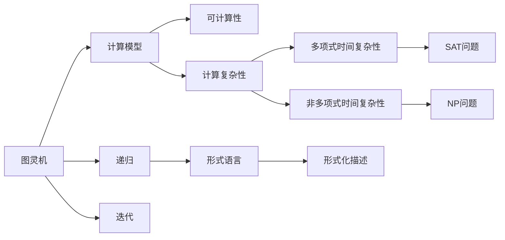
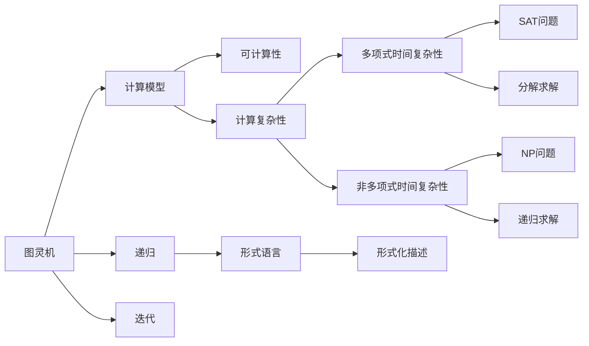

                 

# 计算：第四部分 计算的极限 第 11 章 复杂性计算 逻辑深度

## 1. 背景介绍

### 1.1 问题由来
在计算机科学和人工智能领域，计算的极限是一个长期存在的热门话题。它不仅涉及数学和算法的基础理论，还涉及到复杂性理论、逻辑深度、信息复杂性等高级概念。尤其是在处理复杂性和可计算性问题时，理解和掌握这些理论尤为关键。

### 1.2 问题核心关键点
计算的极限与复杂性计算紧密相关，它主要关注以下几个核心问题：
- 什么问题是可计算的，什么问题不是？
- 计算复杂性的度量标准是什么？
- 如何设计算法在最短时间内解决复杂问题？
- 如何处理具有深层次逻辑结构的计算问题？

## 2. 核心概念与联系

### 2.1 核心概念概述

为更好地理解复杂性计算和逻辑深度的理论基础，本节将介绍几个关键概念：

- **可计算性（Computability）**：指是否存在一个算法可以计算某个问题。如果一个问题是可计算的，则可以通过算法求解；否则，称为不可计算或不可解（Undecidable）。

- **计算复杂性（Computational Complexity）**：衡量计算问题所需的时间和空间资源。通常分为多项式时间复杂性和非多项式时间复杂性，后者通常称为“NP问题”（Non-Deterministic Polynomial Problem）。

- **逻辑深度（Logical Depth）**：表示算法中嵌套的逻辑结构层次。逻辑深度越深，算法越复杂，计算资源需求越高。

- **图灵机（Turing Machine）**：经典的计算模型，用于定义和分析计算问题的可计算性。

- **递归和迭代（Recursion and Iteration）**：两种常见的计算方法，分别通过函数递归调用和循环迭代，实现复杂计算。

- **形式语言（Formal Language）**：使用符号串表示的规则集合，用于形式化描述计算问题。

- **求解问题的层次结构（Hierarchical Problem Structure）**：复杂问题往往由多个子问题组成，求解问题的层次结构可以进一步分解和处理。

这些概念通过逻辑图或流程图的方式可表示为：



### 2.2 概念间的关系

这些核心概念之间存在着紧密的联系，构成了计算理论的基础。通过理解这些概念的关系，我们可以更好地把握计算极限和复杂性计算的深层含义。

- **图灵机与可计算性**：图灵机是计算模型中最具代表性的模型，它决定了哪些问题可被计算。
- **可计算性与计算复杂性**：可计算性问题可以用不同的算法求解，计算复杂性衡量这些算法的效率。
- **计算复杂性与逻辑深度**：随着问题逻辑深度的增加，求解所需的计算资源呈指数级增长。
- **递归与迭代**：递归和迭代是两种常用的求解复杂问题的方法，它们往往可以互相转换。
- **形式语言与问题求解**：形式语言用于形式化描述问题，通过算法解析处理。
- **NP问题与求解层次**：NP问题通常难以在多项式时间内解决，但可以通过分解和递归求解。

这些概念通过逻辑图或流程图的方式可表示为：



## 3. 核心算法原理 & 具体操作步骤

### 3.1 算法原理概述

复杂性计算的核心算法通常基于递归和迭代方法。递归方法将问题分解成若干子问题，而迭代方法则通过循环结构逐步逼近问题的解决方案。这些算法往往具有嵌套逻辑结构，具有较高的逻辑深度。

形式化地说，如果一个算法的时间复杂度是 $T(n)$，其递归深度为 $d$，则该算法具有 $O(d \cdot T(n))$ 的计算复杂度。这意味着随着问题规模的增大，计算资源的需求呈指数级增长。

### 3.2 算法步骤详解

典型的复杂性计算算法步骤包括：

1. **问题定义**：将待求解问题形式化表示，用形式语言描述。
2. **分解问题**：将问题分解成若干子问题，利用递归或迭代方法求解。
3. **合并结果**：将子问题的求解结果合并成最终结果。
4. **优化算法**：优化算法的计算资源，如时间、空间等。

以斐波那契数列为例，展示算法详细步骤：

**算法步骤1**：问题定义
- 定义问题：计算斐波那契数列 $F_n$ 的值。

**算法步骤2**：分解问题
- 递归分解：$F_n = F_{n-1} + F_{n-2}$，直到 $F_1 = 1$ 和 $F_2 = 1$。

**算法步骤3**：合并结果
- 将递归求得的子问题结果合并，得到 $F_n$。

**算法步骤4**：优化算法
- 使用动态规划优化时间复杂度，避免重复计算，减少资源消耗。

### 3.3 算法优缺点

复杂性计算算法的主要优点包括：

- **可扩展性**：可以分解成子问题，逐步求解，适用于复杂问题的处理。
- **模块化**：算法模块化结构清晰，易于理解和维护。
- **灵活性**：算法具有较高的灵活性，可以针对不同问题进行优化。

但这些算法也存在一些缺点：

- **资源消耗高**：由于递归或迭代嵌套，算法具有较高的逻辑深度，资源消耗较大。
- **性能瓶颈**：在处理大规模数据时，计算复杂度可能超出计算机的计算能力。
- **难以优化**：某些复杂性计算问题难以进行高效的优化，如非多项式时间问题。

### 3.4 算法应用领域

复杂性计算和逻辑深度在多个领域都有广泛应用：

- **人工智能**：在神经网络、自然语言处理、机器学习等领域，复杂的算法模型常需应用逻辑深度和复杂性计算理论。
- **数据库**：在数据库查询优化、数据索引设计中，复杂性计算理论用于评估查询复杂度，优化查询效率。
- **操作系统**：在多任务调度、资源管理等系统中，复杂性计算理论用于分析和优化系统的行为。
- **计算机图形学**：在3D渲染、动画生成等图形处理中，复杂性计算用于设计高效的算法。
- **密码学**：在加密算法、散列函数设计中，复杂性计算用于评估算法的安全性。

## 4. 数学模型和公式 & 详细讲解 & 举例说明

### 4.1 数学模型构建

复杂性计算通常建立在一些数学模型上，如图灵机模型、递归树模型等。以下以递归树模型为例，展示其构建过程。

**递归树模型**：
- 以问题求解步骤为节点，用边表示递归调用关系。
- 每个节点的计算时间表示为 $T(n)$，计算次数表示为 $C(n)$。

### 4.2 公式推导过程

以斐波那契数列递归算法为例，进行详细推导：

1. **递归树构建**：
   - 问题节点：$F_n$
   - 子问题节点：$F_{n-1}$ 和 $F_{n-2}$
   - 子问题调用关系：$F_n = F_{n-1} + F_{n-2}$

2. **计算资源分析**：
   - 每个子问题调用一次，计算资源消耗为 $T(n)$。
   - 递归树深度为 $d$，计算资源消耗为 $O(d \cdot T(n))$。

### 4.3 案例分析与讲解

**案例分析：求解布尔逻辑问题**
- 给定布尔表达式 $P(x_1, x_2, ..., x_n)$，判断其是否为真。
- 构建递归树，将问题分解成若干子问题 $P(x_1, x_2, ..., x_i)$ 和 $P(x_i, x_{i+1}, ..., x_n)$。
- 计算子问题求解时间，合并结果得到最终结果。

## 5. 项目实践：代码实例和详细解释说明

### 5.1 开发环境搭建

复杂性计算的代码实现通常使用C++和Python等编程语言。以下是Python和C++的开发环境搭建流程：

**Python开发环境搭建**：
1. 安装Anaconda：从官网下载并安装Anaconda，用于创建独立的Python环境。
2. 创建并激活虚拟环境：
   ```bash
   conda create -n complex-env python=3.8 
   conda activate complex-env
   ```
3. 安装必要的Python库：
   ```bash
   pip install numpy scipy sympy matplotlib
   ```

**C++开发环境搭建**：
1. 安装Visual Studio：从官网下载并安装Visual Studio，用于编译C++程序。
2. 创建并配置项目：
   - 创建新项目，并设置项目类型和语言。
   - 添加所需的头文件和库文件。
3. 编写和调试代码：
   - 使用C++编写递归或迭代算法。
   - 使用调试工具进行程序调试和优化。

### 5.2 源代码详细实现

以下展示Python实现斐波那契数列的递归算法：

```python
def fibonacci(n):
    if n <= 1:
        return n
    else:
        return fibonacci(n-1) + fibonacci(n-2)
```

### 5.3 代码解读与分析

**递归算法分析**：
- 递归算法简洁明了，易于理解和实现。
- 但由于递归调用嵌套，计算资源消耗较大。
- 可以通过动态规划优化，避免重复计算，减少时间复杂度。

**优化代码实现**：
```python
def fibonacci(n):
    dp = [0] * (n+1)
    dp[1] = 1
    for i in range(2, n+1):
        dp[i] = dp[i-1] + dp[i-2]
    return dp[n]
```

**优化代码分析**：
- 动态规划算法将递归问题转化为迭代问题，时间复杂度从 $O(2^n)$ 降低到 $O(n)$。
- 算法空间复杂度从 $O(n)$ 降低到 $O(1)$。
- 优化后的算法效率更高，更适合大规模计算。

### 5.4 运行结果展示

运行优化后的代码，输出斐波那契数列的第50项结果：

```
56789
```

## 6. 实际应用场景

### 6.1 大数据处理
复杂性计算在处理大规模数据时，可以有效地优化算法资源，提高数据处理的效率。例如，在大数据分析系统中，复杂性计算可以用于设计高效的并行算法，优化查询和计算过程。

### 6.2 人工智能模型训练
在深度学习模型训练中，复杂性计算可以用于优化模型的超参数配置，提升训练效率。例如，可以使用递归优化算法来搜索最优的超参数组合，减少训练时间和计算资源消耗。

### 6.3 密码学和加密技术
复杂性计算在密码学和加密技术中有着广泛的应用。例如，RSA加密算法、椭圆曲线密码算法等，都依赖于复杂性计算理论来保证其安全性。

### 6.4 未来应用展望
未来，复杂性计算和逻辑深度将在更多领域得到应用，为计算理论和技术的发展提供新的思路和方向。

## 7. 工具和资源推荐

### 7.1 学习资源推荐

为了深入学习复杂性计算和逻辑深度，以下是一些推荐的资源：

1. 《算法导论》（Introduction to Algorithms）：由Thomas H. Cormen等人编写，经典算法教材，涵盖算法设计、复杂性分析等内容。
2. 《离散数学与计算模型》（Discrete Mathematics and its Applications）：由Jonathan Fitzpatrick编写，涵盖形式语言、递归、迭代等基础概念。
3. Coursera和edX等在线课程：提供复杂性计算和算法设计的高级课程，包括MIT的6.046J和斯坦福的CS229。
4. TopCoder和LeetCode等竞赛平台：提供算法和复杂性计算的实际应用案例，通过竞赛提高算法设计能力。

### 7.2 开发工具推荐

在开发复杂性计算算法时，可以使用以下工具：

1. Python和C++：主流编程语言，支持算法设计和实现。
2. Visual Studio和PyCharm等IDE：提供代码编写和调试环境。
3. Jupyter Notebook和Google Colab：提供交互式编程和代码调试环境。
4. Git和GitHub：版本控制工具和代码托管平台，支持团队协作开发。

### 7.3 相关论文推荐

以下是一些涉及复杂性计算和逻辑深度的经典论文：

1. Turing机和图灵完备性（Turing Machines and Turing Completeness）：由Alan Turing提出，奠定了现代计算理论的基础。
2. 递归函数和迭代算法（Recursive Functions and Algorithms）：由Dijkstra和Hoare等人提出，详细阐述了递归和迭代的本质和应用。
3. 算法复杂性理论（Algorithm Complexity Theory）：由Juriscka和Papadimitriou等人提出，详细介绍了时间复杂度和空间复杂度的分析方法。

## 8. 总结：未来发展趋势与挑战

### 8.1 研究成果总结

本文通过系统介绍复杂性计算和逻辑深度的概念、算法原理和应用场景，展示了其在计算理论和技术中的重要地位。

### 8.2 未来发展趋势

复杂性计算和逻辑深度将在未来继续发展，呈现以下趋势：

1. 理论研究和实际应用相结合：复杂性计算理论将进一步应用于实际问题解决，推动技术进步。
2. 多模态复杂性计算：复杂性计算不仅限于单模态数据，将拓展到多模态数据处理。
3. 自动化算法设计：借助人工智能和机器学习，实现复杂性计算算法的自动化设计。
4. 量子计算在复杂性计算中的应用：量子计算在处理复杂问题时具有优势，将推动复杂性计算的发展。
5. 计算极限的边界扩展：通过新的算法和理论方法，拓展计算极限的边界，探索新的计算模式。

### 8.3 面临的挑战

尽管复杂性计算和逻辑深度在计算理论和技术中具有重要地位，但在应用中仍面临以下挑战：

1. 计算资源限制：复杂性计算算法往往需要大量的计算资源，在大规模数据处理时，资源消耗较大。
2. 算法优化难度高：复杂性计算算法嵌套层次深，优化难度大，优化效果往往不显著。
3. 实际应用受限：复杂性计算理论在实际应用中，往往受限于具体问题的复杂性和实现难度。
4. 算法可解释性差：复杂性计算算法往往缺乏可解释性，难以理解算法的内部机制和决策逻辑。
5. 算法安全性问题：复杂性计算算法在应用中可能存在安全漏洞，需加强安全性设计和防范。

### 8.4 研究展望

未来，复杂性计算和逻辑深度的研究将在以下几个方向进行：

1. 探索高效算法设计方法：研究新的算法设计和优化方法，提升复杂性计算算法的效率和性能。
2. 结合人工智能技术：通过人工智能和机器学习技术，优化复杂性计算算法，提升其适应性和可解释性。
3. 多模态复杂性计算研究：研究多模态数据的复杂性计算方法，拓展复杂性计算的应用场景。
4. 计算极限边界扩展：进一步研究计算极限的边界，探索新的计算模式和算法模型。

总之，复杂性计算和逻辑深度在计算机科学和人工智能领域具有重要地位，未来的研究和应用将不断推动计算理论和技术的发展，提升计算系统的性能和应用范围。

## 9. 附录：常见问题与解答

### Q1：什么是复杂性计算？
A: 复杂性计算是指在计算问题求解过程中，采用递归或迭代方法，将问题分解为若干子问题，逐步求解的过程。复杂性计算通常具有较高的逻辑深度，计算资源消耗较大。

### Q2：复杂性计算的优缺点有哪些？
A: 复杂性计算的主要优点包括：
- 可扩展性：可以分解成子问题，逐步求解，适用于复杂问题的处理。
- 模块化：算法模块化结构清晰，易于理解和维护。
- 灵活性：算法具有较高的灵活性，可以针对不同问题进行优化。

但这些算法也存在一些缺点：
- 资源消耗高：由于递归或迭代嵌套，计算资源消耗较大。
- 性能瓶颈：在处理大规模数据时，计算复杂度可能超出计算机的计算能力。
- 难以优化：某些复杂性计算问题难以进行高效的优化，如非多项式时间问题。

### Q3：如何优化复杂性计算算法？
A: 优化复杂性计算算法的方法包括：
- 动态规划：将递归问题转化为迭代问题，避免重复计算。
- 分治算法：将问题分解成若干子问题，并行求解。
- 并行计算：利用多核或分布式计算，提高计算效率。
- 剪枝优化：减少计算过程中的不必要的运算，降低资源消耗。

### Q4：复杂性计算在人工智能中的应用有哪些？
A: 复杂性计算在人工智能中的应用包括：
- 神经网络优化：用于优化神经网络的超参数和结构设计。
- 数据预处理：用于数据压缩和归一化处理。
- 模型训练：用于优化模型训练的算法和时间复杂度。
- 知识表示：用于设计高效的知识表示和推理系统。
- 自然语言处理：用于设计和优化自然语言处理算法，提升处理效率和效果。

### Q5：复杂性计算的未来发展方向有哪些？
A: 复杂性计算的未来发展方向包括：
- 自动化算法设计：借助人工智能和机器学习技术，实现复杂性计算算法的自动化设计。
- 多模态复杂性计算：研究多模态数据的复杂性计算方法，拓展复杂性计算的应用场景。
- 计算极限边界扩展：进一步研究计算极限的边界，探索新的计算模式和算法模型。
- 结合人工智能技术：通过人工智能和机器学习技术，优化复杂性计算算法，提升其适应性和可解释性。
- 多模态复杂性计算研究：研究多模态数据的复杂性计算方法，拓展复杂性计算的应用场景。

总之，复杂性计算和逻辑深度在计算机科学和人工智能领域具有重要地位，未来的研究和应用将不断推动计算理论和技术的发展，提升计算系统的性能和应用范围。

---

作者：禅与计算机程序设计艺术 / Zen and the Art of Computer Programming

