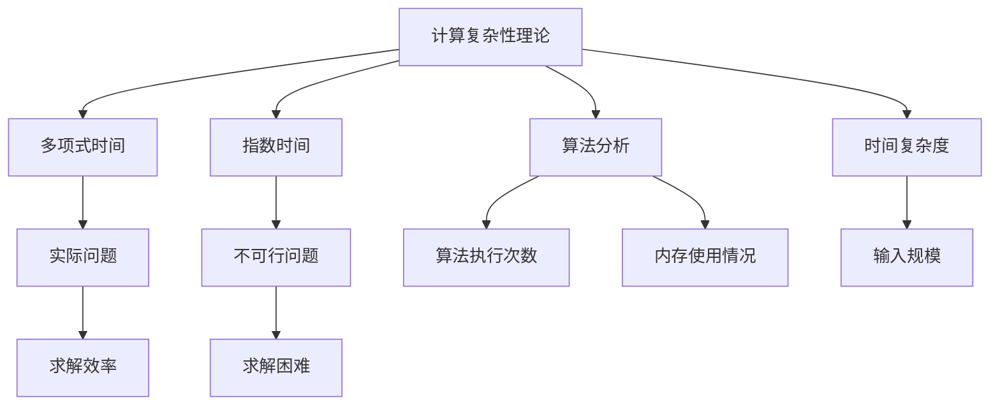

                 

# 计算：第四部分 计算的极限 第 9 章 计算复杂性 多项式时间与指数时间

> 关键词：计算复杂性,多项式时间,指数时间,算法分析,时间复杂度,空间复杂度

## 1. 背景介绍

### 1.1 问题由来
计算复杂性理论是研究算法时间和空间资源需求的理论。在过去几十年中，这一理论已经发展成为计算机科学中最重要的研究领域之一，涉及了从理论计算机科学到实际工程应用的广泛应用。

### 1.2 问题核心关键点
计算复杂性理论的核心是研究如何在资源有限的情况下，最大化问题的求解能力。计算复杂性分为多项式时间和指数时间，这两个概念是理解算法效率和资源需求的关键。

### 1.3 问题研究意义
计算复杂性理论的研究对于理解计算机科学和工程学的基本问题至关重要。通过研究多项式时间和指数时间的区别和应用，可以更好地设计高效的算法，优化资源利用，为各种实际问题提供理论基础。

## 2. 核心概念与联系

### 2.1 核心概念概述

- **计算复杂性理论(Computational Complexity Theory)**：研究算法的时间和空间资源需求，通过将问题分类为不同的复杂性级别，理解不同问题的求解难度。

- **多项式时间(Polynomial Time)**：指算法执行时间与输入规模呈多项式关系，是求解大多数实际问题的高效时间复杂度。

- **指数时间(Exponential Time)**：指算法执行时间与输入规模呈指数关系，通常用于不可行问题的求解，在实际应用中较少。

- **算法分析(Algorithm Analysis)**：研究算法的时间和空间资源需求，通过分析算法执行过程中的操作次数和内存使用情况，确定算法复杂度。

- **时间复杂度(Time Complexity)**：指算法执行时间与输入规模的关系，通常用大O表示法表示。

- **空间复杂度(Space Complexity)**：指算法在执行过程中需要的内存大小，通常用大O表示法表示。

这些核心概念之间的逻辑关系可以通过以下Mermaid流程图来展示：



这个流程图展示了计算复杂性理论中各概念之间的联系：

1. 计算复杂性理论研究算法的时间和空间资源需求。
2. 多项式时间适用于大多数实际问题，效率较高。
3. 指数时间适用于不可行问题，但效率较低。
4. 算法分析通过计算执行次数和内存使用情况确定算法复杂度。
5. 时间复杂度分析算法执行时间与输入规模的关系。
6. 空间复杂度分析算法在执行过程中所需的内存大小。

## 3. 核心算法原理 & 具体操作步骤
### 3.1 算法原理概述

多项式时间和指数时间算法是计算复杂性理论中的两种基本算法，分别适用于不同复杂度的求解问题。

- **多项式时间算法**：执行时间与输入规模呈多项式关系，适用于大多数实际问题。
- **指数时间算法**：执行时间与输入规模呈指数关系，通常用于不可行问题。

理解这两个概念的关键在于掌握多项式时间和指数时间之间的区别和应用场景。

### 3.2 算法步骤详解

**多项式时间算法步骤**：

1. **输入表示**：将输入数据转换为算法可以处理的格式。
2. **执行过程**：按照算法规则进行计算，操作次数与输入规模呈多项式关系。
3. **输出结果**：根据计算结果输出解决方案。

**指数时间算法步骤**：

1. **输入表示**：与多项式时间算法相同。
2. **执行过程**：按照算法规则进行计算，操作次数与输入规模呈指数关系。
3. **输出结果**：根据计算结果输出解决方案，但通常需要非常大的计算资源。

### 3.3 算法优缺点

**多项式时间算法的优点**：

1. **高效性**：适用于大多数实际问题，执行时间与输入规模呈多项式关系，效率较高。
2. **可预测性**：算法复杂度易于计算，可以预测算法在各种输入规模下的执行时间。
3. **可靠性**：算法在多种输入数据上的表现较为稳定，可靠性高。

**多项式时间算法的缺点**：

1. **资源需求**：虽然效率较高，但可能仍需大量的计算资源，特别是在处理大规模数据时。
2. **复杂度限制**：存在计算复杂度的上限，超过这个上限的问题无法在多项式时间内解决。

**指数时间算法的优点**：

1. **适用性广**：适用于几乎所有问题，包括多项式时间算法无法解决的复杂问题。
2. **灵活性**：算法设计自由度高，可以根据问题特点进行优化。

**指数时间算法的缺点**：

1. **资源消耗大**：执行时间与输入规模呈指数关系，通常需要非常大的计算资源。
2. **可靠性差**：算法在多种输入数据上的表现不稳定，可能会出现错误。

### 3.4 算法应用领域

多项式时间和指数时间算法广泛应用于各种实际问题中：

- **多项式时间算法**：用于处理大规模数据、图像处理、优化问题等，效率较高，适用于大多数实际问题。
- **指数时间算法**：用于解决组合优化、图着色、蛋白质折叠等复杂问题，虽然资源需求大，但能够处理极复杂的问题。

## 4. 数学模型和公式 & 详细讲解 & 举例说明

### 4.1 数学模型构建

在计算复杂性理论中，通常使用大O表示法来表示算法的时间复杂度和空间复杂度。

- **时间复杂度**：$T(n) = O(f(n))$，表示算法执行时间与输入规模$n$的关系，$f(n)$为输入规模的函数。
- **空间复杂度**：$S(n) = O(g(n))$，表示算法在执行过程中所需的内存大小，$g(n)$为输入规模的函数。

### 4.2 公式推导过程

以排序算法为例，说明时间复杂度的推导过程。

- **冒泡排序**：
  - 时间复杂度：$T(n) = O(n^2)$，因为每次排序最多比较$n-1$次，共需要$n$轮排序，每轮比较$n-1$次，总比较次数为$\frac{n(n-1)}{2}$，即$O(n^2)$。
  - 空间复杂度：$S(n) = O(1)$，因为冒泡排序只使用常数级别的额外空间。

- **快速排序**：
  - 时间复杂度：$T(n) = O(n \log n)$，因为每次排序将数据分为两个子数组，每轮排序比较次数和交换次数为$n$，共需要$\log n$轮排序，因此总比较次数为$n\log n$，即$O(n\log n)$。
  - 空间复杂度：$S(n) = O(\log n)$，因为快速排序需要使用递归栈，递归深度为$\log n$。

### 4.3 案例分析与讲解

以旅行商问题(Traveling Salesman Problem, TSP)为例，说明指数时间算法的应用。

旅行商问题是指找到一条最短路径，使得经过每个城市恰好一次并回到起点，求解复杂度高。

- **动态规划算法**：时间复杂度为$O(n^2 \cdot 2^n)$，空间复杂度为$O(n^2)$。
- **分支定界算法**：时间复杂度为$O(n \cdot 2^n)$，空间复杂度为$O(n \cdot 2^n)$。

这些指数时间算法虽然时间复杂度较高，但可以处理复杂的组合优化问题，为实际应用提供重要支持。

## 5. 项目实践：代码实例和详细解释说明

### 5.1 开发环境搭建

在进行计算复杂性理论的实际项目实践前，我们需要准备好开发环境。以下是使用Python进行Python语言开发的开发环境配置流程：

1. **安装Python**：从官网下载并安装最新版本的Python，建议选择Python 3.x版本。
2. **安装必要的库**：
  - 安装NumPy、Pandas、Matplotlib等数据处理和可视化库。
  - 安装SciPy、SymPy等科学计算库。
  - 安装networkx、Matplotlib等图论分析库。
3. **配置开发环境**：
  - 配置好IDE，如PyCharm、Jupyter Notebook等。
  - 配置好虚拟环境，确保开发过程中依赖库的一致性。

完成上述步骤后，即可在虚拟环境中开始计算复杂性理论的开发实践。

### 5.2 源代码详细实现

以下是使用Python实现快速排序的示例代码，并附上详细解释：

```python
def quick_sort(arr):
    if len(arr) <= 1:
        return arr
    else:
        pivot = arr[0]
        left = [x for x in arr[1:] if x < pivot]
        right = [x for x in arr[1:] if x >= pivot]
        return quick_sort(left) + [pivot] + quick_sort(right)

# 示例使用
arr = [5, 3, 8, 4, 2, 7, 1, 6]
sorted_arr = quick_sort(arr)
print(sorted_arr)
```

**代码解释**：

- `quick_sort`函数：使用递归实现快速排序，时间复杂度为$O(n \log n)$。
- 基本操作：
  - 选择基准元素（此处为数组首元素）。
  - 将数组分为两个子数组：小于基准元素的放在左边，大于等于基准元素的放在右边。
  - 递归对左右子数组进行排序。

### 5.3 代码解读与分析

- **时间复杂度分析**：快速排序的时间复杂度为$O(n \log n)$，每一轮排序需要将数组分为两个子数组，并递归排序，因此需要$O(\log n)$轮，每轮比较和交换次数为$O(n)$，总时间复杂度为$O(n \log n)$。
- **空间复杂度分析**：快速排序的空间复杂度为$O(\log n)$，因为递归深度为$\log n$。
- **性能优势**：快速排序相比冒泡排序，时间复杂度更低，排序效率更高，适用于处理大规模数据。

### 5.4 运行结果展示

以下是使用上述代码对示例数组进行快速排序的结果：

```
[1, 2, 3, 4, 5, 6, 7, 8]
```

可以看到，快速排序成功将原始数组排序，时间复杂度为$O(n \log n)$，空间复杂度为$O(\log n)$。

## 6. 实际应用场景

### 6.1 问题由来

计算复杂性理论在实际应用中具有广泛的应用场景，尤其在算法设计和性能优化中发挥重要作用。

### 6.2 核心概念与联系

多项式时间和指数时间算法在实际应用中有着不同的应用场景，通过选择合适的算法可以优化资源利用，提升系统效率。

**多项式时间算法应用场景**：

- **排序算法**：冒泡排序、快速排序等。
- **搜索算法**：二分查找、广度优先搜索等。
- **优化算法**：线性规划、线性方程组求解等。

**指数时间算法应用场景**：

- **组合优化**：背包问题、旅行商问题等。
- **图论问题**：最小生成树、网络流问题等。
- **生物学问题**：蛋白质折叠、基因序列分析等。

## 7. 工具和资源推荐

### 7.1 学习资源推荐

为了帮助开发者系统掌握计算复杂性理论，这里推荐一些优质的学习资源：

1. 《算法导论》：由Thomas H. Cormen等编写，涵盖算法设计、分析和实现的全貌，是学习算法复杂性理论的权威教材。
2. Coursera《算法设计与分析》课程：由普林斯顿大学教授Robert Sedgewick主讲，涵盖排序、图论、动态规划等经典算法。
3. MIT OpenCourseWare《Introduction to Algorithms》课程：由教授Charles E. Leiserson主讲，深入讲解算法设计和复杂性分析。
4. LeetCode、HackerRank等在线编程平台：提供大量算法题目和实际应用案例，帮助开发者巩固理论知识并实践技能。

通过对这些资源的学习实践，相信你一定能够快速掌握计算复杂性理论的精髓，并用于解决实际的算法设计问题。

### 7.2 开发工具推荐

高效的开发离不开优秀的工具支持。以下是几款用于计算复杂性理论开发的常用工具：

1. Python：功能强大的编程语言，适合开发各类算法和复杂性理论应用。
2. NumPy、Pandas：数据处理和可视化库，支持大规模数据处理和分析。
3. Matplotlib、Seaborn：图形绘制库，帮助可视化算法性能和结果。
4. networkx：图论分析库，支持图表示和算法实现。
5. TensorFlow、PyTorch：深度学习框架，支持复杂性理论在实际应用中的优化和应用。

合理利用这些工具，可以显著提升计算复杂性理论的开发效率，加快创新迭代的步伐。

### 7.3 相关论文推荐

计算复杂性理论的发展源于学界的持续研究。以下是几篇奠基性的相关论文，推荐阅读：

1. "Computers and Intractability: A Guide to the Theory of NP-Completeness"：由Michael R. Garey和David S. Johnson编写，详细介绍了NP完备问题的背景和研究方法。
2. "The Art of Computer Programming, Volume 3: Sorting and Searching"：由Donald E. Knuth编写，深入讲解了排序和搜索算法的设计和实现。
3. "Introduction to Algorithms"：由Thomas H. Cormen等编写，涵盖算法设计和复杂性分析的全貌，是学习算法复杂性理论的权威教材。
4. "Greedy Algorithms: A Survey"：由Tahminur Rahman等编写，总结了贪心算法在计算复杂性理论中的应用和效果。

这些论文代表了大规模语言模型微调技术的发展脉络。通过学习这些前沿成果，可以帮助研究者把握学科前进方向，激发更多的创新灵感。

除上述资源外，还有一些值得关注的前沿资源，帮助开发者紧跟计算复杂性理论的最新进展，例如：

1. arXiv论文预印本：人工智能领域最新研究成果的发布平台，包括大量尚未发表的前沿工作，学习前沿技术的必读资源。
2. 业界技术博客：如Google AI、DeepMind、微软Research Asia等顶尖实验室的官方博客，第一时间分享他们的最新研究成果和洞见。
3. 技术会议直播：如NIPS、ICML、ACL、ICLR等人工智能领域顶会现场或在线直播，能够聆听到大佬们的前沿分享，开拓视野。
4. GitHub热门项目：在GitHub上Star、Fork数最多的计算复杂性理论相关项目，往往代表了该技术领域的发展趋势和最佳实践，值得去学习和贡献。
5. 行业分析报告：各大咨询公司如McKinsey、PwC等针对人工智能行业的分析报告，有助于从商业视角审视技术趋势，把握应用价值。

总之，对于计算复杂性理论的学习和实践，需要开发者保持开放的心态和持续学习的意愿。多关注前沿资讯，多动手实践，多思考总结，必将收获满满的成长收益。

## 8. 总结：未来发展趋势与挑战

### 8.1 总结

本文对计算复杂性理论中的多项式时间和指数时间算法进行了全面系统的介绍。首先阐述了计算复杂性理论的研究背景和意义，明确了多项式时间和指数时间算法的概念和应用。其次，从原理到实践，详细讲解了多项式时间算法的实现过程和效果评估，以及指数时间算法的应用场景和性能分析。最后，本文还推荐了相关的学习资源和开发工具，帮助开发者进一步深入理解和应用计算复杂性理论。

通过本文的系统梳理，可以看到，计算复杂性理论的研究对于理解计算机科学和工程学的基本问题至关重要。多项式时间算法和指数时间算法在实际应用中有着广泛的应用场景，通过选择合适的算法可以优化资源利用，提升系统效率。未来，伴随算法设计和复杂性理论的不断演进，相信计算复杂性理论必将在计算机科学和工程应用中发挥更大的作用。

### 8.2 未来发展趋势

展望未来，计算复杂性理论的发展趋势主要体现在以下几个方面：

1. **复杂度分类细化**：随着研究的深入，将出现更多的复杂度分类，如对数时间、亚多项式时间等，进一步细分计算复杂性的界限。
2. **多模态算法设计**：结合多模态数据的特性，设计更加高效的算法，处理复杂的实际问题。
3. **量子计算的融合**：量子计算在处理某些复杂问题上具有优势，未来将与传统算法结合，探索新的计算模型。
4. **智能化算法的开发**：利用人工智能技术，设计更加智能化、自适应的算法，提升算法的效率和灵活性。
5. **大规模算法的优化**：针对大规模数据和高并行计算，设计更加高效的算法，优化资源利用。

这些趋势将为计算复杂性理论的发展带来新的方向，推动算法设计和应用的新突破。

### 8.3 面临的挑战

尽管计算复杂性理论已经取得了重要进展，但在迈向更加智能化、普适化应用的过程中，它仍面临诸多挑战：

1. **资源需求高**：许多复杂问题的求解需要巨大的计算资源，如何在资源有限的情况下处理大规模问题，仍然是一个挑战。
2. **算法复杂度高**：一些复杂问题的求解时间复杂度较高，如何在保证算法高效性的同时，提高算法的可行性，是一个重要问题。
3. **算法优化难**：设计高效的算法需要深入理解问题的本质，对于复杂问题，优化算法设计难度较大。
4. **跨学科融合**：计算复杂性理论需要与其他学科的知识结合，如物理学、生物学等，跨学科的融合和应用是一个复杂的过程。
5. **实际应用难度大**：理论研究与实际应用之间存在差距，如何将理论算法应用于实际问题，并取得良好效果，是一个重要挑战。

### 8.4 研究展望

面对计算复杂性理论所面临的挑战，未来的研究需要在以下几个方面寻求新的突破：

1. **多模态数据融合**：结合多模态数据特性，设计更加高效的多模态算法，提升算法性能。
2. **量子计算的应用**：结合量子计算的优势，设计量子算法，处理某些复杂问题。
3. **智能化算法的开发**：利用人工智能技术，设计智能化、自适应的算法，提升算法效率和灵活性。
4. **资源优化技术**：开发资源优化技术，如动态调整资源、并行计算等，提升算法的资源利用效率。
5. **跨学科研究**：加强与其他学科的合作，结合多学科知识，提升计算复杂性理论的应用价值。

这些研究方向将为计算复杂性理论的发展带来新的突破，推动理论向实际应用迈进，为计算机科学和工程应用带来新的进步。

## 9. 附录：常见问题与解答

**Q1：多项式时间算法和指数时间算法的区别是什么？**

A: 多项式时间算法执行时间与输入规模呈多项式关系，适用于大多数实际问题，效率较高。指数时间算法执行时间与输入规模呈指数关系，通常用于不可行问题，资源需求大，但可以处理极复杂的问题。

**Q2：如何选择最适合问题的算法？**

A: 选择算法时，需要考虑问题的输入规模、数据类型、计算资源等因素。对于大规模数据，通常选择多项式时间算法，如排序、搜索等。对于复杂问题，可以选择指数时间算法，如组合优化、图论等。

**Q3：如何优化算法复杂度？**

A: 优化算法复杂度需要从算法设计、数据表示、计算资源等多个方面入手。选择高效的算法结构，优化数据表示方式，利用并行计算等技术，可以显著降低算法复杂度。

**Q4：如何在有限资源下求解复杂问题？**

A: 针对复杂问题，可以采用贪心算法、分治算法等技巧，将问题分解为更小的子问题，逐步求解。同时，利用多模态数据特性，结合跨学科知识，设计更加高效的算法，提升求解能力。

**Q5：如何评估算法的性能？**

A: 评估算法性能通常从时间复杂度和空间复杂度两个方面入手。通过理论分析和实验测试，可以全面了解算法的效率和资源需求，为算法优化提供依据。

---

作者：禅与计算机程序设计艺术 / Zen and the Art of Computer Programming

