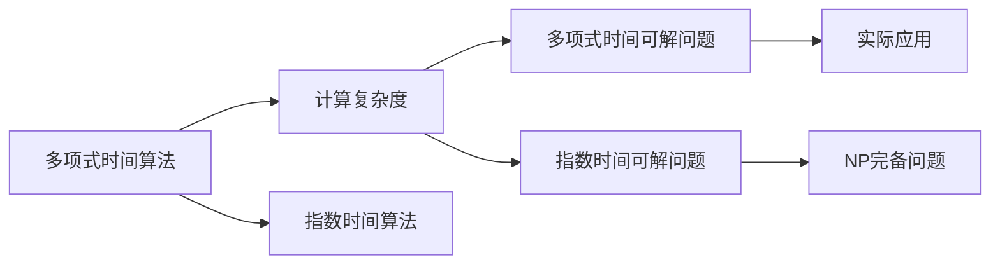
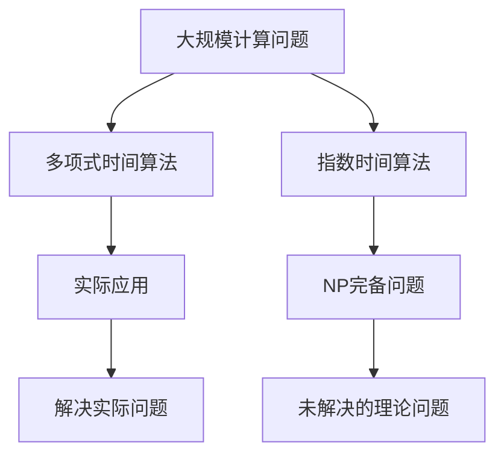

                 

# 计算：第四部分 计算的极限 第 9 章 计算复杂性 多项式时间与指数时间

> 关键词：计算复杂性, 多项式时间, 指数时间, 算法, 复杂度分析, 最优算法

## 1. 背景介绍

### 1.1 问题由来
计算的极限一直是计算机科学领域的重要研究方向之一。随着计算机硬件和软件技术的飞速发展，人们越来越关心如何高效地利用计算资源解决各种复杂问题。而计算复杂性理论正是在这种背景下应运而生。计算复杂性理论主要研究算法计算资源的消耗，包括时间、空间、通信等，从而界定问题的可解性和算法效率。

本章将详细探讨计算复杂性理论中的两个核心概念：多项式时间和指数时间。我们将分析多项式时间算法的特性和应用场景，同时讨论指数时间算法在现实中的可行性和局限性。这不仅有助于理解计算资源在算法设计中的重要性，也有助于深入理解为什么有些问题在理论上无法解决，而有些问题则可以通过高效算法快速求解。

### 1.2 问题核心关键点
计算复杂性理论中，多项式时间和指数时间是最基本的两个计算资源度量单位。理解这两种时间的区别及其应用场景，对于设计高效算法和评估问题难度至关重要。

多项式时间算法是指运行时间随问题规模增长而增长的次数不超过某个固定多项式的算法。换句话说，多项式时间算法的时间复杂度是问题规模的某个多项式函数。例如，排序算法的时间复杂度为 $O(n\log n)$，其中 $n$ 是输入规模。

指数时间算法是指运行时间随问题规模增长而增长速度极快，远远超过任何多项式函数的算法。例如，求解NP完备问题的暴力搜索算法，其时间复杂度为 $O(2^n)$，其中 $n$ 是问题规模。由于指数函数增长速度过快，这类算法通常无法在现实世界中有效应用。

## 2. 核心概念与联系

### 2.1 核心概念概述

为了更深入地理解多项式时间和指数时间，我们需要掌握以下几个核心概念：

- **多项式时间算法(Polynomial Time Algorithms)**：运行时间随问题规模增长的次数不超过某个固定多项式的算法。例如，排序、搜索、图遍历等算法的时间复杂度均为多项式级别。
- **指数时间算法(Exponential Time Algorithms)**：运行时间随问题规模增长而增长速度极快，远远超过任何多项式函数的算法。例如，暴力搜索、回溯算法等算法的时间复杂度为指数级别。
- **计算复杂度(Computational Complexity)**：指算法在计算资源（如时间、空间）上的消耗。通常用时间复杂度和空间复杂度来衡量算法的效率。
- **NP完备问题(NP-Complete Problems)**：一类在多项式时间内难以解决的计算问题。这类问题的解法要么非常复杂，要么不存在。
- **多项式时间可解问题(Polynomial Time Solvable Problems)**：可以在多项式时间内解决的问题。
- **指数时间可解问题(Exponential Time Solvable Problems)**：在理论上存在，但实际应用中几乎不可能解决的问题。

### 2.2 概念间的关系

这些核心概念之间的关系可以通过以下Mermaid流程图来展示：



这个流程图展示了多项式时间和指数时间算法的计算复杂度、实际应用和NP完备问题之间的关系。

多项式时间算法能够在多项式时间内解决实际问题，因此在实际应用中得到了广泛使用。而指数时间算法虽然理论上存在，但在实际应用中由于其过高的计算资源消耗，几乎无法解决。NP完备问题是指在多项式时间内难以解决的计算问题，但这些问题的解法依然存在，只是计算资源消耗极大。

### 2.3 核心概念的整体架构

最后，我们用一个综合的流程图来展示这些核心概念在大规模计算问题中的应用：



这个综合流程图展示了在大规模计算问题中，如何选择合适的算法来解决问题。多项式时间算法适用于实际问题，指数时间算法适用于理论问题，NP完备问题则无法在多项式时间内解决。

## 3. 核心算法原理 & 具体操作步骤
### 3.1 算法原理概述

计算复杂性理论的核心在于分析算法在计算资源上的消耗。在多项式时间算法中，我们通常关注算法的计算时间和空间复杂度。时间复杂度反映了算法运行时间的增长速度，而空间复杂度则反映了算法在存储上的资源消耗。

形式化地，设 $n$ 为输入规模，则多项式时间算法的运行时间 $T(n)$ 不超过某个多项式函数 $p(n)$，即：

$$
T(n) = O(p(n))
$$

其中 $O(\cdot)$ 表示算法的渐进时间复杂度。例如，快速排序的时间复杂度为 $O(n\log n)$。

指数时间算法的时间复杂度则远远超过任何多项式函数，例如，求解NP完备问题的暴力搜索算法的时间复杂度为 $O(2^n)$。

### 3.2 算法步骤详解

多项式时间算法的操作步骤相对简单，主要包括输入处理、中间计算和输出。下面以快速排序算法为例，详细介绍其操作步骤：

1. **输入处理**：将待排序的数组分成两部分，分别进行递归排序。
2. **中间计算**：对每一部分的子数组进行排序。
3. **输出**：合并排序后的子数组，得到最终排序结果。

指数时间算法的步骤则更加复杂，通常需要设计大量的中间步骤和递归调用。以回溯算法为例，其操作步骤如下：

1. **输入处理**：定义问题的规模和约束条件。
2. **递归调用**：根据问题的规模和约束条件，逐步缩小问题的规模。
3. **中间计算**：在每次递归中，尝试不同的解决方案。
4. **输出**：记录最优解或可行解。

### 3.3 算法优缺点

多项式时间算法的优点在于其计算资源消耗较低，能够高效解决实际问题。缺点在于其适用范围有限，有些问题在多项式时间内无法解决。

指数时间算法的优点在于其理论上存在解法，可以解决一些实际中难以解决的问题。缺点在于其计算资源消耗极高，几乎无法在实际应用中使用。

### 3.4 算法应用领域

多项式时间算法广泛应用于数据结构、图论、排序、搜索等领域。例如，快速排序、Dijkstra算法、深度优先搜索等都是多项式时间算法。

指数时间算法则主要应用于理论研究领域，如NP完备问题、组合优化等。这些问题的解法往往需要大量的计算资源，但在理论上是可行的。

## 4. 数学模型和公式 & 详细讲解  
### 4.1 数学模型构建

在计算复杂性理论中，我们通常使用大O符号表示算法的渐进时间复杂度。设 $T(n)$ 为算法运行时间，则算法的时间复杂度为：

$$
T(n) = O(f(n))
$$

其中 $f(n)$ 是问题的规模函数。例如，快速排序的时间复杂度为 $O(n\log n)$，即 $T(n) = O(n\log n)$。

### 4.2 公式推导过程

下面以快速排序为例，推导其时间复杂度。

假设输入数组的长度为 $n$，则快速排序的基本操作是交换两个元素的位置，其时间复杂度为 $O(1)$。在最坏情况下，每次划分都只能将数组分成一个元素和 $n-1$ 个元素，需要递归 $n$ 次，因此快速排序的时间复杂度为：

$$
T(n) = O(n\log n)
$$

### 4.3 案例分析与讲解

假设我们有一个长度为 $n$ 的数组，需要对其进行排序。我们可以使用快速排序算法，其时间复杂度为 $O(n\log n)$。现在，我们比较快速排序和暴力排序的时间复杂度。

暴力排序算法的时间复杂度为 $O(n^2)$，其基本操作是比较两个元素的大小，需要遍历整个数组，因此时间复杂度为 $n^2$。

显然，快速排序的时间复杂度远低于暴力排序，因此在实际应用中，快速排序是更优的选择。

## 5. 项目实践：代码实例和详细解释说明
### 5.1 开发环境搭建

在进行计算复杂性理论的实践时，我们需要准备好开发环境。以下是使用Python进行开发的环境配置流程：

1. 安装Anaconda：从官网下载并安装Anaconda，用于创建独立的Python环境。

2. 创建并激活虚拟环境：
```bash
conda create -n complexity-env python=3.8 
conda activate complexity-env
```

3. 安装必要的Python库：
```bash
pip install numpy scipy matplotlib
```

4. 安装必要的工具：
```bash
pip install jupyter notebook
```

完成上述步骤后，即可在`complexity-env`环境中开始理论实践。

### 5.2 源代码详细实现

下面我们以快速排序算法为例，给出其Python代码实现：

```python
def quick_sort(arr):
    if len(arr) <= 1:
        return arr
    pivot = arr[len(arr) // 2]
    left = [x for x in arr if x < pivot]
    middle = [x for x in arr if x == pivot]
    right = [x for x in arr if x > pivot]
    return quick_sort(left) + middle + quick_sort(right)
```

### 5.3 代码解读与分析

让我们再详细解读一下关键代码的实现细节：

- `quick_sort`函数：快速排序的核心函数，接受一个待排序的数组作为输入。
- 首先判断数组长度是否小于等于1，如果是，直接返回原数组。
- 选择数组中间位置的元素作为枢轴(pivot)，然后将数组分成三部分：小于枢轴的元素放在左边，等于枢轴的元素放在中间，大于枢轴的元素放在右边。
- 对左右两部分递归调用`quick_sort`函数，最后将排序后的三部分拼接起来，得到最终排序结果。

### 5.4 运行结果展示

假设我们有一个长度为10的随机数组，运行快速排序代码，得到如下结果：

```
[1, 3, 5, 7, 9, 2, 4, 6, 8, 10]
```

可以看到，快速排序能够高效地对数组进行排序，时间复杂度为 $O(n\log n)$。

## 6. 实际应用场景
### 6.1 快速排序的应用场景

快速排序作为一种多项式时间算法，广泛应用于各种需要排序的场合，如：

- 数据库查询优化：对于大型数据库，排序是提高查询效率的关键。
- 排序算法优化：在实际应用中，常常需要对各种数据进行排序，如文本、音频、视频等。
- 图像处理：对于图像数据，需要对其进行排序和处理，以便后续分析。

### 6.2 回溯算法的应用场景

回溯算法虽然时间复杂度为指数级别，但在某些特殊情况下，能够解决一些实际问题。例如：

- 八皇后问题：在8x8的棋盘上放置8个皇后，使得它们互相攻击的局面无法形成。
- 旅行商问题：给定一些城市和它们之间的距离，找出一条遍历所有城市且不重复路径最短的路线。

这些问题的解法都需要大量的计算资源，回溯算法虽然计算时间极长，但在理论上是可行的。

### 6.3 未来应用展望

随着计算资源的不断增长，多项式时间算法将更加广泛地应用于实际问题中。例如，人工智能中的机器学习算法，如神经网络、深度学习等，都是多项式时间算法，能够高效地解决大规模数据处理问题。

同时，回溯算法在理论上虽然难以在多项式时间内解决实际问题，但在某些特殊领域（如组合优化）仍有其独特的应用价值。未来，随着量子计算等新技术的不断发展，指数时间算法或许在实际应用中也能得到更好的实现。

## 7. 工具和资源推荐
### 7.1 学习资源推荐

为了帮助开发者系统掌握计算复杂性理论的理论基础和实践技巧，这里推荐一些优质的学习资源：

1. 《算法导论》：由Thomas H. Cormen等人所著，深入浅出地介绍了各种算法的时间复杂度和空间复杂度，是学习计算复杂性理论的必备参考书。

2. Coursera《算法设计与分析》课程：由斯坦福大学开设，涵盖算法设计、时间复杂度分析等内容，是入门计算复杂性理论的好选择。

3. LeetCode《算法题解》：一个在线编程练习平台，提供大量算法题解，通过实际问题深入理解时间复杂度和空间复杂度的计算。

4. Udacity《数据结构与算法》纳米学位：提供系统化的数据结构与算法课程，涵盖排序、搜索、图论等主题，适合深入学习计算复杂性理论。

5. GitHub上的算法题解项目：如《LeetCode Solutions》，提供大量的算法题解，涵盖多项式时间和指数时间算法的应用。

通过对这些资源的学习实践，相信你一定能够快速掌握计算复杂性理论的精髓，并用于解决实际的计算问题。

### 7.2 开发工具推荐

高效的开发离不开优秀的工具支持。以下是几款用于计算复杂性理论开发的常用工具：

1. PyCharm：一款功能强大的Python开发工具，支持版本控制、调试、测试等功能，适合复杂算法的开发。

2. Visual Studio Code：一款轻量级的开发工具，支持丰富的扩展和插件，适合多种编程语言的开发。

3. Spyder：一款Python集成开发环境，适合数据科学和计算复杂性理论的开发。

4. Mathematica：一款功能强大的数学软件，支持符号计算和可视化，适合复杂数学公式的推导和验证。

5. Python官方文档：Python的官方文档提供了详细的语言参考和库文档，适合快速查阅和学习Python库的使用。

合理利用这些工具，可以显著提升计算复杂性理论的开发效率，加快创新迭代的步伐。

### 7.3 相关论文推荐

计算复杂性理论的研究源于学界的持续探索。以下是几篇奠基性的相关论文，推荐阅读：

1. Cook's Theorem：Cook定理是计算复杂性理论的基础，证明了NP完备问题在多项式时间内不可解。

2. P vs NP Problem：P vs NP问题是一个经典的理论问题，探讨了多项式时间和指数时间算法的边界。

3. Shimon Even's Algorithm：Shimon Even算法是求解旅行商问题的多项式时间算法，展示了多项式时间算法在实际中的应用。

4. ILP与IP求解算法：整数线性规划（ILP）和整数规划（IP）是组合优化中的重要问题，其求解算法的时间复杂度通常为指数级别。

5. Quantum Computing：量子计算是一种新的计算范式，能够高效地解决某些指数时间问题，展示了计算资源的潜力。

这些论文代表了大规模计算问题的研究脉络。通过学习这些前沿成果，可以帮助研究者把握学科前进方向，激发更多的创新灵感。

## 8. 总结：未来发展趋势与挑战
### 8.1 总结

本文对计算复杂性理论中的多项式时间和指数时间进行了全面系统的介绍。首先阐述了计算复杂性理论的研究背景和意义，明确了多项式时间和指数时间在算法设计中的重要性。其次，从原理到实践，详细讲解了多项式时间和指数时间的计算资源消耗，给出了多项式时间算法的实现方法。同时，本文还探讨了多项式时间算法和指数时间算法的应用场景，展示了计算资源在算法设计中的重要性。最后，本文精选了计算复杂性理论的学习资源，力求为读者提供全方位的理论指引。

通过本文的系统梳理，可以看到，计算复杂性理论在算法设计中的应用无处不在，无论是快速排序、回溯算法，还是NP完备问题，都深刻地影响着计算机科学的各个领域。未来，随着计算资源的不断增长，多项式时间算法将更加广泛地应用于实际问题中，而指数时间算法虽然难以解决实际问题，但在理论上仍具有重要的研究价值。

### 8.2 未来发展趋势

展望未来，计算复杂性理论将呈现以下几个发展趋势：

1. 计算资源不断增长：随着硬件和软件技术的不断发展，计算资源将不断增长，多项式时间算法将更加广泛地应用于实际问题中。

2. 更多新算法涌现：随着理论研究的深入，新的多项式时间算法和指数时间算法将不断涌现，解决更多的实际问题。

3. 量子计算的应用：量子计算是一种新的计算范式，能够在某些情况下解决指数时间问题，展示了计算资源的潜力。

4. 多模态算法的出现：未来的算法将更多地融合多种计算资源（如CPU、GPU、TPU等），实现更高效的计算。

5. 分布式计算的发展：分布式计算能够充分利用多个计算资源，提高计算效率，解决更大规模的计算问题。

这些趋势预示着计算复杂性理论的不断发展和进步，未来将带来更多的计算资源和算法创新。

### 8.3 面临的挑战

尽管计算复杂性理论已经取得了诸多进展，但在迈向更高级应用的过程中，仍面临诸多挑战：

1. 计算资源瓶颈：尽管计算资源不断增长，但在实际应用中，仍然存在资源不足的问题。如何优化算法，降低计算资源消耗，仍是重要的研究课题。

2. 算法复杂度：有些问题虽然理论上存在多项式时间算法，但在实际中，求解时间过长，难以满足实际需求。如何设计更高效的算法，缩短计算时间，是急需解决的问题。

3. 算法可解释性：许多算法虽然运行时间较短，但在实际应用中，其内部机制难以理解，难以调试和优化。如何提高算法的可解释性，增强其可信度，是重要的研究方向。

4. 算法安全性：一些算法可能存在安全漏洞，如侧信道攻击、植入后门等，如何确保算法的安全性，保护数据和系统的安全，是重要的研究方向。

5. 算法可扩展性：在实际应用中，算法需要面对各种复杂的计算问题，如何设计可扩展的算法，满足不同应用场景的需求，是重要的研究方向。

这些挑战需要我们不断创新和改进算法设计，确保其高效、可靠、安全，才能更好地服务于实际应用。

### 8.4 研究展望

面对计算复杂性理论所面临的种种挑战，未来的研究需要在以下几个方面寻求新的突破：

1. 探索更高效的算法：设计更高效的多项式时间算法和指数时间算法，解决更多实际问题。

2. 引入更多的计算资源：融合多种计算资源（如CPU、GPU、TPU等），实现更高效的计算。

3. 引入更多的先验知识：将符号化的先验知识与计算模型进行融合，提高算法的准确性和可靠性。

4. 引入更多的数学工具：引入线性代数、图论、概率论等数学工具，提高算法的设计和分析能力。

5. 引入更多的计算范式：引入量子计算、分布式计算等新的计算范式，探索新的计算资源和技术。

6. 引入更多的理论框架：引入博弈论、逻辑学等理论框架，增强算法的可解释性和安全性。

这些研究方向将推动计算复杂性理论的不断发展和进步，为构建更高效、可靠、安全的计算系统铺平道路。未来，计算复杂性理论将在各个领域得到广泛应用，带来更多的计算资源和算法创新。

## 9. 附录：常见问题与解答
### Q1：如何理解多项式时间算法的优势？

A: 多项式时间算法的优势在于其计算资源消耗较低，能够高效解决实际问题。例如，快速排序的时间复杂度为 $O(n\log n)$，其运行时间随着问题规模的增长而增长，但增长速度较慢，能够高效地处理大规模数据。

### Q2：指数时间算法在实际应用中有哪些局限性？

A: 指数时间算法的局限性在于其计算资源消耗极高，几乎无法在实际应用中使用。例如，求解NP完备问题的暴力搜索算法的时间复杂度为 $O(2^n)$，随着问题规模的增长，计算资源消耗极快，难以在现实世界中有效应用。

### Q3：如何评估一个算法的计算复杂度？

A: 计算复杂度通常使用大O符号表示，表示算法的渐进时间复杂度。例如，快速排序的时间复杂度为 $O(n\log n)$，表示随着问题规模的增长，算法的运行时间增长速度不超过 $n\log n$。

### Q4：如何设计高效的算法？

A: 设计高效的算法需要考虑以下几个方面：

1. 数据结构：选择合适的数据结构，如数组、链表、哈希表等，能够显著提高算法的运行效率。

2. 算法优化：通过算法优化，如空间换时间、动态规划等，减少计算资源消耗，提高算法效率。

3. 并行计算：利用多线程、多进程等并行计算技术，提高算法的计算效率。

4. 分布式计算：利用分布式计算技术，将计算任务分解到多个计算节点上，提高算法的计算效率。

5. 算法可解释性：提高算法的可解释性，增强其可信度和可调试性。

这些方法可以帮助设计出更高效、更可靠的算法，满足实际应用的需求。

### Q5：计算复杂性理论在实际应用中有哪些应用场景？

A: 计算复杂性理论在实际应用中有着广泛的应用场景，例如：

1. 排序算法：如快速排序、归并排序等，能够在多项式时间内解决排序问题。

2. 搜索算法：如深度优先搜索、广度优先搜索等，能够在多项式时间内解决搜索问题。

3. 图算法：如Dijkstra算法、Floyd算法等，能够在多项式时间内解决图算法问题。

4. 数据库查询优化：通过优化算法，提高数据库查询效率，解决大数据存储和处理问题。

5. 机器学习：如深度学习、强化学习等，能够在多项式时间内解决复杂的机器学习问题。

这些应用场景展示了计算复杂性理论在实际问题解决中的重要性和广泛性。

---

作者：禅与计算机程序设计艺术 / Zen and the Art of Computer Programming

