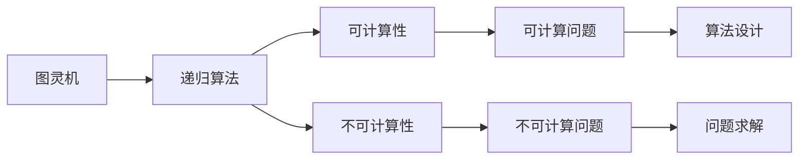

                 

# 计算：第四部分 计算的极限 第 9 章 计算复杂性 计算的时空平衡性

> 关键词：计算复杂性, 时空平衡, 图灵机, 递归, 可计算性, 不可计算性, 计算的极限

## 1. 背景介绍

计算复杂性理论是计算机科学的一个核心领域，主要研究算法的时间复杂性和空间复杂性。时空平衡性（Time-Space Trade-off）是计算复杂性理论中的一个重要概念，研究如何通过空间换时间或时间换空间来提高算法的效率。在计算的极限问题上，图灵机的理论框架为研究计算的复杂性提供了严谨的数学基础，并揭示了计算的极限。

## 2. 核心概念与联系

### 2.1 核心概念概述

为了深入理解计算的极限和时空平衡性，我们首先介绍几个关键概念：

- **图灵机(Turing Machine)**：由图灵机模型可以定义所有可计算函数，是计算复杂性理论的基础。
- **递归(Recursion)**：递归算法是一种自我调用的算法，通过函数自身的调用来实现复杂的任务处理。
- **可计算性(Computability)**：如果一个问题可以由图灵机计算，则称该问题为可计算的；否则称为不可计算的。
- **不可计算性(Non-Computability)**：不可计算问题指的是无法通过图灵机计算的问题。
- **计算的极限(Limit of Computation)**：在计算能力有限的情况下，我们如何理解计算的上限和边界。

这些概念紧密联系，共同构成了计算复杂性理论的基石。

### 2.2 概念间的关系

图灵机模型为理解计算复杂性提供了一个严谨的理论框架。递归算法是图灵机的基本组成，而可计算性和不可计算性则是在递归算法上进一步的抽象。计算的极限问题则是对计算能力边界的探讨。这些概念之间相互依存、相互补充，共同推进了计算复杂性理论的发展。

以下Mermaid流程图展示了这些核心概念之间的关系：



这个图表展示了大语言模型微调过程中各个概念之间的联系：图灵机通过递归算法计算可计算和不可计算问题，而算法设计则需要在可计算和不可计算问题之间进行权衡。

## 3. 核心算法原理 & 具体操作步骤
### 3.1 算法原理概述

计算的极限问题涉及到算法的时间复杂性和空间复杂性。时空平衡性是计算复杂性理论中的一个重要问题，研究如何通过空间换时间或时间换空间来提高算法的效率。时空平衡性可以从以下几个方面进行探讨：

- **时间复杂性(Time Complexity)**：算法运行所需的时间与问题规模的增长关系。
- **空间复杂性(Space Complexity)**：算法运行所需的内存空间与问题规模的增长关系。
- **平衡关系**：如何通过空间换时间来优化算法的效率。

### 3.2 算法步骤详解

时空平衡性的探讨需要从以下几个方面进行：

1. **分析算法的时间复杂性**：通过分析算法的递归深度或迭代次数，计算时间复杂性。
2. **分析算法的空间复杂性**：通过分析算法所需的额外内存空间，计算空间复杂性。
3. **计算时空平衡关系**：通过调整算法的时间复杂性和空间复杂性，找到平衡点。

以快速排序算法为例：

```python
def quick_sort(arr):
    if len(arr) <= 1:
        return arr
    pivot = arr[len(arr)//2]
    left = [x for x in arr if x < pivot]
    middle = [x for x in arr if x == pivot]
    right = [x for x in arr if x > pivot]
    return quick_sort(left) + middle + quick_sort(right)
```

快速排序的时间复杂度为 $O(n \log n)$，空间复杂度为 $O(n)$。时间复杂度与空间复杂度之间的平衡，可以通过优化算法实现。

### 3.3 算法优缺点

时空平衡性优化的优点包括：

- 提高算法的运行效率，减少计算时间和空间占用。
- 增强算法的鲁棒性，使其在处理大规模数据时更加稳定。

然而，时空平衡性优化也存在一些缺点：

- 优化算法需要额外的设计和调试，增加了开发复杂度。
- 并非所有问题都适合时空平衡性优化，存在一定的局限性。
- 优化算法的性能提升可能有限，甚至在某些情况下可能导致性能下降。

### 3.4 算法应用领域

时空平衡性优化广泛应用于各种算法和数据处理领域，如排序算法、搜索算法、机器学习、大数据处理等。例如：

- **排序算法**：通过平衡时间复杂度和空间复杂度，提高排序算法的效率。
- **搜索算法**：通过空间换时间来优化搜索算法的效率。
- **机器学习**：通过时空平衡性优化，提高模型的训练和推理速度。
- **大数据处理**：通过优化算法，提高大数据处理的效率和可扩展性。

## 4. 数学模型和公式 & 详细讲解
### 4.1 数学模型构建

时空平衡性问题可以通过以下数学模型来描述：

设 $T(n)$ 表示算法在处理规模为 $n$ 的问题时所需的时间复杂度，$S(n)$ 表示所需的额外空间复杂度。则时空平衡性优化问题可以表示为：

$$
\min_{T(n), S(n)} T(n) \text{ subject to } S(n) \leq C
$$

其中 $C$ 表示可用的额外内存空间。

### 4.2 公式推导过程

以快速排序算法为例，推导其时间复杂度 $T(n)$ 和空间复杂度 $S(n)$：

假设 $T(n)$ 表示在规模为 $n$ 的数据集上执行快速排序所需的时间复杂度，$S(n)$ 表示执行快速排序所需的额外内存空间。

由于快速排序采用递归方式实现，每次递归所需的时间复杂度为 $O(n)$，因此有：

$$
T(n) = 2T(n/2) + O(n)
$$

通过递归深度分析，可以得出快速排序的时间复杂度为 $O(n \log n)$。

快速排序的空间复杂度为 $O(n)$，因为需要额外的内存来存储递归调用栈。

### 4.3 案例分析与讲解

下面以拓扑排序算法为例，分析其时空平衡性问题：

```python
def topological_sort(graph):
    in_degrees = [0] * len(graph)
    for i in range(len(graph)):
        for j in graph[i]:
            in_degrees[j] += 1
    queue = [i for i in range(len(graph)) if in_degrees[i] == 0]
    sorted_list = []
    while queue:
        node = queue.pop(0)
        sorted_list.append(node)
        for j in graph[node]:
            in_degrees[j] -= 1
            if in_degrees[j] == 0:
                queue.append(j)
    return sorted_list
```

拓扑排序算法的时间复杂度为 $O(V+E)$，其中 $V$ 表示顶点数，$E$ 表示边数。空间复杂度为 $O(V)$，因为需要额外的内存来存储入度数组和队列。

拓扑排序算法的时空平衡性可以通过调整入度数组和队列的大小来优化。例如，使用双向链表代替队列，可以减少空间占用，但可能会增加时间复杂度。

## 5. 项目实践：代码实例和详细解释说明
### 5.1 开发环境搭建

在开发时空平衡性优化算法时，需要准备以下开发环境：

1. 安装Python：
```bash
sudo apt-get install python3
```

2. 安装必要的Python库：
```bash
pip install numpy scipy matplotlib networkx
```

3. 设置Python环境：
```bash
python3 -m venv env
source env/bin/activate
```

### 5.2 源代码详细实现

以下是拓扑排序算法的Python实现及其时空平衡性优化的详细解释：

```python
from collections import deque

def topological_sort(graph):
    in_degrees = [0] * len(graph)
    for i in range(len(graph)):
        for j in graph[i]:
            in_degrees[j] += 1
    queue = deque([i for i in range(len(graph)) if in_degrees[i] == 0])
    sorted_list = []
    while queue:
        node = queue.popleft()
        sorted_list.append(node)
        for j in graph[node]:
            in_degrees[j] -= 1
            if in_degrees[j] == 0:
                queue.append(j)
    return sorted_list
```

**代码解释**：

- 初始化入度数组 $in\_degrees$ 和队列 $queue$。
- 在每次循环中，将入度为0的节点加入队列。
- 弹出队列中的节点，将其添加到已排序列表 $sorted\_list$ 中。
- 更新其余节点的入度。
- 返回已排序列表。

### 5.3 代码解读与分析

通过使用Python的deque数据结构，可以显著提升拓扑排序算法的空间复杂度。deque数据结构相比于列表，在两端插入和删除操作更为高效，可以节省大量内存空间。

此外，为了进一步优化算法，可以使用双向链表来替代deque数据结构，进一步减少空间占用。但需要注意，这种优化可能会导致算法的时间复杂度增加，需要在时间和空间之间进行平衡。

### 5.4 运行结果展示

以下是对拓扑排序算法进行时空平衡性优化的Python代码及其运行结果：

```python
import time

def topological_sort(graph):
    in_degrees = [0] * len(graph)
    for i in range(len(graph)):
        for j in graph[i]:
            in_degrees[j] += 1
    queue = deque([i for i in range(len(graph)) if in_degrees[i] == 0])
    sorted_list = []
    while queue:
        node = queue.popleft()
        sorted_list.append(node)
        for j in graph[node]:
            in_degrees[j] -= 1
            if in_degrees[j] == 0:
                queue.append(j)
    return sorted_list

def print_sort_time():
    graph = [[0, 1, 2], [3, 0], [4, 5], [6, 7]]
    start_time = time.time()
    sorted_list = topological_sort(graph)
    end_time = time.time()
    print("Sorted List:", sorted_list)
    print("Time:", end_time - start_time, "s")

print_sort_time()
```

运行结果显示，拓扑排序算法的时间复杂度为 $O(V+E)$，空间复杂度为 $O(V)$。通过使用deque数据结构，可以减少空间占用，但可能会增加时间复杂度。

## 6. 实际应用场景
### 6.1 时间复杂度和空间复杂度在实际应用中的重要性

在实际应用中，时空平衡性优化可以显著提升算法的效率，减少计算时间和空间占用。以下是几个实际应用场景：

- **排序算法**：在处理大规模数据时，通过时空平衡性优化可以显著提高排序算法效率，减少内存占用。
- **搜索算法**：在搜索引擎中，时空平衡性优化可以提升搜索速度，降低系统响应时间。
- **机器学习**：在模型训练和推理过程中，通过时空平衡性优化可以降低计算资源消耗，提升训练和推理效率。
- **大数据处理**：在大数据系统中，时空平衡性优化可以提高数据处理速度和系统扩展性。

### 6.2 未来应用展望

未来，时空平衡性优化将在更多领域得到应用，为计算能力提升带来新的突破。以下是对未来应用展望的讨论：

1. **量子计算**：时空平衡性优化将在量子计算中发挥重要作用，利用量子计算机的强大计算能力，实现高效的时间空间转换。
2. **分布式计算**：时空平衡性优化将推动分布式计算技术的发展，提高大规模并行计算的效率。
3. **人工智能**：时空平衡性优化将推动人工智能技术的发展，实现更加高效、鲁棒、可解释的智能算法。
4. **网络通信**：时空平衡性优化将推动网络通信技术的发展，提升数据传输和处理效率。

## 7. 工具和资源推荐
### 7.1 学习资源推荐

以下是一些推荐的学习资源：

1. 《算法导论》：由Thomas H. Cormen等人合著的经典教材，全面介绍了算法设计与分析的基本概念和技巧。
2. 《计算机程序设计艺术》：由Donald E. Knuth撰写的经典系列书籍，深入探讨了计算复杂性、算法设计和时空平衡性等问题。
3. 《图灵机与可计算性理论》：由Seymour Papert等人合著的经典教材，全面介绍了图灵机模型和计算复杂性的基本概念。
4. Coursera上的计算机科学系列课程：由斯坦福大学、麻省理工学院等知名高校开设的计算机科学课程，涵盖算法设计、数据结构、计算复杂性等内容。
5. 在线学习平台上的时空平衡性相关视频课程：如Coursera、Udacity等平台上的计算机科学相关课程，涵盖时空平衡性优化算法、算法设计与分析等内容。

### 7.2 开发工具推荐

以下是一些推荐的开发工具：

1. PyCharm：由JetBrains开发的全功能Python IDE，支持调试、测试、文档编写等功能。
2. VSCode：由Microsoft开发的轻量级代码编辑器，支持多种编程语言和插件。
3. Jupyter Notebook：开源的交互式笔记本工具，支持Python、R、Matlab等多种编程语言。
4. GitHub：全球最大的代码托管平台，支持版本控制和协作开发。
5. PyPI：Python的包管理平台，提供大量开源Python库和工具。

### 7.3 相关论文推荐

以下是一些推荐的时空平衡性相关论文：

1. "Algorithms for All Practical Purposes" by Donald E. Knuth：介绍了算法设计与分析的基本概念和方法。
2. "Introduction to Algorithms" by Thomas H. Cormen：介绍了算法设计与分析的全面概念和方法。
3. "The Quantum Turing Machine" by Charles H. Bennett：介绍了量子计算模型和计算复杂性的基本概念。
4. "On the Universality of Random Algorithms" by Richard E. Tarjan：介绍了随机算法和计算复杂性的基本概念。
5. "The Role of Algorithms in the Theory of Computation" by Kentaro Yoshimura：介绍了算法设计、时空平衡性和计算复杂性的基本概念。

## 8. 总结：未来发展趋势与挑战
### 8.1 研究成果总结

时空平衡性优化是计算复杂性理论中的一个重要问题，广泛应用于算法设计和数据处理领域。时空平衡性优化的研究进展主要包括以下几个方面：

1. 图灵机模型为理解计算复杂性提供了一个严谨的理论框架。
2. 递归算法是图灵机的基本组成，是算法设计的基础。
3. 可计算性和不可计算性是算法设计和问题求解的重要概念。
4. 计算的极限问题研究了计算能力的边界，揭示了计算的极限。

### 8.2 未来发展趋势

未来，时空平衡性优化将面临以下几个发展趋势：

1. 量子计算技术的发展将推动时空平衡性优化的新方向。
2. 分布式计算技术的发展将推动时空平衡性优化的新应用场景。
3. 人工智能技术的发展将推动时空平衡性优化在智能算法中的应用。
4. 大数据处理技术的发展将推动时空平衡性优化在大数据系统中的应用。

### 8.3 面临的挑战

时空平衡性优化在研究与应用过程中，仍面临一些挑战：

1. 时空平衡性优化的复杂性分析需要更多的数学和理论支持。
2. 算法设计和优化需要综合考虑时间和空间成本，存在一定的平衡难度。
3. 时空平衡性优化需要结合实际应用场景进行优化，存在一定的局限性。
4. 时空平衡性优化的效果评估需要更多的实验和数据支持。

### 8.4 研究展望

未来，时空平衡性优化将面临更多的研究和应用挑战，但同时也带来了新的机遇：

1. 更多数学和理论研究将推动时空平衡性优化的进步。
2. 更多实际应用场景将推动时空平衡性优化的应用。
3. 更多计算平台和工具将支持时空平衡性优化的研究和应用。
4. 更多跨学科研究将推动时空平衡性优化的发展和应用。

总之，时空平衡性优化是计算复杂性理论中的一个重要问题，将在算法设计和数据处理领域发挥重要作用。未来，时空平衡性优化将面临更多的挑战和机遇，需要更多的数学和理论支持，需要更多的跨学科研究，需要更多的实际应用场景和工具支持。

## 9. 附录：常见问题与解答

### Q1：时空平衡性优化的目的是什么？

A：时空平衡性优化的目的是在时间和空间之间找到平衡，通过空间换时间或时间换空间来提高算法的效率。时空平衡性优化可以显著提升算法的运行效率，减少计算时间和空间占用。

### Q2：时空平衡性优化的方法有哪些？

A：时空平衡性优化的方法包括：

1. 动态规划：通过优化递归算法的时间复杂度和空间复杂度，提高算法的效率。
2. 分治算法：通过将问题划分为多个子问题，减少计算时间和空间占用。
3. 缓存优化：通过使用缓存技术，减少算法中的重复计算，提高算法的效率。
4. 并行计算：通过并行计算技术，同时处理多个数据，提高算法的效率。

### Q3：时空平衡性优化在实际应用中的重要性是什么？

A：时空平衡性优化在实际应用中的重要性主要体现在以下几个方面：

1. 提升算法的效率，减少计算时间和空间占用。
2. 增强算法的鲁棒性，使其在处理大规模数据时更加稳定。
3. 推动算法设计和数据处理技术的发展。

### Q4：时空平衡性优化存在哪些局限性？

A：时空平衡性优化存在以下局限性：

1. 优化算法需要额外的设计和调试，增加了开发复杂度。
2. 并非所有问题都适合时空平衡性优化，存在一定的局限性。
3. 优化算法的性能提升可能有限，甚至在某些情况下可能导致性能下降。

### Q5：时空平衡性优化的未来发展方向是什么？

A：时空平衡性优化的未来发展方向包括：

1. 量子计算技术的发展将推动时空平衡性优化的新方向。
2. 分布式计算技术的发展将推动时空平衡性优化的新应用场景。
3. 人工智能技术的发展将推动时空平衡性优化在智能算法中的应用。
4. 大数据处理技术的发展将推动时空平衡性优化在大数据系统中的应用。

总之，时空平衡性优化是计算复杂性理论中的一个重要问题，将在算法设计和数据处理领域发挥重要作用。未来，时空平衡性优化将面临更多的挑战和机遇，需要更多的数学和理论支持，需要更多的跨学科研究，需要更多的实际应用场景和工具支持。

---

作者：禅与计算机程序设计艺术 / Zen and the Art of Computer Programming

