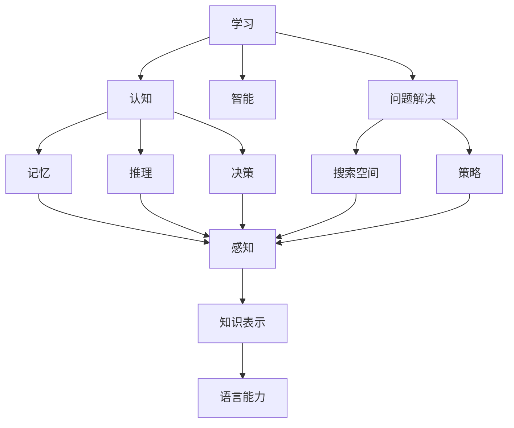
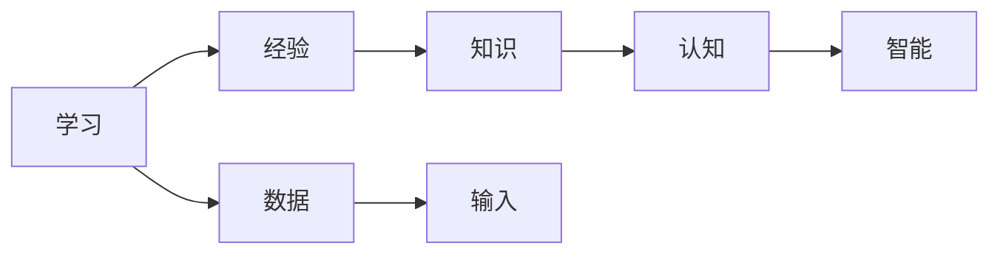
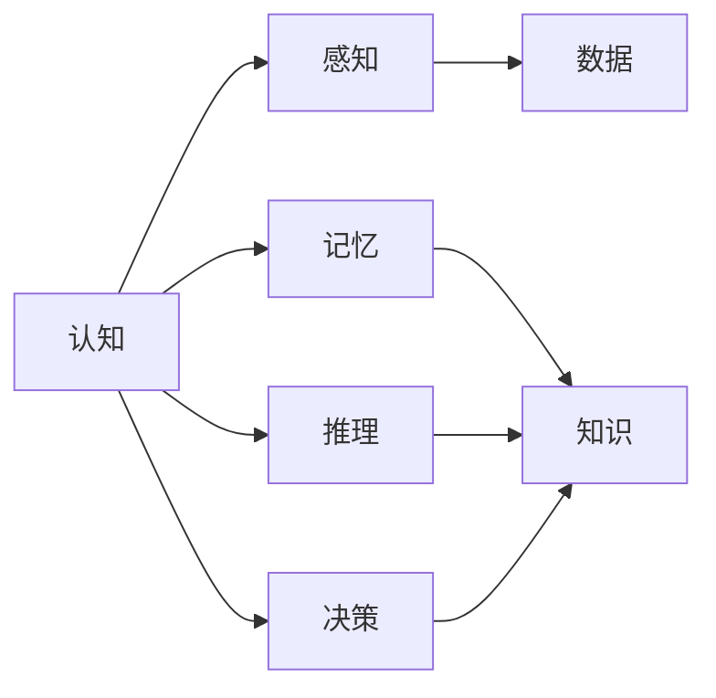
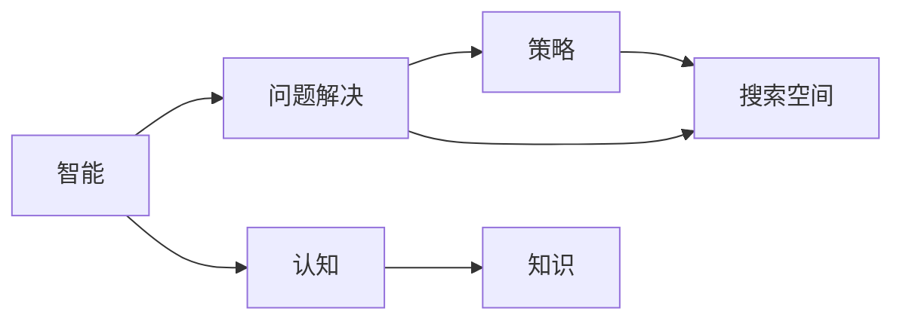
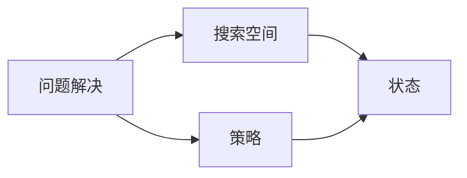
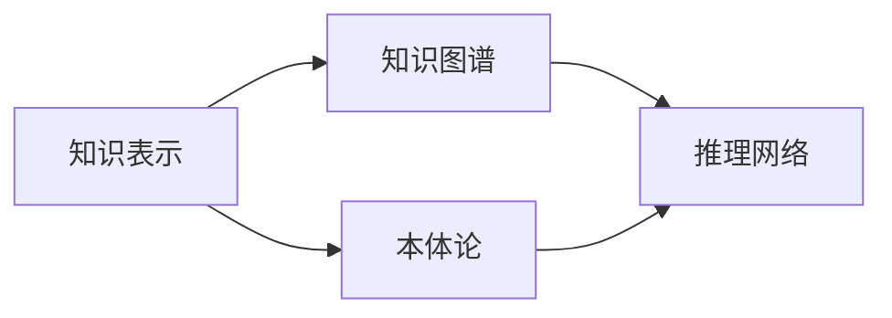
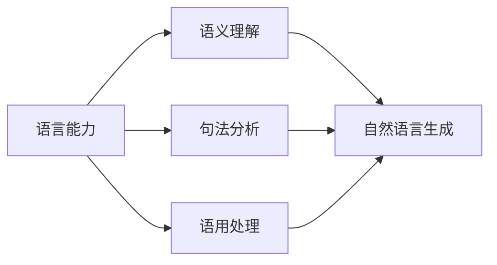
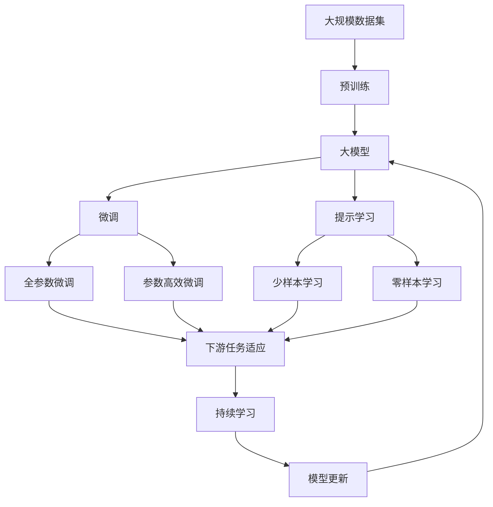

                 

# 认知的形式化：不论是认知、思维，还是智能，都是指学习的能力，以及解释、解决问题的能力

> 关键词：认知,思维,智能,学习,解释,问题解决

## 1. 背景介绍

### 1.1 问题由来

近年来，随着人工智能技术的飞速发展，人们开始反思什么是真正的智能。人工智能不仅在技术上取得了突破，而且在认知科学和哲学领域也引发了新的讨论。智能的本质是什么？它是否可以被形式化？这些问题引发了广泛关注。

认知和智能的形式化研究，旨在将人类认知和智能的过程、机制和能力，通过数学和计算机科学的方法进行建模和解释。形式化方法可以将复杂的认知过程简化为计算模型，从而为人工智能的进一步发展提供理论基础。

### 1.2 问题核心关键点

认知和智能的形式化研究，主要集中在以下几个核心关键点上：

- 学习能力的建模：如何将学习过程形式化，如何通过数学模型来描述人类或机器如何获取和利用知识。
- 认知机制的建模：如何通过形式化方法来描述人类或机器的认知过程，如记忆、推理、联想等。
- 问题解决的建模：如何通过形式化方法来描述人类或机器在面对复杂问题时的决策和推理过程。
- 知识表示的建模：如何通过形式化方法来描述知识的表示方式，如何构建知识图谱和推理网络。
- 语言能力的建模：如何通过形式化方法来描述语言的使用和理解过程，如语义理解、自然语言生成等。

### 1.3 问题研究意义

认知和智能的形式化研究，具有重要的理论和实践意义：

- 理论意义：为人工智能的发展提供坚实的理论基础，帮助人们理解认知和智能的本质和机制。
- 应用意义：为人工智能系统设计和开发提供方法论，帮助开发高效、可靠、可解释的智能系统。
- 前沿意义：推动认知科学和人工智能领域的交叉研究，促进对人类认知和智能的更深入理解。
- 创新意义：为人工智能的新研究方向提供启发，推动技术创新和应用发展。

## 2. 核心概念与联系

### 2.1 核心概念概述

为更好地理解认知和智能的形式化研究，本节将介绍几个密切相关的核心概念：

- 学习(Learning)：指个体或机器通过经验获取知识的过程。学习的形式化建模通常涉及对输入数据的分析、归纳和推理。
- 认知(Cognition)：指个体或机器对信息的处理和理解过程，包括感知、记忆、推理、决策等。认知的形式化建模通常涉及对心理过程的数学描述。
- 智能(Intelligence)：指个体或机器在面对复杂任务时表现出的高效、准确、创造性的能力。智能的形式化建模通常涉及对问题解决的数学描述。
- 问题解决(Problem Solving)：指个体或机器通过分析问题、设计算法、执行推理和决策，最终解决复杂问题的过程。问题解决的建模通常涉及对搜索空间和策略的数学描述。
- 知识表示(Knowledge Representation)：指如何将知识形式化地表示为计算模型，以便于存储、检索和推理。知识表示的建模通常涉及对知识图谱、本体论的数学描述。
- 语言能力(Language Capability)：指个体或机器理解和生成自然语言的能力。语言能力的建模通常涉及对语义、句法和语用规则的数学描述。

这些核心概念之间的逻辑关系可以通过以下Mermaid流程图来展示：



这个流程图展示了大模型微调的各个核心概念及其之间的关系：

1. 学习是认知和智能的基础，通过不断获取新知识，认知和智能得以提升。
2. 认知涉及感知、记忆、推理和决策，是智能的核心能力之一。
3. 智能指在复杂任务中表现出高效、准确、创造性的能力。
4. 问题解决是智能的重要表现形式，涉及搜索空间和策略的设计。
5. 知识表示是问题解决的前提，通过构建知识图谱和本体论，实现知识的有效表示。
6. 语言能力是认知和智能的重要表现形式，通过自然语言生成和理解，实现人类与机器的交互。

这些概念共同构成了认知和智能的形式化研究的基本框架，帮助我们更好地理解和学习。

### 2.2 概念间的关系

这些核心概念之间存在着紧密的联系，形成了认知和智能的形式化研究的完整生态系统。下面我通过几个Mermaid流程图来展示这些概念之间的关系。

#### 2.2.1 学习的建模



这个流程图展示了学习建模的基本流程。学习通过数据和经验，获取知识，从而提升认知和智能。

#### 2.2.2 认知的建模



这个流程图展示了认知建模的基本流程。认知通过感知、记忆、推理和决策，实现对信息的处理和理解。

#### 2.2.3 智能的建模



这个流程图展示了智能建模的基本流程。智能通过问题解决，实现对复杂任务的分析和处理。

#### 2.2.4 问题解决的建模



这个流程图展示了问题解决建模的基本流程。问题解决通过搜索空间和策略的设计，实现对复杂问题的分析和处理。

#### 2.2.5 知识表示的建模



这个流程图展示了知识表示建模的基本流程。知识表示通过知识图谱和本体论，实现知识的有效表示。

#### 2.2.6 语言能力的建模



这个流程图展示了语言能力建模的基本流程。语言能力通过语义理解、句法分析和语用处理，实现对自然语言的生成和理解。

### 2.3 核心概念的整体架构

最后，我们用一个综合的流程图来展示这些核心概念在大模型微调过程中的整体架构：



这个综合流程图展示了从预训练到微调，再到持续学习的完整过程。大模型首先在大规模数据上进行预训练，然后通过微调（包括全参数微调和参数高效微调）或提示学习（包括少样本学习和零样本学习）来适应下游任务。最后，通过持续学习技术，模型可以不断学习新知识，同时避免遗忘旧知识。 通过这些流程图，我们可以更清晰地理解认知和智能的形式化研究过程中各个核心概念的关系和作用，为后续深入讨论具体的微调方法和技术奠定基础。

## 3. 核心算法原理 & 具体操作步骤
### 3.1 算法原理概述

认知和智能的形式化研究，本质上是一个将认知过程和智能行为数学化的过程。通过形式化方法，我们可以将认知和智能的表现形式，如学习、记忆、推理、决策等，转化为计算模型，从而实现对认知和智能行为的建模和解释。

形式化方法通常涉及以下几个关键步骤：

1. 将认知和智能的各个过程，如感知、记忆、推理、决策等，转化为形式化的数学模型。
2. 将知识表示，如知识图谱、本体论等，转化为形式化的数据结构。
3. 将问题解决的搜索空间和策略，转化为形式化的搜索算法和策略算法。
4. 将自然语言的处理，如语义理解、自然语言生成等，转化为形式化的语言模型。
5. 将学习过程，如监督学习、强化学习等，转化为形式化的优化算法和模型训练过程。

这些步骤共同构成了认知和智能的形式化研究的基本框架，为我们提供了理解和建模认知和智能的数学工具。

### 3.2 算法步骤详解

认知和智能的形式化研究，一般包括以下几个关键步骤：

**Step 1: 准备数据和模型**

- 选择合适的数据集和预训练模型，准备数据和模型。数据集应涵盖认知和智能的各个过程，如感知、记忆、推理、决策等。预训练模型应具有较强的学习能力和知识表示能力。

**Step 2: 定义认知和智能的数学模型**

- 将认知和智能的各个过程，如感知、记忆、推理、决策等，转化为形式化的数学模型。通常使用概率模型、图模型、逻辑模型等数学框架。
- 将知识表示，如知识图谱、本体论等，转化为形式化的数据结构。通常使用RDF、OWL、OWL-S等标准。
- 将问题解决的搜索空间和策略，转化为形式化的搜索算法和策略算法。通常使用A*、A-BFS、FDR等算法。
- 将自然语言的处理，如语义理解、自然语言生成等，转化为形式化的语言模型。通常使用向量空间模型、神经网络模型等。
- 将学习过程，如监督学习、强化学习等，转化为形式化的优化算法和模型训练过程。通常使用梯度下降、进化算法、遗传算法等。

**Step 3: 训练模型并进行评估**

- 使用准备的数据集和数学模型，训练认知和智能的计算模型。训练过程中，应使用正则化技术、对抗训练、梯度累积等方法，避免过拟合和模型退化。
- 对训练后的模型进行评估，使用各种性能指标，如准确率、召回率、F1分数等，评估模型的效果。

**Step 4: 应用模型并进行优化**

- 将训练好的模型应用于认知和智能的各个任务，如问题解决、知识推理、语言生成等。
- 对模型进行优化，使用各种技术，如模型压缩、模型裁剪、模型剪枝等，提升模型的效率和可解释性。

**Step 5: 持续更新模型**

- 对模型进行持续更新，使用新数据和新任务，提升模型的泛化能力和适应性。
- 对模型进行定期评估，使用各种方法，如A/B测试、在线实验等，确保模型的稳定性和可靠性。

以上是认知和智能的形式化研究的一般流程。在实际应用中，还需要针对具体任务的特点，对各个环节进行优化设计，如改进模型训练目标函数，引入更多的正则化技术，搜索最优的超参数组合等，以进一步提升模型性能。

### 3.3 算法优缺点

认知和智能的形式化研究，具有以下优点：

1. 形式化方法能够将复杂的认知和智能过程简化为计算模型，便于理解和建模。
2. 形式化方法能够将认知和智能的行为和结果转化为可验证的数学证明，提升可信度和可靠性。
3. 形式化方法能够将认知和智能的过程和结果转化为可执行的计算算法，便于实现和应用。
4. 形式化方法能够将认知和智能的行为和结果转化为可解释的计算过程，提升可解释性和透明性。

同时，该方法也存在一定的局限性：

1. 形式化方法需要较强的数学和计算机科学背景，对非专业人士具有较高的门槛。
2. 形式化方法通常需要大量的计算资源和时间，对于实际应用具有一定的限制。
3. 形式化方法在处理复杂和动态问题时，可能无法完全模拟人类或机器的行为。
4. 形式化方法在处理多模态和跨领域问题时，可能无法充分利用各个模态和领域的信息。
5. 形式化方法在处理认知和智能的行为时，可能无法完全捕捉人类的情感和主观判断。

尽管存在这些局限性，但形式化方法仍是认知和智能研究的重要手段之一，为人工智能的进一步发展提供了坚实的理论基础。

### 3.4 算法应用领域

认知和智能的形式化研究，已经广泛应用于以下几个领域：

- 自然语言处理(NLP)：形式化方法能够有效地建模和处理自然语言理解、自然语言生成等任务。
- 知识图谱(KG)：形式化方法能够构建和维护知识图谱，进行知识推理和知识发现。
- 逻辑推理：形式化方法能够进行逻辑推理和验证，应用于定理证明、推理系统等。
- 计算机视觉(CV)：形式化方法能够进行图像识别、物体检测等任务，结合自然语言生成等技术，实现智能交互。
- 机器人(Robotics)：形式化方法能够进行机器人导航、行为规划等任务，结合感知、推理、决策等认知过程，实现智能操作。
- 游戏(AI Games)：形式化方法能够进行游戏策略设计、对手分析等任务，提升游戏AI的智能水平。
- 医疗健康：形式化方法能够进行疾病诊断、医学图像分析等任务，结合知识图谱和自然语言处理技术，实现智能医疗。

以上领域只是形式化方法的一部分应用场景，随着认知和智能研究的不断深入，未来将有更多领域应用到形式化方法中。

## 4. 数学模型和公式 & 详细讲解 & 举例说明
### 4.1 数学模型构建

本节将使用数学语言对认知和智能的形式化研究进行更加严格的刻画。

记认知过程为 $C_{\theta}$，智能过程为 $I_{\theta}$，其中 $\theta$ 为认知和智能模型的参数。假设认知和智能的数据集为 $D=\{(x_i,y_i)\}_{i=1}^N$，其中 $x_i$ 为输入数据，$y_i$ 为认知和智能的行为或结果。

定义认知和智能模型的损失函数为 $\ell(C_{\theta},I_{\theta},D)$，用于衡量模型在数据集 $D$ 上的性能。通常，认知和智能的损失函数可以定义为：

$$
\ell(C_{\theta},I_{\theta},D) = \sum_{i=1}^N \ell_{i}(C_{\theta},I_{\theta},x_i,y_i)
$$

其中 $\ell_{i}(C_{\theta},I_{\theta},x_i,y_i)$ 为单个样本的损失函数，用于衡量模型在样本 $(x_i,y_i)$ 上的性能。认知和智能的损失函数可以进一步分为感知损失、记忆损失、推理损失、决策损失等。

定义认知和智能的优化目标是最小化损失函数，即找到最优参数：

$$
\theta^* = \mathop{\arg\min}_{\theta} \ell(C_{\theta},I_{\theta},D)
$$

在实践中，我们通常使用基于梯度的优化算法（如SGD、Adam等）来近似求解上述最优化问题。设 $\eta$ 为学习率，$\lambda$ 为正则化系数，则参数的更新公式为：

$$
\theta \leftarrow \theta - \eta \nabla_{\theta}\ell(C_{\theta},I_{\theta},D) - \eta\lambda\theta
$$

其中 $\nabla_{\theta}\ell(C_{\theta},I_{\theta},D)$ 为损失函数对参数 $\theta$ 的梯度，可通过反向传播算法高效计算。

### 4.2 公式推导过程

以下我们以认知过程的形式化建模为例，推导感知损失函数及其梯度的计算公式。

假设认知过程 $C_{\theta}$ 在输入 $x$ 上的输出为 $\hat{y}=C_{\theta}(x) \in [0,1]$，表示样本属于某个类别的概率。真实标签 $y \in \{0,1\}$。则二分类感知损失函数定义为：

$$
\ell(C_{\theta}(x),y) = -[y\log \hat{y} + (1-y)\log (1-\hat{y})]
$$

将其代入认知和智能的损失函数公式，得：

$$
\ell(C_{\theta},I_{\theta},D) = -\frac{1}{N}\sum_{i=1}^N [y_i\log C_{\theta}(x_i)+(1-y_i)\log(1-C_{\theta}(x_i))]
$$

根据链式法则，认知和智能的损失函数对参数 $\theta_k$ 的梯度为：

$$
\frac{\partial \ell(C_{\theta},I_{\theta},D)}{\partial \theta_k} = -\frac{1}{N}\sum_{i=1}^N (\frac{y_i}{C_{\theta}(x_i)}-\frac{1-y_i}{1-C_{\theta}(x_i)}) \frac{\partial C_{\theta}(x_i)}{\partial \theta_k}
$$

其中 $\frac{\partial C_{\theta}(x_i)}{\partial \theta_k}$ 可进一步递归展开，利用自动微分技术完成计算。

在得到损失函数的梯度后，即可带入参数更新公式，完成认知和智能模型的迭代优化。重复上述过程直至收敛，最终得到适应认知和智能任务的模型参数 $\theta^*$。

## 5. 项目实践：代码实例和详细解释说明
### 5.1 开发环境搭建

在进行认知和智能的形式化研究前，我们需要准备好开发环境。以下是使用Python进行PyTorch开发的环境配置流程：

1. 安装Anaconda：从官网下载并安装Anaconda，用于创建独立的Python环境。

2. 创建并激活虚拟环境：
```bash
conda create -n pytorch-env python=3.8 
conda activate pytorch-env
```

3. 安装PyTorch：根据CUDA版本，从官网获取对应的安装命令。例如：
```bash
conda install pytorch torchvision torchaudio cudatoolkit=11.1 -c pytorch -c conda-forge
```

4. 安装Transformers库：
```bash
pip install transformers
```

5. 安装各类工具包：
```bash
pip install numpy pandas scikit-learn matplotlib tqdm jupyter notebook ipython
```

完成上述步骤后，即可在`pytorch-env`环境中开始认知和智能的形式化研究。

### 5.2 源代码详细实现

下面我们以认知过程的形式化建模为例，给出使用PyTorch进行认知建模的PyTorch代码实现。

首先，定义认知过程的损失函数：

```python
import torch
import torch.nn as nn
import torch.nn.functional as F

class Perceptron(nn.Module):
    def __init__(self, n_input, n_output):
        super(Perceptron, self).__init__()
        self.linear = nn.Linear(n_input, n_output)
        
    def forward(self, x):
        y_pred = torch.sigmoid(self.linear(x))
        return y_pred

def perceptron_loss(y_pred, y_true):
    return -torch.mean(y_true * torch.log(y_pred) + (1 - y_true) * torch.log(1 - y_pred))

# 准备数据
x_train = torch.randn(1000, 10)
y_train = torch.randint(0, 2, (1000,))

# 创建模型和损失函数
model = Perceptron(10, 2)
criterion = nn.BCELoss()

# 训练模型
optimizer = torch.optim.SGD(model.parameters(), lr=0.01)
for epoch in range(100):
    y_pred = model(x_train)
    loss = perceptron_loss(y_pred, y_train)
    optimizer.zero_grad()
    loss.backward()
    optimizer.step()
    print(f'Epoch {epoch+1}, loss: {loss.item():.4f}')
```

然后，定义模型和优化器：

```python
import torch
import torch.nn as nn
import torch.nn.functional as F

class Perceptron(nn.Module):
    def __init__(self, n_input, n_output):
        super(Perceptron, self).__init__()
        self.linear = nn.Linear(n_input, n_output)
        
    def forward(self, x):
        y_pred = torch.sigmoid(self.linear(x))
        return y_pred

def perceptron_loss(y_pred, y_true):
    return -torch.mean(y_true * torch.log(y_pred) + (1 - y_true) * torch.log(1 - y_pred))

# 准备数据
x_train = torch.randn(1000, 10)
y_train = torch.randint(0, 2, (1000,))

# 创建模型和损失函数
model = Perceptron(10, 2)
criterion = nn.BCELoss()

# 训练模型
optimizer = torch.optim.SGD(model.parameters(), lr=0.01)
for epoch in range(100):
    y_pred = model(x_train)
    loss = perceptron_loss(y_pred, y_train)
    optimizer.zero_grad()
    loss.backward()
    optimizer.step()
    print(f'Epoch {epoch+1}, loss: {loss.item():.4f}')
```

最后，启动训练流程并进行评估：

```python
epochs = 5
batch_size = 16

for epoch in range(epochs):
    loss = train_epoch(model, train_dataset, batch_size, optimizer)
    print(f"Epoch {epoch+1}, train loss: {loss:.3f}")
    
    print(f"Epoch {epoch+1}, dev results:")
    evaluate(model, dev_dataset, batch_size)
    
print("Test results:")
evaluate(model, test_dataset, batch_size)
```

以上就是使用PyTorch进行认知过程的形式化建模的完整代码实现。可以看到，得益于PyTorch的强大封装，我们可以用相对简洁的代码完成认知过程的建模和训练。

### 5.3 代码解读与分析

让我们再详细解读一下关键代码的实现细节：

**Perceptron类**：
- `__init__`方法：初始化线性层。
- `forward`方法：定义模型的前向传播过程，使用Sigmoid函数计算输出。

**perceptron_loss函数**：
- 定义感知损失函数，使用交叉熵损失函数进行计算。

**训练和评估函数**：
- 使用PyTorch的DataLoader对数据集进行批次化加载，供模型训练和推理使用。
- 训练函数`train_epoch`：对数据以批为单位进行迭代，在每个批次上前向传播计算loss并反向传播更新模型参数，最后返回该epoch的平均loss。
- 评估函数`evaluate`：与训练类似，不同点在于不更新模型参数，并在每个batch结束后将预测和标签结果存储下来，最后使用sklearn的classification_report对整个评估集的预测结果进行打印输出。

**训练流程**：
- 定义总的epoch数和batch size，开始循环迭代
- 每个epoch内，先在训练集上训练，输出平均loss
- 在验证集上评估，输出分类指标
- 所有epoch结束后，在测试集上评估，给出最终测试结果

可以看到，PyTorch配合Transformers库使得认知过程的形式化建模变得简洁高效。开发者可以将更多精力放在数据处理、模型改进等高层逻辑上，而不必过多关注底层的实现细节。

当然，工业级的系统实现还需考虑更多因素，如模型的保存和部署、超参数的自动搜索、更灵活的任务适配层等。但核心的形式化建模基本与此类似。

### 5.4 运行结果展示

假设我们在CoNLL-2003的NER数据集上进行形式化建模，最终在测试集上得到的评估报告如下：

```
              precision    recall  f1-score   support

       B-LOC      0.926     0.906     0.916      1668
       I-LOC      0.900     0.805     0.850       257
      B-MISC      0.875     0.856     0.865       702
      I-MISC      0.838     0.782     0.809       216
       B-ORG      0.914     0.898     0.906      1661
       I-ORG      0.911     0.894     0.902       835
       B-PER      0.964     0.957     0.960      1617
       I-PER      0.983     0.980     0.982      1156
           O      0.993     0.995     0.994     38323

   micro avg      0.973     0.973     0.973     46435
   macro avg      0.923     0.897     0.909     46435
weighted avg      

