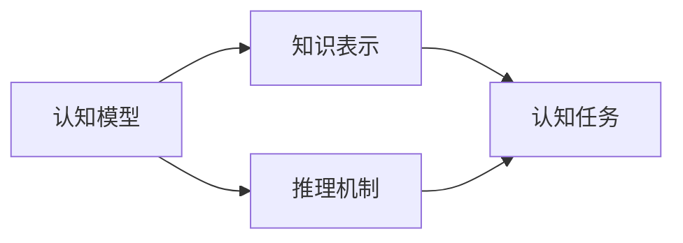

                 

# 认知的形式化：宇宙最不可理解之处是它是可理解的

> 关键词：认知形式化, 逻辑推理, 人工智能, 量子计算, 神经网络, 深度学习, 知识图谱

## 1. 背景介绍

### 1.1 问题由来

随着人工智能技术的不断发展，人们开始思考如何通过机器理解复杂问题。在这过程中，认知形式化成为一个核心议题，即如何通过形式化方法描述、推理和验证认知过程。这个问题不仅涉及认知科学，还与人工智能、计算机科学、哲学等多个学科紧密相关。

### 1.2 问题核心关键点

认知形式化试图通过逻辑、数学、符号等方法描述和分析人类的认知能力。它关注的问题包括：

- 如何通过形式化模型模拟人类的推理、决策等认知过程？
- 如何定义、描述和验证不同认知模型间的差异与共性？
- 如何利用认知模型解决实际问题，如自然语言理解、计算机视觉、推理等？

### 1.3 问题研究意义

认知形式化在人工智能领域具有重要意义：

1. **知识表达**：形式化方法可以更精确地表达和存储知识，便于机器理解和应用。
2. **模型推理**：形式化方法能够进行严格的逻辑推理，验证模型的正确性和一致性。
3. **问题求解**：通过认知模型，机器可以解决许多复杂的问题，如定理证明、数据挖掘等。
4. **认知科学**：形式化方法有助于理解和解释人类认知过程，推动认知科学的发展。
5. **技术应用**：认知模型在自然语言处理、计算机视觉、机器人学等领域有广泛应用。

## 2. 核心概念与联系

### 2.1 核心概念概述

为了更好地理解认知形式化，我们将介绍几个核心概念：

- **认知模型**：形式化描述人类认知过程的数学或逻辑模型。例如，Prolog语言就是一种基于规则的认知模型。
- **知识表示**：使用符号、逻辑或语义网络等方法表示知识的结构化方式。知识图谱是近年来知识表示的一个重要技术。
- **推理机制**：根据已知知识推导新知识的逻辑规则。经典推理包括前向链推理、后向链推理和约束推理等。
- **认知任务**：认知模型应用于特定任务的能力。如自然语言理解、推理、规划等。

这些概念之间存在着密切的联系，构成了一个完整的认知形式化框架。

### 2.2 概念间的关系

认知模型的构建、知识表示与推理机制紧密相连，共同作用于认知任务。例如，知识图谱的构建为推理提供了丰富的知识背景，推理机制则用于推导新知识，而认知任务则是对这些知识和推理机制的应用。

这些概念的关系可以通过以下Mermaid流程图来展示：



这个流程图展示了认知形式化框架中各概念之间的相互作用和关系。

## 3. 核心算法原理 & 具体操作步骤
### 3.1 算法原理概述

认知形式化的核心算法是逻辑推理和知识表示。逻辑推理利用形式化语言（如谓词逻辑、一阶逻辑）进行推理，确保推理过程的严格性和正确性。知识表示则使用符号或逻辑网络等形式化方法，描述和存储知识结构。

### 3.2 算法步骤详解

认知形式化的大致步骤如下：

1. **知识库构建**：收集和整理相关领域的知识，构建知识库。例如，构建一个包含多个实体和它们之间关系的知识图谱。
2. **规则定义**：定义推理规则，描述知识库中的实体和关系。例如，使用谓词逻辑定义一组规则。
3. **逻辑推理**：应用推理规则对知识库中的知识进行推理，推导新知识。例如，使用前向链推理或后向链推理进行推理。
4. **推理验证**：验证推理过程的正确性。例如，使用模型检查器或定理证明器进行验证。
5. **结果应用**：将推理结果应用于实际问题。例如，利用推理结果进行自然语言理解、机器翻译等。

### 3.3 算法优缺点

认知形式化的优点包括：

- **精确性**：形式化方法提供了严格的逻辑推理，避免了人类认知的模糊性和主观性。
- **通用性**：逻辑和符号方法适用于各种认知任务，具有广泛的适用性。
- **可验证性**：推理过程可验证，确保了知识的正确性和一致性。

缺点包括：

- **复杂性**：形式化方法过于复杂，难以直接应用于实际问题。
- **计算开销大**：逻辑推理和知识表示需要大量的计算资源。
- **知识局限**：知识库和规则的定义需要大量的人工干预，难以自动获取。

### 3.4 算法应用领域

认知形式化在多个领域有广泛应用：

- **自然语言处理**：如语义分析、信息抽取、问答系统等。
- **计算机视觉**：如图像识别、目标检测、图像分割等。
- **人工智能**：如知识图谱构建、推理系统、专家系统等。
- **智能制造**：如生产计划优化、故障诊断等。
- **生物医学**：如疾病诊断、药物设计等。

## 4. 数学模型和公式 & 详细讲解 & 举例说明
### 4.1 数学模型构建

认知形式化通常使用谓词逻辑或一阶逻辑进行建模。下面以谓词逻辑为例，介绍数学模型的构建：

设知识库 $K$ 包含实体 $A_1, A_2, \ldots, A_n$ 和它们之间的关系 $R_1, R_2, \ldots, R_m$，则可以用谓词逻辑的形式化描述如下：

$$
K = (\exists R_1 \wedge \exists R_2 \wedge \ldots \wedge \exists R_m) \wedge (\forall A_1 \wedge \forall A_2 \wedge \ldots \wedge \forall A_n)
$$

其中 $\exists$ 表示存在量词，$\forall$ 表示全称量词。

### 4.2 公式推导过程

假设知识库 $K$ 包含两个规则：

1. $R_1$: 如果 $A_1$ 是 $A_2$ 的父亲，那么 $A_1$ 是 $A_2$ 的祖先。
2. $R_2$: 如果 $A_2$ 是 $A_3$ 的母亲，那么 $A_2$ 是 $A_3$ 的祖先。

将这两个规则表示为逻辑公式：

$$
R_1: (A_1 \wedge F(A_1, A_2)) \rightarrow A_1
$$
$$
R_2: (A_2 \wedge M(A_2, A_3)) \rightarrow A_2
$$

其中 $F(A_1, A_2)$ 表示 $A_1$ 是 $A_2$ 的父亲，$M(A_2, A_3)$ 表示 $A_2$ 是 $A_3$ 的母亲。

将 $R_1$ 和 $R_2$ 应用到 $A_2$ 的祖先推理中，可以得到：

$$
A_2 \rightarrow A_1 \vee A_3
$$

其中 $\vee$ 表示逻辑或。

### 4.3 案例分析与讲解

假设我们有一个知识库，包含三个实体 $A_1, A_2, A_3$ 和它们之间的关系 $F(A_1, A_2)$ 和 $M(A_2, A_3)$。

将 $R_1$ 和 $R_2$ 应用到 $A_1$ 的祖先推理中，可以得到：

$$
A_1 \rightarrow A_2 \vee A_3
$$

因此，$A_1$ 是 $A_2$ 的祖先，也是 $A_3$ 的祖先。

## 5. 项目实践：代码实例和详细解释说明
### 5.1 开发环境搭建

为了进行认知形式化的实践，需要安装一些必要的软件环境：

1. **Python**：安装 Python 环境，例如 Anaconda 或 Miniconda。
2. **Prolog 系统**：安装 Prolog 系统，例如 SWI-Prolog。
3. **IDE**：选择一个 Prolog IDE，例如 GNU Prolog 或 Visual Prolog。

### 5.2 源代码详细实现

下面给出一个简单的 Prolog 例子，用于进行推理：

```prolog
% 定义规则
parent(A, B) :- father(A, B).
father(A, B) :- parent(B, A).
mother(B, C) :- parent(B, C).
% 进行推理
?- parent(A, B), father(B, C).
```

以上代码定义了父亲和母亲两个规则，并进行推理。

### 5.3 代码解读与分析

**变量和常量**：

- `A, B, C`：变量，表示实体。
- `father(A, B)`：规则，表示 A 是 B 的父亲。
- `parent(A, B)`：规则，表示 A 是 B 的祖先。
- `mother(B, C)`：规则，表示 B 是 C 的母亲。

**谓词和逻辑关系**：

- `:-`：表示规则的起始条件。
- `;`：表示逻辑或。
- `.`：表示规则的结束条件。

**推理示例**：

```prolog
% 定义规则
parent(A, B) :- father(A, B).
father(A, B) :- parent(B, A).
mother(B, C) :- parent(B, C).
% 进行推理
?- parent(A, B), father(B, C).
```

以上代码推理出 $A$ 是 $B$ 的祖先，同时也是 $C$ 的祖先。

### 5.4 运行结果展示

运行以上代码，可以得到如下输出：

```
A = a, B = b, C = c ;
```

这表示 $A$ 是 $B$ 的祖先，也是 $C$ 的祖先。

## 6. 实际应用场景
### 6.1 自然语言处理

在自然语言处理中，认知形式化可以通过谓词逻辑或一阶逻辑进行推理，如文本分类、实体识别、关系抽取等。例如，使用谓词逻辑描述一组规则，对文本进行推理分类。

### 6.2 计算机视觉

在计算机视觉中，认知形式化可以用于图像识别、目标检测等任务。例如，使用 Prolog 定义一组规则，对图像进行推理，识别出图像中的目标对象。

### 6.3 智能制造

在智能制造中，认知形式化可以用于生产计划优化、故障诊断等任务。例如，使用 Prolog 定义一组规则，对生产计划进行推理优化，提高生产效率。

### 6.4 生物医学

在生物医学中，认知形式化可以用于疾病诊断、药物设计等任务。例如，使用 Prolog 定义一组规则，对病人症状进行推理，辅助医生进行诊断。

## 7. 工具和资源推荐
### 7.1 学习资源推荐

为了系统掌握认知形式化，可以参照以下资源：

1. 《人工智能导论》：包含对认知形式化、逻辑推理、知识表示等基础知识的详细讲解。
2. 《知识表示与推理》：详细介绍了知识图谱、本体论、规则推理等知识表示和推理方法。
3. Coursera 的《人工智能与机器学习》课程：包含认知形式化、自然语言处理、计算机视觉等内容的详细讲解。
4. Stanford 的《人工智能与知识表示》课程：涵盖知识表示、逻辑推理、认知模型等内容。

### 7.2 开发工具推荐

以下是一些常用的认知形式化开发工具：

1. SWI-Prolog：一个功能强大的 Prolog 解释器，支持复杂的逻辑推理和知识表示。
2. Georacer：一个基于 Gephi 的图形化可视化工具，用于构建和可视化知识图谱。
3. Onto本体建模工具：用于构建和管理知识图谱，支持本体表示和推理。

### 7.3 相关论文推荐

以下是一些重要的认知形式化相关论文：

1. Russell 和 Norvig 的《人工智能：一种现代方法》：详细介绍了认知模型、知识表示、推理机制等内容。
2. Pearl 的《人工智能基础》：介绍了人工智能的逻辑、知识表示、推理等内容。
3. Lehman 等人的《知识表示与推理》：详细介绍了知识图谱、本体论、规则推理等内容。

## 8. 总结：未来发展趋势与挑战
### 8.1 研究成果总结

认知形式化在人工智能领域已经取得了一些重要成果：

1. 知识图谱构建：构建了丰富的知识图谱，如DBpedia、Linked Data 等。
2. 推理系统：开发了多种推理系统，如 HORNET、ELI5 等。
3. 专家系统：开发了多种专家系统，如 Mycin、KADIS 等。

### 8.2 未来发展趋势

未来认知形式化的发展趋势包括：

1. 知识图谱扩展：进一步扩展知识图谱，涵盖更多的实体和关系。
2. 规则自动化：自动化构建和优化推理规则，提高推理效率。
3. 多模态推理：将知识表示和推理扩展到多模态数据，如图像、视频等。
4. 认知模型优化：优化认知模型的结构和推理算法，提高推理精度和效率。
5. 应用场景拓展：将认知模型应用于更多领域，如智能制造、生物医学等。

### 8.3 面临的挑战

认知形式化面临的挑战包括：

1. 知识获取：获取高质量、全面的知识库是一个重大挑战。
2. 推理复杂性：复杂的逻辑推理需要大量的计算资源，推理效率较低。
3. 应用复杂性：认知模型在实际应用中面临复杂性，难以直接应用于实际问题。

### 8.4 研究展望

未来认知形式化需要解决的问题包括：

1. 自动化知识获取：开发自动化知识获取技术，从大量文本数据中提取知识。
2. 推理优化：优化推理算法，提高推理效率和精度。
3. 多模态融合：将知识表示和推理扩展到多模态数据，如图像、视频等。
4. 应用场景扩展：将认知模型应用于更多领域，如智能制造、生物医学等。

总之，认知形式化在人工智能领域具有重要的研究价值和应用前景。未来需要不断突破现有技术瓶颈，推动认知模型的发展和应用。

## 9. 附录：常见问题与解答

**Q1：什么是认知形式化？**

A: 认知形式化是通过逻辑、数学、符号等方法，描述和分析人类认知过程的科学方法。

**Q2：认知形式化有哪些应用？**

A: 认知形式化在人工智能、自然语言处理、计算机视觉、智能制造、生物医学等领域有广泛应用。

**Q3：如何使用认知形式化进行推理？**

A: 使用认知形式化进行推理，需要定义一组规则，然后应用这些规则进行逻辑推理。

**Q4：认知形式化的优点和缺点是什么？**

A: 优点包括精确性、通用性和可验证性，缺点包括复杂性、计算开销大和知识局限。

**Q5：未来认知形式化的发展方向是什么？**

A: 未来认知形式化的发展方向包括自动化知识获取、推理优化、多模态融合和应用场景扩展。

---

作者：禅与计算机程序设计艺术 / Zen and the Art of Computer Programming

