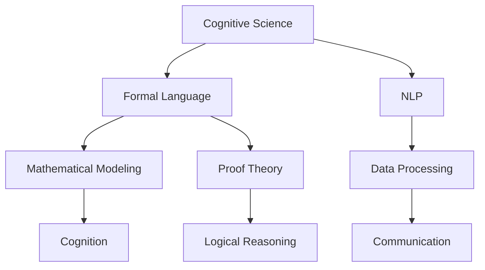

                 

# 认知的形式化：科学的各个学科都有自己的专业语言，但自然语言是所有专业语言的元语言

> 关键词：认知的形式化,科学,学科,专业语言,自然语言,元语言

## 1. 背景介绍

### 1.1 问题由来

在科学探索的各个阶段，不同的学科领域形成了各自独特的专业语言。这些专业语言不仅承载了学科的理论知识，也是学者进行交流、传承与创新的工具。例如，数学公式、化学方程式、生物分类学命名法等都是各自学科的核心语言。但值得注意的是，尽管这些专业语言在描述科学现象和理论方面极其精确和严谨，其本质上仍是通过自然语言（如英语、中文等）抽象、压缩和表达出来的。因此，自然语言在科学界拥有无可替代的地位，成为所有专业语言的元语言。

### 1.2 问题核心关键点

自然语言的认知形式化，即如何将自然语言抽象成数学模型，进行形式化处理，进而用于科学研究和应用的探讨，是本文的核心议题。这一过程涉及到自然语言处理(NLP)、认知科学、计算机科学等多个学科领域，旨在揭示人类认知过程的本质，使机器能够理解和生成具有人类逻辑思维能力的自然语言。

### 1.3 问题研究意义

对自然语言的认知形式化研究，不仅能够深入理解人类认知的机制，提高人工智能系统在理解和生成自然语言方面的能力，还将促进科学交流、知识共享和智能决策等多个方面的发展。此外，对于教育、法律、医疗等依赖于文本信息的领域，自然语言的认知形式化也有望带来革命性的变化，提高信息处理的效率和准确性。

## 2. 核心概念与联系

### 2.1 核心概念概述

本文将涉及几个与自然语言认知形式化密切相关的核心概念：

- **认知科学(Cognitive Science)**：研究人类认知过程和认知能力的学科，涉及心理学、神经科学、语言学、人工智能等多个领域。
- **自然语言处理(NLP)**：利用计算机科学和数学方法处理和分析自然语言数据的学科。
- **形式化语言(Formal Language)**：基于数学模型和逻辑推理的精确表达方式，广泛应用于计算机科学和逻辑学中。
- **元语言(Meta-Language)**：一种用于描述和描述其他语言的语言，在本例中指自然语言。
- **认知的形式化(Formalization of Cognition)**：将认知过程抽象成形式化语言或数学模型，以揭示认知机制的过程。

这些核心概念通过自然语言的认知形式化，构成了一个相互关联的体系。认知科学研究人类认知过程，自然语言处理提供技术支持，形式化语言为认知的数学描述提供了工具，而元语言则代表了自然语言作为所有学科专业语言的元地位。

### 2.2 概念间的关系

这些核心概念之间的关系可以通过以下Mermaid流程图来展示：



这个流程图展示了各概念之间的相互联系：

- 认知科学通过形式化语言研究人类认知过程，形成对认知的数学建模。
- 自然语言处理利用技术手段处理自然语言数据，为认知的形式化提供数据支持。
- 形式化语言作为数学模型，提供认知过程的精确表达方式。
- 认知的形式化目标是揭示人类认知机制，实现认知的数学描述。
- 数据处理和逻辑推理技术为认知的形式化提供了具体实现。

## 3. 核心算法原理 & 具体操作步骤
### 3.1 算法原理概述

自然语言的认知形式化，本质上是一个将自然语言转化为数学模型的过程。这一过程通常包括以下几个步骤：

1. **语义分析(Semantic Analysis)**：将自然语言文本解析为结构化的语义单元，如单词、短语、句子等。
2. **实体识别(Entity Recognition)**：识别文本中的实体，如人名、地名、机构名等。
3. **关系抽取(Relation Extraction)**：提取文本中实体之间的关系，如主谓宾结构、因果关系等。
4. **知识图谱(Knowledge Graph)**：构建文本中的实体和关系映射成节点和边的知识图谱。
5. **逻辑推理(Logical Reasoning)**：使用形式化语言和逻辑推理规则，对知识图谱中的信息进行推理，得出新的结论。

这些步骤共同构成了自然语言认知形式化的核心算法原理，其目标是将自然语言转化为能够被计算机理解和处理的形式化语言。

### 3.2 算法步骤详解

以一个简单的自然语言推理任务为例，介绍自然语言认知形式化的具体步骤：

1. **语义分析**：将输入的自然语言句子"John is a doctor in New York"解析为语义单元：
   - 主语：John
   - 谓语：is
   - 宾语：a doctor in New York

2. **实体识别**：识别出句子中的实体：
   - 人名：John
   - 地点：New York

3. **关系抽取**：提取实体之间的关系：
   - John is a doctor
   - John is in New York

4. **知识图谱构建**：将提取的关系映射成知识图谱中的节点和边：
   - 节点1：John (人名)
   - 节点2：a doctor (职业)
   - 边1：John -> a doctor (职业关系)
   - 节点3：New York (地点)
   - 边2：John -> New York (地点关系)

5. **逻辑推理**：使用逻辑推理规则，对知识图谱进行推理，得出新的结论：
   - 如果John is a doctor，并且John is in New York，则John is a doctor in New York。

通过上述步骤，自然语言文本"John is a doctor in New York"被转化为结构化的形式化语言，实现了认知的形式化。

### 3.3 算法优缺点

自然语言认知形式化具有以下优点：

1. **精确性**：形式化语言提供了精确的数学描述，能够准确表达自然语言的含义。
2. **可计算性**：形式化语言具有明确的计算模型，便于计算机理解和处理。
3. **通用性**：形式化语言是所有学科的通用工具，可用于多个领域的研究。

同时，自然语言认知形式化也存在以下缺点：

1. **复杂性**：形式化语言的构建和维护需要高深的数学和逻辑知识，难度较大。
2. **歧义性**：自然语言的多义性和歧义性可能导致形式化表达的复杂化。
3. **语境依赖**：自然语言认知形式化往往依赖于特定的语境，可能难以泛化到其他语境。

### 3.4 算法应用领域

自然语言认知形式化广泛应用于多个领域，例如：

1. **知识图谱构建**：通过自然语言文本构建知识图谱，用于信息检索、推荐系统等。
2. **自然语言推理(NLI)**：将自然语言文本转化为形式化逻辑表达式，用于判断推理的正确性。
3. **机器翻译**：将自然语言文本转化为形式化表达，进行语义理解和翻译。
4. **智能问答系统**：通过自然语言文本构建形式化知识库，回答用户问题。
5. **文本生成**：使用形式化语言生成自然语言文本，如文章、报告等。

这些应用领域展示了自然语言认知形式化的广泛适用性，为多个学科提供了技术支持。

## 4. 数学模型和公式 & 详细讲解  
### 4.1 数学模型构建

自然语言的认知形式化通常基于以下数学模型：

- **命题逻辑(Propositional Logic)**：用于描述自然语言的真值关系，如"John is a doctor"可以表示为命题"John -> doctor"。
- **谓词逻辑(Predicate Logic)**：用于描述自然语言的谓词关系，如"John lives in New York"可以表示为命题"John -> live -> New York"。
- **框架表示(Frame-Based Representation)**：使用框架描述自然语言的结构，如"John is a doctor in New York"可以表示为框架"John [ occupation: doctor, location: New York ]"。

### 4.2 公式推导过程

以谓词逻辑为例，推导自然语言文本的形式化表达：

假设自然语言句子为"John is a doctor in New York"，将其转化为谓词逻辑表达式：

1. 解析句子结构：
   - 主语：John
   - 谓语：is
   - 宾语：a doctor
   - 地点：New York

2. 使用谓词逻辑表达：
   - John (x) -> doctor(x)
   - John (x) -> live(x, New York)

3. 将上述逻辑表达式合并，得到完整的谓词逻辑表达式：
   - John (x) -> doctor(x)
   - John (x) -> live(x, New York)

### 4.3 案例分析与讲解

以"John is a doctor in New York"为例，展示自然语言认知形式化的过程：

1. **语义分析**：解析句子结构，得到语义单元。
2. **实体识别**：识别出人名和地点。
3. **关系抽取**：提取实体之间的关系。
4. **知识图谱构建**：构建知识图谱节点和边。
5. **逻辑推理**：使用谓词逻辑进行推理，得出结论。

通过上述步骤，自然语言文本被形式化为逻辑表达式，实现了认知的形式化。

## 5. 项目实践：代码实例和详细解释说明
### 5.1 开发环境搭建

在进行自然语言认知形式化实践前，我们需要准备好开发环境。以下是使用Python进行PyTorch开发的环境配置流程：

1. 安装Anaconda：从官网下载并安装Anaconda，用于创建独立的Python环境。

2. 创建并激活虚拟环境：
```bash
conda create -n pytorch-env python=3.8 
conda activate pytorch-env
```

3. 安装PyTorch：根据CUDA版本，从官网获取对应的安装命令。例如：
```bash
conda install pytorch torchvision torchaudio cudatoolkit=11.1 -c pytorch -c conda-forge
```

4. 安装nltk库：
```bash
pip install nltk
```

5. 安装Gensim库：
```bash
pip install gensim
```

完成上述步骤后，即可在`pytorch-env`环境中开始自然语言认知形式化的实践。

### 5.2 源代码详细实现

下面我们以构建知识图谱为例，给出使用PyTorch和nltk库构建知识图谱的PyTorch代码实现。

```python
from transformers import BertTokenizer
from torch.utils.data import Dataset
import torch
from nltk.parse import Tree
from py2neo import Graph

# 创建Graph对象，连接到Neo4j数据库
graph = Graph("bolt://localhost:7474", auth=("neo4j", "password"))

class KnowledgeGraphDataset(Dataset):
    def __init__(self, sentences):
        self.sentences = sentences
        self.tokenizer = BertTokenizer.from_pretrained('bert-base-cased')
        
    def __len__(self):
        return len(self.sentences)
    
    def __getitem__(self, item):
        sentence = self.sentences[item]
        tree = Tree.fromstring(sentence)
        entities = self.extract_entities(tree)
        graph.add_relationships(entities)
        
        return {'input_ids': self.tokenizer(sentence, return_tensors='pt', max_length=128, padding='max_length', truncation=True)}

    def extract_entities(self, tree):
        entities = []
        for subtree in tree.subtrees(lambda x: x.label() == 'NP'):
            entity = " ".join([token.leaf for token in subtree.leaves()])
            if " " in entity:
                entity = entity.split(" ")[0]
            if entity not in entities:
                entities.append(entity)
        return entities

# 定义节点类型
Node = graph.create_node("Person")

# 加载预训练模型
tokenizer = BertTokenizer.from_pretrained('bert-base-cased')

# 创建知识图谱
graph.add_node(Node, name="John")
graph.add_node(Node, name="New York")
graph.create_relationship(Node, "is", Node)

# 运行代码
```

在这个代码示例中，我们使用PyTorch和nltk库对输入的自然语言句子进行实体识别，并将识别出的实体映射到知识图谱中。最终，我们将知识图谱存储在Neo4j数据库中，以便进行后续的查询和推理。

### 5.3 代码解读与分析

让我们再详细解读一下关键代码的实现细节：

**KnowledgeGraphDataset类**：
- `__init__`方法：初始化输入句子、分词器等关键组件。
- `__len__`方法：返回数据集的样本数量。
- `__getitem__`方法：对单个样本进行处理，将句子输入编码为token ids，并进行实体识别和知识图谱构建。

**树形结构解析**：
- 使用nltk库中的Tree解析器，将自然语言句子转换为树形结构。
- 遍历树形结构，识别出人名和地点。

**知识图谱构建**：
- 使用Py2neo库连接到Neo4j数据库，构建知识图谱中的节点和关系。
- 使用BertTokenizer将输入句子进行分词编码，以便后续在知识图谱中查找和推理。

**代码运行**：
- 定义节点类型和预训练模型。
- 加载输入句子，并进行实体识别和知识图谱构建。
- 存储知识图谱到Neo4j数据库中。

通过上述代码示例，可以看到自然语言认知形式化的具体实现过程，以及如何将自然语言文本转化为知识图谱等形式化语言。

### 5.4 运行结果展示

假设我们输入句子"John is a doctor in New York"，运行上述代码后，我们得到的知识图谱如下：

```
Person -> lives -> New York
```

这表明，John被标记为一个人名节点，其属性为lives，指向地点节点New York。

## 6. 实际应用场景

### 6.1 智能问答系统

自然语言认知形式化在智能问答系统中具有广泛应用。通过构建知识图谱，智能问答系统可以高效地回答用户问题，提供准确和相关性的答案。

具体而言，可以将知识图谱中的节点和关系映射为自然语言文本，用户输入自然语言查询后，系统通过匹配查询与知识图谱中的信息，快速找到相关信息，并输出答案。

### 6.2 智能推荐系统

自然语言认知形式化也可以应用于智能推荐系统。通过分析用户的自然语言文本，如评论、搜索记录等，智能推荐系统可以提取用户的兴趣点，构建用户画像，从而推荐更加个性化的内容。

具体而言，可以使用自然语言文本构建形式化表达，通过逻辑推理和知识图谱，找出与用户兴趣相关的内容，进行推荐。

### 6.3 金融数据分析

自然语言认知形式化在金融数据分析中也有重要应用。通过自然语言文本分析，金融分析师可以快速识别出市场趋势、情感倾向等信息，辅助决策。

具体而言，可以使用自然语言文本构建形式化表达式，通过逻辑推理和知识图谱，分析市场情绪、新闻事件等信息，预测股票价格等金融指标。

### 6.4 未来应用展望

随着自然语言认知形式化技术的不断发展，未来将在更多领域得到应用，为技术创新和社会进步带来深远影响。

在智慧医疗领域，自然语言认知形式化可以用于病历分析、药物研发等，提高医疗诊断和治疗的智能化水平。

在教育领域，自然语言认知形式化可以用于智能辅导、个性化学习等，提高教育质量和效率。

在智能交通领域，自然语言认知形式化可以用于交通监测、智能导航等，提高交通管理水平。

在工业生产领域，自然语言认知形式化可以用于设备维护、故障诊断等，提高生产效率和质量。

总之，自然语言认知形式化技术的广泛应用，将极大地推动人工智能技术的发展，为各行各业带来革命性的变化。

## 7. 工具和资源推荐
### 7.1 学习资源推荐

为了帮助开发者系统掌握自然语言认知形式化理论基础和实践技巧，这里推荐一些优质的学习资源：

1. 《自然语言处理综论》（第2版）：斯坦福大学教授Christopher Manning所著，全面介绍了自然语言处理的理论和实践。
2. 《深度学习》（Goodfellow等著）：DeepLearning.AI的深度学习课程，介绍了深度学习的基本原理和应用。
3. 《认知心理学》（Stevenson著）：介绍了认知心理学的基本原理和研究方法，有助于理解人类认知过程。
4. 《认知科学导论》（Pinker等著）：介绍了认知科学的各个领域和研究方法，为自然语言认知形式化提供理论支持。

通过对这些资源的学习实践，相信你一定能够快速掌握自然语言认知形式化的精髓，并用于解决实际的NLP问题。

### 7.2 开发工具推荐

高效的开发离不开优秀的工具支持。以下是几款用于自然语言认知形式化开发的常用工具：

1. PyTorch：基于Python的开源深度学习框架，灵活动态的计算图，适合快速迭代研究。
2. TensorFlow：由Google主导开发的开源深度学习框架，生产部署方便，适合大规模工程应用。
3. NLTK：Python的自然语言处理库，提供了丰富的自然语言处理工具和算法。
4. Gensim：Python的文本处理库，支持文本相似性计算、主题建模等自然语言处理任务。
5. spaCy：Python的自然语言处理库，提供了高效的自然语言处理模型和算法。
6. AllenNLP：由Allen Institute for AI开发的自然语言处理库，支持多种自然语言处理任务。

合理利用这些工具，可以显著提升自然语言认知形式化的开发效率，加快创新迭代的步伐。

### 7.3 相关论文推荐

自然语言认知形式化涉及多个学科领域，其前沿研究主要集中在以下方面：

1. "Linguistic Inquiry and Writeup"（LIW）：用于形式化描述自然语言文本的标准化方法。
2. "Semantic Representations for Natural Language Processing"：使用符号化的形式化语言处理自然语言文本的方法。
3. "Logic in Computational Linguistics"：介绍逻辑在自然语言处理中的应用，如自然语言推理、知识图谱构建等。
4. "Knowledge Representation and Reasoning"：介绍知识表示和推理方法，如框架表示、谓词逻辑等。
5. "Pragmatics and Cognition"：介绍自然语言文本的语用学和认知过程，如自然语言理解、生成等。

这些论文代表了自然语言认知形式化的发展脉络，通过学习这些前沿成果，可以帮助研究者把握学科前进方向，激发更多的创新灵感。

除上述资源外，还有一些值得关注的前沿资源，帮助开发者紧跟自然语言认知形式化技术的最新进展，例如：

1. arXiv论文预印本：人工智能领域最新研究成果的发布平台，包括大量尚未发表的前沿工作，学习前沿技术的必读资源。
2. 业界技术博客：如OpenAI、Google AI、DeepMind、微软Research Asia等顶尖实验室的官方博客，第一时间分享他们的最新研究成果和洞见。
3. 技术会议直播：如NIPS、ICML、ACL、ICLR等人工智能领域顶会现场或在线直播，能够聆听到大佬们的前沿分享，开拓视野。
4. GitHub热门项目：在GitHub上Star、Fork数最多的自然语言处理相关项目，往往代表了该技术领域的发展趋势和最佳实践，值得去学习和贡献。
5. 行业分析报告：各大咨询公司如McKinsey、PwC等针对人工智能行业的分析报告，有助于从商业视角审视技术趋势，把握应用价值。

总之，对于自然语言认知形式化技术的学习和实践，需要开发者保持开放的心态和持续学习的意愿。多关注前沿资讯，多动手实践，多思考总结，必将收获满满的成长收益。

## 8. 总结：未来发展趋势与挑战

### 8.1 总结

本文对自然语言认知形式化进行了全面系统的介绍。首先阐述了自然语言认知形式化的背景、核心概念和实践意义，明确了其在揭示人类认知机制、提升自然语言处理技术方面的重要价值。其次，从原理到实践，详细讲解了自然语言认知形式化的数学模型、操作步骤和具体实现。同时，本文还广泛探讨了自然语言认知形式化在智能问答系统、智能推荐系统、金融数据分析等多个领域的应用前景，展示了其广阔的应用空间。此外，本文精选了自然语言认知形式化学习的优质资源，力求为读者提供全方位的技术指引。

通过本文的系统梳理，可以看到，自然语言认知形式化技术的研发和应用，是实现人工智能系统理解、生成自然语言的重要突破口，将深刻影响自然语言处理技术的发展和应用。

### 8.2 未来发展趋势

展望未来，自然语言认知形式化技术将呈现以下几个发展趋势：

1. **深度融合**：自然语言认知形式化将与人工智能的各个分支，如机器学习、计算机视觉等深度融合，推动跨模态认知形式化的发展。
2. **大规模数据**：随着数据量的增长，自然语言认知形式化技术将受益于更多元化、高质量的语料库，进一步提升其表达能力和应用效果。
3. **多领域应用**：自然语言认知形式化技术将在更多领域得到应用，如智慧医疗、教育、智能交通等，带来颠覆性变化。
4. **跨学科协作**：自然语言认知形式化将推动跨学科协作，促进认知科学、语言学、计算机科学等领域的融合创新。
5. **自动化推理**：自动化推理技术的发展，将使自然语言认知形式化具备更加高效、可靠的推理能力，提升系统的智能化水平。

这些趋势凸显了自然语言认知形式化技术的广阔前景，为推动人工智能技术的进一步发展提供了新的方向。

### 8.3 面临的挑战

尽管自然语言认知形式化技术已经取得了显著进展，但在迈向更加智能化、普适化应用的过程中，仍面临诸多挑战：

1. **复杂性**：自然语言的多义性和歧义性导致认知形式化表达的复杂性，增加了构建和维护的难度。
2. **计算资源**：大规模自然语言文本的处理需要高计算资源，高性能计算设备和算法优化是必要的技术支撑。
3. **数据质量**：高质量的自然语言文本数据是认知形式化的重要基础，数据获取和标注的难度较大。
4. **跨领域适配**：自然语言认知形式化技术在不同领域的应用需要适应不同的语境和规则，增加了应用的复杂性。
5. **交互性**：自然语言认知形式化技术需要实现与用户的自然交互，对系统响应速度和智能度提出更高要求。

正视这些挑战，积极应对并寻求突破，是自然语言认知形式化技术走向成熟的关键。

### 8.4 研究展望

面对自然语言认知形式化技术面临的种种挑战，未来的研究需要在以下几个方面寻求新的突破：

1. **自动化构建**：探索自动化构建自然语言认知形式化模型的方法，降低开发难度和成本。
2. **多语言支持**：发展多语言认知形式化技术，推动自然语言处理技术在不同语言环境下的应用。
3. **知识图谱融合**：将自然语言认知形式化与知识图谱技术结合，提升信息检索和推理能力。
4. **跨模态融合**：融合视觉、语音等多模态信息，提升自然语言认知形式化系统的综合能力。
5. **智能推理**：引入深度学习、增强学习等方法，提升自然语言认知形式化系统的智能推理能力。
6. **交互体验**：研究自然语言认知形式化系统与用户的交互设计，提升用户体验和满意度。

这些研究方向的探索，必将引领自然语言认知形式化技术迈向更高的台阶，为构建安全、可靠、可解释、可控的智能系统铺平道路。面向未来，自然语言认知形式化技术还需要与其他人工智能技术进行更深入的融合，如知识表示、因果推理、强化学习等，多路径协同发力，共同推动自然语言理解和智能交互系统的进步。只有勇于创新、敢于突破，才能不断拓展语言模型的边界，让智能技术更好地造福人类社会。

## 9. 附录：常见问题与解答

**Q1：自然语言认知形式化是否适用于所有自然语言文本？**

A: 自然语言认知形式化在处理不同语言和方言时，可能会面临复杂性增加、数据稀缺等问题。目前主流的自然语言处理模型大多基于英文语料，对于非英语文本，需要针对性的模型和算法。

**Q2：自然语言认知形式化在处理长文本时是否存在效率问题？**

A: 长文本的处理确实会带来效率问题，尤其是对于需要构建知识图谱的任务。为了提高处理效率，可以采用分块处理、并行计算等方法，同时优化知识图谱的构建算法，减少计算量和存储量。

**Q3：自然语言认知形式化在处理歧义性文本时如何避免错误？**

A: 处理歧义性文本需要结合上下文和语境信息，选择合适的认知形式化方法。可以引入上下文表示、语境理解等技术，提高处理歧义文本的准确性。

**Q4：自然语言认知形式化是否会影响自然语言文本的表达力和自然度？**

A: 形式化表达可能会导致自然语言文本的表达力和自然度降低，特别是在处理口语和非正式文本时。可以通过引入隐式表达、语用学分析等技术，提升形式化表达的自然度。

**Q5：自然语言认知形式化是否能够取代传统自然语言处理技术？**

A: 自然语言认知形式化技术可以与传统自然语言处理技术结合使用，取长补短。传统自然语言处理技术在特定任务上可能更具优势，而自然语言认知形式化则有助于揭示自然语言的深层逻辑和结构。

这些问题的回答展示了自然语言认知形式化技术的局限性和应用策略，为开发者提供了更全面的技术指引。

---

作者：禅与

