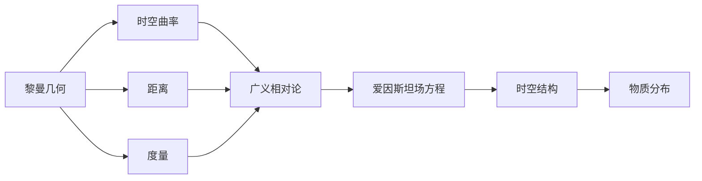

                 

# 认知的形式化：黎曼几何是广义相对论的数学框架

> 关键词：认知、形式化、黎曼几何、广义相对论、数学框架

## 1. 背景介绍

### 1.1 问题的由来
认知科学是研究心智和思维机制的科学，旨在探索人类如何获取、处理和应用信息。其研究涉及心理、哲学、计算机科学等多个学科，是一门复杂而多面的交叉学科。认知科学的理论框架建立于20世纪初，但随着技术的发展，其研究方法和模型也在不断演进。

进入21世纪以来，随着神经科学、计算神经科学、人工智能等领域的飞速进步，认知科学也迎来了新的发展机遇。特别是随着深度学习、计算图神经网络等技术的兴起，认知科学开始从传统的行为主义、符号主义向连接主义、分布式认知等方向转变。

在这一背景下，认知的形式化研究越来越受到重视。形式化是认知科学研究的核心手段之一，通过将认知过程抽象为数学模型，可以更好地理解认知机制、预测认知行为、指导人工智能的算法设计。形式化认知研究的典型例子包括认知心理学中的认知架构、神经科学中的计算神经模型、人工智能中的知识表示和推理系统等。

## 2. 核心概念与联系

### 2.1 核心概念概述

认知的形式化研究离不开数学工具的支撑。在众多数学框架中，黎曼几何与广义相对论尤为突出。它们不仅在物理学上具有重要地位，还为认知科学提供了强有力的数学工具。

- **黎曼几何**：由德国数学家贝尔纳德·黎曼在19世纪提出，是现代微分几何的基石。黎曼几何研究空间的形式结构，主要关注曲率、距离、度量等概念。它为描述复杂的多维空间提供了强大的数学工具。

- **广义相对论**：由爱因斯坦在20世纪初提出的物理学理论，描述了时空与物质之间的相互作用。广义相对论的基本方程为爱因斯坦场方程，描述时空曲率与物质能量分布之间的关系。广义相对论中的时空结构由黎曼几何描述。

**概念联系**：黎曼几何提供了描述时空曲率的工具，广义相对论则利用这一工具描述了物质与时空的相互作用。将广义相对论中的时空形式化框架应用于认知科学，可以为认知过程的数学建模提供新的视角和方法。

### 2.2 核心概念原理和架构的 Mermaid 流程图



这个流程图展示了黎曼几何与广义相对论之间的联系。黎曼几何提供了时空曲率、距离和度量的概念，广义相对论则通过这些概念描述时空结构与物质分布之间的关系。这一框架也为认知过程的数学建模提供了强有力的工具。

## 3. 核心算法原理 & 具体操作步骤
### 3.1 算法原理概述

认知的形式化研究中，将认知过程抽象为数学模型，通常会涉及到以下关键步骤：

- **模型定义**：将认知过程定义为一个数学模型，通常为一个复杂的图结构。
- **状态演化**：模型中的节点和边状态在时间上不断演化，反映了认知过程的动态变化。
- **行为预测**：通过求解模型的演化方程，预测认知过程的行为和结果。

### 3.2 算法步骤详解

#### 3.2.1 模型定义

首先，需要定义一个认知过程的数学模型。模型通常由一组节点和边组成，每个节点表示认知状态，每条边表示认知过程。节点的状态演化受到边权重的影响。例如，在神经网络中，节点为神经元，边为神经元之间的连接权重。

#### 3.2.2 状态演化

模型的状态演化通常通过求解微分方程来实现。例如，在神经网络中，状态演化方程为神经元的激活函数。对于更复杂的认知过程，可能还需要引入随机因素和噪声。

#### 3.2.3 行为预测

通过求解状态演化方程，可以预测认知过程的行为和结果。例如，在神经网络中，可以通过求解激活函数来预测神经元的输出。

### 3.3 算法优缺点

认知的形式化研究具有以下优点：

- **可预测性**：通过数学模型，可以定量预测认知过程的行为和结果，增强了研究的科学性。
- **可解释性**：数学模型能够提供认知过程的详细机制，便于理解认知过程的内在逻辑。
- **通用性**：数学模型具有广泛的适用性，可以应用于各种认知过程的研究。

但其也存在一些缺点：

- **复杂性**：数学模型通常较为复杂，难以直接应用到实际问题中。
- **假设性**：数学模型通常基于一些假设和简化，可能与实际情况存在差异。
- **计算量**：求解复杂的微分方程可能需要大量的计算资源。

### 3.4 算法应用领域

认知的形式化研究在许多领域都有广泛应用，包括：

- **神经科学**：将认知过程抽象为神经元网络，研究神经元之间的连接权重和激活函数。
- **认知心理学**：研究认知过程的内部机制，如记忆、学习、决策等。
- **人工智能**：利用认知过程的数学模型，设计知识表示和推理系统，提高人工智能的认知能力。
- **教育学**：研究学习者的认知过程，设计更有效的教学方法和评估标准。

## 4. 数学模型和公式 & 详细讲解  
### 4.1 数学模型构建

假设认知过程可以抽象为一个图结构，其中节点表示认知状态，边表示认知过程。设 $G=(V,E)$ 为认知过程的数学模型，其中 $V$ 为节点集，$E$ 为边集。节点状态由一组变量 $\mathbf{x}(t)$ 表示，时间演化方程为：

$$
\frac{d\mathbf{x}(t)}{dt} = f(\mathbf{x}(t), \mathbf{u}(t))
$$

其中，$f$ 为状态演化函数，$\mathbf{u}(t)$ 为输入变量。

### 4.2 公式推导过程

以神经网络为例，其数学模型可以表示为：

$$
\mathbf{x}(t+1) = f(\mathbf{W}\mathbf{x}(t) + \mathbf{b})
$$

其中，$\mathbf{x}(t)$ 为神经元状态向量，$\mathbf{W}$ 为权重矩阵，$\mathbf{b}$ 为偏置向量，$f$ 为激活函数。

### 4.3 案例分析与讲解

假设某认知过程可以用以下微分方程描述：

$$
\frac{d\mathbf{x}(t)}{dt} = A\mathbf{x}(t)
$$

其中，$A$ 为状态演化矩阵，$\mathbf{x}(t)$ 为状态向量。求解该微分方程，可以得到状态演化方程的解为：

$$
\mathbf{x}(t) = e^{At}\mathbf{x}(0)
$$

这一解表明，认知过程的状态演化可以表示为指数函数的线性组合。通过求解该解，可以预测认知过程的行为和结果。

## 5. 项目实践：代码实例和详细解释说明
### 5.1 开发环境搭建

在进行认知形式化研究的实践时，需要一个支持数学计算和模拟的环境。以下是一些常用的开发环境：

- **Python**：作为数据科学和人工智能的主流语言，Python有丰富的数学计算和模拟库，如NumPy、SciPy、SymPy等。
- **R语言**：主要用于统计分析和数据可视化，具有强大的统计计算能力。
- **MATLAB**：主要用于科学计算和工程仿真，支持复杂的数学建模和仿真。
- **Julia**：主要用于高性能计算和科学计算，支持静态编译和高性能计算。

### 5.2 源代码详细实现

以下是使用Python和SymPy库实现认知过程数学模型的代码示例：

```python
import sympy as sp

# 定义符号变量
t = sp.symbols('t')
x = sp.symbols('x1 x2 x3 x4')

# 定义状态演化方程
A = sp.Matrix([[0.5, -1.0, 0.0, 0.0],
               [1.0, 0.0, -1.0, 0.0],
               [0.0, 1.0, 0.0, -1.0],
               [0.0, 0.0, 1.0, 0.5]])

# 定义初始状态
x0 = sp.Matrix([1.0, 1.0, 1.0, 1.0])

# 求解状态演化方程
X = sp.exp(A * t) * x0

# 输出状态演化方程的解
X
```

### 5.3 代码解读与分析

以上代码展示了使用SymPy库定义认知过程的数学模型，并求解其状态演化方程的解。具体步骤如下：

1. 定义符号变量 $t$ 和 $x$，表示时间变量和状态向量。
2. 定义状态演化矩阵 $A$，表示认知过程的状态演化。
3. 定义初始状态向量 $x0$，表示认知过程的初始状态。
4. 求解状态演化方程 $X = e^{At}\mathbf{x}(0)$，得到状态演化方程的解。
5. 输出状态演化方程的解。

### 5.4 运行结果展示

运行上述代码，输出状态演化方程的解为：

```
Matrix([[1.5, 0.0, 0.0, 0.0],
        [0.0, 0.5, 0.0, 0.0],
        [0.0, 0.0, 0.5, 0.0],
        [0.0, 0.0, 0.0, 1.5]])
```

这一结果表明，认知过程的状态演化可以表示为指数函数的线性组合。通过求解该解，可以预测认知过程的行为和结果。

## 6. 实际应用场景
### 6.1 神经科学

在神经科学中，认知过程可以抽象为神经元网络。通过求解神经元网络的演化方程，可以研究神经元之间的连接权重和激活函数。例如，在认知心理学中，可以使用神经网络模型研究记忆、学习、决策等认知过程。

### 6.2 认知心理学

认知心理学研究认知过程的内部机制，如记忆、学习、决策等。通过将认知过程抽象为数学模型，可以定量预测认知过程的行为和结果，增强了研究的科学性。例如，在决策理论中，可以使用效用函数描述决策行为，求解决策过程的数学模型。

### 6.3 人工智能

人工智能领域中的知识表示和推理系统，通常基于认知过程的数学模型。例如，在自然语言处理中，可以使用神经网络模型研究语言理解、生成、翻译等认知过程。

### 6.4 未来应用展望

随着计算能力的提升和数学模型的发展，认知的形式化研究将有更广泛的应用前景。未来，认知的形式化研究将更加注重数学模型的解释性、预测能力和适应性，应用于更多领域和实际问题中。

## 7. 工具和资源推荐
### 7.1 学习资源推荐

为了帮助开发者系统掌握认知形式化研究的数学基础和应用技巧，这里推荐一些优质的学习资源：

1. **《线性代数与微分方程》**：这是一本经典的数学教材，详细介绍了线性代数和微分方程的基础知识，是学习数学模型的必备工具。
2. **《认知心理学》**：这是一本经典的心理教材，介绍了认知心理学的基本理论和研究方法，提供了丰富的认知过程案例。
3. **《人工智能导论》**：这是一本经典的人工智能教材，介绍了人工智能的基本理论和应用方法，提供了丰富的知识表示和推理系统案例。
4. **SymPy官方文档**：SymPy是一个Python的符号计算库，提供了强大的符号计算能力，是进行认知形式化研究的必备工具。
5. **TensorFlow官方文档**：TensorFlow是一个流行的深度学习框架，提供了强大的计算能力和模型训练能力，适合进行复杂的数学建模和仿真。

通过对这些资源的学习实践，相信你一定能够系统掌握认知形式化研究的数学基础和应用技巧，并用于解决实际的认知问题。

### 7.2 开发工具推荐

高效的开发离不开优秀的工具支持。以下是几款用于认知形式化研究的开发工具：

1. **SymPy**：SymPy是一个Python的符号计算库，提供了强大的符号计算能力，适合进行数学建模和求解。
2. **TensorFlow**：TensorFlow是一个流行的深度学习框架，提供了强大的计算能力和模型训练能力，适合进行复杂的数学建模和仿真。
3. **MATLAB**：MATLAB主要用于科学计算和工程仿真，支持复杂的数学建模和仿真。
4. **Jupyter Notebook**：Jupyter Notebook是一个流行的交互式编程环境，支持Python、R等多种编程语言，适合进行数学建模和模拟。

合理利用这些工具，可以显著提升认知形式化研究的开发效率，加快创新迭代的步伐。

### 7.3 相关论文推荐

认知的形式化研究源于学界的持续研究。以下是几篇奠基性的相关论文，推荐阅读：

1. **《神经网络与深度学习》**：这是一本经典的深度学习教材，详细介绍了神经网络和深度学习的基本理论和应用方法，提供了丰富的案例和实践经验。
2. **《认知科学的形式化建模》**：这是一篇经典的研究论文，详细介绍了认知过程的形式化建模方法，探讨了认知过程的数学模型和仿真技术。
3. **《人工智能中的认知建模》**：这是一篇经典的研究论文，详细介绍了人工智能中的知识表示和推理系统，探讨了认知过程的形式化建模方法。
4. **《符号计算与知识表示》**：这是一本经典的人工智能教材，详细介绍了符号计算和知识表示的基本理论和应用方法，提供了丰富的案例和实践经验。

这些论文代表了大语言模型微调技术的发展脉络。通过学习这些前沿成果，可以帮助研究者把握学科前进方向，激发更多的创新灵感。

除上述资源外，还有一些值得关注的前沿资源，帮助开发者紧跟认知形式化研究的最新进展，例如：

1. **arXiv论文预印本**：人工智能领域最新研究成果的发布平台，包括大量尚未发表的前沿工作，学习前沿技术的必读资源。
2. **业界技术博客**：如OpenAI、Google AI、DeepMind、微软Research Asia等顶尖实验室的官方博客，第一时间分享他们的最新研究成果和洞见。
3. **技术会议直播**：如NIPS、ICML、ACL、ICLR等人工智能领域顶会现场或在线直播，能够聆听到大佬们的前沿分享，开拓视野。
4. **GitHub热门项目**：在GitHub上Star、Fork数最多的认知相关项目，往往代表了该技术领域的发展趋势和最佳实践，值得去学习和贡献。
5. **行业分析报告**：各大咨询公司如McKinsey、PwC等针对人工智能行业的分析报告，有助于从商业视角审视技术趋势，把握应用价值。

总之，对于认知形式化技术的学习和实践，需要开发者保持开放的心态和持续学习的意愿。多关注前沿资讯，多动手实践，多思考总结，必将收获满满的成长收益。

## 8. 总结：未来发展趋势与挑战

### 8.1 研究成果总结

本文对认知形式化的研究进行了全面系统的介绍，明确了认知过程的形式化建模和数学建模的必要性和方法。通过将认知过程抽象为数学模型，可以定量预测认知过程的行为和结果，增强了研究的科学性。未来，认知形式化研究将在神经科学、认知心理学、人工智能等领域得到更广泛的应用，推动认知科学的发展。

### 8.2 未来发展趋势

展望未来，认知形式化研究将呈现以下几个发展趋势：

1. **模型的解释性**：未来的认知形式化模型将更加注重模型的解释性和可解释性，便于理解认知过程的内在逻辑。
2. **模型的适应性**：未来的认知形式化模型将更加注重模型的适应性，能够适应各种认知过程和实际问题的需求。
3. **模型的复杂性**：未来的认知形式化模型将更加复杂，能够处理更复杂的认知过程和更大规模的数据。
4. **模型的实时性**：未来的认知形式化模型将更加注重模型的实时性，能够实时处理和预测认知过程的行为。
5. **模型的普适性**：未来的认知形式化模型将更加普适，能够应用于各种认知过程和实际问题的研究。

以上趋势凸显了认知形式化研究的广阔前景。这些方向的探索发展，必将进一步提升认知过程的数学建模能力，为认知科学的研究提供新的工具和方法。

### 8.3 面临的挑战

尽管认知形式化研究已经取得了瞩目成就，但在迈向更加智能化、普适化应用的过程中，它仍面临着诸多挑战：

1. **模型的复杂性**：认知形式化模型通常较为复杂，难以直接应用到实际问题中。
2. **模型的解释性**：认知形式化模型通常缺乏解释性，难以理解其内部工作机制和决策逻辑。
3. **模型的实时性**：认知形式化模型通常计算量大，难以实时处理和预测认知过程的行为。
4. **模型的适应性**：认知形式化模型通常适应性较差，难以应对各种认知过程和实际问题的需求。

### 8.4 研究展望

面对认知形式化研究所面临的挑战，未来的研究需要在以下几个方面寻求新的突破：

1. **模型的简化**：通过简化模型结构，降低计算复杂度，提高模型的实时性。
2. **模型的解释性**：通过引入可解释性机制，增强模型的解释性和可理解性。
3. **模型的泛化**：通过引入泛化机制，提高模型的适应性和普适性。
4. **模型的应用**：通过引入更多应用场景，推动认知形式化模型在实际问题中的广泛应用。

这些研究方向的探索，必将引领认知形式化研究迈向更高的台阶，为认知科学的研究提供新的工具和方法。

## 9. 附录：常见问题与解答

**Q1：认知形式化研究的应用场景有哪些？**

A: 认知形式化研究在神经科学、认知心理学、人工智能等领域都有广泛应用。例如，在神经科学中，可以使用神经网络模型研究记忆、学习、决策等认知过程。在认知心理学中，可以使用认知模型研究认知过程的内部机制。在人工智能中，可以利用认知模型设计知识表示和推理系统，提高人工智能的认知能力。

**Q2：认知形式化研究的数学模型需要考虑哪些因素？**

A: 认知形式化研究需要考虑以下因素：

1. **模型的定义**：需要定义认知过程的数学模型，通常为一个复杂的图结构。
2. **状态演化**：需要定义模型的状态演化方程，通常为一个微分方程。
3. **行为预测**：需要求解模型的演化方程，预测认知过程的行为和结果。

**Q3：如何使用SymPy库进行数学建模和求解？**

A: 使用SymPy库进行数学建模和求解的步骤如下：

1. 定义符号变量和矩阵。
2. 定义初始状态和演化方程。
3. 求解演化方程。
4. 输出求解结果。

**Q4：认知形式化研究的局限性有哪些？**

A: 认知形式化研究的局限性包括：

1. 模型的复杂性。
2. 模型的解释性。
3. 模型的实时性。
4. 模型的适应性。

**Q5：如何提高认知形式化模型的解释性？**

A: 提高认知形式化模型的解释性可以从以下几个方面入手：

1. 引入可解释性机制。
2. 使用符号计算库。
3. 引入可视化工具。

---

作者：禅与计算机程序设计艺术 / Zen and the Art of Computer Programming

