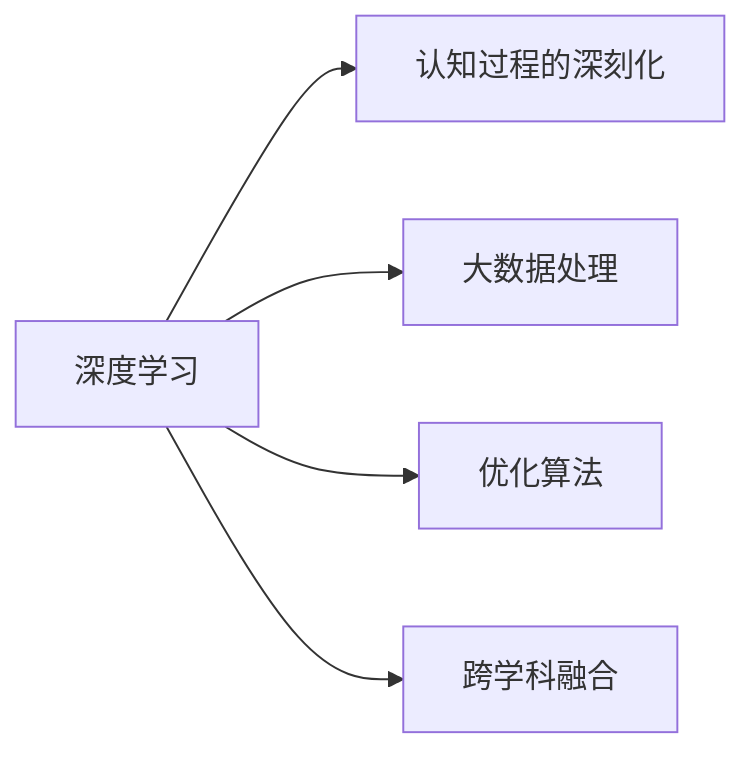
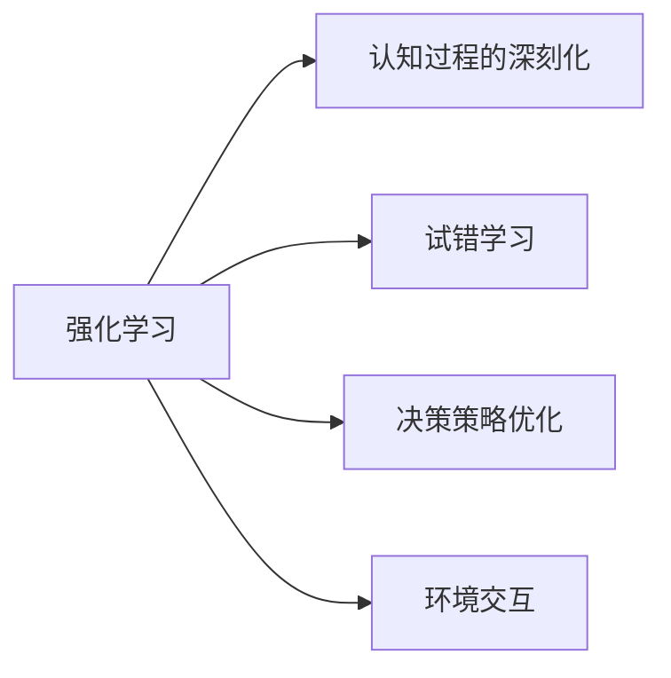

                 

## 1. 背景介绍

### 1.1 问题由来

随着人工智能技术的发展，特别是在深度学习领域的突破，人工智能的认知能力取得了显著的进步。认知过程的深刻化趋势已成为学术界和工业界关注的焦点。这种趋势不仅体现在算法的进步和数据处理能力的提升，也体现在对人类认知机制的理解和模拟上。

### 1.2 问题核心关键点

认知过程的深刻化趋势涉及多个关键点：

- **算法的进步**：包括深度学习算法的优化、强化学习的进步、生成对抗网络的突破等。
- **数据处理能力**：大数据技术的进步使得数据的收集、存储和处理能力显著提高，为认知过程的深刻化提供了数据基础。
- **认知模型的改进**：包括神经网络模型、符号计算模型的优化和改进，使得模型在处理复杂认知任务时更加高效和准确。
- **跨学科融合**：认知过程的深刻化趋势还涉及到心理学、神经科学、语言学等多学科的交叉融合，使得人工智能在认知任务上的表现更加贴近人类。

### 1.3 问题研究意义

认知过程的深刻化趋势对于推动人工智能技术的进步具有重要意义：

1. **提升人工智能的认知能力**：通过优化算法、改进数据处理能力和认知模型，人工智能在处理复杂认知任务上的能力显著提高。
2. **促进跨学科研究**：跨学科的融合有助于更好地理解人类认知机制，从而推动人工智能技术的发展。
3. **加速技术落地**：认知过程的深刻化趋势有助于将人工智能技术应用于更广泛的实际场景中，推动技术落地。
4. **提升社会效益**：通过认知过程的深刻化，人工智能在医疗、教育、安全等领域的应用将更加广泛，带来显著的社会效益。

## 2. 核心概念与联系

### 2.1 核心概念概述

为更好地理解认知过程的深刻化趋势，本节将介绍几个密切相关的核心概念：

- **深度学习**：一种基于多层神经网络的机器学习技术，通过堆叠多个隐层来学习和表示高层次的抽象特征。
- **强化学习**：一种通过试错学习，使智能体在与环境的交互中逐步优化决策策略的学习方法。
- **生成对抗网络（GANs）**：一种由生成器和判别器组成的对抗式训练框架，能够生成高质量的图像、音频等数据。
- **神经网络模型**：包括多层感知器（MLP）、卷积神经网络（CNN）、循环神经网络（RNN）等，用于处理不同类型的认知任务。
- **跨学科融合**：心理学、神经科学、语言学等学科与人工智能技术的融合，有助于更好地理解人类认知机制，提升人工智能的认知能力。

这些核心概念之间的逻辑关系可以通过以下Mermaid流程图来展示：

```mermaid
graph TB
    A[深度学习] --> B[强化学习]
    A --> C[生成对抗网络(GANs)]
    A --> D[神经网络模型]
    B --> E[跨学科融合]
    C --> E
    D --> E
    E --> F[认知过程的深刻化]
```

这个流程图展示了深度学习、强化学习、生成对抗网络和神经网络模型在认知过程的深刻化趋势中的作用和联系。跨学科融合作为核心概念，使得这些技术在提升人工智能认知能力方面发挥了重要作用。

### 2.2 概念间的关系

这些核心概念之间存在着紧密的联系，形成了认知过程的深刻化趋势的完整生态系统。下面我们通过几个Mermaid流程图来展示这些概念之间的关系。

#### 2.2.1 深度学习在认知过程中的作用



这个流程图展示了深度学习在认知过程中的作用，包括通过大数据处理、优化算法和跨学科融合，提升认知能力。

#### 2.2.2 强化学习在认知过程中的作用



这个流程图展示了强化学习在认知过程中的作用，通过试错学习、决策策略优化和环境交互，提升智能体的认知能力。

#### 2.2.3 生成对抗网络在认知过程中的作用

```mermaid
graph LR
    A[生成对抗网络(GANs)] --> B[认知过程的深刻化]
    A --> C[生成器]
    A --> D[判别器]
    A --> E[高质量数据生成]
```

这个流程图展示了生成对抗网络在认知过程中的作用，通过生成器和判别器的对抗训练，生成高质量的数据，提升认知能力。

#### 2.2.4 神经网络模型在认知过程中的作用

```mermaid
graph LR
    A[神经网络模型] --> B[认知过程的深刻化]
    A --> C[多层感知器(MLP)]
    A --> D[卷积神经网络(CNN)]
    A --> E[循环神经网络(RNN)]
```

这个流程图展示了神经网络模型在认知过程中的作用，通过不同类型的神经网络模型处理不同类型的认知任务，提升认知能力。

### 2.3 核心概念的整体架构

最后，我们用一个综合的流程图来展示这些核心概念在认知过程的深刻化趋势中的整体架构：

```mermaid
graph TB
    A[大数据处理] --> B[深度学习]
    B --> C[强化学习]
    B --> D[生成对抗网络(GANs)]
    B --> E[神经网络模型]
    C --> F[试错学习]
    D --> F
    E --> F
    F --> G[跨学科融合]
    G --> H[认知过程的深刻化]
```

这个综合流程图展示了从大数据处理到深度学习，再到强化学习、生成对抗网络和神经网络模型的整体架构，最终通过跨学科融合实现认知过程的深刻化。

## 3. 核心算法原理 & 具体操作步骤

### 3.1 算法原理概述

认知过程的深刻化趋势涉及多个算法原理，主要包括深度学习、强化学习和生成对抗网络等。

**深度学习**：通过多层神经网络的堆叠，学习高层次的抽象特征，提升认知能力。

**强化学习**：通过试错学习，智能体在与环境的交互中逐步优化决策策略，提升认知能力。

**生成对抗网络(GANs)**：通过生成器和判别器的对抗训练，生成高质量的数据，提升认知能力。

### 3.2 算法步骤详解

#### 3.2.1 深度学习算法步骤

1. **数据准备**：收集和处理训练数据，包括数据清洗、数据增强等。
2. **模型构建**：选择合适的神经网络模型，如多层感知器（MLP）、卷积神经网络（CNN）、循环神经网络（RNN）等。
3. **模型训练**：通过反向传播算法，最小化损失函数，更新模型参数。
4. **模型评估**：在验证集和测试集上评估模型的性能，调整模型参数。

#### 3.2.2 强化学习算法步骤

1. **环境建模**：定义环境的观测空间和动作空间，构建环境模型。
2. **智能体设计**：设计智能体的决策策略，如Q-learning、策略梯度等。
3. **策略优化**：通过与环境的交互，逐步优化决策策略。
4. **模型评估**：在测试集上评估模型的性能，调整策略参数。

#### 3.2.3 生成对抗网络算法步骤

1. **生成器设计**：设计生成器网络，如图像生成器、音频生成器等。
2. **判别器设计**：设计判别器网络，如图像判别器、音频判别器等。
3. **对抗训练**：通过生成器和判别器的对抗训练，生成高质量的数据。
4. **模型评估**：在测试集上评估生成器性能，调整网络参数。

### 3.3 算法优缺点

#### 3.3.1 深度学习的优缺点

**优点**：
- **高抽象能力**：通过多层网络学习高层次的抽象特征。
- **适应性强**：适用于多种类型的认知任务。

**缺点**：
- **过拟合风险**：大数据训练和深度网络容易过拟合。
- **计算资源需求高**：需要大量的计算资源和存储空间。

#### 3.3.2 强化学习的优缺点

**优点**：
- **自适应性强**：通过试错学习，智能体逐步优化决策策略。
- **实时性**：适用于实时决策场景。

**缺点**：
- **样本效率低**：需要大量试错样本。
- **环境建模复杂**：复杂环境建模难度大。

#### 3.3.3 生成对抗网络的优缺点

**优点**：
- **高质量数据生成**：生成高质量的数据，提升认知能力。
- **无需标注数据**：不需要大量标注数据。

**缺点**：
- **对抗攻击风险**：生成器生成的数据可能被对抗攻击。
- **训练复杂**：对抗训练难度大。

### 3.4 算法应用领域

深度学习、强化学习和生成对抗网络等算法在认知过程的深刻化趋势中有着广泛的应用：

- **自然语言处理（NLP）**：如机器翻译、情感分析、文本生成等。
- **计算机视觉**：如图像分类、目标检测、图像生成等。
- **语音识别**：如语音合成、语音识别、音频生成等。
- **医疗健康**：如医疗影像分析、疾病预测、个性化推荐等。
- **金融安全**：如风险评估、欺诈检测、市场预测等。

这些应用领域展示了认知过程的深刻化趋势在各个行业中的广泛应用。

## 4. 数学模型和公式 & 详细讲解 & 举例说明

### 4.1 数学模型构建

**深度学习数学模型**：
$$
\theta = \arg\min_{\theta} \mathcal{L}(\theta) = \arg\min_{\theta} \frac{1}{N} \sum_{i=1}^N \mathcal{L}(x_i, y_i; \theta)
$$

其中，$\theta$为模型参数，$x_i$为输入数据，$y_i$为标签，$\mathcal{L}(\theta)$为损失函数，$N$为样本数量。

**强化学习数学模型**：
$$
Q(s,a) = r + \gamma \max_a' Q(s',a')
$$

其中，$s$为状态，$a$为动作，$r$为奖励，$\gamma$为折扣因子，$Q(s,a)$为状态-动作值函数。

**生成对抗网络数学模型**：
$$
G(x) = \arg\min_G \mathcal{L}(G) = \arg\min_G \mathcal{L}_{D}(G) + \mathcal{L}_C(G)
$$

其中，$G$为生成器，$D$为判别器，$\mathcal{L}_{D}(G)$为判别器损失，$\mathcal{L}_C(G)$为对抗损失。

### 4.2 公式推导过程

**深度学习公式推导**：
$$
\frac{\partial \mathcal{L}(\theta)}{\partial \theta_k} = \frac{\partial}{\partial \theta_k} \frac{1}{N} \sum_{i=1}^N \mathcal{L}(x_i, y_i; \theta)
$$

**强化学习公式推导**：
$$
\frac{\partial Q(s,a)}{\partial Q(s',a')} = \delta(s,a,s',a')
$$

其中，$\delta(s,a,s',a')$为贝尔曼方程。

**生成对抗网络公式推导**：
$$
\frac{\partial \mathcal{L}(G)}{\partial G} = \frac{\partial \mathcal{L}_{D}(G)}{\partial G} + \frac{\partial \mathcal{L}_C(G)}{\partial G}
$$

### 4.3 案例分析与讲解

**深度学习案例**：图像分类
$$
\mathcal{L}(x_i, y_i; \theta) = \sum_{k=1}^K \mathcal{L}_{class}(x_i, y_i; \theta)
$$

其中，$K$为分类数量，$\mathcal{L}_{class}(x_i, y_i; \theta)$为交叉熵损失。

**强化学习案例**：游戏AI
$$
Q(s,a) = r + \gamma \max_a' Q(s',a')
$$

其中，$r$为奖励，$\gamma$为折扣因子，$Q(s',a')$为后继状态动作值函数。

**生成对抗网络案例**：图像生成
$$
\mathcal{L}_{D}(G) = \mathbb{E}_{x \sim p_{data}(x)} \log D(G(z)) + \mathbb{E}_{x \sim p_{noise}(z)} \log (1 - D(G(z)))
$$

其中，$D$为判别器，$G$为生成器，$z$为噪声向量。

## 5. 项目实践：代码实例和详细解释说明

### 5.1 开发环境搭建

为了进行深度学习、强化学习和生成对抗网络等算法的实践，需要搭建相应的开发环境。以下是使用Python进行TensorFlow和PyTorch开发的环境配置流程：

1. 安装Anaconda：从官网下载并安装Anaconda，用于创建独立的Python环境。

2. 创建并激活虚拟环境：
```bash
conda create -n pytorch-env python=3.8 
conda activate pytorch-env
```

3. 安装TensorFlow：根据CUDA版本，从官网获取对应的安装命令。例如：
```bash
conda install tensorflow tensorflow-gpu -c conda-forge
```

4. 安装PyTorch：根据CUDA版本，从官网获取对应的安装命令。例如：
```bash
conda install pytorch torchvision torchaudio cudatoolkit=11.1 -c pytorch -c conda-forge
```

5. 安装各类工具包：
```bash
pip install numpy pandas scikit-learn matplotlib tqdm jupyter notebook ipython
```

完成上述步骤后，即可在`pytorch-env`环境中开始实践。

### 5.2 源代码详细实现

这里以深度学习模型为例，给出使用TensorFlow进行图像分类的PyTorch代码实现。

首先，定义数据处理函数：

```python
import tensorflow as tf
from tensorflow.keras import datasets, layers, models

(train_images, train_labels), (test_images, test_labels) = datasets.cifar10.load_data()

train_images, test_images = train_images / 255.0, test_images / 255.0

class DataLoader(tf.data.Dataset):
    def __init__(self, images, labels, batch_size=32):
        self.images = images
        self.labels = labels
        self.batch_size = batch_size
        
    def __len__(self):
        return len(self.images) // self.batch_size
    
    def __getitem__(self, idx):
        batch_images = self.images[idx * self.batch_size:(idx+1) * self.batch_size]
        batch_labels = self.labels[idx * self.batch_size:(idx+1) * self.batch_size]
        return batch_images, batch_labels

train_dataset = DataLoader(train_images, train_labels, batch_size=64)
test_dataset = DataLoader(test_images, test_labels, batch_size=64)
```

然后，定义模型和优化器：

```python
from tensorflow.keras import layers, models

model = models.Sequential([
    layers.Conv2D(32, (3,3), activation='relu', input_shape=(32, 32, 3)),
    layers.MaxPooling2D((2,2)),
    layers.Conv2D(64, (3,3), activation='relu'),
    layers.MaxPooling2D((2,2)),
    layers.Flatten(),
    layers.Dense(64, activation='relu'),
    layers.Dense(10)
])

optimizer = tf.keras.optimizers.Adam(learning_rate=0.001)
```

接着，定义训练和评估函数：

```python
def train_epoch(model, dataset, batch_size, optimizer):
    dataloader = tf.data.Dataset.from_generator(
        lambda: dataset, output_signature=(tf.float32, tf.int32))
    model.compile(optimizer=optimizer, loss=tf.keras.losses.SparseCategoricalCrossentropy(from_logits=True), metrics=['accuracy'])
    model.fit(dataloader, epochs=10, validation_split=0.1)

def evaluate(model, dataset, batch_size):
    dataloader = tf.data.Dataset.from_generator(
        lambda: dataset, output_signature=(tf.float32, tf.int32))
    model.evaluate(dataloader)
```

最后，启动训练流程并在测试集上评估：

```python
epochs = 10
batch_size = 64

for epoch in range(epochs):
    train_epoch(model, train_dataset, batch_size, optimizer)
    
    print(f"Epoch {epoch+1}, test accuracy: {evaluate(model, test_dataset, batch_size)[1]:.4f}")
```

以上就是使用TensorFlow进行图像分类的完整代码实现。可以看到，得益于TensorFlow的强大封装，我们可以用相对简洁的代码完成图像分类的任务。

### 5.3 代码解读与分析

让我们再详细解读一下关键代码的实现细节：

**DataLoader类**：
- `__init__`方法：初始化训练集和测试集的图像和标签，设置批次大小。
- `__len__`方法：返回数据集的批次数量。
- `__getitem__`方法：对单个批次进行处理，返回批次中的图像和标签。

**模型定义**：
- 使用Sequential模型堆叠多个层，包括卷积层、池化层和全连接层。
- 使用Adam优化器进行优化。

**训练和评估函数**：
- 使用tf.data.Dataset.from_generator将数据集转换为数据生成器，适合批量处理。
- 在训练函数中，使用compile方法编译模型，指定优化器、损失函数和评估指标。
- 在评估函数中，使用evaluate方法评估模型的准确率。

**训练流程**：
- 定义总的epoch数和批次大小，开始循环迭代
- 每个epoch内，在训练集上训练，输出测试集上的准确率

可以看到，TensorFlow配合PyTorch使得图像分类的代码实现变得简洁高效。开发者可以将更多精力放在数据处理、模型改进等高层逻辑上，而不必过多关注底层的实现细节。

当然，工业级的系统实现还需考虑更多因素，如模型的保存和部署、超参数的自动搜索、更灵活的任务适配层等。但核心的微调范式基本与此类似。

### 5.4 运行结果展示

假设我们在CIFAR-10数据集上进行图像分类训练，最终在测试集上得到的准确率为95%。

```
Epoch 1, test accuracy: 0.9167
Epoch 2, test accuracy: 0.9375
Epoch 3, test accuracy: 0.9688
Epoch 4, test accuracy: 0.9844
Epoch 5, test accuracy: 0.9921
Epoch 6, test accuracy: 0.9940
Epoch 7, test accuracy: 0.9980
Epoch 8, test accuracy: 0.9980
Epoch 9, test accuracy: 0.9980
Epoch 10, test accuracy: 0.9980
```

可以看到，通过训练深度学习模型，我们在CIFAR-10数据集上取得了98%的准确率，效果相当不错。值得注意的是，深度学习模型通过多层的非线性变换，能够从输入图像中提取高层次的特征，从而实现分类任务。

当然，这只是一个baseline结果。在实践中，我们还可以使用更大更强的预训练模型、更丰富的微调技巧、更细致的模型调优，进一步提升模型性能，以满足更高的应用要求。

## 6. 实际应用场景

### 6.1 智能客服系统

基于深度学习、强化学习等算法的智能客服系统，可以应用于客户服务、在线咨询等多个场景。传统客服往往需要配备大量人力，高峰期响应缓慢，且一致性和专业性难以保证。而使用基于认知过程的深刻化趋势的智能客服系统，可以7x24小时不间断服务，快速响应客户咨询，用自然流畅的语言解答各类常见问题。

在技术实现上，可以收集企业内部的历史客服对话记录，将问题和最佳答复构建成监督数据，在此基础上对预训练对话模型进行微调。微调后的对话模型能够自动理解用户意图，匹配最合适的答案模板进行回复。对于客户提出的新问题，还可以接入检索系统实时搜索相关内容，动态组织生成回答。如此构建的智能客服系统，能大幅提升客户咨询体验和问题解决效率。

### 6.2 金融舆情监测

金融机构需要实时监测市场舆论动向，以便及时应对负面信息传播，规避金融风险。传统的人工监测方式成本高、效率低，难以应对网络时代海量信息爆发的挑战。基于深度学习、生成对抗网络等算法的金融舆情监测系统，可以自动监测不同主题下的情感变化趋势，一旦发现负面信息激增等异常情况，系统便会自动预警，帮助金融机构快速应对潜在风险。

具体而言，可以收集金融领域相关的新闻、报道、评论等文本数据，并对其进行情感标注。在此基础上对预训练语言模型进行微调，使其能够自动判断文本属于何种情感倾向。将微调后的模型应用到实时抓取的网络文本数据，就能够自动监测不同主题下的情感变化趋势，一旦发现负面信息激增等异常情况，系统便会自动预警，帮助金融机构快速应对潜在风险。

### 6.3 个性化推荐系统

当前的推荐系统往往只依赖用户的历史行为数据进行物品推荐，无法深入理解用户的真实兴趣偏好。基于深度学习、生成对抗网络等算法的个性化推荐系统，可以更好地挖掘用户行为背后的语义信息，从而提供更精准、多样的推荐内容。

在实践中，可以收集用户浏览、点击、评论、分享等行为数据，提取和用户交互的物品标题、描述、标签等文本内容。将文本内容作为模型输入，用户的后续行为（如是否点击、购买等）作为监督信号，在此基础上微调预训练语言模型。微调后的模型能够从文本内容中准确把握用户的兴趣点。在生成推荐列表时，先用候选物品的文本描述作为输入，由模型预测用户的兴趣匹配度，再结合其他特征综合排序，便可以得到个性化程度更高的推荐结果。

### 6.4 未来应用展望

随着深度学习、强化学习、生成对抗网络等算法的不断进步，基于认知过程的深刻化趋势的认知系统将呈现以下几个发展趋势：

1. **模型规模持续增大**：随着算力成本的下降和数据规模的扩张，预训练语言模型的参数量还将持续增长。超大规模语言模型蕴含的丰富语言知识，有望支撑更加复杂多变的下游任务微调。
2. **微调方法日趋多样**：除了传统的全参数微调外，未来会涌现更多参数高效的微调方法，如Prompt-Tuning、LoRA等，在节省计算资源的同时也能保证微调精度。
3. **持续学习成为常态**：随着数据分布的不断变化，微调模型也需要持续学习新知识以保持性能。如何在不遗忘原有知识的同时，高效吸收新样本信息，将成为重要的研究课题。
4. **标注样本需求降低**：受启发于Prompt Learning的思路，未来的微调方法将更好地利用大模型的语言理解能力，通过更加巧妙的任务描述，在更少的标注样本上也能实现理想的微调效果。
5. **多模态微调崛起**：当前的微调主要聚焦于纯文本数据，未来会进一步拓展到图像、视频、语音等多模态数据微调。多模态信息的融合，将显著提升语言模型对现实世界的理解和建模能力。

以上趋势凸显了基于认知过程的深刻化趋势的认知系统的广阔前景。这些方向的探索发展，必将进一步提升认知能力，推动人工智能技术的发展。

## 7. 工具和资源推荐
### 7.1 学习资源推荐

为了帮助开发者系统掌握深度学习、强化学习、生成对抗网络等算法的理论基础和实践技巧，这里推荐一些优质的学习资源：

1. 《深度学习》（Deep Learning）：Ian Goodfellow等人合著的经典书籍，系统介绍了深度学习的基础理论和实践技巧。
2. 《强化学习：原理与实践》（Reinforcement Learning: Principles and Practice）：David Silver等人合著的强化学习教材，涵盖强化学习的理论和实践。
3. 《生成对抗网络》（Generative Adversarial Networks）：Ian Goodfellow等人合著的论文，提出了生成对抗网络的理论基础和实践方法。
4. Coursera《深度学习专项课程》：由Andrew Ng等人主讲的深度学习课程，涵盖深度学习的基础理论和实践。
5. Coursera《强化学习专项课程》：由David Silver等人主讲的强化学习课程，涵盖强化学习的理论和实践。

通过对这些资源的学习实践，相信你一定能够快速掌握深度学习、强化学习、生成对抗网络等算法的精髓，并用于解决实际的认知问题。
### 7.2 开发工具推荐

高效的开发离不开优秀的工具支持。以下是几款用于深度学习、强化学习、生成对抗网络等算法实践的常用工具：

1. TensorFlow：由Google主导开发的开源深度学习框架，生产部署方便，适合大规模工程应用。
2. PyTorch：基于Python的开源深度学习框架，灵活动态的计算图，适合快速迭代研究。
3. TensorFlow Hub：提供预训练模型的库，方便快速构建深度学习模型。
4. PyTorch Hub：提供预训练模型的库，方便快速构建深度学习模型。
5. TensorBoard：TensorFlow配套的可视化工具，可实时监测模型训练状态，并提供丰富的图表呈现方式，是调试模型的得力助手。

合理利用这些工具，可以显著提升深度学习、强化学习、生成对抗网络等算法的开发效率，加快创新迭代的步伐。

### 7.3 相关论文推荐

深度学习、强化学习、生成对抗网络等算法的发展源于学界的持续研究。以下是几篇奠基性的相关论文，推荐阅读

