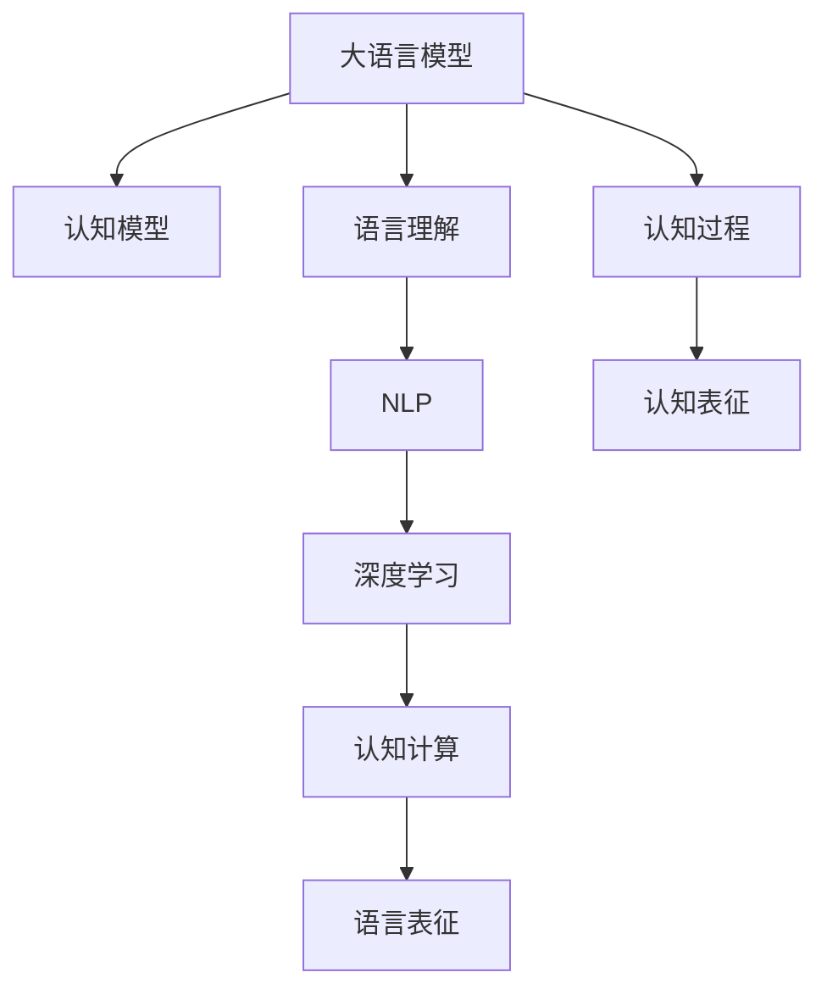
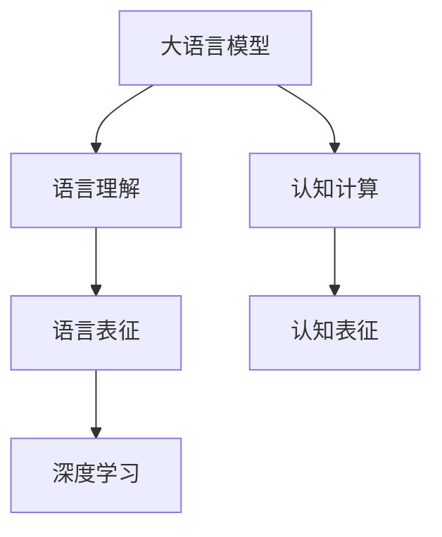

                 

# 语言与思维的区别：大模型的认知难题

> 关键词：大语言模型,认知模型,语言理解,自然语言处理,NLP,深度学习,认知计算,语言表征

## 1. 背景介绍

### 1.1 问题由来
近年来，随着深度学习技术的飞速发展，大语言模型(Large Language Model, LLMs)在自然语言处理(Natural Language Processing, NLP)领域取得了显著进展。这些大模型通过在大规模无标签文本数据上进行预训练，学习到丰富的语言知识和常识，具备了强大的语言理解和生成能力。然而，大语言模型的认知能力与人类思维相比，仍存在显著差异。本文旨在深入探讨这种区别，并展望大语言模型未来在认知领域的发展前景。

### 1.2 问题核心关键点
大语言模型与人类思维之间的区别主要体现在以下几个方面：

1. **数据驱动与经验驱动**：大语言模型通过数据驱动的方式进行学习，而人类思维则更多依赖于经验和直觉。
2. **知识获取与知识推理**：大语言模型主要通过数据挖掘获取知识，而人类思维则能够进行复杂逻辑推理和知识整合。
3. **认知过程与认知表征**：大语言模型主要基于神经网络进行认知过程，而人类思维涉及复杂的心理过程和神经网络。
4. **认知层次与认知深度**：大语言模型通常在浅层知识处理上表现良好，而人类思维能够处理多层次、多维度的认知任务。
5. **可解释性与可控性**：大语言模型的决策过程难以解释，而人类思维具有高度的可解释性和可控性。

### 1.3 问题研究意义
研究大语言模型与人类思维的区别，对于理解大语言模型的局限性和未来发展方向具有重要意义：

1. 揭示大语言模型在认知领域的能力边界。
2. 为构建具有更强认知能力的AI系统提供理论基础。
3. 促进人工智能伦理和安全性的研究。
4. 推动跨学科的认知科学与计算机科学融合。
5. 激发新的AI技术创新与应用方向。

## 2. 核心概念与联系

### 2.1 核心概念概述

为更好地理解大语言模型与人类思维的区别，本节将介绍几个密切相关的核心概念：

- 大语言模型(Large Language Model, LLM)：以自回归(如GPT)或自编码(如BERT)模型为代表的大规模预训练语言模型。通过在大规模无标签文本语料上进行预训练，学习通用的语言表示，具备强大的语言理解和生成能力。

- 认知模型(Cognitive Model)：用于模拟人类认知过程的计算模型。通常基于心理学和神经科学的理论，用于处理符号、推理、记忆等认知任务。

- 语言理解(Language Understanding)：指计算机理解人类语言的能力，包括语义理解、意图识别、实体抽取等。

- 自然语言处理(Natural Language Processing, NLP)：涉及计算机对人类语言的处理，包括语言理解、生成、翻译、摘要等。

- 深度学习(Deep Learning)：一种利用神经网络进行数据建模和预测的机器学习技术。

- 认知计算(Cognitive Computing)：结合认知科学和计算机科学，模拟人类认知过程的计算技术。

- 语言表征(Language Representation)：将自然语言转化为计算机可以处理的向量表示，用于后续的计算和推理。

这些核心概念之间的逻辑关系可以通过以下Mermaid流程图来展示：



这个流程图展示了大语言模型与人类思维在各个核心概念上的联系和区别。

### 2.2 概念间的关系

这些核心概念之间存在着紧密的联系，形成了大语言模型与人类思维的区别框架。下面我们通过几个Mermaid流程图来展示这些概念之间的关系。

#### 2.2.1 大语言模型的认知过程



这个流程图展示了大语言模型的认知过程，从语言理解到深度学习，再到认知计算和表征。

#### 2.2.2 认知模型与大语言模型的对比

```mermaid
graph LR
    A[Cognitive Model] --> B[Symbolic Reasoning]
    A --> C[Probabilistic Inference]
    A --> D[Hierarchical Memory]
    B --> E[LTLI1]
    C --> F[LTLI2]
    D --> G[LTLI3]
    E --> H[LTLI4]
    F --> I[LTLI5]
    G --> J[LTLI6]
    H --> K[LTLI7]
    I --> L[LTLI8]
    J --> M[LTLI9]
    K --> N[LTLI10]
    L --> O[LTLI11]
    M --> P[LTLI12]
    N --> Q[LTLI13]
    O --> R[LTLI14]
    P --> S[LTLI15]
    Q --> T[LTLI16]
    R --> U[LTLI17]
    S --> V[LTLI18]
    T --> W[LTLI19]
    U --> X[LTLI20]
    V --> Y[LTLI21]
    W --> Z[LTLI22]
    X --> Aa[LTLI23]
    Y --> Ab[LTLI24]
    Z --> Ac[LTLI25]
    Aa --> Ad[LTLI26]
    Ab --> Ad[LTLI27]
    Ac --> Ad[LTLI28]
    Ad --> Ae[LTLI29]
    Ae --> Af[LTLI30]
    Af --> Ag[LTLI31]
    Ag --> Ah[LTLI32]
    Ah --> Ai[LTLI33]
    Ai --> Aj[LTLI34]
    Aj --> Ak[LTLI35]
    Ak --> Al[LTLI36]
    Al --> Am[LTLI37]
    Am --> An[LTLI38]
    An --> Ao[LTLI39]
    Ao --> Ap[LTLI40]
    Ap --> Aq[LTLI41]
    Aq --> Ar[LTLI42]
    Ar --> As[LTLI43]
    As --> At[LTLI44]
    At --> Au[LTLI45]
    Au --> Av[LTLI46]
    Av --> Aw[LTLI47]
    Aw --> Ax[LTLI48]
    Ax --> Ay[LTLI49]
    Ay --> Az[LTLI50]
    Az --> Ba[LTLI51]
    Ba --> Bb[LTLI52]
    Bb --> Bc[LTLI53]
    Bc --> Bd[LTLI54]
    Bd --> Be[LTLI55]
    Be --> Bf[LTLI56]
    Bf --> Bg[LTLI57]
    Bg --> Bh[LTLI58]
    Bh --> Bi[LTLI59]
    Bi --> Bj[LTLI60]
    Bj --> Bk[LTLI61]
    Bk --> Bl[LTLI62]
    Bl --> Bm[LTLI63]
    Bm --> Bn[LTLI64]
    Bn --> Bo[LTLI65]
    Bo --> Bp[LTLI66]
    Bp --> Bq[LTLI67]
    Bq --> Br[LTLI68]
    Br --> Bs[LTLI69]
    Bs --> Bt[LTLI70]
    Bt --> Bu[LTLI71]
    Bu --> Bv[LTLI72]
    Bv --> Bw[LTLI73]
    Bw --> Bx[LTLI74]
    Bx --> By[LTLI75]
    By --> Bz[LTLI76]
    Bz --> Ca[LTLI77]
    Ca --> Cb[LTLI78]
    Cb --> Cc[LTLI79]
    Cc --> Cd[LTLI80]
    Cd --> Ce[LTLI81]
    Ce --> Cf[LTLI82]
    Cf --> Cg[LTLI83]
    Cg --> Ch[LTLI84]
    Ch --> Ci[LTLI85]
    Ci --> Cj[LTLI86]
    Cj --> Ck[LTLI87]
    Ck --> Cl[LTLI88]
    Cl --> Cm[LTLI89]
    Cm --> Cn[LTLI90]
    Cn --> Co[LTLI91]
    Co --> Cp[LTLI92]
    Cp --> Cq[LTLI93]
    Cq --> Cr[LTLI94]
    Cr --> Cs[LTLI95]
    Cs --> Ct[LTLI96]
    Ct --> Cu[LTLI97]
    Cu --> Cv[LTLI98]
    Cv --> Cw[LTLI99]
    Cw --> Cx[LTLI100]
    Cx --> Cy[LTLI101]
    Cy --> Cz[LTLI102]
    Cz --> Da[LTLI103]
    Da --> Db[LTLI104]
    Db --> Dc[LTLI105]
    Dc --> Dd[LTLI106]
    Dd --> De[LTLI107]
    De --> Df[LTLI108]
    Df --> Dg[LTLI109]
    Dg --> Dh[LTLI110]
    Dh --> Di[LTLI111]
    Di --> Dj[LTLI112]
    Dj --> Dk[LTLI113]
    Dk --> Dl[LTLI114]
    Dl --> Dm[LTLI115]
    Dm --> Dn[LTLI116]
    Dn --> Do[LTLI117]
    Do --> Dp[LTLI118]
    Dp --> Dq[LTLI119]
    Dq --> Dr[LTLI120]
    Dr --> Ds[LTLI121]
    Ds --> Dt[LTLI122]
    Dt --> Du[LTLI123]
    Du --> Dv[LTLI124]
    Dv --> Dw[LTLI125]
    Dw --> Dx[LTLI126]
    Dx --> Dy[LTLI127]
    Dy --> Dz[LTLI128]
    Dz --> Ea[LTLI129]
    Ea --> Eb[LTLI130]
    Eb --> Ec[LTLI131]
    Ec --> Ed[LTLI132]
    Ed --> Ee[LTLI133]
    Ee --> Ef[LTLI134]
    Ef --> Eg[LTLI135]
    Eg --> Eh[LTLI136]
    Eh --> Ei[LTLI137]
    Ei --> Ej[LTLI138]
    Ej --> Ek[LTLI139]
    Ek --> El[LTLI140]
    El --> Em[LTLI141]
    Em --> En[LTLI142]
    En --> Eo[LTLI143]
    Eo --> Ep[LTLI144]
    Ep --> Eq[LTLI145]
    Eq --> Er[LTLI146]
    Er --> Es[LTLI147]
    Es --> Et[LTLI148]
    Et --> Eu[LTLI149]
    Eu --> Ev[LTLI150]
    Ev --> Ew[LTLI151]
    Ew --> Ex[LTLI152]
    Ex --> Ey[LTLI153]
    Ey --> Ez[LTLI154]
    Ez --> Fa[LTLI155]
    Fa --> Fb[LTLI156]
    Fb --> Fc[LTLI157]
    Fc --> Fd[LTLI158]
    Fd --> Fe[LTLI159]
    Fe --> Ff[LTLI160]
    Ff --> Fg[LTLI161]
    Fg --> Fh[LTLI162]
    Fh --> Fi[LTLI163]
    Fi --> Fj[LTLI164]
    Fj --> Fk[LTLI165]
    Fk --> Fl[LTLI166]
    Fl --> Fm[LTLI167]
    Fm --> Fn[LTLI168]
    Fn --> Fo[LTLI169]
    Fo --> Fp[LTLI170]
    Fp --> Fq[LTLI171]
    Fq --> Fr[LTLI172]
    Fr -->Fs[LTLI173]
    Fs --> Ft[LTLI174]
    Ft --> Fu[LTLI175]
    Fu --> Fv[LTLI176]
    Fv --> Fw[LTLI177]
    Fw --> Fx[LTLI178]
    Fx --> Fy[LTLI179]
    Fy --> Fz[LTLI180]
    Fz --> Ga[LTLI181]
    Ga --> Gb[LTLI182]
    Gb --> Gc[LTLI183]
    Gc --> Gd[LTLI184]
    Gd --> Ge[LTLI185]
    Ge --> Gf[LTLI186]
    Gf --> Gg[LTLI187]
    Gg --> Gh[LTLI188]
    Gh --> Gi[LTLI189]
    Gi --> Gj[LTLI190]
    Gj --> Gk[LTLI191]
    Gk --> Gl[LTLI192]
    Gl --> Gm[LTLI193]
    Gm --> Gn[LTLI194]
    Gn --> Go[LTLI195]
    Go --> Gp[LTLI196]
    Gp --> Gq[LTLI197]
    Gq --> Gr[LTLI198]
    Gr --> Gs[LTLI199]
    Gs --> Gt[LTLI200]
    Gt --> Gu[LTLI201]
    Gu --> Gv[LTLI202]
    Gv --> Gw[LTLI203]
    Gw --> Gx[LTLI204]
    Gx --> Gy[LTLI205]
    Gy --> Gz[LTLI206]
    Gz --> Ha[LTLI207]
    Ha --> Hb[LTLI208]
    Hb --> Hc[LTLI209]
    Hc --> Hd[LTLI210]
    Hd --> He[LTLI211]
    He --> Hf[LTLI212]
    Hf --> Hg[LTLI213]
    Hg --> Hh[LTLI214]
    Hh --> Hi[LTLI215]
    Hi --> Hj[LTLI216]
    Hj --> Hk[LTLI217]
    Hk --> Hl[LTLI218]
    Hl --> Hm[LTLI219]
    Hm --> Hn[LTLI220]
    Hn --> Ho[LTLI221]
    Ho -->Hp[LTLI222]
    Hp --> Hq[LTLI223]
    Hq --> Hr[LTLI224]
    Hr --> Hs[LTLI225]
    Hs --> Ht[LTLI226]
    Ht --> Hu[LTLI227]
    Hu --> Hv[LTLI228]
    Hv --> Hw[LTLI229]
    Hw --> Hx[LTLI230]
    Hx --> Hy[LTLI231]
    Hy --> Hz[LTLI232]
    Hz --> Ia[LTLI233]
    Ia --> Ib[LTLI234]
    Ib --> Ic[LTLI235]
    Ic --> Id[LTLI236]
    Id --> Ie[LTLI237]
    Ie --> If[LTLI238]
    If --> Ig[LTLI239]
    Ig --> Ih[LTLI240]
    Ih --> Ii[LTLI241]
    Ii --> Ij[LTLI242]
    Ij --> Ik[LTLI243]
    Ik --> Il[LTLI244]
    Il --> Im[LTLI245]
    Im --> In[LTLI246]
    In --> Io[LTLI247]
    Io --> Ip[LTLI248]
    Ip --> Iq[LTLI249]
    Iq --> Ir[LTLI250]
    Ir --> Is[LTLI251]
    Is --> It[LTLI252]
    It --> Iu[LTLI253]
    Iu --> Iv[LTLI254]
    Iv --> Iw[LTLI255]
    Iw --> Ix[LTLI256]
    Ix --> Iy[LTLI257]
    Iy --> Iz[LTLI258]
    Iz --> Ja[LTLI259]
    Ja --> Jb[LTLI260]
    Jb --> Jc[LTLI261]
    Jc --> Jd[LTLI262]
    Jd --> Je[LTLI263]
    Je --> Jf[LTLI264]
    Jf --> Jg[LTLI265]
    Jg --> Jh[LTLI266]
    Jh --> Ji[LTLI267]
    Ji --> Jj[LTLI268]
    Jj --> Jk[LTLI269]
    Jk --> Jl[LTLI270]
    Jl --> Jm[LTLI271]
    Jm --> Jn[LTLI272]
    Jn --> Jo[LTLI273]
    Jo --> Jp[LTLI274]
    Jp --> Jq[LTLI275]
    Jq --> Jr[LTLI276]
    Jr --> Js[LTLI277]
    Js --> Jt[LTLI278]
    Jt --> Ju[LTLI279]
    Ju --> Jv[LTLI280]
    Jv --> Jw[LTLI281]
    Jw --> Jx[LTLI282]
    Jx --> Jy[LTLI283]
    Jy --> Jz[LTLI284]
    Jz --> Ka[LTLI285]
    Ka --> Kb[LTLI286]
    Kb --> Kc[LTLI287]
    Kc --> Kd[LTLI288]
    Kd --> Ke[LTLI289]
    Ke --> Kf[LTLI290]
    Kf --> Kg[LTLI291]
    Kg --> Kh[LTLI292]
    Kh --> Ki[LTLI293]
    Ki --> Kj[LTLI294]
    Kj --> Kk[LTLI295]
    Kk --> Kl[LTLI296]
    Kl --> Km[LTLI297]
    Km --> Kn[LTLI298]
    Kn --> Ko[LTLI299]
    Ko --> Kp[LTLI300]
    Kp --> Kq[LTLI301]
    Kq --> Kr[LTLI302]
    Kr --> Ks[LTLI303]
    Ks --> Kt[LTLI304]
    Kt --> Ku[LTLI305]
    Ku --> Kv[LTLI306]
    Kv --> Kw[LTLI307]
    Kw --> Kx[LTLI308]
    Kx --> Ky[LTLI309]
    Ky --> Kz[LTLI310]
    Kz --> La[LTLI311]
    La --> Lb[LTLI312]
    Lb --> Lc[LTLI313]
    Lc --> Ld[LTLI314]
    Ld --> Le[LTLI315]
    Le --> Lf[LTLI316]
    Lf --> Lg[LTLI317]
    Lg --> Lh[LTLI318]
    Lh --> Li[LTLI319]
    Li --> Lj[LTLI320]
    Lj --> Lk[LTLI321]
    Lk --> Ll[LTLI322]
    Ll --> Lm[LTLI323]
    Lm --> Ln[LTLI324]
    Ln --> Lo[LTLI325]
    Lo --> Lp[LTLI326]
    Lp --> Lq[LTLI327]
    Lq --> Lr[LTLI328]
    Lr --> Ls[LTLI329]
    Ls --> Lt[LTLI330]
    Lt --> Lu[LTLI331]
    Lu --> Lv[LTLI332]
    Lv --> Lw[LTLI333]
    Lw --> Lx[LTLI334]
    Lx --> Ly[LTLI335]
    Ly --> Lz[LTLI336]
    Lz --> Ma[LTLI337]
    Ma --> Mb[LTLI338]
    Mb --> Mc[LTLI339]
    Mc --> Md[LTLI340]
    Md --> Me[LTLI341]
    Me --> Mf[LTLI342]
    Mf --> Mg[LTLI343]
    Mg --> Mh[LTLI344]
    Mh --> Mi[LTLI345]
    Mi --> Mj[LTLI346]
    Mj --> Mk[LTLI347]
    Mk --> Ml[LTLI348]
    Ml --> Mm[LTLI349]
    Mm --> Mn[LTLI350]
    Mn --> Mo[LTLI351]
    Mo --> Mp[LTLI352]
    Mp --> Mq[LTLI353]
    Mq --> Mr[LTLI354]
    Mr --> Ms[LTLI355]
    Ms --> Mt[LTLI356]
    Mt --> Mu[LTLI357]
    Mu --> Mv[LTLI358]
    Mv --> Mw[LTLI359]
    Mw --> Mx[LTLI360]
    Mx --> My[LTLI361]
    My --> Mz[LTLI362]
    Mz --> Na[LTLI363]
    Na --> Nb[LTLI364]
    Nb --> Nc[LTLI365]
    Nc --> Nd[LTLI366]
    Nd --> Ne[LTLI367]
    Ne --> Nf[LTLI368]
    Nf --> Ng[LTLI369]
    Ng --> Nh[LTLI370]
    Nh --> Ni[LTLI371]
    Ni --> Nj[LTLI372]
    Nj --> Nk[LTLI373]
    Nk --> Nl[LTLI374]
    Nl --> Nm[LTLI375]
    Nm --> Nn[LTLI376]
    Nn --> No[LTLI377]
    No --> Np[LTLI378]
    Np --> Nq[LTLI379]
    Nq --> Nr[LTLI380]
    Nr --> Ns[LTLI381]
    Ns --> Nt[LTLI382]
    Nt --> Nu[LTLI383]
    Nu --> Nv[LTLI384]
    Nv --> Nw[LTLI385]
    Nw --> Nx[LTLI386]
    Nx --> Ny[LTLI387]
    Ny --> Nz[LTLI388]
    Nz --> Oa[LTLI389]
    Oa --> Ob[LTLI390]
    Ob --> Oc[LTLI391]
    Oc --> Od[LTLI392]
    Od --> OE[LTLI393]
    OE --> OF[LTLI394]
    OF --> Og[LTLI395]
    Og --> Oh[LTLI396]
    Oh --> Oi[LTLI397]
    Oi --> Oj[LTLI398]
    Oj --> Ok[LTLI399]
    Ok --> Ol[LTLI400]
    Ol --> Om[LTLI401]
    Om --> On[LTLI402]
    On --> Oo[LTLI403]
    Oo --> Op[LTLI404]
    Op --> Oq[LTLI405]
    Oq --> Or[LTLI406]
    Or --> Os[LTLI407]
    Os --> Ot[LTLI408]
    Ot -->OU[LTLI409]
    OU -->OV[LTLI410]
    OV -->OW[LTLI411]
    OW -->OX[LTLI412]
    OX -->OY[LTLI413]
    OY -->OZ[LTLI414]
    OZ --> Pa[LTLI415]
    Pa --> Pb[LTLI416]
    Pb --> Pc[LTLI417]
    Pc --> Pd[LTLI418]
    Pd --> Pe[LTLI419]
    Pe --> Pf[LTLI420]
    Pf --> Pg[LTLI421]
    Pg --> Ph[LTLI422]
    Ph --> Pi[LTLI423]
    Pi --> Pj[LTLI424]
    Pj --> Pk[LTLI425]
    Pk --> Pl[LTLI426]
    Pl --> Pm[LTLI427]
    Pm --> Pn[LTLI428]
    Pn --> Po[LTLI429]
    Po --> Pp[LTLI430]
    Pp --> Pq[LTLI431]
    Pq --> Pr[LTLI432]
    Pr --> Ps[LTLI433]
    Ps --> Pt[LTLI434]
    Pt --> Pu[LTLI435]
    Pu --> Pv[LTLI436]
    Pv --> Pw[LTLI437]
    Pw --> Px[LTLI438]
    Px --> Py[LTLI439]
    Py --> Pz[LTLI440]
    Pz --> Qa[LTLI441]
    Qa --> Qb[LTLI442]
    Qb --> Qc[LTLI443]
    Qc --> Qd[LTLI444]
    Qd --> Qe[LTLI445]
    Qe --> Qf[LTLI446]
    Qf --> Qg[LTLI447]
    Qg --> Qh[LTLI448]
    Qh --> Qi[LTLI449]
    Qi --> Qj[LTLI450]
    Qj --> Qk[LTLI451]
    Qk --> Ql[LTLI452]
    Ql --> Qm[LTLI453]
    Qm --> Qn[LTLI454]
    Qn --> Qo[LTLI455]
    Qo --> Qp[LTLI456]
    Qp --> Qq[LTLI457]
    Qq --> Qr[LTLI458]
    Qr --> Qs[LTLI459]
    Qs --> Qt[LTLI460]
    Qt --> Qu[LTLI461]
    Qu --> Qv[LTLI462]
    Qv --> Qw[LTLI463]
    Qw --> Qx[LTLI464]
    Qx --> Qy[LTLI465]
    Qy --> Qz[LTLI466]
    Qz --> Ra[LTLI467]
    Ra --> Rb[LTLI468]
    Rb --> Rc[LTLI469]
    Rc --> Rd[LTLI470]
    Rd --> Re[LTLI471]
    Re --> Rf[LTLI472]
    Rf --> Rg[LTLI473]
    Rg

