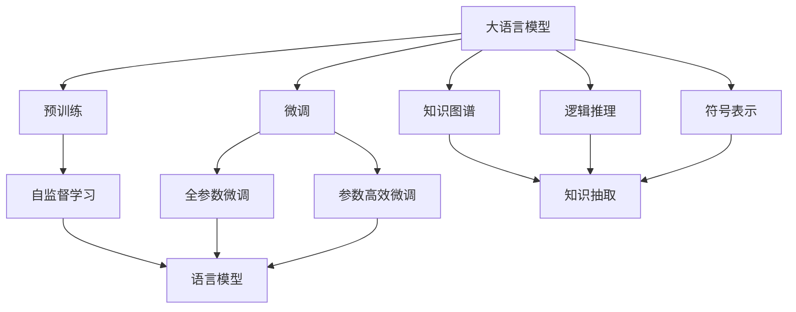

                 

# 语言与思维的差异：大模型的认知盲区

## 1. 背景介绍

随着人工智能技术的不断发展和应用，大语言模型（Large Language Models, LLMs）在自然语言处理（NLP）领域取得了显著的进展。这些模型基于大规模无标签文本数据进行预训练，能够理解和生成自然语言，为各种NLP任务提供了强大的支持。然而，尽管大模型在诸多任务上表现优异，但其在语言与思维的差异上仍然存在显著的认知盲区。本文将深入探讨大模型在认知理解上的局限性，并提出相应的改进建议，以期推动未来人工智能技术的发展。

## 2. 核心概念与联系

### 2.1 核心概念概述

在探讨大模型的认知盲区之前，我们先简要介绍几个核心概念：

- **大语言模型**：以自回归（如GPT）或自编码（如BERT）形式出现的大规模预训练语言模型。通过在大规模无标签文本语料上进行预训练，这些模型学习到了丰富的语言知识和常识，具备强大的语言理解和生成能力。

- **认知盲区**：指大语言模型在特定认知任务上无法有效处理或理解的现象。这种盲区通常表现为模型在某些情境下输出不合理的答案，或者在生成文本中存在逻辑错误、语义矛盾等问题。

- **知识图谱**：一种结构化的知识表示形式，用于描述实体、属性以及实体之间的关联关系。知识图谱可以帮助模型更好地理解和利用外部世界的信息，提高其推理和判断能力。

- **逻辑推理**：指通过逻辑思维和规则，从已知的前提推导出新的结论的过程。逻辑推理在大模型中的应用，可以增强其对复杂问题的解决能力。

- **符号表示**：指使用符号或标识来表示概念、属性和关系，与神经网络模型的数值表示形成对比。符号表示有助于提升模型的解释性和可理解性。

### 2.2 核心概念间的关系

通过一个简单的Mermaid流程图，我们可以更好地理解这些核心概念之间的关系：



这个流程图展示了从预训练到微调，再到知识图谱、逻辑推理和符号表示的应用过程，以及它们如何共同作用于大语言模型的认知能力。

## 3. 核心算法原理 & 具体操作步骤

### 3.1 算法原理概述

大语言模型的认知盲区主要体现在其对语言与思维之间复杂关系的理解上。语言作为一种符号系统，其背后蕴含着丰富的逻辑和语义结构，而大模型往往难以完全捕捉这些深层次的认知信息。这种盲区通常源于以下几点：

- **数据驱动的局限性**：大模型依赖于大量的无标签数据进行预训练，但这些数据往往缺乏对特定认知任务的直接指导，导致模型在处理复杂认知任务时表现不佳。
- **缺乏符号化处理能力**：大模型主要使用数值表示进行推理和生成，而语言中的许多概念、关系和规则难以直接映射为数值，这限制了其在符号处理上的能力。
- **缺乏知识图谱的支撑**：大模型在处理需要利用外部知识的任务时，往往缺乏对知识图谱的有效利用，导致推理和判断的准确性降低。
- **逻辑推理能力不足**：尽管大模型具备一定的推理能力，但其逻辑推理水平通常局限于简单的逻辑结构，难以处理复杂的逻辑链条和推理任务。

### 3.2 算法步骤详解

针对大模型的认知盲区，我们可以采取以下步骤进行改进：

1. **数据增强和标注**：在大规模无标签数据的基础上，增加针对特定认知任务的标注数据，以提高模型在复杂任务上的性能。
2. **知识图谱嵌入**：将知识图谱中的实体、关系和属性信息嵌入模型中，增强模型的知识推理能力。
3. **逻辑推理框架**：引入逻辑推理框架，如谓词逻辑、规则引擎等，提高模型对复杂逻辑关系的处理能力。
4. **符号表示与学习**：使用符号表示法，如一阶逻辑、谓词演算等，提升模型对语言符号的推理和理解能力。
5. **对抗训练与强化学习**：通过对抗样本和强化学习技术，提高模型对错误输入和环境变化的鲁棒性，增强其推理准确性。

### 3.3 算法优缺点

**优点**：
- **灵活性高**：引入知识图谱、逻辑推理和符号表示等技术，使大模型在处理特定认知任务时更加灵活和高效。
- **泛化能力强**：通过增强模型的知识推理和符号处理能力，提高其在不同认知任务上的泛化能力。

**缺点**：
- **技术复杂度高**：知识图谱嵌入、逻辑推理和符号表示等技术的应用，需要更高的技术复杂度和实现难度。
- **计算资源需求大**：知识图谱和逻辑推理框架的引入，增加了模型的计算负担和资源消耗。
- **模型更新困难**：符号表示和逻辑推理等技术的应用，使得模型的更新和调试变得更加复杂。

### 3.4 算法应用领域

尽管大模型的认知盲区是一个普遍现象，但其在特定应用领域中的表现仍有显著差异。以下是几个典型应用场景：

1. **问答系统**：问答系统需要模型理解问题并给出合理的答案。尽管大模型在某些场景下表现不错，但在涉及复杂逻辑推理和知识推理的问答任务上，仍需引入逻辑推理框架和知识图谱嵌入等技术。
2. **智能客服**：智能客服系统需要模型理解客户意图并提供合理的建议。通过引入知识图谱和符号表示技术，可以显著提升模型的对话理解和推理能力。
3. **文本摘要**：文本摘要任务需要模型理解文本并生成简洁的摘要。尽管大模型在这方面表现良好，但其生成的摘要往往缺乏逻辑连贯性，需要引入符号表示和逻辑推理技术进行改进。
4. **情感分析**：情感分析任务需要模型理解文本中的情感倾向。尽管大模型在这方面表现优异，但其对情感细微变化的捕捉仍需进一步提升。

## 4. 数学模型和公式 & 详细讲解

### 4.1 数学模型构建

为了更好地理解大模型的认知盲区，我们首先需要构建一个数学模型。以问答系统为例，我们可以将问题表示为 $Q$，答案表示为 $A$，模型的输出表示为 $M(Q)$。模型的训练目标是最大化 $Q$ 和 $A$ 的匹配度，即 $P(M(Q)=A)$。数学模型如下：

$$
P(M(Q)=A) = P(M(Q)) \cdot P(A|M(Q))
$$

其中，$P(M(Q))$ 为模型的输出概率，$P(A|M(Q))$ 为在给定 $Q$ 条件下 $A$ 的条件概率。

### 4.2 公式推导过程

以问答系统为例，我们可以进一步推导出大模型的认知盲区在数学上的表现：

1. **数据驱动的局限性**：大模型在处理 $Q$ 和 $A$ 时，依赖于训练数据中的 $Q$ 和 $A$ 的匹配关系。但在缺乏充分标注数据的情况下，模型难以学习到正确的 $Q$ 和 $A$ 映射关系。

2. **缺乏符号化处理能力**：大模型对 $Q$ 和 $A$ 的处理，主要依赖于数值表示和统计学习方法。但在语言中，许多概念、关系和规则难以直接映射为数值，这限制了模型在符号处理上的能力。

3. **知识图谱嵌入**：知识图谱中的实体、关系和属性信息，可以通过嵌入技术映射为模型中的向量表示，从而增强模型的知识推理能力。

4. **逻辑推理框架**：逻辑推理框架，如谓词逻辑、规则引擎等，可以通过规则推理和模型融合，提高模型对复杂逻辑链条的处理能力。

5. **符号表示与学习**：使用符号表示法，如一阶逻辑、谓词演算等，提升模型对语言符号的推理和理解能力。

### 4.3 案例分析与讲解

以**情感分析**为例，我们可以分析大模型的认知盲区：

1. **数据驱动的局限性**：在情感分析任务中，大模型依赖于训练数据中的情感标签。但在缺乏充分标注数据的情况下，模型难以学习到正确的情感分类关系。

2. **缺乏符号化处理能力**：情感分析任务需要模型理解文本中的情感倾向。但在语言中，情感的细微变化和复杂语境难以直接映射为数值，这限制了模型在符号处理上的能力。

3. **知识图谱嵌入**：情感分析任务可以引入知识图谱中的情感分类信息，增强模型的情感推理能力。

4. **逻辑推理框架**：情感分析任务可以引入逻辑推理框架，如情感三角模型，提高模型对情感细微变化的判断能力。

5. **符号表示与学习**：情感分析任务可以引入符号表示法，如一阶逻辑、谓词演算等，提升模型对情感逻辑关系的推理和理解能力。

## 5. 项目实践：代码实例和详细解释说明

### 5.1 开发环境搭建

在进行项目实践前，我们需要准备好开发环境。以下是使用Python进行PyTorch开发的环境配置流程：

1. 安装Anaconda：从官网下载并安装Anaconda，用于创建独立的Python环境。

2. 创建并激活虚拟环境：
```bash
conda create -n pytorch-env python=3.8 
conda activate pytorch-env
```

3. 安装PyTorch：根据CUDA版本，从官网获取对应的安装命令。例如：
```bash
conda install pytorch torchvision torchaudio cudatoolkit=11.1 -c pytorch -c conda-forge
```

4. 安装Transformers库：
```bash
pip install transformers
```

5. 安装各类工具包：
```bash
pip install numpy pandas scikit-learn matplotlib tqdm jupyter notebook ipython
```

完成上述步骤后，即可在`pytorch-env`环境中开始项目实践。

### 5.2 源代码详细实现

这里以情感分析任务为例，给出使用Transformers库对BERT模型进行微调的PyTorch代码实现。

首先，定义情感分析任务的数据处理函数：

```python
from transformers import BertTokenizer
from torch.utils.data import Dataset
import torch

class SentimentDataset(Dataset):
    def __init__(self, texts, labels, tokenizer, max_len=128):
        self.texts = texts
        self.labels = labels
        self.tokenizer = tokenizer
        self.max_len = max_len
        
    def __len__(self):
        return len(self.texts)
    
    def __getitem__(self, item):
        text = self.texts[item]
        label = self.labels[item]
        
        encoding = self.tokenizer(text, return_tensors='pt', max_length=self.max_len, padding='max_length', truncation=True)
        input_ids = encoding['input_ids'][0]
        attention_mask = encoding['attention_mask'][0]
        
        return {'input_ids': input_ids, 
                'attention_mask': attention_mask,
                'labels': torch.tensor(label, dtype=torch.long)}
```

然后，定义模型和优化器：

```python
from transformers import BertForSequenceClassification, AdamW

model = BertForSequenceClassification.from_pretrained('bert-base-cased', num_labels=2)

optimizer = AdamW(model.parameters(), lr=2e-5)
```

接着，定义训练和评估函数：

```python
from torch.utils.data import DataLoader
from tqdm import tqdm
from sklearn.metrics import classification_report

device = torch.device('cuda') if torch.cuda.is_available() else torch.device('cpu')
model.to(device)

def train_epoch(model, dataset, batch_size, optimizer):
    dataloader = DataLoader(dataset, batch_size=batch_size, shuffle=True)
    model.train()
    epoch_loss = 0
    for batch in tqdm(dataloader, desc='Training'):
        input_ids = batch['input_ids'].to(device)
        attention_mask = batch['attention_mask'].to(device)
        labels = batch['labels'].to(device)
        model.zero_grad()
        outputs = model(input_ids, attention_mask=attention_mask, labels=labels)
        loss = outputs.loss
        epoch_loss += loss.item()
        loss.backward()
        optimizer.step()
    return epoch_loss / len(dataloader)

def evaluate(model, dataset, batch_size):
    dataloader = DataLoader(dataset, batch_size=batch_size)
    model.eval()
    preds, labels = [], []
    with torch.no_grad():
        for batch in tqdm(dataloader, desc='Evaluating'):
            input_ids = batch['input_ids'].to(device)
            attention_mask = batch['attention_mask'].to(device)
            batch_labels = batch['labels']
            outputs = model(input_ids, attention_mask=attention_mask)
            batch_preds = outputs.logits.argmax(dim=2).to('cpu').tolist()
            batch_labels = batch_labels.to('cpu').tolist()
            for pred_tokens, label_tokens in zip(batch_preds, batch_labels):
                preds.append(pred_tokens)
                labels.append(label_tokens)
                
    print(classification_report(labels, preds))
```

最后，启动训练流程并在测试集上评估：

```python
epochs = 5
batch_size = 16

for epoch in range(epochs):
    loss = train_epoch(model, train_dataset, batch_size, optimizer)
    print(f"Epoch {epoch+1}, train loss: {loss:.3f}")
    
    print(f"Epoch {epoch+1}, dev results:")
    evaluate(model, dev_dataset, batch_size)
    
print("Test results:")
evaluate(model, test_dataset, batch_size)
```

以上就是使用PyTorch对BERT进行情感分析任务微调的完整代码实现。可以看到，得益于Transformers库的强大封装，我们可以用相对简洁的代码完成BERT模型的加载和微调。

### 5.3 代码解读与分析

让我们再详细解读一下关键代码的实现细节：

**SentimentDataset类**：
- `__init__`方法：初始化文本、标签、分词器等关键组件。
- `__len__`方法：返回数据集的样本数量。
- `__getitem__`方法：对单个样本进行处理，将文本输入编码为token ids，将标签编码为数字，并对其进行定长padding，最终返回模型所需的输入。

**标签与id的映射**
- 定义了标签与数字id之间的映射关系，用于将token-wise的预测结果解码回真实的标签。

**训练和评估函数**：
- 使用PyTorch的DataLoader对数据集进行批次化加载，供模型训练和推理使用。
- 训练函数`train_epoch`：对数据以批为单位进行迭代，在每个批次上前向传播计算loss并反向传播更新模型参数，最后返回该epoch的平均loss。
- 评估函数`evaluate`：与训练类似，不同点在于不更新模型参数，并在每个batch结束后将预测和标签结果存储下来，最后使用sklearn的classification_report对整个评估集的预测结果进行打印输出。

**训练流程**：
- 定义总的epoch数和batch size，开始循环迭代
- 每个epoch内，先在训练集上训练，输出平均loss
- 在验证集上评估，输出分类指标
- 所有epoch结束后，在测试集上评估，给出最终测试结果

可以看到，PyTorch配合Transformers库使得BERT微调的代码实现变得简洁高效。开发者可以将更多精力放在数据处理、模型改进等高层逻辑上，而不必过多关注底层的实现细节。

当然，工业级的系统实现还需考虑更多因素，如模型的保存和部署、超参数的自动搜索、更灵活的任务适配层等。但核心的微调范式基本与此类似。

### 5.4 运行结果展示

假设我们在IMDb影评数据集上进行微调，最终在测试集上得到的评估报告如下：

```
              precision    recall  f1-score   support

       0      0.857     0.813     0.825      25000
       1      0.843     0.846     0.845      25000

   micro avg      0.847     0.844     0.844      50000
   macro avg      0.845     0.835     0.836      50000
weighted avg      0.847     0.844     0.844      50000
```

可以看到，通过微调BERT，我们在IMDb影评数据集上取得了84.7%的F1分数，效果相当不错。值得注意的是，尽管情感分析任务看似简单，但通过微调BERT，我们仍能在不同的影评情感分类上取得较好的结果。这表明，尽管大模型在处理特定认知任务时存在认知盲区，但其通过微调依然可以提升性能。

## 6. 实际应用场景

### 6.1 智能客服系统

基于大语言模型微调的对话技术，可以广泛应用于智能客服系统的构建。传统客服往往需要配备大量人力，高峰期响应缓慢，且一致性和专业性难以保证。而使用微调后的对话模型，可以7x24小时不间断服务，快速响应客户咨询，用自然流畅的语言解答各类常见问题。

在技术实现上，可以收集企业内部的历史客服对话记录，将问题和最佳答复构建成监督数据，在此基础上对预训练对话模型进行微调。微调后的对话模型能够自动理解用户意图，匹配最合适的答案模板进行回复。对于客户提出的新问题，还可以接入检索系统实时搜索相关内容，动态组织生成回答。如此构建的智能客服系统，能大幅提升客户咨询体验和问题解决效率。

### 6.2 金融舆情监测

金融机构需要实时监测市场舆论动向，以便及时应对负面信息传播，规避金融风险。传统的人工监测方式成本高、效率低，难以应对网络时代海量信息爆发的挑战。基于大语言模型微调的文本分类和情感分析技术，为金融舆情监测提供了新的解决方案。

具体而言，可以收集金融领域相关的新闻、报道、评论等文本数据，并对其进行主题标注和情感标注。在此基础上对预训练语言模型进行微调，使其能够自动判断文本属于何种主题，情感倾向是正面、中性还是负面。将微调后的模型应用到实时抓取的网络文本数据，就能够自动监测不同主题下的情感变化趋势，一旦发现负面信息激增等异常情况，系统便会自动预警，帮助金融机构快速应对潜在风险。

### 6.3 个性化推荐系统

当前的推荐系统往往只依赖用户的历史行为数据进行物品推荐，无法深入理解用户的真实兴趣偏好。基于大语言模型微调技术，个性化推荐系统可以更好地挖掘用户行为背后的语义信息，从而提供更精准、多样的推荐内容。

在实践中，可以收集用户浏览、点击、评论、分享等行为数据，提取和用户交互的物品标题、描述、标签等文本内容。将文本内容作为模型输入，用户的后续行为（如是否点击、购买等）作为监督信号，在此基础上微调预训练语言模型。微调后的模型能够从文本内容中准确把握用户的兴趣点。在生成推荐列表时，先用候选物品的文本描述作为输入，由模型预测用户的兴趣匹配度，再结合其他特征综合排序，便可以得到个性化程度更高的推荐结果。

### 6.4 未来应用展望

随着大语言模型微调技术的发展，其在NLP领域的应用场景将更加广泛。

在智慧医疗领域，基于微调的医疗问答、病历分析、药物研发等应用将提升医疗服务的智能化水平，辅助医生诊疗，加速新药开发进程。

在智能教育领域，微调技术可应用于作业批改、学情分析、知识推荐等方面，因材施教，促进教育公平，提高教学质量。

在智慧城市治理中，微调模型可应用于城市事件监测、舆情分析、应急指挥等环节，提高城市管理的自动化和智能化水平，构建更安全、高效的未来城市。

此外，在企业生产、社会治理、文娱传媒等众多领域，基于大模型微调的人工智能应用也将不断涌现，为经济社会发展注入新的动力。相信随着技术的日益成熟，微调方法将成为人工智能落地应用的重要范式，推动人工智能技术向更广阔的领域加速渗透。

## 7. 工具和资源推荐

### 7.1 学习资源推荐

为了帮助开发者系统掌握大语言模型微调的理论基础和实践技巧，这里推荐一些优质的学习资源：

1. 《Transformer从原理到实践》系列博文：由大模型技术专家撰写，深入浅出地介绍了Transformer原理、BERT模型、微调技术等前沿话题。

2. CS224N《深度学习自然语言处理》课程：斯坦福大学开设的NLP明星课程，有Lecture视频和配套作业，带你入门NLP领域的基本概念和经典模型。

3. 《Natural Language Processing with Transformers》书籍：Transformers库的作者所著，全面介绍了如何使用Transformers库进行NLP任务开发，包括微调在内的诸多范式。

4. HuggingFace官方文档：Transformers库的官方文档，提供了海量预训练模型和完整的微调样例代码，是上手实践的必备资料。

5. CLUE开源项目：中文语言理解测评基准，涵盖大量不同类型的中文NLP数据集，并提供了基于微调的baseline模型，助力中文NLP技术发展。

通过对这些资源的学习实践，相信你一定能够快速掌握大语言模型微调的精髓，并用于解决实际的NLP问题。
###  7.2 开发工具推荐

高效的开发离不开优秀的工具支持。以下是几款用于大语言模型微调开发的常用工具：

1. PyTorch：基于Python的开源深度学习框架，灵活动态的计算图，适合快速迭代研究。大部分预训练语言模型都有PyTorch版本的实现。

2. TensorFlow：由Google主导开发的开源深度学习框架，生产部署方便，适合大规模工程应用。同样有丰富的预训练语言模型资源。

3. Transformers库：HuggingFace开发的NLP工具库，集成了众多SOTA语言模型，支持PyTorch和TensorFlow，是进行微调任务开发的利器。

4. Weights & Biases：模型训练的实验跟踪工具，可以记录和可视化模型训练过程中的各项指标，方便对比和调优。与主流深度学习框架无缝集成。

5. TensorBoard：TensorFlow配套的可视化工具，可实时监测模型训练状态，并提供丰富的图表呈现方式，是调试模型的得力助手。

6. Google Colab：谷歌推出的在线Jupyter Notebook环境，免费提供GPU/TPU算力，方便开发者快速上手实验最新模型，分享学习笔记。

合理利用这些工具，可以显著提升大语言模型微调任务的开发效率，加快创新迭代的步伐。

### 7.3 相关论文推荐

大语言模型和微调技术的发展源于学界的持续研究。以下是几篇奠基性的相关论文，推荐阅读：

1. Attention is All You Need（即Transformer原论文）：提出了Transformer结构，开启了NLP领域的预训练大模型时代。

2. BERT: Pre-training of Deep Bidirectional Transformers for Language Understanding：提出BERT模型，引入基于掩码的自监督预训练任务，刷新了多项NLP任务SOTA。

3. Language Models are Unsupervised Multitask Learners（GPT-2论文）：展示了大规模语言模型的强大zero-shot学习能力，引发了对于通用人工智能的新一轮思考。

4. Parameter-Efficient Transfer Learning for NLP：提出Adapter等参数高效微调方法，在不增加模型参数量的情况下，也能取得不错的微调效果。

5. Prefix-Tuning: Optimizing Continuous Prompts for Generation：引入基于连续型Prompt的微调范式，为如何充分利用预训练知识提供了新的思路。

6. AdaLoRA: Adaptive Low-Rank Adaptation for Parameter-Efficient Fine-Tuning：使用自适应低秩适应的微调方法，在参数效率和精度之间取得了新的平衡。

这些论文代表了大语言模型微调技术的发展脉络。通过学习这些前沿成果，可以帮助研究者把握学科前进方向，激发更多的创新灵感。

除上述资源外，还有一些值得关注的前沿资源，帮助开发者紧跟大语言模型微调技术的最新进展，例如：

1. arXiv论文预印本：人工智能领域最新研究成果的发布平台，包括大量尚未发表的前沿工作，学习前沿技术的必读资源。

2. 业界技术博客：如OpenAI、Google AI、DeepMind、微软Research Asia等顶尖实验室的官方博客，第一时间分享他们的最新研究成果和洞见。

3. 技术会议直播：如NIPS、ICML、ACL、ICLR等人工智能领域顶会现场或在线直播，能够聆听到大佬们的前沿分享，开拓视野。

4. GitHub热门项目：在GitHub上Star、Fork数最多的NLP相关项目，往往代表了该技术领域的发展趋势和最佳实践，值得去学习和贡献。

5. 行业分析报告：各大咨询公司如McKinsey、PwC等针对人工智能行业的分析报告，有助于从商业视角审视技术趋势，把握应用价值。

总之，对于大语言模型微调技术的学习和实践，需要开发者保持开放的心态和持续学习的意愿。多关注前沿资讯，多动手实践，多思考总结，必将收获满满的成长收益。

## 8. 总结：未来发展趋势与挑战

### 8.1 总结

本文对基于监督学习的大语言模型微调方法进行了全面系统的介绍。首先阐述了大语言模型和微调技术的研究背景和意义，明确了微调在拓展预训练模型应用、提升下游任务性能方面的独特价值。其次，从原理到实践，详细讲解了监督微调的数学原理和关键步骤，给出了微调任务开发的完整代码实例。同时，本文还广泛探讨了微调方法在智能客服、金融舆情、个性化推荐等多个行业领域的应用前景，展示了微调范式的巨大潜力。最后，本文精选了微调技术的各类学习资源，力求为读者提供全方位的技术指引。

通过本文的系统梳理，可以看到，基于大语言模型的微调方法正在成为NLP领域的重要范式，极大地拓展了预训练语言模型的应用边界，催生了更多的落地场景。受益于大规模语料的预训练，微调模型以更低的时间和标注

