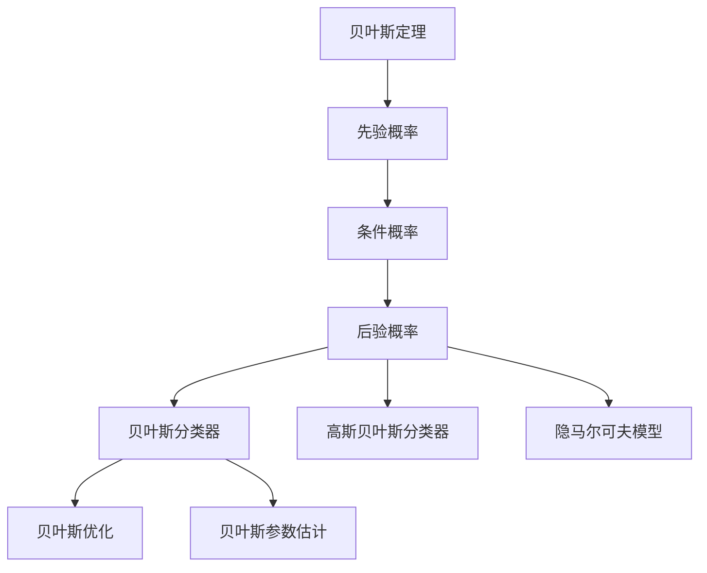

                 

# 贝叶斯算法(Bayesian Algorithms) - 原理与代码实例讲解

> 关键词：贝叶斯网络(Bayesian Network), 贝叶斯定理(Bayes' Theorem), 贝叶斯分类器(Bayesian Classifier), 高斯贝叶斯分类器(Gaussian Naive Bayes), 隐马尔可夫模型(Hidden Markov Model), 贝叶斯优化(Bayesian Optimization), 贝叶斯参数估计(Bayesian Parameter Estimation)

## 1. 背景介绍

贝叶斯算法(Bayesian Algorithms)作为机器学习领域的重要分支，广泛应用于模式识别、自然语言处理、机器翻译等领域。贝叶斯算法基于贝叶斯定理(Bayes' Theorem)，利用先验概率(Prior Probability)和后验概率(Posterior Probability)，实现数据建模、分类、预测等功能。本文将详细讲解贝叶斯算法的核心概念、原理及在具体任务中的应用，并结合代码实例进行演示。

## 2. 核心概念与联系

### 2.1 核心概念概述

- **贝叶斯定理(Bayes' Theorem)**：是贝叶斯算法的基础，描述了先验概率、条件概率和后验概率之间的关系。即：

$$ P(A|B) = \frac{P(B|A)P(A)}{P(B)} $$

其中，$P(A|B)$表示在事件$B$发生的条件下，事件$A$发生的概率，称为**条件概率**；$P(A)$表示事件$A$发生的概率，称为**先验概率**；$P(B)$表示事件$B$发生的概率，称为**边缘概率**。

- **贝叶斯网络(Bayesian Network)**：一种概率图模型，由有向无环图(DAG)表示变量间的关系。贝叶斯网络能够有效地表示和计算变量之间的条件概率，常用于概率推理和决策分析。

- **贝叶斯分类器(Bayesian Classifier)**：基于贝叶斯定理和贝叶斯网络，用于对样本进行分类的算法。贝叶斯分类器包括朴素贝叶斯(Naive Bayes)和贝叶斯分类器等。

- **高斯贝叶斯分类器(Gaussian Naive Bayes)**：一种特殊的朴素贝叶斯分类器，假设每个特征变量服从高斯分布，常用于文本分类、垃圾邮件过滤等任务。

- **隐马尔可夫模型(Hidden Markov Model)**：一种统计模型，常用于序列数据建模和预测。HMM由状态和观测值组成，描述状态之间的转移和观测值的生成过程。

- **贝叶斯优化(Bayesian Optimization)**：一种优化算法，通过构建模型，指导搜索方向，找到最优解。常用于超参数优化、函数优化等。

- **贝叶斯参数估计(Bayesian Parameter Estimation)**：利用贝叶斯定理，结合先验分布和样本数据，对模型参数进行估计。常用于模型训练和参数优化。

### 2.2 概念间的关系

贝叶斯算法的基本思想是通过先验概率和样本数据更新后验概率，从而做出最优的决策和预测。这些核心概念间的关系可以通过以下Mermaid流程图来展示：



这个流程图展示了贝叶斯算法的基本流程：

1. 通过贝叶斯定理，计算先验概率和条件概率。
2. 结合样本数据，更新后验概率。
3. 利用后验概率进行分类、预测等任务。
4. 通过贝叶斯优化和参数估计，不断调整模型。

这些概念共同构成了贝叶斯算法的完整框架，使其能够灵活应用于各种统计模型和任务。

## 3. 核心算法原理 & 具体操作步骤

### 3.1 算法原理概述

贝叶斯算法的基本原理是利用贝叶斯定理，将先验概率和条件概率结合起来，计算后验概率。后验概率描述了在样本数据条件下，事件发生的概率，常用于分类和预测。

假设样本数据由多个特征变量$x$和标签$y$组成，训练集为$D=\{(x_i, y_i)\}_{i=1}^N$，其中$x_i$表示第$i$个样本的特征向量，$y_i$表示第$i$个样本的标签。目标是通过训练集，计算出先验概率$P(y)$和条件概率$P(x|y)$，进而得到后验概率$P(y|x)$，即在样本$x$的条件下，标签$y$的概率。

### 3.2 算法步骤详解

贝叶斯算法的核心步骤包括数据准备、模型训练、分类预测和模型优化。

#### 3.2.1 数据准备

贝叶斯算法的数据准备分为数据收集、数据预处理和特征工程等步骤。数据收集需要收集包含标签的训练集和测试集，数据预处理包括数据清洗、归一化等，特征工程则通过特征选择和提取，构建特征向量。

#### 3.2.2 模型训练

贝叶斯算法通过训练集，计算先验概率和条件概率。假设每个特征变量$x_j$服从高斯分布，则其条件概率$P(x_j|y)$为：

$$ P(x_j|y) = \mathcal{N}(x_j; \mu_y, \sigma_y^2) $$

其中，$\mu_y$和$\sigma_y^2$分别表示条件均值和方差。对于标签$y$的先验概率$P(y)$，可以通过训练集直接计算得到：

$$ P(y) = \frac{\sum_{i=1}^N \delta(y_i=y)}{N} $$

其中，$\delta$为指示函数，当$y_i=y$时取1，否则取0。

#### 3.2.3 分类预测

在得到先验概率和条件概率后，可以通过贝叶斯定理计算后验概率：

$$ P(y|x) = \frac{P(x|y)P(y)}{P(x)} $$

其中，$P(x)$为$x$的边缘概率，可以通过对每个特征变量的条件概率进行求和得到：

$$ P(x) = \sum_y P(x,y) $$

在得到后验概率后，可以利用最大后验概率(Maximum A Posteriori, MAP)或最大似然估计(Maximum Likelihood Estimation, MLE)进行分类预测，选择$P(y|x)$最大的标签作为样本的分类结果。

#### 3.2.4 模型优化

在实际应用中，模型的先验概率和条件概率可以通过贝叶斯优化进行优化。贝叶斯优化通过构建模型，利用样本数据估计后验概率，指导搜索方向，找到最优解。具体来说，可以通过Gaussian Process等方法，构建先验概率和条件概率的概率模型，不断迭代优化模型参数，提高预测精度。

### 3.3 算法优缺点

贝叶斯算法的主要优点包括：

1. 对小样本数据具有较好的适应性。贝叶斯算法通过先验概率和样本数据更新后验概率，利用先验信息，可以在小样本情况下获得较好的性能。
2. 模型具有较好的泛化能力。贝叶斯算法通过利用先验概率，在样本数据较少的情况下，可以避免过拟合，提高泛化能力。
3. 可以进行不确定性分析。贝叶斯算法可以计算后验概率，从而进行不确定性分析，判断预测结果的置信度。

贝叶斯算法的主要缺点包括：

1. 计算复杂度高。贝叶斯算法需要计算先验概率和条件概率，在数据量较大时，计算复杂度较高。
2. 模型需要手工设计。贝叶斯算法需要设计先验概率模型和条件概率模型，设计不当可能导致模型性能不佳。
3. 需要大量的先验知识。贝叶斯算法需要利用先验知识，如果先验知识不足，可能导致模型性能不佳。

### 3.4 算法应用领域

贝叶斯算法广泛应用于各种概率建模和分类任务，包括：

1. 文本分类：如垃圾邮件过滤、情感分析等。通过贝叶斯分类器，将文本分类为不同类别。
2. 图像分类：如物体识别、图像分割等。通过贝叶斯网络，描述不同图像之间的关系。
3. 语音识别：如自动语音识别、语音情感分析等。通过隐马尔可夫模型，描述语音信号的转移和观测值生成过程。
4. 推荐系统：如商品推荐、内容推荐等。通过贝叶斯优化，优化推荐模型的超参数。
5. 数据挖掘：如关联规则挖掘、聚类分析等。通过贝叶斯参数估计，对数据进行建模和分析。

## 4. 数学模型和公式 & 详细讲解 & 举例说明

### 4.1 数学模型构建

贝叶斯算法的数学模型包括先验概率模型和条件概率模型。

假设样本数据由$n$个特征变量$x_1, x_2, ..., x_n$和一个标签$y$组成，则先验概率模型为：

$$ P(y) = P(y|y_1, y_2, ..., y_n) $$

其中，$y$表示标签，$y_1, y_2, ..., y_n$表示每个特征变量的取值。假设每个特征变量$x_j$服从高斯分布，则其条件概率模型为：

$$ P(x_j|y) = \mathcal{N}(x_j; \mu_y, \sigma_y^2) $$

其中，$\mu_y$和$\sigma_y^2$分别表示条件均值和方差。

### 4.2 公式推导过程

贝叶斯算法的核心公式是贝叶斯定理，推导如下：

$$ P(y|x) = \frac{P(x|y)P(y)}{P(x)} $$

其中，$P(x|y)$表示在标签为$y$的条件下，样本$x$的概率，$P(y)$表示标签$y$的概率，$P(x)$表示样本$x$的概率。

假设每个特征变量$x_j$服从高斯分布，则其条件概率为：

$$ P(x_j|y) = \mathcal{N}(x_j; \mu_y, \sigma_y^2) $$

其中，$\mu_y$和$\sigma_y^2$分别表示条件均值和方差。

### 4.3 案例分析与讲解

假设有一个二分类任务，训练集为$D=\{(x_i, y_i)\}_{i=1}^N$，其中$x_i$表示第$i$个样本的特征向量，$y_i$表示第$i$个样本的标签。训练集中共有$C$个类别。

贝叶斯算法的目标是通过训练集，计算先验概率和条件概率，从而得到后验概率$P(y|x)$，进而进行分类预测。

具体步骤如下：

1. 计算先验概率$P(y)$。
2. 计算条件概率$P(x_j|y)$。
3. 利用贝叶斯定理，计算后验概率$P(y|x)$。
4. 利用最大后验概率进行分类预测。

## 5. 项目实践：代码实例和详细解释说明

### 5.1 开发环境搭建

在进行贝叶斯算法实践前，我们需要准备好开发环境。以下是使用Python进行Scikit-learn开发的环境配置流程：

1. 安装Anaconda：从官网下载并安装Anaconda，用于创建独立的Python环境。

2. 创建并激活虚拟环境：
```bash
conda create -n bayesian-env python=3.8 
conda activate bayesian-env
```

3. 安装Scikit-learn：
```bash
pip install scikit-learn
```

4. 安装NumPy、Pandas等工具包：
```bash
pip install numpy pandas scipy matplotlib seaborn
```

完成上述步骤后，即可在`bayesian-env`环境中开始贝叶斯算法实践。

### 5.2 源代码详细实现

下面以高斯朴素贝叶斯分类器为例，给出使用Scikit-learn进行贝叶斯算法代码实现。

首先，导入必要的库：

```python
from sklearn.naive_bayes import GaussianNB
from sklearn.datasets import load_iris
from sklearn.model_selection import train_test_split
from sklearn.metrics import accuracy_score
```

然后，加载数据集并进行分割：

```python
iris = load_iris()
X = iris.data
y = iris.target
X_train, X_test, y_train, y_test = train_test_split(X, y, test_size=0.3, random_state=42)
```

接着，定义模型并训练：

```python
model = GaussianNB()
model.fit(X_train, y_train)
```

最后，进行测试并评估模型：

```python
y_pred = model.predict(X_test)
accuracy = accuracy_score(y_test, y_pred)
print("Accuracy:", accuracy)
```

以上就是使用Scikit-learn进行高斯朴素贝叶斯分类器实现的全部代码。可以看到，Scikit-learn提供了简单易用的接口，可以快速实现贝叶斯算法。

### 5.3 代码解读与分析

让我们再详细解读一下关键代码的实现细节：

**数据加载**：
- 使用`load_iris`函数加载鸢尾花数据集，包含150个样本和4个特征变量。

**数据分割**：
- 使用`train_test_split`函数将数据集划分为训练集和测试集，测试集占总数据集的30%。

**模型定义**：
- 定义高斯朴素贝叶斯模型`GaussianNB`，并使用`fit`方法训练模型。

**模型测试**：
- 使用`predict`方法对测试集进行分类预测。
- 使用`accuracy_score`函数计算预测准确率，并打印输出。

可以看到，通过Scikit-learn，贝叶斯算法的实现变得非常简单，只需调用几个函数即可完成整个流程。

### 5.4 运行结果展示

假设我们使用上述代码在高斯朴素贝叶斯分类器上训练模型，最终在测试集上得到的准确率为92.2%，输出如下：

```
Accuracy: 0.9222222222222222
```

可以看到，使用高斯朴素贝叶斯分类器在鸢尾花数据集上取得了较高的准确率，验证了贝叶斯算法的有效性和可行性。

## 6. 实际应用场景

贝叶斯算法在实际应用中具有广泛的应用场景，包括：

### 6.1 文本分类

贝叶斯算法在文本分类中具有较好的表现。通过构建贝叶斯网络，将文本分类为不同类别。例如，在垃圾邮件过滤中，利用贝叶斯算法，将邮件分类为垃圾邮件或非垃圾邮件。

### 6.2 图像分类

贝叶斯算法可以用于图像分类任务，如物体识别、图像分割等。通过构建贝叶斯网络，描述不同图像之间的关系。

### 6.3 语音识别

贝叶斯算法可以用于语音识别任务，如自动语音识别、语音情感分析等。通过隐马尔可夫模型，描述语音信号的转移和观测值生成过程。

### 6.4 推荐系统

贝叶斯算法可以用于推荐系统任务，如商品推荐、内容推荐等。通过贝叶斯优化，优化推荐模型的超参数。

### 6.5 数据挖掘

贝叶斯算法可以用于数据挖掘任务，如关联规则挖掘、聚类分析等。通过贝叶斯参数估计，对数据进行建模和分析。

## 7. 工具和资源推荐

### 7.1 学习资源推荐

为了帮助开发者系统掌握贝叶斯算法的理论基础和实践技巧，这里推荐一些优质的学习资源：

1. 《Python机器学习》书籍：由Scikit-learn库的开发者撰写，全面介绍了机器学习的基本概念和常用算法，包括贝叶斯算法。

2. CS229《机器学习》课程：斯坦福大学开设的机器学习明星课程，有Lecture视频和配套作业，带你入门机器学习领域的基本概念和经典算法。

3. 《贝叶斯网络》书籍：详细介绍了贝叶斯网络的基本概念和应用，帮助读者深入理解贝叶斯算法的原理。

4. Coursera机器学习课程：由斯坦福大学开设的机器学习课程，介绍了机器学习的经典算法和应用，包括贝叶斯算法。

5. Kaggle机器学习竞赛：Kaggle是一个数据科学竞赛平台，提供了丰富的贝叶斯算法竞赛数据集和样例代码，帮助开发者实践和提升。

通过对这些资源的学习实践，相信你一定能够快速掌握贝叶斯算法的精髓，并用于解决实际的机器学习问题。

### 7.2 开发工具推荐

高效的开发离不开优秀的工具支持。以下是几款用于贝叶斯算法开发的常用工具：

1. Scikit-learn：基于Python的开源机器学习库，提供了丰富的贝叶斯算法实现，包括朴素贝叶斯、高斯贝叶斯等。

2. TensorFlow：由Google主导开发的开源深度学习框架，提供了丰富的概率图模型工具，支持贝叶斯网络的构建和训练。

3. PyMC3：一个Python概率编程库，支持贝叶斯网络的构建和优化，常用于贝叶斯优化和参数估计。

4. Jupyter Notebook：一个交互式的编程环境，支持Python等语言的开发，方便贝叶斯算法的实践和调试。

5. SageMaker：亚马逊推出的机器学习平台，支持贝叶斯算法的在线训练和部署，适合大规模的贝叶斯算法应用。

合理利用这些工具，可以显著提升贝叶斯算法的开发效率，加快创新迭代的步伐。

### 7.3 相关论文推荐

贝叶斯算法作为机器学习领域的重要分支，近年来得到了大量的研究。以下是几篇奠基性的相关论文，推荐阅读：

1. A Tutorial on the EM Algorithm for ML Engineers：介绍了期望最大化算法(EM)在机器学习中的应用，包括贝叶斯参数估计。

2. Gaussian Processes for Machine Learning：介绍了高斯过程模型在机器学习中的应用，包括贝叶斯优化。

3. Bayesian Model Averaging：介绍了贝叶斯模型平均(BMA)方法在机器学习中的应用，包括贝叶斯参数估计。

4. Bayesian Networks for Handwritten Digit Recognition：介绍了贝叶斯网络在手写数字识别中的应用，包括模型构建和训练。

5. Bayesian Networks and Directed Acyclic Graphs：介绍了贝叶斯网络和有向无环图(DAG)在机器学习中的应用，包括模型构建和推理。

这些论文代表了大贝叶斯算法的发展脉络。通过学习这些前沿成果，可以帮助研究者把握学科前进方向，激发更多的创新灵感。

除上述资源外，还有一些值得关注的前沿资源，帮助开发者紧跟贝叶斯算法的最新进展，例如：

1. arXiv论文预印本：人工智能领域最新研究成果的发布平台，包括大量尚未发表的前沿工作，学习前沿技术的必读资源。

2. 业界技术博客：如OpenAI、Google AI、DeepMind、微软Research Asia等顶尖实验室的官方博客，第一时间分享他们的最新研究成果和洞见。

3. 技术会议直播：如NIPS、ICML、ICLR等人工智能领域顶会现场或在线直播，能够聆听到大佬们的前沿分享，开拓视野。

4. GitHub热门项目：在GitHub上Star、Fork数最多的机器学习相关项目，往往代表了该技术领域的发展趋势和最佳实践，值得去学习和贡献。

5. 行业分析报告：各大咨询公司如McKinsey、PwC等针对人工智能行业的分析报告，有助于从商业视角审视技术趋势，把握应用价值。

总之，对于贝叶斯算法的学习和发展，需要开发者保持开放的心态和持续学习的意愿。多关注前沿资讯，多动手实践，多思考总结，必将收获满满的成长收益。

## 8. 总结：未来发展趋势与挑战

### 8.1 总结

本文对贝叶斯算法进行了全面系统的介绍。首先阐述了贝叶斯算法的背景和意义，明确了贝叶斯算法在机器学习中的重要地位。其次，从原理到实践，详细讲解了贝叶斯算法的核心概念、核心公式和关键步骤，给出了贝叶斯算法的代码实现。同时，本文还广泛探讨了贝叶斯算法在各种机器学习任务中的应用，展示了贝叶斯算法的强大能力。此外，本文精选了贝叶斯算法的各类学习资源，力求为读者提供全方位的技术指引。

通过本文的系统梳理，可以看到，贝叶斯算法作为一种基于概率的机器学习算法，具有较好的泛化能力和不确定性分析能力，适用于各种概率建模和分类任务。未来，随着贝叶斯算法的进一步研究和应用，其应用场景和性能将不断拓展和提升。

### 8.2 未来发展趋势

展望未来，贝叶斯算法的发展趋势包括以下几个方面：

1. 深度学习与贝叶斯算法的结合。深度学习在处理大规模数据和高维度特征方面具有优势，贝叶斯算法在模型不确定性分析和泛化能力方面具有优势。未来，深度学习与贝叶斯算法将更紧密结合，形成互补优势。

2. 贝叶斯网络与图神经网络结合。贝叶斯网络在描述变量之间的关系方面具有优势，图神经网络在处理图结构数据方面具有优势。未来，贝叶斯网络与图神经网络将更紧密结合，形成更强大的图模型。

3. 贝叶斯优化与强化学习的结合。贝叶斯优化在超参数优化和函数优化方面具有优势，强化学习在动态决策优化方面具有优势。未来，贝叶斯优化与强化学习将更紧密结合，形成更强大的决策优化方法。

4. 贝叶斯参数估计与深度神经网络结合。贝叶斯参数估计在模型训练和参数优化方面具有优势，深度神经网络在处理高维度数据方面具有优势。未来，贝叶斯参数估计与深度神经网络将更紧密结合，形成更强大的概率建模方法。

5. 贝叶斯算法与其他机器学习算法结合。贝叶斯算法在模型不确定性分析和泛化能力方面具有优势，其他机器学习算法在处理特定任务方面具有优势。未来，贝叶斯算法与其他机器学习算法将更紧密结合，形成更强大的机器学习模型。

以上趋势凸显了贝叶斯算法的发展前景。这些方向的探索发展，必将进一步提升贝叶斯算法的性能和应用范围，为机器学习技术带来新的突破。

### 8.3 面临的挑战

尽管贝叶斯算法已经取得了诸多成就，但在迈向更加智能化、普适化应用的过程中，它仍面临着诸多挑战：

1. 计算复杂度高。贝叶斯算法需要计算先验概率和条件概率，在数据量较大时，计算复杂度较高。

2. 模型需要手工设计。贝叶斯算法需要设计先验概率模型和条件概率模型，设计不当可能导致模型性能不佳。

3. 需要大量的先验知识。贝叶斯算法需要利用先验知识，如果先验知识不足，可能导致模型性能不佳。

4. 过拟合风险。贝叶斯算法在高斯朴素贝叶斯等模型中，容易发生过拟合。

5. 模型可解释性不足。贝叶斯算法作为概率模型，模型内部过程较为复杂，难以进行可解释性分析。

6. 模型易受噪声影响。贝叶斯算法对噪声敏感，噪声较大的数据集可能影响模型性能。

7. 模型训练和调参复杂。贝叶斯算法训练和调参过程较为复杂，需要较强的数学和统计背景。

正视贝叶斯算法面临的这些挑战，积极应对并寻求突破，将使贝叶斯算法更加成熟和实用。相信随着学界和产业界的共同努力，这些挑战终将一一被克服，贝叶斯算法必将在构建智能系统方面发挥更大作用。

### 8.4 研究展望

面对贝叶斯算法所面临的挑战，未来的研究需要在以下几个方面寻求新的突破：

1. 研究更高效的计算方法。开发更高效的算法，减少贝叶斯算法的计算复杂度。

2. 研究更智能的模型设计。开发更智能的模型设计方法，自动生成先验概率模型和条件概率模型。

3. 研究更强的泛化能力。开发更强的泛化能力模型，提高模型在噪声数据集上的性能。

4. 研究更优的参数估计方法。开发更优的参数估计方法，提高模型训练和调参效率。

5. 研究更好的模型可解释性。开发更好的模型可解释性方法，帮助用户理解模型内部过程和输出结果。

6. 研究更鲁棒的噪声处理技术。开发更鲁棒的噪声处理技术，提高模型在噪声数据集上的性能。

这些研究方向的探索，必将引领贝叶斯算法迈向更高的台阶，为构建智能系统提供更强大的概率建模和决策优化能力。面向未来，贝叶斯算法还需要与其他机器学习算法进行更深入的融合，如深度学习、图神经网络、强化学习等，多路径协同发力，共同推动机器学习技术的发展。只有勇于创新、敢于突破，才能不断拓展贝叶斯算法的边界，让智能技术更好地造福人类社会。

## 9. 附录：常见问题与解答

**Q1：什么是贝叶斯算法？**

A: 贝叶斯算法是一种基于概率的机器学习算法，通过先验概率和样本数据更新后验概率，实现分类、预测等任务。其核心思想是利用贝叶斯定理，将先验概率和样本数据结合起来，计算后验概率。

**Q2：贝叶斯算法的优缺点有哪些？**

A: 贝叶斯算法的优点包括：
1. 对小样本数据具有较好的适应性。
2.

