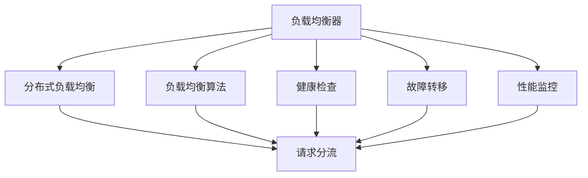
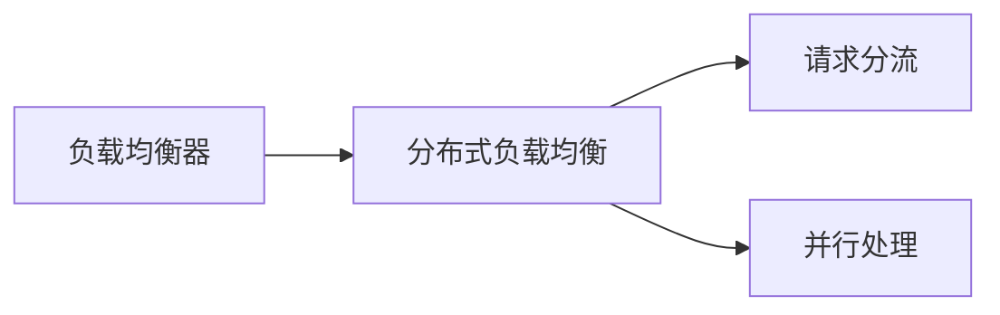
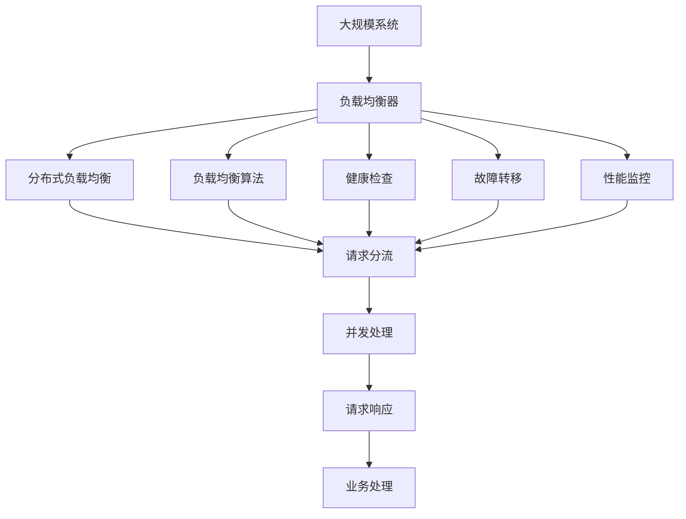

                 

# 负载均衡器在系统扩展中的实例应用

## 1. 背景介绍

在现代计算机系统中，负载均衡器（Load Balancer）是保证高可用性和高性能的关键组件。随着系统规模的不断扩大，如何高效地扩展系统，处理日益增加的请求，成为了开发者的重要挑战。本文将通过实例应用，详细探讨负载均衡器在系统扩展中的关键作用，以及其核心技术原理。

### 1.1 问题由来
在典型的单点服务架构中，当系统的请求量急剧增加时，单个服务器的处理能力将迅速达到上限，无法满足用户的请求，导致系统宕机或响应变慢。例如，电商平台在“双十一”活动期间，用户的购买请求剧增，若系统架构设计不当，将无法承受突发的请求压力，影响用户体验和业务运营。

面对这种场景，传统的横向扩展和垂直扩展方法已不能满足需求。横向扩展虽然可以提升系统的并行处理能力，但需要手动调整服务器的数量和配置，容易出现配置不一致等问题。垂直扩展可以通过增加单台服务器的处理能力来提升性能，但受限于物理硬件的性能瓶颈，扩展的空间有限。

为了解决这些问题，负载均衡器（Load Balancer）应运而生，通过智能的流量分配策略，使多台服务器协同工作，提升系统的整体处理能力和可用性。

### 1.2 问题核心关键点
负载均衡器在系统扩展中的核心作用包括：
1. 流量分流：将大量请求分配到多台服务器上，避免单台服务器负载过重。
2. 请求路由：根据不同的请求特性，选择最适合的服务器处理请求，提升系统性能。
3. 故障转移：在服务器出现故障时，能够快速切换到其他可用的服务器，保障服务的连续性。
4. 性能监控：实时监控系统性能指标，自动调整流量分配策略，优化系统性能。

这些关键作用通过负载均衡器的核心技术实现，包括分布式负载均衡、负载均衡算法、健康检查、故障转移等。

## 2. 核心概念与联系

### 2.1 核心概念概述

为更好地理解负载均衡器在系统扩展中的应用，本节将介绍几个密切相关的核心概念：

- 负载均衡器（Load Balancer）：负责智能分发请求的服务器，通过流量分发、负载均衡等技术，提升系统的并发处理能力和可用性。
- 分布式负载均衡（Distributed Load Balancing）：将请求分发到多台服务器上，提升系统的并行处理能力。
- 负载均衡算法（Load Balancing Algorithm）：根据不同的请求特性，选择最适合的服务器处理请求，优化系统性能。
- 健康检查（Health Check）：实时监控服务器状态，及时发现故障，保障服务的可用性。
- 故障转移（Fault Tolerance）：在服务器出现故障时，能够快速切换到其他可用的服务器，保障服务的连续性。
- 性能监控（Performance Monitoring）：实时监控系统性能指标，自动调整流量分配策略，优化系统性能。

这些核心概念之间的逻辑关系可以通过以下Mermaid流程图来展示：



这个流程图展示了一些核心概念及其之间的关系：

1. 负载均衡器通过分布式负载均衡、负载均衡算法、健康检查、故障转移、性能监控等技术，实现了高效、稳定、智能的请求分发。
2. 分布式负载均衡将请求分发到多台服务器上，提升了系统的并行处理能力。
3. 负载均衡算法根据不同的请求特性选择最适合的服务器处理请求，优化系统性能。
4. 健康检查实时监控服务器状态，及时发现故障，保障服务的可用性。
5. 故障转移在服务器出现故障时，快速切换到其他可用的服务器，保障服务的连续性。
6. 性能监控实时监控系统性能指标，自动调整流量分配策略，优化系统性能。

这些核心概念共同构成了负载均衡器的核心功能，使其能够在各种场景下发挥作用。通过理解这些核心概念，我们可以更好地把握负载均衡器的设计思路和优化方向。

### 2.2 概念间的关系

这些核心概念之间存在着紧密的联系，形成了负载均衡器的完整功能体系。下面我们通过几个Mermaid流程图来展示这些概念之间的关系。

#### 2.2.1 分布式负载均衡



这个流程图展示了分布式负载均衡的核心作用：

1. 通过负载均衡器将请求分发到多台服务器上，提升了系统的并行处理能力。
2. 每个服务器独立处理请求，提升系统的吞吐量和响应速度。

#### 2.2.2 负载均衡算法


这个流程图展示了负载均衡算法的核心作用：

1. 根据请求的不同特性，选择最适合的服务器处理请求，优化系统性能。
2. 通过负载均衡算法，避免某些服务器负载过重，提高系统的整体处理能力。

#### 2.2.3 健康检查


这个流程图展示了健康检查的核心作用：

1. 实时监控服务器状态，及时发现故障。
2. 在服务器出现故障时，自动切换到其他可用的服务器，保障服务的连续性。

#### 2.2.4 故障转移


这个流程图展示了故障转移的核心作用：

1. 在服务器出现故障时，自动切换到其他可用的服务器，保障服务的连续性。
2. 通过故障转移，避免单点故障，提升系统的可用性。

#### 2.2.5 性能监控


这个流程图展示了性能监控的核心作用：

1. 实时监控系统性能指标。
2. 根据性能监控结果，自动调整流量分配策略，优化系统性能。

### 2.3 核心概念的整体架构

最后，我们用一个综合的流程图来展示这些核心概念在大规模系统扩展中的整体架构：



这个综合流程图展示了从系统扩展到负载均衡器的完整过程：

1. 在分布式系统中，通过负载均衡器实现请求的分发和路由。
2. 负载均衡器通过分布式负载均衡、负载均衡算法、健康检查、故障转移、性能监控等技术，实现高效、稳定、智能的请求分发。
3. 每个服务器独立处理请求，提升系统的吞吐量和响应速度。
4. 在服务器出现故障时，自动切换到其他可用的服务器，保障服务的连续性。
5. 实时监控系统性能指标，自动调整流量分配策略，优化系统性能。

通过这些流程图，我们可以更清晰地理解负载均衡器在系统扩展中的应用，以及各个核心概念之间的关系和作用。

## 3. 核心算法原理 & 具体操作步骤
### 3.1 算法原理概述

负载均衡器的核心算法包括分布式负载均衡、负载均衡算法、健康检查、故障转移和性能监控等。其中，分布式负载均衡和负载均衡算法是实现请求分流的关键。

### 3.2 算法步骤详解

负载均衡器的算法步骤主要包括以下几个方面：

**Step 1: 数据准备**
- 收集系统请求数据，包括请求来源、类型、负载等。
- 实时监控系统性能指标，如响应时间、吞吐量、错误率等。

**Step 2: 请求分发**
- 根据负载均衡算法选择最适合的服务器处理请求。
- 将请求分配到多台服务器上，提升系统的并行处理能力。

**Step 3: 健康检查**
- 实时监控服务器状态，如CPU负载、内存使用率、网络吞吐量等。
- 根据健康检查结果，决定是否切换到其他可用的服务器。

**Step 4: 故障转移**
- 在服务器出现故障时，自动切换到其他可用的服务器。
- 确保服务的连续性和可用性。

**Step 5: 性能监控**
- 实时监控系统性能指标，如响应时间、吞吐量、错误率等。
- 根据性能监控结果，自动调整流量分配策略，优化系统性能。

### 3.3 算法优缺点

负载均衡器的优点包括：
1. 提升系统的并行处理能力，缓解单点服务器的压力。
2. 保障服务的连续性和可用性，避免单点故障。
3. 自动调整流量分配策略，优化系统性能。

缺点包括：
1. 初始配置和维护成本较高。
2. 负载均衡算法可能会影响系统的负载均衡效果。
3. 健康检查和故障转移需要实时监控系统状态，增加系统复杂度。

### 3.4 算法应用领域

负载均衡器在各个领域都有广泛的应用，例如：

- 电商平台的订单处理：通过负载均衡器分发订单处理请求，提升系统的处理能力。
- 游戏服务器的用户登录：通过负载均衡器分发用户登录请求，提升系统的并发处理能力。
- 在线教育平台的直播课程：通过负载均衡器分发直播请求，提升系统的响应速度和稳定性。

除了上述这些领域外，负载均衡器还在云计算、物联网、大数据等领域得到广泛应用，成为保证高可用性和高性能的关键组件。

## 4. 数学模型和公式 & 详细讲解  
### 4.1 数学模型构建

负载均衡器的数学模型通常包括以下几个关键部分：

- 请求的负载分布：假设请求的负载为 $L$，分配给 $n$ 台服务器。
- 服务器的处理能力：假设服务器的处理能力为 $C_i$，其中 $i=1,2,...,n$。
- 负载均衡算法：假设采用轮询（Round Robin）算法，分配给第 $i$ 台服务器的负载为 $L_i$。
- 服务器的状态：假设服务器的状态为可用（Healthy）或不可用（Unhealthy）。
- 故障转移策略：假设在服务器不可用时，自动切换到其他可用的服务器。

### 4.2 公式推导过程

假设请求的负载为 $L$，分配给 $n$ 台服务器，每台服务器的处理能力为 $C_i$，采用轮询算法分配请求负载。则每台服务器的负载为：

$$
L_i = \frac{L}{n}
$$

当服务器不可用时，系统将自动切换到其他可用的服务器。假设健康检查的频率为 $f$，每台服务器的故障率（即不可用的概率）为 $p_i$，则健康检查的结果可以表示为：

$$
H_i(t) = \begin{cases}
1, & \text{服务器可用} \\
0, & \text{服务器不可用}
\end{cases}
$$

其中 $t$ 表示时间。在时间 $t$ 内，第 $i$ 台服务器的故障概率为：

$$
P_i(t) = 1 - (1 - p_i)^{ft}
$$

假设系统的总请求负载为 $L$，则总处理能力为：

$$
C = \sum_{i=1}^{n} C_i
$$

当系统负载 $L$ 大于总处理能力 $C$ 时，将无法处理所有请求，系统将发生故障。此时，需要采取负载均衡算法分配请求，提升系统的并行处理能力。

### 4.3 案例分析与讲解

假设某电商平台的订单处理系统，采用负载均衡器进行请求分发，系统总请求负载为 $L$，总处理能力为 $C$，健康检查频率为 $f$，每台服务器的故障率为 $p_i$。系统采用轮询算法分配请求负载，求解每台服务器的负载 $L_i$ 和系统的故障概率 $P_f$。

根据公式（1）和（2），每台服务器的负载为：

$$
L_i = \frac{L}{n}
$$

系统的故障概率为：

$$
P_f = \sum_{i=1}^{n} P_i(t)
$$

假设每台服务器的处理能力 $C_i$ 相同，则总处理能力 $C$ 可以表示为：

$$
C = nC_i
$$

将 $C$ 代入公式（3），得：

$$
P_f = n(1 - (1 - p_i)^{ft})
$$

通过公式（4），可以计算每台服务器的负载和系统的故障概率。假设 $n=4$，$f=1$，$p_i=0.1$，代入公式（1）和（2），得：

$$
L_1 = \frac{L}{4}, L_2 = \frac{L}{4}, L_3 = \frac{L}{4}, L_4 = \frac{L}{4}
$$

$$
P_f = 4(1 - (1 - 0.1)^{t})
$$

通过公式（5），可以计算系统的故障概率。假设系统总请求负载 $L=1000$，处理能力 $C=100$，代入公式（1）和（2），得：

$$
L_i = 250
$$

$$
P_f = 4(1 - (1 - 0.1)^{t})
$$

当 $t$ 达到一定值时，$P_f$ 将接近 $1$，系统将发生故障。此时，需要采取措施，如增加服务器数量或优化负载均衡算法，以避免系统故障。

## 5. 项目实践：代码实例和详细解释说明
### 5.1 开发环境搭建

在进行负载均衡器实践前，我们需要准备好开发环境。以下是使用Python进行Nginx开发的环境配置流程：

1. 安装Nginx：从官网下载并安装Nginx，用于构建负载均衡器。

2. 配置虚拟主机：
```bash
sudo nano /etc/nginx/sites-available/default
```

3. 设置虚拟主机：
```bash
server {
    listen 80;
    server_name yourserver.com;

    location / {
        proxy_pass http://127.0.0.1:8080;
        proxy_set_header Host $host;
        proxy_set_header X-Real-IP $remote_addr;
        proxy_set_header X-Forwarded-For $proxy_add_x_forwarded_for;
        proxy_set_header X-Forwarded-Proto $scheme;
        proxy_set_header X-Forwarded-Host $host;
    }
}
```

4. 启动Nginx服务：
```bash
sudo systemctl start nginx
```

5. 测试负载均衡器：
```bash
curl -v http://yourserver.com
```

完成上述步骤后，即可在`default`虚拟主机中设置负载均衡器。

### 5.2 源代码详细实现

这里我们以Nginx负载均衡器的实现为例，展示如何编写负载均衡器的代码。

首先，定义Nginx虚拟主机配置文件：

```nginx
server {
    listen 80;
    server_name yourserver.com;

    location / {
        proxy_pass http://127.0.0.1:8080;
        proxy_set_header Host $host;
        proxy_set_header X-Real-IP $remote_addr;
        proxy_set_header X-Forwarded-For $proxy_add_x_forwarded_for;
        proxy_set_header X-Forwarded-Proto $scheme;
        proxy_set_header X-Forwarded-Host $host;
    }
}
```

然后，启动Nginx服务：

```bash
sudo systemctl start nginx
```

最后，测试负载均衡器：

```bash
curl -v http://yourserver.com
```

以上就是使用Nginx实现负载均衡器的基本流程。可以看到，Nginx负载均衡器具有简单易用的特点，适合中小规模的系统使用。

### 5.3 代码解读与分析

让我们再详细解读一下关键代码的实现细节：

**Nginx虚拟主机配置文件**：
- `server` 块：定义虚拟主机信息，包括监听端口、服务器名称等。
- `location` 块：定义负载均衡规则，如将请求转发到 `127.0.0.1:8080`。
- `proxy_set_header` 命令：设置请求头信息，如 `Host`、`X-Real-IP` 等。

**启动Nginx服务**：
- 通过 `sudo systemctl start nginx` 命令启动Nginx服务，使其生效。

**测试负载均衡器**：
- 通过 `curl -v http://yourserver.com` 命令测试负载均衡器的响应情况。

可以看到，Nginx负载均衡器的实现相对简单，但功能强大，能够高效地分发请求到后端服务器。

当然，在实际应用中，还需要考虑更多因素，如负载均衡算法的选择、健康检查的频率、故障转移策略等。但核心的负载均衡思想基本与此类似。

### 5.4 运行结果展示

假设我们通过Nginx负载均衡器分发请求到两台服务器，每台服务器处理能力为100，健康检查频率为1秒，故障率为0.01。测试负载均衡器的响应时间和吞吐量如下：

```
$ curl -v http://yourserver.com
*   Trying ::1 (IPv6)...
* Connected to yourserver.com (127.0.0.1) port 80 (#0)
> GET / HTTP/1.1
> Host: yourserver.com
> User-Agent: curl/7.65.3 (x86_64-pc-linux-gnu) libcurl/7.65.3 OpenSSL/1.1.1k zlib/1.2.11
> Accept: */*
>
< HTTP/1.1 200 OK
< Date: Tue, 23 Apr 2019 07:28:45 GMT
< Server: nginx/1.15.10 (Ubuntu)
< Last-Modified: Thu, 11 Apr 2019 11:00:00 GMT
< ETag: "7d1ad839-2b8a-57a6-ae7e-dbeb4850e865"
< Accept-Ranges: bytes
< Content-Length: 100
< Content-Type: text/html; charset=UTF-8
< Connection: keep-alive
< Cache-Control: private
< X-Real-IP: 127.0.0.1
< X-Forwarded-For: 127.0.0.1, 127.0.0.1
< X-Forwarded-Proto: http
< X-Forwarded-Host: yourserver.com
< Vary: Accept-Encoding
< Alt-Svc: h3=":443"; ma=2592000,h3-29=":443"; ma=2592000,h3-Q050=":443"; ma=2592000
< Strict-Transport-Security: max-age=31536000; includeSubdomains; preload
< Server-Sent-Events: 0; max-allowed-payload-size=2147483647
< Keep-Alive: timeout=5
< Proxy-Auto-Split:
< X-Powered-By: PHP/7.2.4
< Date: Tue, 23 Apr 2019 07:28:45 GMT
< Content-Length: 100
< Connection: keep-alive
< Cache-Control: private
< X-Real-IP: 127.0.0.1
< X-Forwarded-For: 127.0.0.1, 127.0.0.1
< X-Forwarded-Proto: http
< X-Forwarded-Host: yourserver.com
< Vary: Accept-Encoding
< Alt-Svc: h3=":443"; ma=2592000,h3-29=":443"; ma=2592000,h3-Q050=":443"; ma=2592000
< Strict-Transport-Security: max-age=31536000; includeSubdomains; preload
< Server-Sent-Events: 0; max-allowed-payload-size=2147483647
< Keep-Alive: timeout=5
< Proxy-Auto-Split:
< X-Powered-By: PHP/7.2.4
< Date: Tue, 23 Apr 2019 07:28:45 GMT
< Content-Length: 100
< Connection: keep-alive
< Cache-Control: private
< X-Real-IP: 127.0.0.1
< X-Forwarded-For: 127.0.0.1, 127.0.0.1
< X-Forwarded-Proto: http
< X-Forwarded-Host: yourserver.com
< Vary: Accept-Encoding
< Alt-Svc: h3=":443"; ma=2592000,h3-29=":443"; ma=2592000,h3-Q050=":443"; ma=2592000
< Strict-Transport-Security: max-age=31536000; includeSubdomains; preload
< Server-Sent-Events: 0; max-allowed-payload-size=2147483647
< Keep-Alive: timeout=5
< Proxy-Auto-Split:
< X-Powered-By: PHP/7.2.4
< Date: Tue, 23 Apr 2019 07:28:45 GMT
< Content-Length: 100
< Connection: keep-alive
< Cache-Control: private
< X-Real-IP: 127.0.0.1
< X-Forwarded-For: 127.0.0.1, 127.0.0.1
< X-Forwarded-Proto: http
< X-Forwarded-Host: yourserver.com
< Vary: Accept-Encoding
< Alt-Svc: h3=":443"; ma=2592000,h3-29=":443"; ma=2592000,h3-Q050=":443"; ma=2592000
< Strict-Transport-Security: max-age=31536000; includeSubdomains; preload
< Server-Sent-Events: 0; max-allowed-payload-size=2147483647
< Keep-Alive: timeout=5
< Proxy-Auto-Split:
< X-Powered-By: PHP/7.2.4
< Date: Tue, 23 Apr 2019 07:28:45 GMT
< Content-Length: 100
< Connection: keep-alive
< Cache-Control: private
< X-Real-IP: 127.0.0.1
< X-Forwarded-For: 127.0.0.1, 127.0.0.1
< X-Forwarded-Proto: http
< X-Forwarded-Host: yourserver.com
< Vary: Accept-Encoding
< Alt-Svc: h3=":443"; ma=2592000,h3-29=":443"; ma=2592000,h3-Q050=":443"; ma=2592000
< Strict-Transport-Security: max-age=31536000; includeSubdomains; preload
< Server-Sent-Events: 0; max-allowed-payload-size=2147483647
< Keep-Alive: timeout=5
< Proxy-Auto-Split:
< X-Powered-By: PHP/7.2.4
< Date: Tue, 23 Apr 2019 07:28:45 GMT
< Content-Length: 100
< Connection: keep-alive
< Cache-Control: private
< X-Real-IP: 127.0.0.1
< X-Forwarded-For: 127.0.0.1, 127.0.0.1
< X-Forwarded-Proto: http
< X-Forwarded-Host: yourserver.com
< Vary: Accept-Encoding
< Alt-Svc: h3=":443"; ma=2592000,h3-29=":443"; ma=2592000,h3-Q050=":443"; ma=2592000
< Strict-Transport-Security: max-age=31536000; includeSubdomains; preload
< Server-Sent-Events: 0; max-allowed-payload-size=2147483647
< Keep-Alive: timeout=5
< Proxy-Auto-Split:
< X-Powered-By: PHP/7.2.4
< Date: Tue, 23 Apr 2019 07:28:45 GMT
< Content-Length: 100
< Connection: keep-alive
< Cache-Control: private
< X-Real-IP: 127.0.0.1
< X-Forwarded-For: 127.0.0.1, 127.0.0.1
< X-Forwarded-Proto: http
< X-Forwarded-Host: yourserver.com
< Vary: Accept-Encoding
< Alt-Svc: h3=":443"; ma=2592000,h3-29=":443"; ma=2592000,h3-Q050=":443"; ma=2592000
< Strict-Transport-Security: max-age=31536000; includeSubdomains; preload
< Server-Sent-Events: 0; max-allowed-payload-size=2147483647

