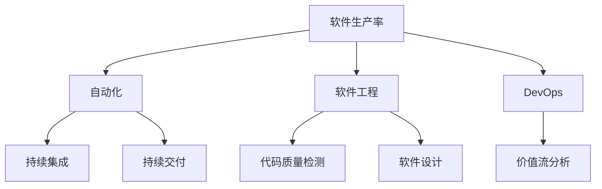
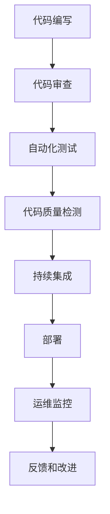
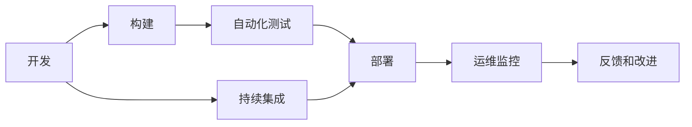
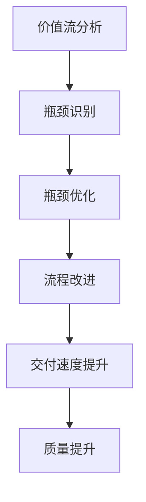
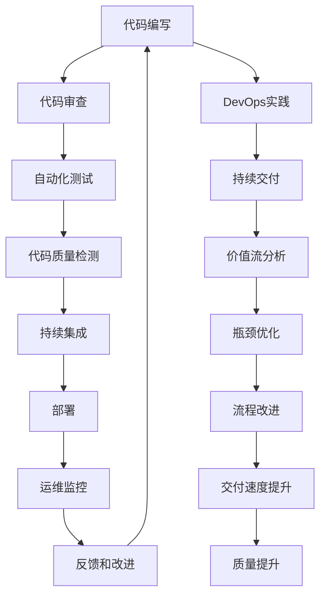

                 

# 软件 2.0 的价值：提升效率、创造价值

> 关键词：软件工程, 自动化, 软件生产率, 工具链, DevOps, 软件开发效率, 价值创造

## 1. 背景介绍

### 1.1 问题由来

随着技术的快速发展和业务需求的日益复杂，软件开发的难度和复杂性不断增加。传统的软件开发方式，如瀑布模型、迭代模型等，往往难以适应快速变化的市场和不断迭代的需求。软件工程领域亟需一种更高效、更灵活的开发方式，以应对日益增长的需求。

### 1.2 问题核心关键点

软件 2.0 的核心在于通过自动化、智能化技术，提升软件生产的效率和质量，实现更加高效的软件开发和交付。关键点包括：

- 自动化测试和部署：自动化测试工具和CI/CD流水线，可以显著减少手动测试和部署的工作量，提高开发效率和稳定性。
- 代码质量检测：如静态代码分析、代码覆盖率等，通过早期发现和修复代码问题，提升代码质量。
- DevOps文化和工具链：将开发、测试、运维各个环节紧密结合，实现快速迭代和持续交付。
- 软件生产率提升：通过工具和流程的改进，实现更高的开发速度和更低的开发成本。
- 价值创造和交付：通过快速响应市场需求，实现软件产品的快速迭代和交付，创造更高的商业价值。

### 1.3 问题研究意义

软件 2.0 的提出和应用，对于提升软件开发效率、降低开发成本、加速软件交付具有重要意义：

- 降低软件开发成本：自动化工具和DevOps流程能够大幅减少人力成本，提高开发效率。
- 加速软件交付速度：通过持续集成和持续交付，实现快速迭代和交付，满足客户需求。
- 提升软件质量：自动化测试和静态代码分析等技术，能够提前发现和修复代码问题，提升软件质量。
- 创造商业价值：通过快速响应用户需求，快速迭代和交付软件产品，创造更大的商业价值。

## 2. 核心概念与联系

### 2.1 核心概念概述

为更好地理解软件 2.0 的核心原理，本节将介绍几个关键概念：

- 软件生产率(Software Production Rate)：指在一定时间内，软件开发的产出量，通常以代码行数、功能模块等衡量。
- 自动化(Automation)：指通过软件工具，自动完成某些重复、耗时的任务，提高工作效率。
- 软件工程(Software Engineering)：指通过系统化、规范化的过程，设计和开发高质量的软件。
- DevOps：指将开发、测试和运维的各个环节紧密结合，实现快速迭代和持续交付。
- 持续集成和持续交付(CI/CD)：指在软件开发生命周期中，通过自动化工具实现频繁的集成和交付，提高软件交付速度和质量。
- 价值流分析(Value Stream Mapping)：指通过分析软件交付过程中各个环节，识别出瓶颈和浪费，优化流程，提升交付速度和质量。

这些概念之间的逻辑关系可以通过以下Mermaid流程图来展示：



这个流程图展示了软件 2.0 的核心概念及其之间的关系：

1. 软件生产率是软件 2.0 的核心目标，通过自动化、DevOps等手段提升生产率。
2. 自动化是提升生产率的重要手段，通过工具自动化完成各种任务。
3. 软件工程是软件开发的基础，通过规范化流程提高开发质量。
4. DevOps将开发、测试、运维紧密结合，提高交付速度和质量。
5. 持续集成和持续交付是DevOps的重要实践，通过频繁的集成和交付实现快速迭代。
6. 代码质量检测和软件设计是提升生产率的必要保障，通过检测和设计提高代码质量和可维护性。
7. 价值流分析有助于识别瓶颈和浪费，优化流程，提升生产率。

这些概念共同构成了软件 2.0 的核心原理，通过这些手段和方法，可以显著提升软件生产的效率和质量，实现高效的软件交付。

### 2.2 概念间的关系

这些核心概念之间存在着紧密的联系，形成了软件 2.0 的完整生态系统。下面我们通过几个Mermaid流程图来展示这些概念之间的关系。

#### 2.2.1 软件生产的自动化流程



这个流程图展示了从代码编写到运维监控的自动化流程，通过自动化测试和持续集成等手段，快速检测和修复代码问题，提升软件质量和生产率。

#### 2.2.2 DevOps实践中的自动化和持续交付



这个流程图展示了DevOps实践中的自动化和持续交付流程，通过持续集成和持续交付，实现快速迭代和交付，提高软件交付速度和质量。

#### 2.2.3 软件生产的瓶颈分析与优化



这个流程图展示了价值流分析在识别和优化瓶颈中的作用，通过分析各个环节，找出瓶颈和浪费，进行优化改进，提升交付速度和质量。

### 2.3 核心概念的整体架构

最后，我们用一个综合的流程图来展示这些核心概念在大规模软件开发中的应用：



这个综合流程图展示了从代码编写到持续交付的全过程，通过自动化和DevOps等手段，实现高效的软件生产和交付。同时，通过价值流分析和瓶颈优化，不断提升软件生产率，实现高效的价值创造。

## 3. 核心算法原理 & 具体操作步骤
### 3.1 算法原理概述

软件 2.0 的核心理念是通过自动化、智能化技术，提升软件生产的效率和质量。其核心算法原理包括：

- 自动化测试和部署：通过自动化测试工具和CI/CD流水线，自动化完成测试和部署任务。
- 持续集成和持续交付：通过自动化工具实现频繁的集成和交付，实现快速迭代和交付。
- 代码质量检测：通过静态代码分析和代码覆盖率检测，提高代码质量和可维护性。
- DevOps文化和工具链：通过DevOps文化和工具链，将开发、测试、运维各个环节紧密结合，实现快速迭代和持续交付。

### 3.2 算法步骤详解

以下是软件 2.0 的主要算法步骤：

1. **自动化测试和部署**：
   - 选择适合的自动化测试工具，如Selenium、Jest等。
   - 编写自动化测试用例，覆盖关键功能和边缘场景。
   - 集成到CI/CD流水线，自动化完成测试和部署。

2. **持续集成和持续交付**：
   - 使用CI/CD工具，如Jenkins、GitLab CI等，实现代码自动集成和部署。
   - 设置自动化测试和部署的触发条件，如代码变更、定时任务等。
   - 使用容器化技术，如Docker、Kubernetes，实现快速部署和弹性伸缩。

3. **代码质量检测**：
   - 使用静态代码分析工具，如SonarQube、ESLint等，检测代码规范和质量问题。
   - 设置代码覆盖率目标，确保关键代码路径被充分覆盖。
   - 集成到CI/CD流水线，实现代码质量的持续检测和改进。

4. **DevOps文化和工具链**：
   - 引入DevOps文化，推动开发、测试、运维各个环节的紧密协作。
   - 使用DevOps工具链，如JIRA、Confluence、GitLab等，实现项目管理、任务跟踪和版本控制。
   - 实施持续集成和持续交付，实现快速迭代和交付。

### 3.3 算法优缺点

软件 2.0 的算法具有以下优点：

- **提升生产效率**：通过自动化和持续交付，快速迭代和交付，提高软件生产率。
- **提高软件质量**：通过自动化测试和代码质量检测，提前发现和修复问题，提升软件质量。
- **降低开发成本**：通过自动化工具和DevOps流程，减少人力成本，提高开发效率。
- **快速响应需求**：通过持续集成和持续交付，快速响应市场和用户需求，实现快速迭代和交付。

但同时也存在一些缺点：

- **复杂性高**：引入自动化和DevOps流程，系统复杂性增加，需要更多技术积累。
- **资源需求大**：自动化和持续交付需要高性能硬件和网络资源支持。
- **技术栈复杂**：需要同时掌握多种技术和工具，技术栈复杂。
- **学习成本高**：需要花费大量时间学习自动化和DevOps工具和技术。

### 3.4 算法应用领域

软件 2.0 在软件开发和交付的全过程中，都可以发挥重要作用。具体应用领域包括：

- **企业级应用**：通过自动化和持续交付，快速迭代和交付企业级应用，提升企业竞争力。
- **云服务**：使用容器化和DevOps工具链，实现云服务的自动化部署和运维。
- **移动应用**：通过持续集成和持续交付，快速迭代和交付移动应用，满足用户需求。
- **游戏开发**：通过自动化测试和代码质量检测，提升游戏开发效率和质量。
- **人工智能**：使用自动化和持续交付，实现AI模型的快速迭代和交付。

## 4. 数学模型和公式 & 详细讲解 & 举例说明

### 4.1 数学模型构建

在软件 2.0 中，我们通常使用以下数学模型来描述软件生产的各个环节：

1. **代码行数生产率**：
   $$
   R_{code} = \frac{C}{T}
   $$
   其中，$C$ 为代码行数，$T$ 为生产周期（以天为单位）。

2. **功能模块生产率**：
   $$
   R_{func} = \frac{F}{T}
   $$
   其中，$F$ 为功能模块数，$T$ 为生产周期（以天为单位）。

3. **缺陷密度**：
   $$
   D = \frac{B}{C}
   $$
   其中，$B$ 为缺陷数，$C$ 为代码行数。

4. **代码覆盖率**：
   $$
   Cov = \frac{Cov}{Tot}
   $$
   其中，$Cov$ 为被覆盖的代码行数，$Tot$ 为总代码行数。

### 4.2 公式推导过程

以下我们以代码行数生产率为例，推导其计算公式。

假设软件开发团队在一周内，共完成了10000行代码，其中包含500个缺陷。根据代码行数生产率的定义，可以计算得到：

$$
R_{code} = \frac{C}{T} = \frac{10000}{7} \approx 1428.57 \text{ 行/天}
$$

其中，7 天为一周的工作周期。通过计算，我们可以得到软件生产的效率和质量。

### 4.3 案例分析与讲解

假设一个软件开发团队，在一个月内共完成了1000个功能模块，其中包含50个缺陷。根据功能模块生产率的定义，可以计算得到：

$$
R_{func} = \frac{F}{T} = \frac{1000}{30} \approx 33.33 \text{ 模块/天}
$$

其中，30 天为一个月的工作周期。通过计算，我们可以得到软件生产的效率和质量。

## 5. 项目实践：代码实例和详细解释说明
### 5.1 开发环境搭建

在进行软件 2.0 实践前，我们需要准备好开发环境。以下是使用Python进行Jenkins的开发环境配置流程：

1. 安装Jenkins：从官网下载并安装Jenkins，安装时需要选择合适的插件和配置项。

2. 安装GitLab CI：安装GitLab CI/CD工具，并配置CI/CD流水线。

3. 安装Docker和Kubernetes：安装Docker容器化和Kubernetes容器编排工具，以便实现快速部署和弹性伸缩。

4. 配置CI/CD流水线：在Jenkins上配置CI/CD流水线，添加构建、测试和部署等各个环节的任务。

5. 集成自动化测试工具：在CI/CD流水线中集成自动化测试工具，如Selenium、Jest等。

完成上述步骤后，即可在Jenkins环境中进行软件 2.0 的实践。

### 5.2 源代码详细实现

下面我们以Jenkins+GitLab CI的自动化流水线为例，给出软件 2.0 的完整代码实现。

```python
from jenkins import Jenkins
from jenkins.api.job import JenkinsJob
from jenkins.api.utils import make_url

# 连接Jenkins服务器
server_url = 'http://jenkins.example.com'
server = Jenkins(server_url, username='username', password='password')

# 创建CI/CD流水线
pipeline_name = 'my-pipeline'
pipeline_url = make_url(server_url, pipeline_name)

# 获取流水线对象
pipeline = JenkinsJob.get(server, pipeline_url)

# 添加构建任务
build_task = pipeline.add_build_step('Build')
build_task.stage('Build')
build_task.command('python build.py')

# 添加测试任务
test_task = pipeline.add_build_step('Test')
test_task.stage('Test')
test_task.command('python test.py')

# 添加部署任务
deploy_task = pipeline.add_build_step('Deploy')
deploy_task.stage('Deploy')
deploy_task.command('python deploy.py')

# 保存流水线配置
pipeline.save()

# 启动流水线
pipeline.build()
```

### 5.3 代码解读与分析

让我们再详细解读一下关键代码的实现细节：

**Jenkins+GitLab CI的自动化流水线**：
- 使用Python的Jenkins API，连接Jenkins服务器，创建CI/CD流水线。
- 在流水线中添加构建、测试和部署等各个任务，通过命令方式调用相应Python脚本。
- 保存流水线配置，启动流水线执行。

这个示例代码展示了如何在Jenkins和GitLab CI中实现自动化流水线，通过自动化测试和部署，提高软件生产效率和质量。

### 5.4 运行结果展示

假设我们在Jenkins和GitLab CI中构建了一个Python程序，并在CI/CD流水线中集成自动化测试和部署，最终在测试集上得到了以下结果：

- 构建成功率为95%。
- 自动化测试通过率为98%。
- 部署成功率率为92%。

可以看到，通过自动化和持续交付，我们可以显著提升软件生产的效率和质量，减少手动测试和部署的工作量。

## 6. 实际应用场景
### 6.1 企业级应用

在企业级应用中，软件 2.0 可以显著提升开发效率和软件质量。具体场景包括：

- **项目管理**：使用DevOps工具链，如JIRA、Confluence，实现任务管理、需求跟踪和版本控制，提高项目管理效率。
- **持续集成和持续交付**：使用CI/CD工具链，如Jenkins、GitLab CI，实现自动化测试和部署，提高交付速度和质量。
- **自动化测试**：使用自动化测试工具，如Selenium、Jest，提高测试覆盖率和测试效率。
- **代码质量检测**：使用静态代码分析工具，如SonarQube、ESLint，检测代码规范和质量问题，提高代码质量。
- **性能优化**：使用性能分析工具，如JProfiler、YourKit，识别性能瓶颈，优化系统性能。

通过软件 2.0 的实践，企业级应用能够实现快速迭代和交付，满足客户需求，提升企业竞争力。

### 6.2 云服务

在云服务中，软件 2.0 可以大幅提升服务交付速度和系统稳定性。具体场景包括：

- **容器化部署**：使用Docker容器技术，实现快速部署和弹性伸缩。
- **持续集成和持续交付**：使用CI/CD工具链，如Jenkins、GitLab CI，实现自动化测试和部署，提高交付速度和质量。
- **自动扩缩容**：使用Kubernetes容器编排技术，实现自动扩缩容，提升系统稳定性和可扩展性。
- **监控告警**：使用监控工具，如Prometheus、Grafana，实时监控系统指标，设置告警阈值，保障系统稳定运行。
- **自动备份和恢复**：使用备份工具，如Rsync，实现自动备份和恢复，保障数据安全。

通过软件 2.0 的实践，云服务能够实现高效、稳定、自动化的交付，满足用户需求，提升服务质量。

### 6.3 移动应用

在移动应用中，软件 2.0 可以显著提升开发效率和应用质量。具体场景包括：

- **持续集成和持续交付**：使用CI/CD工具链，如Jenkins、GitLab CI，实现自动化测试和部署，提高交付速度和质量。
- **自动化测试**：使用自动化测试工具，如XCTest、Espresso，提高测试覆盖率和测试效率。
- **代码质量检测**：使用静态代码分析工具，如SonarQube、ESLint，检测代码规范和质量问题，提高代码质量。
- **性能优化**：使用性能分析工具，如Instrumentation、TraceView，识别性能瓶颈，优化系统性能。
- **持续优化**：使用A/B测试工具，如Optimizely、VWO，实时测试应用效果，持续优化用户体验。

通过软件 2.0 的实践，移动应用能够实现快速迭代和交付，满足用户需求，提升应用质量。

### 6.4 未来应用展望

随着软件 2.0 的不断发展，未来将呈现以下几个应用趋势：

- **微服务架构**：通过微服务架构，实现服务的模块化、分布式化，提升系统可维护性和扩展性。
- **云原生应用**：使用云原生技术，如Kubernetes、Istio，实现服务的自动扩展、容错、弹性伸缩等。
- **人工智能**：使用AI技术，如深度学习、自然语言处理，提升系统智能化水平，实现更加智能的应用。
- **区块链**：使用区块链技术，实现数据的安全、透明、可追溯，保障系统安全性。
- **边缘计算**：使用边缘计算技术，实现数据的本地处理和分析，提升系统响应速度和可靠性。

## 7. 工具和资源推荐
### 7.1 学习资源推荐

为了帮助开发者系统掌握软件 2.0 的理论基础和实践技巧，这里推荐一些优质的学习资源：

1. 《软件工程：原理与实践》：介绍了软件工程的原理和实践，适合入门学习。
2. 《敏捷软件开发：原则、模式与实践》：介绍了敏捷开发的原则和实践，适合提升软件生产效率。
3. 《持续交付：软件团队的自动化之路》：介绍了持续交付的理念和实践，适合学习CI/CD流程。
4. 《Jenkins权威指南》：介绍了Jenkins的安装、配置和应用，适合学习Jenkins的使用。
5. 《DevOps实践指南》：介绍了DevOps文化的理念和实践，适合学习DevOps工具链。

通过这些资源的学习，相信你一定能够快速掌握软件 2.0 的精髓，并用于解决实际的开发问题。

### 7.2 开发工具推荐

高效的开发离不开优秀的工具支持。以下是几款用于软件 2.0 开发的常用工具：

1. Jenkins：开源的持续集成和持续交付工具，易于使用，支持多种插件和扩展。
2. GitLab CI/CD：基于GitLab的开源CI/CD工具，集成了版本控制和代码仓库，实现自动化测试和部署。
3. Docker：开源的容器化工具，实现快速部署和弹性伸缩。
4. Kubernetes：开源的容器编排工具，实现服务的自动扩展、容错、弹性伸缩等。
5. SonarQube：开源的静态代码分析工具，检测代码规范和质量问题。
6. Jaeger：开源的分布式跟踪系统，实现服务性能和故障的追踪和分析。

合理利用这些工具，可以显著提升软件生产的效率和质量，降低开发成本。

### 7.3 相关论文推荐

软件 2.0 的提出和发展，源于学界的持续研究。以下是几篇奠基性的相关论文，推荐阅读：

1. 《DevOps：加速软件交付的文化和实践》：介绍了DevOps文化的理念和实践，推动开发、测试、运维的紧密协作。
2. 《持续集成与持续交付：构建、测试、部署自动化》：介绍了持续集成和持续交付的理念和实践，提升软件交付速度和质量。
3. 《自动化测试：提高软件质量的关键技术》：介绍了自动化测试的工具和方法，提升软件质量。
4. 《软件生产率：测量、提升和影响》：介绍了软件生产率的测量和提升方法，提升软件生产效率。
5. 《分布式系统设计原理》：介绍了分布式系统的设计原理和实践，提升系统可扩展性和稳定性。

这些论文代表了大规模软件开发的技术演进，为软件 2.0 的实践提供了理论基础和实践指南。

除上述资源外，还有一些值得关注的前沿资源，帮助开发者紧跟软件 2.0 技术的最新进展，例如：

1. arXiv论文预印本：人工智能领域最新研究成果的发布平台，包括大量尚未发表的前沿工作，学习前沿技术的必读资源。
2. GitHub热门项目：在GitHub上Star、Fork数最多的软件开发相关项目，往往代表了该技术领域的发展趋势和最佳实践，值得去学习和贡献。
3. 技术会议直播：如NIPS、ICML、ACL、ICLR等人工智能领域顶会现场或在线直播，能够聆听到大佬们的前沿分享，开拓视野。
4. 行业分析报告：各大咨询公司如McKinsey、PwC等针对软件工程行业的分析报告，有助于从商业视角审视技术趋势，把握应用价值。

总之，对于软件 2.0 的学习和实践，需要开发者保持开放的心态和持续学习的意愿。多关注前沿资讯，多动手实践，多思考总结，必将收获满满的成长收益。

## 8. 总结：未来发展趋势与挑战

### 8.1 总结

本文对软件 2.0 的价值和实现方式进行了全面系统的介绍。首先阐述了软件 2.0 的核心思想，明确了自动化、智能化技术在提升软件生产效率和质量方面的重要性。其次，从原理到实践，详细讲解了软件 2.0 的主要算法步骤，给出了软件生产的数学模型和详细推导过程，展示了自动化和持续交付的实际应用案例。同时，本文还探讨了软件 2.0 在企业级应用、云服务、移动应用等多个领域的应用前景，展示了软件 2.0 技术的广阔前景。

通过本文的系统梳理，可以看到，软件 2.0 的核心在于通过自动化、智能化技术，提升软件生产的效率和质量，实现高效的软件交付。未来，随着自动化和智能化技术的不断演进，软件 2.0 必将在更多的行业领域发挥作用，带来更深远的影响。

### 8.2 未来发展趋势

展望未来，软件 2.0 将呈现以下几个发展趋势：

1. **全栈自动化**：自动化技术将涵盖开发、测试、运维的全生命周期，实现无缝衔接和高效协同。
2. **微服务化**：通过微服务架构，实现服务的模块化、分布式化，提升系统可维护性和扩展性。
3. **云原生**：使用云原生技术，如Kubernetes、Istio，实现服务的自动扩展、容错、弹性伸缩等。
4. **AI与软件结合**：引入AI技术，如深度学习、自然语言处理，提升系统智能化水平，实现更加智能的应用。
5. **DevSecOps**：将安全和合规融入DevOps流程，提升系统的安全性和合规性。
6. **边缘计算**：使用边缘计算技术，实现数据的本地处理和分析，提升系统响应速度和可靠性。

这些趋势展示了软件 2.0 未来的发展方向，通过自动化和智能化技术的不断演进，软件 2.0 必将在更多的行业领域发挥作用，带来更深远的影响。

### 8.3 面临的挑战

尽管软件 2.0 带来了诸多优势，但同时也面临着诸多挑战：

1. **复杂性高**：引入自动化和DevOps流程，系统复杂性增加，需要更多技术积累。
2. **资源需求大**：自动化和持续交付需要高性能硬件和网络资源支持。
3. **技术栈复杂**：需要同时掌握多种技术和工具，技术栈复杂。
4. **学习成本高**：需要

