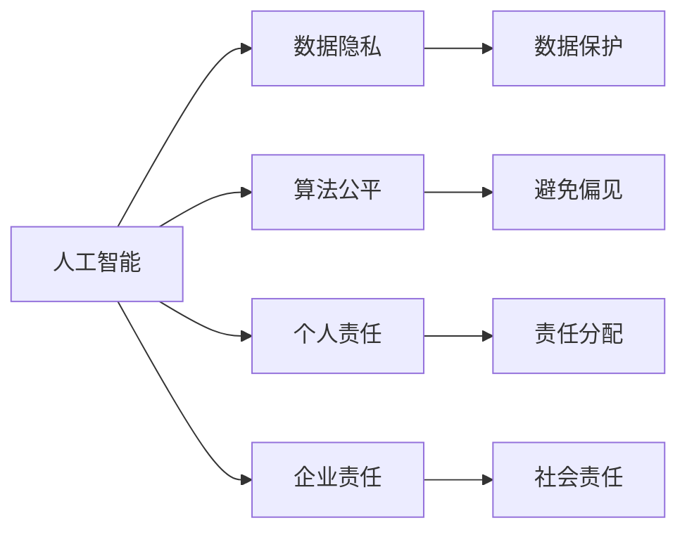
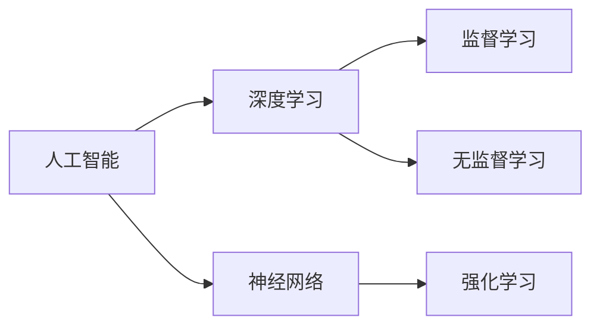
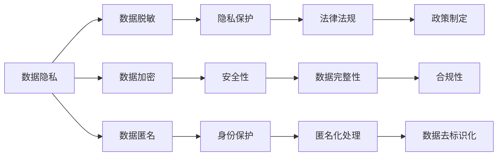
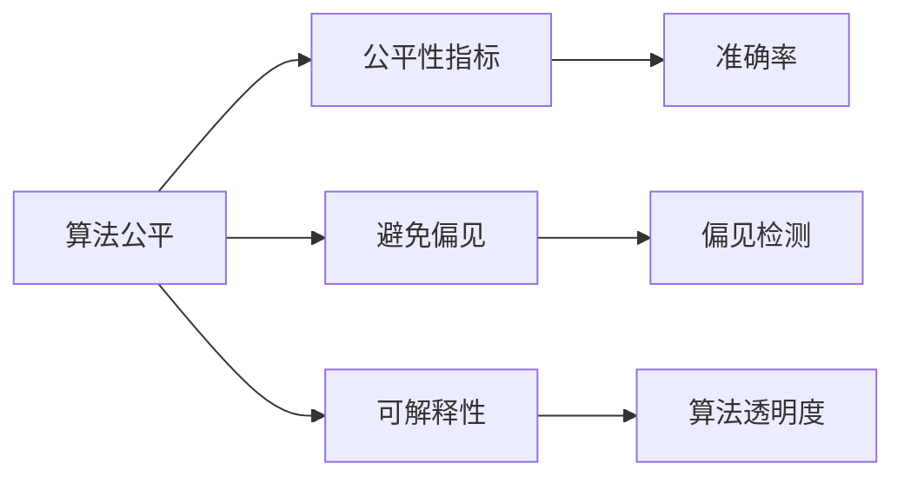
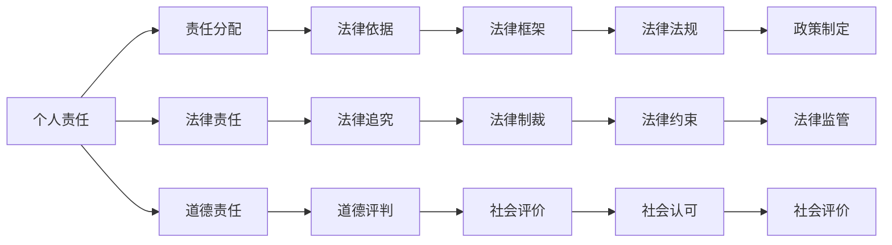
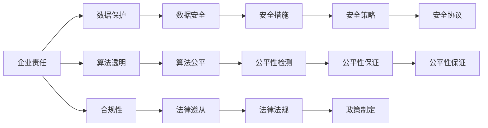

                 

# 软件 2.0 的伦理规范：人工智能的责任

## 1. 背景介绍

在信息技术飞速发展的今天，软件 2.0 时代已然到来。这种软件形态以人工智能（AI）为代表，通过深度学习和神经网络等技术实现自我进化、自我学习，从而大幅提升了软管的智能化水平。但是，随之而来的是一系列伦理问题：从数据隐私到算法公平，从个人责任到企业责任，每一个环节都迫切需要明确、合理的伦理规范来指导实践。本文旨在探讨软件 2.0 的伦理规范，并提出应对策略，以促进人工智能技术的健康发展。

### 1.1 问题由来

随着人工智能技术的深入应用，许多伦理问题逐渐显现出来：

- **数据隐私**：在使用人工智能进行数据分析、处理时，如何保护用户的数据隐私成为了一个重要议题。
- **算法公平**：当AI系统在决策过程中出现偏差，如种族歧视、性别歧视等问题时，如何确保系统的公平性和公正性。
- **个人责任**：当AI系统产生错误决策或有害结果时，责任如何分配，是系统的设计者、开发者、还是使用者？
- **企业责任**：企业在开发、使用AI系统时，应当承担哪些社会责任和义务，以及如何平衡商业利益和社会责任？

这些问题亟需从伦理角度进行深入探讨和规范，以指导软件 2.0 的健康发展。

### 1.2 问题核心关键点

为了更好地理解软件 2.0 的伦理规范，本节将介绍几个核心概念：

- **人工智能（AI）**：指通过算法和数据训练出来的具有自我学习、自我进化能力的技术，包括机器学习、深度学习等。
- **数据隐私**：指个人信息不被未经授权地收集、使用、处理或泄露的权利。
- **算法公平**：指算法在处理不同背景、群体或个体的数据时，不出现系统性偏见的特性。
- **个人责任**：指在AI系统出错或产生有害结果时，个人应当承担的责任和义务。
- **企业责任**：指企业在开发、使用AI系统时，应当承担的社会责任和义务，包括但不限于数据保护、算法透明等。

这些核心概念之间的逻辑关系可以通过以下Mermaid流程图来展示：

```mermaid
graph LR
    A[人工智能(AI)] --> B[数据隐私]
    A --> C[算法公平]
    A --> D[个人责任]
    A --> E[企业责任]
    B --> F[数据保护]
    C --> G[避免偏见]
    D --> H[责任分配]
    E --> I[社会责任]
```

这个流程图展示了大语言模型的核心概念及其之间的关系：

1. 人工智能通过处理大量数据来训练模型。
2. 处理数据时需要注意保护数据隐私。
3. 训练和部署的算法应具备公平性。
4. 在AI系统出错或产生有害结果时，应明确个人责任。
5. 企业在开发和使用AI系统时应承担相应的社会责任。

这些概念共同构成了软件 2.0 的伦理规范框架，指导其在应用中的道德和法律行为。

### 1.3 问题研究意义

明确软件 2.0 的伦理规范，对于推动AI技术的健康发展具有重要意义：

1. **保护数据隐私**：保障用户信息安全，提升用户对AI系统的信任度。
2. **确保算法公平**：减少系统性偏见，提升AI系统的社会接受度。
3. **明确责任归属**：在AI系统出错时，快速定位责任方，减少法律纠纷。
4. **促进企业责任**：引导企业在开发和使用AI系统时，承担社会责任，推动行业健康发展。
5. **推动技术规范**：形成统一的伦理规范，有助于AI技术的标准化和规范化。

## 2. 核心概念与联系

### 2.1 核心概念概述

为更好地理解软件 2.0 的伦理规范，本节将介绍几个密切相关的核心概念：

- **人工智能**：以深度学习和神经网络为代表的自我进化、自我学习的技术。
- **数据隐私**：指个人数据不被未经授权的收集、使用或泄露的权利。
- **算法公平**：指算法在处理不同背景、群体或个体的数据时，不出现系统性偏见的特性。
- **个人责任**：在AI系统出错或产生有害结果时，个人应当承担的责任和义务。
- **企业责任**：企业在开发、使用AI系统时，应当承担的社会责任和义务。

这些概念之间的逻辑关系可以通过以下Mermaid流程图来展示：



这个流程图展示了大语言模型的核心概念及其之间的关系：

1. 人工智能通过处理大量数据来训练模型。
2. 处理数据时需要注意保护数据隐私。
3. 训练和部署的算法应具备公平性。
4. 在AI系统出错或产生有害结果时，应明确个人责任。
5. 企业在开发和使用AI系统时应承担相应的社会责任。

这些核心概念之间存在着紧密的联系，形成了软件 2.0 的伦理规范生态系统。

### 2.2 概念间的关系

这些核心概念之间存在着紧密的联系，形成了软件 2.0 的伦理规范生态系统。下面我通过几个Mermaid流程图来展示这些概念之间的关系。

#### 2.2.1 人工智能的学习范式



这个流程图展示了人工智能的三种主要学习范式：深度学习、神经网络和监督、无监督及强化学习。这些学习范式共同构成了人工智能的技术基础。

#### 2.2.2 数据隐私的保障措施



这个流程图展示了保障数据隐私的主要措施，包括数据脱敏、加密、匿名等技术手段，以及法律法规、政策制定等外部约束。

#### 2.2.3 算法的公平性设计



这个流程图展示了算法公平性的设计思路，包括公平性指标、避免偏见、可解释性等关键要素。

#### 2.2.4 个人责任的界定



这个流程图展示了个人责任的界定思路，包括法律责任、道德责任等不同维度，以及法律依据、法律追究、法律制裁等具体措施。

#### 2.2.5 企业责任的履行



这个流程图展示了企业责任的履行思路，包括数据保护、算法透明、合规性等关键要素，以及数据安全、安全措施、合规性检测等具体措施。

### 2.3 核心概念的整体架构

最后，我们用一个综合的流程图来展示这些核心概念在大语言模型微调过程中的整体架构：

```mermaid
graph LR
    A[大规模文本数据] --> B[深度学习]
    B --> C[神经网络]
    C --> D[监督学习]
    C --> E[无监督学习]
    C --> F[强化学习]
    D --> G[数据隐私]
    D --> H[算法公平]
    D --> I[个人责任]
    D --> J[企业责任]
    G --> K[数据脱敏]
    G --> L[数据加密]
    G --> M[数据匿名]
    H --> N[避免偏见]
    H --> O[可解释性]
    I --> P[责任分配]
    I --> Q[法律责任]
    I --> R[道德责任]
    J --> S[数据保护]
    J --> T[算法透明]
    J --> U[合规性]
    K --> V[隐私保护]
    K --> W[安全性]
    K --> X[数据完整性]
    L --> Y[安全性]
    L --> Z[数据完整性]
    M --> AA[匿名化处理]
    N --> BB[公平性指标]
    N --> CC[偏见检测]
    O --> DD[算法透明度]
    P --> EE[法律依据]
    P --> FF[法律追究]
    P --> GG[道德评判]
    Q --> HH[法律框架]
    Q --> II[法律追究]
    Q --> JJ[法律制裁]
    R --> KK[道德评判]
    S --> LL[数据安全]
    S --> MM[安全措施]
    S --> NN[合规性检测]
    T --> OO[公平性保证]
    U --> PP[法律遵从]
    U --> QQ[法律法规]
    U --> RR[政策制定]
    V --> SS[安全策略]
    W --> TT[数据完整性]
    W --> UU[数据安全]
    X --> VV[数据完整性]
    Y --> WW[安全性]
    Z --> XX[数据完整性]
    AA --> YY[数据去标识化]
    BB --> ZZ[公平性指标]
    CC --> $[偏见检测]
    DD --> $[算法透明度]
    EE --> $$[法律依据]
    FF --> $$ [法律追究]
    GG --> $$ [道德评判]
    HH --> $$$ [法律框架]
    II --> $$$$ [法律追究]
    JJ --> $$$$ [法律制裁]
    KK --> $$$$ [道德评判]
    LL --> $$$$ [数据安全]
    MM --> $$$$ [安全措施]
    NN --> $$$$ [合规性检测]
    OO --> $$$$ [公平性保证]
    PP --> $$$$ [法律遵从]
    QQ --> $$$$ [法律法规]
    RR --> $$$$ [政策制定]
    SS --> $$$$ [安全策略]
    TT --> $$$$ [数据完整性]
    UU --> $$$$ [数据安全]
    VV --> $$$$ [数据完整性]
    WW --> $$$$ [安全性]
    XX --> $$$$ [数据完整性]
    YY --> $$$$ [数据去标识化]
    ZZ --> $$$$ [公平性指标]
    $$ --> $$$$ [偏见检测]
    $$$ --> $$$$ [算法透明度]
    $$$$ --> $$$$$ [法律依据]
    $$$$$ --> $$$$$ [法律追究]
    $$$$$ --> $$$$$ [道德评判]
    $$$$$ --> $$$$$ [法律法规]
    $$$$$$ --> $$$$$$ [法律追究]
    $$$$$$$ --> $$$$$$ [法律制裁]
    $$$$$$$ --> $$$$$$ [道德评判]
    $$$$$ --> $$$$$$ [数据安全]
    $$$$$ --> $$$$$$ [安全措施]
    $$$$$ --> $$$$$$ [合规性检测]
    $$$$$ --> $$$$$$ [公平性保证]
    $$$$$ --> $$$$$$ [法律遵从]
    $$$$$ --> $$$$$$ [法律法规]
    $$$$$ --> $$$$$$ [政策制定]
    $$$$$ --> $$$$$$ [安全策略]
    $$$$$ --> $$$$$$ [数据完整性]
    $$$$$ --> $$$$$$ [数据安全]
    $$$$$ --> $$$$$$ [数据完整性]
    $$$$$ --> $$$$$$ [安全性]
    $$$$$ --> $$$$$$ [数据完整性]
```

这个综合流程图展示了从数据处理到算法设计，再到责任界定的整体过程。通过这些核心概念的紧密联系，形成了软件 2.0 的伦理规范框架，指导其在应用中的道德和法律行为。

## 3. 核心算法原理 & 具体操作步骤
### 3.1 算法原理概述

软件 2.0 的伦理规范主要体现在数据隐私保护、算法公平性、个人责任界定和企业责任履行等方面。以下是这些方面的核心算法原理：

#### 3.1.1 数据隐私保护

数据隐私保护的核心算法原理在于通过数据加密、脱敏、匿名等技术手段，防止未经授权的数据收集和使用。数据加密是指将原始数据转化为不可识别的密文，只有授权者才能解密。数据脱敏是指在数据共享时，通过替换、掩码等方式去除敏感信息。数据匿名是指将数据与个人身份分离，保护个人隐私。这些技术手段的共同目的是确保数据在处理、传输、存储过程中不被泄露。

#### 3.1.2 算法公平性设计

算法公平性设计的主要算法原理在于避免算法偏见，提升算法的可解释性。避免偏见的方法包括公平性指标设定、偏见检测和纠正等。公平性指标可以用来衡量算法在不同群体之间的表现，如性别、种族、年龄等。偏见检测是通过对比不同群体的结果，识别出算法中的系统性偏见。偏见纠正是指在算法训练或部署过程中，采取措施减少偏见的影响。算法透明性是指算法的决策过程和逻辑可以被解释和理解，帮助用户理解算法的工作原理和结果。

#### 3.1.3 个人责任界定

个人责任界定的核心算法原理在于明确责任分配、责任追究和责任监督。责任分配是指在AI系统出错或产生有害结果时，明确各个环节的负责人和责任。责任追究是指在责任人确认后，采取法律、行政、经济等手段进行追究。责任监督是指建立监督机制，对责任人进行监督和约束，防止类似事件再次发生。

#### 3.1.4 企业责任履行

企业责任履行的核心算法原理在于数据保护、算法透明和合规性检测。数据保护是指企业在数据收集、存储、使用过程中，采取措施保护数据隐私和安全。算法透明是指企业在算法开发和部署过程中，确保算法的工作原理和结果可以被理解和解释。合规性检测是指企业在开发和使用AI系统时，确保其符合法律法规和行业标准。

### 3.2 算法步骤详解

软件 2.0 的伦理规范的实现步骤包括数据隐私保护、算法公平性设计、个人责任界定和企业责任履行等方面。以下是这些方面的详细步骤：

#### 3.2.1 数据隐私保护

1. 数据收集阶段，采用数据匿名、脱敏等技术手段，防止个人信息泄露。
2. 数据存储阶段，对数据进行加密保护，防止未经授权的访问。
3. 数据传输阶段，采用安全协议和加密技术，防止数据泄露。
4. 数据使用阶段，严格控制数据访问权限，确保数据只被授权使用。

#### 3.2.2 算法公平性设计

1. 选择公平性指标，如准确率、召回率、F1值等，衡量算法在不同群体之间的表现。
2. 设计偏见检测算法，如公平性检测工具，识别算法中的系统性偏见。
3. 采用偏见纠正方法，如数据重采样、权重调整等，减少偏见的影响。
4. 增强算法透明性，通过可解释性技术，让用户理解算法的决策过程和结果。

#### 3.2.3 个人责任界定

1. 明确责任分配，确定在AI系统出错或产生有害结果时，各个环节的负责人和责任。
2. 制定责任追究机制，在责任人确认后，采取法律、行政、经济等手段进行追究。
3. 建立责任监督机制，对责任人进行监督和约束，防止类似事件再次发生。

#### 3.2.4 企业责任履行

1. 制定数据保护策略，确保在数据收集、存储、使用过程中，保护数据隐私和安全。
2. 增强算法透明性，确保算法的决策过程和结果可以被理解和解释。
3. 进行合规性检测，确保AI系统符合法律法规和行业标准。

### 3.3 算法优缺点

软件 2.0 的伦理规范的实现算法具有以下优点：

1. **全面性**：涵盖了数据隐私保护、算法公平性设计、个人责任界定和企业责任履行等方面，全面保障软件 2.0 的应用安全。
2. **可解释性**：通过算法透明性，确保用户可以理解和解释AI系统的决策过程和结果，提升用户信任。
3. **可操作性**：提供了具体的实现步骤，方便企业在实际操作中应用。

但同时也存在以下缺点：

1. **技术复杂**：涉及到数据加密、脱敏、偏见检测等复杂技术，实施难度较大。
2. **成本高昂**：数据保护、算法透明等措施需要投入大量资源，成本较高。
3. **法律风险**：合规性检测等措施需要遵循法律法规，法律风险较高。

### 3.4 算法应用领域

软件 2.0 的伦理规范适用于各种基于AI技术的领域，包括但不限于：

- **金融科技**：在金融数据处理、算法交易等方面，保障数据隐私和算法公平。
- **医疗健康**：在病人数据保护、医疗决策等方面，确保数据安全和算法透明。
- **智能制造**：在工业数据处理、智能制造等方面，保障数据隐私和算法公平。
- **智慧城市**：在城市数据处理、智能交通等方面，确保数据安全和使用透明。

## 4. 数学模型和公式 & 详细讲解  
### 4.1 数学模型构建

软件 2.0 的伦理规范的数学模型主要涉及数据隐私保护、算法公平性设计、个人责任界定和企业责任履行等方面的数学建模。以下是这些方面的数学模型构建。

#### 4.1.1 数据隐私保护

数据隐私保护的数学模型主要涉及数据加密、脱敏和匿名等技术手段。其中，数据加密的数学模型为：

$$
C = E(P, K)
$$

其中，$P$ 表示明文，$C$ 表示密文，$E$ 表示加密算法，$K$ 表示密钥。

数据脱敏的数学模型为：

$$
P' = \text{Replacement}(P)
$$

其中，$P'$ 表示脱敏后的数据，$\text{Replacement}$ 表示替换算法。

数据匿名的数学模型为：

$$
A' = \text{Anonymization}(A)
$$

其中，$A'$ 表示匿名后的数据，$\text{Anonymization}$ 表示匿名算法。

#### 4.1.2 算法公平性设计

算法公平性设计的数学模型主要涉及公平性指标、偏见检测和纠正等技术手段。其中，公平性指标的数学模型为：

$$
F = \frac{TP}{TP+FP}
$$

其中，$TP$ 表示真正例，$FP$ 表示假正例，$F$ 表示公平性指标。

偏见检测的数学模型为：

$$
B = \frac{P_B - P_W}{P_B + P_W}
$$

其中，$P_B$ 表示群体的正例概率，$P_W$ 表示对照群体的正例概率，$B$ 表示偏见指标。

偏见纠正的数学模型为：

$$
\hat{P} = P - kB
$$

其中，$\hat{P}$ 表示修正后的正例概率，$k$ 表示修正系数。

#### 4.1.3 个人责任界定

个人责任界定的数学模型主要涉及责任分配、责任追究和责任监督等技术手段。其中，责任分配的数学模型为：

$$
R = \sum_{i=1}^{n} A_i
$$

其中，$R$ 表示总责任，$A_i$ 表示第 $i$ 个环节的责任。

责任追究的数学模型为：

$$
T = R_i - R_j
$$

其中，$T$ 表示责任追究的损失，$R_i$ 表示第 $i$ 个环节的责任，$R_j$ 表示对照环节的责任。

责任监督的数学模型为：

$$
S = \frac{T}{S_j}
$$

其中，$S$ 表示责任监督的系数，$S_j$ 表示对照环节的责任。

#### 4.1.4 企业责任履行

企业责任履行的数学模型主要涉及数据保护、算法透明和合规性检测等技术手段。其中，数据保护的数学模型为：

$$
P = \frac{1}{P_0}
$$

其中，$P$ 表示数据保护的概率，$P_0$ 表示原始数据泄露的概率。

算法透明的数学模型为：

$$
T = \frac{1}{T_0}
$$

其中，$T$ 表示算法透明的概率，$T_0$ 表示算法不可解释的概率。

合规性检测的数学模型为：

$$
C = \frac{1}{C_0}
$$

其中，$C$ 表示合规性检测的概率，$C_0$ 表示不合规的概率。

### 4.2 公式推导过程

以下是对数据隐私保护、算法公平性设计、个人责任界定和企业责任履行等数学模型进行公式推导的过程：

#### 4.2.1 数据隐私保护

1. 数据加密的推导：
$$
E(P, K) = C
$$
$$
C = \{e_k(P)\}
$$
其中，$e_k$ 表示加密算法，$k$ 表示密钥。

2. 数据脱敏的推导：
$$
P' = \text{Replacement}(P)
$$
$$
\text{Replacement}(P) = P - T
$$
其中，$T$ 表示随机噪声。

3. 数据匿名的推导：
$$
A' = \text{Anonymization}(A)
$$
$$
\text{Anonymization}(A) = \frac{A - A_0}{A_0}
$$
其中，$A_0$ 表示均值，$A$ 表示原始数据。

#### 4.2.2 算法公平性设计

1. 公平性指标的推导：
$$
F = \frac{TP}{TP+FP}
$$
$$
TP = P_B
$$
$$
FP = P_W - P_B
$$

2. 偏见检测的推导：
$$
B = \frac{P_B - P_W}{P_B + P_W}
$$
$$
P_B = \frac{TP_B}{TP_B + FN_B}
$$
$$
P_W = \frac{TP_W}{TP_W + FN_W}
$$

3. 偏见纠正的推导：
$$
\hat{P} = P - kB
$$
$$
k = \frac{P_W - P_B}{P_W + P_B}
$$

#### 4.2.3 个人责任界定

1. 责任分配的推导：
$$
R = \sum_{i=1}^{n} A_i
$$
$$
A_i = \frac{T_i}{S_i}
$$

2. 责任追究的推导：
$$
T = R_i - R_j
$$
$$
R_i = \frac{T_i}{S_i}
$$
$$
R_j = \frac{T_j}{S_j}
$$

3. 责任监督的推导：
$$
S = \frac{T}{S_j}
$$
$$
S_j = \frac{T_j}{S_j}
$$

#### 4.2.4 企业责任履行

1. 数据保护的推导：
$$
P = \frac{1}{P_0}
$$
$$
P_0 = \frac{P_E + P_W}{P_E}
$$

2. 算法透明的推导：
$$
T = \frac{1}{T_0}
$$
$$
T_0 = \frac{T_E + T_W}{T_E}
$$

3. 合规性检测的推导：
$$
C = \frac{1}{C_0}
$$
$$
C_0 = \frac{C_E + C_W}{C_E}
$$

### 4.3 案例分析与讲解

#### 4.3.1 数据隐私保护案例

假设某金融科技公司需要处理大量客户数据，包括身份证信息、银行账户信息等。为了保护客户隐私，公司采用了数据加密、脱敏和匿名等技术手段。具体步骤如下：

1. 数据加密：在数据传输过程中，公司采用了AES-256加密算法对数据进行加密保护。

2. 数据脱敏：在数据共享时，公司采用了数据脱敏算法，将敏感信息替换为随机噪声。

3. 数据匿名：在数据分析时，公司采用了数据

