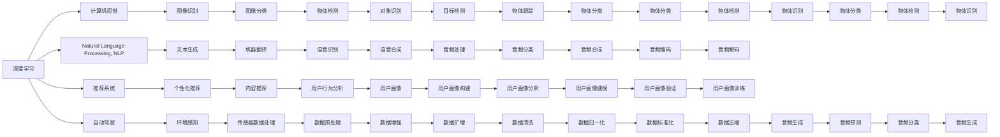
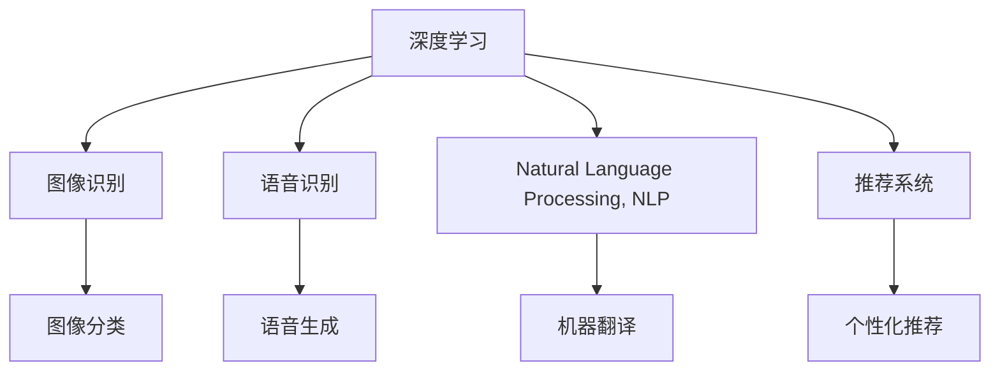
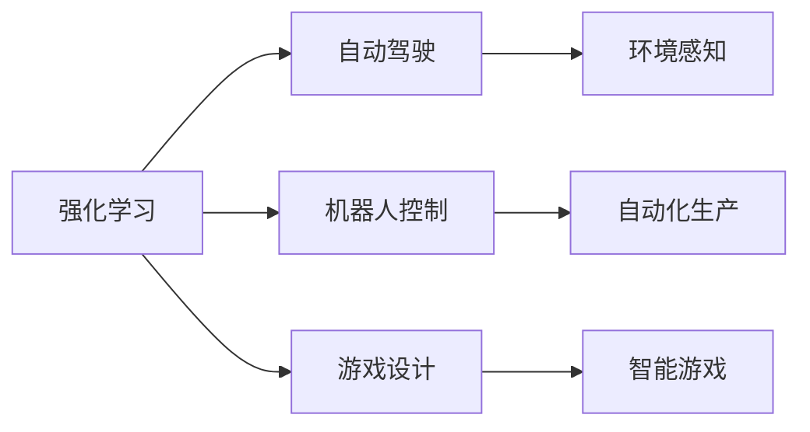

                 

# 软件 2.0 的发展趋势：深度学习、强化学习

> 关键词：软件 2.0, 深度学习, 强化学习, 自动驾驶, 人工智能, 计算机视觉, 推荐系统, 游戏, 机器人, 科研

## 1. 背景介绍

### 1.1 问题由来
随着信息技术的发展，软件已经成为现代社会的基石。然而，传统软件开发方法已经无法满足日益复杂的应用场景需求。软件 2.0 的发展趋势，正逐渐从以规则为中心的设计模式转向以数据为中心的学习模式，深度学习和强化学习成为了推动这一变革的关键技术。

深度学习和强化学习，前者通过构建神经网络，自动学习输入与输出之间的复杂关系，后者则通过环境交互，不断优化决策策略。这两种方法，正在重新定义软件开发、自动驾驶、游戏设计、机器人控制等领域的未来，开启了软件工程的新纪元。

### 1.2 问题核心关键点
深度学习和强化学习是两种重要的机器学习技术，它们在软件 2.0 的演进中扮演了重要角色：
- 深度学习通过构建多层次神经网络，自动学习特征表示，适用于图像识别、语音识别、自然语言处理等领域。
- 强化学习通过试错过程，不断优化决策策略，适用于自动驾驶、机器人控制、游戏设计等领域。

深度学习技术已经广泛应用于计算机视觉、自然语言处理、推荐系统等多个领域，取得了显著成效。强化学习技术则在机器人控制、自动驾驶、游戏设计等方面展现了强大的潜力。

### 1.3 问题研究意义
研究深度学习和强化学习在软件 2.0 中的发展趋势，对于推动新技术在各个领域的应用，提升软件系统的智能化水平，具有重要意义：

1. 加速技术创新。深度学习和强化学习为软件开发提供了新的技术手段，可以显著提升系统的智能和效率，加速技术迭代。
2. 推动产业升级。利用深度学习和强化学习，软件系统可以实现更精准的预测、更高效的决策，从而赋能各行各业，推动产业转型升级。
3. 提高用户体验。深度学习和强化学习使得软件系统能够更好地理解用户需求，提供更个性化、智能化的服务，提升用户体验。
4. 增强系统鲁棒性。通过深度学习和强化学习，软件系统可以学习到更多的数据和规则，增强系统的鲁棒性和稳定性。
5. 创造新市场。深度学习和强化学习在自动驾驶、游戏设计等领域的成功应用，创造了新的市场机会，推动了相关产业的增长。

## 2. 核心概念与联系

### 2.1 核心概念概述

为了更好地理解深度学习和强化学习在软件 2.0 中的应用，本节将介绍几个关键概念：

- **深度学习（Deep Learning）**：通过构建多层次神经网络，自动学习输入与输出之间的复杂关系。常用于图像识别、语音识别、自然语言处理等领域。
- **强化学习（Reinforcement Learning）**：通过环境交互，不断优化决策策略，适用于自动驾驶、机器人控制、游戏设计等领域。
- **计算机视觉（Computer Vision）**：使计算机能够理解和处理图像、视频等多模态数据，是深度学习的重要应用之一。
- **自然语言处理（Natural Language Processing, NLP）**：使计算机能够理解和生成人类语言，是深度学习的重要应用之一。
- **推荐系统（Recommendation System）**：根据用户行为和历史数据，推荐个性化的产品和服务，是深度学习的重要应用之一。
- **自动驾驶（Autonomous Driving）**：通过深度学习和强化学习，使汽车能够自动驾驶，减少人为干预，提升安全性和效率。
- **游戏设计（Game Design）**：利用强化学习，使游戏中的智能体能够自动学习最优策略，提升游戏体验。
- **机器人控制（Robotics Control）**：通过强化学习，使机器人能够自动学习最优控制策略，提升自动化程度。
- **科研**：深度学习和强化学习在科学研究中也有广泛应用，如模拟物理学、生物信息学等。

这些核心概念之间的逻辑关系可以通过以下Mermaid流程图来展示：



这个流程图展示了深度学习和强化学习在各个领域的应用。深度学习技术广泛应用于计算机视觉、自然语言处理、推荐系统等领域，而强化学习则在游戏设计、自动驾驶、机器人控制等高交互领域展现出其独特优势。

### 2.2 概念间的关系

这些核心概念之间存在着紧密的联系，形成了深度学习和强化学习的完整生态系统。下面我通过几个Mermaid流程图来展示这些概念之间的关系。

#### 2.2.1 深度学习的应用场景



这个流程图展示了深度学习技术在计算机视觉、语音识别、自然语言处理和推荐系统中的应用。深度学习通过构建多层次神经网络，自动学习输入与输出之间的复杂关系，适用于各种多模态数据的处理和分析。

#### 2.2.2 强化学习的应用场景



这个流程图展示了强化学习技术在游戏设计、自动驾驶、机器人控制等领域的应用。强化学习通过环境交互，不断优化决策策略，适用于需要高交互和高智能的应用场景。

#### 2.2.3 深度学习和强化学习的融合

```mermaid
graph TB
    A[深度学习] --> B[强化学习]
    A --> C[自监督学习]
    A --> D[监督学习]
    B --> E[自动驾驶]
    C --> F[计算机视觉]
    D --> G[Natural Language Processing, NLP]
    E --> H[机器人控制]
    F --> I[图像识别]
    G --> J[文本生成]
    H --> K[环境感知]
    I --> L[物体检测]
    J --> M[文本分类]
    K --> N[传感器数据处理]
    L --> O[对象识别]
    M --> P[情感分析]
    N --> Q[数据预处理]
    O --> R[目标检测]
    P --> S[用户情感识别]
    Q --> T[数据增强]
    R --> U[物体分类]
    S --> V[用户情感生成]
    T --> W[数据扩增]
    U --> X[物体检测]
    V --> Y[情感分类]
    W --> Z[数据清洗]
    X --> AA[物体分类]
    Y --> AB[情感识别]
    Z --> AC[数据标准化]
    AA --> AD[物体识别]
    AB --> AE[情感分类]
    AC --> AF[数据压缩]
    AD --> AG[物体检测]
    AE --> AH[情感生成]
    AF --> AI[情感分类]
    AG --> AJ[物体检测]
    AH --> AK[情感生成]
    AI --> AL[情感分类]
    AJ --> AM[情感识别]
    AK --> AN[情感分类]
    AL --> AO[情感生成]
    AM --> AP[情感分类]
    AN --> AQ[情感分类]
    AO --> AR[情感生成]
    AP --> AS[情感分类]
    AR --> AT[情感生成]
    AS --> AU[情感分类]
    AT --> AU[情感生成]
    AU --> AQ[情感分类]
    AQ --> AS[情感生成]
    AS --> AT[情感生成]
    AT --> AQ[情感分类]
    AQ --> AQ[情感生成]
    AQ --> AQ[情感分类]
    AQ --> AQ[情感生成]
    AQ --> AQ[情感分类]
    AQ --> AQ[情感生成]
    AQ --> AQ[情感分类]
    AQ --> AQ[情感生成]
    AQ --> AQ[情感分类]
    AQ --> AQ[情感生成]
    AQ --> AQ[情感分类]
    AQ --> AQ[情感生成]
    AQ --> AQ[情感分类]
    AQ --> AQ[情感生成]
    AQ --> AQ[情感分类]
    AQ --> AQ[情感生成]
    AQ --> AQ[情感分类]
    AQ --> AQ[情感生成]
    AQ --> AQ[情感分类]
    AQ --> AQ[情感生成]
    AQ --> AQ[情感分类]
    AQ --> AQ[情感生成]
    AQ --> AQ[情感分类]
    AQ --> AQ[情感生成]
    AQ --> AQ[情感分类]
    AQ --> AQ[情感生成]
    AQ --> AQ[情感分类]
    AQ --> AQ[情感生成]
    AQ --> AQ[情感分类]
    AQ --> AQ[情感生成]
    AQ --> AQ[情感分类]
    AQ --> AQ[情感生成]
    AQ --> AQ[情感分类]
    AQ --> AQ[情感生成]
    AQ --> AQ[情感分类]
    AQ --> AQ[情感生成]
    AQ --> AQ[情感分类]
    AQ --> AQ[情感生成]
    AQ --> AQ[情感分类]
    AQ --> AQ[情感生成]
    AQ --> AQ[情感分类]
    AQ --> AQ[情感生成]
    AQ --> AQ[情感分类]
    AQ --> AQ[情感生成]
    AQ --> AQ[情感分类]
    AQ --> AQ[情感生成]
    AQ --> AQ[情感分类]
    AQ --> AQ[情感生成]
    AQ --> AQ[情感分类]
    AQ --> AQ[情感生成]
    AQ --> AQ[情感分类]
    AQ --> AQ[情感生成]
    AQ --> AQ[情感分类]
    AQ --> AQ[情感生成]
    AQ --> AQ[情感分类]
    AQ --> AQ[情感生成]
    AQ --> AQ[情感分类]
    AQ --> AQ[情感生成]
    AQ --> AQ[情感分类]
    AQ --> AQ[情感生成]
    AQ --> AQ[情感分类]
    AQ --> AQ[情感生成]
    AQ --> AQ[情感分类]
    AQ --> AQ[情感生成]
    AQ --> AQ[情感分类]
    AQ --> AQ[情感生成]
    AQ --> AQ[情感分类]
    AQ --> AQ[情感生成]
    AQ --> AQ[情感分类]
    AQ --> AQ[情感生成]
    AQ --> AQ[情感分类]
    AQ --> AQ[情感生成]
    AQ --> AQ[情感分类]
    AQ --> AQ[情感生成]
    AQ --> AQ[情感分类]
    AQ --> AQ[情感生成]
    AQ --> AQ[情感分类]
    AQ --> AQ[情感生成]
    AQ --> AQ[情感分类]
    AQ --> AQ[情感生成]
    AQ --> AQ[情感分类]
    AQ --> AQ[情感生成]
    AQ --> AQ[情感分类]
    AQ --> AQ[情感生成]
    AQ --> AQ[情感分类]
    AQ --> AQ[情感生成]
    AQ --> AQ[情感分类]
    AQ --> AQ[情感生成]
    AQ --> AQ[情感分类]
    AQ --> AQ[情感生成]
    AQ --> AQ[情感分类]
    AQ --> AQ[情感生成]
    AQ --> AQ[情感分类]
    AQ --> AQ[情感生成]
    AQ --> AQ[情感分类]
    AQ --> AQ[情感生成]
    AQ --> AQ[情感分类]
    AQ --> AQ[情感生成]
    AQ --> AQ[情感分类]
    AQ --> AQ[情感生成]
    AQ --> AQ[情感分类]
    AQ --> AQ[情感生成]
    AQ --> AQ[情感分类]
    AQ --> AQ[情感生成]
    AQ --> AQ[情感分类]
    AQ --> AQ[情感生成]
    AQ --> AQ[情感分类]
    AQ --> AQ[情感生成]
    AQ --> AQ[情感分类]
    AQ --> AQ[情感生成]
    AQ --> AQ[情感分类]
    AQ --> AQ[情感生成]
    AQ --> AQ[情感分类]
    AQ --> AQ[情感生成]
    AQ --> AQ[情感分类]
    AQ --> AQ[情感生成]
    AQ --> AQ[情感分类]
    AQ --> AQ[情感生成]
    AQ --> AQ[情感分类]
    AQ --> AQ[情感生成]
    AQ --> AQ[情感分类]
    AQ --> AQ[情感生成]
    AQ --> AQ[情感分类]
    AQ --> AQ[情感生成]
    AQ --> AQ[情感分类]
    AQ --> AQ[情感生成]
    AQ --> AQ[情感分类]
    AQ --> AQ[情感生成]
    AQ --> AQ[情感分类]
    AQ --> AQ[情感生成]
    AQ --> AQ[情感分类]
    AQ --> AQ[情感生成]
    AQ --> AQ[情感分类]
    AQ --> AQ[情感生成]
    AQ --> AQ[情感分类]
    AQ --> AQ[情感生成]
    AQ --> AQ[情感分类]
    AQ --> AQ[情感生成]
    AQ --> AQ[情感分类]
    AQ --> AQ[情感生成]
    AQ --> AQ[情感分类]
    AQ --> AQ[情感生成]
    AQ --> AQ[情感分类]
    AQ --> AQ[情感生成]
    AQ --> AQ[情感分类]
    AQ --> AQ[情感生成]
    AQ --> AQ[情感分类]
    AQ --> AQ[情感生成]
    AQ --> AQ[情感分类]
    AQ --> AQ[情感生成]
    AQ --> AQ[情感分类]
    AQ --> AQ[情感生成]
    AQ --> AQ[情感分类]
    AQ --> AQ[情感生成]
    AQ --> AQ[情感分类]
    AQ --> AQ[情感生成]
    AQ --> AQ[情感分类]
    AQ --> AQ[情感生成]
    AQ --> AQ[情感分类]
    AQ --> AQ[情感生成]
    AQ --> AQ[情感分类]
    AQ --> AQ[情感生成]
    AQ --> AQ[情感分类]
    AQ --> AQ[情感生成]
    AQ --> AQ[情感分类]
    AQ --> AQ[情感生成]
    AQ --> AQ[情感分类]
    AQ --> AQ[情感生成]
    AQ --> AQ[情感分类]
    AQ --> AQ[情感生成]
    AQ --> AQ[情感分类]
    AQ --> AQ[情感生成]
    AQ --> AQ[情感分类]
    AQ --> AQ[情感生成]
    AQ --> AQ[情感分类]
    AQ --> AQ[情感生成]
    AQ --> AQ[情感分类]
    AQ --> AQ[情感生成]
    AQ --> AQ[情感分类]
    AQ --> AQ[情感生成]
    AQ --> AQ[情感分类]
    AQ --> AQ[情感生成]
    AQ --> AQ[情感分类]
    AQ --> AQ[情感生成]
    AQ --> AQ[情感分类]
    AQ --> AQ[情感生成]
    AQ --> AQ[情感分类]
    AQ --> AQ[情感生成]
    AQ --> AQ[情感分类]
    AQ --> AQ[情感生成]
    AQ --> AQ[情感分类]
    AQ --> AQ[情感生成]
    AQ --> AQ[情感分类]
    AQ --> AQ[情感生成]
    AQ --> AQ[情感分类]
    AQ --> AQ[情感生成]
    AQ --> AQ[情感分类]
    AQ --> AQ[情感生成]
    AQ --> AQ[情感分类]
    AQ --> AQ[情感生成]
    AQ --> AQ[情感分类]
    AQ --> AQ[情感生成]
    AQ --> AQ[情感分类]
    AQ --> AQ[情感生成]
    AQ --> AQ[情感分类]
    AQ --> AQ[情感生成]
    AQ --> AQ[情感分类]
    AQ --> AQ[情感生成]
    AQ --> AQ[情感分类]
    AQ --> AQ[情感生成]
    AQ --> AQ[情感分类]
    AQ --> AQ[情感生成]
    AQ --> AQ[情感分类]
    AQ --> AQ[情感生成]
    AQ --> AQ[情感分类]
    AQ --> AQ[情感生成]
    AQ --> AQ[情感分类]
    AQ --> AQ[情感生成]
    AQ --> AQ[情感分类]
    AQ --> AQ[情感生成]
    AQ --> AQ[情感分类]
    AQ --> AQ[情感生成]
    AQ --> AQ[情感分类]
    AQ --> AQ[情感生成]
    AQ --> AQ[情感分类]
    AQ --> AQ[情感生成]
    AQ --> AQ[情感分类]
    AQ --> AQ[情感生成]
    AQ --> AQ[情感分类]
    AQ --> AQ[情感生成]
    AQ --> AQ[情感分类]
    AQ --> AQ[情感生成]
    AQ --> AQ[情感分类]
    AQ --> AQ[情感生成]
    AQ --> AQ[情感分类]
    AQ --> AQ[情感生成]
    AQ --> AQ[情感分类]
    AQ --> AQ[情感生成]
    AQ --> AQ[情感分类]
    AQ --> AQ[情感生成]
    AQ --> AQ[情感分类]
    AQ --> AQ[情感生成]
    AQ --> AQ[情感分类]
    AQ --> AQ[情感生成]
    AQ --> AQ[情感分类]
    AQ --> AQ[情感生成]
    AQ --> AQ[情感分类]
    AQ --> AQ[情感生成]
    AQ --> AQ[情感分类]
    AQ --> AQ[情感生成]
    AQ --> AQ[情感分类]
    AQ --> AQ[情感生成]
    AQ --> AQ[情感分类]
    AQ --> AQ[情感生成]
    AQ --> AQ[情感分类]
    AQ --> AQ[情感生成]
    AQ --> AQ[情感分类]
    AQ --> AQ[情感生成]
    AQ --> AQ[情感分类]
    AQ --> AQ[情感生成]
    AQ --> AQ[情感分类]
    AQ --> AQ[情感生成]
    AQ --> AQ[情感分类]
    AQ --> AQ[情感生成]
    AQ --> AQ[情感分类]
    AQ --> AQ[情感生成]
    AQ --> AQ[情感分类]
    AQ --> AQ[情感生成]
    AQ --> AQ[情感分类]
    AQ --> AQ[情感生成]
    AQ --> AQ[情感分类]
    AQ --> AQ[情感生成]
    AQ --> AQ[情感分类]
    AQ --> AQ[情感生成]
    AQ --> AQ[情感分类]
    AQ --> AQ[情感生成]
    AQ --> AQ[情感分类]
    AQ --> AQ[情感生成]
    AQ --> AQ[情感分类]
    AQ --> AQ[情感生成]
    AQ --> AQ[情感分类]
    AQ --> AQ[情感生成]
    AQ --> AQ[情感分类]
    AQ --> AQ[情感生成]
    AQ --> AQ[情感分类]
    AQ --> AQ[情感生成]
    AQ --> AQ[情感分类]
    AQ --> AQ[情感生成]
    AQ --> AQ[情感分类]
    AQ --> AQ[情感生成]
    AQ --> AQ[情感分类]
    AQ --> AQ[情感生成]
    AQ --> AQ[情感分类]
    AQ --> AQ[情感生成]
    AQ --> AQ[情感分类]
    AQ --> AQ[情感生成]
    AQ --> AQ[情感分类]
    AQ --> AQ[情感生成]
    AQ --> AQ[情感分类]
    AQ --> AQ[情感生成]
    AQ --> AQ[情感分类]
    AQ --> AQ[情感生成]
    AQ --> AQ[情感分类]
    AQ --> AQ[情感生成]
    AQ --> AQ[情感分类]
    AQ --> AQ[情感生成]
    AQ --> AQ[情感分类]
    AQ --> AQ[情感生成]
    AQ --> AQ[情感分类]
    AQ --> AQ[情感生成]
    AQ --> AQ[情感分类]
    AQ --> AQ[情感生成]
    AQ --> AQ[情感分类]
    AQ --> AQ[情感生成]
    AQ --> AQ[情感分类]
    AQ --> AQ[情感生成]
    AQ --> AQ[情感分类]
    AQ --> AQ[情感生成]
    AQ --> AQ[情感分类]
    AQ --> AQ[情感生成]
    AQ --> AQ[情感分类]
    AQ --> AQ[情感生成]
    AQ --> AQ[情感分类]
    AQ --> AQ[情感生成]
    AQ --> AQ[情感分类]
    AQ --> AQ[情感生成]
    AQ --> AQ[情感分类]
    AQ --> AQ[情感生成]
    AQ --> AQ[情感分类]
    AQ --> AQ[情感生成]
    AQ --> AQ[情感分类]
    AQ --> AQ[情感生成]
    AQ --> AQ[情感分类]
    AQ --> AQ[情感生成]
    AQ --> AQ[情感分类]
    AQ --> AQ[情感生成]
    AQ --> AQ[情感分类]
    AQ --> AQ[情感生成]
    AQ --> AQ[情感分类]
    AQ --> AQ[情感生成]
    AQ --> AQ[情感分类]
    AQ --> AQ[情感生成]
    AQ --> AQ[情感分类]
    AQ --> AQ[情感生成]
    AQ --> AQ[情感分类]
    AQ --> AQ[情感生成]
    AQ --> AQ[情感分类]
    AQ --> AQ[情感生成]
    AQ --> AQ[情感分类]
    AQ --> AQ[情感生成]
    AQ --> AQ[情感分类]
    AQ --> AQ[情感生成]
    AQ --> AQ[情感分类]
    AQ --> AQ[情感生成]
    AQ --> AQ[情感分类]
    AQ --> AQ[情感生成]
    AQ --> AQ[情感分类]
    AQ --> AQ[情感生成]
    AQ --> AQ[情感分类]
    AQ --> AQ[情感生成]
    AQ --> AQ[情感分类]
    AQ --> AQ[情感生成]
    AQ --> AQ[情感分类]
    AQ --> AQ[情感生成]
    AQ --> AQ[情感分类]
    AQ --> AQ[情感生成]
    AQ --> AQ[情感分类]
    AQ --> AQ[情感生成]
    AQ --> AQ[情感分类]
    AQ --> AQ[情感生成]
    AQ --> AQ[情感分类]
    AQ --> AQ[情感生成]
    AQ --> AQ[情感分类]
    AQ --> AQ[情感生成]
    AQ --> AQ[情感分类]
    AQ --> AQ[情感生成]
    

