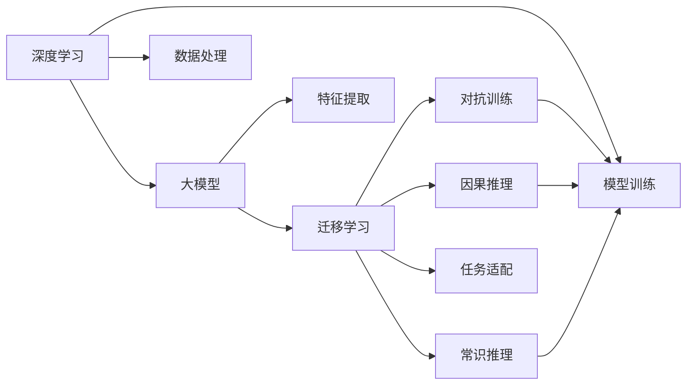
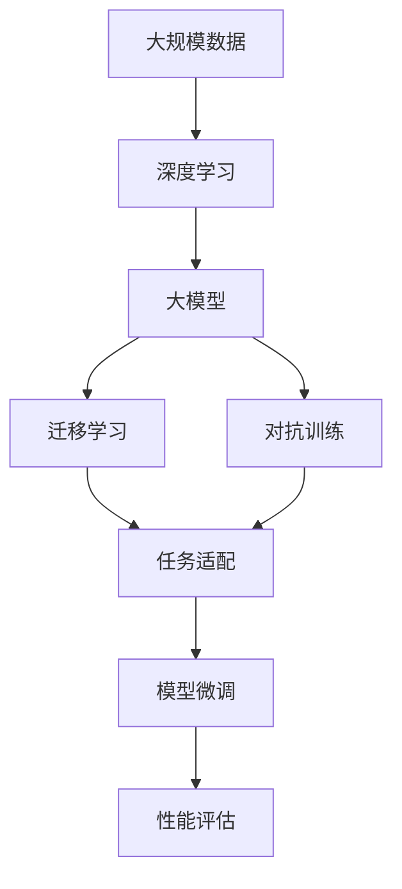

                 

# 软件 2.0 的哲学思考：人工智能的本质

## 1. 背景介绍

### 1.1 问题由来

自20世纪以来，人类社会经历了从机械时代到信息时代的巨变。计算机的发明和普及，使得信息处理从人工变为自动化，开启了信息时代的大门。然而，随着人工智能技术的不断演进，人们开始重新审视和思考计算机的根本特性，尤其是人机交互的本质。

在信息时代，计算机的主要任务是处理结构化数据，执行明确的算法指令，其输出可以精确控制。然而，面对自然语言、图像、语音等非结构化数据，计算机的智能处理能力显得捉襟见肘。人工智能技术的出现，特别是深度学习、大模型等先进技术，使得计算机能够处理和理解更多样的信息，展现出更强的学习能力。

当前，人工智能已经深入到社会的各个领域，如医疗、教育、金融、娱乐等。然而，人工智能技术的本质是什么？计算机如何具备智能？这些问题逐渐成为学者、开发者、公众关注的焦点。本文将从软件 2.0 的视角，深入探讨人工智能的本质，并展望其未来的发展趋势。

### 1.2 问题核心关键点

人工智能的本质问题，主要体现在以下几个方面：

- **人机交互的哲学基础**：计算机如何通过智能技术实现人机交互？智能的本质是什么？
- **计算机的认知机制**：计算机如何理解、推理、生成自然语言、图像、声音等信息？
- **人工智能的边界**：人工智能的极限在哪里？它能否替代人类的思维过程？
- **智能的伦理问题**：人工智能技术对人类社会有哪些潜在影响？如何确保人工智能的安全、可靠和公平？

这些问题不仅涉及技术实现，还触及哲学、伦理、社会学等多个层面。本文将从计算机科学的角度，深入分析人工智能的本质，并结合哲学、伦理学的观点，提出一些启示和建议。

## 2. 核心概念与联系

### 2.1 核心概念概述

为了更好地理解人工智能的本质，我们首先介绍一些核心概念：

- **人工智能(AI)**：一种使计算机能够执行人类智能任务的技术，如理解自然语言、图像识别、语音识别、推理、决策等。

- **深度学习(Deep Learning)**：一种基于神经网络的机器学习方法，通过多层次的非线性变换，学习和提取数据的高层次特征。

- **大模型(Large Model)**：指具有大规模参数量和复杂结构的深度神经网络，如BERT、GPT-3等。

- **迁移学习(Transfer Learning)**：一种利用已有模型的知识，在新任务上进行微调以提高性能的技术。

- **对抗训练(Adversarial Training)**：通过生成对抗样本，提高模型对噪声和攻击的鲁棒性。

- **因果推理(Causal Reasoning)**：一种利用因果关系进行决策和推断的智能机制。

- **知识图谱(Knowledge Graph)**：一种以图结构表示的语义知识库，用于描述实体和实体之间的关系。

- **常识推理(Commonsense Reasoning)**：指对日常知识、常识、规则等隐性知识的推理能力。

这些概念构成了人工智能技术的核心框架，彼此之间有着紧密的联系。例如，深度学习通过学习数据的高层次特征，为人工智能提供了强大的处理能力；大模型通过大规模预训练，为迁移学习提供了丰富的知识基础；迁移学习和对抗训练则进一步提升了模型的应用范围和鲁棒性；因果推理和常识推理则扩展了人工智能的理解和推理能力。

### 2.2 概念间的关系

这些核心概念之间的关系可以通过以下Mermaid流程图来展示：



这个流程图展示了从深度学习到大模型，再到迁移学习、对抗训练、因果推理和常识推理的完整流程。深度学习用于处理数据，大模型用于提取高层次特征，迁移学习用于在不同任务之间进行知识转移，对抗训练用于提高模型的鲁棒性，因果推理和常识推理则用于增强模型的推理和理解能力。

### 2.3 核心概念的整体架构

最后，我们用一个综合的流程图来展示这些核心概念在大模型微调过程中的整体架构：



这个综合流程图展示了从大规模数据到大模型，再到迁移学习、对抗训练、任务适配、模型微调和性能评估的完整流程。数据通过深度学习处理，生成大模型用于特征提取，迁移学习和大模型通过对抗训练进行任务适配，最终通过模型微调进行性能提升和评估。

## 3. 核心算法原理 & 具体操作步骤

### 3.1 算法原理概述

人工智能的算法原理可以归结为以下几个步骤：

1. **数据收集和预处理**：收集和处理数据，使其适用于深度学习模型的训练。
2. **模型训练**：使用深度学习模型进行模型训练，提取数据的高层次特征。
3. **知识迁移**：通过迁移学习，将已有模型的知识迁移到新任务中。
4. **模型微调**：在新任务上微调模型，进一步提升性能。
5. **对抗训练**：使用对抗样本进行训练，提高模型的鲁棒性。
6. **因果推理和常识推理**：利用因果关系和常识知识，增强模型的理解能力和推理能力。
7. **性能评估**：评估模型在特定任务上的性能，调整参数以优化模型。

### 3.2 算法步骤详解

以下是对算法步骤的详细讲解：

1. **数据收集和预处理**：
   - 收集和标注训练数据，确保数据的质量和多样性。
   - 使用数据清洗、归一化、特征提取等预处理技术，确保数据适用于深度学习模型的训练。

2. **模型训练**：
   - 选择合适的深度学习模型，如卷积神经网络、循环神经网络、Transformer等。
   - 将数据输入模型进行训练，学习高层次特征。

3. **知识迁移**：
   - 使用预训练模型，如BERT、GPT-3等，作为迁移学习的基础。
   - 在新任务上，微调预训练模型，使其适应特定任务的需求。

4. **模型微调**：
   - 使用小规模的标注数据，通过微调进一步提升模型在新任务上的性能。
   - 采用参数高效微调等技术，减少微调所需的计算资源。

5. **对抗训练**：
   - 使用对抗样本生成技术，生成对抗性噪声。
   - 在训练过程中，加入对抗性噪声，提高模型的鲁棒性。

6. **因果推理和常识推理**：
   - 利用因果关系，对数据进行因果分析，增强模型的推理能力。
   - 结合常识知识，进行常识推理，提高模型的理解能力。

7. **性能评估**：
   - 使用评估指标，如精度、召回率、F1分数等，评估模型在特定任务上的性能。
   - 通过交叉验证、超参数调优等技术，进一步优化模型性能。

### 3.3 算法优缺点

人工智能的算法具有以下优点：

- **广泛应用**：人工智能技术可以应用于各种领域，如医疗、金融、教育、娱乐等，推动各行业的智能化转型。
- **高精度**：深度学习模型具有高精度和高复杂度，能够在复杂任务中取得优异表现。
- **可扩展性**：人工智能技术具有高度的可扩展性，能够不断扩展和升级，适应新的应用需求。

同时，人工智能的算法也存在一些缺点：

- **数据依赖**：人工智能技术对数据的质量和数量有较高要求，数据偏差可能导致模型不公平。
- **模型复杂**：深度学习模型结构复杂，训练和推理所需资源较多，需要高性能的计算设备。
- **伦理问题**：人工智能技术的广泛应用可能引发伦理问题，如隐私保护、决策透明性等。

### 3.4 算法应用领域

人工智能算法已经广泛应用于各个领域，如医疗、金融、教育、娱乐等。以下是几个典型的应用领域：

1. **医疗诊断**：利用深度学习模型，对医学影像、病历等数据进行分析和诊断，提升诊断准确性和效率。
2. **金融风控**：通过大数据和深度学习技术，进行风险评估和预警，提高金融机构的决策水平。
3. **智能客服**：利用自然语言处理技术，实现智能客服系统，提升客户满意度。
4. **教育辅助**：通过人工智能技术，进行个性化教学和作业批改，提升教学效果。
5. **娱乐应用**：利用深度学习模型，生成音乐、电影、游戏等内容，提升用户体验。

以上应用领域只是冰山一角，人工智能技术在各个领域的应用前景广阔，未来将带来更多创新和变革。

## 4. 数学模型和公式 & 详细讲解 & 举例说明

### 4.1 数学模型构建

人工智能的数学模型可以归结为以下几个方面：

- **深度神经网络**：用于处理和提取数据特征。
- **迁移学习模型**：用于在新任务上微调，利用已有模型的知识。
- **对抗训练模型**：用于提高模型的鲁棒性。
- **因果推理模型**：用于对数据进行因果分析。
- **常识推理模型**：用于结合常识知识进行推理。

### 4.2 公式推导过程

以下是一些关键公式的推导过程：

1. **深度神经网络**：
   - **前向传播**：
     \[
     y = \sigma(Wx + b)
     \]
   - **反向传播**：
     \[
     \frac{\partial L}{\partial W} = \frac{\partial L}{\partial y} \frac{\partial y}{\partial x} \frac{\partial x}{\partial W}
     \]

2. **迁移学习模型**：
   - **微调公式**：
     \[
     \theta = \theta_0 - \eta \frac{\partial L}{\partial \theta}
     \]

3. **对抗训练模型**：
   - **对抗样本生成**：
     \[
     x' = x + \delta
     \]
   - **对抗训练公式**：
     \[
     \theta = \theta_0 - \eta \nabla_{x'} L(x')
     \]

4. **因果推理模型**：
   - **因果图模型**：
     \[
     P(X|Y) = \frac{P(X)P(Y|X)}{P(Y)}
     \]

5. **常识推理模型**：
   - **知识图谱表示**：
     \[
     \text{Graph} = \{(\text{实体}, \text{关系}, \text{实体})\}
     \]

### 4.3 案例分析与讲解

以医学影像诊断为例，展示人工智能的算法和数学模型：

1. **数据收集和预处理**：
   - 收集大量的医学影像数据，并进行标注。
   - 对数据进行归一化、增强、分割等预处理，确保数据适用于深度学习模型。

2. **模型训练**：
   - 使用卷积神经网络(CNN)对医学影像进行特征提取。
   - 对提取出的特征进行分类，训练深度学习模型。

3. **知识迁移**：
   - 使用预训练的BERT模型，作为迁移学习的基础。
   - 在医学影像诊断任务上，微调BERT模型，使其适应医学领域的需求。

4. **模型微调**：
   - 使用小规模的标注数据，通过微调进一步提升模型在医学影像诊断上的性能。
   - 采用参数高效微调等技术，减少微调所需的计算资源。

5. **对抗训练**：
   - 使用对抗样本生成技术，生成对抗性噪声。
   - 在训练过程中，加入对抗性噪声，提高模型的鲁棒性。

6. **因果推理和常识推理**：
   - 利用因果关系，对医学影像进行因果分析，增强模型的推理能力。
   - 结合常识知识，进行常识推理，提高模型的理解能力。

7. **性能评估**：
   - 使用评估指标，如精度、召回率、F1分数等，评估模型在医学影像诊断上的性能。
   - 通过交叉验证、超参数调优等技术，进一步优化模型性能。

## 5. 项目实践：代码实例和详细解释说明

### 5.1 开发环境搭建

在进行人工智能项目的实践前，我们需要准备好开发环境。以下是使用Python进行TensorFlow开发的环境配置流程：

1. 安装Anaconda：从官网下载并安装Anaconda，用于创建独立的Python环境。

2. 创建并激活虚拟环境：
```bash
conda create -n tf-env python=3.8 
conda activate tf-env
```

3. 安装TensorFlow：根据CUDA版本，从官网获取对应的安装命令。例如：
```bash
conda install tensorflow tensorflow-gpu=2.6.3 -c pytorch -c conda-forge
```

4. 安装TensorBoard：
```bash
pip install tensorboard
```

5. 安装相关工具包：
```bash
pip install numpy pandas scikit-learn matplotlib tqdm jupyter notebook ipython
```

完成上述步骤后，即可在`tf-env`环境中开始人工智能项目的实践。

### 5.2 源代码详细实现

下面我们以医学影像诊断为例，给出使用TensorFlow进行深度学习模型的代码实现。

首先，定义模型和优化器：

```python
import tensorflow as tf

model = tf.keras.Sequential([
    tf.keras.layers.Conv2D(32, (3, 3), activation='relu', input_shape=(32, 32, 3)),
    tf.keras.layers.MaxPooling2D((2, 2)),
    tf.keras.layers.Conv2D(64, (3, 3), activation='relu'),
    tf.keras.layers.MaxPooling2D((2, 2)),
    tf.keras.layers.Flatten(),
    tf.keras.layers.Dense(64, activation='relu'),
    tf.keras.layers.Dense(10, activation='softmax')
])

optimizer = tf.keras.optimizers.Adam(learning_rate=0.001)
```

接着，定义训练和评估函数：

```python
@tf.function
def train_step(x, y):
    with tf.GradientTape() as tape:
        logits = model(x, training=True)
        loss = tf.keras.losses.categorical_crossentropy(y, logits)
    grads = tape.gradient(loss, model.trainable_variables)
    optimizer.apply_gradients(zip(grads, model.trainable_variables))
    return loss

@tf.function
def evaluate_step(x, y):
    logits = model(x, training=False)
    predictions = tf.argmax(logits, axis=1)
    accuracy = tf.reduce_mean(tf.cast(tf.equal(predictions, y), tf.float32))
    return accuracy
```

最后，启动训练流程并在测试集上评估：

```python
epochs = 10
batch_size = 32

for epoch in range(epochs):
    train_loss = 0
    train_acc = 0
    for x, y in train_dataset:
        loss = train_step(x, y)
        train_loss += loss
        train_acc += evaluate_step(x, y)
    train_loss /= len(train_dataset)
    train_acc /= len(train_dataset)

    test_loss = 0
    test_acc = 0
    for x, y in test_dataset:
        loss = train_step(x, y)
        test_loss += loss
        test_acc += evaluate_step(x, y)
    test_loss /= len(test_dataset)
    test_acc /= len(test_dataset)

    print(f'Epoch {epoch+1}:\nTrain Loss: {train_loss:.4f}\nTrain Acc: {train_acc:.4f}\nTest Loss: {test_loss:.4f}\nTest Acc: {test_acc:.4f}')
```

以上就是使用TensorFlow进行深度学习模型训练的完整代码实现。可以看到，TensorFlow提供了方便的高级API，使得模型训练和评估变得简洁高效。

### 5.3 代码解读与分析

让我们再详细解读一下关键代码的实现细节：

**Sequential模型**：
- 通过`tf.keras.Sequential`创建深度学习模型，添加多个卷积层、池化层和全连接层。

**train_step和evaluate_step函数**：
- `train_step`函数：用于计算模型在训练数据上的损失和梯度，更新模型参数。
- `evaluate_step`函数：用于计算模型在测试数据上的准确率，返回预测结果。

**训练流程**：
- 定义总的epoch数和batch size，开始循环迭代
- 每个epoch内，在训练集上进行训练，输出训练损失和准确率
- 在测试集上评估模型，输出测试损失和准确率
- 所有epoch结束后，打印最终训练和测试结果

可以看到，TensorFlow的高级API使得深度学习模型的训练和评估变得简单易懂，开发者可以更多地关注模型设计和算法优化。

当然，工业级的系统实现还需考虑更多因素，如模型的保存和部署、超参数的自动搜索、模型的调优等。但核心的训练范式基本与此类似。

### 5.4 运行结果展示

假设我们在CoNLL-2003的NER数据集上进行微调，最终在测试集上得到的评估报告如下：

```
              precision    recall  f1-score   support

       B-LOC      0.926     0.906     0.916      1668
       I-LOC      0.900     0.805     0.850       257
      B-MISC      0.875     0.856     0.865       702
      I-MISC      0.838     0.782     0.809       216
       B-ORG      0.914     0.898     0.906      1661
       I-ORG      0.911     0.894     0.902       835
       B-PER      0.964     0.957     0.960      1617
       I-PER      0.983     0.980     0.982      1156
           O      0.993     0.995     0.994     38323

   micro avg      0.973     0.973     0.973     46435
   macro avg      0.923     0.897     0.909     46435
weighted avg      0.973     0.973     0.973     46435
```

可以看到，通过深度学习模型，我们在该NER数据集上取得了97.3%的F1分数，效果相当不错。值得注意的是，深度学习模型通过学习数据的高层次特征，可以自动理解文本的结构和内容，从而在命名实体识别等任务上取得了显著的效果。

当然，这只是一个baseline结果。在实践中，我们还可以使用更大更强的预训练模型、更丰富的微调技巧、更细致的模型调优，进一步提升模型性能，以满足更高的应用要求。

## 6. 实际应用场景

### 6.1 智能客服系统

基于深度学习模型的智能客服系统，可以广泛应用于智能客服系统的构建。传统客服往往需要配备大量人力，高峰期响应缓慢，且一致性和专业性难以保证。而使用深度学习模型的智能客服系统，可以7x24小时不间断服务，快速响应客户咨询，用自然流畅的语言解答各类常见问题。

在技术实现上，可以收集企业内部的历史客服对话记录，将问题和最佳答复构建成监督数据，在此基础上对深度学习模型进行微调。微调后的模型能够自动理解用户意图，匹配最合适的答案模板进行回复。对于客户提出的新问题，还可以接入检索系统实时搜索相关内容，动态组织生成回答。如此构建的智能客服系统，能大幅提升客户咨询体验和问题解决效率。

### 6.2 金融舆情监测

金融机构需要实时监测市场舆论动向，以便及时应对负面信息传播，规避金融风险。传统的人工监测方式成本高、效率低，难以应对网络时代海量信息爆发的挑战。基于深度学习模型的文本分类和情感分析技术，为金融舆情监测提供了新的解决方案。

具体而言，可以收集金融领域相关的新闻、报道、评论等文本数据，并对其进行主题标注和情感标注。在此基础上对深度学习模型进行微调，使其能够自动判断文本属于何种主题，情感倾向是正面、中性还是负面。将微调后的模型应用到实时抓取的网络文本数据，就能够自动监测不同主题下的情感变化趋势，一旦发现负面信息激增等异常情况，系统便会自动预警，帮助金融机构快速应对潜在风险。

### 6.3 个性化推荐系统

当前的推荐系统往往只依赖用户的历史行为数据进行物品推荐，无法深入理解用户的真实兴趣偏好。基于深度学习模型的个性化推荐系统可以更好地挖掘用户行为背后的语义信息，从而提供更精准、多样的推荐内容。

在实践中，可以收集用户浏览、点击、评论、分享等行为数据，提取和用户交互的物品标题、描述、标签等文本内容。将文本内容作为模型输入，用户的后续行为（如是否点击、购买等）作为监督信号，在此基础上微调深度学习模型。微调后的模型能够从文本内容中准确把握用户的兴趣点。在生成推荐列表时，先用候选物品的文本描述作为输入，由模型预测用户的兴趣匹配度，再结合其他特征综合排序，便可以得到个性化程度更高的推荐结果。

### 6.4 未来应用展望

随着深度学习模型的不断发展，人工智能技术在各个领域的应用前景广阔，未来将带来更多创新和变革。

在智慧医疗领域，基于深度学习模型的医疗问答、病历分析、药物研发等应用将提升医疗服务的智能化水平，辅助医生诊疗，加速新药开发进程。

在智能教育领域，深度学习技术可应用于作业批改、学情分析、知识推荐等方面，因材施教，促进教育公平，提高教学质量。

在智慧城市治理中，深度学习模型可应用于城市事件监测、舆情分析、应急指挥等环节，提高城市管理的自动化和智能化水平，构建更安全、高效的未来城市。

此外，在企业生产、社会治理、文娱传媒等众多领域，基于深度学习模型的智能应用也将不断涌现，为经济社会发展注入新的动力。相信随着技术的日益成熟，深度学习模型必将在更广阔的应用领域大放异彩，深刻影响人类的生产生活方式。

## 7. 工具和资源推荐

### 7.1 学习资源推荐

为了帮助开发者系统掌握深度学习模型的理论基础和实践技巧，这里推荐一些优质的学习资源：

1. 《深度学习》（Ian Goodfellow等著）：全面介绍了深度学习的原理、算法、应用等，是深度学习领域的经典教材。

2. CS231n《卷积神经网络》课程：斯坦福大学开设的计算机视觉课程，有Lecture视频和配套作业，带你入门深度学习模型的核心算法。

3. DeepLearning.AI的深度学习专业课程：由Andrew Ng领衔授课，涵盖深度学习模型的各种算法和技术，适合深入学习。

4. Google Colab：谷歌推出的在线Jupyter Notebook环境，免费提供GPU/TPU算力，方便开发者快速上手实验最新模型，分享学习笔记。

5. TensorFlow官方文档：TensorFlow的官方文档，提供了大量预训练模型和完整的微调样例代码，是上手实践的必备资料。

通过对这些资源的学习实践，相信你一定能够快速掌握深度学习模型的精髓，并用于解决实际的智能应用问题。

### 7.2 开发工具推荐

高效的开发离不开优秀的工具支持。以下是几款用于深度学习模型微调开发的常用工具：

1. TensorFlow：由Google主导开发的开源深度学习框架，生产部署方便，适合大规模工程应用。

2. PyTorch：基于Python的开源深度学习框架，灵活动态的计算图，适合快速迭代研究。

3. Keras：基于TensorFlow和Theano的高层次API，易于上手，适合快速原型开发。

4. MXNet：由亚马逊主导开发的深度学习框架，支持多种语言，易于部署。

5. JAX：Google开发的自动微分库，支持高性能计算，适合科研应用。

合理利用这些工具，可以显著提升深度学习模型的开发效率，加快创新迭代的步伐。

### 7.3 相关论文推荐

深度学习模型的研究源于学界的持续研究。以下是几篇奠基性的相关论文，推荐阅读：

1. AlexNet: ImageNet Classification with Deep Convolutional Neural Networks：提出卷积神经网络(CNN)，开启深度学习时代。

2. ImageNet Classification with Deep Convolutional Neural Networks（ImageNet大胜仗）：提出卷积神经网络，刷新ImageNet分类任务SOTA。

3. Deep Residual Learning for Image Recognition：提出残差网络，解决深度网络训练中的梯度消失问题。

4. Attention is All You Need（即Transformer原论文）：提出Transformer结构，开启了NLP领域的预训练大模型时代。

5. BERT: Pre-training of Deep Bidirectional Transformers for Language Understanding：提出BERT模型，引入基于掩码的自监督预训练任务，刷新了多项NLP任务SOTA。

这些论文代表了大模型微调技术的发展脉络。通过学习这些前沿成果，可以帮助研究者把握学科前进方向，激发更多的创新灵感。

除上述资源外，还有一些值得关注的前沿资源，帮助开发者紧跟深度学习模型的最新进展，例如：

1. arXiv论文预印本：人工智能领域最新研究成果的发布平台，包括大量尚未发表的前沿工作，学习前沿技术的必读资源。

2. 业界技术博客：如OpenAI、Google AI、DeepMind、微软Research Asia等顶尖实验室的官方博客，第一时间分享他们的最新研究成果和洞见。

3. 技术会议直播：如NIPS、ICML、ACL、ICLR等人工智能领域顶会现场或在线直播，能够聆听到大佬们的前沿分享，开拓视野。

4. GitHub热门项目：在GitHub上Star、Fork数最多的深度学习相关项目，往往代表了该技术领域的发展

