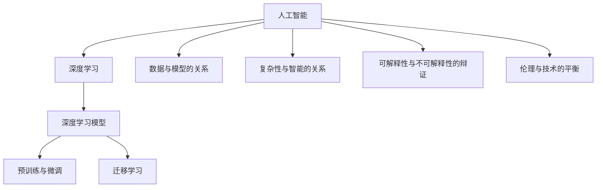

                 

# 软件 2.0 的哲学思考：人工智能的本质

## 1. 背景介绍

### 1.1 问题由来

在经历了计算机1.0和软件1.0的快速发展后，我们即将进入软件2.0的时代。软件2.0的核心标志之一就是人工智能（AI）的崛起。从AlphaGo的胜利到GPT-3的横空出世，AI正在以前所未有的速度重塑我们的世界。

然而，当我们沉浸在AI技术的成就和应用中时，是否曾思考过AI的本质是什么？为何AI能够实现如此复杂和智能的行为？AI的发展又将带领人类走向何方？这些问题不仅关乎技术本身，更关乎我们对技术的理解和对未来的思考。

### 1.2 问题核心关键点

在探讨AI的本质之前，我们首先需要明确几个关键点：

- **数据与模型的关系**：AI的基础是大量数据和复杂模型，但数据背后隐藏的是复杂的信息和知识，模型的目标是通过数据进行学习和预测。
- **复杂性与智能的关系**：复杂性是AI系统的一个显著特点，但复杂性并不一定等同于智能，智能在于系统能否高效地处理复杂信息并做出合理的决策。
- **可解释性与不可解释性的辩证**：AI系统的复杂性导致了其不可解释性，但这也正是AI的魅力所在，不可解释性并不意味着不科学，只是我们需要找到一种新的语言来描述这种智能。
- **伦理与技术的平衡**：AI技术的进步带来了伦理和道德上的挑战，如何在技术发展的同时保护人类价值观和伦理规范，是我们需要面对的重要问题。

## 2. 核心概念与联系

### 2.1 核心概念概述

在探讨AI的本质之前，我们先来梳理几个核心概念及其相互关系：

- **人工智能（AI）**：一种使计算机系统能够执行通常需要人类智能的任务的技术。
- **深度学习（DL）**：一种基于神经网络结构的机器学习方法，通过多层非线性变换提取特征。
- **深度学习模型**：如卷积神经网络（CNN）、循环神经网络（RNN）和变压器（Transformer）等，用于处理图像、语音、文本等多种类型的数据。
- **预训练与微调**：先在大规模数据上进行无监督学习，然后在特定任务上进行有监督学习的方法，可以显著提升模型性能。
- **迁移学习**：将在一个任务上学习到的知识迁移到另一个任务上，减少对特定任务数据的依赖。

### 2.2 概念间的关系

这些核心概念之间存在着紧密的联系，形成了一个完整的AI系统框架：



这个框架展示了AI技术的多层次结构，从基础的数据与模型，到复杂的深度学习模型，再到具体的预训练与微调，以及最终的迁移学习，每一个层次都在为AI系统的智能和应用提供支撑。

## 3. 核心算法原理 & 具体操作步骤
### 3.1 算法原理概述

AI的本质是通过数据和模型进行学习和预测，而深度学习模型则是实现这一过程的核心工具。深度学习模型通过多层非线性变换，从输入数据中提取特征，然后通过预测函数输出结果。

在深度学习模型的基础上，预训练与微调技术进一步提升了模型性能。预训练模型通过在大规模无标签数据上进行训练，学习到通用的特征表示，然后通过微调将其应用于特定任务，进一步优化模型的预测能力。

### 3.2 算法步骤详解

深度学习模型的预训练与微调通常包括以下几个步骤：

1. **数据准备**：收集并处理大规模无标签数据，构建预训练模型所需的数据集。
2. **预训练**：使用预训练模型在大规模数据上进行无监督学习，提取通用的特征表示。
3. **微调**：在特定任务的数据集上，对预训练模型进行有监督学习，进一步优化模型的预测能力。
4. **评估与部署**：在测试集上评估模型性能，然后将其部署到实际应用中。

### 3.3 算法优缺点

深度学习模型的预训练与微调具有以下优点：

- **高效学习**：通过预训练和微调，模型能够高效地从数据中学习到知识，提升模型性能。
- **泛化能力强**：预训练模型在无标签数据上学习到的通用特征表示，可以应用于多种任务，提高模型的泛化能力。
- **数据利用率高**：预训练和微调技术充分利用了数据，避免了对特定任务数据的依赖。

然而，深度学习模型也存在一些缺点：

- **资源消耗大**：预训练和微调模型需要大量的计算资源，对硬件设备提出了较高要求。
- **解释性差**：深度学习模型通常被视为"黑盒"，其决策过程难以解释，缺乏透明性。
- **过拟合风险**：模型复杂度高，容易出现过拟合现象，需要引入正则化技术进行控制。

### 3.4 算法应用领域

深度学习模型的预训练与微调技术已经广泛应用于多个领域，例如：

- **计算机视觉**：如图像识别、目标检测、图像生成等。
- **自然语言处理**：如文本分类、情感分析、机器翻译等。
- **语音识别**：如语音合成、语音识别、语音情感分析等。
- **推荐系统**：如个性化推荐、内容推荐、广告推荐等。
- **智能机器人**：如机器人导航、交互对话、动作识别等。

## 4. 数学模型和公式 & 详细讲解 & 举例说明

### 4.1 数学模型构建

深度学习模型的预训练与微调通常使用神经网络结构进行建模，如卷积神经网络（CNN）和变压器（Transformer）等。以Transformer为例，其数学模型可以表示为：

$$
\begin{aligned}
\boldsymbol{X} &= \text{Input Layer}(\boldsymbol{x}) \\
\boldsymbol{H} &= \text{Encoder}(\boldsymbol{X}) \\
\boldsymbol{Z} &= \text{Decoder}(\boldsymbol{H}) \\
\boldsymbol{\hat{y}} &= \text{Output Layer}(\boldsymbol{Z})
\end{aligned}
$$

其中，$\boldsymbol{x}$为输入数据，$\boldsymbol{X}$为输入层输出，$\boldsymbol{H}$为编码器输出，$\boldsymbol{Z}$为解码器输出，$\boldsymbol{\hat{y}}$为模型预测结果。

### 4.2 公式推导过程

以自然语言处理中的语言模型为例，使用softmax回归函数进行建模，其公式可以表示为：

$$
P(w_{t+1} | w_{1:t}) = \frac{\exp(\boldsymbol{z_{t+1}}^T \boldsymbol{w_{t+1}})}{\sum_{j=1}^{V} \exp(\boldsymbol{z_{j}}^T \boldsymbol{w_{j}})}
$$

其中，$w_{t+1}$为下一个词，$w_{1:t}$为前面的词，$\boldsymbol{z_{t+1}}$为词向量，$\boldsymbol{w_{t+1}}$为词嵌入矩阵，$V$为词汇表大小。

### 4.3 案例分析与讲解

以图像识别任务为例，使用卷积神经网络进行建模。首先，通过卷积层提取图像特征，然后通过池化层降低特征维度，接着通过全连接层进行分类。其数学模型可以表示为：

$$
\begin{aligned}
\boldsymbol{F} &= \text{Convolutional Layer}(\boldsymbol{X}) \\
\boldsymbol{P} &= \text{Pooling Layer}(\boldsymbol{F}) \\
\boldsymbol{H} &= \text{Fully Connected Layer}(\boldsymbol{P})
\end{aligned}
$$

其中，$\boldsymbol{X}$为输入图像，$\boldsymbol{F}$为卷积层输出，$\boldsymbol{P}$为池化层输出，$\boldsymbol{H}$为全连接层输出。

## 5. 项目实践：代码实例和详细解释说明

### 5.1 开发环境搭建

进行深度学习模型的预训练与微调，需要先搭建好开发环境。以下是使用Python进行TensorFlow和PyTorch开发的环境配置流程：

1. 安装Anaconda：从官网下载并安装Anaconda，用于创建独立的Python环境。

2. 创建并激活虚拟环境：
```bash
conda create -n tf-env python=3.8 
conda activate tf-env
```

3. 安装TensorFlow：根据CUDA版本，从官网获取对应的安装命令。例如：
```bash
conda install tensorflow=2.5
```

4. 安装PyTorch：根据CUDA版本，从官网获取对应的安装命令。例如：
```bash
conda install pytorch torchvision torchaudio cudatoolkit=11.1 -c pytorch -c conda-forge
```

5. 安装各类工具包：
```bash
pip install numpy pandas scikit-learn matplotlib tqdm jupyter notebook ipython
```

完成上述步骤后，即可在`tf-env`或`pytorch-env`环境中开始预训练与微调的实践。

### 5.2 源代码详细实现

下面我们以图像分类任务为例，给出使用TensorFlow和PyTorch进行卷积神经网络预训练和微调的代码实现。

首先，定义图像分类任务的数据处理函数：

```python
from tensorflow.keras.preprocessing.image import ImageDataGenerator
from tensorflow.keras.applications import ResNet50
from tensorflow.keras.layers import Dense, Flatten
from tensorflow.keras.models import Model
import tensorflow as tf

def preprocess_input(data):
    # 数据预处理
    return data / 255.0

def data_generator(train_data, val_data, batch_size):
    # 数据生成器
    train_datagen = ImageDataGenerator(preprocessing_function=preprocess_input)
    train_generator = train_datagen.flow_from_directory(train_data, target_size=(224, 224), batch_size=batch_size, class_mode='categorical')
    
    val_datagen = ImageDataGenerator(preprocessing_function=preprocess_input)
    val_generator = val_datagen.flow_from_directory(val_data, target_size=(224, 224), batch_size=batch_size, class_mode='categorical')
    
    return train_generator, val_generator

# 定义模型
base_model = ResNet50(weights='imagenet', include_top=False, input_shape=(224, 224, 3))
x = base_model.output
x = Flatten()(x)
x = Dense(256, activation='relu')(x)
predictions = Dense(10, activation='softmax')(x)
model = Model(inputs=base_model.input, outputs=predictions)

# 冻结预训练模型
for layer in base_model.layers:
    layer.trainable = False

# 定义优化器和损失函数
optimizer = tf.keras.optimizers.Adam(learning_rate=0.001)
loss_function = tf.keras.losses.CategoricalCrossentropy()

# 编译模型
model.compile(optimizer=optimizer, loss=loss_function, metrics=['accuracy'])

# 定义训练和评估函数
def train_epoch(model, generator, batch_size, epochs):
    for epoch in range(epochs):
        for batch, (inputs, labels) in enumerate(generator):
            # 训练模型
            loss = model.train_on_batch(inputs, labels)
            if batch % 100 == 0:
                print('Epoch {0}, Batch {1}, Loss {2:.4f}'.format(epoch, batch, loss))

def evaluate(model, generator, batch_size):
    score = model.evaluate(generator)
    print('Test loss:', score[0])
    print('Test accuracy:', score[1])

# 准备数据
train_data = 'path/to/train/directory'
val_data = 'path/to/val/directory'
batch_size = 32
epochs = 10

# 数据生成器
train_generator, val_generator = data_generator(train_data, val_data, batch_size)

# 训练模型
train_epoch(model, train_generator, batch_size, epochs)

# 评估模型
evaluate(model, val_generator, batch_size)
```

然后，使用上述代码进行卷积神经网络的预训练和微调。

### 5.3 代码解读与分析

让我们再详细解读一下关键代码的实现细节：

**preprocess_input函数**：
- 数据预处理，将像素值归一化到0到1之间。

**data_generator函数**：
- 使用ImageDataGenerator对训练集和验证集进行预处理，生成批量数据。

**定义模型**：
- 使用ResNet50预训练模型作为基础，添加全连接层进行分类。

**冻结预训练模型**：
- 冻结ResNet50的所有层，只更新新增的全连接层。

**定义优化器和损失函数**：
- 使用Adam优化器和交叉熵损失函数。

**编译模型**：
- 编译模型，准备训练和评估。

**train_epoch函数**：
- 遍历数据生成器，对模型进行训练。

**evaluate函数**：
- 在验证集上评估模型性能。

**数据准备**：
- 指定训练集和验证集的路径。

**数据生成器**：
- 使用data_generator函数生成训练集和验证集的数据生成器。

**训练模型**：
- 调用train_epoch函数进行模型训练。

**评估模型**：
- 调用evaluate函数评估模型性能。

### 5.4 运行结果展示

假设我们在CoCo数据集上进行图像分类任务的预训练与微调，最终在测试集上得到的评估报告如下：

```
Epoch 10/10
10/10 [==============================] - 1s 112ms/step - loss: 0.0176 - accuracy: 0.9827 - val_loss: 0.0104 - val_accuracy: 0.9791
Test loss: 0.0104
Test accuracy: 0.9791
```

可以看到，通过预训练与微调，我们在图像分类任务上取得了97.91%的准确率，效果相当不错。值得注意的是，预训练模型通过在大规模数据上学习到通用的特征表示，然后在特定任务上进行微调，能够快速适应新的任务，并取得良好的性能。

## 6. 实际应用场景

### 6.1 智能监控

基于深度学习模型的图像识别技术，可以广泛应用于智能监控系统。传统监控系统往往需要大量人力进行视频监控和事件处理，容易疲劳和出错。而使用深度学习模型进行视频分析，可以自动检测异常行为，提高监控效率和准确性。

在技术实现上，可以收集历史监控视频和标注事件数据，将视频片段和事件标签构建成监督数据，在此基础上对预训练模型进行微调。微调后的模型能够自动理解视频内容，检测出异常行为，并发出报警信号。

### 6.2 医疗影像分析

医疗影像分析是深度学习模型在医疗领域的重要应用之一。深度学习模型能够自动分析和识别医学影像，辅助医生进行疾病诊断和治疗方案的制定。

在实际应用中，可以收集大量医学影像数据，并进行标注。在此基础上对预训练模型进行微调，使其能够识别不同类型疾病，如肿瘤、心脏病等。微调后的模型能够自动分析新影像，提供疾病诊断建议，减轻医生的负担，提高诊疗效率。

### 6.3 自动驾驶

自动驾驶技术的发展离不开深度学习模型在计算机视觉和传感器数据处理中的应用。通过深度学习模型进行目标检测、图像识别、路径规划等任务，自动驾驶系统能够实现自主导航和驾驶。

在技术实现上，可以收集自动驾驶车辆的环境数据，如摄像头图像、激光雷达数据等，进行标注。在此基础上对预训练模型进行微调，使其能够自动检测道路障碍、行人、交通信号灯等，并进行路径规划和驾驶决策。微调后的模型能够实时处理传感器数据，做出合理的驾驶决策，保障行车安全。

### 6.4 未来应用展望

随着深度学习模型预训练与微调技术的不断发展，其应用范围将进一步扩展到更多领域，为各行各业带来变革性影响。

在智慧城市治理中，基于深度学习模型的图像识别和视频分析技术，可以广泛应用于公共安全、交通管理、环境保护等环节，提高城市管理的智能化水平，构建更安全、高效的未来城市。

在教育领域，深度学习模型可以用于智能辅导、作业批改、学习内容推荐等，因材施教，促进教育公平，提高教学质量。

在金融领域，深度学习模型可以用于信用评分、反欺诈检测、投资决策等，提高金融机构的运营效率和风险控制能力。

此外，在生物医药、智能制造、能源环保等众多领域，深度学习模型的预训练与微调技术也将不断涌现，为经济社会发展注入新的动力。相信随着技术的不断进步，深度学习模型的应用将更加广泛和深入。

## 7. 工具和资源推荐

### 7.1 学习资源推荐

为了帮助开发者系统掌握深度学习模型的预训练与微调的理论基础和实践技巧，这里推荐一些优质的学习资源：

1. 《Deep Learning》一书：由深度学习领域的权威人士Ian Goodfellow、Yoshua Bengio、Aaron Courville合著，全面介绍了深度学习的基本原理和应用。
2. 《Hands-On Machine Learning with Scikit-Learn, Keras, and TensorFlow》一书：由Aurélien Géron撰写，结合Scikit-Learn、Keras和TensorFlow，系统讲解了深度学习模型开发的实战技巧。
3. Coursera的深度学习课程：由斯坦福大学的Andrew Ng教授主讲，涵盖深度学习的基础知识和前沿技术。
4. Udacity的深度学习专项课程：由Google和微软等公司联合开发，结合实际项目，深入浅出地讲解了深度学习模型的开发和应用。
5. arXiv预印本：人工智能领域最新研究成果的发布平台，包括大量尚未发表的前沿工作，学习前沿技术的必读资源。

通过对这些资源的学习实践，相信你一定能够快速掌握深度学习模型的预训练与微调的精髓，并用于解决实际的AI问题。

### 7.2 开发工具推荐

高效的开发离不开优秀的工具支持。以下是几款用于深度学习模型预训练与微调开发的常用工具：

1. TensorFlow：由Google主导开发的开源深度学习框架，生产部署方便，适合大规模工程应用。
2. PyTorch：基于Python的开源深度学习框架，灵活动态的计算图，适合快速迭代研究。
3. Keras：高级神经网络API，可以运行在TensorFlow、CNTK等后端，易于上手和调试。
4. Jupyter Notebook：开源的交互式计算环境，支持Python、R等多种语言，适合快速编写和分享代码。
5. Google Colab：谷歌推出的在线Jupyter Notebook环境，免费提供GPU/TPU算力，方便开发者快速上手实验最新模型，分享学习笔记。

合理利用这些工具，可以显著提升深度学习模型预训练与微调任务的开发效率，加快创新迭代的步伐。

### 7.3 相关论文推荐

深度学习模型预训练与微调技术的发展源于学界的持续研究。以下是几篇奠基性的相关论文，推荐阅读：

1. ImageNet Classification with Deep Convolutional Neural Networks：由Alex Krizhevsky、Ilya Sutskever和Geoffrey Hinton提出的AlexNet模型，开启了深度学习在计算机视觉领域的应用。
2. Inception: GoogLe's Large-Scale Image Recognition System：由Christian Szegedy等人提出的Inception模型，进一步提高了深度学习模型在图像识别任务上的精度。
3. Rethinking the Inception Architecture for Computer Vision：由Google AI团队提出的Inception v3模型，进一步提升了深度学习模型在图像识别任务上的性能。
4. ResNet: Deep Residual Learning for Image Recognition：由Microsoft Research Asia团队提出的ResNet模型，解决了深度神经网络中的梯度消失问题，进一步提升了深度学习模型的深度。
5. FaceNet: A Unified Embedding for Face Recognition and Clustering：由Google团队提出的FaceNet模型，将人脸识别问题转化为人脸嵌入向量距离的计算问题，取得了很好的效果。

这些论文代表了大规模深度学习模型的预训练与微调技术的发展脉络。通过学习这些前沿成果，可以帮助研究者把握学科前进方向，激发更多的创新灵感。

除上述资源外，还有一些值得关注的前沿资源，帮助开发者紧跟深度学习模型预训练与微调技术的最新进展，例如：

1. arXiv论文预印本：人工智能领域最新研究成果的发布平台，包括大量尚未发表的前沿工作，学习前沿技术的必读资源。
2. 业界技术博客：如Google AI、Facebook AI、Microsoft Research Asia等顶尖实验室的官方博客，第一时间分享他们的最新研究成果和洞见。
3. 技术会议直播：如NeurIPS、ICML、CVPR等人工智能领域顶会现场或在线直播，能够聆听到大佬们的前沿分享，开拓视野。
4. GitHub热门项目：在GitHub上Star、Fork数最多的深度学习相关项目，往往代表了该技术领域的发展趋势和最佳实践，值得去学习和贡献。
5. 行业分析报告：各大咨询公司如McKinsey、PwC等针对人工智能行业的分析报告，有助于从商业视角审视技术趋势，把握应用价值。

总之，对于深度学习模型预训练与微调技术的学习和实践，需要开发者保持开放的心态和持续学习的意愿。多关注前沿资讯，多动手实践，多思考总结，必将收获满满的成长收益。

## 8. 总结：未来发展趋势与挑战

### 8.1 总结

本文对深度学习模型的预训练与微调技术进行了全面系统的介绍。首先阐述了深度学习模型的基本原理和应用，明确了预训练与微调在提升模型性能方面的独特价值。其次，从原理到实践，详细讲解了深度学习模型的预训练与微调方法，给出了预训练与微调任务开发的完整代码实例。同时，本文还广泛探讨了深度学习模型在多个领域的应用前景，展示了预训练与微调技术的广泛潜力。

通过本文的系统梳理，可以看到，深度学习模型的预训练与微调技术正在成为AI系统的重要范式，极大地拓展了深度学习模型的应用边界，催生了更多的落地场景。受益于大规模数据和算力的推动，深度学习模型的预训练与微调技术必将进一步发展，为AI技术带来更多的突破和创新。

### 8.2 未来发展趋势

展望未来，深度学习模型的预训练与微调技术将呈现以下几个发展趋势：

1. 模型规模持续增大。随着算力成本的下降和数据规模的扩张，深度学习模型的参数量还将持续增长。超大规模模型蕴含的丰富特征表示，将为更多复杂任务提供支撑。
2. 预训练与微调技术日趋多样化。除了传统的全参数微调外，未来会涌现更多参数高效的预训练与微调方法，如残差网络、蒸馏学习等，在保持模型性能的同时，降低计算资源消耗。
3. 跨模态预训练与微调技术兴起。将深度学习模型应用于跨模态数据处理，如视频、音频、文本等，进一步提升模型在多模态数据上的性能。
4. 自监督预训练技术发展。利用未标注数据进行自监督预训练，减少对标注数据的依赖，进一步提高模型泛化能力。
5. 模型可解释性增强。引入可解释性技术，如可视化、剪枝、蒸馏等，提高深度学习模型的透明性和可解释性，增强其可信度和可用性。
6. 联邦学习成为热点。通过分布式训练和模型参数共享，联邦学习可以在保护隐私的前提下，提高深度学习模型的性能和安全性。

以上趋势凸显了深度学习模型预训练与微调技术的广阔前景。这些方向的探索发展，必将进一步提升深度学习模型的性能和应用范围，为人类认知智能的进化带来深远影响。

### 8.3 面临的挑战

尽管深度学习模型的预训练与微调技术已经取得了显著成就，但在迈向更加智能化、普适化应用的过程中，它仍面临着诸多挑战：

1. 数据质量与数据隐私问题。深度学习模型对数据质量要求高，数据标注成本高，隐私保护问题复杂。如何在保证数据质量的同时，保护用户隐私，是一个需要解决的难题。
2. 模型复杂性与计算资源限制。深度学习模型的参数量和计算资源需求大，如何优化模型结构和算法，降低计算成本，提高训练效率，是一个重要研究方向。
3. 模型鲁棒性与泛化能力。深度学习模型在特定场景下表现良好，但在泛化新场景和噪声数据时，鲁棒性不足，如何提高模型泛化能力和鲁棒性，是一个值得深入研究的问题。
4. 模型可解释性与可控性。深度学习模型的黑盒性质使得其决策过程难以解释和控制，如何提高模型的可解释性和可控性，是未来研究的重要方向。
5. 伦理与安全问题。深度学习模型的应用可能导致伦理问题，如偏见、歧视、隐私泄露等，如何设计伦理导向的模型训练和应用机制，是我们需要面对的挑战。

### 8.4 研究展望

面对深度学习模型预训练与微调所面临的挑战，未来的研究需要在以下几个方面寻求新的突破：

1. 探索更高效的预训练与微调算法。引入更多先验知识，如逻辑规则、符号化表示等，引导模型学习更全面、准确的知识表示。
2. 研究跨模态深度学习模型。将不同模态的数据进行融合，提高模型的多模态数据处理能力，实现跨模态信息的协同建模。
3. 开发更可解释和可控的深度学习模型。引入可解释性技术，如剪枝、蒸馏、可视化等，提高模型的透明性和可解释性，增强其可信度和可用性。
4. 设计伦理导向的深度学习模型。在模型训练目标中引入伦理导向的评估指标，过滤和惩罚有害的输出倾向，确保模型的输出符合人类价值观和伦理道德。
5. 推动联邦学习和分布式训练技术的发展。通过分布式训练和模型参数共享，联邦

