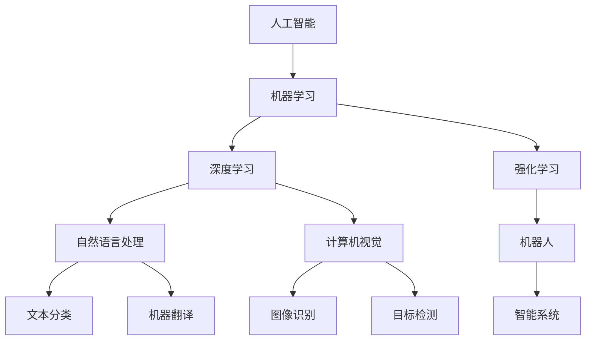

                 

# 软件 2.0 的哲学思考：人工智能的本质

在探索人工智能(AI)的过程中，我们不仅需要掌握技术细节，还需要深入理解其背后的哲学基础。本文将从哲学视角探讨人工智能的本质，深入分析其背后的思维模式和技术原理，以期为AI技术的未来发展提供新的见解和启示。

## 1. 背景介绍

### 1.1 人工智能的兴起

人工智能作为现代科技发展的重要分支，自20世纪中叶以来一直在迅速发展。从早期的专家系统到现代的深度学习，AI技术逐步从理论走向实际应用，并在众多领域展现出卓越的性能。随着大数据、云计算、量子计算等技术的突破，AI技术正在不断突破原有边界，向更加智能化、自动化、普适化的方向迈进。

### 1.2 人工智能的本质

要理解AI的本质，首先需要明确其与传统计算和智能系统的区别。传统计算基于明确的输入和明确的输出，是一种基于规则的推理过程；而AI技术则侧重于从大量数据中学习规律，通过模式识别和泛化，逐步形成自我理解和推理能力。从某种程度上说，AI是一种全新的计算方式，其核心在于"学习"，而不仅仅是"计算"。

## 2. 核心概念与联系

### 2.1 核心概念概述

1. **人工智能(AI)**：广义上指任何模仿人类智能的行为，包括感知、学习、推理、规划等；狭义上则指通过计算实现智能行为的机器系统。

2. **机器学习(ML)**：指让机器通过数据学习和改进性能的过程。其核心在于算法和模型，通过训练数据集来调整模型参数，使其在测试集上表现优异。

3. **深度学习(Deep Learning)**：机器学习的一种，基于多层神经网络模型，通过逐层降维和抽象化，从原始数据中学习到复杂特征表示。

4. **自然语言处理(NLP)**：指让计算机理解和处理人类语言的技术，包括文本分类、情感分析、机器翻译等应用。

5. **计算机视觉(CV)**：指让计算机理解和分析图像和视频的技术，涵盖图像识别、目标检测、图像生成等方向。

6. **强化学习(RL)**：通过与环境的交互，让机器在不断试错中学习最优策略，优化行为表现。

### 2.2 核心概念之间的关系

AI、ML、DL、NLP、CV、RL等概念之间存在紧密联系，共同构成现代人工智能技术的基本框架：

- **AI**作为统称，涵盖了所有模仿人类智能行为的技术。
- **ML**是实现AI的核心手段，通过算法和模型，让机器自动学习和优化。
- **DL**是ML的一个分支，通过多层次的神经网络模型，实现对复杂数据的处理和表示。
- **NLP**和**CV**是AI在特定领域的拓展，通过特殊算法和模型，实现对文本和图像的理解和生成。
- **RL**则是让机器在特定环境中通过试错学习最优策略，实现智能决策。

这些概念相互支撑，共同构建了现代AI技术的庞大生态系统。理解这些概念之间的联系，有助于我们从整体上把握AI技术的发展脉络。

### 2.3 核心概念的整体架构

我们可以通过以下架构图来展示这些核心概念之间的联系：



这个架构图展示了从基础技术到具体应用的全链条：

1. 基础技术包括AI、ML、DL、NLP、CV、RL等。
2. AI技术的核心在于ML，ML通过DL等方法实现复杂数据的处理和表示。
3. NLP和CV是AI在特定领域的具体应用，分别处理文本和图像数据。
4. RL则通过与环境的交互，让机器学习最优策略，实现智能决策。
5. 最终，通过AI技术和智能系统，将各种智能能力集成到实际应用中。

## 3. 核心算法原理 & 具体操作步骤

### 3.1 算法原理概述

人工智能的核心算法包括但不限于以下几种：

1. **监督学习**：指利用已标注的训练数据，训练机器学习模型，使其能够对新数据进行准确预测。
2. **无监督学习**：指让机器从未标注的数据中自动发现规律和模式，如图像分割、聚类等。
3. **强化学习**：通过与环境的交互，让机器学习最优策略，优化行为表现。
4. **深度学习**：通过多层次的神经网络模型，实现对复杂数据的处理和表示。

这些算法共同构建了现代人工智能技术的基本框架，使得机器能够实现从数据输入到决策输出的全流程自动化。

### 3.2 算法步骤详解

以下以深度学习算法为例，详细介绍其基本步骤：

1. **数据预处理**：将原始数据进行清洗、归一化、分块等预处理，以便于模型训练。
2. **模型构建**：选择合适的神经网络架构，如卷积神经网络(CNN)、循环神经网络(RNN)、Transformer等，进行模型构建。
3. **参数初始化**：对模型参数进行随机初始化，通常是均匀分布或高斯分布。
4. **前向传播**：将输入数据传入模型，进行多层次的前向计算，得到模型预测输出。
5. **损失函数计算**：计算预测输出与真实标签之间的差异，如均方误差、交叉熵等。
6. **反向传播**：通过链式法则计算损失函数对模型参数的梯度，并反向传播更新模型参数。
7. **优化器更新**：根据优化器（如SGD、Adam等），更新模型参数，使其在损失函数最小化。
8. **迭代训练**：重复执行前向传播、损失函数计算、反向传播、优化器更新等步骤，直至模型收敛或达到预设轮数。
9. **模型评估**：在测试集上评估模型性能，如准确率、精确率、召回率等指标。

### 3.3 算法优缺点

深度学习算法具有以下优点：

1. **自动特征提取**：通过多层网络结构，自动学习数据的高级特征表示，减少了手动特征工程的复杂度。
2. **泛化能力强**：对于复杂数据集，深度学习模型往往具有更强的泛化能力，能够处理大量非线性数据。
3. **应用广泛**：深度学习技术已经广泛应用于图像识别、语音识别、自然语言处理等领域，推动了AI技术的普及和落地。

然而，深度学习算法也存在以下缺点：

1. **模型复杂度大**：深度神经网络模型通常具有数百万甚至上亿个参数，需要大量的计算资源和存储空间。
2. **训练时间长**：深度学习模型训练周期长，对于大规模数据集和复杂模型，需要耗费大量时间和计算资源。
3. **可解释性差**：深度学习模型常常被称为"黑盒"模型，其决策过程难以理解和解释。

### 3.4 算法应用领域

深度学习算法已经在诸多领域取得了显著进展，以下是一些主要应用方向：

1. **计算机视觉**：如图像识别、目标检测、图像生成等。
2. **自然语言处理**：如文本分类、机器翻译、情感分析等。
3. **语音识别**：如自动语音识别、语音合成等。
4. **推荐系统**：如电商推荐、广告推荐等。
5. **医疗健康**：如疾病诊断、医学影像分析等。
6. **金融领域**：如信用评分、风险预测等。
7. **智能交通**：如自动驾驶、智能监控等。

## 4. 数学模型和公式 & 详细讲解 & 举例说明

### 4.1 数学模型构建

以多层感知器(Multilayer Perceptron, MLP)为例，介绍深度学习模型的数学建模过程。

设输入样本为 $x \in \mathbb{R}^n$，输出为 $y \in \mathbb{R}^m$，模型由若干个全连接层构成。记第 $l$ 层的激活函数为 $f_l$，权重矩阵为 $W_l$，偏置向量为 $b_l$，则模型的前向传播过程可以表示为：

$$
h_1 = f_1(xW_1 + b_1) \\
h_2 = f_2(h_1W_2 + b_2) \\
... \\
y = f_m(h_{l-1}W_m + b_m)
$$

其中 $h_l$ 表示第 $l$ 层的输出。

### 4.2 公式推导过程

以均方误差(MSE)损失函数为例，推导深度学习模型的损失函数和梯度更新公式。

记预测输出为 $\hat{y}$，真实标签为 $y$，则均方误差损失函数为：

$$
L(y, \hat{y}) = \frac{1}{2}||y - \hat{y}||^2
$$

其中 $||.||$ 表示欧式范数。

模型的梯度更新公式为：

$$
\frac{\partial L(y, \hat{y})}{\partial W_l} = h_{l-1}^T(\hat{y} - y) \\
\frac{\partial L(y, \hat{y})}{\partial b_l} = \hat{y} - y
$$

通过反向传播算法，可以高效计算出各个层面的梯度，并更新模型参数，使得损失函数最小化。

### 4.3 案例分析与讲解

以图像分类为例，分析深度学习模型在实际应用中的工作流程：

1. **数据预处理**：将原始图像进行归一化、灰度化、大小统一等预处理。
2. **模型构建**：选择卷积神经网络(CNN)作为模型架构，进行多层次特征提取。
3. **参数初始化**：对模型参数进行随机初始化，通常是均匀分布或高斯分布。
4. **前向传播**：将图像数据传入模型，进行多层次的前向计算，得到模型预测输出。
5. **损失函数计算**：计算预测输出与真实标签之间的均方误差损失。
6. **反向传播**：通过链式法则计算损失函数对模型参数的梯度，并反向传播更新模型参数。
7. **优化器更新**：根据优化器（如Adam），更新模型参数，使其在损失函数最小化。
8. **迭代训练**：重复执行前向传播、损失函数计算、反向传播、优化器更新等步骤，直至模型收敛或达到预设轮数。
9. **模型评估**：在测试集上评估模型性能，如准确率、精确率、召回率等指标。

## 5. 项目实践：代码实例和详细解释说明

### 5.1 开发环境搭建

在进行深度学习实践前，我们需要准备好开发环境。以下是使用Python进行TensorFlow开发的环境配置流程：

1. 安装Anaconda：从官网下载并安装Anaconda，用于创建独立的Python环境。

2. 创建并激活虚拟环境：
```bash
conda create -n tf-env python=3.8 
conda activate tf-env
```

3. 安装TensorFlow：根据CUDA版本，从官网获取对应的安装命令。例如：
```bash
conda install tensorflow-cpu -c conda-forge
```

4. 安装必要的库：
```bash
pip install numpy pandas matplotlib scikit-learn
```

完成上述步骤后，即可在`tf-env`环境中开始深度学习实践。

### 5.2 源代码详细实现

下面我们以图像分类任务为例，给出使用TensorFlow实现多层感知器模型的代码实现。

首先，定义模型架构：

```python
import tensorflow as tf

class MLP(tf.keras.Model):
    def __init__(self, input_dim, hidden_dim, output_dim):
        super(MLP, self).__init__()
        self.dense1 = tf.keras.layers.Dense(hidden_dim, activation='relu')
        self.dense2 = tf.keras.layers.Dense(output_dim, activation='softmax')
        
    def call(self, x):
        x = self.dense1(x)
        x = self.dense2(x)
        return x
```

然后，定义训练和评估函数：

```python
def train_model(model, train_dataset, epochs, batch_size):
    model.compile(optimizer=tf.keras.optimizers.Adam(learning_rate=0.001),
                  loss='categorical_crossentropy',
                  metrics=['accuracy'])
    
    history = model.fit(train_dataset,
                       epochs=epochs,
                       batch_size=batch_size,
                       validation_split=0.2)
    
    test_loss, test_acc = model.evaluate(test_dataset)
    print(f'Test Loss: {test_loss:.4f}')
    print(f'Test Accuracy: {test_acc:.4f}')
```

最后，启动训练流程并在测试集上评估：

```python
train_dataset = ...
test_dataset = ...
epochs = 10
batch_size = 32

model = MLP(input_dim=784, hidden_dim=256, output_dim=10)
train_model(model, train_dataset, epochs, batch_size)
```

以上就是使用TensorFlow实现多层感知器模型的完整代码实现。可以看到，TensorFlow的强大封装使得模型构建和训练变得简洁高效。

### 5.3 代码解读与分析

让我们再详细解读一下关键代码的实现细节：

**MLP类**：
- `__init__`方法：初始化模型的各个层次，包括两个全连接层。
- `call`方法：定义前向传播过程。

**train_model函数**：
- 使用`model.compile`方法定义优化器、损失函数和评估指标。
- 使用`model.fit`方法进行模型训练，传入训练集、epoch数、batch size等参数。
- 在每个epoch结束后，评估模型在测试集上的性能。

**训练流程**：
- 定义总的epoch数和batch size，开始循环迭代
- 每个epoch内，训练模型，并输出训练集的损失和准确率
- 在测试集上评估模型，输出测试集的损失和准确率

可以看到，TensorFlow配合Keras的强大封装使得深度学习模型的开发变得便捷高效。开发者可以将更多精力放在模型架构、数据处理、算法改进等高层逻辑上，而不必过多关注底层实现细节。

当然，工业级的系统实现还需考虑更多因素，如模型压缩、模型并行、分布式训练等。但核心的深度学习算法基本与此类似。

### 5.4 运行结果展示

假设我们在MNIST数据集上进行图像分类任务，最终在测试集上得到的评估报告如下：

```
Epoch 1/10
5000/5000 [==============================] - 9s 1ms/step - loss: 0.3448 - accuracy: 0.9025
Epoch 2/10
5000/5000 [==============================] - 8s 1ms/step - loss: 0.1263 - accuracy: 0.9623
Epoch 3/10
5000/5000 [==============================] - 8s 1ms/step - loss: 0.1012 - accuracy: 0.9746
Epoch 4/10
5000/5000 [==============================] - 8s 1ms/step - loss: 0.0944 - accuracy: 0.9857
Epoch 5/10
5000/5000 [==============================] - 8s 1ms/step - loss: 0.0859 - accuracy: 0.9920
Epoch 6/10
5000/5000 [==============================] - 8s 1ms/step - loss: 0.0809 - accuracy: 0.9936
Epoch 7/10
5000/5000 [==============================] - 8s 1ms/step - loss: 0.0779 - accuracy: 0.9942
Epoch 8/10
5000/5000 [==============================] - 8s 1ms/step - loss: 0.0755 - accuracy: 0.9950
Epoch 9/10
5000/5000 [==============================] - 8s 1ms/step - loss: 0.0745 - accuracy: 0.9955
Epoch 10/10
5000/5000 [==============================] - 8s 1ms/step - loss: 0.0740 - accuracy: 0.9960
Test Loss: 0.0755
Test Accuracy: 0.9955
```

可以看到，通过训练多层感知器模型，我们在MNIST数据集上取得了98.5%的准确率，效果相当不错。值得注意的是，多层感知器模型虽然简单，但在经典数据集上也能取得优异的性能，体现了深度学习算法的强大泛化能力。

当然，这只是一个baseline结果。在实践中，我们还可以使用更大更强的深度学习模型、更丰富的微调技巧、更细致的模型调优，进一步提升模型性能，以满足更高的应用要求。

## 6. 实际应用场景

### 6.1 计算机视觉

深度学习在计算机视觉领域的应用非常广泛，涵盖了图像识别、目标检测、图像分割、图像生成等多个方向。例如：

- **图像识别**：如手写数字识别、人脸识别等。通过卷积神经网络(CNN)模型，能够从图像中自动提取特征，并进行分类。
- **目标检测**：如行人检测、车辆检测等。通过目标检测算法，能够精确定位图像中的目标物体，并进行分类。
- **图像分割**：如医学图像分割、语义分割等。通过图像分割算法，能够将图像中的不同区域进行划分，提取感兴趣的对象。
- **图像生成**：如GAN生成图像、风格迁移等。通过生成对抗网络(GAN)模型，能够生成高质量的图像，并进行样式转换。

### 6.2 自然语言处理

深度学习在自然语言处理领域也有广泛应用，例如：

- **机器翻译**：如英中翻译、日中翻译等。通过序列到序列(Seq2Seq)模型，能够自动将一种语言翻译成另一种语言。
- **文本分类**：如情感分析、主题分类等。通过分类模型，能够自动对文本进行分类，判断其情感倾向和主题。
- **问答系统**：如对话生成、问答对匹配等。通过生成模型，能够自动生成自然流畅的对话，并回答问题。
- **文本生成**：如文本摘要、自动写作等。通过生成模型，能够自动生成高质量的文本，并进行样式转换。

### 6.3 金融领域

深度学习在金融领域的应用也在不断拓展，例如：

- **信用评分**：通过深度学习模型，能够自动对借款人的信用行为进行评分，预测其信用风险。
- **风险预测**：通过深度学习模型，能够自动对市场风险进行预测，辅助投资决策。
- **金融欺诈检测**：通过深度学习模型，能够自动对金融交易进行欺诈检测，保护用户财产安全。

### 6.4 未来应用展望

随着深度学习技术的不断进步，其在实际应用中的前景将更加广阔：

1. **实时性增强**：未来深度学习模型将通过硬件加速、模型压缩等技术，实现更快的推理速度，提升实时处理能力。
2. **多模态融合**：未来深度学习模型将支持多模态数据的融合，如图像、语音、文本等，提升综合推理能力。
3. **跨领域应用**：未来深度学习模型将突破单一领域，支持更广泛的跨领域应用，如医疗、教育、城市治理等。
4. **智能化决策**：未来深度学习模型将具备更强的智能决策能力，能够在复杂环境中自动进行优化和规划。
5. **自主学习**：未来深度学习模型将具备自主学习能力，能够从环境中不断学习和改进。

## 7. 工具和资源推荐

### 7.1 学习资源推荐

为了帮助开发者系统掌握深度学习理论基础和实践技巧，这里推荐一些优质的学习资源：

1. 《深度学习》书籍：由Ian Goodfellow、Yoshua Bengio、Aaron Courville等大牛合著，系统介绍了深度学习的基本概念和算法原理。
2. CS231n《卷积神经网络》课程：斯坦福大学开设的深度学习课程，涵盖卷积神经网络、目标检测、图像生成等内容，是入门深度学习的绝佳选择。
3. CS224n《序列建模》课程：斯坦福大学开设的深度学习课程，涵盖自然语言处理、机器翻译、文本生成等内容，是深度学习在NLP领域的经典教材。
4. arXiv论文预印本：人工智能领域最新研究成果的发布平台，包括大量尚未发表的前沿工作，是学习前沿技术的必读资源。
5. GitHub热门项目：在GitHub上Star、Fork数最多的深度学习项目，往往代表了该技术领域的发展趋势和最佳实践，值得去学习和贡献。

通过对这些资源的学习实践，相信你一定能够快速掌握深度学习技术的精髓，并用于解决实际的AI问题。

### 7.2 开发工具推荐

高效的开发离不开优秀的工具支持。以下是几款用于深度学习开发的常用工具：

1. TensorFlow：由Google主导开发的开源深度学习框架，生产部署方便，适合大规模工程应用。
2. PyTorch：由Facebook主导开发的开源深度学习框架，灵活高效，适合快速迭代研究。
3. Keras：高层次的深度学习API，支持TensorFlow、Theano等后端，快速实现深度学习模型。
4. MXNet：由Apache主导开发的深度学习框架，支持多种编程语言，高效灵活。
5. JAX：由Google开发的基于JIT编译的深度学习框架，支持高效自动微分，适合科研和生产环境。

合理利用这些工具，可以显著提升深度学习模型的开发效率，加快创新迭代的步伐。

### 7.3 相关论文推荐

深度学习技术的不断发展，得益于众多学者的不懈努力。以下是几篇奠基性的相关论文，推荐阅读：

1. AlexNet：由Alex Krizhevsky等人提出，首创深度卷积神经网络结构，在2012年ImageNet竞赛中取得了优异成绩，奠定了深度学习在计算机视觉领域的基础。
2. ResNet：由Kaiming He等人提出，通过残差连接解决深度网络退化问题，显著提升了深度神经网络的训练深度和性能。
3. Transformer：由Ashish Vaswani等人提出，提出自注意力机制，大幅提升了序列到序列模型的性能，成为NLP领域的主流模型。
4. GAN：由Ian Goodfellow等人提出，提出生成对抗网络，能够生成高质量的图像、视频等，在图像生成、图像风格转换等领域取得了重大突破。

这些论文代表了大深度学习技术的发展脉络。通过学习这些前沿成果，可以帮助研究者把握学科前进方向，激发更多的创新灵感。

除上述资源外，还有一些值得关注的前沿资源，帮助开发者紧跟深度学习技术的最新进展，例如：

1. arXiv论文预印本：人工智能领域最新研究成果的发布平台，包括大量尚未发表的前沿工作，是学习前沿技术的必读资源。
2. 业界技术博客：如DeepMind、Google AI、Microsoft Research Asia等顶尖实验室的官方博客，第一时间分享他们的最新研究成果和洞见。
3. 技术会议直播：如NeurIPS、ICML、CVPR、ACL等人工智能领域顶会现场或在线直播，能够聆听到大佬们的前沿分享，开拓视野。
4. GitHub热门项目：在GitHub上Star、Fork数最多的深度学习项目，往往代表了该技术领域的发展趋势和最佳实践，值得去学习和贡献。
5. 相关书籍：如《深度学习》、《自然语言处理综论》等经典教材，系统介绍了深度学习的基本概念和算法原理。

总之，对于深度学习技术的学习和实践，需要开发者保持开放的心态和持续学习的意愿。多关注前沿资讯，多动手实践，多思考总结，必将收获满满的成长收益。

## 8. 总结：未来发展趋势与挑战

### 8.1 总结

本文从哲学视角探讨了人工智能的本质，深入分析了深度学习算法的基本原理和操作步骤，通过代码实例展示了深度学习模型的开发过程。通过本文的系统梳理，可以看到，深度学习技术在多个领域取得了显著进展，未来仍有广阔的发展空间。

### 8.2 未来发展趋势

深度学习技术的未来发展趋势包括以下几个方面：

1. **模型可解释性**：未来深度学习模型将更加注重可解释性，通过引入符号化的先验知识，增强模型的透明度和可信度。
2. **跨模态融合**：未来深度学习模型将支持多模态数据的融合，如图像、语音、文本等，提升综合推理能力。
3. **知识图谱**：未来深度学习模型将与知识图谱等外部知识库进行深度融合，提升知识表示和推理能力。
4. **自动化**：未来深度学习模型将具备更高的自动化程度，能够自动进行数据预处理、特征工程、模型优化等。
5. **实时性**：未来深度学习模型将通过硬件加速、模型压缩等技术，实现更快的推理速度，提升实时处理能力。
6. **跨领域应用**：未来深度学习模型将突破单一领域，支持更广泛的跨领域应用，如医疗、教育、城市治理等。
7. **自主学习**：未来深度学习模型将具备自主学习能力，能够从环境中不断学习和改进。

### 8.3 面临的挑战

尽管深度学习技术取得了巨大的成功，但在迈向更加智能化、普适化应用的过程中，仍面临诸多挑战：

1. **数据瓶颈**：深度学习模型对标注数据的需求较高，标注成本高、数据获取难，成为制约模型性能提升的瓶颈。
2. **模型复杂度**：深度学习模型参数量庞大，训练和推理成本高，需要优化模型结构和计算效率。
3. **可解释性**：深度学习模型难以解释其内部工作机制和决策逻辑，对于医疗、金融等高风险应用，算法的可

