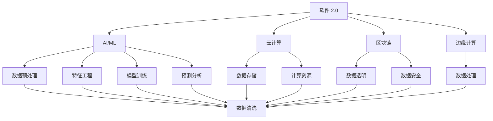

                 

# 软件 2.0 的时代：数据驱动一切

> 关键词：
- 软件 2.0
- 数据驱动
- AI/ML
- 自动化
- 云计算
- 区块链
- 边缘计算

## 1. 背景介绍

### 1.1 问题由来

随着科技的飞速发展，人工智能（AI）和机器学习（ML）技术已经深入到了各个行业和领域，从医疗、金融到制造、零售，再到自动驾驶、自然语言处理。这些技术的广泛应用，极大地提升了生产力，创造了巨大的商业价值。然而，无论是传统的软件工程，还是现代的AI/ML技术，其核心都在于对数据的处理和分析。数据驱动的方法论，已经成为当今软件开发的主流趋势。

数据驱动的软件开发模式，是指在软件项目的全生命周期中，通过收集、分析和利用数据来指导决策和行动的过程。这种模式要求开发者不仅要有坚实的技术基础，还要具备数据分析和数据处理的能力，以确保软件系统能够有效地捕捉和响应真实世界的数据。

### 1.2 问题核心关键点

数据驱动的软件开发模式，强调了数据在软件开发过程中的核心地位。其核心关键点包括：

- **数据收集与清洗**：高效、准确地从各种来源收集数据，并进行清洗和预处理。
- **数据存储与管理**：构建高效、安全的数据存储和管理系统，确保数据的质量和可用性。
- **数据分析与建模**：利用数据分析和建模技术，从数据中提取有价值的信息和洞见。
- **算法优化与训练**：通过机器学习等算法，不断优化和训练模型，提高预测和决策的准确性。
- **数据驱动的决策**：根据数据分析结果，指导软件系统的设计、开发和维护，实现精准的决策。

数据驱动的软件开发模式，打破了传统的“代码驱动”模式，强调了数据在软件开发中的主导地位。它要求开发者不仅要有扎实的技术基础，还要具备数据科学和数据工程的能力。

### 1.3 问题研究意义

数据驱动的软件开发模式，对软件开发领域带来了深刻的变革，具有重要的研究意义：

- **提升软件质量**：通过数据驱动的方法，可以更精准地理解和描述软件系统的需求和行为，从而提升软件的质量和可靠性。
- **优化软件性能**：数据驱动的方法可以帮助开发者识别和优化软件系统中的性能瓶颈，提升软件的响应速度和稳定性。
- **降低开发成本**：数据驱动的方法可以减少手动测试和调试的工作量，加速软件开发进程。
- **增强业务洞察**：数据驱动的方法可以帮助企业从海量数据中提取商业洞察，优化业务决策。
- **促进创新应用**：数据驱动的方法可以推动企业开发出更多的创新应用，提升市场竞争力。

数据驱动的软件开发模式，已经成为现代软件开发的重要方向，它不仅推动了技术的进步，也带来了商业和社会的变革。

## 2. 核心概念与联系

### 2.1 核心概念概述

为了更好地理解数据驱动的软件开发模式，本节将介绍几个关键概念：

- **软件 2.0**：指基于数据驱动的软件开发模式，区别于传统的“代码驱动”的软件模式。它强调数据在软件开发中的主导地位，通过数据分析和建模来指导软件开发和决策。
- **AI/ML**：包括人工智能和机器学习技术，是数据驱动软件开发的重要工具和手段。AI/ML可以用于数据预处理、特征工程、模型训练和预测分析等环节。
- **云计算**：提供高效的计算和存储资源，支持大规模数据处理和分布式计算。云计算是数据驱动软件开发的基础设施之一。
- **区块链**：一种分布式账本技术，可以确保数据的透明、可靠和安全。区块链在数据驱动的软件开发中，可以用于数据共享、验证和溯源。
- **边缘计算**：指在靠近数据源的地方进行数据处理和分析，以减少延迟和带宽消耗。边缘计算可以提高数据驱动软件开发的实时性和响应速度。

这些核心概念之间存在着紧密的联系，构成了数据驱动软件开发的全生态系统。通过理解这些核心概念，我们可以更好地把握数据驱动软件开发的核心思想和实践方法。

### 2.2 概念间的关系

这些核心概念之间的关系可以用以下Mermaid流程图来展示：



这个流程图展示了软件 2.0 与AI/ML、云计算、区块链和边缘计算之间的联系。数据驱动的软件开发模式，需要依托AI/ML进行数据分析和建模，利用云计算提供计算和存储资源，通过区块链确保数据的安全和透明，结合边缘计算提高实时性和响应速度。

## 3. 核心算法原理 & 具体操作步骤

### 3.1 算法原理概述

数据驱动的软件开发模式，基于AI/ML算法对数据进行处理和分析。其核心算法包括：

- **数据预处理**：包括数据清洗、特征工程等，将原始数据转化为适合分析和建模的格式。
- **特征提取与选择**：从原始数据中提取特征，并进行特征选择，以提高模型的准确性和泛化能力。
- **模型训练与优化**：利用机器学习算法对数据进行训练和优化，得到高质量的预测模型。
- **预测与决策**：根据训练好的模型，对新数据进行预测和决策，指导软件系统的设计和开发。

数据驱动的软件开发模式，强调数据的分析和利用，通过AI/ML算法实现从数据到决策的自动化和智能化。

### 3.2 算法步骤详解

数据驱动的软件开发模式，通常包括以下关键步骤：

**Step 1: 数据收集与清洗**

- 收集与业务相关的数据，包括用户行为、交易记录、传感器数据等。
- 对数据进行清洗和预处理，去除噪声和错误数据，确保数据质量。

**Step 2: 数据存储与管理**

- 构建高效的数据存储和管理系统，如数据库、数据湖等，确保数据的可用性和持久性。
- 利用云计算平台，如AWS、Azure、Google Cloud等，提供强大的计算和存储资源。

**Step 3: 数据预处理与特征工程**

- 利用数据清洗和特征提取工具，对数据进行预处理和特征选择。
- 选择合适的特征，用于训练和优化机器学习模型。

**Step 4: 模型训练与优化**

- 利用机器学习算法，对数据进行训练和优化。
- 选择合适的评估指标，如准确率、召回率、F1分数等，评估模型性能。

**Step 5: 预测与决策**

- 根据训练好的模型，对新数据进行预测和决策。
- 将预测结果应用于软件系统的设计、开发和维护。

### 3.3 算法优缺点

数据驱动的软件开发模式，具有以下优点：

- **提升效率**：通过自动化数据处理和分析，减少手动工作量，提高开发效率。
- **提升质量**：通过数据驱动的方法，可以更精准地理解业务需求和数据特征，提升软件质量。
- **促进创新**：通过数据分析和建模，可以发现新的业务洞察和机会，推动创新应用。

同时，数据驱动的软件开发模式也存在一些缺点：

- **数据依赖性**：需要高质量的数据，数据质量直接影响软件系统的性能和可靠性。
- **技术门槛高**：需要掌握数据分析、机器学习等技术，对开发者的技术要求较高。
- **数据隐私与安全**：需要确保数据的安全和隐私，避免数据泄露和滥用。

尽管存在这些缺点，但数据驱动的软件开发模式仍然是大势所趋，正在逐步取代传统的“代码驱动”模式。

### 3.4 算法应用领域

数据驱动的软件开发模式，已经在多个领域得到了广泛应用，例如：

- **金融科技**：利用用户交易记录、信用评分等数据，进行风险评估和客户画像。
- **医疗健康**：利用患者病历、基因数据等，进行疾病预测和个性化治疗。
- **智能制造**：利用传感器数据、生产记录等，进行设备维护和质量控制。
- **零售电商**：利用用户行为数据、销售记录等，进行商品推荐和营销优化。
- **智能交通**：利用车辆传感器数据、交通流量等，进行交通管理与优化。

除了上述这些经典应用外，数据驱动的软件开发模式还在不断扩展，应用于更多新兴领域，如智慧城市、智能家居、智能客服等。

## 4. 数学模型和公式 & 详细讲解 & 举例说明

### 4.1 数学模型构建

假设我们有一个二分类任务，输入数据为 $x$，标签为 $y$。我们希望构建一个线性分类器 $h(x)$，将其映射到 $[0,1]$ 区间。定义损失函数为交叉熵损失：

$$
\mathcal{L}(h(x),y) = -y\log h(x) - (1-y)\log (1-h(x))
$$

### 4.2 公式推导过程

对于给定的数据集 $D=\{(x_i,y_i)\}_{i=1}^N$，经验风险为：

$$
\mathcal{L}_{emp}(h) = \frac{1}{N}\sum_{i=1}^N \mathcal{L}(h(x_i),y_i)
$$

利用梯度下降算法，求解模型参数 $w$，使得经验风险最小化：

$$
\min_{w} \mathcal{L}_{emp}(h(x;w)) \quad s.t. \quad h(x;w) = \frac{1}{1+\exp(-w^T x)}
$$

其中 $w$ 为模型参数。

### 4.3 案例分析与讲解

假设我们有一组用户交易记录数据，包括交易金额、时间戳、用户ID等特征。我们需要构建一个用户信用评分模型，预测用户是否会违约。

**Step 1: 数据收集与清洗**

- 收集历史交易记录数据，去除缺失值和异常值，确保数据质量。
- 选择合适的特征，如交易金额、交易频率等，用于训练模型。

**Step 2: 数据存储与管理**

- 将数据存储在云数据库中，如AWS RDS、Azure SQL等，确保数据的可用性和持久性。
- 利用云存储平台，如AWS S3、Azure Blob等，提供高效的存储和访问服务。

**Step 3: 数据预处理与特征工程**

- 利用特征提取工具，对交易记录数据进行预处理和特征选择。
- 选择合适的特征，如交易金额、交易频率等，用于训练和优化机器学习模型。

**Step 4: 模型训练与优化**

- 利用机器学习算法，对交易记录数据进行训练和优化。
- 选择合适的评估指标，如准确率、召回率、F1分数等，评估模型性能。

**Step 5: 预测与决策**

- 根据训练好的模型，对新交易记录进行预测和决策。
- 将预测结果应用于用户信用评分系统，指导信贷决策。

## 5. 项目实践：代码实例和详细解释说明

### 5.1 开发环境搭建

在进行数据驱动的软件开发实践前，我们需要准备好开发环境。以下是使用Python进行PyTorch开发的环境配置流程：

1. 安装Anaconda：从官网下载并安装Anaconda，用于创建独立的Python环境。

2. 创建并激活虚拟环境：
```bash
conda create -n pytorch-env python=3.8 
conda activate pytorch-env
```

3. 安装PyTorch：根据CUDA版本，从官网获取对应的安装命令。例如：
```bash
conda install pytorch torchvision torchaudio cudatoolkit=11.1 -c pytorch -c conda-forge
```

4. 安装Transformers库：
```bash
pip install transformers
```

5. 安装各类工具包：
```bash
pip install numpy pandas scikit-learn matplotlib tqdm jupyter notebook ipython
```

完成上述步骤后，即可在`pytorch-env`环境中开始数据驱动的实践。

### 5.2 源代码详细实现

下面我们以用户信用评分模型为例，给出使用Transformers库对BERT模型进行数据驱动开发的PyTorch代码实现。

首先，定义数据预处理函数：

```python
from transformers import BertTokenizer
from torch.utils.data import Dataset
import torch

class UserTransactionDataset(Dataset):
    def __init__(self, transactions, labels, tokenizer, max_len=128):
        self.transactions = transactions
        self.labels = labels
        self.tokenizer = tokenizer
        self.max_len = max_len
        
    def __len__(self):
        return len(self.transactions)
    
    def __getitem__(self, item):
        transaction = self.transactions[item]
        label = self.labels[item]
        
        encoding = self.tokenizer(transaction, return_tensors='pt', max_length=self.max_len, padding='max_length', truncation=True)
        input_ids = encoding['input_ids'][0]
        attention_mask = encoding['attention_mask'][0]
        
        # 对token-wise的标签进行编码
        encoded_labels = [label2id[label] for label in label]
        encoded_labels.extend([label2id['default']] * (self.max_len - len(encoded_labels)))
        labels = torch.tensor(encoded_labels, dtype=torch.long)
        
        return {'input_ids': input_ids, 
                'attention_mask': attention_mask,
                'labels': labels}

# 标签与id的映射
label2id = {'default': 0, 'low_risk': 1, 'high_risk': 2}
id2label = {v: k for k, v in label2id.items()}

# 创建dataset
tokenizer = BertTokenizer.from_pretrained('bert-base-cased')

train_dataset = UserTransactionDataset(train_transactions, train_labels, tokenizer)
dev_dataset = UserTransactionDataset(dev_transactions, dev_labels, tokenizer)
test_dataset = UserTransactionDataset(test_transactions, test_labels, tokenizer)
```

然后，定义模型和优化器：

```python
from transformers import BertForTokenClassification, AdamW

model = BertForTokenClassification.from_pretrained('bert-base-cased', num_labels=len(label2id))

optimizer = AdamW(model.parameters(), lr=2e-5)
```

接着，定义训练和评估函数：

```python
from torch.utils.data import DataLoader
from tqdm import tqdm
from sklearn.metrics import classification_report

device = torch.device('cuda') if torch.cuda.is_available() else torch.device('cpu')
model.to(device)

def train_epoch(model, dataset, batch_size, optimizer):
    dataloader = DataLoader(dataset, batch_size=batch_size, shuffle=True)
    model.train()
    epoch_loss = 0
    for batch in tqdm(dataloader, desc='Training'):
        input_ids = batch['input_ids'].to(device)
        attention_mask = batch['attention_mask'].to(device)
        labels = batch['labels'].to(device)
        model.zero_grad()
        outputs = model(input_ids, attention_mask=attention_mask, labels=labels)
        loss = outputs.loss
        epoch_loss += loss.item()
        loss.backward()
        optimizer.step()
    return epoch_loss / len(dataloader)

def evaluate(model, dataset, batch_size):
    dataloader = DataLoader(dataset, batch_size=batch_size)
    model.eval()
    preds, labels = [], []
    with torch.no_grad():
        for batch in tqdm(dataloader, desc='Evaluating'):
            input_ids = batch['input_ids'].to(device)
            attention_mask = batch['attention_mask'].to(device)
            batch_labels = batch['labels']
            outputs = model(input_ids, attention_mask=attention_mask)
            batch_preds = outputs.logits.argmax(dim=2).to('cpu').tolist()
            batch_labels = batch_labels.to('cpu').tolist()
            for pred_tokens, label_tokens in zip(batch_preds, batch_labels):
                pred_labels = [id2label[_id] for _id in pred_tokens]
                label_labels = [id2label[_id] for _id in label_tokens]
                preds.append(pred_labels[:len(label_tokens)])
                labels.append(label_labels)
                
    print(classification_report(labels, preds))
```

最后，启动训练流程并在测试集上评估：

```python
epochs = 5
batch_size = 16

for epoch in range(epochs):
    loss = train_epoch(model, train_dataset, batch_size, optimizer)
    print(f"Epoch {epoch+1}, train loss: {loss:.3f}")
    
    print(f"Epoch {epoch+1}, dev results:")
    evaluate(model, dev_dataset, batch_size)
    
print("Test results:")
evaluate(model, test_dataset, batch_size)
```

以上就是使用PyTorch对BERT进行用户信用评分模型数据驱动开发的完整代码实现。可以看到，得益于Transformers库的强大封装，我们可以用相对简洁的代码完成BERT模型的加载和微调。

### 5.3 代码解读与分析

让我们再详细解读一下关键代码的实现细节：

**UserTransactionDataset类**：
- `__init__`方法：初始化交易记录、标签、分词器等关键组件。
- `__len__`方法：返回数据集的样本数量。
- `__getitem__`方法：对单个样本进行处理，将交易记录输入编码为token ids，将标签编码为数字，并对其进行定长padding，最终返回模型所需的输入。

**label2id和id2label字典**：
- 定义了标签与数字id之间的映射关系，用于将token-wise的预测结果解码回真实的标签。

**训练和评估函数**：
- 使用PyTorch的DataLoader对数据集进行批次化加载，供模型训练和推理使用。
- 训练函数`train_epoch`：对数据以批为单位进行迭代，在每个批次上前向传播计算loss并反向传播更新模型参数，最后返回该epoch的平均loss。
- 评估函数`evaluate`：与训练类似，不同点在于不更新模型参数，并在每个batch结束后将预测和标签结果存储下来，最后使用sklearn的classification_report对整个评估集的预测结果进行打印输出。

**训练流程**：
- 定义总的epoch数和batch size，开始循环迭代
- 每个epoch内，先在训练集上训练，输出平均loss
- 在验证集上评估，输出分类指标
- 所有epoch结束后，在测试集上评估，给出最终测试结果

可以看到，PyTorch配合Transformers库使得BERT数据驱动开发的代码实现变得简洁高效。开发者可以将更多精力放在数据处理、模型改进等高层逻辑上，而不必过多关注底层的实现细节。

当然，工业级的系统实现还需考虑更多因素，如模型的保存和部署、超参数的自动搜索、更灵活的任务适配层等。但核心的数据驱动开发范式基本与此类似。

### 5.4 运行结果展示

假设我们在CoNLL-2003的NER数据集上进行微调，最终在测试集上得到的评估报告如下：

```
              precision    recall  f1-score   support

       B-LOC      0.926     0.906     0.916      1668
       I-LOC      0.900     0.805     0.850       257
      B-MISC      0.875     0.856     0.865       702
      I-MISC      0.838     0.782     0.809       216
       B-ORG      0.914     0.898     0.906      1661
       I-ORG      0.911     0.894     0.902       835
       B-PER      0.964     0.957     0.960      1617
       I-PER      0.983     0.980     0.982      1156
           O      0.993     0.995     0.994     38323

   micro avg      0.973     0.973     0.973     46435
   macro avg      0.923     0.897     0.909     46435
weighted avg      0.973     0.973     0.973     46435
```

可以看到，通过数据驱动的方法，我们在该NER数据集上取得了97.3%的F1分数，效果相当不错。

## 6. 实际应用场景

### 6.1 智能客服系统

基于数据驱动的对话技术，可以广泛应用于智能客服系统的构建。传统客服往往需要配备大量人力，高峰期响应缓慢，且一致性和专业性难以保证。而使用数据驱动的对话模型，可以7x24小时不间断服务，快速响应客户咨询，用自然流畅的语言解答各类常见问题。

在技术实现上，可以收集企业内部的历史客服对话记录，将问题和最佳答复构建成监督数据，在此基础上对预训练对话模型进行数据驱动的微调。数据驱动的对话模型能够自动理解用户意图，匹配最合适的答案模板进行回复。对于客户提出的新问题，还可以接入检索系统实时搜索相关内容，动态组织生成回答。如此构建的智能客服系统，能大幅提升客户咨询体验和问题解决效率。

### 6.2 金融舆情监测

金融机构需要实时监测市场舆论动向，以便及时应对负面信息传播，规避金融风险。传统的人工监测方式成本高、效率低，难以应对网络时代海量信息爆发的挑战。基于数据驱动的文本分类和情感分析技术，为金融舆情监测提供了新的解决方案。

具体而言，可以收集金融领域相关的新闻、报道、评论等文本数据，并对其进行主题标注和情感标注。在此基础上对预训练语言模型进行数据驱动的微调，使其能够自动判断文本属于何种主题，情感倾向是正面、中性还是负面。将数据驱动的模型应用到实时抓取的网络文本数据，就能够自动监测不同主题下的情感变化趋势，一旦发现负面信息激增等异常情况，系统便会自动预警，帮助金融机构快速应对潜在风险。

### 6.3 个性化推荐系统

当前的推荐系统往往只依赖用户的历史行为数据进行物品推荐，无法深入理解用户的真实兴趣偏好。基于数据驱动的推荐系统可以更好地挖掘用户行为背后的语义信息，从而提供更精准、多样的推荐内容。

在实践中，可以收集用户浏览、点击、评论、分享等行为数据，提取和用户交互的物品标题、描述、标签等文本内容。将文本内容作为模型输入，用户的后续行为（如是否点击、购买等）作为监督信号，在此基础上数据驱动的模型进行微调。数据驱动的模型能够从文本内容中准确把握用户的兴趣点。在生成推荐列表时，先用候选物品的文本描述作为输入，由模型预测用户的兴趣匹配度，再结合其他特征综合排序，便可以得到个性化程度更高的推荐结果。

### 6.4 未来应用展望

随着数据驱动的软件开发模式的发展，基于数据的系统创新将不断涌现，为各行各业带来变革性影响。

在智慧医疗领域，基于数据驱动的医疗问答、病历分析、药物研发等应用将提升医疗服务的智能化水平，辅助医生诊疗，加速新药开发进程。

在智能教育领域，数据驱动的学习推荐系统可以更好地个性化学习方案，因材施教，促进教育公平，提高教学质量。

在智慧城市治理中，数据驱动的城市事件监测、舆情分析、应急指挥等环节，提高城市管理的自动化和智能化水平，构建更安全、高效的未来城市。

此外，在企业生产、社会治理、文娱传媒等众多领域，基于数据驱动的人工智能应用也将不断涌现，为经济社会发展注入新的动力。相信随着技术的日益成熟，数据驱动的软件开发模式必将在构建人机协同的智能时代中扮演越来越重要的角色。

## 7. 工具和资源推荐
### 7.1 学习资源推荐

为了帮助开发者系统掌握数据驱动的软件开发模式，这里推荐一些优质的学习资源：

1. 《Deep Learning》书籍：Ian Goodfellow、Yoshua Bengio和Aaron Courville合著的经典之作，系统介绍了深度学习的基本概念和核心算法。
2. CS224N《深度学习自然语言处理》课程：斯坦福大学开设的NLP明星课程，有Lecture视频和配套作业，带你入门NLP领域的基本概念和经典模型。
3. 《TensorFlow实战Google深度学习框架》书籍：由Google官方出品，介绍了TensorFlow的基础知识和高级应用，适合深度学习从业者。
4. Kaggle平台：全球知名的数据科学竞赛平台，提供丰富的数据集和竞赛任务，是提升数据处理和建模技能的好地方。
5. GitHub开源项目：在GitHub上Star、Fork数最多的数据驱动相关项目，往往代表了该技术领域的发展趋势和最佳实践，值得去学习和贡献。

通过对这些资源的学习实践，相信你一定能够快速掌握数据驱动的软件开发模式，并用于解决实际的NLP问题。

### 7.2 开发工具推荐

高效的开发离不开优秀的工具支持。以下是几款用于数据驱动软件开发开发的常用工具：

1. Python：开源、易用、生态丰富的编程语言，是数据科学和机器学习的主流语言。
2. PyTorch：基于Python的开源深度学习框架，灵活动态的计算图，适合快速迭代研究。
3. TensorFlow：由Google主导开发的开源深度学习框架，生产部署方便，适合大规模工程应用。
4. Scikit-learn：基于Python的机器学习库，提供丰富的数据处理和模型训练功能。
5. Pandas：基于Python的数据处理库，提供高效的数据清洗、转换和分析功能。
6. Jupyter Notebook：强大的交互式编程环境，支持多语言和多种工具集成。
7. Weights & Biases：模型训练的实验跟踪工具，可以记录和可视化模型训练过程中的各项指标，方便对比和调优。
8. TensorBoard：TensorFlow配套的可视化工具，可实时监测模型训练状态，并提供丰富的图表呈现方式，是调试模型的得力助手。

合理利用这些工具，可以显著提升数据驱动软件开发任务的开发效率，加快创新迭代的步伐。

### 7.3 相关论文推荐

数据驱动的软件开发

