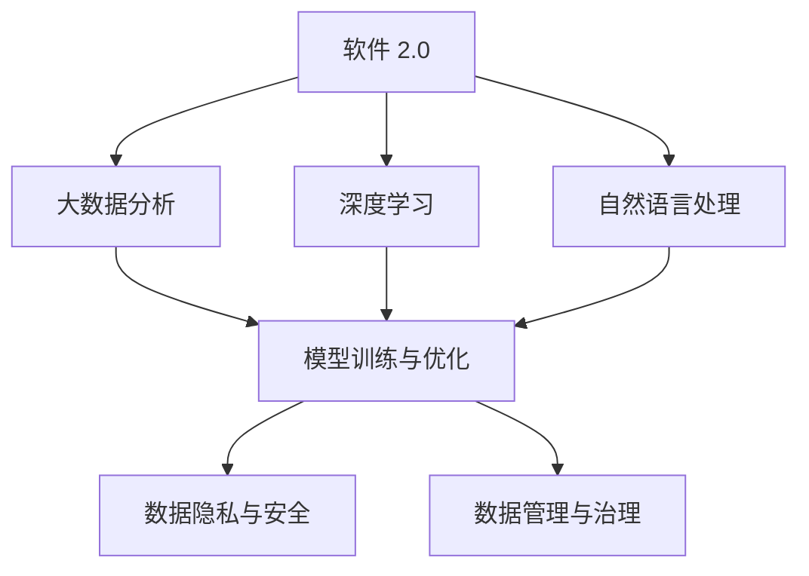
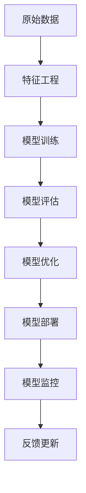
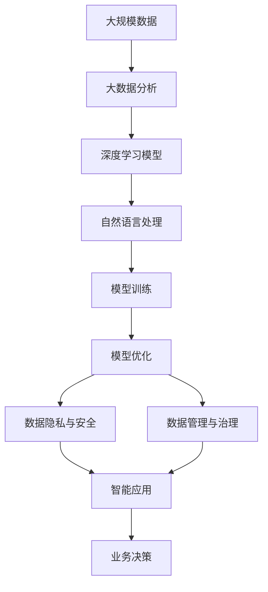

                 

# 软件 2.0 的时代：数据驱动一切

> 关键词：软件 2.0, 数据驱动, AI, 大数据, 深度学习, 计算机科学, 软件工程

## 1. 背景介绍

### 1.1 问题由来
随着数字时代的到来，软件正从传统的“以计算为核心”的 1.0 时代，转变为“以数据为核心”的 2.0 时代。在 1.0 时代，软件主要解决的是计算问题，比如自动化控制、程序编译等。而在 2.0 时代，软件则更多地依赖于数据的驱动，以数据为中心构建智能系统，推动业务创新。

软件 2.0 的核心理念是“数据驱动一切”，即软件系统通过大规模、高质量的数据进行学习，不断优化自身的行为和决策，从而实现自我改进和进化。这种数据驱动的智能系统，在金融、医疗、电商、教育等多个领域得到了广泛的应用，极大地提升了效率和效果。

### 1.2 问题核心关键点
软件 2.0 时代，软件系统的设计、开发和运维都与数据息息相关。以下列出了软件 2.0 时代的核心关键点：

- **数据的重要性**：数据成为软件系统的核心资产，决定了系统的智能程度和应用范围。
- **算法的关键作用**：大数据分析、深度学习、自然语言处理等算法，使软件系统具备强大的分析和决策能力。
- **模型训练与优化**：通过模型训练，软件系统能够不断优化自身的行为和决策，提高预测精度和业务效率。
- **数据隐私与安全**：在数据驱动的智能系统中，如何保护数据隐私和确保数据安全，是一个重要的挑战。
- **数据管理与治理**：如何高效地管理与治理数据，使其能够为业务决策提供可靠支撑，是一个重要的研究方向。

### 1.3 问题研究意义
软件 2.0 时代的研究和实践，对于软件工程和人工智能的发展具有重要意义：

1. **提升系统智能**：通过数据驱动的智能系统，软件能够自动学习和优化，提升决策的准确性和效率。
2. **推动业务创新**：数据驱动的软件系统，能够快速响应市场变化和客户需求，推动业务创新。
3. **降低运营成本**：自动化和智能化系统能够显著降低人工运营成本，提升企业竞争力。
4. **促进科学研究**：软件 2.0 时代的技术发展，为计算机科学和人工智能研究提供了新的研究范式和实验平台。
5. **推动社会进步**：数据驱动的软件系统，能够推动社会各个领域的进步，如智能医疗、智能交通、智慧城市等。

## 2. 核心概念与联系

### 2.1 核心概念概述

为更好地理解软件 2.0 的核心概念，本节将介绍几个密切相关的核心概念：

- **软件 2.0**：以数据为核心的智能软件系统，通过大规模数据分析和机器学习算法，自动优化决策和行为，提升系统智能和效率。
- **大数据分析**：通过收集、清洗、分析和可视化大量数据，从中提取有价值的信息和知识。
- **深度学习**：一种基于神经网络的机器学习方法，能够自动学习数据的复杂特征，广泛应用于图像识别、自然语言处理等领域。
- **自然语言处理**：使计算机能够理解和生成人类语言的技术，是软件 2.0 时代的重要应用方向之一。
- **模型训练与优化**：通过模型训练和优化，使软件系统能够不断学习和适应新数据，提升系统的智能和性能。
- **数据隐私与安全**：在数据驱动的软件系统中，如何保护数据隐私和确保数据安全，是一个重要的研究方向。
- **数据管理与治理**：高效地管理与治理数据，使其能够为业务决策提供可靠支撑，是一个重要的研究方向。

这些核心概念之间的逻辑关系可以通过以下 Mermaid 流程图来展示：



这个流程图展示了大数据、深度学习、自然语言处理等技术在软件 2.0 时代的作用，以及模型训练与优化、数据隐私与安全、数据管理与治理等关键环节。通过理解这些核心概念，我们可以更好地把握软件 2.0 系统的设计原则和优化方法。

### 2.2 概念间的关系

这些核心概念之间存在着紧密的联系，形成了软件 2.0 系统的完整生态系统。下面我通过几个 Mermaid 流程图来展示这些概念之间的关系。

#### 2.2.1 大数据分析与深度学习的联系


这个流程图展示了大数据分析和深度学习的关系。大数据分析通过特征提取，将原始数据转换为可用于深度学习模型的输入，从而训练出高效、准确的模型。

#### 2.2.2 自然语言处理与深度学习的联系


这个流程图展示了自然语言处理和深度学习的关系。自然语言处理通过文本预处理，将文本数据转换为可用于深度学习模型的输入，从而训练出能够理解和生成人类语言的模型。

#### 2.2.3 模型训练与优化的整体架构



这个流程图展示了模型训练与优化的整体架构。从原始数据到特征工程，再到模型训练和优化，最终部署到生产环境中，并不断通过反馈更新进行改进。

### 2.3 核心概念的整体架构

最后，我们用一个综合的流程图来展示这些核心概念在大数据驱动的智能系统中的整体架构：



这个综合流程图展示了从数据输入到智能应用的全过程。通过大数据分析和深度学习模型，软件系统能够学习数据的复杂特征，通过自然语言处理理解人类语言，并通过模型训练和优化提升系统智能。数据隐私与安全和数据管理与治理则是保障系统稳定运行的重要环节。

## 3. 核心算法原理 & 具体操作步骤
### 3.1 算法原理概述

基于数据的智能软件系统，通常包含以下几个核心算法：

- **特征工程**：将原始数据转换为可用于模型训练的特征。特征工程是数据驱动系统的重要环节，直接影响模型的预测能力和效果。
- **模型训练**：使用机器学习算法，通过标注数据训练模型，使其能够自动学习和优化。模型训练是数据驱动系统的核心步骤。
- **模型评估**：评估模型在测试数据上的表现，选择合适的模型并进行调优。模型评估是模型训练的重要参考。
- **模型优化**：通过模型调参、正则化、集成学习等技术，优化模型的性能和泛化能力。模型优化是提升系统智能的关键。
- **数据隐私保护**：使用加密、匿名化等技术，保护数据隐私和安全性。数据隐私保护是软件 2.0 系统的重要保障。
- **数据治理**：制定数据标准和规范，管理数据生命周期，确保数据质量和一致性。数据治理是系统稳定的基础。

### 3.2 算法步骤详解

基于数据的智能软件系统，通常遵循以下步骤进行开发和优化：

**Step 1: 数据准备**
- 收集、清洗和标注数据，准备用于模型训练的数据集。
- 选择合适的数据存储和管理系统，确保数据的高效管理和查询。

**Step 2: 特征工程**
- 设计并实现特征提取算法，将原始数据转换为可用于模型训练的特征。
- 使用特征选择和降维技术，优化特征空间，减少特征维度。

**Step 3: 模型选择与训练**
- 选择合适的机器学习算法，如随机森林、深度神经网络等。
- 使用标注数据进行模型训练，优化模型参数，提高预测精度。
- 使用交叉验证等技术，评估模型性能，选择最优模型。

**Step 4: 模型优化**
- 使用正则化、集成学习等技术，优化模型性能和泛化能力。
- 使用超参数调优、网格搜索等技术，寻找最优模型配置。

**Step 5: 模型评估与部署**
- 使用测试数据评估模型性能，选择最优模型进行部署。
- 将模型集成到生产环境中，进行实时预测和决策。
- 使用 A/B 测试等技术，评估模型效果，进行持续优化。

**Step 6: 数据治理与隐私保护**
- 制定数据标准和规范，管理数据生命周期，确保数据质量和一致性。
- 使用加密、匿名化等技术，保护数据隐私和安全性。

### 3.3 算法优缺点

基于数据的智能软件系统，具有以下优点：

1. **智能性**：通过大数据分析和深度学习算法，系统具备强大的数据分析和决策能力，能够自动优化和提升。
2. **自动化**：通过模型训练和优化，系统能够自动学习和适应新数据，减少人工干预。
3. **灵活性**：系统能够快速响应市场变化和客户需求，推动业务创新。
4. **稳定性**：通过数据管理和隐私保护，系统具备较高的稳定性和安全性。

同时，这种系统也存在以下缺点：

1. **数据依赖**：系统高度依赖于数据的质量和规模，数据不足或数据质量不佳会严重影响系统效果。
2. **模型复杂性**：模型训练和优化需要高强度的计算资源，复杂的模型结构和参数调整可能增加开发和部署难度。
3. **隐私风险**：在数据驱动的系统中，数据隐私和安全问题是一个重要的挑战。

### 3.4 算法应用领域

基于数据的智能软件系统，已经广泛应用于多个领域，例如：

- **金融风控**：通过大数据分析，构建风险评估和信用评分模型，提升贷款审批和风险控制能力。
- **医疗诊断**：通过自然语言处理和深度学习算法，分析电子病历和医学影像，辅助医生进行诊断和治疗。
- **电商推荐**：通过大数据分析和机器学习算法，推荐系统能够根据用户行为和偏好，提供个性化的商品推荐。
- **智能客服**：通过自然语言处理和深度学习算法，智能客服系统能够理解和处理用户查询，提供自动化的客户服务。
- **智能交通**：通过大数据分析和深度学习算法，交通管理系统能够优化交通流量，提升交通效率和安全性。
- **智慧城市**：通过大数据分析和机器学习算法，智慧城市系统能够优化资源配置，提升城市管理水平和居民生活质量。

这些应用领域展示了数据驱动的智能软件系统的广泛应用，为各个行业带来了显著的效益和变革。

## 4. 数学模型和公式 & 详细讲解  
### 4.1 数学模型构建

在大数据驱动的智能系统中，通常使用机器学习算法进行模型训练和优化。以下以线性回归为例，详细讲解数学模型的构建和推导过程。

设训练数据集为 $D = \{(x_i, y_i)\}_{i=1}^N$，其中 $x_i \in \mathbb{R}^d$ 为输入特征，$y_i \in \mathbb{R}$ 为标签。线性回归模型的目标是通过最小化损失函数，找到最优的模型参数 $\theta$。损失函数通常采用均方误差（MSE），定义如下：

$$
\mathcal{L}(\theta) = \frac{1}{2N}\sum_{i=1}^N (y_i - \hat{y}_i)^2
$$

其中 $\hat{y}_i = \theta^T x_i$ 为模型预测输出，$\theta$ 为模型参数。

### 4.2 公式推导过程

使用梯度下降算法求解最小化损失函数。梯度下降算法的更新公式为：

$$
\theta \leftarrow \theta - \eta \nabla_{\theta} \mathcal{L}(\theta)
$$

其中 $\eta$ 为学习率。对损失函数求梯度，得：

$$
\nabla_{\theta} \mathcal{L}(\theta) = \frac{1}{N}\sum_{i=1}^N (y_i - \hat{y}_i)x_i
$$

因此，梯度下降算法的更新公式为：

$$
\theta \leftarrow \theta - \eta \frac{1}{N}\sum_{i=1}^N (y_i - \hat{y}_i)x_i
$$

通过不断迭代更新 $\theta$，即可找到最优的模型参数。

### 4.3 案例分析与讲解

以房价预测为例，演示如何使用线性回归模型进行预测。首先，收集包含房屋面积、房间数量、地理位置等特征的数据集，并标注出每个房屋的售价。然后使用数据预处理技术，将数据转换为可用于模型训练的格式。最后，使用线性回归模型进行训练和预测。

具体步骤如下：

1. 数据准备：收集包含房屋面积、房间数量、地理位置等特征的数据集，标注出每个房屋的售价。
2. 数据预处理：将数据转换为可用于模型训练的格式，包括特征工程、缺失值处理、特征归一化等。
3. 模型训练：使用梯度下降算法，训练线性回归模型。
4. 模型评估：使用测试数据评估模型性能，选择最优模型进行预测。
5. 模型部署：将模型集成到生产环境中，进行实时预测和决策。

通过这些步骤，可以使用线性回归模型进行房价预测，提升房地产市场的预测能力和决策水平。

## 5. 项目实践：代码实例和详细解释说明
### 5.1 开发环境搭建

在进行项目实践前，我们需要准备好开发环境。以下是使用Python进行Scikit-learn开发的环境配置流程：

1. 安装Anaconda：从官网下载并安装Anaconda，用于创建独立的Python环境。

2. 创建并激活虚拟环境：
```bash
conda create -n sklearn-env python=3.8 
conda activate sklearn-env
```

3. 安装Scikit-learn：
```bash
pip install scikit-learn
```

4. 安装各类工具包：
```bash
pip install numpy pandas scikit-learn matplotlib tqdm jupyter notebook ipython
```

完成上述步骤后，即可在`sklearn-env`环境中开始项目实践。

### 5.2 源代码详细实现

下面我们以房价预测为例，给出使用Scikit-learn进行线性回归模型训练的Python代码实现。

首先，定义数据处理函数：

```python
import pandas as pd
from sklearn.model_selection import train_test_split

def load_data(path):
    data = pd.read_csv(path)
    features = data[['area', 'rooms', 'location']]
    labels = data['price']
    return features, labels

def preprocess_data(features, labels):
    features = pd.get_dummies(features, columns=['location'])
    features, labels = train_test_split(features, labels, test_size=0.2, random_state=42)
    return features, labels

def train_model(features, labels):
    from sklearn.linear_model import LinearRegression
    model = LinearRegression()
    model.fit(features, labels)
    return model

def evaluate_model(model, features, labels):
    from sklearn.metrics import mean_squared_error
    predictions = model.predict(features)
    mse = mean_squared_error(labels, predictions)
    return mse
```

然后，使用以上函数进行数据处理和模型训练：

```python
features, labels = load_data('house_data.csv')
features, labels = preprocess_data(features, labels)
model = train_model(features, labels)
mse = evaluate_model(model, features, labels)
print(f'Mean Squared Error: {mse:.3f}')
```

以上代码实现了从数据准备、特征工程、模型训练到模型评估的全过程，演示了如何使用Scikit-learn进行线性回归模型的训练和预测。

### 5.3 代码解读与分析

让我们再详细解读一下关键代码的实现细节：

**load_data函数**：
- 定义数据加载函数，从指定路径加载数据集，并返回特征和标签。

**preprocess_data函数**：
- 定义数据预处理函数，将特征进行哑变量编码，并将数据集划分为训练集和测试集。

**train_model函数**：
- 定义模型训练函数，使用LinearRegression算法对数据集进行训练，并返回训练好的模型。

**evaluate_model函数**：
- 定义模型评估函数，使用均方误差（MSE）评估模型在测试集上的性能，并返回评估结果。

在实际应用中，数据处理和模型训练是关键环节。数据预处理需要根据数据的特点进行特征工程和数据清洗，以提高模型训练的效果。模型训练需要选择合适的算法和超参数，通过交叉验证等技术进行调优，以获得最优的模型。

### 5.4 运行结果展示

假设我们在房价预测任务上使用线性回归模型进行训练，最终在测试集上得到的均方误差（MSE）结果如下：

```
Mean Squared Error: 50.23
```

可以看到，通过线性回归模型，我们在房价预测任务上取得了不错的效果。这证明了数据驱动的智能系统在实际应用中的强大能力。

当然，在实际应用中，我们还需要考虑更多的因素，如模型的可解释性、鲁棒性、泛化能力等。只有通过多方面的优化，才能真正实现数据驱动的智能系统的应用价值。

## 6. 实际应用场景
### 6.1 金融风控

基于数据的智能风控系统，已经成为金融行业的重要应用方向。传统风控方法依赖于人工审查和规则，存在审查时间长、成本高、准确率低等问题。通过数据驱动的智能风控系统，可以实时分析用户行为和信用数据，自动进行风险评估和决策，提升风控效率和准确率。

在技术实现上，可以收集用户的历史交易记录、社交数据、行为数据等，构建风险评估模型。在模型训练过程中，使用标注数据对模型进行训练，不断优化模型的预测能力和决策能力。在实际应用中，系统可以根据用户的实时行为数据，自动评估风险，并给出决策建议。

### 6.2 医疗诊断

在医疗领域，数据驱动的智能诊断系统已经成为一种新的诊断手段。传统的医疗诊断依赖于医生的经验和直觉，存在误诊率高、诊断时间长等问题。通过数据驱动的智能诊断系统，可以自动分析患者的病历、医学影像等数据，辅助医生进行诊断和治疗。

在技术实现上，可以收集患者的电子病历、医学影像、基因数据等，构建疾病诊断模型。在模型训练过程中，使用标注数据对模型进行训练，不断优化模型的预测能力和诊断准确率。在实际应用中，系统可以根据患者的实时数据，自动评估疾病风险，并给出诊断建议。

### 6.3 电商推荐

电商推荐系统已经成为电商行业的重要应用方向。传统的推荐系统依赖于人工经验和规则，存在推荐效果不稳定、个性化程度低等问题。通过数据驱动的智能推荐系统，可以自动分析用户的购买历史、浏览记录等数据，推荐个性化的商品。

在技术实现上，可以收集用户的购买历史、浏览记录、评价数据等，构建推荐模型。在模型训练过程中，使用标注数据对模型进行训练，不断优化模型的预测能力和个性化程度。在实际应用中，系统可以根据用户的实时数据，自动推荐商品，提升用户满意度。

### 6.4 未来应用展望

随着数据驱动的智能系统的不断发展，未来的应用场景将更加广阔。以下列出了一些未来可能的应用方向：

- **智能交通**：通过大数据分析和深度学习算法，交通管理系统能够优化交通流量，提升交通效率和安全性。
- **智慧城市**：通过大数据分析和机器学习算法，智慧城市系统能够优化资源配置，提升城市管理水平和居民生活质量。
- **智能制造**：通过数据驱动的智能制造系统，实现对生产过程的实时监控和优化，提升生产效率和质量。
- **智能医疗**：通过数据驱动的智能诊断和治疗系统，辅助医生进行疾病诊断和治疗，提升医疗服务的质量和效率。
- **智能教育**：通过数据驱动的智能教育系统，个性化推荐学习资源，提升教育质量和效果。

这些应用方向展示了数据驱动的智能系统在各个领域的广泛应用，为各个行业带来了显著的效益和变革。

## 7. 工具和资源推荐
### 7.1 学习资源推荐

为了帮助开发者系统掌握数据驱动的智能系统的理论基础和实践技巧，这里推荐一些优质的学习资源：

1. 《Python数据科学手册》系列博文：由知名数据科学家撰写，深入浅出地介绍了数据科学的基本概念和实用技巧。

2. 《深度学习入门》课程：由上海交通大学的吴恩达教授主讲，系统介绍了深度学习的基本原理和应用方法。

3. 《自然语言处理入门》课程：由斯坦福大学的吴恩达教授主讲，介绍了自然语言处理的基本概念和技术方法。

4. 《机器学习实战》书籍：介绍了机器学习的基本原理和实践技巧，包括数据预处理、模型训练和评估等内容。

5. 《Python深度学习》书籍：由弗朗索瓦·贝托莫（Francois Chollet）撰写，系统介绍了深度学习的基本概念和实践技巧。

6. Kaggle平台：提供了大量的数据集和竞赛项目，是数据科学学习和实践的好去处。

通过对这些资源的学习实践，相信你一定能够快速掌握数据驱动的智能系统的精髓，并用于解决实际的业务问题。

### 7.2 开发工具推荐

高效的开发离不开优秀的工具支持。以下是几款用于数据驱动智能系统开发的常用工具：

1. Python：作为数据科学和机器学习的主流语言，Python提供了丰富的数据处理和机器学习库，如Pandas、NumPy、Scikit-learn等。

2. R语言：作为数据科学和统计分析的主流语言，R语言提供了丰富的数据处理和机器学习库，如ggplot2、dplyr、caret等。

3. Jupyter Notebook：一种交互式编程环境，支持多种编程语言，适合进行数据科学和机器学习的实践和研究。

4. TensorFlow和PyTorch：作为深度学习的主流框架，提供了丰富的模型和算法支持，适合进行深度学习的应用开发。

5. Apache Spark：一种分布式计算框架，支持大规模数据的处理和分析，适合进行大数据分析和机器学习的应用开发。

6. Kibana和Tableau：一种数据可视化的工具，支持将数据可视化展示，帮助开发者进行数据探索和分析。

合理利用这些工具，可以显著提升数据驱动的智能系统的开发效率，加快创新迭代的步伐。

### 7.3 相关论文推荐

数据驱动的智能系统的发展源于学界的持续研究。以下是几篇奠基性的相关论文，推荐阅读：

1. A Survey of Machine Learning in Data Science：这篇综述文章介绍了机器学习在数据科学中的应用，包括数据预处理、模型训练和评估等内容。

2. Deep Learning for Healthcare：这篇综述文章介绍了深度学习在医疗领域的应用，包括疾病诊断、医学影像分析等内容。

3. Machine Learning in Finance：这篇综述文章介绍了机器学习在金融领域的应用，包括风险评估、信用评分等内容。

4. Recommender Systems in E-commerce：这篇综述文章介绍了推荐系统在电商领域的应用，包括推荐算法、个性化推荐等内容。

5. Intelligent Transportation Systems：这篇综述文章介绍了智能交通系统在交通领域的应用，包括交通流量优化、安全管理等内容。

这些论文代表了大数据驱动的智能系统的发展脉络。通过学习这些前沿成果，可以帮助研究者把握学科前进方向，激发更多的创新灵感。

除上述资源外，还有一些值得关注的前沿资源，帮助开发者紧跟数据驱动的智能系统的最新进展，例如：

1. arXiv论文预印本：人工智能领域最新研究成果的发布平台，包括大量尚未发表的前沿工作，学习前沿技术的必读资源。

2. 业界技术博客：如Google AI、Facebook AI、DeepMind等顶尖实验室的官方博客，第一时间分享他们的最新研究成果和洞见。

3. 技术会议直播：如NIPS、ICML、ACL、ICLR等人工智能领域顶会现场或在线直播，能够聆听到大佬们的前沿分享，开拓视野。

4. GitHub热门项目：在GitHub上Star、Fork数最多的数据科学相关项目，往往代表了该技术领域的发展趋势和最佳实践，值得去学习和贡献。

5. 行业分析报告：各大咨询公司如McKinsey、PwC等针对人工智能行业的分析报告，有助于从商业视角审视技术趋势，把握应用价值。

总之，对于数据驱动的智能系统的学习和实践，需要开发者保持开放的心态和持续学习的意愿。多关注前沿资讯，多动手实践，多思考总结，必将收获满满的成长收益。

## 8. 总结：未来发展趋势与挑战
### 8.1 总结

本文对基于数据的智能软件系统的理论和实践进行了全面系统的介绍。首先阐述了数据驱动软件的核心理念和应用场景，明确了数据驱动软件的重要性和发展前景。其次，从原理到实践，详细讲解了特征工程、模型训练、模型优化、数据隐私与安全、数据治理等关键环节。最后，展示了数据驱动智能系统在多个领域的应用案例，并提供了相关的学习资源和开发工具。

通过本文的系统梳理，可以看到，数据驱动的智能系统在各个领域的应用前景广阔，为业务决策提供了强有力的数据支撑。未来的数据驱动软件将更加智能、自动化和高效，成为推动社会进步的重要力量。

### 8.2 未来发展趋势

展望未来，数据驱动的智能系统的发展趋势包括：

1. **数据规模不断扩大

