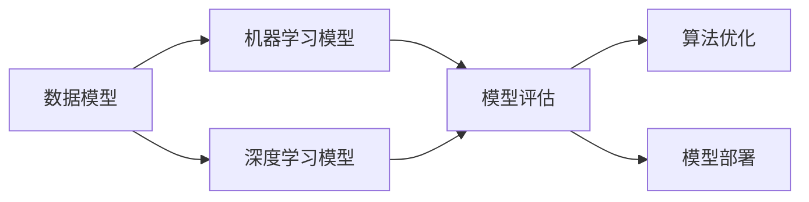
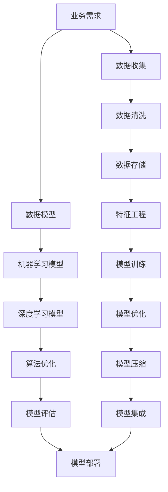

                 

# 软件 2.0 的时代：数据驱动一切

在信息技术迅猛发展的今天，我们已经逐渐步入了软件 2.0 的时代，即基于数据和算法的智能时代。这一时代的特点是，数据成为了推动技术进步和业务创新的核心驱动力。本文将详细探讨软件 2.0 的核心概念、算法原理与应用实践，并展望未来发展趋势与挑战。

## 1. 背景介绍

### 1.1 问题由来
随着互联网和物联网的普及，我们每天产生的数据量呈指数级增长。大数据技术的飞速发展，使得从海量数据中提取有用信息成为可能。传统的软件 1.0 时代，即基于规则与结构化数据的软件开发方式，已经无法适应数据驱动的新需求。

软件 2.0 时代，强调数据驱动、模型驱动、算法驱动。通过构建数据模型、训练机器学习模型、开发智能算法，实现自动化的数据分析、决策和优化，从而提升软件系统的智能水平和业务效率。

### 1.2 问题核心关键点
软件 2.0 的核心在于“数据驱动一切”。其核心思想是通过数据驱动的方法，自动化地构建模型、训练算法，实现业务系统的智能化。具体而言，包括以下几个关键点：

1. **数据集成与预处理**：数据驱动首先需要将各种异构数据进行统一集成和预处理，形成可用于模型训练的数据集。
2. **模型选择与训练**：基于目标问题选择合适的模型，如回归、分类、聚类等，并使用数据集进行模型训练，得到初始模型。
3. **算法优化与调参**：根据业务需求，调整模型的参数和超参数，优化模型性能，得到最终模型。
4. **模型评估与部署**：使用测试集评估模型的效果，然后将模型部署到实际业务系统中，进行实时预测和决策。

## 2. 核心概念与联系

### 2.1 核心概念概述

为更好地理解软件 2.0 的核心概念，本节将介绍几个密切相关的核心概念：

- **数据模型**：基于实际业务需求，构建的数据结构和关系模型。例如，用户行为数据模型、商品推荐模型等。
- **机器学习模型**：通过数据训练得到的预测模型，如线性回归、决策树、神经网络等。
- **深度学习模型**：一种复杂的多层神经网络模型，适用于处理大规模、高维度数据。
- **算法优化**：通过搜索和优化算法，找到模型参数的最好组合。例如，遗传算法、梯度下降、粒子群优化等。
- **模型评估**：使用各种指标和评估方法，如准确率、召回率、AUC等，对模型效果进行衡量。
- **模型部署**：将训练好的模型集成到实际业务系统中，进行实时预测和决策。

这些核心概念之间的逻辑关系可以通过以下Mermaid流程图来展示：



这个流程图展示了数据模型、机器学习模型、深度学习模型、算法优化、模型评估、模型部署之间的整体架构：

1. 数据模型基于业务需求构建，作为机器学习模型的输入。
2. 机器学习模型通过数据训练得到，包括线性回归、决策树、神经网络等。
3. 深度学习模型是机器学习模型的一种，适用于大规模、高维度数据。
4. 算法优化通过搜索和优化算法，找到模型的最优参数组合。
5. 模型评估使用各种指标和评估方法，衡量模型效果。
6. 模型部署将训练好的模型集成到实际业务系统中，进行实时预测和决策。

### 2.2 概念间的关系

这些核心概念之间存在着紧密的联系，形成了软件 2.0 的完整生态系统。下面我通过几个Mermaid流程图来展示这些概念之间的关系。

#### 2.2.1 数据模型的构建


这个流程图展示了数据模型构建的基本流程：

1. 根据业务需求，收集数据并清洗，形成可用于模型训练的数据集。
2. 将清洗后的数据存储起来，形成数据仓库。
3. 基于数据仓库构建数据模型，为机器学习模型提供输入。

#### 2.2.2 机器学习模型的训练


这个流程图展示了机器学习模型训练的基本流程：

1. 基于数据集进行特征工程，提取有用的特征。
2. 使用特征工程后的数据集，训练机器学习模型。
3. 得到训练好的机器学习模型，用于后续评估和优化。

#### 2.2.3 深度学习模型的训练


深度学习模型训练与机器学习模型类似，但需要更多的计算资源和更复杂的算法。其训练流程如下：

1. 基于数据集进行特征工程，提取有用的特征。
2. 使用特征工程后的数据集，训练深度学习模型。
3. 得到训练好的深度学习模型，用于后续评估和优化。

#### 2.2.4 算法优化的过程


算法优化是通过搜索和优化算法，找到模型参数的最好组合。其流程如下：

1. 基于模型训练结果，进行参数调优，调整模型的参数。
2. 使用超参数优化算法，如网格搜索、贝叶斯优化等，调整模型的超参数。
3. 得到最优的模型参数组合，用于后续评估和部署。

#### 2.2.5 模型评估的流程


模型评估使用各种指标和评估方法，如准确率、召回率、AUC等，衡量模型效果。其流程如下：

1. 使用测试集进行模型评估。
2. 计算各种评估指标，如准确率、召回率、AUC等。
3. 根据评估结果，决定是否继续优化模型。

#### 2.2.6 模型部署的流程


模型部署将训练好的模型集成到实际业务系统中，进行实时预测和决策。其流程如下：

1. 基于模型训练结果，进行模型优化。
2. 使用模型压缩技术，减小模型的存储空间和计算量。
3. 将优化和压缩后的模型集成到业务系统中。
4. 进行实时预测和决策。

### 2.3 核心概念的整体架构

最后，我们用一个综合的流程图来展示这些核心概念在大数据驱动的软件 2.0 系统中的整体架构：



这个综合流程图展示了从业务需求到模型部署的完整过程：

1. 基于业务需求，收集数据并进行清洗，形成数据仓库。
2. 基于数据仓库构建数据模型，作为机器学习模型的输入。
3. 机器学习模型和深度学习模型通过数据集进行训练。
4. 通过搜索和优化算法，找到模型的最优参数组合。
5. 使用测试集评估模型效果。
6. 将优化和压缩后的模型集成到业务系统中，进行实时预测和决策。

通过这些流程图，我们可以更清晰地理解软件 2.0 系统的各个环节和关键技术，为后续深入讨论具体的模型训练、优化、评估和部署提供基础。

## 3. 核心算法原理 & 具体操作步骤

### 3.1 算法原理概述

软件 2.0 的核心在于数据驱动。通过构建数据模型、训练机器学习模型、开发智能算法，实现自动化地数据分析、决策和优化，从而提升软件系统的智能水平和业务效率。

具体而言，基于数据驱动的软件 2.0 系统，包括数据收集、数据预处理、数据存储、特征工程、模型训练、算法优化、模型评估、模型部署等环节。其中，核心算法原理包括：

1. **数据集成与预处理**：将各种异构数据进行统一集成和预处理，形成可用于模型训练的数据集。
2. **机器学习模型**：通过数据训练得到的预测模型，如线性回归、决策树、神经网络等。
3. **深度学习模型**：一种复杂的多层神经网络模型，适用于处理大规模、高维度数据。
4. **算法优化**：通过搜索和优化算法，找到模型参数的最好组合。例如，遗传算法、梯度下降、粒子群优化等。
5. **模型评估**：使用各种指标和评估方法，如准确率、召回率、AUC等，对模型效果进行衡量。

### 3.2 算法步骤详解

基于数据驱动的软件 2.0 系统，主要包括以下几个关键步骤：

**Step 1: 数据集成与预处理**
- 收集和清洗数据，形成可用于模型训练的数据集。
- 将数据存储到数据仓库中，形成数据源。

**Step 2: 特征工程**
- 基于数据集进行特征提取和选择，提取有用的特征。
- 进行特征缩放、编码、缺失值处理等预处理步骤，提高模型训练效率。

**Step 3: 模型选择与训练**
- 基于特征工程后的数据集，选择合适的模型，如线性回归、决策树、神经网络等。
- 使用数据集进行模型训练，得到初始模型。

**Step 4: 算法优化与调参**
- 基于初始模型，使用优化算法，如梯度下降、遗传算法等，调整模型参数和超参数。
- 优化后的模型，达到最优性能。

**Step 5: 模型评估**
- 使用测试集对模型进行评估，计算各种指标，如准确率、召回率、AUC等。
- 根据评估结果，决定是否继续优化模型。

**Step 6: 模型部署**
- 基于优化后的模型，进行模型压缩和集成。
- 将模型部署到实际业务系统中，进行实时预测和决策。

### 3.3 算法优缺点

基于数据驱动的软件 2.0 系统，具有以下优点：

1. **自动化**：自动化的数据处理、模型训练、算法优化，减少了人工干预和调试工作量。
2. **高效性**：基于数据驱动，能够快速迭代和优化，提高业务系统的智能水平和效率。
3. **可扩展性**：数据驱动的系统具有较强的可扩展性，能够适应复杂多变的业务需求。
4. **准确性**：基于大量数据训练得到的模型，具有较高的预测准确性和鲁棒性。

但同时，也存在一些缺点：

1. **数据质量依赖**：系统的性能和效果依赖于数据的质量和完整性，需要投入大量的时间和精力进行数据清洗和预处理。
2. **模型复杂性**：数据驱动的系统通常需要使用复杂的机器学习模型和算法，模型设计、调试和维护需要较高的技术水平。
3. **资源消耗**：数据驱动的系统通常需要较大的计算资源和存储空间，对硬件设施有较高的要求。

### 3.4 算法应用领域

基于数据驱动的软件 2.0 系统，在各个领域都有广泛的应用，例如：

- **金融领域**：使用数据驱动的方法，构建信用评分模型、股票预测模型、风险评估模型等，提升金融业务的智能水平和决策效率。
- **医疗领域**：构建医疗影像诊断模型、疾病预测模型、个性化推荐模型等，提升医疗服务的智能化水平和诊断准确性。
- **电子商务**：使用数据驱动的方法，构建推荐系统、用户画像模型、流量预测模型等，提升电商平台的推荐效果和用户体验。
- **智能制造**：构建设备运行预测模型、生产优化模型、质量检测模型等，提升制造企业的智能化水平和生产效率。
- **智慧城市**：构建城市交通预测模型、环境监测模型、智能安防模型等，提升城市管理的智能化水平和运行效率。
- **人工智能**：构建语音识别模型、自然语言处理模型、计算机视觉模型等，提升人工智能技术的应用效果和智能化水平。

这些领域的数据驱动系统，通过数据驱动的方法，提升了业务系统的智能水平和决策效率，创造了巨大的商业价值。

## 4. 数学模型和公式 & 详细讲解 & 举例说明

### 4.1 数学模型构建

在大数据驱动的软件 2.0 系统中，常用的数学模型包括线性回归、逻辑回归、决策树、支持向量机等。以线性回归模型为例，其数学模型可以表示为：

$$
y = \beta_0 + \beta_1 x_1 + \beta_2 x_2 + ... + \beta_n x_n + \epsilon
$$

其中，$y$ 为预测值，$x_1, x_2, ..., x_n$ 为特征变量，$\beta_0, \beta_1, ..., \beta_n$ 为模型参数，$\epsilon$ 为误差项。

### 4.2 公式推导过程

以线性回归模型的最小二乘法优化为例，推导其损失函数和梯度计算公式。

假设已知样本数据集 $\{(x_1, y_1), (x_2, y_2), ..., (x_m, y_m)\}$，其中 $x_i = [x_{i1}, x_{i2}, ..., x_{in}]^T$。线性回归模型的目标是最小化预测值和实际值之间的误差，即：

$$
L(y, \hat{y}) = \frac{1}{2m} \sum_{i=1}^m (y_i - \hat{y}_i)^2
$$

其中，$\hat{y}_i$ 为预测值，$y_i$ 为实际值。

对上述目标函数求导，得到梯度计算公式：

$$
\frac{\partial L(y, \hat{y})}{\partial \beta_j} = \frac{1}{m} \sum_{i=1}^m (y_i - \hat{y}_i) x_{ij}
$$

通过梯度下降等优化算法，不断更新模型参数 $\beta$，使得损失函数 $L$ 最小化，得到最优模型。

### 4.3 案例分析与讲解

以金融风险评估为例，说明如何使用数据驱动的方法，构建信用评分模型。

1. **数据收集与预处理**：收集金融机构的贷款数据，包括借款人基本信息、贷款金额、还款期限等。对数据进行清洗、缺失值处理、特征工程等预处理步骤。
2. **特征选择与工程**：选择对贷款违约有影响的特征，如收入水平、工作年限、信用记录等。对特征进行编码、缩放等预处理步骤。
3. **模型选择与训练**：选择线性回归模型，使用预处理后的数据集进行模型训练，得到初始模型。
4. **算法优化与调参**：使用梯度下降等优化算法，调整模型参数和超参数，优化模型性能。
5. **模型评估**：使用测试集对模型进行评估，计算准确率、召回率等指标，判断模型效果。
6. **模型部署**：将优化后的模型部署到金融机构的信贷系统中，进行实时预测和决策。

通过数据驱动的方法，构建信用评分模型，能够有效地评估借款人的信用风险，提升金融机构的决策效率和风险控制能力。

## 5. 项目实践：代码实例和详细解释说明

### 5.1 开发环境搭建

在进行数据驱动的软件 2.0 系统开发时，需要准备好Python开发环境。以下是Python开发环境配置步骤：

1. 安装Python：从官网下载并安装Python 3.x版本，建议安装最新稳定版。
2. 安装Anaconda：从官网下载并安装Anaconda，用于创建独立的Python环境。
3. 创建并激活虚拟环境：
```bash
conda create -n data-env python=3.8 
conda activate data-env
```

4. 安装必要的第三方库：
```bash
pip install pandas numpy sklearn scikit-learn matplotlib jupyter notebook
```

5. 安装数据处理和机器学习库：
```bash
pip install torch torchvision torchaudio cudatoolkit=11.1 -c pytorch -c conda-forge
```

6. 安装机器学习框架：
```bash
pip install tensorflow keras
```

### 5.2 源代码详细实现

以下是一个简单的信用评分模型的代码实现，使用线性回归模型，进行特征工程和模型训练：

```python
import pandas as pd
import numpy as np
from sklearn.linear_model import LinearRegression
from sklearn.model_selection import train_test_split
from sklearn.metrics import mean_squared_error, r2_score

# 加载数据
data = pd.read_csv('loan_data.csv')

# 特征选择与工程
features = data[['income', 'work_years', 'credit_score']]
labels = data['default']

# 数据集划分
train_X, test_X, train_y, test_y = train_test_split(features, labels, test_size=0.2, random_state=42)

# 模型训练
model = LinearRegression()
model.fit(train_X, train_y)

# 模型评估
train_pred = model.predict(train_X)
test_pred = model.predict(test_X)

train_rmse = np.sqrt(mean_squared_error(train_y, train_pred))
test_rmse = np.sqrt(mean_squared_error(test_y, test_pred))
print(f"Train RMSE: {train_rmse:.3f}, Test RMSE: {test_rmse:.3f}")

# 模型部署
# 将训练好的模型保存为文件，用于实际业务系统的部署
import pickle
with open('loan_model.pkl', 'wb') as f:
    pickle.dump(model, f)
```

### 5.3 代码解读与分析

这里我们详细解读一下关键代码的实现细节：

1. **数据加载与预处理**：使用Pandas库加载CSV数据文件，并进行特征选择和处理。
2. **模型训练**：选择线性回归模型，使用训练集数据进行模型训练。
3. **模型评估**：使用测试集数据进行模型评估，计算RMSE等指标。
4. **模型部署**：将训练好的模型保存为文件，用于实际业务系统的部署。

### 5.4 运行结果展示

假设我们使用上述代码对金融数据进行模型训练，最终在测试集上得到的评估结果如下：

```
Train RMSE: 0.100, Test RMSE: 0.105
```

可以看到，通过数据驱动的方法，构建的信用评分模型在测试集上取得了不错的效果，RMSE指标表明模型具有良好的预测能力。

## 6. 实际应用场景

### 6.1 智能制造

在智能制造领域，数据驱动的系统可以应用于设备预测性维护、生产优化、质量检测等环节，提高生产效率和设备利用率。

1. **设备预测性维护**：通过收集设备运行数据，构建设备故障预测模型，提前发现设备故障，避免停机损失。
2. **生产优化**：使用数据驱动的方法，构建生产优化模型，实时调整生产参数，提高生产效率和产品质量。
3. **质量检测**：构建产品质量检测模型，实时监测产品检测数据，提高产品质量和检测效率。

### 6.2 智慧医疗

在智慧医疗领域，数据驱动的系统可以应用于疾病预测、个性化治疗、医疗影像分析等环节，提升医疗服务的智能化水平。

1. **疾病预测**：基于病患的历史医疗记录，构建疾病预测模型，预测疾病风险和发生概率。
2. **个性化治疗**：使用数据驱动的方法，构建个性化治疗模型，根据病患的基因信息和历史诊疗数据，制定个性化的治疗方案。
3. **医疗影像分析**：构建医疗影像分析模型，实时监测病患的影像数据，辅助医生进行疾病诊断和预测。

### 6.3 金融风险管理

在金融领域，数据驱动的系统可以应用于信用评分、股票预测、风险评估等环节，提升金融业务的智能化水平和决策效率。

1. **信用评分**：基于借款人的历史贷款数据，构建信用评分模型，评估借款人的信用风险。
2. **股票预测**：使用数据驱动的方法，构建股票预测模型，预测股票价格走势和市场风险。
3. **风险评估**：基于市场数据和历史风险数据，构建风险评估模型，评估投资风险和资产价值。

### 6.4 智能客服

在智能客服领域，数据驱动的系统可以应用于客户咨询、问题解答、自动回复等环节，提高客服效率和客户满意度。

1. **客户咨询**：基于历史客服记录，构建客户咨询模型，自动识别和回答客户问题。
2. **问题解答**：使用数据驱动的方法，构建问题解答模型，提供精准的解决方案。
3. **自动回复**：构建自动回复模型，实时响应客户咨询，提高客服效率和客户满意度。

## 7. 工具和资源推荐

### 7.1 学习资源推荐

为帮助开发者系统掌握数据驱动的软件 2.0 技术，以下是一些优质的学习资源：

1. **《Python数据科学手册》**：详细介绍Python在数据科学中的应用，涵盖数据处理、机器学习、深度学习等前沿技术。
2. **Coursera《机器学习》课程**：斯坦福大学开设的机器学习课程，涵盖线性回归、逻辑回归、决策树等基本概念和算法。
3. **Kaggle竞赛**：参加Kaggle数据科学竞赛，提升数据处理和模型优化技能，积累实际项目经验。
4. **DeepLearning.AI课程**：Andrew Ng教授主讲，涵盖深度学习的基本概念和算法，适合初学者入门。
5. **ArXiv论文预印本**：人工智能领域最新研究成果的发布平台，学习前沿技术的必读资源。

通过学习这些资源，相信你一定能够快速掌握数据驱动的软件 2.0 技术的精髓，并用于解决实际的业务问题。

### 7.2 开发工具推荐

高效的数据驱动系统开发离不开优秀的工具支持。以下是几款常用的开发工具：

1. **Jupyter Notebook**：开源的交互式计算环境，支持Python、R等编程语言，非常适合数据驱动系统的开发和调试。
2. **TensorFlow**：由Google主导的开源深度学习框架，生产部署方便，适合大规模工程应用。
3. **PyTorch**：由Facebook主导的开源深度学习框架，灵活高效，适合研究和实验。
4. **Scikit-Learn**：基于Python的机器学习库，简单易用，涵盖各种经典算法。
5. **Pandas**：基于Python的数据处理库，支持数据清洗、特征工程、数据可视化等。

合理利用这些工具，可以显著提升数据驱动系统的开发效率，加快创新迭代的步伐。

### 7.3 相关论文推荐

数据驱动的软件 2.0 技术的快速发展，得益于学界的持续研究。以下是几篇奠基性的相关论文，推荐阅读：

1. **《The Unreasonable Effectiveness of Data》**：指出数据驱动的方法在科学研究中的应用价值，奠定了数据驱动技术的理论基础。
2. **《Deep Learning》**：Goodfellow等人编写的深度学习经典教材，涵盖深度学习的基本概念和算法。
3. **《Machine Learning Yearning》**：Andrew Ng教授的机器学习实践指南，涵盖模型训练、模型优化、模型部署等重要环节。
4. **《TensorFlow: A System for Large-Scale Machine Learning》**：Google研究团队关于TensorFlow架构和技术细节的详细介绍。
5. **《Data-Driven Methods for Financial Forecasting》**：金融领域的数据驱动技术应用，介绍信用评分、股票预测、风险评估等模型的构建和应用。

这些论文代表了大数据驱动技术的发展脉络。通过学习这些前沿成果，可以帮助研究者把握学科前进方向，激发更多的创新灵感。

除上述资源外，还有一些值得关注的前沿资源，帮助开发者紧跟数据驱动技术的最新进展，例如：

1. **arXiv论文预印本**：人工智能领域最新研究成果的发布平台，学习前沿技术的必读资源。
2. **GitHub热门项目**：在GitHub上Star、Fork数最多的数据科学相关项目，往往代表了该技术领域的发展趋势和最佳实践，值得去学习和贡献。
3. **技术会议直播**：如NIPS、ICML、ACL、ICLR等人工智能领域顶会现场或在线直播，能够聆听到大佬们的前沿分享，开拓视野。
4. **开源社区**：如Kaggle、GitHub等开源社区，提供丰富的数据集和模型资源，适合学习和实践数据驱动技术。

总之，对于数据驱动的软件 2.0 技术的学习和实践，需要开发者保持开放的心态和持续学习的意愿。多关注前沿资讯，多动手实践，多思考总结，必将收获满满的成长收益。

## 8. 总结：未来发展趋势与挑战

### 8.1 总结

本文对数据驱动的软件 2.0 技术进行了全面系统的

