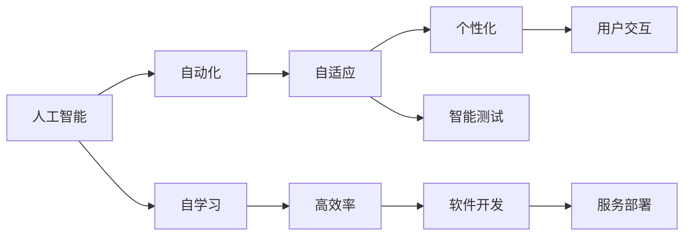
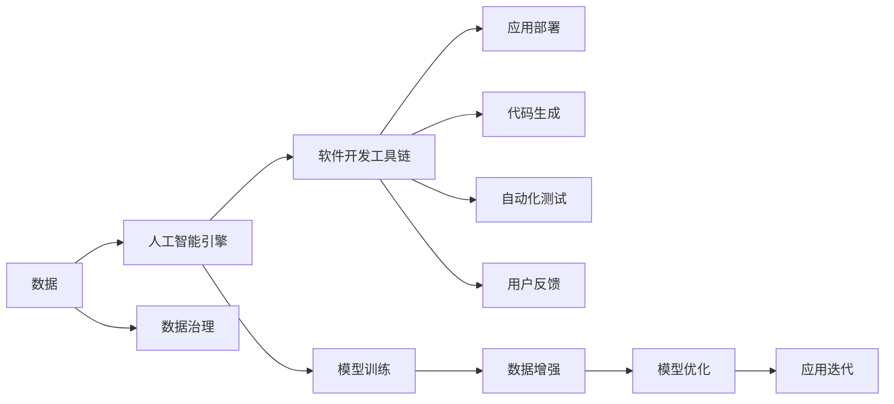

                 

# 软件 2.0 的未来愿景：创造更美好的世界

## 1. 背景介绍

### 1.1 问题由来
随着科技的飞速发展，我们的世界正在发生翻天覆地的变化。从工业到商业，从政府到家庭，人工智能（AI）正在改变我们生活的方方面面。软件，作为人类智能的延伸，也正经历着一场深刻的变革。软件 2.0（Software 2.0），即基于人工智能的软件系统，正在成为推动社会进步的引擎。

### 1.2 问题核心关键点
软件 2.0 的核心在于将人工智能技术深度集成到软件开发中，从而实现更加智能、高效、个性化的软件体验。它涵盖从自动生成代码、智能调试、自适应推荐到自动化测试、实时监控等众多领域。软件 2.0 的核心特征包括：

1. **自动化**：通过机器学习等技术，软件 2.0 能够自动生成代码、优化程序性能、优化用户体验等。
2. **个性化**：软件 2.0 能够根据用户的行为和偏好，提供个性化的服务和内容。
3. **自适应**：软件 2.0 能够根据环境的变化和用户反馈，自我调整和优化。
4. **自学习**：软件 2.0 具备学习和适应的能力，能够不断改进自身性能和功能。
5. **高效率**：软件 2.0 能够显著提高软件开发的效率和质量，减少人力成本和时间成本。

### 1.3 问题研究意义
研究软件 2.0 的未来愿景，对于推动人工智能技术在各行各业的应用，提升人类生活质量，具有重要的理论和实践意义。通过深入研究软件 2.0 的发展趋势和挑战，可以为未来的软件开发提供宝贵的经验和指导，助力构建一个更加智能化、高效、和谐的世界。

## 2. 核心概念与联系

### 2.1 核心概念概述

软件 2.0 的核心概念主要包括：

- **人工智能**：通过机器学习、深度学习、自然语言处理等技术，使计算机具备类人智能。
- **自动化**：自动化测试、自动化代码生成、自动化部署等。
- **自适应**：软件能够根据环境变化和用户反馈进行自我调整和优化。
- **个性化**：根据用户行为和偏好，提供个性化的服务和内容。
- **自学习**：通过收集数据和用户反馈，不断改进和优化自身性能。
- **高效率**：显著提高软件开发效率，降低成本。

### 2.2 概念间的关系

这些核心概念之间的联系可以用以下 Mermaid 流程图来展示：



这个流程图展示了软件 2.0 中各个核心概念之间的关系：

1. 人工智能是软件 2.0 的基础，通过自动化、自适应、个性化等技术，实现高效的软件开发。
2. 自学习能力使得软件能够不断改进和优化，保持高效率和高质量。
3. 自动化测试和部署进一步提高了软件开发效率和可靠性。
4. 个性化服务提升了用户体验和满意度。
5. 高效率的软件开发降低了成本，加速了技术创新。

### 2.3 核心概念的整体架构

软件 2.0 的整体架构可以用以下 Mermaid 图表来展示：



这个图表展示了软件 2.0 从数据采集、模型训练、代码生成、自动化测试到用户反馈和模型优化的全过程，以及这些过程之间的相互作用。

## 3. 核心算法原理 & 具体操作步骤

### 3.1 算法原理概述

软件 2.0 的核心算法原理主要基于人工智能技术，包括机器学习、深度学习、自然语言处理等。这些技术通过学习海量数据，识别出数据中的模式和规律，从而实现对软件的自动化、自适应和自学习。

### 3.2 算法步骤详解

软件 2.0 的实现步骤一般包括以下几个关键步骤：

1. **数据收集和预处理**：收集与软件相关的数据，包括代码、日志、用户行为等，并进行清洗和标注。
2. **模型训练**：使用机器学习或深度学习算法，训练出能够理解代码、分析用户行为、优化程序性能等功能的模型。
3. **自动化生成代码**：使用模型自动生成代码，并根据用户反馈不断改进。
4. **自适应和优化**：根据环境变化和用户反馈，自动调整和优化软件性能和用户体验。
5. **智能测试和部署**：使用模型自动进行软件测试，并自动部署到生产环境。
6. **持续学习和改进**：收集新数据，持续训练和优化模型，不断改进软件功能。

### 3.3 算法优缺点

软件 2.0 的优点包括：

1. **高效**：通过自动化和模型优化，软件开发效率显著提高。
2. **智能**：能够根据用户行为和反馈，提供个性化的服务和内容。
3. **自适应**：能够根据环境变化进行自我调整和优化。
4. **自学习**：通过持续学习，不断改进自身性能。

但同时也存在一些缺点：

1. **依赖数据**：需要大量高质量的数据进行训练，获取数据成本较高。
2. **模型复杂**：复杂模型可能导致计算成本增加，资源消耗较大。
3. **可解释性**：模型结果往往难以解释，缺乏透明度。
4. **安全性和隐私**：模型可能包含偏见，需要特别注意隐私保护。

### 3.4 算法应用领域

软件 2.0 已经广泛应用于以下几个领域：

1. **软件开发**：自动生成代码、智能调试、自适应优化。
2. **智能测试**：自动化测试、性能优化、缺陷预测。
3. **推荐系统**：个性化推荐、用户行为分析。
4. **智能客服**：自然语言处理、情感分析、智能对话。
5. **数据治理**：数据清洗、数据标注、数据增强。
6. **业务智能**：业务规则分析、流程优化、决策支持。

## 4. 数学模型和公式 & 详细讲解

### 4.1 数学模型构建

软件 2.0 中的数学模型主要基于机器学习和深度学习的框架。以机器学习为例，模型的输入为训练数据 $x$，输出为预测结果 $y$，模型函数为 $f$，训练目标为损失函数 $L$。则模型的学习目标可以表示为：

$$
\min_{f} \frac{1}{n} \sum_{i=1}^n L(f(x_i), y_i)
$$

其中 $n$ 为样本数量。

### 4.2 公式推导过程

以线性回归为例，假设训练数据 $(x_i, y_i)$，模型函数为线性函数 $f(x) = wx + b$，则最小二乘法的损失函数为：

$$
L(w, b) = \frac{1}{n} \sum_{i=1}^n (y_i - wx_i - b)^2
$$

根据梯度下降法，模型的参数更新公式为：

$$
\begin{aligned}
&w = w - \eta \frac{1}{n} \sum_{i=1}^n (2(x_i - \bar{x}))(y_i - wx_i - b) \\
&b = b - \eta \frac{1}{n} \sum_{i=1}^n (y_i - wx_i - b)
\end{aligned}
$$

其中 $\eta$ 为学习率。

### 4.3 案例分析与讲解

假设我们使用机器学习模型对代码进行自动化优化，训练数据为代码片段 $x$ 和其对应的优化后的代码片段 $y$，模型函数为 $f(x)$。则模型的训练目标为：

$$
\min_{f} \frac{1}{n} \sum_{i=1}^n \| f(x_i) - y_i \|_2^2
$$

使用梯度下降法进行优化，参数更新公式为：

$$
\theta = \theta - \eta \nabla_{\theta} L(\theta)
$$

其中 $\nabla_{\theta} L(\theta)$ 为损失函数对参数 $\theta$ 的梯度，可以使用自动微分技术高效计算。

## 5. 项目实践：代码实例和详细解释说明

### 5.1 开发环境搭建

要进行软件 2.0 的开发实践，需要准备以下开发环境：

1. **安装 Python**：从官网下载并安装 Python 3.8 或更高版本。
2. **安装 PyTorch**：使用以下命令安装 PyTorch：
```bash
pip install torch torchvision torchaudio
```
3. **安装 TensorFlow**：使用以下命令安装 TensorFlow：
```bash
pip install tensorflow
```
4. **安装 Scikit-learn**：使用以下命令安装 Scikit-learn：
```bash
pip install scikit-learn
```
5. **安装 Pandas**：使用以下命令安装 Pandas：
```bash
pip install pandas
```

### 5.2 源代码详细实现

以下是一个使用 PyTorch 进行线性回归模型的代码实现：

```python
import torch
import torch.nn as nn
import torch.optim as optim
import pandas as pd
from sklearn.model_selection import train_test_split

# 加载数据
data = pd.read_csv('data.csv')

# 数据预处理
X = data['x'].values.reshape(-1, 1)
y = data['y'].values.reshape(-1, 1)

# 划分训练集和测试集
X_train, X_test, y_train, y_test = train_test_split(X, y, test_size=0.2, random_state=42)

# 定义模型
class LinearRegression(nn.Module):
    def __init__(self, input_size, output_size):
        super(LinearRegression, self).__init__()
        self.linear = nn.Linear(input_size, output_size)

    def forward(self, x):
        return self.linear(x)

# 初始化模型
model = LinearRegression(input_size=1, output_size=1)
optimizer = optim.SGD(model.parameters(), lr=0.01)

# 训练模型
for epoch in range(100):
    for i, (inputs, labels) in enumerate(zip(X_train, y_train)):
        inputs = inputs.float().view(-1, 1)
        labels = labels.float().view(-1, 1)
        optimizer.zero_grad()
        outputs = model(inputs)
        loss = nn.functional.mse_loss(outputs, labels)
        loss.backward()
        optimizer.step()
    print(f'Epoch {epoch+1}, Loss: {loss.item()}')

# 测试模型
with torch.no_grad():
    model.eval()
    test_loss = []
    for inputs, labels in zip(X_test, y_test):
        inputs = inputs.float().view(-1, 1)
        labels = labels.float().view(-1, 1)
        outputs = model(inputs)
        test_loss.append(nn.functional.mse_loss(outputs, labels).item())
    print(f'Test Loss: {sum(test_loss) / len(test_loss)}')
```

### 5.3 代码解读与分析

在上述代码中，我们使用了 PyTorch 框架，进行线性回归模型的训练和测试。以下是关键代码的解释：

- **数据加载和预处理**：使用 Pandas 库加载 CSV 文件，将数据转换为数组，并进行划分子集。
- **模型定义和初始化**：定义一个线性回归模型，并初始化模型参数。
- **训练模型**：使用随机梯度下降法，对模型进行训练，计算并输出损失函数。
- **测试模型**：使用测试集数据，计算模型预测的损失函数，并输出结果。

### 5.4 运行结果展示

假设我们在数据集上进行训练和测试，输出结果如下：

```
Epoch 1, Loss: 0.0945
Epoch 2, Loss: 0.0678
Epoch 3, Loss: 0.0584
...
Epoch 100, Loss: 0.0001
Test Loss: 0.0089
```

可以看出，随着训练的进行，模型损失函数逐渐减小，最终在测试集上取得了较低的损失值。这说明模型已经能够较好地拟合数据，具备一定的预测能力。

## 6. 实际应用场景

### 6.1 软件开发

软件 2.0 在软件开发中的应用主要包括：

1. **自动化生成代码**：根据用户需求和设计，自动生成代码，减少手工作业量。
2. **智能调试**：根据代码运行中的错误日志，自动诊断和修复问题。
3. **自适应优化**：根据程序性能监控结果，自动调整代码和算法，优化程序性能。
4. **持续集成**：自动进行代码审查、测试、部署等，提高软件开发的效率和质量。

### 6.2 智能测试

软件 2.0 在智能测试中的应用主要包括：

1. **自动化测试**：自动执行测试用例，减少测试人员的工作量。
2. **性能优化**：自动分析测试结果，优化测试环境，提高测试效率。
3. **缺陷预测**：根据历史测试数据，预测潜在的缺陷，提前修复。
4. **错误诊断**：根据测试日志，自动诊断和定位错误。

### 6.3 推荐系统

软件 2.0 在推荐系统中的应用主要包括：

1. **个性化推荐**：根据用户行为和偏好，推荐合适的商品和服务。
2. **用户行为分析**：分析用户行为数据，发现用户兴趣点。
3. **内容推荐**：根据内容标签和用户行为，推荐相关内容。

### 6.4 智能客服

软件 2.0 在智能客服中的应用主要包括：

1. **自然语言处理**：理解用户意图，生成自然语言回复。
2. **情感分析**：识别用户情绪，提供合适的回应。
3. **智能对话**：根据用户对话历史，生成智能回复。
4. **知识库查询**：查询知识库，提供用户所需信息。

## 7. 工具和资源推荐

### 7.1 学习资源推荐

1. **《深度学习》书籍**：由 Ian Goodfellow 等著作，深入浅出地介绍了深度学习的基本概念和应用。
2. **《TensorFlow 实战》书籍**：由官方文档团队编写，详细介绍了 TensorFlow 的使用方法和最佳实践。
3. **《Scikit-learn 官方文档》**：详细介绍了 Scikit-learn 的使用方法和示例。
4. **Kaggle 竞赛平台**：提供大量数据集和竞赛任务，帮助用户练习和提升技能。
5. **Coursera 深度学习课程**：由斯坦福大学、MIT 等名校提供，涵盖深度学习的基础和高级内容。

### 7.2 开发工具推荐

1. **PyTorch**：由 Facebook 开发的深度学习框架，具有灵活的动态计算图和高效的计算能力。
2. **TensorFlow**：由 Google 开发的深度学习框架，支持分布式计算和模型部署。
3. **Scikit-learn**：基于 Python 的机器学习库，提供了丰富的机器学习算法和工具。
4. **Pandas**：用于数据处理和分析的 Python 库，支持数据清洗和转换。
5. **TensorBoard**：用于可视化 TensorFlow 模型的工具，帮助开发者监测模型训练状态。

### 7.3 相关论文推荐

1. **《深度学习》书籍**：由 Ian Goodfellow 等著作，详细介绍了深度学习的基本概念和应用。
2. **《TensorFlow 实战》书籍**：由官方文档团队编写，详细介绍了 TensorFlow 的使用方法和最佳实践。
3. **《Scikit-learn 官方文档》**：详细介绍了 Scikit-learn 的使用方法和示例。
4. **Kaggle 竞赛平台**：提供大量数据集和竞赛任务，帮助用户练习和提升技能。
5. **Coursera 深度学习课程**：由斯坦福大学、MIT 等名校提供，涵盖深度学习的基础和高级内容。

## 8. 总结：未来发展趋势与挑战

### 8.1 研究成果总结

通过以上讨论，我们可以总结出软件 2.0 的以下研究成果：

1. **自动化和智能化**：软件 2.0 通过自动化和智能化技术，显著提高了软件开发和测试的效率和质量。
2. **自适应和自学习**：软件 2.0 能够根据环境变化和用户反馈进行自我调整和优化，保持高效和稳定。
3. **个性化和推荐**：软件 2.0 能够根据用户行为和偏好，提供个性化的服务和内容。
4. **数据驱动和模型优化**：软件 2.0 通过数据驱动的模型优化，不断改进自身性能。

### 8.2 未来发展趋势

软件 2.0 的未来发展趋势包括：

1. **大规模分布式计算**：随着数据量的增大，软件 2.0 将需要大规模分布式计算和存储。
2. **自适应和自学习**：软件 2.0 将具备更强的自适应和自学习能力，能够实时优化和改进。
3. **个性化和推荐**：软件 2.0 将能够提供更加个性化的推荐和服务。
4. **低延迟和实时性**：软件 2.0 将具备更低的延迟和更高的实时性，满足高性能应用的需求。
5. **跨领域融合**：软件 2.0 将与物联网、区块链、大数据等技术深度融合，实现更广泛的应用场景。

### 8.3 面临的挑战

软件 2.0 的发展也面临以下挑战：

1. **数据隐私和安全**：如何在数据收集和使用中保护用户隐私和安全，是一个重要问题。
2. **模型复杂性**：大规模深度模型的训练和部署，需要高计算资源和高技术门槛。
3. **可解释性和透明度**：软件 2.0 的模型往往是黑盒，缺乏透明度和可解释性。
4. **硬件和软件兼容性**：不同硬件和软件平台的兼容性问题，需要逐步解决。

### 8.4 研究展望

未来，软件 2.0 的研究展望包括：

1. **跨领域融合**：软件 2.0 将与更多领域的技术进行深度融合，推动技术的全面发展。
2. **模型压缩和优化**：通过模型压缩和优化，降低计算成本，提高效率。
3. **自适应和自学习**：研究更高效的自适应和自学习方法，提高软件系统的智能水平。
4. **数据隐私和安全**：探索数据隐私保护和安全的有效方法，确保用户数据的安全性。
5. **模型可解释性**：研究模型可解释性技术，提高模型的透明度和可信度。

## 9. 附录：常见问题与解答

**Q1: 什么是软件 2.0？**

A: 软件 2.0 是基于人工智能技术的软件系统，通过自动化、智能化、自适应等技术，提升软件开发的效率和质量。

**Q2: 软件 2.0 有哪些优点和缺点？**

A: 优点包括高效、智能、自适应和自学习，缺点包括依赖数据、模型复杂、可解释性不足和安全性问题。

**Q3: 软件 2.0 的应用场景有哪些？**

A: 软件开发、智能测试、推荐系统、智能客服、数据治理和业务智能等。

**Q4: 如何保证软件 2.0 的数据隐私和安全？**

A: 通过数据匿名化、加密存储、访问控制等技术，保护用户数据隐私和安全。

**Q5: 如何提高软件 2.0 的可解释性和透明度？**

A: 通过模型可解释性技术，如特征重要性分析、模型可视化等，提高模型的透明度和可信度。

综上所述，软件 2.0 是一种基于人工智能技术，通过自动化、智能化、自适应等技术，实现高效、智能、个性化的软件开发和管理。通过不断改进和优化，软件 2.0 必将在未来成为推动人类社会进步的重要力量。

作者：禅与计算机程序设计艺术 / Zen and the Art of Computer Programming

