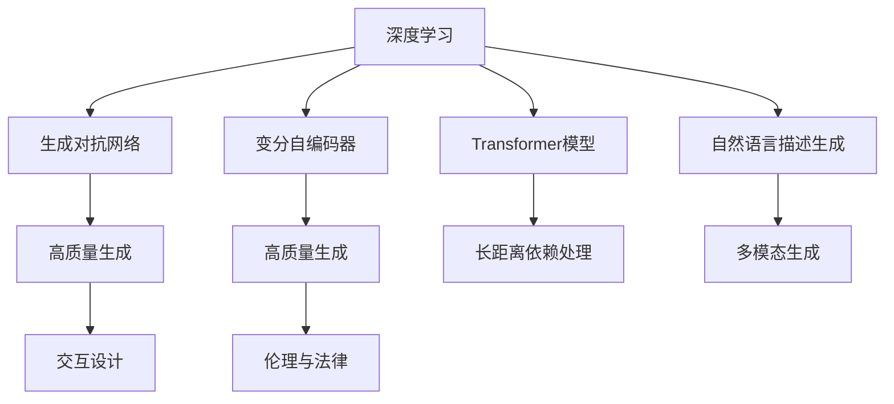
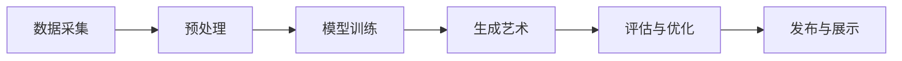
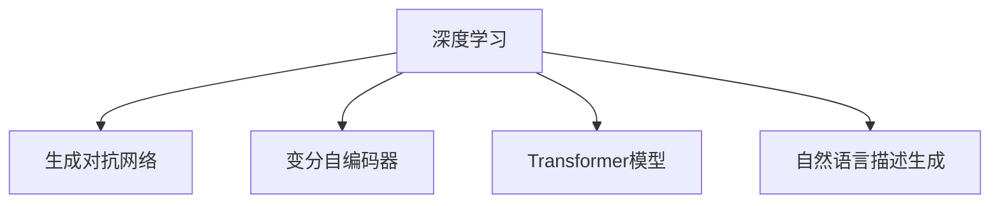
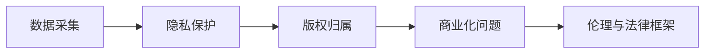
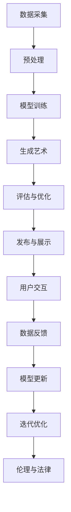

                 

# 软件 2.0 的艺术创作：AI 生成艺术

## 1. 背景介绍

### 1.1 问题由来

随着人工智能（AI）技术的快速发展，AI 生成艺术（Generative Art）正在成为数字时代的新潮流。它突破了传统艺术的创作方式，让机器通过算法和数据生成独一无二的艺术作品，挑战和扩展了人类对艺术与创意的认知。

AI 生成艺术的发展依赖于深度学习、自然语言处理（NLP）、计算机视觉（CV）等多个前沿领域的技术支撑，包括但不限于生成对抗网络（GANs）、变分自编码器（VAEs）、Transformer模型、自然语言描述生成等。这些技术的发展为 AI 生成艺术提供了丰富的算法和工具，使得创作出更加多样化和创新的艺术作品成为可能。

### 1.2 问题核心关键点

AI 生成艺术的创作过程可以概括为以下几个核心关键点：

1. **数据驱动**：AI 生成艺术的主要创作素材是数据，包括文本、图像、音频等多种形式。数据的质量和多样性直接影响艺术作品的表现力。
2. **算法创新**：AI 生成艺术的创作依赖于高效的算法模型，如神经网络、生成模型等。这些模型的优化和创新是提升艺术作品质量的关键。
3. **交互设计**：用户通过交互界面或自然语言指令，引导AI 进行创作。设计友好的交互界面和自然语言交互方式，是提升用户体验和创作效率的重要手段。
4. **伦理与法律**：AI 生成艺术面临诸多伦理和法律问题，如版权归属、数据隐私、作品是否可被商业化等。解决这些问题需要多方的合作和规范的制定。
5. **技术融合**：AI 生成艺术涉及多学科技术的融合，如计算机科学、艺术设计、法律、哲学等。跨领域的知识整合和技术融合，是推动 AI 生成艺术发展的关键。

### 1.3 问题研究意义

研究 AI 生成艺术，不仅能够推动艺术创作和展示方式的革新，还能促进人工智能技术的落地应用，带来新的产业机遇。具体意义包括：

1. **艺术创作的新途径**：AI 生成艺术突破了传统艺术创作的局限，为艺术家提供了全新的创作工具和方法。
2. **技术创新与应用**：AI 生成艺术涉及多项前沿技术，如深度学习、生成模型、自然语言处理等，这些技术的创新和应用，有助于推动AI技术的发展和产业化进程。
3. **跨学科合作**：AI 生成艺术的创作需要多学科知识的融合，促进了艺术与技术、人文学科与自然科学之间的交叉和融合。
4. **产业变革**：AI 生成艺术为博物馆、画廊、艺术品拍卖市场等传统艺术领域带来了新的商业机会和盈利模式。
5. **伦理与法律挑战**：AI 生成艺术带来的伦理与法律问题，促使社会对人工智能技术的监管和规范进行了深入讨论和研究。

## 2. 核心概念与联系

### 2.1 核心概念概述

为更好地理解 AI 生成艺术，本节将介绍几个关键概念及其联系：

1. **深度学习（Deep Learning）**：一种通过多层神经网络进行复杂模式识别和分析的技术，广泛应用于图像、语音、自然语言处理等领域。
2. **生成对抗网络（GANs）**：一种通过两个神经网络（生成器和判别器）进行对抗训练的生成模型，能够生成高质量的图像和音频。
3. **变分自编码器（VAEs）**：一种通过学习潜在变量分布进行生成数据的方法，能够生成连贯、高质量的图像、文本和音频。
4. **Transformer模型**：一种基于自注意力机制的神经网络结构，广泛应用于自然语言处理领域，能够有效处理长距离依赖关系。
5. **自然语言描述生成（NLG）**：通过生成自然语言描述来生成图像、音乐等艺术作品的技术，是 AI 生成艺术的重要工具。
6. **交互设计（Interaction Design）**：通过设计友好的用户界面和自然语言交互方式，提高用户体验和创作效率。
7. **伦理与法律**：AI 生成艺术创作和展示过程中面临的伦理和法律问题，如版权归属、数据隐私等。

这些核心概念之间的逻辑关系可以通过以下 Mermaid 流程图来展示：



这个流程图展示了深度学习在 AI 生成艺术中的核心作用，通过生成对抗网络、变分自编码器、Transformer模型和自然语言描述生成等多种技术，进行高质量和多样化的艺术作品生成。同时，交互设计、伦理与法律等方面，也与AI生成艺术创作息息相关。

### 2.2 概念间的关系

这些核心概念之间存在着紧密的联系，形成了 AI 生成艺术的完整生态系统。下面我们通过几个 Mermaid 流程图来展示这些概念之间的关系。

#### 2.2.1 AI 生成艺术的创作过程



这个流程图展示了 AI 生成艺术的基本创作过程，从数据采集、预处理到模型训练、生成艺术、评估优化，再到发布展示。

#### 2.2.2 AI 生成艺术的算法构成



这个流程图展示了 AI 生成艺术创作中涉及的主要算法，包括深度学习、生成对抗网络、变分自编码器、Transformer模型和自然语言描述生成等。

#### 2.2.3 AI 生成艺术的伦理与法律框架



这个流程图展示了 AI 生成艺术创作过程中面临的伦理与法律问题，包括数据隐私、版权归属、商业化问题等。

### 2.3 核心概念的整体架构

最后，我们用一个综合的流程图来展示这些核心概念在大语言模型微调过程中的整体架构：



这个综合流程图展示了从数据采集到发布展示的完整过程，包括用户交互和数据反馈，以及伦理与法律等方面的考虑。通过这些流程图，我们可以更清晰地理解 AI 生成艺术创作过程中各个环节的作用和联系。

## 3. 核心算法原理 & 具体操作步骤

### 3.1 算法原理概述

AI 生成艺术的创作依赖于生成模型，主要包括以下几种算法：

1. **生成对抗网络（GANs）**：通过生成器和判别器进行对抗训练，生成高质量的图像和音频。
2. **变分自编码器（VAEs）**：通过学习潜在变量分布进行生成数据，能够生成连贯、高质量的图像、文本和音频。
3. **Transformer模型**：基于自注意力机制的神经网络结构，能够有效处理长距离依赖关系，适用于自然语言描述生成。
4. **自然语言描述生成（NLG）**：通过生成自然语言描述来生成图像、音乐等艺术作品，是 AI 生成艺术的重要工具。

这些生成模型的基本原理是通过学习数据分布，生成新的、具有一定多样性和创造性的数据。模型通常由多层神经网络组成，通过不断训练调整模型参数，使得生成的数据能够尽可能地逼近目标数据分布。

### 3.2 算法步骤详解

#### 3.2.1 生成对抗网络（GANs）

GANs 由两个神经网络组成：生成器和判别器。生成器的目标是生成尽可能逼真的人工数据，而判别器的目标是区分生成数据和真实数据。两者通过对抗训练的方式进行优化，生成器的目标是欺骗判别器，使其误认为是真实数据；判别器的目标是尽可能准确地识别生成数据。

GANs 的基本步骤如下：

1. **初始化生成器和判别器**：随机初始化两个神经网络的权重。
2. **训练生成器和判别器**：交替进行生成器和判别器的训练，生成器通过判别器的反馈不断调整生成策略，判别器通过生成器的反馈不断提升识别能力。
3. **优化损失函数**：通过最小化生成器的损失函数和判别器的损失函数，使生成器生成的数据尽可能逼真，判别器尽可能准确地识别生成数据和真实数据。

#### 3.2.2 变分自编码器（VAEs）

VAEs 通过学习潜在变量分布进行生成数据。它由编码器和解码器两个神经网络组成，编码器将输入数据映射到潜在变量空间，解码器将潜在变量映射回原始数据空间。VAEs 的目标是最大化潜在变量分布与数据分布的相似度，最小化重构误差。

VAEs 的基本步骤如下：

1. **初始化编码器和解码器**：随机初始化两个神经网络的权重。
2. **训练编码器和解码器**：通过最小化重构误差和潜在变量分布的差异，训练编码器和解码器。
3. **生成新数据**：使用训练好的编码器将潜在变量映射回原始数据空间，生成新数据。

#### 3.2.3 Transformer模型

Transformer 模型基于自注意力机制，能够有效处理长距离依赖关系，适用于自然语言描述生成。它由多头注意力机制和位置编码组成，能够同时考虑输入序列中的所有位置，捕捉长距离依赖关系。

Transformer 的基本步骤如下：

1. **初始化模型**：随机初始化Transformer模型的权重。
2. **编码输入序列**：将输入序列转化为向量表示。
3. **多头注意力机制**：通过多头注意力机制，捕捉输入序列中的长距离依赖关系。
4. **解码生成序列**：通过解码器生成输出序列。

#### 3.2.4 自然语言描述生成（NLG）

NLG 通过生成自然语言描述来生成图像、音乐等艺术作品，是 AI 生成艺术的重要工具。它通常包括两个步骤：

1. **自然语言描述生成**：通过生成自然语言描述，描述图像、音乐等艺术作品的特点和风格。
2. **生成艺术作品**：通过自然语言描述生成图像、音乐等艺术作品，并进行后处理和优化。

### 3.3 算法优缺点

AI 生成艺术涉及的生成模型具有以下优缺点：

**优点**：

1. **高创造性**：生成模型能够生成新颖的、具有一定创造性的数据，突破传统艺术的创作方式。
2. **高效性**：生成模型通过算法优化，能够在短时间内生成大量高质量的数据，提高创作效率。
3. **多样化**：生成模型能够生成多种形式的艺术作品，如图像、音乐、视频等，丰富艺术创作的表达形式。

**缺点**：

1. **缺乏人类情感**：生成模型生成的艺术作品，缺乏人类艺术家在创作过程中所表达的情感和主观意图。
2. **过拟合风险**：生成模型依赖于训练数据的分布，如果训练数据缺乏多样性，生成的艺术作品容易出现过拟合现象。
3. **伦理和法律问题**：生成模型生成的艺术作品可能涉及版权、隐私等伦理和法律问题，需要多方的合作和规范的制定。

### 3.4 算法应用领域

AI 生成艺术的应用领域非常广泛，涉及艺术创作、游戏设计、广告创意、虚拟现实等多个行业。具体应用包括：

1. **艺术创作**：通过生成对抗网络、变分自编码器等生成模型，创作出高质量的艺术作品。
2. **游戏设计**：通过生成模型生成游戏角色、场景、道具等，提高游戏设计的效率和多样性。
3. **广告创意**：通过生成模型生成广告图像、视频等，吸引更多用户关注和互动。
4. **虚拟现实**：通过生成模型生成虚拟场景、人物等，丰富虚拟现实体验。
5. **音乐创作**：通过生成模型生成音乐作品，创新音乐创作方式。

## 4. 数学模型和公式 & 详细讲解 & 举例说明

### 4.1 数学模型构建

AI 生成艺术的主要数学模型包括生成对抗网络、变分自编码器和Transformer模型等。

**生成对抗网络（GANs）**：

$$
G(x) = \begin{bmatrix} g_1(x) \\ g_2(x) \\ \vdots \\ g_n(x) \end{bmatrix}, \quad D(y) = \begin{bmatrix} d_1(y) \\ d_2(y) \\ \vdots \\ d_n(y) \end{bmatrix}
$$

其中 $G$ 为生成器，$D$ 为判别器，$x$ 为输入噪声，$y$ 为输出数据。

**变分自编码器（VAEs）**：

$$
\begin{aligned}
z &\sim \mathcal{N}(0, I) \\
z &\rightarrow \mu(z), \sigma(z) \\
y &= \mu(z) + \sigma(z) \cdot \epsilon
\end{aligned}
$$

其中 $z$ 为潜在变量，$\mu(z)$ 为编码器的输出，$\sigma(z)$ 为编码器的方差，$\epsilon$ 为噪声变量。

**Transformer模型**：

$$
y = AT \cdot X \cdot AS
$$

其中 $A$ 为注意力矩阵，$T$ 为查询向量，$S$ 为键向量。

**自然语言描述生成（NLG）**：

$$
\begin{aligned}
\text{Seq2Seq} &= \text{Encoder}(\text{input}) \\
&= \text{Decoder}(\text{Seq2Seq}, \text{attention})
\end{aligned}
$$

其中 Encoder 为编码器，Decoder 为解码器，attention 为注意力机制。

### 4.2 公式推导过程

#### 4.2.1 生成对抗网络（GANs）

GANs 的训练过程分为两个步骤：生成器和判别器的交替训练。

**生成器训练**：

$$
\min_G \mathbb{E}_{x \sim p_x} \log D(G(x)) + \mathbb{E}_{z \sim p_z} \log(1 - D(G(z)))
$$

**判别器训练**：

$$
\min_D \mathbb{E}_{x \sim p_x} \log D(x) + \mathbb{E}_{z \sim p_z} \log(1 - D(G(z)))
$$

其中 $p_x$ 为真实数据的概率分布，$p_z$ 为生成数据的概率分布。

#### 4.2.2 变分自编码器（VAEs）

VAEs 的训练过程分为两个步骤：编码器和解码器的训练。

**编码器训练**：

$$
\min_W \mathbb{E}_{x \sim p_x} \log p(z|x)
$$

**解码器训练**：

$$
\min_W \mathbb{E}_{z \sim p(z)} \log p(x|z)
$$

其中 $p(z|x)$ 为潜在变量的条件概率分布，$p(x|z)$ 为输入数据的条件概率分布。

#### 4.2.3 Transformer模型

Transformer模型的训练过程分为编码和解码两个步骤。

**编码器训练**：

$$
\min_W \mathbb{E}_{(x, y) \sim p_{xy}} \log p(y|x)
$$

**解码器训练**：

$$
\min_W \mathbb{E}_{(y, x) \sim p_{xy}} \log p(x|y)
$$

其中 $p(y|x)$ 为输出序列的条件概率分布，$p(x|y)$ 为输入序列的条件概率分布。

#### 4.2.4 自然语言描述生成（NLG）

NLG 的训练过程分为两个步骤：Seq2Seq 模型的训练和注意力机制的训练。

**Seq2Seq 训练**：

$$
\min_{\theta_E, \theta_D} \sum_{(x, y) \in \mathcal{D}} L_{seq2seq}(\theta_E, \theta_D; x, y)
$$

**注意力机制训练**：

$$
\min_{\theta_{attention}} \sum_{(x, y) \in \mathcal{D}} L_{attention}(\theta_{attention}; x, y)
$$

其中 $L_{seq2seq}$ 为Seq2Seq 模型的损失函数，$L_{attention}$ 为注意力机制的损失函数。

### 4.3 案例分析与讲解

#### 4.3.1 生成对抗网络（GANs）案例

**案例1：图像生成**

通过GANs 生成高质量的图像，步骤如下：

1. **数据准备**：准备一组高质量的图像数据，如MNIST手写数字数据集。
2. **模型训练**：使用生成器和判别器交替训练，优化损失函数。
3. **生成图像**：使用训练好的生成器生成新图像，并进行后处理和优化。

**案例2：音乐生成**

通过GANs 生成高质量的音乐，步骤如下：

1. **数据准备**：准备一组高质量的音乐数据，如HipHop音乐数据集。
2. **模型训练**：使用生成器和判别器交替训练，优化损失函数。
3. **生成音乐**：使用训练好的生成器生成新音乐，并进行后处理和优化。

#### 4.3.2 变分自编码器（VAEs）案例

**案例1：图像生成**

通过VAEs 生成高质量的图像，步骤如下：

1. **数据准备**：准备一组高质量的图像数据，如MNIST手写数字数据集。
2. **模型训练**：使用编码器和解码器交替训练，优化损失函数。
3. **生成图像**：使用训练好的编码器和解码器生成新图像，并进行后处理和优化。

**案例2：文本生成**

通过VAEs 生成高质量的文本，步骤如下：

1. **数据准备**：准备一组高质量的文本数据，如英文小说数据集。
2. **模型训练**：使用编码器和解码器交替训练，优化损失函数。
3. **生成文本**：使用训练好的编码器和解码器生成新文本，并进行后处理和优化。

#### 4.3.3 Transformer模型案例

**案例1：自然语言描述生成**

通过Transformer 模型生成高质量的自然语言描述，步骤如下：

1. **数据准备**：准备一组高质量的图像数据，如COCO数据集。
2. **模型训练**：使用编码器和解码器交替训练，优化损失函数。
3. **生成描述**：使用训练好的编码器和解码器生成新的自然语言描述，并进行后处理和优化。

**案例2：代码生成**

通过Transformer 模型生成高质量的代码，步骤如下：

1. **数据准备**：准备一组高质量的代码数据，如Python代码库。
2. **模型训练**：使用编码器和解码器交替训练，优化损失函数。
3. **生成代码**：使用训练好的编码器和解码器生成新的代码，并进行后处理和优化。

#### 4.3.4 自然语言描述生成（NLG）案例

**案例1：图像生成**

通过NLG 生成高质量的图像描述，步骤如下：

1. **数据准备**：准备一组高质量的图像数据，如COCO数据集。
2. **模型训练**：使用编码器和解码器交替训练，优化损失函数。
3. **生成描述**：使用训练好的编码器和解码器生成新的图像描述，并进行后处理和优化。

**案例2：音乐生成**

通过NLG 生成高质量的音乐描述，步骤如下：

1. **数据准备**：准备一组高质量的音乐数据，如HipHop音乐数据集。
2. **模型训练**：使用编码器和解码器交替训练，优化损失函数。
3. **生成描述**：使用训练好的编码器和解码器生成新的音乐描述，并进行后处理和优化。

## 5. 项目实践：代码实例和详细解释说明

### 5.1 开发环境搭建

在进行AI生成艺术项目实践前，我们需要准备好开发环境。以下是使用Python进行PyTorch开发的环境配置流程：

1. 安装Anaconda：从官网下载并安装Anaconda，用于创建独立的Python环境。

2. 创建并激活虚拟环境：
```bash
conda create -n pytorch-env python=3.8 
conda activate pytorch-env
```

3. 安装PyTorch：根据CUDA版本，从官网获取对应的安装命令。例如：
```bash
conda install pytorch torchvision torchaudio cudatoolkit=11.1 -c pytorch -c conda-forge
```

4. 安装Transformers库：
```bash
pip install transformers
```

5. 安装各类工具包：
```bash
pip install numpy pandas scikit-learn matplotlib tqdm jupyter notebook ipython
```

完成上述步骤后，即可在`pytorch-env`环境中开始AI生成艺术实践。

### 5.2 源代码详细实现

这里我们以生成对抗网络（GANs）生成图像的实践为例，给出使用PyTorch实现生成器（Generator）和判别器（Discriminator）的代码实现。

首先，定义生成器和判别器的类：

```python
import torch
import torch.nn as nn
import torch.nn.functional as F

class Generator(nn.Module):
    def __init__(self, input_dim=100, output_channels=3):
        super(Generator, self).__init__()
        self.input_dim = input_dim
        self.output_channels = output_channels
        self.encoder = nn.Sequential(
            nn.Linear(input_dim, 256),
            nn.LeakyReLU(0.2, inplace=True),
            nn.Linear(256, 512),
            nn.LeakyReLU(0.2, inplace=True),
            nn.Linear(512, 1024),
            nn.LeakyReLU(0.2, inplace=True),
            nn.Linear(1024, output_channels**2)
        )
        self.decoder = nn.Sequential(
            nn.Linear(output_channels**2, 1024),
            nn.Tanh(),
            nn.Linear(1024, 512),
            nn.Tanh(),
            nn.Linear(512, 256),
            nn.Tanh(),
            nn.Linear(256, output_channels**2),
            nn.Tanh()
        )
        
    def forward(self, x):
        x = self.encoder(x)
        x = self.decoder(x)
        x = x.view(-1, self.output_channels, 8, 8)
        return x

class Discriminator(nn.Module):
    def __init__(self, input_channels=3):
        super(Discriminator, self).__init__()
        self.input_channels = input_channels
        self.encoder = nn.Sequential(
            nn.Conv2d(input_channels, 64, 4, 2, 1),
            nn.LeakyReLU(0.2, inplace=True),
            nn.Conv2d(64, 128, 4, 2, 1),
            nn.LeakyReLU(0.2, inplace=True),
            nn.Conv2d(128, 256, 4, 2, 1),
            nn.LeakyReLU(0.2, inplace=True),
            nn.Conv2d(256, 1, 4, 1, 0),
            nn.Sigmoid()
        )
        
    def forward(self, x):
        x = self.encoder(x)
        return x.view(-1)
```

然后，定义损失函数和优化器：

```python
import torch.optim as optim

def generator_loss(real, fake):
    mse_loss = nn.MSELoss()
    return mse_loss(fake, real)

def discriminator_loss(real, fake):
    bce_loss = nn.BCELoss()
    return bce_loss(torch.cat((real, fake), 1), torch.cat((torch.ones_like(real), torch.zeros_like(fake)), 1))

def train_epoch(model, data_loader, optimizer):
    for i, (real_images, _) in enumerate(data_loader):
        real_images = real_images.to(device)
        real_images = real_images.view(-1, 3, 8, 8)
        
        optimizer.zero_grad()
        fake_images = model(torch.randn(real_images.size(0), 100, device=device))
        fake_images = fake_images.view(-1, 3, 8, 8)
        
        g_loss = generator_loss(real_images, fake_images)
        d_loss = discriminator_loss(real_images, fake_images)
        loss = g_loss + d_loss
        loss.backward()
        optimizer.step()
        
        print(f'Epoch {i+1}, Generator Loss: {g_loss.item():.4f}, Discriminator Loss: {d_loss.item():.4f}')
```

最后，启动训练流程并在测试集上评估：

```python
epochs = 100
batch_size = 128

for epoch in range(epochs):
    train_epoch(g_model, train_loader, optimizer)
    
    # 测试集评估
    fake_images = g_model(torch.randn(batch_size, 100, device=device))
    fake_images = fake_images.view(-1, 3, 8, 8)
    fake_images = (fake_images + 1) / 2
    
    fig = plt.figure(figsize=(6, 6))
    grid = make_grid(fake_images, nrow=8, padding=2, normalize=True, scale_each=True)
    grid = grid

