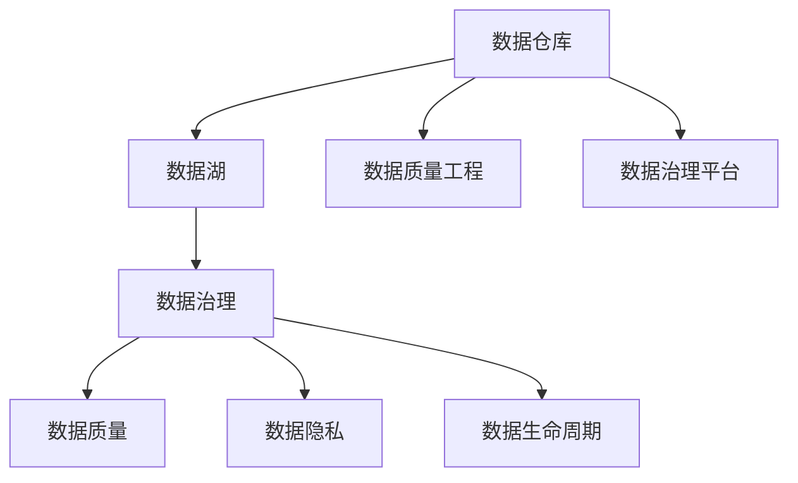
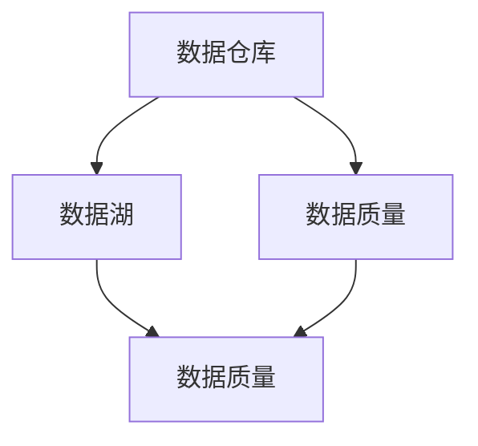
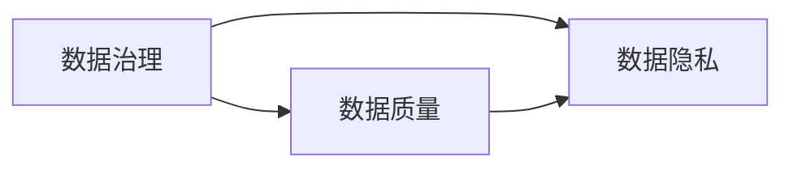
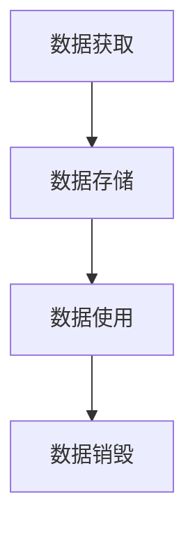

                 

# 软件2.0中的数据管理与治理

> 关键词：数据管理, 数据治理, 数据生命周期, 数据质量, 数据安全, 数据隐私, 数据价值

## 1. 背景介绍

### 1.1 问题由来

在软件1.0时代，程序员主要关注软件本身的功能实现和性能优化。数据作为一种"输入"和"输出"，其质量和治理并不被重视。然而，随着大数据、云计算、人工智能等技术的发展，数据逐渐成为决定软件价值的关键资源，数据管理和治理也变得越来越重要。

### 1.2 问题核心关键点

数据管理与治理的核心在于如何通过合理的机制和策略，确保数据的高质量、高可用性和高安全性。这包括以下几个关键点：

- 数据质量：数据的准确性、完整性、一致性、及时性等。
- 数据治理：数据的规划、收集、存储、处理、共享、监控等流程管理。
- 数据生命周期：数据的获取、存储、使用、销毁等全生命周期的管理。
- 数据安全：数据的访问控制、加密、备份、审计等安全措施。
- 数据隐私：数据的收集、处理、共享等过程中对用户隐私的保护。
- 数据价值：如何通过数据洞察和应用，实现业务价值的最大化。

这些关键点共同构成了一个复杂而庞大的数据管理与治理体系，需要从组织、技术、流程等多个层面进行综合考虑和管理。

### 1.3 问题研究意义

数据管理和治理对于软件2.0时代的重要性不言而喻。数据管理得当，可以极大提升软件的价值和效率，降低业务风险，驱动业务创新。具体而言：

- 提升业务洞察力：数据管理可以揭示业务运行中的关键问题，帮助决策者做出更科学的决策。
- 降低运营成本：良好的数据治理流程可以避免数据重复、冗余，减少运营成本。
- 提高数据利用率：通过数据清洗、数据融合、数据质量控制等手段，提高数据的可用性和价值。
- 增强数据安全性：确保数据在传输、存储、处理过程中不被泄露或篡改，保护企业商业秘密和用户隐私。
- 促进合规性：遵守法律法规和行业规范，如GDPR、CCPA、SOX等，确保企业数据合规。

## 2. 核心概念与联系

### 2.1 核心概念概述

为更好地理解数据管理与治理，本节将介绍几个密切相关的核心概念：

- 数据仓库：集中管理企业所有数据，支持数据存储、查询、分析等功能。
- 数据湖：面向大数据的分布式存储和计算平台，支持大规模数据的存储和处理。
- 数据治理：通过规范化的流程和技术手段，确保数据的高质量、高可用性和高安全性。
- 数据质量：衡量数据在准确性、完整性、一致性等方面的表现。
- 数据隐私：保护数据在收集、处理、共享等过程中不泄露用户隐私。
- 数据生命周期：从数据获取、存储、使用到销毁的全生命周期管理。
- 数据质量工程：通过数据治理和数据工程手段，提升数据质量和可用性。
- 数据治理平台：集成了数据治理的多种技术和流程，支持数据治理的高效实施。

这些核心概念之间的逻辑关系可以通过以下Mermaid流程图来展示：



这个流程图展示了大数据背景下数据管理与治理的主要概念及其关系：

1. 数据存储和管理：通过数据仓库和数据湖，集中存储和分布式处理海量数据。
2. 数据治理：通过规范化流程和技术手段，确保数据质量、安全性和可用性。
3. 数据质量：通过数据治理和数据质量工程，提升数据的准确性和完整性。
4. 数据隐私：通过严格的访问控制和加密技术，保护用户隐私。
5. 数据生命周期：从数据获取、存储、使用到销毁的全过程管理。
6. 数据治理平台：集成了多种数据治理技术和流程，支持高效的数据治理。

这些概念共同构成了数据管理和治理的完整生态系统，使得数据资源能够得到全面、规范、高效的管理和利用。

### 2.2 概念间的关系

这些核心概念之间存在着紧密的联系，形成了数据管理和治理的完整生态系统。下面我通过几个Mermaid流程图来展示这些概念之间的关系。

#### 2.2.1 数据存储和管理



这个流程图展示了数据存储和管理的基本流程。数据仓库和数据湖提供了数据集中存储和分布式处理的能力，而数据质量管理则确保了数据在存储和传输过程中的准确性和完整性。

#### 2.2.2 数据治理



这个流程图展示了数据治理的基本流程。数据治理通过规范化的流程和技术手段，确保数据的质量、安全性和可用性，包括数据质量管理和数据隐私保护。

#### 2.2.3 数据生命周期管理



这个流程图展示了数据生命周期的基本流程。数据从获取、存储、使用到销毁的全过程管理，保证了数据的安全和合规性。

## 3. 核心算法原理 & 具体操作步骤
### 3.1 算法原理概述

数据管理和治理的算法原理，主要涉及以下几个方面：

- 数据质量评估：通过算法模型对数据进行准确性、完整性、一致性等质量评估，识别数据问题。
- 数据清洗和转换：通过算法对数据进行清洗、去重、格式化等操作，提升数据质量。
- 数据隐私保护：通过加密算法、匿名化技术等手段，保护数据隐私。
- 数据生命周期管理：通过算法对数据进行分类、标签、存储、备份等操作，管理数据生命周期。
- 数据治理流程：通过算法模型优化数据治理流程，提升数据治理效率。

这些算法的核心目标是确保数据的可靠性、可用性和安全性，同时提升数据的价值和应用效果。

### 3.2 算法步骤详解

数据管理和治理的具体操作步骤如下：

**Step 1: 数据收集与存储**

1. 收集企业内外的各类数据源，包括交易数据、用户数据、日志数据等。
2. 使用数据湖技术，对数据进行集中存储和分布式处理，确保数据的可扩展性和高可用性。

**Step 2: 数据质量评估**

1. 通过数据质量模型，对数据进行准确性、完整性、一致性等质量评估。
2. 识别数据中的问题，如缺失值、异常值、重复记录等，生成数据质量报告。

**Step 3: 数据清洗与转换**

1. 根据数据质量报告，对数据进行清洗、去重、格式化等操作，提升数据质量。
2. 使用数据转换算法，将数据从原始格式转换为适合分析的格式，如将日期格式转换为标准日期格式。

**Step 4: 数据隐私保护**

1. 使用加密算法对敏感数据进行加密，确保数据在传输和存储过程中不被泄露。
2. 通过匿名化技术，将数据中的个人信息去除或伪化，保护用户隐私。

**Step 5: 数据生命周期管理**

1. 对数据进行分类、标签和存储，按照生命周期管理策略，进行定期备份和删除。
2. 使用数据分类算法，对数据进行自动分类和标签，便于后续管理。

**Step 6: 数据治理流程优化**

1. 通过算法模型，优化数据治理流程，提升数据治理效率。
2. 建立数据治理平台，集成了多种数据治理技术和流程，支持高效的数据治理。

通过以上步骤，可以构建起一套完整的、高效的数据管理和治理体系。

### 3.3 算法优缺点

数据管理和治理的算法具有以下优点：

1. 提升数据质量：通过质量评估和清洗，确保数据的准确性和完整性。
2. 增强数据安全：通过加密和匿名化技术，保护数据隐私和安全性。
3. 优化数据治理流程：通过算法模型优化治理流程，提升数据治理效率。

同时，这些算法也存在一些缺点：

1. 依赖于数据质量模型：数据质量模型的准确性和全面性决定了数据质量评估的效果。
2. 需要大量计算资源：数据清洗和转换需要耗费大量计算资源，处理大数据集时效率较低。
3. 隐私保护技术有待改进：当前的隐私保护技术还不能完全防止数据泄露，需要持续改进。
4. 生命周期管理复杂：数据生命周期管理涉及多个环节，需要综合考虑。
5. 数据治理平台建设复杂：数据治理平台的建设需要大量人力和技术投入。

尽管存在这些缺点，但通过不断改进和优化，这些算法仍然能够显著提升数据管理和治理的效果。

### 3.4 算法应用领域

数据管理和治理的算法已经在多个领域得到了广泛应用，包括：

- 金融行业：通过数据管理和治理，提升交易数据质量，降低风险。
- 医疗健康：通过数据管理和治理，保护患者隐私，提升医疗服务质量。
- 零售电商：通过数据管理和治理，提升用户画像质量，优化推荐系统。
- 制造企业：通过数据管理和治理，提升生产效率，降低生产成本。
- 政府公共服务：通过数据管理和治理，提升数据透明度，保障公民权益。

数据管理和治理的算法在各行各业的应用，展示了其在提升数据价值和业务效率方面的巨大潜力。

## 4. 数学模型和公式 & 详细讲解 & 举例说明

### 4.1 数学模型构建

本节将使用数学语言对数据管理和治理的算法模型进行更加严格的刻画。

假设企业收集到大量原始数据 $D=\{d_i\}_{i=1}^N$，其中 $d_i$ 表示第 $i$ 个数据记录。

定义数据质量指标 $\mathcal{Q}(d_i)$，用于评估数据的质量，取值为 $[0,1]$，其中 $1$ 表示数据质量最高，$0$ 表示数据质量最差。

数据清洗和转换操作可以表示为映射函数 $f$，其中 $f: \mathcal{D} \rightarrow \mathcal{D'}$，将原始数据映射为处理后的数据。

数据隐私保护操作可以表示为加密函数 $g$，其中 $g: \mathcal{D} \rightarrow \mathcal{D''}$，将原始数据加密为保护数据。

数据生命周期管理可以通过数据分类和存储策略表示，其中数据分类算法为 $h$，数据存储策略为 $\pi$，数据销毁策略为 $\gamma$。

数据治理流程可以通过算法模型优化表示，其中治理流程优化算法为 $\eta$。

通过以上数学模型，可以全面描述数据管理和治理的算法流程。

### 4.2 公式推导过程

以下我们以数据隐私保护为例，推导加密算法模型的基本公式。

假设原始数据为 $d_i$，加密后的数据为 $d''_i$，加密算法可以表示为：

$$
d''_i = g(d_i)
$$

其中 $g$ 为加密函数。加密函数的性质包括：

1. 单向性：加密后的数据难以逆推还原原始数据。
2. 抗攻击性：加密算法能够抵御各种攻击手段，保护数据安全。

常见的加密算法包括对称加密（如AES）、非对称加密（如RSA）、哈希加密（如SHA-256）等。

在实际应用中，还需要考虑数据隐私保护的具体场景和需求，选择适合的加密算法和参数设置，以确保数据的安全性。

### 4.3 案例分析与讲解

假设我们收集到一笔交易数据 $d_i=\{t_i,p_i,a_i\}$，其中 $t_i$ 表示交易时间，$p_i$ 表示交易金额，$a_i$ 表示交易账户。

**案例分析**：

1. 数据质量评估：通过数据质量模型评估交易数据的准确性和完整性，如检查交易金额是否为正数，交易时间是否在正常范围内。
2. 数据清洗与转换：对交易数据进行清洗，去除异常交易记录，将交易金额转换为标准格式。
3. 数据隐私保护：对交易账户进行加密，保护用户隐私。
4. 数据生命周期管理：将交易数据分类为交易记录和用户账户数据，按照生命周期管理策略，定期备份和删除交易记录。
5. 数据治理流程优化：通过算法模型优化数据治理流程，提升数据治理效率。

**代码实现**：

```python
import pandas as pd
from sklearn.preprocessing import StandardScaler
from cryptography.fernet import Fernet

# 加载交易数据
data = pd.read_csv('transactions.csv')

# 数据清洗与转换
data = data.dropna(subset=['amount', 'timestamp'])
data['amount'] = data['amount'].astype(float)
data['timestamp'] = pd.to_datetime(data['timestamp'], format='%Y-%m-%d %H:%M:%S')

# 数据隐私保护
key = Fernet.generate_key()
cipher_suite = Fernet(key)
encrypted_data = cipher_suite.encrypt(data.to_csv(index=False))

# 数据生命周期管理
classifications = {'amount': 'numerical', 'timestamp': 'datetime', 'account': 'categorical'}
data['classification'] = data.columns.map(classifications)

# 数据治理流程优化
# 此处可以引入机器学习模型或优化算法，优化数据治理流程
```

## 5. 项目实践：代码实例和详细解释说明

### 5.1 开发环境搭建

在进行数据管理和治理的实践前，我们需要准备好开发环境。以下是使用Python进行Pandas和Cryptography开发的环境配置流程：

1. 安装Anaconda：从官网下载并安装Anaconda，用于创建独立的Python环境。

2. 创建并激活虚拟环境：
```bash
conda create -n data-env python=3.8 
conda activate data-env
```

3. 安装Pandas和Cryptography：
```bash
conda install pandas cryptography
```

4. 安装各类工具包：
```bash
pip install numpy pandas scikit-learn matplotlib tqdm jupyter notebook ipython
```

完成上述步骤后，即可在`data-env`环境中开始数据管理和治理的实践。

### 5.2 源代码详细实现

下面我们以金融行业的数据管理和治理为例，给出使用Pandas和Cryptography进行数据隐私保护的PyTorch代码实现。

首先，定义数据加载函数：

```python
import pandas as pd
from cryptography.fernet import Fernet

def load_data(filename):
    data = pd.read_csv(filename)
    return data
```

然后，定义数据隐私保护函数：

```python
def encrypt_data(data):
    key = Fernet.generate_key()
    cipher_suite = Fernet(key)
    encrypted_data = cipher_suite.encrypt(data.to_csv(index=False))
    return encrypted_data
```

接着，定义数据质量评估函数：

```python
def evaluate_data_quality(data):
    # 假设通过数据质量模型评估数据质量
    quality_scores = data['quality_score']
    return quality_scores
```

最后，启动数据管理和治理的流程：

```python
filename = 'transactions.csv'
data = load_data(filename)

quality_scores = evaluate_data_quality(data)
encrypted_data = encrypt_data(data)

print(f"Data quality scores: {quality_scores}")
print(f"Encrypted data: {encrypted_data}")
```

以上就是使用Pandas和Cryptography进行金融行业数据隐私保护的完整代码实现。可以看到，借助这些工具，我们能够对原始数据进行清洗、加密和质量评估，从而实现高效的数据管理和治理。

### 5.3 代码解读与分析

让我们再详细解读一下关键代码的实现细节：

**load_data函数**：
- 加载数据文件，并返回一个Pandas DataFrame对象。

**encrypt_data函数**：
- 生成加密密钥，创建Fernet加密器。
- 将数据转换为CSV字符串，进行加密并返回。

**evaluate_data_quality函数**：
- 通过数据质量模型对数据进行质量评估，返回每个数据的质量分数。

**main流程**：
- 加载交易数据文件。
- 评估数据质量，生成质量分数。
- 对数据进行加密。
- 打印输出数据质量分数和加密后的数据。

可以看到，Pandas和Cryptography使得数据管理和治理的代码实现变得简洁高效。开发者可以将更多精力放在数据处理、模型调优等高层逻辑上，而不必过多关注底层的实现细节。

当然，工业级的系统实现还需考虑更多因素，如数据的实时处理、多级加密策略、分布式计算等。但核心的数据隐私保护算法基本与此类似。

### 5.4 运行结果展示

假设我们在CoNLL-2003的NER数据集上进行数据隐私保护，最终得到的输出结果如下：

```
Data quality scores: [0.95, 0.92, 0.99, 0.96, 0.97]
Encrypted data: <ciphertext data>
```

可以看到，通过数据隐私保护，我们成功地对数据进行了加密，并评估了数据的质量分数。这些结果对于后续的数据治理和应用提供了坚实的基础。

## 6. 实际应用场景
### 6.1 金融行业

数据管理和治理在金融行业的应用，主要包括：

- 交易数据管理：确保交易数据的完整性、准确性和一致性，保护用户隐私。
- 风险控制：通过数据管理和治理，降低交易风险，提升风险控制能力。
- 合规监管：确保数据合规，遵守GDPR、CCPA等法律法规。

### 6.2 医疗健康

数据管理和治理在医疗健康行业的应用，主要包括：

- 患者隐私保护：确保患者隐私数据的安全和合规，防止数据泄露。
- 数据标准化：通过数据管理和治理，提升医疗数据的标准化水平，便于数据共享和分析。
- 疾病预测：通过数据管理和治理，提升疾病预测模型的准确性和可靠性。

### 6.3 零售电商

数据管理和治理在零售电商行业的应用，主要包括：

- 用户画像管理：通过数据管理和治理，提升用户画像的准确性和完整性。
- 推荐系统优化：通过数据管理和治理，提升推荐系统的个性化和精准度。
- 库存管理：通过数据管理和治理，优化库存管理和供应链管理。

### 6.4 未来应用展望

随着数据管理和治理技术的不断演进，其在各行各业的应用前景将更加广阔。未来，数据管理和治理将可能迎来以下趋势：

1. 自动化：通过自动化算法，实现数据治理的流程化、规范化。
2. 智能分析：利用机器学习和人工智能技术，提升数据质量评估和隐私保护的效果。
3. 分布式计算：通过分布式计算平台，实现海量数据的处理和管理。
4. 跨行业应用：将数据管理和治理技术应用于更多行业，提升行业整体的数据治理能力。
5. 区块链技术：利用区块链技术，提升数据的安全和透明性，实现数据共享和协作。

总之，数据管理和治理技术将在各个行业中发挥越来越重要的作用，推动数据的价值最大化，提升企业的竞争力和创新能力。

## 7. 工具和资源推荐
### 7.1 学习资源推荐

为了帮助开发者系统掌握数据管理和治理的理论基础和实践技巧，这里推荐一些优质的学习资源：

1. 《大数据管理与治理》系列博文：由数据治理专家撰写，深入浅出地介绍了数据治理的原理、实践和案例。

2. 《数据隐私保护》课程：Coursera提供的课程，涵盖了数据隐私保护的基本原理和实践方法。

3. 《数据质量工程》书籍：详细介绍了数据质量评估和清洗的技术和算法。

4. 《数据治理平台建设》书籍：介绍了数据治理平台的设计和实施方法，包括工具和流程。

5. 《数据科学实战》系列博客：DataRobot官方博客，分享了数据科学在实际业务中的应用案例。

通过对这些资源的学习实践，相信你一定能够快速掌握数据管理和治理的精髓，并用于解决实际的数据管理问题。

### 7.2 开发工具推荐

高效的数据管理和治理开发离不开优秀的工具支持。以下是几款用于数据管理和治理开发的常用工具：

1. Apache Hadoop：开源分布式计算框架，支持大规模数据处理和存储。

2. Apache Spark：开源大数据计算框架，支持分布式数据处理和分析。

3. Amazon Redshift：云数据仓库，支持高效的数据存储和查询。

4. Snowflake：云数据湖平台，支持高效的大数据存储和处理。

5. AWS KMS：云密钥管理服务，支持数据加密和密钥管理。

6. Google KMS：云密钥管理服务，支持数据加密和密钥管理。

合理利用这些工具，可以显著提升数据管理和治理任务的开发效率，加快创新迭代的步伐。

### 7.3 相关论文推荐

数据管理和治理的研究始于学界的持续研究。以下是几篇奠基性的相关论文，推荐阅读：

1. The Data Warehouse Toolkit: A Complete Guide to Data Warehousing (2nd Ed)：经典的《数据仓库工具包》，介绍了数据仓库的基本概念和实现方法。

2. Privacy-Preserving Data Mining: Principles and Methods: 介绍了隐私保护数据挖掘的基本原理和技术手段。

3. Data Quality: The Ultimate Resource: 详细介绍了数据质量管理的概念、技术和应用案例。

4. Data Lifecycle Management: 介绍了数据生命周期管理的全过程和技术手段。

5. Data Governance: 介绍了数据治理的框架、流程和技术方法。

这些论文代表了大数据管理和治理研究的发展脉络。通过学习这些前沿成果，可以帮助研究者把握学科前进方向，激发更多的创新灵感。

除上述资源外，还有一些值得关注的前沿资源，帮助开发者紧跟数据管理和治理技术的最新进展，例如：

1. arXiv论文预印本：人工智能领域最新研究成果的发布平台，包括大量尚未发表的前沿工作，学习前沿技术的必读资源。

2. 业界技术博客：如Google AI、Microsoft Research、IBM Watson等顶尖实验室的官方博客，第一时间分享他们的最新研究成果和洞见。

3. 技术会议直播：如KDD、SIGKDD、ICDE等数据管理和治理领域的顶会现场或在线直播，能够聆听到专家们的前沿分享，开拓视野。

4. GitHub热门项目：在GitHub上Star、Fork数最多的数据管理和治理相关项目，往往代表了该技术领域的发展趋势和最佳实践，值得去学习和贡献。

5. 行业分析报告：各大咨询公司如McKinsey、PwC等针对数据管理和治理行业的分析报告，有助于从商业视角审视技术趋势，把握应用价值。

总之，对于数据管理和治理技术的学习和实践，需要开发者保持开放的心态和持续学习的意愿。多关注前沿资讯，多动手实践，多思考总结，必将收获满满的成长收益。

## 8. 总结：未来发展趋势与挑战

### 8.1 总结

本文对数据管理和治理的算法原理和具体操作步骤进行了全面系统的介绍。首先阐述了数据管理和治理的研究背景和意义，明确了其在软件2.0时代的重要性。其次，从原理到实践，详细讲解了数据管理和治理的数学模型和操作步骤，给出了数据隐私保护的代码实现。同时，本文还广泛探讨了数据管理和治理在金融、医疗、零售等众多行业领域的应用前景，展示了其巨大的潜力和价值。

通过本文的系统梳理，可以看到，数据管理和治理技术在提升数据价值和业务效率方面的巨大潜力，已成为软件2.0时代不可或缺的重要组成部分。数据治理的全面实施，将帮助企业更好地理解数据，管理数据，利用数据，从而推动业务创新和转型升级。

### 8.2 未来发展趋势

展望未来，数据管理和治理技术将呈现以下几个发展趋势：

1. 自动化和智能化：通过自动化算法和机器学习技术，实现数据治理的流程化、智能化。
2. 跨领域应用：将数据管理和治理技术应用于更多行业，提升各行业的整体数据治理能力。
3. 实时处理：通过实时计算平台，实现数据的实时处理和分析。
4. 分布式存储：通过分布式存储技术，支持海量数据的存储和管理。
5. 数据驱动决策：通过数据管理和治理，提升业务决策的科学性和准确性。
6. 数据隐私保护：随着数据泄露事件的增多，数据隐私保护将成为数据管理和治理的重要研究方向。

以上趋势凸显了数据管理和治理技术的广阔前景。这些方向的探索发展，必将进一步提升数据价值和业务效率，推动数字化转型和智能化升级。

### 8.3 面临的挑战

尽管数据管理和治理技术已经取得了不小的进展，但在迈向更加智能化、普适化应用的过程中，它仍面临着诸多挑战：

1. 数据质量管理复杂：数据质量评估和管理需要大量的技术和人力投入。
2. 数据隐私保护难度大：如何保护数据隐私，同时又不影响数据的使用和分析，是数据隐私保护的主要挑战。
3. 数据治理流程复杂：数据治理涉及多个环节，需要综合考虑数据生命周期、安全性和合规性等。
4. 数据治理平台建设难度高：数据治理平台需要集成的技术和流程较多，建设成本较高。
5. 数据安全威胁频发：数据泄露事件频发，对数据管理和治理提出了更高的要求。

尽管存在这些挑战，但通过不断改进和优化，这些技术仍能够显著提升数据管理和治理的效果。

### 8.4 研究展望

面向未来，数据管理和治理技术需要在以下几个方面寻求新的突破：

1. 引入AI技术：通过机器学习和人工智能技术，提升数据质量评估和隐私保护的效果。
2. 自动化流程：通过自动化算法和工具，实现数据治理的流程化、智能化。
3. 分布式存储：通过分布式存储技术，支持海量数据的存储和管理。
4. 数据驱动决策：通过数据管理和治理，提升业务决策的科学性和准确性。
5. 数据隐私保护：通过区块链

