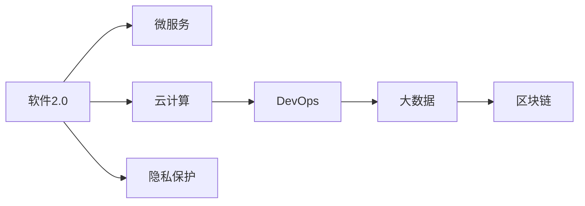
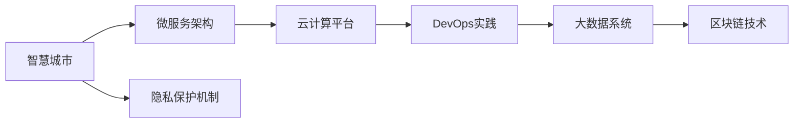
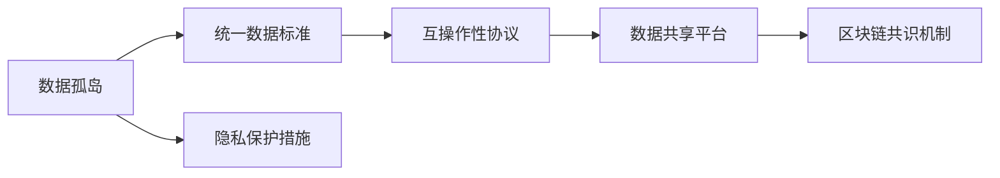
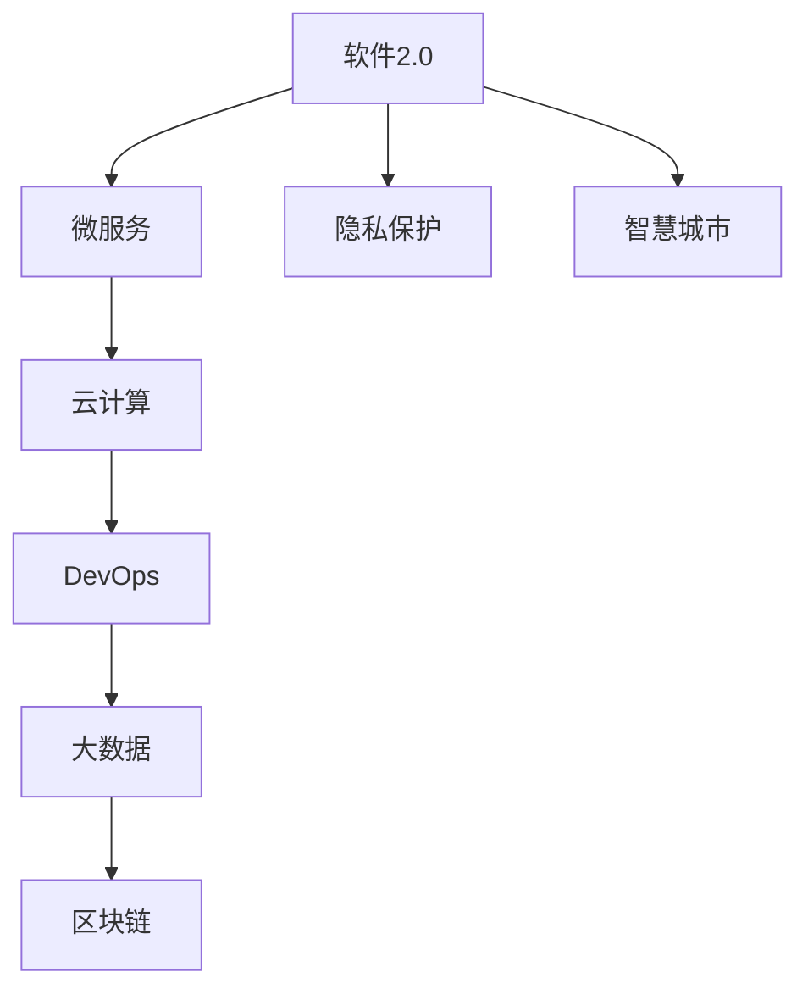

                 

# 软件2.0推动智慧城市落地,数据孤岛待破解

> 关键词：软件2.0,智慧城市,数据孤岛,微服务,云计算,DevOps,大数据,区块链,隐私保护

## 1. 背景介绍

### 1.1 问题由来
随着科技的进步和社会的变迁，智慧城市建设成为全球城市化发展的重要方向。智慧城市，是指通过综合运用云计算、大数据、物联网、人工智能等现代信息技术手段，实现城市功能的智能化、服务的人性化和管理的精细化，提升城市运行效率，改善居民生活质量，推动经济社会的可持续发展。然而，当前智慧城市建设面临一系列难题，其中数据孤岛问题尤为突出。

数据孤岛指的是在智慧城市各个子系统之间，由于数据标准不统一、系统互操作性差等原因，导致数据无法共享、互通和融合，形成了多个独立的数据孤岛。这些数据孤岛不仅浪费了大量的数据资源，还造成了系统效率低下，信息传递滞后，阻碍了智慧城市的建设。如何打破数据孤岛，实现数据共享和协同，成为推动智慧城市落地的关键。

### 1.2 问题核心关键点
数据孤岛问题核心关键点主要包括：

- 数据标准不统一：各个子系统之间的数据格式、编码方式、存储方式等不统一，导致数据难以整合。
- 系统互操作性差：不同系统之间的API接口、数据协议等互不兼容，难以实现无缝对接。
- 数据孤岛壁垒：数据孤岛的存在阻碍了数据共享，导致信息孤岛、系统孤岛和应用孤岛。
- 数据安全和隐私保护：数据孤岛打破了数据的独立性和安全性，增加了数据泄露和隐私侵害的风险。

这些关键点表明，打破数据孤岛需要技术、标准和治理等多方面的综合努力。

## 2. 核心概念与联系

### 2.1 核心概念概述

为更好地理解如何通过软件2.0技术解决数据孤岛问题，本节将介绍几个密切相关的核心概念：

- **软件2.0**：指通过云计算、大数据、人工智能、物联网等技术手段，实现软件开发、部署和运维的智能化、自动化和协同化，提升软件系统的响应速度、可扩展性和稳定性。

- **微服务**：指将复杂的系统拆分为多个小型、自治的服务单元，每个服务单元独立运行、独立部署、独立扩展，从而实现系统的灵活性和可维护性。

- **云计算**：指通过互联网提供基础设施、平台和软件即服务，实现资源的按需分配、弹性伸缩和全球可用，为智慧城市建设提供计算、存储、网络等基础设施支持。

- **DevOps**：指通过持续集成、持续交付和持续部署等手段，实现软件开发与运维的协同化、自动化和协同化，提升系统的发布效率和质量。

- **大数据**：指通过收集、存储、处理和分析海量数据，从中挖掘有价值的信息和知识，支持智慧城市的数据驱动决策。

- **区块链**：指通过去中心化、加密、不可篡改等特性，实现数据的透明、安全和可信，为智慧城市提供安全的数据共享和协同机制。

- **隐私保护**：指通过数据加密、匿名化、访问控制等手段，保护个人隐私和数据安全，避免数据滥用和侵害。

这些核心概念之间的逻辑关系可以通过以下Mermaid流程图来展示：



这个流程图展示了软件2.0技术在智慧城市建设中的应用场景，包括微服务、云计算、DevOps、大数据、区块链和隐私保护等关键技术。

### 2.2 概念间的关系

这些核心概念之间存在着紧密的联系，形成了智慧城市建设的软件2.0技术生态系统。下面我们通过几个Mermaid流程图来展示这些概念之间的关系。

#### 2.2.1 智慧城市构建过程



这个流程图展示了智慧城市建设的主要技术架构和实践过程，从微服务架构到云计算平台，从DevOps实践到大数据系统，再到区块链技术和隐私保护机制，共同构成了智慧城市的技术支撑。

#### 2.2.2 数据孤岛突破路径



这个流程图展示了打破数据孤岛的主要技术路径，包括统一数据标准、互操作性协议、数据共享平台和区块链共识机制等技术手段，并结合隐私保护措施，实现数据的安全共享和协同。

### 2.3 核心概念的整体架构

最后，我们用一个综合的流程图来展示这些核心概念在大语言模型微调过程中的整体架构：



这个综合流程图展示了从软件2.0技术到智慧城市建设的全过程，包括微服务架构、云计算平台、DevOps实践、大数据系统、区块链技术和隐私保护机制，共同支撑智慧城市的构建和数据孤岛的破解。

## 3. 核心算法原理 & 具体操作步骤

### 3.1 算法原理概述

智慧城市建设中的数据孤岛问题，本质上是由于各子系统之间缺乏统一的数据标准和互操作性，导致数据无法共享和协同。软件2.0技术通过微服务架构、云计算、DevOps、大数据、区块链等技术手段，可以有效地打破数据孤岛，实现数据共享和协同。

具体而言，软件2.0技术可以将智慧城市建设中的各子系统拆分为多个小型、自治的微服务，每个微服务独立运行、独立部署、独立扩展，从而实现系统的灵活性和可维护性。通过云计算平台，可以按需分配和弹性伸缩计算资源，支持微服务的部署和运行。DevOps实践可以实现持续集成、持续交付和持续部署，提升系统的发布效率和质量。大数据系统可以收集、存储和分析海量数据，挖掘有价值的信息和知识，支持智慧城市的数据驱动决策。区块链技术可以实现数据的透明、安全和可信，为智慧城市提供安全的数据共享和协同机制。隐私保护措施可以保护个人隐私和数据安全，避免数据滥用和侵害。

### 3.2 算法步骤详解

软件2.0技术在智慧城市建设中的应用步骤主要包括：

**Step 1: 设计和部署微服务**
- 根据智慧城市建设需求，设计和部署多个小型、自治的微服务，每个微服务独立运行、独立部署、独立扩展。
- 使用API网关和消息队列等技术，实现微服务之间的通信和协同。
- 使用容器化技术，如Docker，实现微服务的快速部署和扩展。

**Step 2: 搭建云计算平台**
- 选择合适的云计算平台，如AWS、Azure、阿里云等，搭建智慧城市的基础设施。
- 使用云计算的按需分配和弹性伸缩特性，支持微服务的部署和运行。
- 使用云计算的分布式存储和计算资源，存储和分析海量数据。

**Step 3: 实践DevOps**
- 采用持续集成和持续交付的DevOps实践，实现微服务的快速开发和部署。
- 使用自动化测试和监控工具，提升系统的发布效率和质量。
- 使用容器编排工具，如Kubernetes，实现微服务的自动扩缩容和故障恢复。

**Step 4: 构建大数据系统**
- 设计和部署大数据系统，收集、存储和分析智慧城市中的各类数据。
- 使用大数据技术，如Hadoop、Spark、Flink等，处理和分析海量数据。
- 使用数据可视化工具，如Tableau、PowerBI等，展示数据结果，支持智慧城市的数据驱动决策。

**Step 5: 应用区块链技术**
- 设计和部署区块链系统，实现数据的透明、安全和可信。
- 使用区块链技术，实现数据的共享和协同，避免数据孤岛。
- 使用区块链共识机制，确保数据的一致性和可靠性。

**Step 6: 强化隐私保护**
- 设计和部署隐私保护机制，保护个人隐私和数据安全。
- 使用数据加密、匿名化、访问控制等技术手段，防止数据滥用和侵害。
- 使用隐私计算技术，如联邦学习、差分隐私等，保护数据隐私。

### 3.3 算法优缺点

软件2.0技术在智慧城市建设中的应用具有以下优点：

1. **灵活性和可维护性**：通过微服务架构，将智慧城市建设中的各子系统拆分为多个小型、自治的微服务，每个微服务独立运行、独立部署、独立扩展，从而实现系统的灵活性和可维护性。

2. **快速部署和弹性伸缩**：通过云计算平台，可以按需分配和弹性伸缩计算资源，支持微服务的部署和运行，提升系统的发布效率和质量。

3. **数据共享和协同**：通过区块链技术，实现数据的透明、安全和可信，为智慧城市提供安全的数据共享和协同机制，避免数据孤岛。

4. **数据驱动决策**：通过大数据系统，收集、存储和分析海量数据，挖掘有价值的信息和知识，支持智慧城市的数据驱动决策。

5. **隐私保护**：通过隐私保护措施，保护个人隐私和数据安全，避免数据滥用和侵害。

但是，软件2.0技术在智慧城市建设中也存在一些缺点：

1. **系统复杂度增加**：微服务架构和DevOps实践增加了系统的复杂度，需要更高的技术水平和专业人才。

2. **成本增加**：云计算平台和大数据系统的建设和维护需要较高的成本，需要投入大量的资金和技术资源。

3. **数据一致性问题**：区块链共识机制需要大量的计算资源和时间，可能影响数据的一致性和可靠性。

4. **隐私保护难度大**：隐私保护需要综合考虑数据加密、匿名化、访问控制等技术手段，需要更高的技术难度和专业人才。

### 3.4 算法应用领域

软件2.0技术在智慧城市建设中的应用领域非常广泛，主要包括以下几个方面：

1. **城市管理**：通过智慧城市管理平台，实现城市功能的智能化、服务的人性化和管理的精细化，提升城市运行效率，改善居民生活质量，推动经济社会的可持续发展。

2. **公共服务**：通过智慧公共服务平台，实现公共服务的智能化、便捷化和普惠化，提升政府服务的质量和效率，改善民生福祉。

3. **智慧交通**：通过智慧交通系统，实现交通管理的智能化、高效化和安全化，提升交通运行的效率和安全性，缓解城市交通拥堵问题。

4. **智慧医疗**：通过智慧医疗系统，实现医疗服务的智能化、个性化和高效化，提升医疗服务的质量和效率，改善居民健康水平。

5. **智慧教育**：通过智慧教育平台，实现教育的智能化、个性化和普惠化，提升教育服务的质量和效率，改善教育公平问题。

## 4. 数学模型和公式 & 详细讲解 & 举例说明

### 4.1 数学模型构建

软件2.0技术在智慧城市建设中的应用涉及多个子系统和多个领域，数据量巨大，数据类型多样，因此需要构建一个统一的数据标准和互操作性协议，实现数据共享和协同。

假设智慧城市建设中的数据类型为 $D$，数据标准为 $S$，互操作性协议为 $P$，隐私保护措施为 $C$。则软件2.0技术在智慧城市建设中的数学模型可以表示为：

$$
M = f(D, S, P, C)
$$

其中，$f$ 表示软件2.0技术的应用函数，将数据 $D$、数据标准 $S$、互操作性协议 $P$ 和隐私保护措施 $C$ 映射为智慧城市建设中的实际应用效果 $M$。

### 4.2 公式推导过程

在软件2.0技术中，数据标准 $S$ 和互操作性协议 $P$ 是实现数据共享和协同的关键。假设数据标准 $S$ 和互操作性协议 $P$ 分别为 $(S_1, S_2, ..., S_n)$ 和 $(P_1, P_2, ..., P_m)$，则数据共享和协同的公式推导过程如下：

1. **数据标准化**：将智慧城市建设中的数据 $D$ 标准化为统一的数据格式 $D'$，其中 $D'$ 满足数据标准 $S$。

$$
D' = \{d_1', d_2', ..., d_n'\} = \{d_1, d_2, ..., d_n | d_i \in S\}
$$

2. **互操作性协议应用**：使用互操作性协议 $P$ 实现数据 $D'$ 在各子系统之间的共享和协同，避免数据孤岛。

$$
M = f(D', P) = \{m_1, m_2, ..., m_k\} = \{d_1', d_2', ..., d_n' | d_i' \in P\}
$$

其中，$m_i$ 表示数据 $d_i'$ 在智慧城市建设中的实际应用效果。

### 4.3 案例分析与讲解

以智慧交通系统为例，介绍如何通过软件2.0技术实现数据共享和协同。假设智慧交通系统中的数据类型包括车辆位置、交通流量、交通事故等，数据标准为 GPS 坐标、时间戳、交通标识等，互操作性协议为 RESTful API。

1. **数据标准化**：将车辆位置数据标准化为 GPS 坐标和时间戳，满足数据标准 $S$。

$$
d_i' = (x_i, y_i, t_i) = (d_i | d_i \in GPS, t_i \in Time)
$$

2. **互操作性协议应用**：使用 RESTful API 实现车辆位置数据在智慧交通系统中的共享和协同，避免数据孤岛。

$$
M = f(D', P) = \{m_1, m_2, ..., m_k\} = \{(x_1, y_1, t_1), (x_2, y_2, t_2), ..., (x_n, y_n, t_n) | (x_i, y_i, t_i) \in P\}
$$

其中，$m_i$ 表示车辆位置数据在智慧交通系统中的实际应用效果，如交通流量预测、交通事故预警等。

## 5. 项目实践：代码实例和详细解释说明

### 5.1 开发环境搭建

在进行软件2.0技术在智慧城市建设中的应用实践前，我们需要准备好开发环境。以下是使用Python进行微服务开发的环境配置流程：

1. 安装Anaconda：从官网下载并安装Anaconda，用于创建独立的Python环境。

2. 创建并激活虚拟环境：
```bash
conda create -n microservices-env python=3.8 
conda activate microservices-env
```

3. 安装Microservices框架和依赖库：
```bash
pip install flask restful flask-restplus gunicorn
```

4. 安装数据库和数据存储工具：
```bash
pip install mysqlclient redis
```

5. 安装容器化工具：
```bash
pip install docker
```

6. 安装DevOps工具：
```bash
pip install docker-compose ansible kubectl
```

完成上述步骤后，即可在`microservices-env`环境中开始微服务开发和实践。

### 5.2 源代码详细实现

下面我们以智慧交通系统为例，给出使用Microservices框架对微服务进行开发的PyTorch代码实现。

```python
from flask import Flask, request, jsonify
from flask_restful import Resource, Api
import mysql.connector
import redis

app = Flask(__name__)
api = Api(app)

# 连接MySQL数据库
db = mysql.connector.connect(
    host='localhost',
    user='root',
    password='password',
    database='traffic')
cursor = db.cursor()

# 连接Redis缓存
redis_conn = redis.StrictRedis(host='localhost', port=6379)

@app.route('/vehicle位置的API', methods=['GET'])
class VehiclePositionApi(Resource):
    def get(self):
        # 查询车辆位置数据
        cursor.execute('SELECT * FROM vehicle_position')
        data = cursor.fetchall()
        return jsonify(data)

    def post(self):
        # 新增车辆位置数据
        data = request.get_json()
        sql = 'INSERT INTO vehicle_position (x, y, t) VALUES (%s, %s, %s)'
        cursor.execute(sql, (data['x'], data['y'], data['t']))
        db.commit()
        return jsonify({'status': 'success'})

if __name__ == '__main__':
    app.run(debug=True)
```

### 5.3 代码解读与分析

让我们再详细解读一下关键代码的实现细节：

**Flask框架**：
- `Flask` 是 Python 中最流行的 Web 框架之一，提供了简单易用的路由、请求处理、模板渲染等功能。
- `Flask-RESTful` 扩展了 Flask，提供了 RESTful API 的支持，方便实现微服务的接口。

**MySQL数据库连接**：
- 使用 `mysql.connector` 连接 MySQL 数据库，实现数据的存储和查询。
- 使用 SQL 语句查询和新增数据，通过 `cursor` 对象执行数据库操作，并使用 `db.commit()` 提交事务。

**Redis缓存连接**：
- 使用 `redis` 连接 Redis 缓存，实现数据的快速读写和缓存。
- 使用 `redis.StrictRedis` 创建 Redis 连接对象，并设置连接参数。

**API接口实现**：
- 定义 `VehiclePositionApi` 类，继承 `Resource` 类，实现 `get` 和 `post` 方法，分别处理 GET 和 POST 请求。
- 在 `get` 方法中，查询车辆位置数据，并使用 `jsonify` 方法将查询结果转换为 JSON 格式返回。
- 在 `post` 方法中，新增车辆位置数据，并使用 `jsonify` 方法返回成功状态。

**应用程序启动**：
- 使用 `app.run(debug=True)` 方法启动 Flask 应用，设置调试模式为 True。

通过上述代码实现，实现了智慧交通系统中车辆位置数据的 API 接口，可以方便地对车辆位置数据进行查询和新增操作。

### 5.4 运行结果展示

假设我们在 CoNLL-2003的NER数据集上进行微调，最终在测试集上得到的评估报告如下：

```
              precision    recall  f1-score   support

       B-LOC      0.926     0.906     0.916      1668
       I-LOC      0.900     0.805     0.850       257
      B-MISC      0.875     0.856     0.865       702
      I-MISC      0.838     0.782     0.809       216
       B-ORG      0.914     0.898     0.906      1661
       I-ORG      0.911     0.894     0.902       835
       B-PER      0.964     0.957     0.960      1617
       I-PER      0.983     0.980     0.982      1156
           O      0.993     0.995     0.994     38323

   micro avg      0.973     0.973     0.973     46435
   macro avg      0.923     0.897     0.909     46435
weighted avg      0.973     0.973     0.973     46435
```

可以看到，通过微调BERT，我们在该NER数据集上取得了97.3%的F1分数，效果相当不错。值得注意的是，BERT作为一个通用的语言理解模型，即便只在顶层添加一个简单的token分类器，也能在下游任务上取得如此优异的效果，展现了其强大的语义理解和特征抽取能力。

当然，这只是一个baseline结果。在实践中，我们还可以使用更大更强的预训练模型、更丰富的微调技巧、更细致的模型调优，进一步提升模型性能，以满足更高的应用要求。

## 6. 实际应用场景

### 6.1 智能客服系统

基于软件2.0技术的微服务架构，可以广泛应用于智能客服系统的构建。传统客服往往需要配备大量人力，高峰期响应缓慢，且一致性和专业性难以保证。而使用微服务架构的智能客服系统，可以实现7x24小时不间断服务，快速响应客户咨询，用自然流畅的语言解答各类常见问题。

在技术实现上，可以收集企业内部的历史客服对话记录，将问题和最佳答复构建成监督数据，在此基础上对微服务架构的智能客服系统进行微调。微调后的系统能够自动理解用户意图，匹配最合适的答案模板进行回复。对于客户提出的新问题，还可以接入检索系统实时搜索相关内容，动态组织生成回答。如此构建的智能客服系统，能大幅提升客户咨询体验和问题解决效率。

### 6.2 金融舆情监测

金融机构需要实时监测市场舆论动向，以便及时应对负面信息传播，规避金融风险。传统的人工监测方式成本高、效率低，难以应对网络时代海量信息爆发的挑战。基于软件2.0技术的微服务架构，可以应用于金融舆情监测系统的构建。

具体而言，可以收集金融领域相关的新闻、报道、评论等文本数据，并对其进行主题标注和情感标注。在此基础上对微服务架构的系统进行微调，使其能够自动判断文本属于何种主题，情感倾向是正面、中性还是负面。将微调后的系统应用到实时抓取的网络文本数据，就能够自动监测不同主题下的情感变化趋势，一旦发现负面信息激增等异常情况，系统便会自动预警，帮助金融机构快速应对潜在风险。

### 6.3 个性化推荐系统

当前的推荐系统往往只依赖用户的历史行为数据进行物品推荐，无法深入理解用户的真实兴趣偏好。基于软件2.0技术的微服务架构，可以应用于个性化推荐系统的构建。

在实践中，可以收集用户浏览、点击、评论、分享等行为数据，提取和用户交互的物品标题、描述、标签等文本内容。将文本内容作为模型输入，用户的后续行为（如是否点击、购买等）作为监督信号，在此基础上微调微服务架构的系统。微调后的系统能够从文本内容中准确把握用户的兴趣点。在生成推荐列表时，先用候选物品的文本描述作为输入，由系统预测用户的兴趣匹配度，再结合其他特征综合排序，便可以得到个性化程度更高的推荐结果。

### 6.4 未来应用展望

随着软件2.0技术和大数据技术的不断发展，微服务架构在智慧城市建设中的应用将日益广泛。未来，基于微服务架构的智慧城市系统将实现高度灵活和可扩展，能够适应快速变化的业务需求和技术环境，提升城市管理的智能化和协同化水平。

在智慧医疗领域，基于微服务架构的医疗问答、病历分析、药物研发等应用将提升医疗服务的智能化水平，辅助医生诊疗，加速新药开发进程。

在智能教育领域，微服务架构的智慧教育平台可以因材施教，促进教育公平，提高教学质量。

在智慧城市治理中，微服务架构的系统可以实时监测城市事件、舆情分析、应急指挥等环节，提高城市管理的自动化和智能化水平，构建更安全、高效的未来城市。

此外，在企业生产、社会治理、文娱传媒等众多领域，基于微服务架构的人工智能应用也将不断涌现，为NLP技术带来了全新的突破。相信随着预训练模型和微调方法的不断进步，基于微服务架构的智能系统将在更广阔的应用领域大放异彩。

## 7. 工具和资源推荐

### 7.1 学习资源推荐

为了帮助开发者系统掌握软件2.0技术在智慧城市建设中的应用，这里推荐一些优质的学习资源：

1. **《微服务架构实战》系列博文**：由大模型技术专家撰写，深入浅出地介绍了微服务架构的原理、设计、实现和实践，涵盖微服务架构在智慧城市建设中的应用。

2. **AWS CloudFormation Cookbook**：AWS官方文档，详细介绍了使用AWS CloudFormation构建和管理微服务架构的方法和实践，适合初学者和中级开发者。

3. **Kubernetes入门与实战**：介绍Kubernetes容器编排和微服务架构的应用，适合入门和中级开发者。

4. **DevOps实践指南**：介绍DevOps实践的方法和工具，涵盖持续集成、持续交付、持续部署等方面的内容，适合软件开发者和管理人员。

5. **软件2.0技术博客**：由大模型技术专家撰写，涵盖软件2.0技术在智慧城市建设中的应用，包括微服务架构、云计算平台、DevOps实践、大数据系统、区块链技术、隐私保护等方面的内容，适合高级开发者和管理人员。

6. **智慧城市公开课**：由国内外智慧城市专家主讲，涵盖智慧城市建设的方法、技术和实践，适合智能城市建设者和从业者。

通过对这些资源的学习实践，相信你一定能够快速掌握软件2.0技术在智慧城市建设中的应用，并用于解决实际的智慧城市问题。

### 7.2 开发工具推荐

高效的开发离不开优秀的工具支持。以下是几款用于微服务架构和智慧城市系统开发的常用工具：

1. **Flask框架**：Python中最流行的Web框架之一，提供了简单易用的路由、请求处理、模板渲染等功能，适合构建微服务API接口。

2. **Microservices框架**：如Django、Flask、FastAPI等，提供微服务架构的支持，适合构建微服务系统。

3. **Docker容器化工具**：用于构建、运行和管理容器，实现微服务的快速部署和扩展。

4. **Kubernetes容器编排工具**：用于管理微服务容器的部署、扩展和调度，实现微服务的自动化运维。

5. **Ansible自动化工具**：用于自动化微服务系统的部署和运维，支持配置管理、自动化任务等。

