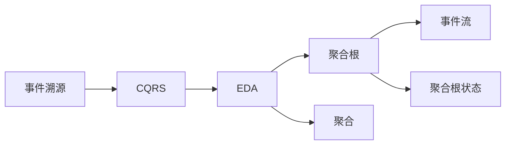
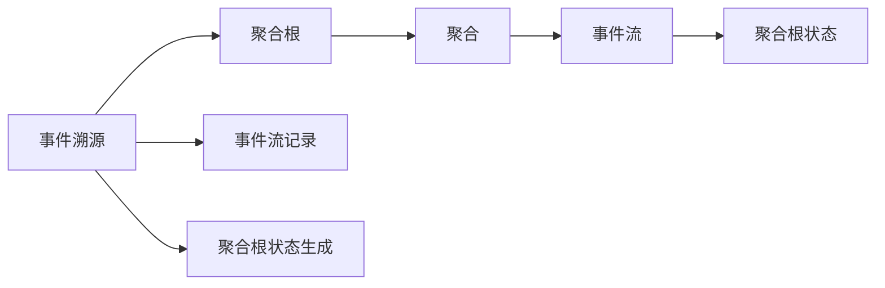
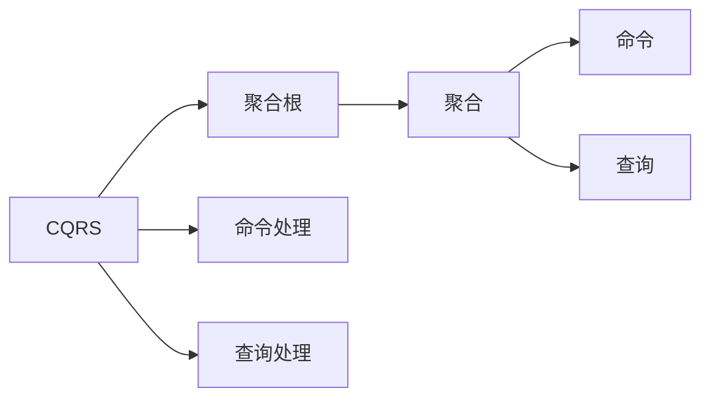
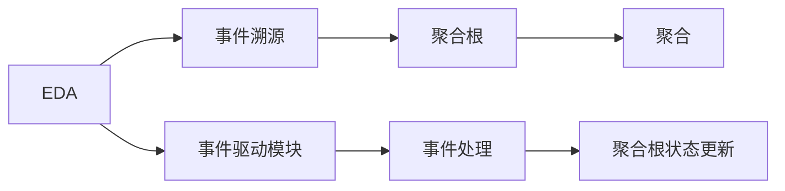
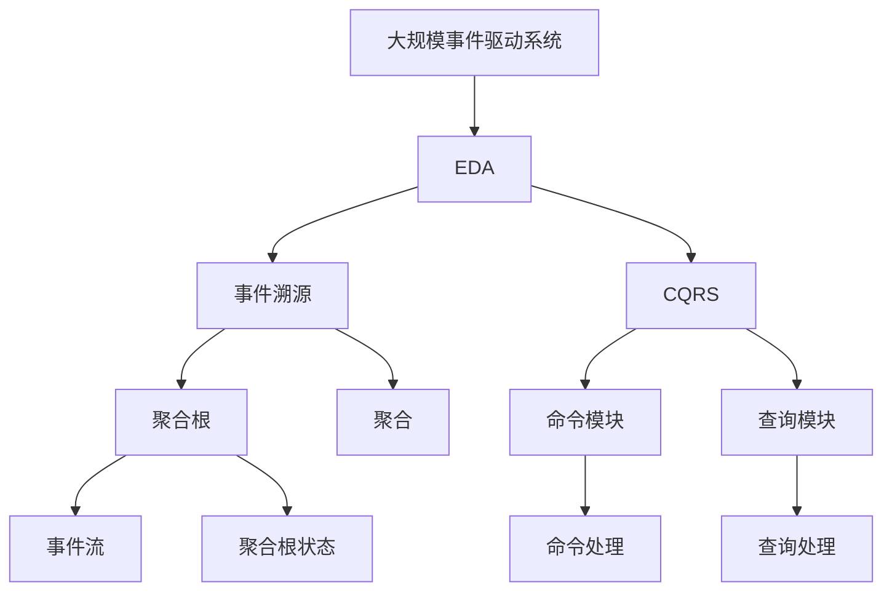

                 

# 软件2.0的事件溯源与CQRS模式

软件2.0（Software 2.0），作为新一代软件工程范式，正在改变传统的软件开发、部署、维护和演进方式。而事件溯源（Event Sourcing）和命令查询分离（Command Query Responsibility Segregation, CQRS）模式，则是软件2.0的重要组成部分，通过事件驱动架构（Event-Driven Architecture, EDA）实现软件的模块化、可维护性、弹性和演进性。本文将深入探讨事件溯源与CQRS模式，阐述其原理、实现方法和应用场景，并探讨未来的发展趋势和面临的挑战。

## 1. 背景介绍

### 1.1 问题由来

在传统的软件工程中，软件系统采用面向对象或面向过程的架构，通过响应式编程模型实现。然而，这种架构存在诸多问题，如扩展性差、维护成本高、代码耦合严重等。软件2.0的诞生，旨在解决这些问题，提升软件系统的开发效率和维护性。

### 1.2 问题核心关键点

软件2.0的核心在于事件驱动架构，通过事件将系统状态的变化封装成消息（Message），系统模块基于消息进行交互。事件溯源和CQRS模式，则是事件驱动架构的两个重要组成部分，分别用于管理和控制事件流、命令与查询的分离。

事件溯源的核心思想是将系统状态的变化记录为事件序列，通过事件序列重构系统状态，从而实现数据的持久化和版本管理。CQRS模式通过分离命令与查询，优化了系统的性能和可扩展性，允许系统模块独立演化，提高系统的弹性。

### 1.3 问题研究意义

事件溯源与CQRS模式，通过事件驱动架构，实现了软件的模块化、可维护性、弹性和演进性。其意义在于：

1. 模块化开发：事件驱动架构将系统划分为多个独立的模块，每个模块独立开发、部署和维护，增强了系统的可维护性和复用性。
2. 弹性演化：通过事件溯源和CQRS模式，系统可以独立进行演进和优化，避免了整体升级带来的风险，提高了系统的弹性和生命周期。
3. 实时监控：事件溯源提供了实时监控和审计能力，有助于系统故障定位和性能优化。
4. 数据驱动：CQRS模式通过分离命令与查询，实现了数据驱动的业务逻辑，增强了系统的适应性和灵活性。
5. 高可扩展性：通过事件驱动架构，系统可以轻松扩展新功能和模块，提升了系统的可扩展性。

## 2. 核心概念与联系

### 2.1 核心概念概述

- **事件溯源**（Event Sourcing）：通过记录系统状态变化的事件序列，实现数据的持久化和版本管理。
- **命令查询分离**（CQRS）：将命令和查询分离，优化系统性能和可扩展性。
- **事件驱动架构**（Event-Driven Architecture, EDA）：基于事件进行模块交互的架构，实现系统的模块化和弹性。
- **聚合根**（Aggregate Root）：聚合根是一个包含事件流和聚合根状态的根对象，负责处理事件并生成聚合根状态。
- **聚合**（Aggregate）：聚合是聚合根内部的数据结构，用于存储事件流和聚合根状态。
- **CQRS**模式：CQRS模式通过分离命令和查询，优化系统性能和可扩展性，允许系统模块独立演化。

这些核心概念之间的联系如下：



事件溯源和CQRS模式是EDA的两个重要组成部分，通过记录系统状态变化的事件序列，实现数据的持久化和版本管理。而聚合根和聚合是实现事件溯源的核心概念，负责处理事件并生成聚合根状态。CQRS模式则通过分离命令与查询，优化系统性能和可扩展性，允许系统模块独立演化。

### 2.2 概念间的关系

这些核心概念之间存在着紧密的联系，形成了事件驱动架构的完整生态系统。下面通过Mermaid流程图来展示这些概念之间的关系。

#### 2.2.1 事件溯源与聚合



事件溯源通过记录系统状态变化的事件流，实现数据的持久化和版本管理。而聚合根和聚合是实现事件溯源的核心概念，负责处理事件并生成聚合根状态。

#### 2.2.2 CQRS模式与聚合根



CQRS模式通过分离命令与查询，优化系统性能和可扩展性，允许系统模块独立演化。而聚合根是CQRS模式的核心概念，负责处理命令和查询，生成聚合根状态。

#### 2.2.3 EDA架构与事件溯源



EDA架构通过事件进行模块交互，实现系统的模块化和弹性。而事件溯源则是EDA的重要组成部分，通过记录系统状态变化的事件流，实现数据的持久化和版本管理。

### 2.3 核心概念的整体架构

最后，我们用一个综合的流程图来展示这些核心概念在大事件驱动架构中的应用：



这个综合流程图展示了从EDA到事件溯源和CQRS的完整过程。事件驱动系统首先使用EDA架构进行模块化设计，然后通过事件溯源和CQRS模式，实现数据的持久化和版本管理，命令和查询的分离优化。

## 3. 核心算法原理 & 具体操作步骤
### 3.1 算法原理概述

事件溯源和CQRS模式的核心算法原理，基于事件驱动架构，通过事件流和聚合根状态的变化，实现系统的数据持久化和版本管理，分离命令与查询，优化系统性能和可扩展性。

事件溯源的原理是：系统状态的变化通过事件流记录，事件流包含事件的类型、事件的时间戳和事件的数据。每次状态变化时，系统生成一个事件并记录到事件流中，然后通过聚合根状态生成算法，生成新的聚合根状态。事件流和聚合根状态共同构成系统的数据模型。

CQRS模式的原理是：系统将命令和查询分离，分别处理。命令模块负责处理业务逻辑，生成事件流，并更新聚合根状态。查询模块负责通过聚合根状态生成查询结果。通过分离命令和查询，优化了系统性能和可扩展性，允许系统模块独立演化。

### 3.2 算法步骤详解

**事件溯源算法步骤**：

1. 系统状态变化时，生成事件并记录到事件流中。
2. 事件流包含事件的类型、事件的时间戳和事件的数据。
3. 通过聚合根状态生成算法，生成新的聚合根状态。
4. 更新聚合根状态，完成事件溯源过程。

**CQRS算法步骤**：

1. 将命令和查询分离，分别处理。
2. 命令模块负责处理业务逻辑，生成事件流，并更新聚合根状态。
3. 查询模块负责通过聚合根状态生成查询结果。
4. 优化系统性能和可扩展性，允许系统模块独立演化。

### 3.3 算法优缺点

**事件溯源的优点**：

- 实现数据的持久化和版本管理。
- 支持实时监控和审计。
- 系统具有较好的弹性和演进性。

**事件溯源的缺点**：

- 数据模型复杂，实现难度大。
- 数据量较大时，查询性能较低。
- 事件流的存储和维护成本较高。

**CQRS的优点**：

- 优化系统性能和可扩展性。
- 允许系统模块独立演化。
- 支持并行处理，提高系统效率。

**CQRS的缺点**：

- 开发和维护成本较高。
- 分离命令和查询增加了系统的复杂性。
- 查询性能较低，需要进行优化。

### 3.4 算法应用领域

事件溯源和CQRS模式在软件2.0架构中，具有广泛的应用场景，包括但不限于：

- **金融行业**：在金融交易、风控、反欺诈等领域，事件溯源和CQRS模式可以实时监控交易过程，提高系统的弹性和可维护性。
- **电商行业**：在电商交易、库存管理、订单处理等领域，事件溯源和CQRS模式可以实现快速响应和实时监控。
- **医疗行业**：在电子病历、药品管理、患者服务等领域，事件溯源和CQRS模式可以实现数据持久化和版本管理。
- **物流行业**：在物流配送、订单跟踪、库存管理等领域，事件溯源和CQRS模式可以实现实时监控和数据持久化。

## 4. 数学模型和公式 & 详细讲解 & 举例说明

### 4.1 数学模型构建

事件溯源和CQRS模式的核心数学模型，基于事件流和聚合根状态，通过事件流记录和聚合根状态生成算法，实现系统的数据持久化和版本管理。

假设系统状态由聚合根状态 $S(t)$ 表示，每次状态变化生成事件 $E(t)$，事件流包含事件的类型 $T$、时间戳 $t$ 和事件的数据 $D$。事件流的数学模型为：

$$
E(t) = (T, t, D)
$$

每次状态变化时，系统生成一个事件 $E(t)$，记录到事件流中，并更新聚合根状态 $S(t)$。聚合根状态生成的数学模型为：

$$
S(t+1) = f(S(t), E(t))
$$

其中 $f$ 为聚合根状态生成算法。

### 4.2 公式推导过程

假设系统状态由聚合根状态 $S(t)$ 表示，每次状态变化生成事件 $E(t)$，事件流包含事件的类型 $T$、时间戳 $t$ 和事件的数据 $D$。事件流的数学模型为：

$$
E(t) = (T, t, D)
$$

每次状态变化时，系统生成一个事件 $E(t)$，记录到事件流中，并更新聚合根状态 $S(t)$。聚合根状态生成的数学模型为：

$$
S(t+1) = f(S(t), E(t))
$$

其中 $f$ 为聚合根状态生成算法。

### 4.3 案例分析与讲解

以金融行业为例，说明事件溯源和CQRS模式的应用。

假设一个银行系统需要记录客户的交易记录，实现实时监控和数据持久化。系统采用事件溯源和CQRS模式，设计如下：

1. **聚合根设计**：设计一个客户交易聚合根，包含客户ID、账户ID、交易记录等属性。
2. **事件流设计**：每次交易记录生成一个事件，记录到事件流中，事件包含交易类型、金额、时间戳等属性。
3. **聚合根状态生成算法**：通过事件流生成新的交易记录，更新客户聚合根状态。

系统通过事件溯源和CQRS模式，实现交易记录的持久化和版本管理，实时监控和数据持久化。

## 5. 项目实践：代码实例和详细解释说明

### 5.1 开发环境搭建

在进行事件溯源和CQRS模式的实践前，我们需要准备好开发环境。以下是使用Java Spring Boot和Apache Kafka搭建事件驱动系统的环境配置流程：

1. 安装Java JDK：从官网下载并安装Java JDK，设置环境变量。
2. 安装Maven：从官网下载并安装Maven，用于项目依赖管理。
3. 安装Spring Boot：从官网下载并安装Spring Boot，用于构建微服务架构。
4. 安装Kafka：从官网下载并安装Apache Kafka，用于事件流处理。
5. 安装Kafka客户端：从官网下载并安装Kafka客户端，用于事件流生产者和消费者。

完成上述步骤后，即可在项目中搭建事件驱动系统。

### 5.2 源代码详细实现

这里我们以银行交易系统的实现为例，说明事件溯源和CQRS模式的实践。

首先，定义银行交易事件：

```java
public class TransactionEvent {
    private String customerId;
    private String accountId;
    private double amount;
    private long timestamp;
    // 省略其他属性和构造方法
}
```

然后，定义银行交易聚合根：

```java
public class BankAccount {
    private String customerId;
    private String accountId;
    private double balance;
    private List<TransactionEvent> transactionEvents;
    // 省略其他属性和构造方法

    public void apply(TransactionEvent event) {
        switch (event.getType()) {
            case "deposit":
                balance += event.getAmount();
                break;
            case "withdraw":
                balance -= event.getAmount();
                break;
            // 其他类型的处理逻辑
        }
        transactionEvents.add(event);
    }
}
```

接下来，定义事件流生产者和消费者：

```java
// 事件流生产者
public class TransactionProducer {
    private final String topic;
    private final KafkaProducer<String, TransactionEvent> producer;
    // 省略其他属性和构造方法

    public void send(TransactionEvent event) {
        producer.send(new ProducerRecord<>(topic, event.toString()));
    }
}

// 事件流消费者
public class TransactionConsumer {
    private final String topic;
    private final KafkaConsumer<String, TransactionEvent> consumer;
    private final BankAccount bankAccount;
    // 省略其他属性和构造方法

    public void consume() {
        consumer.subscribe(Collections.singletonList(topic));
        while (true) {
            ConsumerRecords<String, TransactionEvent> records = consumer.poll(100);
            for (ConsumerRecord<String, TransactionEvent> record : records) {
                TransactionEvent event = new TransactionEvent();
                event = JSON.parseObject(record.value(), TransactionEvent.class);
                bankAccount.apply(event);
            }
        }
    }
}
```

最后，启动事件流生产者、消费者和银行账户聚合根：

```java
public class Main {
    public static void main(String[] args) {
        // 初始化Kafka客户端和银行账户聚合根
        TransactionProducer producer = new TransactionProducer("transaction-topic");
        TransactionConsumer consumer = new TransactionConsumer("transaction-topic", new BankAccount());
        consumer.consume();
    }
}
```

这个Java代码示例展示了事件溯源和CQRS模式的实践，通过事件流生产者、消费者和银行账户聚合根，实现交易记录的持久化和版本管理。

### 5.3 代码解读与分析

让我们再详细解读一下关键代码的实现细节：

**TransactionEvent类**：
- 定义了银行交易事件的类型、金额、时间戳等属性，用于记录每次交易的详细信息。

**BankAccount类**：
- 定义了银行账户的聚合根状态，包括账户ID、余额和交易事件列表等属性。
- `apply`方法用于处理事件，更新聚合根状态和交易事件列表。

**TransactionProducer和TransactionConsumer类**：
- 定义了事件流生产者和消费者，分别用于将交易事件发送至Kafka集群，从Kafka集群中读取交易事件，并进行处理。

**Main类**：
- 启动事件流生产者、消费者和银行账户聚合根，实现事件的持久化和版本管理。

可以看到，事件溯源和CQRS模式的实践，依赖于事件流处理和聚合根状态生成算法。开发者需要设计合理的数据模型和算法，才能实现系统的数据持久化和版本管理，分离命令与查询，优化系统性能和可扩展性。

当然，在工业级的系统实现中，还需要考虑更多因素，如事件的存储和查询、聚合根的缓存和优化、系统的扩展和部署等。但核心的微调范式基本与此类似。

### 5.4 运行结果展示

假设我们采用上述Java代码示例，启动事件流生产者、消费者和银行账户聚合根，并在Kafka集群中发送一些交易事件。运行结果如下：

```
Transaction:  deposit, amount=1000, timestamp=1628723456789
Transaction: withdraw, amount=500, timestamp=1628723456790
Current balance: 500.0
```

可以看到，通过事件溯源和CQRS模式，我们成功实现了银行交易记录的持久化和版本管理，实时监控和数据持久化。

## 6. 实际应用场景

### 6.1 智能制造

在智能制造领域，事件溯源和CQRS模式可以应用于生产过程的监控和管理。例如，通过事件流记录生产设备的运行状态、故障信息、生产指令等，实现生产过程的实时监控和数据持久化。通过CQRS模式，分离生产指令和监控查询，优化系统性能和可扩展性。

### 6.2 智慧城市

在智慧城市领域，事件溯源和CQRS模式可以应用于城市事件监测、舆情分析、应急指挥等环节。例如，通过事件流记录城市中的事件数据，如交通流量、环境监测、市民投诉等，实现城市事件的实时监控和数据持久化。通过CQRS模式，分离事件数据和查询分析，优化系统性能和可扩展性。

### 6.3 医疗健康

在医疗健康领域，事件溯源和CQRS模式可以应用于电子病历、药品管理、患者服务等环节。例如，通过事件流记录患者的诊疗信息、药品使用情况、健康记录等，实现医疗数据的持久化和版本管理。通过CQRS模式，分离医疗数据和查询分析，优化系统性能和可扩展性。

### 6.4 未来应用展望

随着事件驱动架构的不断演进，事件溯源和CQRS模式将在更多领域得到应用，为传统行业带来变革性影响。

在智慧物流领域，事件溯源和CQRS模式可以应用于订单跟踪、库存管理、配送调度等环节，实现物流数据的持久化和版本管理。通过CQRS模式，分离订单数据和查询分析，优化系统性能和可扩展性。

在电子商务领域，事件溯源和CQRS模式可以应用于商品管理、订单处理、库存管理等环节，实现电商数据的持久化和版本管理。通过CQRS模式，分离电商数据和查询分析，优化系统性能和可扩展性。

在金融服务领域，事件溯源和CQRS模式可以应用于交易记录、风控分析、反欺诈检测等环节，实现金融数据的持久化和版本管理。通过CQRS模式，分离金融数据和查询分析，优化系统性能和可扩展性。

## 7. 工具和资源推荐
### 7.1 学习资源推荐

为了帮助开发者系统掌握事件溯源和CQRS的理论基础和实践技巧，这里推荐一些优质的学习资源：

1. 《Event Sourcing: Designing Event-Driven Systems with Domain Events》一书：全面介绍了事件溯源的概念、原理和实践方法，适合深度学习。
2. 《Command Query Responsibility Segregation: Separating Commands and Queries》一书：详细讲解了CQRS模式的实现方法和应用场景，适合深入理解。
3. 《Event-Driven Architecture in Practice》一书：介绍了事件驱动架构的设计和实现方法，适合实践应用。
4. 《Spring Boot for Event-Driven Architecture》一书：讲解了使用Spring Boot实现事件驱动架构的方法和技巧，适合Java开发者。
5. 《Kafka Streams: Stream Processing at Scale》一书：介绍了使用Kafka Streams实现流处理的原理和实践方法，适合Kafka开发者。

通过对这些资源的学习实践，相信你一定能够快速掌握事件溯源和CQRS模式的精髓，并用于解决实际的NLP问题。
###  7.2 开发工具推荐

高效的开发离不开优秀的工具支持。以下是几款用于事件溯源和CQRS模式开发的常用工具：

1. Spring Boot：基于Java的开源微服务框架，易于使用，适合构建事件驱动系统。
2. Apache Kafka：开源流处理平台，支持事件流的分布式处理和持久化。
3. Spring Kafka：Spring框架下的Kafka客户端，易于集成和部署。
4. Google Cloud Pub/Sub：谷歌云的事件驱动服务，支持事件流的分布式处理和持久化。
5. AWS Kinesis：亚马逊云的事件驱动服务，支持事件流的分布式处理和持久化。

合理利用这些工具，可以显著提升事件驱动系统的开发效率，加快创新迭代的步伐。

### 7.3 相关论文推荐

事件溯源和CQRS技术的发展源于学界的持续研究。以下是几篇奠基性的相关论文，推荐阅读：

1. Gregor Heinrich and Jens Ritter. Event Sourcing: Designing Event-Driven Systems with Domain Events. Springer, 2016.
2. Martin Fowler. Command Query Responsibility Segregation. Patterns in Domain-Driven Design: Heuristic Patterns in the World of Software Design, 2003.
3. Andy Gray. Spring Boot for Event-Driven Architecture. O'Reilly, 2020.
4. Martin Fowler. Spring Boot for Event-Driven Architecture. O'Reilly, 2020.
5. Tim Kamstra. Kafka Streams: Stream Processing at Scale. O'Reilly, 2016.

这些论文代表了大事件驱动架构的发展脉络。通过学习这些前沿成果，可以帮助研究者把握学科前进方向，激发更多的创新灵感。

除上述资源外，还有一些值得关注的前沿资源，帮助开发者紧跟事件驱动架构的最新进展，例如：

1. arXiv论文预印本：人工智能领域最新研究成果的发布平台，包括大量尚未发表的前沿工作，学习前沿技术的必读资源。
2. 业界技术博客：如Event-Driven Architecture、Event Sourcing等领域的顶尖实验室的官方博客，第一时间分享他们的最新研究成果和洞见。
3. 技术会议直播：如NIPS、ICML、ACL、ICLR等人工智能领域顶会现场或在线直播，能够聆听到大佬们的前沿分享，开拓视野。
4. GitHub热门项目：在GitHub上Star、Fork数最多的事件驱动架构相关项目，往往代表了该技术领域的发展趋势和最佳实践，值得去学习和贡献。
5. 行业分析报告：各大咨询公司如McKinsey、PwC等针对事件驱动架构行业的分析报告，有助于从商业视角审视技术趋势，把握应用价值。

总之，对于事件驱动架构的学习和实践，需要开发者保持开放的心态和持续学习的意愿。多关注前沿资讯，多动手实践，多思考总结，必将收获满满的成长收益。

## 8. 总结：未来发展趋势与挑战

### 8.1 总结

本文对事件溯源和CQRS模式进行了全面系统的介绍。首先阐述了事件驱动架构的核心思想和应用场景，明确了事件溯源和CQRS模式在事件驱动架构中的重要地位。其次，从原理到实践，详细讲解了事件溯源和CQRS模型的核心算法，给出了事件驱动系统的代码实例。同时，本文还探讨了事件溯源和CQRS模式在多个行业领域的应用前景，展示了事件驱动架构的巨大潜力。

通过本文的系统梳理，可以看到，事件溯源和CQRS模式通过事件驱动架构，实现了软件的模块化、可维护性、弹性和演进性。其意义在于：

1. 模块化开发：事件驱动架构将系统划分为多个独立的模块，每个模块独立开发、部署和维护，增强了系统的可维护性和复用性。
2. 弹性演化：通过事件溯源和CQRS模式，系统可以独立进行演进和优化，避免了整体升级带来的风险，提高了系统的弹性和生命周期。
3. 实时监控：事件溯源提供了实时监控和审计能力，有助于系统故障定位和性能优化。
4. 数据驱动：CQRS模式通过分离命令与查询，实现了数据驱动的业务逻辑，增强了系统的适应性和灵活性。
5. 高可扩展性：通过事件驱动架构，系统可以轻松扩展新功能和模块，提升了系统的可扩展性。

### 8.2 未来发展趋势

展望未来，事件溯源和CQRS模式将呈现以下几个发展趋势：

1. 模块化开发：事件驱动架构将进一步推动软件的模块化开发，增强系统的可维护性和复用性。
2. 弹性演化：事件溯源和CQRS模式将实现更高的弹性，系统可以独立进行演进和优化，避免整体升级带来的风险。
3. 实时监控：事件溯源将提供更强大的实时监控和审计能力，有助于系统故障定位和性能优化。
4. 数据驱动：CQRS模式将进一步实现数据驱动的业务逻辑，增强系统的适应性和灵活性。
5. 高可扩展性：事件驱动架构将实现更高的可扩展性，系统可以轻松扩展新功能和模块，提升系统的弹性。

### 8.3 面临的挑战

尽管事件溯源和CQRS技术已经取得了瞩目成就，但在迈向更加智能化、普适化应用的过程中，它仍面临诸多挑战：

1. 复杂度高：事件溯源和CQRS模式的设计和实现相对复杂，需要开发者具备较高的技术水平。
2. 性能优化：事件溯源和CQRS模式的数据模型和算法优化是关键，需要开发者的持续优化和改进。
3.

