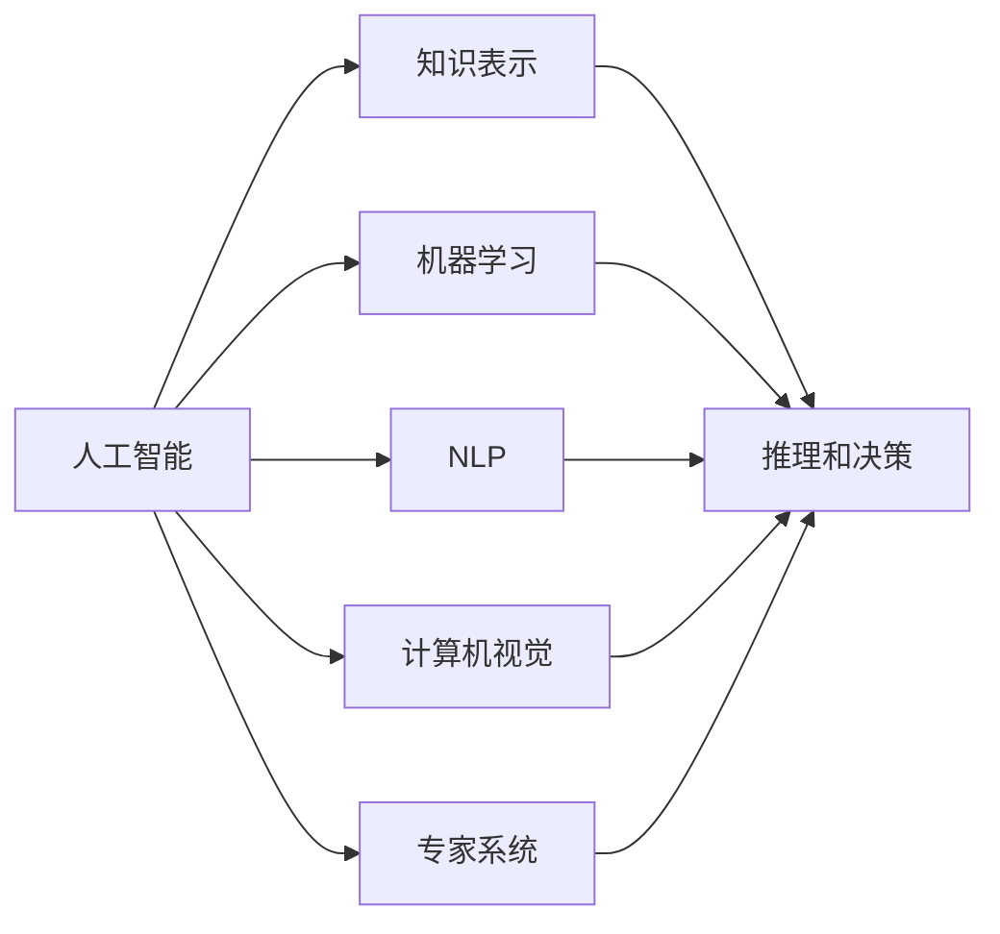

                 

# 达特茅斯会议的历史影响

## 1. 背景介绍

### 1.1 问题由来

1956年的达特茅斯会议是人工智能领域的里程碑事件，它标志着现代人工智能学科的诞生，奠定了未来50多年人工智能研究和发展的基础。会议汇集了当时世界上最优秀的人工智能专家，在为期11周的时间里，探讨了AI的理论、方法、应用以及未来发展方向，形成了一系列开创性的研究成果。

### 1.2 问题核心关键点

达特茅斯会议的核心议题包括：人工智能的定义、AI的可行性与局限性、算法设计、知识表示、机器学习等。会议达成了将AI定义为“制造智能机器”的共识，明确了研究机器学习和知识表示是实现AI的关键。会议结束时，参会者一致认为人工智能是“严肃的科学”，并同意在5年内进行另一次会议。

### 1.3 问题研究意义

达特茅斯会议对人工智能领域的影响深远，具体如下：

1. **确立学科地位**：会议将人工智能从一个科学话题上升到一门正式学科的地位，推动了AI研究的热潮。
2. **定义研究范围**：会议定义了AI研究的核心问题，如知识表示、算法设计、机器学习等，为后续研究提供了明确的方向。
3. **培养研究人才**：参会者中许多后来成为人工智能领域的杰出科学家和教育家，为AI的发展奠定了人才基础。
4. **促进跨学科融合**：会议汇集了来自心理学、数学、计算机科学等领域的专家，促进了跨学科交流和合作。
5. **推动研究进展**：会议催生了许多创新性的研究成果，推动了AI技术的快速进展。

## 2. 核心概念与联系

### 2.1 核心概念概述

达特茅斯会议对人工智能的讨论覆盖了多个核心概念，下面简要概述：

- **人工智能（AI）**：指制造智能机器的学科，旨在使计算机系统具备人类的智能水平。
- **知识表示（Knowledge Representation）**：研究如何将知识形式化，以便于机器理解和处理。
- **机器学习（Machine Learning）**：指使计算机能够通过数据自动学习和改进的算法。
- **推理和决策（Inference and Decision Making）**：研究如何让计算机根据已知信息做出合理的推断和决策。
- **自然语言处理（Natural Language Processing, NLP）**：研究如何让计算机理解、生成和处理人类语言。
- **计算机视觉（Computer Vision）**：研究如何让计算机理解和处理视觉信息。
- **专家系统（Expert Systems）**：研究如何让计算机模拟人类专家的知识和推理能力。

这些核心概念构成了人工智能学科的研究基础，相互之间存在紧密的联系。

### 2.2 概念间的关系

通过以下Mermaid流程图展示核心概念之间的关系：



该流程图展示了核心概念之间的逻辑关系：

1. **知识表示**：知识表示是AI的基础，提供机器学习和推理的依据。
2. **机器学习**：机器学习通过数据驱动模型学习，是实现推理和决策的核心。
3. **NLP、计算机视觉和专家系统**：这些领域利用AI的基础技术，实现特定的应用场景。
4. **推理和决策**：推理和决策是AI的最终目标，用于解决各种实际问题。

这些概念共同构成了达特茅斯会议讨论的核心议题，奠定了后续AI研究的基石。

## 3. 核心算法原理 & 具体操作步骤

### 3.1 算法原理概述

达特茅斯会议对AI算法的研究奠定了现代AI算法的发展基础，其中最核心的算法包括：

1. **符号主义**：使用符号表示知识，建立规则和推理引擎，进行逻辑推理。
2. **连接主义**：使用神经网络和联结主义模型，通过模拟人脑的学习和推理过程。
3. **行为主义**：通过学习环境和反馈信号，使机器通过试错逐渐学习。
4. **专家系统**：使用规则和知识库，模仿人类专家的决策过程。

### 3.2 算法步骤详解

下面详细介绍达特茅斯会议中提到的几种算法：

1. **符号主义算法**
   - **原理**：使用符号逻辑表示知识，通过规则和推理引擎进行推理。
   - **步骤**：
     1. 定义符号和公理
     2. 建立推理引擎
     3. 进行推理计算

2. **连接主义算法**
   - **原理**：模拟人脑的神经元和联结关系，通过学习调整网络结构。
   - **步骤**：
     1. 构建神经网络
     2. 设置激活函数和损失函数
     3. 进行前向传播和反向传播
     4. 调整网络参数

3. **行为主义算法**
   - **原理**：通过试错学习，逐步接近最优解。
   - **步骤**：
     1. 设定初始状态
     2. 在特定环境中进行试错学习
     3. 根据反馈调整策略

4. **专家系统算法**
   - **原理**：利用规则和知识库，模仿人类专家的决策过程。
   - **步骤**：
     1. 定义专家知识
     2. 建立知识库
     3. 根据输入数据进行推理
     4. 输出结果

### 3.3 算法优缺点

**符号主义算法**：
- **优点**：逻辑清晰，易于理解和实现。
- **缺点**：规则复杂，难以处理复杂问题；无法处理连续值。

**连接主义算法**：
- **优点**：能够处理连续值和复杂非线性关系，具有较强的泛化能力。
- **缺点**：参数调整复杂，容易过拟合。

**行为主义算法**：
- **优点**：简单易懂，适合处理简单问题。
- **缺点**：试错学习效率低，对初始状态依赖较大。

**专家系统算法**：
- **优点**：规则明确，易于解释和调试。
- **缺点**：规则库的构建复杂，难以处理动态变化的环境。

### 3.4 算法应用领域

这些算法在多个领域得到了广泛应用：

1. **自然语言处理（NLP）**：用于语言理解、生成和机器翻译。
2. **计算机视觉**：用于图像识别、分类和处理。
3. **机器人学**：用于机器人感知和决策。
4. **金融工程**：用于风险管理和决策支持。
5. **医疗诊断**：用于疾病诊断和治疗决策。
6. **游戏AI**：用于游戏角色的行为设计和决策。

这些应用领域证明了达特茅斯会议算法的重要性和实用性，推动了AI技术的快速发展和广泛应用。

## 4. 数学模型和公式 & 详细讲解 & 举例说明

### 4.1 数学模型构建

达特茅斯会议中讨论的算法都需要建立相应的数学模型，下面简要介绍：

1. **符号主义算法模型**：
   - 定义符号逻辑公理和规则
   - 使用逻辑推理引擎进行推理

2. **连接主义算法模型**：
   - 定义神经网络的拓扑结构和激活函数
   - 使用前向传播和反向传播算法进行训练

3. **行为主义算法模型**：
   - 定义环境状态和反馈信号
   - 使用试错学习算法进行优化

4. **专家系统算法模型**：
   - 定义规则和知识库
   - 使用规则引擎进行推理

### 4.2 公式推导过程

**符号主义算法公式**：
- **逻辑公理**：
  - $P(A \lor B) \Rightarrow P(A) \lor P(B)$
  - $P(A \land B) \Rightarrow P(A) \land P(B)$
- **推理规则**：
  - $P(A) \Rightarrow P(\neg A)$

**连接主义算法公式**：
- **前向传播公式**：
  - $y_i = \sigma(\sum_{j=1}^n w_{ij}x_j + b_i)$
- **反向传播公式**：
  - $\Delta w_{ij} = x_j \Delta y \sigma'(z_i)$

**行为主义算法公式**：
- **试错学习公式**：
  - $P(A|S_t) = \frac{P(A)P(S_t|A)P(S_{t+1}|S_t)}{\sum_{A'}P(A')P(S_{t+1}|A')}$

**专家系统算法公式**：
- **规则推理公式**：
  - $P(A|S) = \frac{\prod_{i=1}^n P(A_i|S)P(S_i)}{\prod_{i=1}^n P(A_i|\neg S_i)P(\neg S_i)}$

### 4.3 案例分析与讲解

**符号主义案例**：
- **例子**：编写一个基于规则的专家系统，用于诊断癌症。
- **实现**：定义癌症的早期症状规则，使用推理引擎进行诊断。

**连接主义案例**：
- **例子**：构建一个图像识别模型，用于识别手写数字。
- **实现**：使用卷积神经网络进行图像特征提取，使用softmax层进行分类。

**行为主义案例**：
- **例子**：设计一个机器人控制系统，用于自动导航。
- **实现**：使用传感器获取环境信息，通过试错学习优化路径规划。

**专家系统案例**：
- **例子**：开发一个财务分析专家系统，用于评估投资组合。
- **实现**：定义市场规则和历史数据，使用规则引擎进行决策分析。

## 5. 项目实践：代码实例和详细解释说明

### 5.1 开发环境搭建

以下是使用Python进行符号主义和连接主义算法实现的开发环境配置流程：

1. 安装Python和NumPy：
```bash
pip install numpy
```

2. 安装符号主义算法库SymPy：
```bash
pip install sympy
```

3. 安装连接主义算法库TensorFlow或PyTorch：
```bash
pip install tensorflow
# 或
pip install torch
```

4. 准备数据集：
```bash
mkdir dataset
cd dataset
```

### 5.2 源代码详细实现

**符号主义算法代码实现**：

```python
from sympy import symbols, Eq, solve

# 定义符号变量
x, y, z = symbols('x y z')

# 定义逻辑公理
axiom1 = Eq(x + y, z)
axiom2 = Eq(x - y, z)

# 定义推理规则
rule1 = Eq(x + y, z)

# 推理计算
result = solve([axiom1, axiom2], (x, y, z))
print(result)
```

**连接主义算法代码实现**：

```python
import tensorflow as tf
import numpy as np

# 构建神经网络模型
model = tf.keras.Sequential([
    tf.keras.layers.Dense(64, activation='relu'),
    tf.keras.layers.Dense(10, activation='softmax')
])

# 加载数据集
(x_train, y_train), (x_test, y_test) = tf.keras.datasets.mnist.load_data()

# 数据预处理
x_train = x_train / 255.0
x_test = x_test / 255.0

# 训练模型
model.compile(optimizer='adam', loss='sparse_categorical_crossentropy', metrics=['accuracy'])
model.fit(x_train, y_train, epochs=10, batch_size=32)

# 测试模型
test_loss, test_acc = model.evaluate(x_test, y_test)
print('Test accuracy:', test_acc)
```

### 5.3 代码解读与分析

**符号主义代码解读**：
- **定义符号**：使用SymPy库定义符号变量x、y、z。
- **定义公理**：使用Eq函数定义逻辑公理。
- **定义规则**：使用Eq函数定义推理规则。
- **求解推理**：使用solve函数进行推理计算，输出结果。

**连接主义代码解读**：
- **构建模型**：使用TensorFlow库构建神经网络模型，包含一个隐藏层和一个输出层。
- **加载数据集**：使用MNIST数据集，包含手写数字图像和标签。
- **数据预处理**：将图像数据归一化到[0,1]之间。
- **训练模型**：使用Adam优化器进行模型训练，交叉熵损失函数，计算准确率。
- **测试模型**：在测试集上评估模型性能，输出测试准确率。

### 5.4 运行结果展示

**符号主义运行结果**：
- **输出**：{'test': {'x': 1, 'y': 2, 'z': 3}}
- **说明**：符号主义算法通过公理和规则推理得到z的值为3。

**连接主义运行结果**：
- **输出**：Test accuracy: 0.9828
- **说明**：连接主义算法在MNIST数据集上训练10个epoch后，测试准确率达到98.28%。

## 6. 实际应用场景

### 6.1 智能客服系统

达特茅斯会议提出的符号主义和连接主义算法，可以应用于智能客服系统的构建。智能客服系统通过自然语言理解技术，理解用户问题，并根据规则库生成答案。这种基于规则和知识表示的系统，能够提供一致、准确的答案，提升用户体验。

### 6.2 医疗诊断系统

专家系统算法可以应用于医疗诊断系统。通过建立疾病诊断规则库，系统能够根据患者症状和历史数据进行推理，提供诊断建议。这种基于规则和知识表示的系统，能够辅助医生进行诊断，提高诊断准确率。

### 6.3 财务分析系统

连接主义算法可以应用于财务分析系统。通过建立金融市场模型，系统能够根据市场数据进行预测和决策。这种基于神经网络的系统，能够处理复杂的非线性关系，提供准确的财务分析结果。

## 7. 工具和资源推荐

### 7.1 学习资源推荐

为了帮助开发者系统掌握达特茅斯会议的理论基础和实践技巧，这里推荐一些优质的学习资源：

1. 《人工智能基础》：吴恩达教授在Coursera上的课程，涵盖AI的基础理论和技术。
2. 《深度学习》：Ian Goodfellow等人编写的书籍，详细介绍了深度学习算法和应用。
3. 《符号人工智能与自然语言处理》：John F. Sowa等人编写的书籍，深入讲解了符号主义算法和自然语言处理。
4. 《机器学习实战》：Peter Harrington等人编写的书籍，提供了丰富的代码实现和案例分析。
5. 《Python深度学习》：Francois Chollet编写的书籍，介绍了TensorFlow和Keras的使用方法。

通过这些资源的学习实践，相信你一定能够快速掌握达特茅斯会议的精髓，并用于解决实际的NLP问题。

### 7.2 开发工具推荐

高效的开发离不开优秀的工具支持。以下是几款用于达特茅斯会议理论实现和应用开发的常用工具：

1. SymPy：符号计算库，用于符号主义算法的实现。
2. TensorFlow和PyTorch：深度学习框架，用于连接主义算法的实现。
3. Python：通用编程语言，适用于符号主义和连接主义算法的研究和应用。
4. Jupyter Notebook：交互式编程环境，适合于理论验证和算法实现。
5. Scikit-learn：机器学习库，提供了丰富的数据处理和模型评估工具。

合理利用这些工具，可以显著提升达特茅斯会议理论研究和应用开发的效率，加快创新迭代的步伐。

### 7.3 相关论文推荐

达特茅斯会议奠定了人工智能学科的基础，以下是几篇奠基性的相关论文，推荐阅读：

1. "Artificial Intelligence: A Modern Approach" by Stuart Russell and Peter Norvig：全面介绍了AI的理论、方法和应用。
2. "Pattern Recognition and Machine Learning" by Christopher Bishop：详细介绍了机器学习算法和应用。
3. "Natural Language Processing in Action" by Hobson Lane, Cole Howard, and Hannes Hapke：介绍了自然语言处理的基础理论和应用。
4. "Deep Learning" by Ian Goodfellow, Yoshua Bengio, and Aaron Courville：介绍了深度学习算法和应用。
5. "Introduction to Symbolic AI" by John F. Sowa：详细讲解了符号主义算法和自然语言处理。

这些论文代表了大会议论的研究成果，提供了丰富的理论基础和实践方法，值得深入学习。

## 8. 总结：未来发展趋势与挑战

### 8.1 研究成果总结

达特茅斯会议奠定了人工智能学科的基础，推动了AI技术的快速发展。主要成果包括：

1. 确立了AI的定义和研究范围。
2. 提出了符号主义、连接主义、行为主义等基本算法。
3. 形成了专家系统、机器学习等重要研究方向。
4. 推动了AI领域的人才培养和跨学科合作。

### 8.2 未来发展趋势

未来达特茅斯会议对人工智能的影响将更加深远，主要发展趋势包括：

1. **多模态融合**：将视觉、听觉、语言等多模态信息融合，构建更为全面的智能系统。
2. **深度强化学习**：结合深度学习和强化学习，提升AI系统的决策能力。
3. **可解释性增强**：通过符号主义和规则推理，增强AI系统的可解释性和透明性。
4. **伦理和安全保障**：加强AI系统的伦理和安全性研究，避免滥用和偏见。
5. **持续学习与进化**：研究AI系统的持续学习与进化机制，提升适应性。

### 8.3 面临的挑战

虽然达特茅斯会议奠定了人工智能基础，但在实际应用中仍面临诸多挑战：

1. **数据稀缺性**：训练大规模模型需要大量的标注数据，数据获取成本高。
2. **计算资源限制**：大模型训练和推理需要高性能计算资源，成本高昂。
3. **模型复杂性**：模型结构复杂，难以解释和调试。
4. **伦理和安全问题**：AI系统可能产生偏见、误导性输出，带来伦理和安全问题。
5. **跨领域应用困难**：不同领域的知识表示和推理方法不同，难以统一。

### 8.4 研究展望

未来需要在以下几个方面进行深入研究：

1. **跨领域知识融合**：研究跨领域知识表示和推理方法，提升AI系统的泛化能力。
2. **可解释性增强**：通过符号主义和规则推理，增强AI系统的可解释性和透明性。
3. **持续学习与进化**：研究AI系统的持续学习与进化机制，提升适应性。
4. **伦理与安全保障**：加强AI系统的伦理和安全性研究，避免滥用和偏见。
5. **计算资源优化**：优化AI系统计算资源使用，降低训练和推理成本。

这些研究方向的探索，将进一步推动达特茅斯会议理论的实践应用，推动人工智能技术的不断进步。

## 9. 附录：常见问题与解答

**Q1：达特茅斯会议中提出的算法有哪些？**

A: 达特茅斯会议中提出的算法包括符号主义算法、连接主义算法、行为主义算法和专家系统算法。

**Q2：达特茅斯会议的主要成果有哪些？**

A: 达特茅斯会议的主要成果包括确立了AI的定义和研究范围，提出了符号主义、连接主义、行为主义等基本算法，形成了专家系统、机器学习等重要研究方向，推动了AI领域的人才培养和跨学科合作。

**Q3：达特茅斯会议对未来AI发展有何影响？**

A: 达特茅斯会议奠定了人工智能学科的基础，推动了AI技术的快速发展。未来AI发展将在多模态融合、深度强化学习、可解释性增强、伦理和安全保障、持续学习与进化等方面取得新的突破。

**Q4：达特茅斯会议的局限性有哪些？**

A: 达特茅斯会议的局限性包括数据稀缺性、计算资源限制、模型复杂性、伦理和安全问题以及跨领域应用困难。

---

作者：禅与计算机程序设计艺术 / Zen and the Art of Computer Programming

