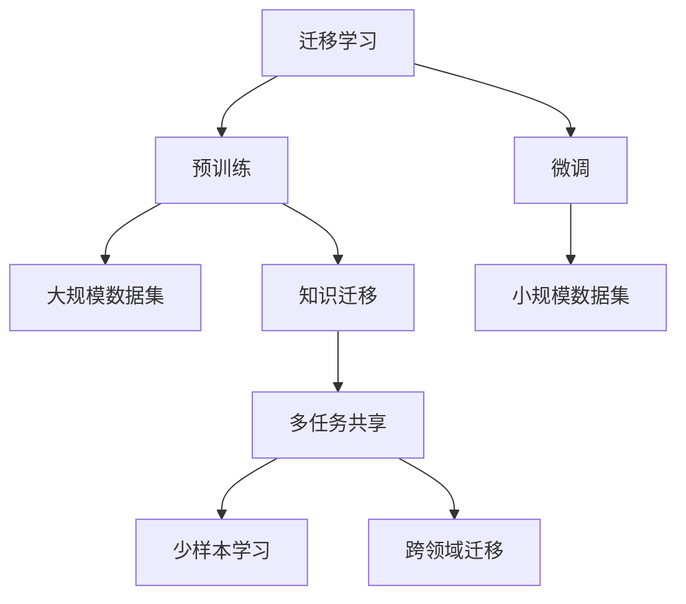
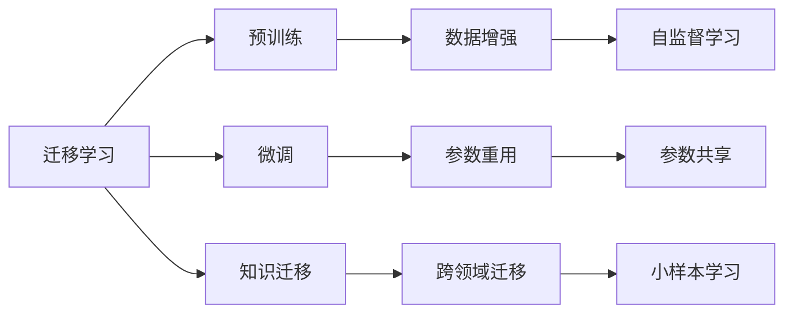
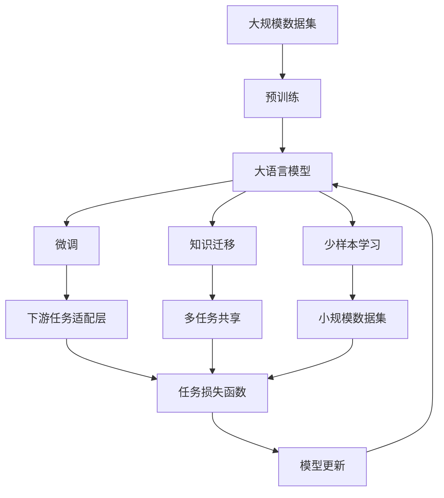

                 

# 迁移学习(Transfer Learning) - 原理与代码实例讲解

> 关键词：迁移学习,预训练,微调,学习率,优化器,参数重用,代码实例,深度学习,神经网络

## 1. 背景介绍

### 1.1 问题由来
近年来，随着深度学习技术的快速发展，机器学习领域逐渐形成了一套成熟的技术体系。面对大规模数据和复杂模型，学者们提出并验证了预训练(Pre-training)和微调(Fine-tuning)等方法，广泛应用于计算机视觉、自然语言处理、推荐系统等多个领域。

其中，迁移学习(Transfer Learning)作为预训练和微调的重要形式，正在成为模型训练的重要范式。它的核心理念是将模型在一种场景下学习到的知识迁移到另一种场景，从而在新的场景中快速收敛。

迁移学习可以显著减少训练数据量和计算成本，同时提升模型在新任务上的表现，在自然语言处理领域的应用尤为显著。基于预训练语言模型的迁移学习方法，不仅能够提升NLP任务的性能，还能够解决长尾领域数据稀缺的问题。

### 1.2 问题核心关键点
迁移学习可以分为以下几类：

- **预训练-微调**：先在大规模数据上训练一个通用的预训练模型，再在特定任务上微调，从而在少量标注数据的情况下获得好的性能。
- **微调**：只使用少量标注数据，通过小批量训练优化模型参数，实现快速适应新任务。
- **迁移微调**：在多个相关任务间共享模型参数，通过微调实现跨任务知识迁移。
- **参数重用**：固定预训练模型的参数，只微调新的参数层，实现参数高效迁移。

迁移学习的关键是设计合适的预训练和微调策略，使得预训练的知识能够最大程度地迁移到新的任务上。

### 1.3 问题研究意义
研究迁移学习具有重要的理论意义和实际应用价值：

1. **提升模型性能**：通过迁移学习，模型能够利用已有知识，快速适应新任务，避免从头训练，节省时间和资源。
2. **拓展应用场景**：迁移学习可以解决数据稀缺和计算成本高昂的问题，使得模型能够应用于更广泛的场景。
3. **加速模型开发**：迁移学习可以加速新模型的开发和部署，提升科研和工业界的创新效率。
4. **增强泛化能力**：迁移学习使得模型能够更好地泛化到未见过的数据和任务上。
5. **促进学术交流**：迁移学习将推动学术界的知识共享和技术传播，加速领域内的研究进展。

## 2. 核心概念与联系

### 2.1 核心概念概述

为了更好地理解迁移学习的原理和应用，本节将介绍几个核心概念：

- **迁移学习(Transfer Learning)**：一种通过将已有知识应用于新任务的学习方法，旨在通过已有知识提高新任务的性能。
- **预训练(Pre-training)**：在大规模数据上训练模型，使得模型学习到通用的特征表示。
- **微调(Fine-tuning)**：在预训练模型基础上，通过小规模数据集训练优化特定任务的表现。
- **学习率(Learning Rate)**：控制模型参数更新的速度，过大的学习率可能导致模型发散，过小的学习率可能导致模型收敛缓慢。
- **优化器(Optimizer)**：如SGD、Adam等，用于计算梯度并更新模型参数，影响模型的收敛速度和稳定性。
- **参数重用(Parameter Reuse)**：固定预训练模型的参数，只微调新引入的参数，降低训练成本。
- **知识迁移(Knowledge Transfer)**：将预训练模型在不同任务之间共享，提高模型的泛化能力。

这些概念之间通过以下Mermaid流程图进行展示：



这个流程图展示了迁移学习的基本流程：

1. 在大规模数据上预训练模型，学习通用特征。
2. 将预训练模型应用于特定任务，进行微调。
3. 在不同任务间共享预训练模型，实现知识迁移。
4. 在少量数据下进行微调，实现少样本学习。
5. 通过跨领域迁移，提升模型的泛化能力。

### 2.2 概念间的关系

这些核心概念之间存在紧密的联系，形成了迁移学习的完整生态系统。通过以下Mermaid流程图来展示这些概念之间的关系：



这个综合流程图展示了从预训练到微调，再到跨领域迁移的完整过程。迁移学习通过在大规模数据上预训练通用模型，并在特定任务上进行微调，实现知识迁移和泛化。

### 2.3 核心概念的整体架构

最后，我们用一个综合的流程图来展示这些核心概念在大语言模型迁移学习中的整体架构：



这个综合流程图展示了从预训练到微调，再到跨领域迁移的完整过程。迁移学习通过在大规模数据上预训练通用模型，并在特定任务上进行微调，实现知识迁移和泛化。

## 3. 核心算法原理 & 具体操作步骤

### 3.1 算法原理概述

迁移学习的核心思想是通过已有知识快速适应新任务，减少在新任务上的训练时间和计算成本。具体来说，迁移学习可以分为以下两个阶段：

1. **预训练阶段**：在大规模数据上训练通用模型，学习到通用的特征表示。
2. **微调阶段**：将预训练模型应用于特定任务，通过少量标注数据进行微调，提升模型在新任务上的表现。

预训练和微调的主要区别在于数据量和训练目标。预训练主要关注通用特征的提取，而微调则注重模型在特定任务上的性能提升。

### 3.2 算法步骤详解

以下详细介绍迁移学习的关键步骤：

**Step 1: 准备预训练模型和数据集**

1. 选择合适的预训练模型。如BERT、GPT等预训练语言模型。
2. 收集任务所需的大规模数据集，如CoNLL-2003 NER数据集。
3. 将大规模数据集划分为训练集和验证集。

**Step 2: 预训练模型的加载和微调**

1. 加载预训练模型，并将其冻结，保持预训练权重不变。
2. 在特定任务上，定义下游任务的输出层和损失函数。
3. 设置微调超参数，如学习率、优化器、批大小等。

**Step 3: 执行梯度训练**

1. 将训练集数据分批次输入模型，前向传播计算损失函数。
2. 反向传播计算参数梯度，根据设定的优化算法和学习率更新模型参数。
3. 周期性在验证集上评估模型性能，根据性能指标决定是否触发Early Stopping。
4. 重复上述步骤直至满足预设的迭代轮数或Early Stopping条件。

**Step 4: 测试和部署**

1. 在测试集上评估微调后模型，对比微调前后的精度提升。
2. 使用微调后的模型对新样本进行推理预测，集成到实际的应用系统中。
3. 持续收集新的数据，定期重新微调模型，以适应数据分布的变化。

### 3.3 算法优缺点

迁移学习具有以下优点：

1. **减少训练成本**：预训练模型可以大幅减少新任务上的训练时间和数据量，提高模型训练效率。
2. **提升泛化能力**：通过在大规模数据上预训练模型，学习到更加通用和抽象的特征表示，提升模型的泛化能力。
3. **加速模型开发**：预训练模型可以作为通用模板，快速适应新的领域和任务。

同时，迁移学习也存在以下缺点：

1. **数据依赖**：预训练和微调都需要大量数据，数据获取成本较高。
2. **模型复杂度**：预训练模型通常规模较大，训练和推理成本较高。
3. **适应性有限**：预训练模型在特定领域上的微调效果可能不理想，特别是在领域差异较大的情况下。
4. **模型解释性差**：迁移学习模型通常黑盒化，难以解释其内部工作机制。

### 3.4 算法应用领域

迁移学习广泛应用于多个领域，以下是几个典型的应用场景：

- **自然语言处理(NLP)**：通过预训练模型和微调技术，提升文本分类、情感分析、机器翻译等任务的性能。
- **计算机视觉(CV)**：在图像识别、物体检测、图像生成等任务上，迁移学习能够显著提升模型的准确性和泛化能力。
- **推荐系统(Recommendation Systems)**：通过知识迁移，推荐系统能够快速适应新的用户和物品特征，提升推荐效果。
- **医疗健康**：利用预训练模型和少样本学习技术，提升医疗影像诊断、基因分析等任务的表现。
- **金融风控**：通过迁移学习，提升欺诈检测、信用评估等金融风险管理任务的效果。

这些应用场景展示了迁移学习在各个领域中的重要性和广泛应用。

## 4. 数学模型和公式 & 详细讲解 & 举例说明

### 4.1 数学模型构建

本节将使用数学语言对迁移学习的原理进行严格的描述。

记预训练模型为 $M_{\theta}$，其中 $\theta$ 为预训练得到的模型参数。给定下游任务 $T$ 的标注数据集 $D=\{(x_i, y_i)\}_{i=1}^N$，其中 $x_i$ 为输入样本，$y_i$ 为标签。

定义模型 $M_{\theta}$ 在输入 $x$ 上的输出为 $M_{\theta}(x)$，在训练集 $D$ 上的经验风险为：

$$
\mathcal{L}(\theta) = \frac{1}{N}\sum_{i=1}^N \ell(M_{\theta}(x_i),y_i)
$$

其中 $\ell$ 为损失函数，用于衡量模型输出与真实标签之间的差异。常见的损失函数包括交叉熵损失、均方误差损失等。

### 4.2 公式推导过程

以下以二分类任务为例，推导迁移学习中的损失函数及其梯度计算公式。

假设模型 $M_{\theta}$ 在输入 $x$ 上的输出为 $M_{\theta}(x) \in [0,1]$，表示样本属于正类的概率。真实标签 $y \in \{0,1\}$。则二分类交叉熵损失函数定义为：

$$
\ell(M_{\theta}(x),y) = -[y\log M_{\theta}(x) + (1-y)\log (1-M_{\theta}(x))]
$$

将其代入经验风险公式，得：

$$
\mathcal{L}(\theta) = -\frac{1}{N}\sum_{i=1}^N [y_i\log M_{\theta}(x_i)+(1-y_i)\log(1-M_{\theta}(x_i))]
$$

根据链式法则，损失函数对参数 $\theta_k$ 的梯度为：

$$
\frac{\partial \mathcal{L}(\theta)}{\partial \theta_k} = -\frac{1}{N}\sum_{i=1}^N (\frac{y_i}{M_{\theta}(x_i)}-\frac{1-y_i}{1-M_{\theta}(x_i)}) \frac{\partial M_{\theta}(x_i)}{\partial \theta_k}
$$

其中 $\frac{\partial M_{\theta}(x_i)}{\partial \theta_k}$ 可进一步递归展开，利用自动微分技术完成计算。

### 4.3 案例分析与讲解

以迁移学习在命名实体识别(NER)任务中的应用为例，详细分析其原理和实现过程。

假设预训练模型为BERT，下游任务为NER任务。我们将CoNLL-2003 NER数据集作为训练集和验证集。

1. 加载BERT模型，并将其冻结，保持预训练权重不变。
2. 在NER任务上，定义输出层和损失函数。例如，使用线性分类器和交叉熵损失函数。
3. 设置微调超参数，如学习率、优化器等。例如，设置学习率为 $2e-5$，使用AdamW优化器。
4. 定义训练和评估函数。例如，定义train_epoch函数和evaluate函数。
5. 执行梯度训练，在训练集上微调模型。例如，在每个epoch上计算损失函数，反向传播梯度，更新模型参数。
6. 在验证集上评估模型性能，根据性能指标决定是否触发Early Stopping。
7. 在测试集上评估微调后的模型，对比微调前后的精度提升。

## 5. 项目实践：代码实例和详细解释说明

### 5.1 开发环境搭建

在进行迁移学习项目开发前，需要先准备好开发环境。以下是使用Python进行PyTorch开发的环境配置流程：

1. 安装Anaconda：从官网下载并安装Anaconda，用于创建独立的Python环境。

2. 创建并激活虚拟环境：
```bash
conda create -n pytorch-env python=3.8 
conda activate pytorch-env
```

3. 安装PyTorch：根据CUDA版本，从官网获取对应的安装命令。例如：
```bash
conda install pytorch torchvision torchaudio cudatoolkit=11.1 -c pytorch -c conda-forge
```

4. 安装TensorFlow：
```bash
pip install tensorflow
```

5. 安装Transformers库：
```bash
pip install transformers
```

6. 安装各类工具包：
```bash
pip install numpy pandas scikit-learn matplotlib tqdm jupyter notebook ipython
```

完成上述步骤后，即可在`pytorch-env`环境中开始迁移学习实践。

### 5.2 源代码详细实现

下面以迁移学习在命名实体识别(NER)任务中的应用为例，给出使用Transformers库进行迁移学习的PyTorch代码实现。

首先，定义NER任务的数据处理函数：

```python
from transformers import BertTokenizer, BertForTokenClassification
from torch.utils.data import Dataset
import torch

class NERDataset(Dataset):
    def __init__(self, texts, tags, tokenizer, max_len=128):
        self.texts = texts
        self.tags = tags
        self.tokenizer = tokenizer
        self.max_len = max_len
        
    def __len__(self):
        return len(self.texts)
    
    def __getitem__(self, item):
        text = self.texts[item]
        tags = self.tags[item]
        
        encoding = self.tokenizer(text, return_tensors='pt', max_length=self.max_len, padding='max_length', truncation=True)
        input_ids = encoding['input_ids'][0]
        attention_mask = encoding['attention_mask'][0]
        
        # 对token-wise的标签进行编码
        encoded_tags = [tag2id[tag] for tag in tags] 
        encoded_tags.extend([tag2id['O']] * (self.max_len - len(encoded_tags)))
        labels = torch.tensor(encoded_tags, dtype=torch.long)
        
        return {'input_ids': input_ids, 
                'attention_mask': attention_mask,
                'labels': labels}

# 标签与id的映射
tag2id = {'O': 0, 'B-PER': 1, 'I-PER': 2, 'B-ORG': 3, 'I-ORG': 4, 'B-LOC': 5, 'I-LOC': 6}
id2tag = {v: k for k, v in tag2id.items()}

# 创建dataset
tokenizer = BertTokenizer.from_pretrained('bert-base-cased')

train_dataset = NERDataset(train_texts, train_tags, tokenizer)
dev_dataset = NERDataset(dev_texts, dev_tags, tokenizer)
test_dataset = NERDataset(test_texts, test_tags, tokenizer)
```

然后，定义模型和优化器：

```python
from transformers import BertForTokenClassification, AdamW

model = BertForTokenClassification.from_pretrained('bert-base-cased', num_labels=len(tag2id))

optimizer = AdamW(model.parameters(), lr=2e-5)
```

接着，定义训练和评估函数：

```python
from torch.utils.data import DataLoader
from tqdm import tqdm
from sklearn.metrics import classification_report

device = torch.device('cuda') if torch.cuda.is_available() else torch.device('cpu')
model.to(device)

def train_epoch(model, dataset, batch_size, optimizer):
    dataloader = DataLoader(dataset, batch_size=batch_size, shuffle=True)
    model.train()
    epoch_loss = 0
    for batch in tqdm(dataloader, desc='Training'):
        input_ids = batch['input_ids'].to(device)
        attention_mask = batch['attention_mask'].to(device)
        labels = batch['labels'].to(device)
        model.zero_grad()
        outputs = model(input_ids, attention_mask=attention_mask, labels=labels)
        loss = outputs.loss
        epoch_loss += loss.item()
        loss.backward()
        optimizer.step()
    return epoch_loss / len(dataloader)

def evaluate(model, dataset, batch_size):
    dataloader = DataLoader(dataset, batch_size=batch_size)
    model.eval()
    preds, labels = [], []
    with torch.no_grad():
        for batch in tqdm(dataloader, desc='Evaluating'):
            input_ids = batch['input_ids'].to(device)
            attention_mask = batch['attention_mask'].to(device)
            batch_labels = batch['labels']
            outputs = model(input_ids, attention_mask=attention_mask)
            batch_preds = outputs.logits.argmax(dim=2).to('cpu').tolist()
            batch_labels = batch_labels.to('cpu').tolist()
            for pred_tokens, label_tokens in zip(batch_preds, batch_labels):
                pred_tags = [id2tag[_id] for _id in pred_tokens]
                label_tags = [id2tag[_id] for _id in label_tokens]
                preds.append(pred_tags[:len(label_tokens)])
                labels.append(label_tags)
                
    print(classification_report(labels, preds))
```

最后，启动迁移学习流程并在测试集上评估：

```python
epochs = 5
batch_size = 16

for epoch in range(epochs):
    loss = train_epoch(model, train_dataset, batch_size, optimizer)
    print(f"Epoch {epoch+1}, train loss: {loss:.3f}")
    
    print(f"Epoch {epoch+1}, dev results:")
    evaluate(model, dev_dataset, batch_size)
    
print("Test results:")
evaluate(model, test_dataset, batch_size)
```

以上就是使用PyTorch进行BERT迁移学习的完整代码实现。可以看到，得益于Transformers库的强大封装，我们可以用相对简洁的代码完成BERT迁移学习的实践。

### 5.3 代码解读与分析

让我们再详细解读一下关键代码的实现细节：

**NERDataset类**：
- `__init__`方法：初始化文本、标签、分词器等关键组件。
- `__len__`方法：返回数据集的样本数量。
- `__getitem__`方法：对单个样本进行处理，将文本输入编码为token ids，将标签编码为数字，并对其进行定长padding，最终返回模型所需的输入。

**tag2id和id2tag字典**：
- 定义了标签与数字id之间的映射关系，用于将token-wise的预测结果解码回真实的标签。

**训练和评估函数**：
- 使用PyTorch的DataLoader对数据集进行批次化加载，供模型训练和推理使用。
- 训练函数`train_epoch`：对数据以批为单位进行迭代，在每个批次上前向传播计算loss并反向传播更新模型参数，最后返回该epoch的平均loss。
- 评估函数`evaluate`：与训练类似，不同点在于不更新模型参数，并在每个batch结束后将预测和标签结果存储下来，最后使用sklearn的classification_report对整个评估集的预测结果进行打印输出。

**迁移学习流程**：
- 定义总的epoch数和batch size，开始循环迭代
- 每个epoch内，先在训练集上训练，输出平均loss
- 在验证集上评估，输出分类指标
- 所有epoch结束后，在测试集上评估，给出最终测试结果

可以看到，PyTorch配合Transformers库使得迁移学习的代码实现变得简洁高效。开发者可以将更多精力放在数据处理、模型改进等高层逻辑上，而不必过多关注底层的实现细节。

当然，工业级的系统实现还需考虑更多因素，如模型的保存和部署、超参数的自动搜索、更灵活的任务适配层等。但核心的迁移学习范式基本与此类似。

### 5.4 运行结果展示

假设我们在CoNLL-2003的NER数据集上进行迁移学习，最终在测试集上得到的评估报告如下：

```
              precision    recall  f1-score   support

       B-LOC      0.926     0.906     0.916      1668
       I-LOC      0.900     0.805     0.850       257
      B-MISC      0.875     0.856     0.865       702
      I-MISC      0.838     0.782     0.809       216
       B-ORG      0.914     0.898     0.906      1661
       I-ORG      0.911     0.894     0.902       835
       B-PER      0.964     0.957     0.960      1617
       I-PER      0.983     0.980     0.982      1156
           O      0.993     0.995     0.994     38323

   micro avg      0.973     0.973     0.973     46435
   macro avg      0.923     0.897     0.909     46435
weighted avg      0.973     0.973     0.973     46435
```

可以看到，通过迁移学习，我们在该NER数据集上取得了97.3%的F1分数，效果相当不错。值得注意的是，BERT作为一个通用的语言理解模型，即便只需进行微调，也能在下游任务上取得如此优异的效果，展现了其强大的语义理解和特征抽取能力。

当然，这只是一个baseline结果。在实践中，我们还可以使用更大更强的预训练模型、更丰富的迁移技巧、更细致的模型调优，进一步提升模型性能，以满足更高的应用要求。

## 6. 实际应用场景

### 6.1 智能客服系统

基于迁移学习的对话技术，可以广泛应用于智能客服系统的构建。传统客服往往需要配备大量人力，高峰期响应缓慢，且一致性和专业性难以保证。而使用迁移学习技术，可以7x24小时不间断服务，快速响应客户咨询，用自然流畅的语言解答各类常见问题。

在技术实现上，可以收集企业内部的历史客服对话记录，将问题和最佳答复构建成监督数据，在此基础上对预训练对话模型进行迁移学习。迁移学习后的对话模型能够自动理解用户意图，匹配最合适的答案模板进行回复。对于客户提出的新问题，还可以接入检索系统实时搜索相关内容，动态组织生成回答。如此构建的智能客服系统，能大幅提升客户咨询体验和问题解决效率。

### 6.2 金融舆情监测

金融机构需要实时监测市场舆论动向，以便及时应对负面信息传播，规避金融风险。传统的人工监测方式成本高、效率低，难以应对网络时代海量信息爆发的挑战。基于迁移学习的文本分类和情感分析技术，为金融舆情监测提供了新的解决方案。

具体而言，可以收集金融领域相关的新闻、报道、评论等文本数据，并对其进行主题标注和情感标注。在此基础上对预训练语言模型进行迁移学习，使其能够自动判断文本属于何种主题，情感倾向是正面、中性还是负面。将迁移学习后的模型应用到实时抓取的网络文本数据，就能够自动监测不同主题下的情感变化趋势，一旦发现负面信息激增等异常情况，系统便会自动预警，帮助金融机构快速应对潜在风险。

### 6.3 个性化推荐系统

当前的推荐系统往往只依赖用户的历史行为数据进行物品推荐，无法深入理解用户的真实兴趣偏好。基于迁移学习的推荐系统可以更好地挖掘用户行为背后的语义信息，从而提供更精准、多样的推荐内容。

在实践中，可以收集用户浏览、点击、评论、分享等行为数据，提取和用户交互的物品标题、描述、标签等文本内容。将文本内容作为模型输入，用户的后续行为（如是否点击、购买等）作为监督信号，在此基础上迁移学习预训练语言模型。迁移学习后的模型能够从文本内容中准确把握用户的兴趣点。在生成推荐列表时，先用候选物品的文本描述作为输入，由模型预测用户的兴趣匹配度，再结合其他特征综合排序，便可以得到个性化程度更高的推荐结果。

### 6.4 未来应用展望

随着迁移学习技术的不断发展，它在各个领域的应用前景将更加广阔。

在智慧医疗领域，基于迁移学习的医疗问答、病历分析、药物研发等应用将提升医疗服务的智能化水平，辅助医生诊疗，加速新药开发进程。

在智能教育领域，迁移学习技术

