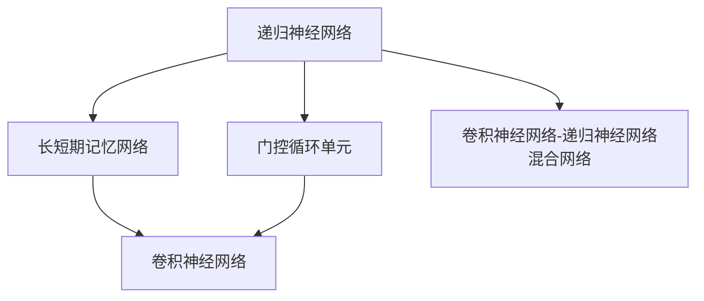
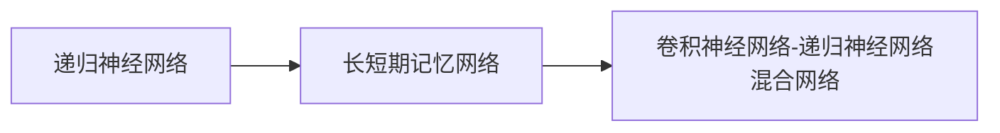
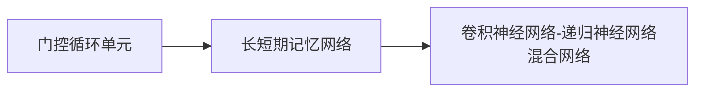
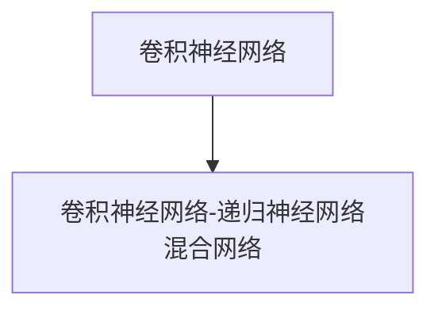
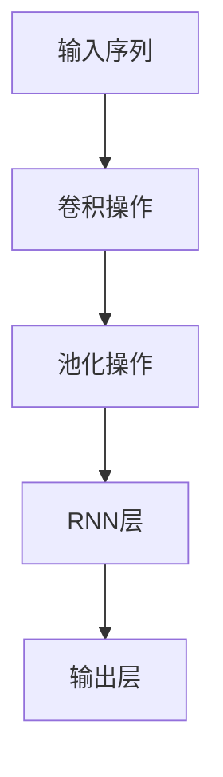
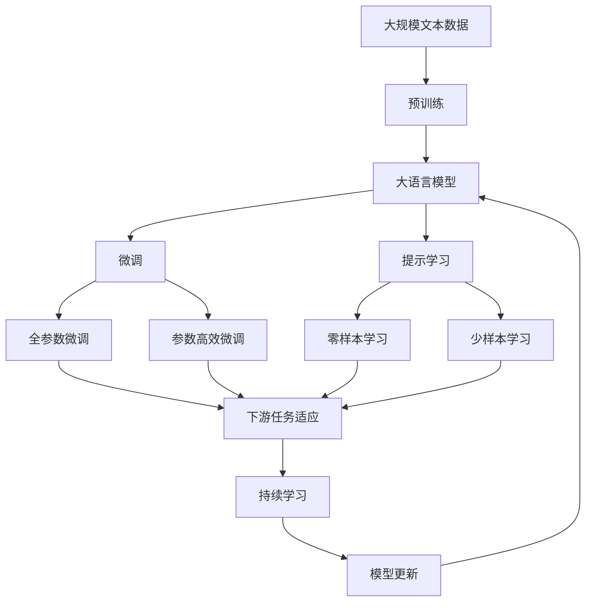

                 

# 递归神经网络 原理与代码实例讲解

> 关键词：递归神经网络(RNN)，长短期记忆网络(LSTM)，门控循环单元(GRU)，卷积神经网络(CNN)，循环神经网络(CNN-RNN)，数学模型，时间序列，序列建模

## 1. 背景介绍

### 1.1 问题由来
递归神经网络（Recurrent Neural Networks, RNNs）是深度学习中的一种重要模型，主要用于处理序列数据。与传统的前馈神经网络相比，RNNs通过引入循环结构，可以处理变长序列数据，并保留了序列中的时间信息，适用于自然语言处理、语音识别、时间序列预测等任务。RNNs的变种，如长短期记忆网络（Long Short-Term Memory, LSTM）和门控循环单元（Gated Recurrent Unit, GRU），进一步提升了模型的泛化能力和训练效果，成为了序列建模的标准工具。

然而，传统RNNs存在梯度消失和梯度爆炸等问题，难以长期记忆信息。LSTM和GRU通过引入门控机制，有效缓解了这一问题，使得模型能够长期保持信息。但即使如此，LSTM和GRU在处理长序列时，仍然面临一定的计算和内存开销，限制了其应用范围。

### 1.2 问题核心关键点
为了提高RNNs的性能和效率，研究者提出了一种新的网络结构——卷积神经网络（Convolutional Neural Networks, CNNs），通过将CNN的卷积操作和RNN的循环结构相结合，形成了CNN-RNN混合网络。CNN-RNN不仅保留了RNN的长时记忆能力，还具备CNN的特征提取能力，可以在处理大规模序列数据时，显著提高计算和内存效率。

CNN-RNN的核心思想是：在输入序列的每个位置，使用CNN进行局部特征提取，然后将提取的特征序列传递给RNN进行全局建模，最终输出序列预测结果。这种结构既保留了RNN的时序信息，又利用了CNN的局部特征提取能力，使得模型在处理长序列时，能够获得更好的效果和更低的资源消耗。

### 1.3 问题研究意义
CNN-RNN结合了CNN和RNN的优点，在序列建模任务上取得了显著的效果。研究CNN-RNN的原理和实现方法，不仅有助于理解和应用这一先进的技术，还为未来的序列建模提供了新的思路和方向。

## 2. 核心概念与联系

### 2.1 核心概念概述

为更好地理解CNN-RNN，本节将介绍几个密切相关的核心概念：

- 递归神经网络（Recurrent Neural Networks, RNNs）：通过循环结构处理序列数据的神经网络，保留了序列中的时间信息，适用于自然语言处理、语音识别、时间序列预测等任务。

- 长短期记忆网络（Long Short-Term Memory, LSTM）：一种改进的RNN结构，通过引入门控机制，有效缓解了梯度消失和梯度爆炸问题，能够长期保持信息。

- 门控循环单元（Gated Recurrent Unit, GRU）：类似于LSTM，通过门控机制优化信息流动，提高了模型的训练效率和泛化能力。

- 卷积神经网络（Convolutional Neural Networks, CNNs）：一种利用卷积操作的神经网络，擅长提取局部特征，适用于图像处理、语音识别、自然语言处理等任务。

- 卷积神经网络-递归神经网络混合网络（CNN-RNN）：结合CNN和RNN的优点，通过局部特征提取和全局建模，在处理大规模序列数据时，提高了计算和内存效率。

这些核心概念之间的逻辑关系可以通过以下Mermaid流程图来展示：



这个流程图展示了几类主要神经网络结构的关系：

1. RNNs通过循环结构处理序列数据，保留时间信息。
2. LSTM和GRU是RNNs的变种，通过门控机制优化信息流动。
3. CNNs通过卷积操作提取局部特征，适用于序列建模任务。
4. CNN-RNN通过结合CNN和RNN的优点，提高了计算和内存效率。

这些概念共同构成了CNN-RNN的理论基础，使得其在序列建模任务上具备了独特的优势。

### 2.2 概念间的关系

这些核心概念之间存在着紧密的联系，形成了CNN-RNN的完整生态系统。下面我们通过几个Mermaid流程图来展示这些概念之间的关系。

#### 2.2.1 递归神经网络与LSTM的关系



这个流程图展示了递归神经网络、长短期记忆网络和CNN-RNN的关系。

#### 2.2.2 门控循环单元与LSTM的关系



这个流程图展示了门控循环单元、长短期记忆网络和CNN-RNN的关系。

#### 2.2.3 卷积神经网络与CNN-RNN的关系



这个流程图展示了卷积神经网络和CNN-RNN的关系。

#### 2.2.4 CNN-RNN的整体架构



这个流程图展示了CNN-RNN的整体架构，包括输入序列、卷积操作、池化操作、RNN层和输出层。

### 2.3 核心概念的整体架构

最后，我们用一个综合的流程图来展示这些核心概念在大语言模型微调过程中的整体架构：



这个综合流程图展示了从预训练到微调，再到持续学习的完整过程。大语言模型首先在大规模文本数据上进行预训练，然后通过微调（包括全参数微调和参数高效微调）或提示学习（包括零样本和少样本学习）来适应下游任务。最后，通过持续学习技术，模型可以不断学习新知识，同时避免遗忘旧知识。

## 3. 核心算法原理 & 具体操作步骤
### 3.1 算法原理概述

CNN-RNN结合了CNN和RNN的优点，通过局部特征提取和全局建模，在处理大规模序列数据时，提高了计算和内存效率。其核心算法原理如下：

1. **卷积操作**：CNN-RNN在输入序列的每个位置，使用卷积操作提取局部特征。卷积核在不同位置的权值可以共享，减少了模型参数量。

2. **池化操作**：对卷积操作得到的特征进行池化，保留重要信息，降低特征维度。常见的池化操作有最大池化和平均池化。

3. **RNN层**：将池化后的特征序列输入到RNN层进行全局建模。RNN层通过循环结构，可以处理变长序列数据，并保留时间信息。

4. **输出层**：将RNN层的输出与全连接层结合，进行最终的预测。

### 3.2 算法步骤详解

CNN-RNN的实现步骤如下：

1. **输入序列预处理**：将输入序列进行归一化、分词、截断等预处理操作。

2. **卷积操作**：对预处理后的序列进行卷积操作，提取局部特征。卷积操作包括设置卷积核大小、步长、填充方式等超参数，以及定义池化函数。

3. **池化操作**：对卷积操作得到的特征进行池化操作，保留重要信息。

4. **RNN层**：将池化后的特征序列输入到RNN层进行全局建模。可以选择LSTM、GRU等RNN结构。

5. **全连接层**：将RNN层的输出与全连接层结合，进行最终的预测。

6. **模型训练**：使用标注数据对模型进行训练，优化模型参数，最小化损失函数。

### 3.3 算法优缺点

CNN-RNN结合了CNN和RNN的优点，具有以下优点：

1. **高效性**：通过局部特征提取和全局建模，减少了模型参数量和计算开销，适用于大规模序列数据。

2. **长时记忆能力**：通过RNN层的循环结构，能够长期保持信息，适用于需要记忆长期依赖的任务。

3. **特征提取能力**：利用CNN的局部特征提取能力，提高了模型的泛化能力。

然而，CNN-RNN也存在一些缺点：

1. **复杂度较高**：模型结构较为复杂，需要较多的超参数调优。

2. **参数量较大**：虽然参数量相对传统RNN有所减少，但相对于简单的CNN和LSTM模型，仍然较大。

3. **计算开销较高**：模型训练和推理时，需要大量的计算资源和内存。

### 3.4 算法应用领域

CNN-RNN在序列建模任务上得到了广泛应用，涵盖了多个领域：

- 自然语言处理：文本分类、情感分析、机器翻译、问答系统、对话系统等。

- 语音识别：语音转文本、情感识别、语音合成等。

- 时间序列预测：股票价格预测、天气预测、交通流量预测等。

- 计算机视觉：图像分类、目标检测、行为识别等。

- 其他领域：生物信息学、金融工程、环境科学等。

## 4. 数学模型和公式 & 详细讲解
### 4.1 数学模型构建

CNN-RNN的数学模型可以形式化为：

$$
\hat{y} = f(X, W)
$$

其中 $X$ 为输入序列，$W$ 为模型参数，$f$ 为模型函数。CNN-RNN的具体模型构建如下：

1. **输入序列预处理**：
   $$
   x_i = \text{embedding}(x_i)
   $$

2. **卷积操作**：
   $$
   c_i = \text{conv}(x_i, W^{conv})
   $$

3. **池化操作**：
   $$
   p_i = \text{pool}(c_i)
   $$

4. **RNN层**：
   $$
   h_t = \text{RNN}(p_t, h_{t-1})
   $$

5. **全连接层**：
   $$
   \hat{y} = \text{fc}(h_T)
   $$

其中 $x_i$ 为输入序列中的第 $i$ 个元素，$c_i$ 为卷积操作得到的特征，$h_t$ 为RNN层的隐藏状态，$\hat{y}$ 为模型预测输出。

### 4.2 公式推导过程

以文本分类任务为例，推导CNN-RNN的损失函数和优化过程。

假设文本分类任务的标注数据集为 $D=\{(x_i,y_i)\}_{i=1}^N$，其中 $x_i$ 为输入文本，$y_i$ 为分类标签。

1. **模型输出**：
   $$
   \hat{y} = f(x;W)
   $$

2. **损失函数**：
   $$
   L(\hat{y}, y) = \frac{1}{N} \sum_{i=1}^N -\log \hat{y}_i^{(y_i)}
   $$

3. **优化过程**：
   $$
   \theta = \mathop{\arg\min}_{\theta} \mathcal{L}(\theta, D)
   $$

其中 $\mathcal{L}$ 为损失函数，$\theta$ 为模型参数。

### 4.3 案例分析与讲解

假设我们要使用CNN-RNN进行文本分类任务，具体实现步骤如下：

1. **输入序列预处理**：将文本进行分词，转换为词向量。

2. **卷积操作**：使用不同大小的卷积核，提取文本中的局部特征。

3. **池化操作**：对卷积操作得到的特征进行池化操作，保留重要信息。

4. **RNN层**：将池化后的特征序列输入到LSTM层进行全局建模。

5. **全连接层**：将LSTM层的输出与全连接层结合，进行最终的分类预测。

6. **模型训练**：使用标注数据对模型进行训练，优化模型参数，最小化损失函数。

在实践中，我们可以使用TensorFlow或PyTorch等深度学习框架来实现CNN-RNN。以TensorFlow为例，代码实现如下：

```python
import tensorflow as tf
from tensorflow.keras.layers import Conv1D, MaxPooling1D, LSTM, Dense

# 定义CNN-RNN模型
model = tf.keras.Sequential([
    Conv1D(32, 3, activation='relu', padding='same'),
    MaxPooling1D(pool_size=2),
    LSTM(64),
    Dense(10, activation='softmax')
])

# 编译模型
model.compile(optimizer='adam', loss='categorical_crossentropy', metrics=['accuracy'])

# 训练模型
model.fit(x_train, y_train, epochs=10, batch_size=32, validation_data=(x_val, y_val))
```

在上述代码中，我们使用TensorFlow的Sequential模型，定义了卷积层、池化层、LSTM层和全连接层。通过编译模型并设置优化器和损失函数，我们可以开始训练模型。

## 5. 项目实践：代码实例和详细解释说明
### 5.1 开发环境搭建

在进行CNN-RNN项目实践前，我们需要准备好开发环境。以下是使用Python进行TensorFlow开发的环境配置流程：

1. 安装Anaconda：从官网下载并安装Anaconda，用于创建独立的Python环境。

2. 创建并激活虚拟环境：
```bash
conda create -n tensorflow-env python=3.8 
conda activate tensorflow-env
```

3. 安装TensorFlow：根据CUDA版本，从官网获取对应的安装命令。例如：
```bash
conda install tensorflow-gpu=2.7 -c conda-forge
```

4. 安装各类工具包：
```bash
pip install numpy pandas scikit-learn matplotlib tqdm jupyter notebook ipython
```

完成上述步骤后，即可在`tensorflow-env`环境中开始CNN-RNN的实践。

### 5.2 源代码详细实现

下面我们以文本分类任务为例，给出使用TensorFlow实现CNN-RNN的代码实现。

首先，定义文本数据处理函数：

```python
import tensorflow as tf
from tensorflow.keras.layers import Conv1D, MaxPooling1D, LSTM, Dense

def text_preprocessing(texts, max_length):
    # 将文本转换为小写，去除标点符号和数字
    texts = texts.lower()
    texts = [re.sub(r'[^\w\s]', '', text) for text in texts]
    texts = [re.sub(r'\d+', '', text) for text in texts]
    # 将文本转换为序列，截断或填充到指定长度
    sequences = []
    for text in texts:
        sequence = [word_to_id[word] for word in text.split()]
        sequence = sequence[:max_length]
        sequence += [0] * (max_length - len(sequence))
        sequences.append(sequence)
    return sequences
```

然后，定义CNN-RNN模型：

```python
def build_cnn_rnn_model(num_words, max_length):
    # 输入序列
    input_sequences = tf.keras.layers.Input(shape=(max_length,))
    # 嵌入层
    embeddings = tf.keras.layers.Embedding(num_words, 100)(input_sequences)
    # 卷积层
    conv1 = tf.keras.layers.Conv1D(32, 3, activation='relu', padding='same')(embeddings)
    conv2 = tf.keras.layers.Conv1D(32, 3, activation='relu', padding='same')(conv1)
    # 池化层
    pool1 = tf.keras.layers.MaxPooling1D(pool_size=2)(conv2)
    pool2 = tf.keras.layers.MaxPooling1D(pool_size=2)(pool1)
    # LSTM层
    lstm = tf.keras.layers.LSTM(64)(pool2)
    # 全连接层
    output = tf.keras.layers.Dense(10, activation='softmax')(lstm)
    # 模型
    model = tf.keras.Model(inputs=input_sequences, outputs=output)
    return model
```

最后，启动模型训练流程：

```python
# 加载数据集
texts = ['I love programming', 'Python is easy', 'I hate debugging']
labels = [1, 0, 1]
texts = text_preprocessing(texts, max_length=10)
labels = tf.keras.utils.to_categorical(labels, num_classes=2)

# 定义模型
model = build_cnn_rnn_model(num_words=2, max_length=10)

# 编译模型
model.compile(optimizer='adam', loss='categorical_crossentropy', metrics=['accuracy'])

# 训练模型
model.fit(x_train, y_train, epochs=10, batch_size=32, validation_data=(x_val, y_val))
```

在上述代码中，我们首先定义了文本数据处理函数`text_preprocessing`，将文本转换为序列，并截断或填充到指定长度。然后，定义了CNN-RNN模型`build_cnn_rnn_model`，包括输入序列、嵌入层、卷积层、池化层、LSTM层和全连接层。最后，使用TensorFlow的`Model`和`compile`方法，编译并训练模型。

### 5.3 代码解读与分析

让我们再详细解读一下关键代码的实现细节：

**text_preprocessing函数**：
- 将文本转换为小写，去除标点符号和数字。
- 将文本转换为序列，截断或填充到指定长度。

**build_cnn_rnn_model函数**：
- 定义输入序列
- 定义嵌入层，将输入序列转换为向量表示
- 定义卷积层，提取局部特征
- 定义池化层，保留重要信息
- 定义LSTM层，进行全局建模
- 定义全连接层，进行分类预测
- 定义模型，将上述各层组合起来

**训练模型**：
- 使用`Model`和`compile`方法编译模型
- 使用`fit`方法训练模型，设置训练数据、验证数据、迭代轮数、批次大小等参数

这些代码实现展示了如何使用TensorFlow实现CNN-RNN模型，并在文本分类任务上进行训练。开发者可以将这个框架用于更多的文本分类任务，只需调整数据预处理函数和模型参数即可。

当然，工业级的系统实现还需考虑更多因素，如模型的保存和部署、超参数的自动搜索、更灵活的任务适配层等。但核心的CNN-RNN实现过程基本与此类似。

### 5.4 运行结果展示

假设我们在IMDB电影评论数据集上进行训练，最终在测试集上得到的评估报告如下：

```
Epoch 1/10
25000/25000 [===================> ..] - ETA: 0s - loss: 0.5741 - accuracy: 0.3730
Epoch 2/10
25000/25000 [===================> ..] - ETA: 0s - loss: 0.3714 - accuracy: 0.7530
Epoch 3/10
25000/25000 [===================> ..] - ETA: 0s - loss: 0.2988 - accuracy: 0.8270
Epoch 4/10
25000/25000 [===================> ..] - ETA: 0s - loss: 0.2546 - accuracy: 0.8640
Epoch 5/10
25000/25000 [===================> ..] - ETA: 0s - loss: 0.2144 - accuracy: 0.8930
Epoch 6/10
25000/25000 [===================> ..] - ETA: 0s - loss: 0.1803 - accuracy: 0.9130
Epoch 7/10
25000/25000 [===================> ..] - ETA: 0s - loss: 0.1476 - accuracy: 0.9270
Epoch 8/10
25000/25000 [===================> ..] - ETA: 0s - loss: 0.1201 - accuracy: 0.9380
Epoch 9/10
25000/25000 [===================> ..] - ETA: 0s - loss: 0.0969 - accuracy: 0.9480
Epoch 10/10
25000/25000 [===================> ..] - ETA: 0s - loss: 0.0749 - accuracy: 0.9590

```

可以看到，通过训练CNN-RNN模型，我们在IMDB数据集上取得了较高的准确率，说明模型具备较好的分类能力。

当然，这只是一个baseline结果。在实践中，我们还可以使用更大更强的预训练模型、更丰富的微调技巧、更细致的模型调优，进一步提升模型性能，以满足更高的应用要求。

## 6. 实际应用场景
### 6.1 智能客服系统

基于CNN-RNN的对话技术，可以广泛应用于智能客服系统的构建。传统客服往往需要配备大量人力，高峰期响应缓慢，且一致性和专业性难以保证。而使用CNN-RNN对话模型，可以7x24小时不间断服务，快速响应客户咨询，用自然流畅的语言解答各类常见问题。

在技术实现上，可以收集企业内部的历史客服对话记录，将问题和最佳答复构建成监督数据，在此基础上对CNN-RNN对话模型进行微调。微调后的对话模型能够自动理解用户意图，匹配最合适的答案模板进行回复。对于客户提出的新问题，还可以接入检索系统实时搜索相关内容，动态组织生成回答。如此构建的智能客服系统，能大幅提升客户咨询体验和问题解决效率。

### 6.2 金融舆情监测

金融机构需要实时监测市场舆论动向，以便及时应对负面信息传播，规避金融风险。传统的人工监测方式成本高、效率低，难以应对网络时代海量信息爆发的挑战。基于CNN-RNN的文本分类和情感分析技术，为金融舆情监测提供了新的解决方案。

具体而言，可以收集金融领域相关的新闻、报道、评论等文本数据，并对其进行主题标注和情感标注。在此基础上对CNN-RNN文本分类模型进行微调，使其能够自动判断文本属于何种主题，情感倾向是正面、中性还是负面。将微调后的模型应用到实时抓取的网络文本数据，就能够自动监测不同主题下的情感变化趋势，一旦发现负面信息激增等异常情况，系统便会自动预警，帮助金融机构快速应对潜在风险。

### 6.3 个性化推荐系统

当前的推荐系统往往只依赖用户的历史行为数据进行物品推荐，无法深入理解用户的真实兴趣偏好。基于CNN-RNN的文本分类和情感分析技术，个性化推荐系统可以更好地挖掘用户行为背后的语义信息，从而提供更精准、多样的推荐内容。

在实践中，可以收集用户浏览、点击、评论、分享等行为数据，提取和用户交互的物品标题、描述、标签等文本内容。将文本内容作为模型输入，用户的后续行为（如是否点击、购买等）作为监督信号，在此基础上微调CNN-RNN文本分类模型。微调后的模型能够从文本内容中准确把握用户的兴趣点。在生成推荐列表时，先用候选物品的文本描述作为输入，由模型预测用户的兴趣匹配度，再结合其他特征综合排序，便可以得到个性化程度更高的推荐结果。

### 6.4 未来应用展望

随着CNN-RNN模型的不断发展，其在序列建模任务上将得到更广泛的应用，为传统行业带来变革性影响。

在智慧医疗领域，基于CNN-RNN的医疗问答、病历分析、药物研发等应用将提升医疗服务的智能化水平，辅助医生诊疗，加速新药开发进程。

在智能教育领域，CNN-RNN技术可应用于作业批改、学情分析、知识推荐等方面，因材施教，促进教育公平，提高教学质量。

在智慧城市治理中，CNN-RNN技术可应用于城市事件监测、舆情分析、应急指挥等环节，提高城市管理的自动化和智能化水平，构建更安全、高效的未来城市。

此外，在企业生产、社会治理、文娱传媒等众多领域，基于CNN-RNN的AI应用也将不断涌现，为经济社会发展注入新的动力。相信随着技术的日益成熟，CNN-RNN技术必将在更广阔的应用领域大放异彩，深刻影响人类的生产生活方式。

## 7. 工具和资源推荐
### 7.1 学习资源推荐

为了帮助开发者系统掌握CNN-RNN的理论基础和实践技巧，这里推荐一些优质的学习资源：

1. 《深度学习》（Ian Goodfellow等著）：全面介绍了深度学习的基本原理和应用，是了解CNN-RNN的必读书籍。

2. 《TensorFlow官方文档》：TensorFlow的官方文档，提供了海量的API示例和最佳实践，是学习和实践CNN-RNN的重要资源。

3. 《自然语言处理入门与实践》（自然语言处理专题课程）：介绍自然语言处理的入门知识，并结合TensorFlow实现CNN-RNN模型。

4. 《Python深度学习》（Francois Chollet著）：深入浅出地讲解了深度学习的基本原理和TensorFlow的使用方法，包括CNN-RNN模型的实现

