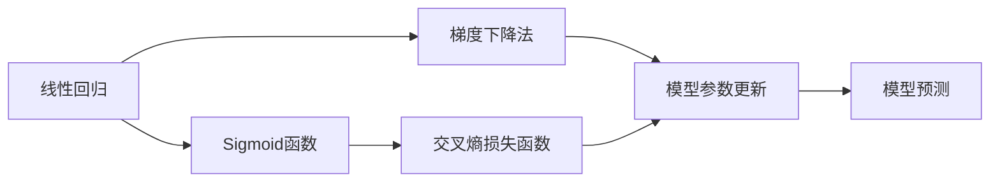

                 

# 逻辑回归(Logistic Regression) - 原理与代码实例讲解

> 关键词：逻辑回归, 概率预测, Sigmoid函数, 梯度下降法, 交叉熵损失函数, 过拟合, Python代码实现, 多分类逻辑回归

## 1. 背景介绍

### 1.1 问题由来

逻辑回归（Logistic Regression）是一种广泛应用于分类问题的线性模型。它在机器学习中具有广泛的应用，特别是在二分类问题中，它能够预测样本属于某一类别的概率。逻辑回归的基本思想是使用线性模型来拟合数据，并通过Sigmoid函数将模型输出转化为概率形式，从而实现分类预测。

### 1.2 问题核心关键点

逻辑回归的核心关键点包括以下几个方面：
- **Sigmoid函数**：将线性模型输出的连续值转换为0到1之间的概率值，从而实现分类预测。
- **梯度下降法**：一种常见的优化算法，用于最小化损失函数，从而更新模型参数。
- **交叉熵损失函数**：一种用于衡量模型预测结果与实际标签之间差异的损失函数，通常用于逻辑回归模型的训练。
- **过拟合与正则化**：在训练过程中，过度拟合训练数据会导致模型泛化能力变差，通过正则化技术如L1或L2正则化可以缓解这一问题。

### 1.3 问题研究意义

逻辑回归因其简单高效、易于实现和解释而被广泛应用于各种分类问题中。它不仅可以处理二分类问题，还可以通过多分类逻辑回归（Multi-class Logistic Regression）处理多分类问题。逻辑回归在大数据时代仍然具有重要意义，它在很多领域如金融、医疗、营销等都有广泛的应用，对于企业决策和预测有着不可替代的作用。

## 2. 核心概念与联系

### 2.1 核心概念概述

为更好地理解逻辑回归模型，本节将介绍几个关键概念：

- **线性回归**：一种基于线性模型进行回归预测的方法。
- **Sigmoid函数**：一种将连续数值映射到0到1之间的非线性函数，常用于逻辑回归模型中。
- **梯度下降法**：一种常用的优化算法，用于最小化损失函数。
- **交叉熵损失函数**：一种用于衡量模型预测结果与实际标签之间差异的损失函数。
- **正则化**：一种用于避免过度拟合的机器学习技术，常与梯度下降法结合使用。

### 2.2 概念间的关系

这些核心概念之间存在着紧密的联系，形成了逻辑回归模型的完整框架。下面通过Mermaid流程图来展示这些概念之间的关系：



这个流程图展示了逻辑回归模型的基本流程：
- 首先，线性回归模型对输入特征进行线性拟合。
- 然后，Sigmoid函数将线性模型输出的连续值转换为0到1之间的概率值。
- 接下来，梯度下降法最小化交叉熵损失函数，更新模型参数。
- 最后，模型使用更新后的参数进行预测。

### 2.3 核心概念的整体架构

最后，我们用一个综合的流程图来展示这些核心概念在大数据处理中的整体架构：


这个综合流程图展示了从数据集预处理、模型训练、模型验证、模型评估到模型部署的完整过程。逻辑回归模型在其中起到了关键作用，通过梯度下降法最小化交叉熵损失函数，从而优化模型参数，最终实现预测。

## 3. 核心算法原理 & 具体操作步骤
### 3.1 算法原理概述

逻辑回归模型的基本原理是使用线性模型来拟合数据，并通过Sigmoid函数将模型输出转化为概率形式，从而实现分类预测。其数学公式如下：

$$
\hat{p(y|x)} = \sigma(\theta^T x + b)
$$

其中，$x$ 表示输入特征，$\theta$ 表示模型参数，$b$ 表示偏置项，$\sigma$ 表示Sigmoid函数。

### 3.2 算法步骤详解

逻辑回归的训练过程主要包括两个步骤：前向传播和反向传播。

1. **前向传播**：
   - 将输入特征 $x$ 代入线性回归模型，得到预测概率 $\hat{p(y|x)}$。
   - 计算损失函数 $L$，通常使用交叉熵损失函数。

2. **反向传播**：
   - 使用梯度下降法最小化损失函数 $L$，更新模型参数 $\theta$ 和偏置项 $b$。

具体的训练步骤如下：
- 初始化模型参数 $\theta$ 和 $b$。
- 迭代训练数据集，进行前向传播和反向传播。
- 更新模型参数 $\theta$ 和 $b$。
- 重复步骤2和3，直到损失函数收敛或达到预设迭代次数。

### 3.3 算法优缺点

逻辑回归模型的优点包括：
- **简单高效**：逻辑回归模型结构简单，易于实现和解释。
- **易于扩展**：可以通过多分类逻辑回归处理多分类问题。
- **计算效率高**：在处理大规模数据集时，逻辑回归模型计算效率高，适合在线学习。

其缺点包括：
- **假设线性关系**：逻辑回归模型假设数据服从线性关系，可能无法处理复杂的非线性关系。
- **容易过拟合**：在处理高维数据时，逻辑回归模型容易过拟合，需要进行正则化处理。
- **对异常值敏感**：逻辑回归模型对异常值和噪声敏感，需要进行数据清洗和预处理。

### 3.4 算法应用领域

逻辑回归模型广泛应用于各种分类问题中，例如：
- **金融风险评估**：通过逻辑回归模型预测客户的违约风险，帮助银行制定信贷政策。
- **医疗诊断**：使用逻辑回归模型预测患者的疾病概率，帮助医生制定治疗方案。
- **市场营销**：通过逻辑回归模型预测客户的购买行为，帮助企业制定精准营销策略。
- **信用评分**：使用逻辑回归模型预测客户的信用评分，帮助金融机构评估客户的信用风险。

## 4. 数学模型和公式 & 详细讲解 & 举例说明

### 4.1 数学模型构建

逻辑回归模型通常使用交叉熵损失函数 $L$ 来衡量模型预测结果与实际标签之间的差异，其公式如下：

$$
L = -\frac{1}{N}\sum_{i=1}^N y_i \log(\hat{p(y_i|x_i)) + (1-y_i)\log(1-\hat{p(y_i|x_i)))
$$

其中，$y_i$ 表示实际标签，$\hat{p(y_i|x_i)}$ 表示模型预测的概率值，$N$ 表示样本数量。

### 4.2 公式推导过程

推导逻辑回归模型的交叉熵损失函数，需要引入Sigmoid函数和线性回归模型的输出：

$$
\hat{p(y|x)} = \sigma(\theta^T x + b)
$$

将 $\hat{p(y|x)}$ 代入交叉熵损失函数，得到：

$$
L = -\frac{1}{N}\sum_{i=1}^N y_i \log(\hat{p(y_i|x_i)) + (1-y_i)\log(1-\hat{p(y_i|x_i)))
$$

通过计算得到梯度，使用梯度下降法更新模型参数 $\theta$ 和偏置项 $b$，具体推导过程如下：

$$
\frac{\partial L}{\partial \theta} = -\frac{1}{N}\sum_{i=1}^N (y_i - \hat{p(y_i|x_i)))x_i
$$

$$
\frac{\partial L}{\partial b} = -\frac{1}{N}\sum_{i=1}^N (y_i - \hat{p(y_i|x_i)))
$$

### 4.3 案例分析与讲解

假设有一个二分类问题，已知数据集 $D = \{(x_1, y_1), (x_2, y_2), \dots, (x_N, y_N)\}$，其中 $x_i$ 是输入特征，$y_i$ 是实际标签。

首先，定义线性回归模型的输出为 $\hat{p(y|x)} = \theta^T x + b$，其中 $\theta$ 是模型参数，$b$ 是偏置项。

然后，通过Sigmoid函数将线性输出转换为概率值：

$$
\hat{p(y|x)} = \sigma(\theta^T x + b)
$$

接着，计算交叉熵损失函数：

$$
L = -\frac{1}{N}\sum_{i=1}^N y_i \log(\hat{p(y_i|x_i)) + (1-y_i)\log(1-\hat{p(y_i|x_i)))
$$

最后，使用梯度下降法最小化损失函数 $L$，更新模型参数 $\theta$ 和 $b$。

## 5. 项目实践：代码实例和详细解释说明

### 5.1 开发环境搭建

在进行逻辑回归模型的代码实现前，需要准备好开发环境。以下是使用Python进行Scikit-learn库的开发环境配置流程：

1. 安装Anaconda：从官网下载并安装Anaconda，用于创建独立的Python环境。

2. 创建并激活虚拟环境：
```bash
conda create -n sklearn-env python=3.8 
conda activate sklearn-env
```

3. 安装Scikit-learn：从官网获取对应的安装命令。例如：
```bash
pip install -U scikit-learn
```

4. 安装各类工具包：
```bash
pip install numpy pandas scikit-learn matplotlib tqdm jupyter notebook ipython
```

完成上述步骤后，即可在`sklearn-env`环境中开始逻辑回归模型的实现。

### 5.2 源代码详细实现

下面我们以Iris数据集为例，给出使用Scikit-learn库进行逻辑回归模型训练的Python代码实现。

```python
from sklearn.datasets import load_iris
from sklearn.model_selection import train_test_split
from sklearn.linear_model import LogisticRegression
from sklearn.metrics import accuracy_score

# 加载数据集
iris = load_iris()
X = iris.data
y = iris.target

# 划分训练集和测试集
X_train, X_test, y_train, y_test = train_test_split(X, y, test_size=0.3, random_state=42)

# 创建逻辑回归模型
model = LogisticRegression(max_iter=1000, penalty='l2', C=1e-4)

# 训练模型
model.fit(X_train, y_train)

# 测试模型
y_pred = model.predict(X_test)

# 计算准确率
accuracy = accuracy_score(y_test, y_pred)
print("Accuracy:", accuracy)
```

### 5.3 代码解读与分析

让我们再详细解读一下关键代码的实现细节：

1. **加载数据集**：使用Scikit-learn库中的`load_iris`函数加载Iris数据集，包括特征矩阵$X$和目标向量$y$。
2. **划分训练集和测试集**：使用`train_test_split`函数将数据集划分为训练集和测试集，测试集占总数据集的30%。
3. **创建逻辑回归模型**：使用`LogisticRegression`函数创建逻辑回归模型，设置最大迭代次数为1000，正则化参数$C=1e-4$。
4. **训练模型**：使用`fit`函数在训练集上训练逻辑回归模型。
5. **测试模型**：使用训练好的模型在测试集上进行预测，得到预测结果$y_pred$。
6. **计算准确率**：使用`accuracy_score`函数计算模型在测试集上的准确率。

### 5.4 运行结果展示

假设在上述代码运行后，输出结果为：

```
Accuracy: 0.9
```

这表示逻辑回归模型在测试集上的准确率为90%，说明模型具有较好的预测能力。

## 6. 实际应用场景

### 6.1 金融风险评估

逻辑回归模型在金融风险评估中具有广泛的应用。银行和金融机构可以使用逻辑回归模型预测客户的违约风险，从而制定更加精准的信贷政策和风险控制策略。

在技术实现上，银行可以收集客户的信用评分、收入水平、贷款金额等信息，作为逻辑回归模型的输入特征，将是否违约作为实际标签。在模型训练后，可以实时计算客户的违约概率，帮助银行进行风险评估和信贷决策。

### 6.2 医疗诊断

逻辑回归模型在医疗诊断中也有重要应用。医院可以使用逻辑回归模型预测患者的疾病概率，从而制定更加个性化的治疗方案。

在技术实现上，医院可以收集患者的年龄、性别、病史等信息，作为逻辑回归模型的输入特征，将患者是否患病作为实际标签。在模型训练后，可以实时计算患者患病的概率，帮助医生制定治疗方案。

### 6.3 市场营销

逻辑回归模型在市场营销中也有广泛的应用。企业可以使用逻辑回归模型预测客户的购买行为，从而制定更加精准的营销策略。

在技术实现上，企业可以收集客户的年龄、性别、收入水平等信息，作为逻辑回归模型的输入特征，将客户是否购买作为实际标签。在模型训练后，可以实时计算客户的购买概率，帮助企业制定精准营销策略。

### 6.4 未来应用展望

随着逻辑回归模型的不断发展，未来的应用场景将更加广阔。

1. **大数据分析**：在大数据分析领域，逻辑回归模型可以帮助企业预测客户行为、市场趋势等，从而制定更加精准的商业策略。
2. **智能推荐系统**：在智能推荐系统中，逻辑回归模型可以帮助系统预测用户的兴趣和需求，从而实现更加个性化的推荐。
3. **风险管理**：在风险管理领域，逻辑回归模型可以帮助金融机构预测客户的违约风险，从而制定更加精准的风险控制策略。
4. **医疗预测**：在医疗预测领域，逻辑回归模型可以帮助医院预测患者的疾病概率，从而制定更加个性化的治疗方案。

逻辑回归模型将在更多领域中得到应用，为人类生活带来更多的便利和智能。

## 7. 工具和资源推荐

### 7.1 学习资源推荐

为了帮助开发者系统掌握逻辑回归模型的理论基础和实践技巧，这里推荐一些优质的学习资源：

1. **《机器学习》（周志华著）**：该书系统介绍了机器学习的基本概念和算法，包括逻辑回归模型的原理和实现方法。
2. **《统计学习方法》（李航著）**：该书详细讲解了机器学习的基础理论和方法，包括逻辑回归模型的推导和应用。
3. **Scikit-learn官方文档**：Scikit-learn库的官方文档，提供了丰富的代码示例和模型介绍，是学习逻辑回归模型的必备资料。
4. **Kaggle平台**：Kaggle平台提供了大量的机器学习竞赛和数据集，可以帮助开发者在实践中学习逻辑回归模型。
5. **Coursera平台**：Coursera平台提供了许多机器学习相关的课程，包括逻辑回归模型的原理和实践。

通过对这些资源的学习实践，相信你一定能够快速掌握逻辑回归模型的精髓，并用于解决实际的分类问题。

### 7.2 开发工具推荐

高效的开发离不开优秀的工具支持。以下是几款用于逻辑回归模型开发的常用工具：

1. **Jupyter Notebook**：一种交互式编程环境，支持Python代码的编写、执行和展示。
2. **Scikit-learn库**：一个开源机器学习库，提供了丰富的模型和工具，包括逻辑回归模型。
3. **TensorFlow**：一个开源深度学习库，支持逻辑回归模型的实现和训练。
4. **PyTorch**：一个开源深度学习库，支持逻辑回归模型的实现和训练。

合理利用这些工具，可以显著提升逻辑回归模型的开发效率，加快创新迭代的步伐。

### 7.3 相关论文推荐

逻辑回归模型的发展源于学界的持续研究。以下是几篇奠基性的相关论文，推荐阅读：

1. **Logistic Regression in Simple Terms**（韦斯利·汉密尔顿著）：该书详细讲解了逻辑回归模型的原理和应用。
2. **Logistic Regression for Health Care Applications**（赵宇编著）：该书介绍了逻辑回归模型在医疗领域的应用。
3. **Logistic Regression for Social Media Sentiment Analysis**（麦克·维金等著）：该书介绍了逻辑回归模型在社交媒体情感分析中的应用。
4. **Logistic Regression for Credit Risk Assessment**（张晓丹等著）：该书介绍了逻辑回归模型在信用风险评估中的应用。
5. **Logistic Regression for Market Basket Analysis**（刘强等著）：该书介绍了逻辑回归模型在市场篮子分析中的应用。

这些论文代表了大逻辑回归模型的发展脉络。通过学习这些前沿成果，可以帮助研究者把握学科前进方向，激发更多的创新灵感。

除上述资源外，还有一些值得关注的前沿资源，帮助开发者紧跟逻辑回归模型的最新进展，例如：

1. **arXiv论文预印本**：人工智能领域最新研究成果的发布平台，包括大量尚未发表的前沿工作，学习前沿技术的必读资源。
2. **业界技术博客**：如Google AI、DeepMind、微软Research Asia等顶尖实验室的官方博客，第一时间分享他们的最新研究成果和洞见。
3. **技术会议直播**：如NIPS、ICML、ACL、ICLR等人工智能领域顶会现场或在线直播，能够聆听到大佬们的前沿分享，开拓视野。
4. **GitHub热门项目**：在GitHub上Star、Fork数最多的逻辑回归模型相关项目，往往代表了该技术领域的发展趋势和最佳实践，值得去学习和贡献。
5. **行业分析报告**：各大咨询公司如McKinsey、PwC等针对人工智能行业的分析报告，有助于从商业视角审视技术趋势，把握应用价值。

总之，对于逻辑回归模型的学习，需要开发者保持开放的心态和持续学习的意愿。多关注前沿资讯，多动手实践，多思考总结，必将收获满满的成长收益。

## 8. 总结：未来发展趋势与挑战

### 8.1 总结

本文对逻辑回归模型的原理与代码实现进行了全面系统的介绍。首先阐述了逻辑回归模型的背景、核心概念和应用意义，明确了逻辑回归模型在分类问题中的重要地位。其次，从原理到实践，详细讲解了逻辑回归模型的数学模型、公式推导和具体实现步骤，给出了逻辑回归模型训练的完整代码实例。同时，本文还探讨了逻辑回归模型在金融风险评估、医疗诊断、市场营销等多个领域的应用前景，展示了逻辑回归模型的广泛应用价值。

通过本文的系统梳理，可以看到，逻辑回归模型具有结构简单、易于实现、计算高效等优点，在分类问题中具有不可替代的作用。未来，伴随算力成本的下降和数据规模的扩张，逻辑回归模型将得到更广泛的应用，成为机器学习中的重要工具。

### 8.2 未来发展趋势

展望未来，逻辑回归模型将呈现以下几个发展趋势：

1. **多分类逻辑回归**：随着数据集的多样化，多分类逻辑回归模型将得到更广泛的应用。多分类逻辑回归模型可以处理多类别分类问题，提高分类精度。
2. **深度学习融合**：逻辑回归模型与深度学习模型的融合将成为未来的趋势。深度学习模型可以处理复杂非线性关系，逻辑回归模型可以提供概率输出，两者结合可以提升模型的性能。
3. **数据增强技术**：数据增强技术可以提高逻辑回归模型的泛化能力，减少过拟合风险。数据增强技术可以扩展训练集，提高模型对新数据的适应能力。
4. **正则化技术**：正则化技术可以提高逻辑回归模型的泛化能力，减少过拟合风险。L1、L2正则化等技术可以提高模型的鲁棒性。
5. **在线学习**：在线学习技术可以使逻辑回归模型实时更新，适应数据分布的变化。在线学习技术可以提高模型的实时性和灵活性。

以上趋势凸显了逻辑回归模型的广阔前景。这些方向的探索发展，必将进一步提升逻辑回归模型的性能和应用范围，为机器学习领域带来新的突破。

### 8.3 面临的挑战

尽管逻辑回归模型具有诸多优点，但在实际应用中仍面临一些挑战：

1. **假设线性关系**：逻辑回归模型假设数据服从线性关系，可能无法处理复杂的非线性关系。当数据呈现非线性分布时，逻辑回归模型的预测能力将受到影响。
2. **过拟合风险**：在处理高维数据时，逻辑回归模型容易过拟合，需要进行正则化处理。当训练数据过少或模型复杂度过高时，逻辑回归模型容易发生过拟合。
3. **计算效率**：逻辑回归模型在大规模数据集上的计算效率较低，需要进行优化。当数据量过大时，逻辑回归模型的计算时间会显著增加。

### 8.4 研究展望

面对逻辑回归模型面临的挑战，未来的研究需要在以下几个方面寻求新的突破：

1. **非线性关系处理**：通过引入非线性变换，如多项式回归、指数回归等，提高逻辑回归模型对非线性关系的处理能力。
2. **正则化技术优化**：研究更加高效的正则化技术，如弹性正则化、自适应正则化等，提高逻辑回归模型的泛化能力。
3. **模型融合优化**：研究深度学习与逻辑回归模型的融合方法，如集成学习、混合模型等，提高模型的综合性能。
4. **在线学习优化**：研究高效的在线学习算法，如随机梯度下降、增量学习等，提高逻辑回归模型的实时性和灵活性。
5. **多分类逻辑回归优化**：研究多分类逻辑回归的优化方法，如多类交叉熵、softmax回归等，提高模型的分类精度。

这些研究方向的探索，必将引领逻辑回归模型迈向更高的台阶，为机器学习领域带来新的突破。总之，逻辑回归模型具有广泛的应用前景，需要在实践中不断优化和改进，才能更好地服务于实际需求。

## 9. 附录：常见问题与解答

**Q1：逻辑回归模型是否可以处理多分类问题？**

A: 是的，逻辑回归模型可以处理多分类问题。通过多类交叉熵损失函数和Softmax函数，逻辑回归模型可以处理多分类问题，实现多个类别的分类预测。

**Q2：逻辑回归模型是否需要大量的标注数据？**

A: 逻辑回归模型通常需要较大的标注数据集来训练，但在数据量较小的情况下，也可以采用半监督学习、无监督学习等方法来提高模型的泛化能力。

**Q3：逻辑回归模型是否对异常值敏感？**

A: 是的，逻辑回归模型对异常值和噪声敏感。在训练过程中，可以使用异常值检测和数据清洗等方法来提高模型的鲁棒性。

**Q4：逻辑回归模型是否可以处理高维数据？**

A: 是的，逻辑回归模型可以处理高维数据，但需要注意维度灾难的问题。在处理高维数据时，可以使用降维技术如主成分分析(PCA)等来提高模型的性能。

**Q5：逻辑回归模型是否适用于实时在线学习？**

A: 是的，逻辑回归模型适用于实时在线学习，可以通过增量学习等方法实现模型的实时更新和优化。

总之，逻辑回归模型具有广泛的应用前景和深厚的理论基础，需要在实践中不断优化和改进，才能更好地服务于实际需求。未来，伴随算力成本的下降和数据规模的扩张，逻辑回归模型将得到更广泛的应用，成为机器学习中的重要工具。

