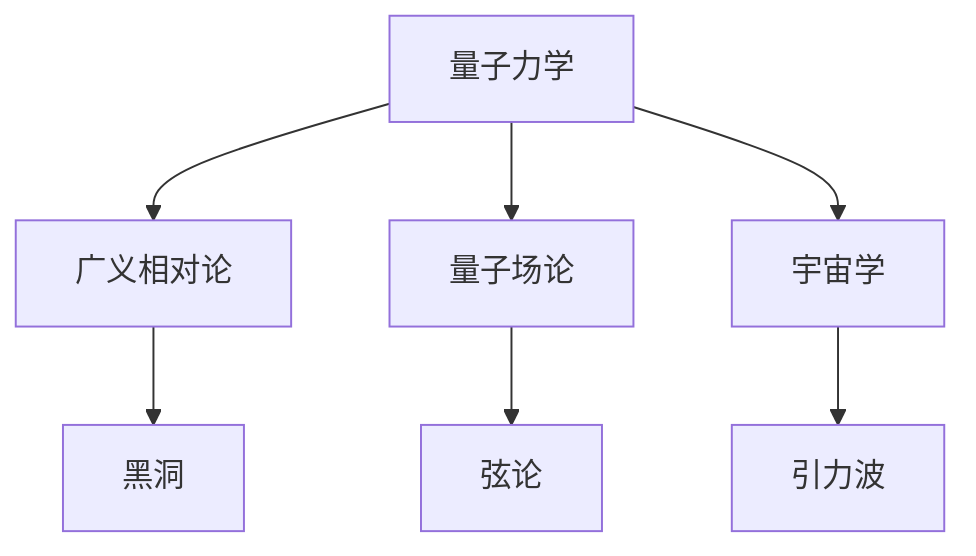
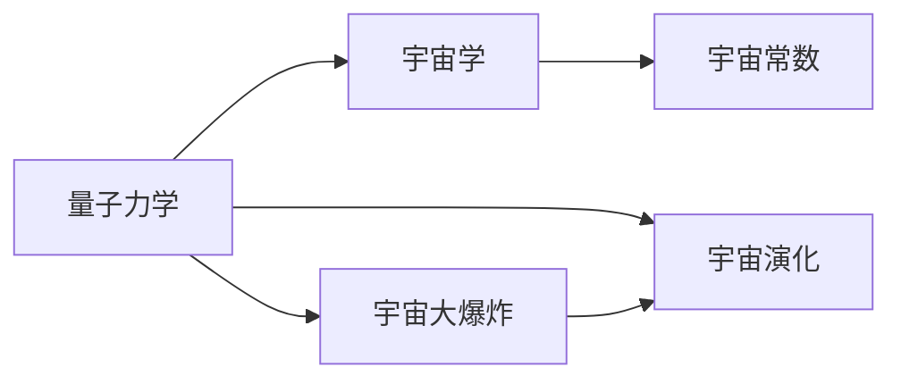
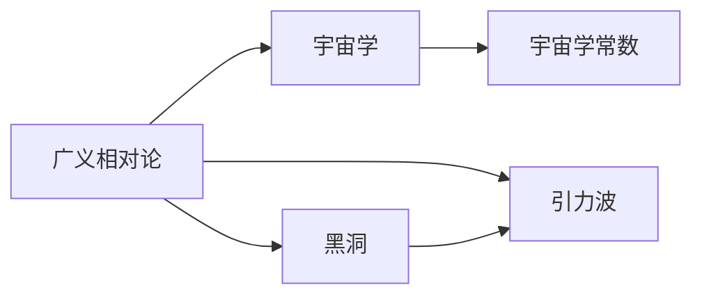

                 

# 量子引力与宇宙学的关系

## 1. 背景介绍

### 1.1 问题由来

量子引力（Quantum Gravity）作为物理学的圣杯，致力于将描述微观世界的量子力学和描述宏观世界的广义相对论统一起来。自从爱因斯坦提出广义相对论以来，科学家们一直在寻找能够将这两大理论统一起来的完整理论。量子引力的研究不仅能揭示宇宙的奥秘，还能解决许多现代物理学中的重大问题，如黑洞信息悖论、暗物质和暗能量等问题。

### 1.2 问题核心关键点

量子引力研究的核心在于找到一种既能描述引力场又能描述量子效应的理论框架。其研究涉及两个关键领域：

- 弦论（String Theory）：提出了一种新的物质形态——弦，认为宇宙的基本单元是具有振动模式的弦，而非点粒子。通过弦的振动模式来描述基本粒子和引力，试图将量子力学和广义相对论统一起来。
- 量子场论（Quantum Field Theory, QFT）：认为一切基本粒子都是量子场的不同激发态。通过将引力场也看作是一种量子场，试图将量子力学和广义相对论统一起来。

目前，量子引力研究仍处于探索阶段，尚未找到一种完全满足理论物理要求的量子引力理论。

### 1.3 问题研究意义

量子引力的研究不仅对于解决当前物理学中的未解之谜具有重要意义，还可能开辟新的科学领域，推动科学技术的发展。通过对量子引力的研究，人类可以更好地理解宇宙的本质和结构，探索更深的物理规律，进而推动整个自然科学的发展。

## 2. 核心概念与联系

### 2.1 核心概念概述

为更好地理解量子引力与宇宙学的关系，本节将介绍几个密切相关的核心概念：

- 量子力学（Quantum Mechanics）：描述微观世界的物理理论，基于波粒二象性和不确定性原理，解释原子和亚原子粒子的行为。
- 广义相对论（General Relativity）：描述宏观世界的物理理论，基于时空弯曲和引力场，解释星体运动和引力波等现象。
- 量子场论（Quantum Field Theory, QFT）：将引力场视为一种量子场，试图将量子力学和广义相对论统一起来。
- 弦论（String Theory）：基于弦的振动模式，试图将量子力学和广义相对论统一起来。
- 黑洞（Black Hole）：极端密度和强引力场的天体，是研究引力量子效应的重要对象。

这些核心概念之间的逻辑关系可以通过以下Mermaid流程图来展示：



这个流程图展示了大语言模型的核心概念及其之间的关系：

1. 量子力学和广义相对论是宇宙学的两个基本支柱。
2. 量子场论和弦论试图将量子力学和广义相对论统一起来。
3. 黑洞是研究引力量子效应的重要对象。
4. 宇宙学与量子引力密切相关，推动了引力理论的研究。

### 2.2 概念间的关系

这些核心概念之间存在着紧密的联系，形成了量子引力与宇宙学的完整生态系统。下面我通过几个Mermaid流程图来展示这些概念之间的关系。

#### 2.2.1 量子力学与宇宙学



这个流程图展示了大语言模型的核心概念及其之间的关系：

1. 量子力学为宇宙学的起源和演化提供了理论基础。
2. 宇宙大爆炸和宇宙演化理论依赖量子力学的原理。
3. 宇宙常数等重要物理常数也受到量子力学的约束。

#### 2.2.2 广义相对论与宇宙学



这个流程图展示了大语言模型的核心概念及其之间的关系：

1. 广义相对论为宇宙学提供了时空弯曲和引力场理论。
2. 黑洞和引力波等重要天体和现象也是广义相对论的预言。
3. 宇宙学常数等也受到广义相对论的影响。

#### 2.2.3 量子场论与弦论

```mermaid
graph TB
    A[量子场论] --> B[str
```

