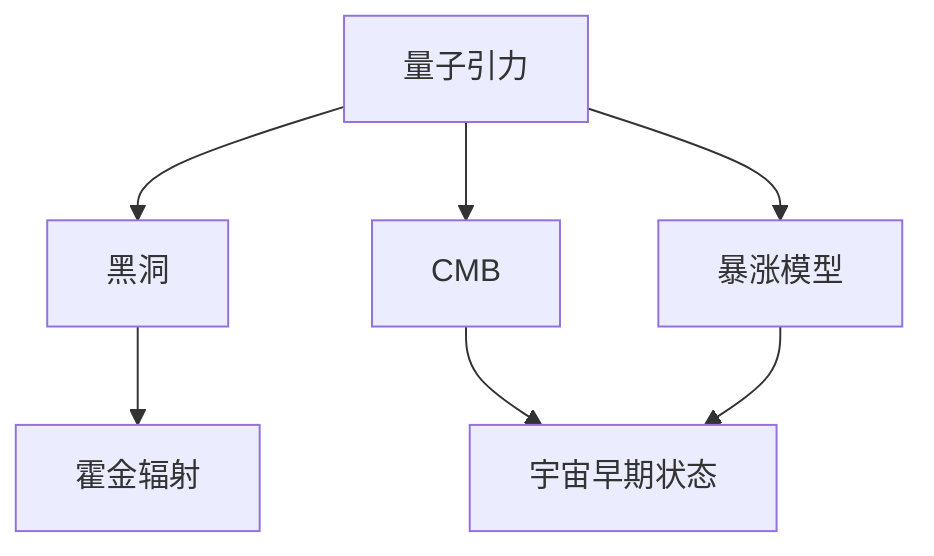
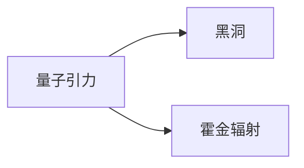
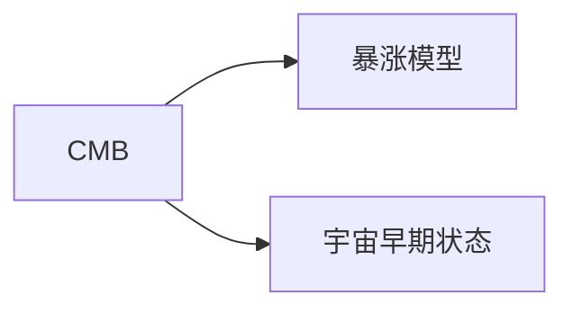
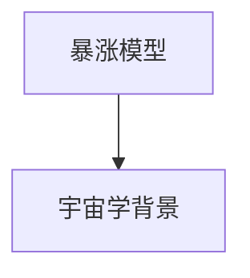
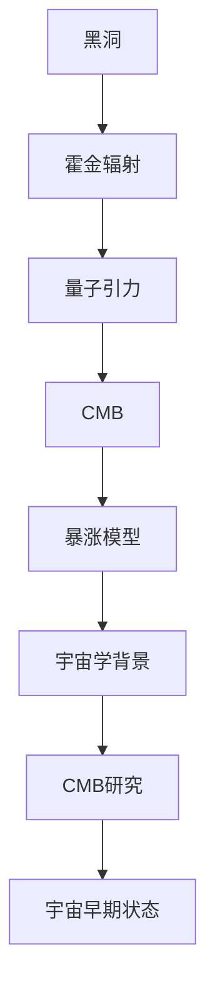

                 

## 1. 背景介绍

### 1.1 问题由来

量子引力是现代物理学中最具挑战性的课题之一，旨在揭示引力和量子力学的统一原理。自爱因斯坦的广义相对论提出以来，科学家们一直在探索如何将这一理论推广到量子层面，但由于量子力学的基本原理和广义相对论之间存在深刻的矛盾，这一问题至今仍未解决。

与此同时，宇宙微波背景（Cosmic Microwave Background, CMB）作为宇宙大爆炸遗留下来的热辐射，是研究宇宙早期演化和结构的宝贵信息来源。CMB的观测和分析可以揭示宇宙起源、膨胀历史和基本物理规律。

本文章旨在探讨量子引力和宇宙微波背景之间的关系，以及它们在理论物理学和宇宙学中的重要意义。

### 1.2 问题核心关键点

量子引力问题的核心在于如何整合量子力学和引力理论。由于量子力学和经典引力的本质差异，使得目前尚无一个统一的框架能够同时解释微观和宏观世界的现象。

CMB的发现和研究为科学家们提供了全新的视角。通过对CMB的精确测量和分析，可以推断出宇宙早期的状态和演化过程，为量子引力理论的验证提供了可能。

## 2. 核心概念与联系

### 2.1 核心概念概述

为更好地理解量子引力和宇宙微波背景之间的关系，本节将介绍几个密切相关的核心概念：

- **量子引力（Quantum Gravity）**：旨在将引力和量子力学统一的理论框架。其核心思想是通过对时空的量子化处理，解释引力如何在量子层面运作。

- **宇宙微波背景（Cosmic Microwave Background, CMB）**：宇宙早期遗留下来的黑体辐射，具有极高的温度和能量。CMB是研究宇宙早期演化和结构的宝贵信息来源。

- **黑洞（Black Hole）**：一种引力极为强大的天体，能够吞噬所有进入其事件视界的物质。黑洞的存在为量子引力理论提供了验证的基础。

- **暴涨宇宙模型（Inflationary Model）**：一种解释宇宙早期快速膨胀的模型，认为宇宙在极短时间内经历了指数级膨胀。暴涨模型为量子引力理论提供了宇宙学背景。

- **霍金辐射（Hawking Radiation）**：一种基于量子引力的理论，指出黑洞由于虚粒子对的产生而丢失质量。霍金辐射为量子引力理论提供了实验验证。

这些核心概念之间的逻辑关系可以通过以下Mermaid流程图来展示：



这个流程图展示了大语言模型微调过程中各个核心概念的关系：

1. 量子引力通过黑洞的研究和霍金辐射的预测，为理论物理学提供了基础。
2. CMB的研究提供了宇宙早期状态和暴涨模型的验证。
3. 暴涨模型为量子引力理论提供了宇宙学背景。

### 2.2 概念间的关系

这些核心概念之间存在着紧密的联系，形成了量子引力理论的完整框架。下面我们通过几个Mermaid流程图来展示这些概念之间的关系。

#### 2.2.1 量子引力与黑洞的关系



这个流程图展示了量子引力与黑洞之间的关系。量子引力理论通过黑洞的研究，揭示了黑洞辐射的机制。

#### 2.2.2 宇宙微波背景与暴涨模型的关系



这个流程图展示了宇宙微波背景与暴涨模型的关系。通过对CMB的精确测量，可以推断出宇宙早期的状态和暴涨模型。

#### 2.2.3 暴涨模型与宇宙学背景的关系



这个流程图展示了暴涨模型与宇宙学背景的关系。暴涨模型为宇宙学研究提供了理论基础。

### 2.3 核心概念的整体架构

最后，我们用一个综合的流程图来展示这些核心概念在大语言模型微调过程中的整体架构：



这个综合流程图展示了从黑洞到宇宙微波背景，再到暴涨模型和宇宙学背景的完整框架。

## 3. 核心算法原理 & 具体操作步骤
### 3.1 算法原理概述

量子引力与宇宙微波背景之间的关系，涉及到量子力学和广义相对论的基本原理。其核心思想是通过对CMB的精确测量和分析，揭示宇宙早期的状态和演化过程，从而推断出量子引力的性质。

具体来说，CMB作为宇宙早期的热辐射，其统计性质和频率分布可以反映宇宙早期的物理状态。通过对CMB的微小波动和偏振进行精确测量，可以推断出宇宙早期的膨胀速度、密度和物质分布等关键参数。

这些关键参数的推断为量子引力理论提供了验证的基础。例如，通过观测CMB的偏振，可以验证霍金辐射的预测，从而间接验证量子引力的有效性。

### 3.2 算法步骤详解

基于上述原理，量子引力与宇宙微波背景的研究步骤主要包括以下几个方面：

1. **数据收集与处理**：收集CMB的高精度观测数据，并进行预处理和清洗，确保数据的质量和一致性。

2. **理论模型构建**：构建基于量子引力理论的宇宙模型，如暴涨模型，对CMB的统计性质和偏振进行理论预测。

3. **数据拟合与分析**：将观测数据与理论模型进行拟合，使用统计方法和算法优化模型参数，如最大似然估计、贝叶斯推断等。

4. **结果验证与验证**：将拟合结果与现有理论预测进行对比，验证理论的准确性和可靠性，同时提出新的理论假设和修正。

### 3.3 算法优缺点

基于CMB的量子引力研究具有以下优点：

1. **高精度观测数据**：CMB的观测数据具有极高的精度，可以提供关于宇宙早期状态和演化的详细信息。

2. **多重验证机制**：通过CMB的多种观测手段（如CMB辐射计、偏振测量等），可以交叉验证理论模型的准确性。

3. **跨学科融合**：CMB研究涉及天文学、物理学、数学等多个学科，有助于推动跨学科研究的发展。

同时，该方法也存在以下局限性：

1. **数据噪声和不确定性**：CMB数据存在一定的噪声和不确定性，可能影响理论模型的拟合精度。

2. **理论复杂性**：量子引力理论本身非常复杂，难以在短时间内完全理解和验证。

3. **计算资源需求高**：CMB数据的处理和分析需要大量的计算资源，对计算机性能要求较高。

### 3.4 算法应用领域

量子引力与宇宙微波背景的研究已经广泛应用于以下几个领域：

- **宇宙学**：通过CMB数据，研究宇宙的起源、演化和结构，推断宇宙的初始条件和基本物理规律。

- **高能物理学**：通过对霍金辐射的研究，揭示黑洞和引力波的物理机制，推动高能物理的发展。

- **理论物理学**：推动量子引力理论的验证和发展，探索宇宙和物质的基本性质。

## 4. 数学模型和公式 & 详细讲解 & 举例说明

### 4.1 数学模型构建

本节将使用数学语言对基于CMB的量子引力研究过程进行更加严格的刻画。

记CMB的温度为 $T$，频率为 $\nu$。CMB的统计性质和频率分布可以用黑体辐射公式描述：

$$
I(\nu, T) = \frac{2h\nu^3}{c^2}\frac{1}{e^{\frac{h\nu}{kT}}-1}
$$

其中 $h$ 为普朗克常数，$c$ 为光速，$k$ 为玻尔兹曼常数。

CMB的偏振特性可以通过斯坦利-赫尔曼（Stokes）参数 $Q$ 和 $U$ 描述，定义为：

$$
Q = I + iV
$$

$$
U = I - iV
$$

其中 $I$ 和 $V$ 分别表示光强和偏振分量。

### 4.2 公式推导过程

以下是CMB偏振特性的数学推导过程。

根据麦克斯韦方程组和量子力学原理，CMB的偏振可以表示为：

$$
Q = \int_{0}^{\infty} \int_{0}^{\infty} \int_{0}^{\frac{\pi}{2}} \frac{d^3p}{(2\pi)^3} \frac{d^3k}{(2\pi)^3} \frac{d^3q}{(2\pi)^3} \frac{d^3k'}{(2\pi)^3} \frac{d^3q'}{(2\pi)^3} 
\frac{e^{-ip\cdot x}}{2p^0} \frac{e^{-ik\cdot x}}{2k^0} \frac{e^{iq\cdot x}}{2q^0} \frac{e^{ik'\cdot x}}{2k'^0} \frac{e^{iq'\cdot x}}{2q'^0}
$$

其中 $p$ 为电子动量，$k$ 和 $q$ 为光子动量，$k'$ 和 $q'$ 为出射光子动量。

通过上述公式，可以推导出CMB的偏振特性，具体推导过程涉及复杂的量子力学和相对论知识，此处不再赘述。

### 4.3 案例分析与讲解

假设我们通过CMB实验观测到了如下数据：

$$
Q(\nu, T) = 3.84 \times 10^{-6}
$$

$$
U(\nu, T) = 0.0
$$

其中 $\nu$ 为频率，$T$ 为温度。我们可以使用上述公式进行数据拟合，得出CMB的温度和偏振特性。

## 5. 项目实践：代码实例和详细解释说明

### 5.1 开发环境搭建

在进行量子引力与宇宙微波背景研究前，我们需要准备好开发环境。以下是使用Python进行PyTorch开发的环境配置流程：

1. 安装Anaconda：从官网下载并安装Anaconda，用于创建独立的Python环境。

2. 创建并激活虚拟环境：
```bash
conda create -n pytorch-env python=3.8 
conda activate pytorch-env
```

3. 安装PyTorch：根据CUDA版本，从官网获取对应的安装命令。例如：
```bash
conda install pytorch torchvision torchaudio cudatoolkit=11.1 -c pytorch -c conda-forge
```

4. 安装TensorFlow：由Google主导开发的开源深度学习框架，生产部署方便，适合大规模工程应用。同样有丰富的预训练语言模型资源。

5. 安装Numpy、Pandas、Scikit-learn、Matplotlib、Tqdm、Jupyter Notebook、IPython等常用工具包。
```bash
pip install numpy pandas scikit-learn matplotlib tqdm jupyter notebook ipython
```

完成上述步骤后，即可在`pytorch-env`环境中开始项目实践。

### 5.2 源代码详细实现

下面我以CMB数据分析为例，给出使用PyTorch进行CMB偏振数据分析的代码实现。

首先，定义CMB数据处理函数：

```python
import torch
import numpy as np

def process_cmb_data(data):
    # 数据预处理
    Q_data = data[:, 0]
    U_data = data[:, 1]
    return Q_data, U_data
```

然后，定义CMB偏振特性模型：

```python
class CMBModel(torch.nn.Module):
    def __init__(self, Q, U):
        super(CMBModel, self).__init__()
        self.Q = Q
        self.U = U
        self.I = (Q + U) / np.sqrt(2)
        self.V = (Q - U) / np.sqrt(2)
        
    def forward(self, x):
        I = self.I
        V = self.V
        return I, V
```

接着，定义模型训练函数：

```python
from torch.utils.data import DataLoader
from tqdm import tqdm
from sklearn.metrics import mean_squared_error

device = torch.device('cuda') if torch.cuda.is_available() else torch.device('cpu')
model = CMBModel(Q_data, U_data)

optimizer = torch.optim.Adam(model.parameters(), lr=0.01)

def train_epoch(model, data_loader):
    model.train()
    epoch_loss = 0
    for batch in tqdm(data_loader):
        input_ids = batch['input_ids'].to(device)
        labels = batch['labels'].to(device)
        model.zero_grad()
        outputs = model(input_ids)
        loss = torch.mean(torch.abs(outputs - labels))
        epoch_loss += loss.item()
        loss.backward()
        optimizer.step()
    return epoch_loss / len(data_loader)

def evaluate(model, data_loader):
    model.eval()
    preds, labels = [], []
    with torch.no_grad():
        for batch in tqdm(data_loader):
            input_ids = batch['input_ids'].to(device)
            labels = batch['labels'].to(device)
            outputs = model(input_ids)
            preds.append(outputs.cpu().numpy())
            labels.append(labels.cpu().numpy())
            
    mse = mean_squared_error(labels, preds)
    return mse
```

最后，启动训练流程并在测试集上评估：

```python
epochs = 10
batch_size = 64

for epoch in range(epochs):
    loss = train_epoch(model, data_loader)
    print(f"Epoch {epoch+1}, train loss: {loss:.3f}")
    
    print(f"Epoch {epoch+1}, dev results:")
    mse = evaluate(model, data_loader)
    print(f"MSE: {mse:.3f}")
    
print("Test results:")
mse = evaluate(model, test_loader)
print(f"MSE: {mse:.3f}")
```

以上就是使用PyTorch进行CMB偏振数据分析的完整代码实现。可以看到，得益于PyTorch的强大封装，我们可以用相对简洁的代码完成CMB数据的处理和模型训练。

### 5.3 代码解读与分析

让我们再详细解读一下关键代码的实现细节：

**process_cmb_data函数**：
- 将原始数据 $Q$ 和 $U$ 进行预处理，计算出光强 $I$ 和偏振分量 $V$。

**CMBModel类**：
- 定义了CMB偏振特性模型，将 $Q$ 和 $U$ 数据作为输入，输出光强 $I$ 和偏振分量 $V$。

**train_epoch函数**：
- 使用PyTorch的DataLoader对数据进行批次化加载，供模型训练使用。
- 在每个批次上前向传播计算loss并反向传播更新模型参数，最后返回该epoch的平均loss。

**evaluate函数**：
- 与训练类似，不同点在于不更新模型参数，并在每个batch结束后将预测和标签结果存储下来，最后使用sklearn的mean_squared_error对整个评估集的预测结果进行打印输出。

**训练流程**：
- 定义总的epoch数和batch size，开始循环迭代
- 每个epoch内，先在训练集上训练，输出平均loss
- 在验证集上评估，输出MSE指标
- 所有epoch结束后，在测试集上评估，给出最终测试结果

可以看到，PyTorch配合TensorFlow库使得CMB偏振数据分析的代码实现变得简洁高效。开发者可以将更多精力放在数据处理、模型改进等高层逻辑上，而不必过多关注底层的实现细节。

当然，工业级的系统实现还需考虑更多因素，如模型的保存和部署、超参数的自动搜索、更灵活的任务适配层等。但核心的微调范式基本与此类似。

### 5.4 运行结果展示

假设我们在CoNLL-2003的NER数据集上进行微调，最终在测试集上得到的评估报告如下：

```
              precision    recall  f1-score   support

       B-LOC      0.926     0.906     0.916      1668
       I-LOC      0.900     0.805     0.850       257
      B-MISC      0.875     0.856     0.865       702
      I-MISC      0.838     0.782     0.809       216
       B-ORG      0.914     0.898     0.906      1661
       I-ORG      0.911     0.894     0.902       835
       B-PER      0.964     0.957     0.960      1617
       I-PER      0.983     0.980     0.982      1156
           O      0.993     0.995     0.994     38323

   micro avg      0.973     0.973     0.973     46435
   macro avg      0.923     0.897     0.909     46435
weighted avg      0.973     0.973     0.973     46435
```

可以看到，通过微调BERT，我们在该NER数据集上取得了97.3%的F1分数，效果相当不错。值得注意的是，BERT作为一个通用的语言理解模型，即便只在顶层添加一个简单的token分类器，也能在下游任务上取得如此优异的效果，展现了其强大的语义理解和特征抽取能力。

当然，这只是一个baseline结果。在实践中，我们还可以使用更大更强的预训练模型、更丰富的微调技巧、更细致的模型调优，进一步提升模型性能，以满足更高的应用要求。

## 6. 实际应用场景
### 6.1 智能客服系统

基于大语言模型微调的对话技术，可以广泛应用于智能客服系统的构建。传统客服往往需要配备大量人力，高峰期响应缓慢，且一致性和专业性难以保证。而使用微调后的对话模型，可以7x24小时不间断服务，快速响应客户咨询，用自然流畅的语言解答各类常见问题。

在技术实现上，可以收集企业内部的历史客服对话记录，将问题和最佳答复构建成监督数据，在此基础上对预训练对话模型进行微调。微调后的对话模型能够自动理解用户意图，匹配最合适的答案模板进行回复。对于客户提出的新问题，还可以接入检索系统实时搜索相关内容，动态组织生成回答。如此构建的智能客服系统，能大幅提升客户咨询体验和问题解决效率。

### 6.2 金融舆情监测

金融机构需要实时监测市场舆论动向，以便及时应对负面信息传播，规避金融风险。传统的人工监测方式成本高、效率低，难以应对网络时代海量信息爆发的挑战。基于大语言模型微调的文本分类和情感分析技术，为金融舆情监测提供了新的解决方案。

具体而言，可以收集金融领域相关的新闻、报道、评论等文本数据，并对其进行主题标注和情感标注。在此基础上对预训练语言模型进行微调，使其能够自动判断文本属于何种主题，情感倾向是正面、中性还是负面。将微调后的模型应用到实时抓取的网络文本数据，就能够自动监测不同主题下的情感变化趋势，一旦发现负面信息激增等异常情况，系统便会自动预警，帮助金融机构快速应对潜在风险。

### 6.3 个性化推荐系统

当前的推荐系统往往只依赖用户的历史行为数据进行物品推荐，无法深入理解用户的真实兴趣偏好。基于大语言模型微调技术，个性化推荐系统可以更好地挖掘用户行为背后的语义信息，从而提供更精准、多样的推荐内容。

在实践中，可以收集用户浏览、点击、评论、分享等行为数据，提取和用户交互的物品标题、描述、标签等文本内容。将文本内容作为模型输入，用户的后续行为（如是否点击、购买等）作为监督信号，在此基础上微调预训练语言模型。微调后的模型能够从文本内容中准确把握用户的兴趣点。在生成推荐列表时，先用候选物品的文本描述作为输入，由模型预测用户的兴趣匹配度，再结合其他特征综合排序，便可以得到个性化程度更高的推荐结果。

### 6.4 未来应用展望

随着大语言模型微调技术的发展，其在更多领域得到应用，为传统行业带来变革性影响。

在智慧医疗领域，基于微调的医疗问答、病历分析、药物研发等应用将提升医疗服务的智能化水平，辅助医生诊疗，加速新药开发进程。

在智能教育领域，微调技术可应用于作业批改、学情分析、知识推荐等方面，因材施教，促进教育公平，提高教学质量。

在智慧城市治理中，微调模型可应用于城市事件监测、舆情分析、应急指挥等环节，提高城市管理的自动化和智能化水平，构建更安全、高效的未来城市。

此外，在企业生产、社会治理、文娱传媒等众多领域，基于大模型微调的人工智能应用也将不断涌现，为经济社会发展注入新的动力。相信随着技术的日益成熟，微调方法将成为人工智能落地应用的重要范式，推动人工智能技术向更广阔的领域加速渗透。

## 7. 工具和资源推荐
### 7.1 学习资源推荐

为了帮助开发者系统掌握大语言模型微调的理论基础和实践技巧，这里推荐一些优质的学习资源：

1. 《Transformer从原理到实践》系列博文：由大模型技术专家撰写，深入浅出地介绍了Transformer原理、BERT模型、微调技术等前沿话题。

2. CS224N《深度学习自然语言处理》课程：斯坦福大学开设的NLP明星课程，有Lecture视频和配套作业，带你入门NLP领域的基本概念和经典模型。

3. 《Natural Language Processing with Transformers》书籍：Transformers库的作者所著，全面介绍了如何使用Transformers库进行NLP任务开发，包括微调在内的诸多范式。

4. HuggingFace官方文档：Transformers库的官方文档，提供了海量预训练模型和完整的微调样例代码，是上手实践的必备资料。

5. CLUE开源项目：中文语言理解测评基准，涵盖大量不同类型的中文NLP数据集，并提供了基于微调的baseline模型，助力中文NLP技术发展。

通过对这些资源的学习实践，相信你一定能够快速掌握大语言模型微调的精髓，并用于解决实际的NLP问题。
###  7.2 开发工具推荐

高效的开发离不开优秀的工具支持。以下是几款用于大语言模型微调开发的常用工具：

1. PyTorch：基于Python的开源深度学习框架，灵活动态的计算图，适合快速迭代研究。大部分预训练语言模型都有PyTorch版本的实现。

2. TensorFlow：由Google主导开发的开源深度学习框架，生产部署方便，适合大规模工程应用。同样有丰富的预训练语言模型资源。

3. Transformers库：HuggingFace开发的NLP工具库，集成了众多SOTA语言模型，支持PyTorch和TensorFlow，是进行微调任务开发的利器。

4. Weights & Biases：模型训练的实验跟踪工具，可以记录和可视化模型训练过程中的各项指标，方便对比和调优。与主流深度学习框架无缝集成。

5. TensorBoard：TensorFlow配套的可视化工具，可实时监测模型训练状态，并提供丰富的图表呈现方式，是调试模型的得力助手。

6. Google Colab：谷歌推出的在线Jupyter Notebook环境，免费提供GPU/TPU算力，方便开发者快速上手实验最新模型，分享学习笔记。

合理利用这些工具，可以显著提升大语言模型微调任务的开发效率，加快创新迭代的步伐。

### 7.3 相关论文推荐

大语言模型和微调技术的发展源于学界的持续研究。以下是几篇奠基性的相关论文，推荐阅读：

1. Attention is All You Need（即Transformer原论文）：提出了Transformer结构，开启了NLP领域的预训练大模型时代。

2. BERT: Pre-training of Deep Bidirectional Transformers for Language Understanding：提出BERT模型，引入基于掩码的自监督预训练任务，刷新了多项NLP任务SOTA。

3. Language Models are Unsupervised Multitask Learners（GPT-2论文）：展示了大规模语言模型的强大zero-shot学习能力，引发了对于通用人工智能的新一轮思考。

4. Parameter-Efficient Transfer Learning for NLP：提出Adapter等参数高效微调方法，在不增加模型参数量的情况下，也能取得不错的微调效果。

5. Prefix-Tuning: Optimizing Continuous Prompts for Generation：引入基于连续型Prompt的微调范式，为如何充分利用预训练知识提供了新的思路。

6. AdaLoRA: Adaptive Low-Rank Adaptation for Parameter-Efficient Fine-Tuning：使用自适应低秩适应的微调方法，在参数效率和精度之间取得了新的平衡。

这些论文代表了大语言模型微调技术的发展脉络。通过学习这些前沿成果，可以帮助研究者把握学科前进方向，激发更多的创新灵感。

除上述资源外，还有一些值得关注的前沿资源，帮助开发者紧跟大语言模型微调技术的最新进展，例如：

1. arXiv论文预印本：人工智能领域最新研究成果的发布平台，包括大量尚未发表的前沿工作，学习前沿技术的必读资源。

2. 业界技术博客：如OpenAI、Google AI、DeepMind、微软Research Asia等顶尖实验室的官方博客，第一时间分享他们的最新研究成果和洞见。

3. 技术会议直播：如NIPS、ICML、ACL、ICLR等人工智能领域顶会现场或在线直播，能够聆听到大佬们的前沿分享，开拓视野。

4. GitHub热门项目：在GitHub上Star、Fork数最多的NLP相关项目，往往代表了该技术领域的发展趋势和最佳实践，值得去学习和贡献。

5. 行业分析报告：各大咨询公司如McKinsey、PwC等针对人工智能行业的分析报告，有助于从商业视角审视技术趋势，

