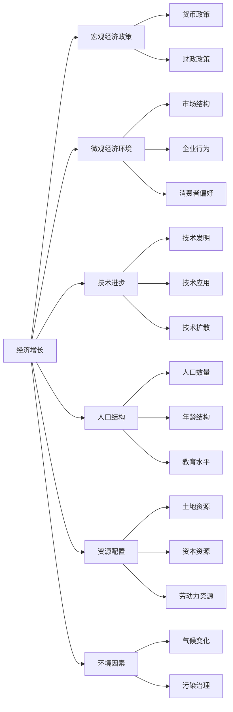
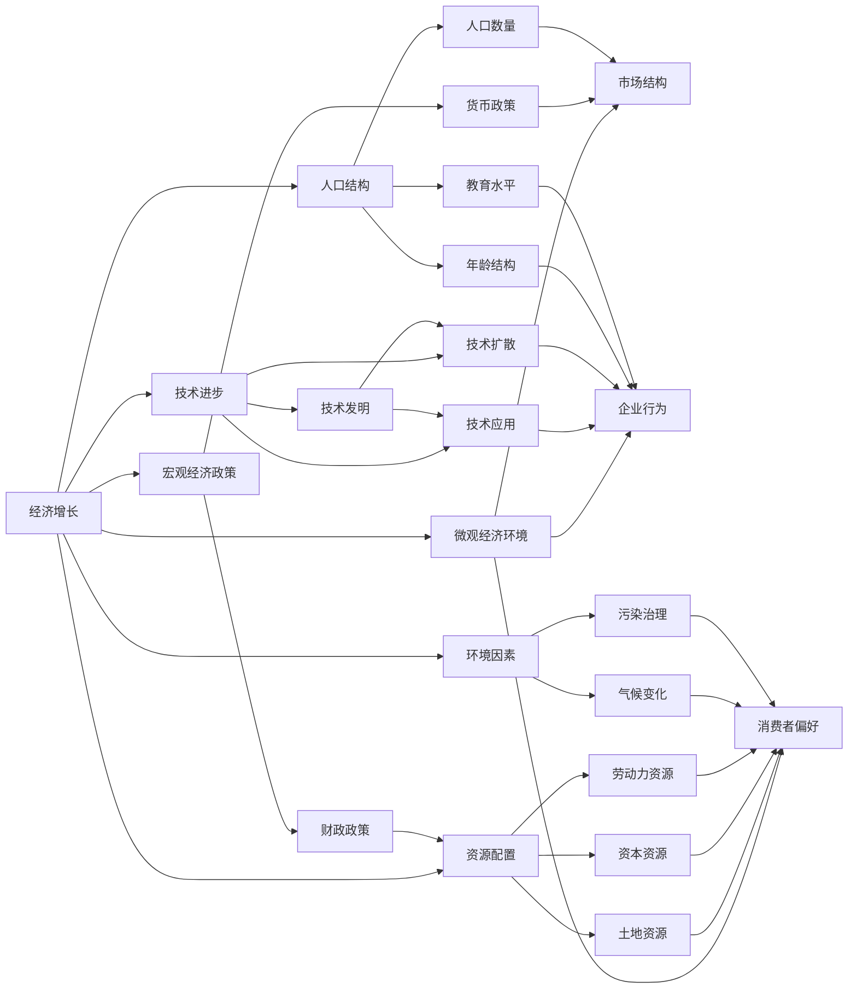

                 

# 阶段性因素对经济增长的影响

## 1. 背景介绍

### 1.1 经济增长概述

经济增长是指一个国家或地区在一定时期内生产的商品和服务的总量的增加，通常用国内生产总值（GDP）的年增长率来衡量。经济增长是国家和地区的根本目标之一，其影响因素多种多样，包括政策、市场、技术、人力等。经济增长不仅能提升人民生活水平，还关系到国家的国际地位和社会稳定。因此，分析和研究影响经济增长的因素具有重要意义。

### 1.2 阶段性因素的提出

在长期经济增长中，存在多个不同的阶段，每个阶段都有其特有的经济特征和影响因素。这些阶段性因素不仅包括了政策、市场和技术等宏观因素，还涉及到人口、资源、环境等微观因素。阶段性因素在经济增长的不同阶段可能具有不同的作用，因此对其深入研究有助于理解经济增长的内在机制，并制定合理的政策措施以促进经济增长。

## 2. 核心概念与联系

### 2.1 核心概念概述

- **经济增长**：一个国家或地区在一定时期内生产的商品和服务的总量的增加。
- **阶段性因素**：经济增长不同阶段特有的影响因素，如政策、市场、技术、人口、资源等。
- **宏观经济政策**：包括财政政策和货币政策等，通过调控经济运行实现增长。
- **微观经济环境**：如市场结构、企业行为、消费者偏好等，影响微观经济活动。
- **技术进步**：创新驱动，包括技术发明、应用和扩散等，促进生产效率提升。
- **人口结构**：包括人口数量、年龄结构、教育水平等，影响劳动力供应和消费能力。
- **资源配置**：如土地、资本、劳动力等的合理分配，影响生产效率和增长潜力。
- **环境因素**：包括气候变化、污染治理等，影响生产条件和质量。

这些核心概念通过特定的逻辑关系相互连接，共同作用于经济增长过程。下面使用 Mermaid 流程图来展示这些概念之间的关系：



### 2.2 概念间的关系

这些核心概念之间存在着复杂的联系，它们相互影响、相互作用，共同决定了经济增长的趋势和速度。以下通过 Mermaid 流程图来展示这些概念之间的内在关系：



这些核心概念和它们之间的关系，为我们理解经济增长的阶段性因素提供了理论基础，有助于我们深入分析和评估经济增长的驱动力和挑战。

## 3. 核心算法原理 & 具体操作步骤

### 3.1 算法原理概述

经济增长的阶段性因素分析通常采用计量经济学的方法，通过对历史数据的回归分析，识别和量化各因素对经济增长的贡献。常用的计量经济模型包括时间序列模型、面板数据模型等。这些模型通过建立数学表达式，将经济增长的结果与影响因素联系起来，从而揭示各因素对经济增长的影响程度。

### 3.2 算法步骤详解

1. **数据收集**：收集相关时间段内的经济数据、政策数据、市场数据、技术数据、人口数据、资源数据和环境数据等。
2. **数据处理**：对收集的数据进行清洗、转换和归一化，确保数据的可用性和一致性。
3. **模型选择**：根据数据类型和研究目的，选择合适的计量经济模型，如时间序列模型、面板数据模型等。
4. **模型训练**：使用历史数据对模型进行训练，估计各因素的系数和显著性。
5. **结果分析**：分析模型输出，评估各因素对经济增长的贡献，识别关键驱动因素和制约因素。
6. **政策建议**：基于分析结果，提出针对性的政策建议，以促进经济增长。

### 3.3 算法优缺点

**优点**：
- 能够系统地量化和识别各因素对经济增长的影响。
- 可以通过历史数据的回归分析，预测未来的经济增长趋势。
- 提供科学依据支持政策制定和调整。

**缺点**：
- 数据的可获得性和准确性直接影响分析结果。
- 模型假设可能与实际情况不符，影响结果的准确性。
- 忽略了一些难以量化的因素，如文化、心理预期等。

### 3.4 算法应用领域

该算法在多个领域中具有广泛的应用，包括但不限于：
- **宏观经济学**：分析各因素对国家或地区GDP增长的影响。
- **区域经济学**：评估不同地区经济增长的驱动因素和制约因素。
- **产业经济学**：研究各行业经济增长的主要因素。
- **环境经济学**：评估环境因素对经济增长的影响，推动绿色经济。

## 4. 数学模型和公式 & 详细讲解 & 举例说明

### 4.1 数学模型构建

假设经济增长可以用GDP的增长率（G）表示，其影响因素包括：
- 宏观经济政策（P），如货币政策（CPI）、财政政策（GOV）等。
- 微观经济环境（E），如市场结构（MS）、企业行为（EB）、消费者偏好（CP）等。
- 技术进步（T），如技术发明（TI）、技术应用（TA）、技术扩散（TD）等。
- 人口结构（PPL），如人口数量（POP）、年龄结构（AGE）、教育水平（EDU）等。
- 资源配置（RS），如土地资源（LAND）、资本资源（CAP）、劳动力资源（LAB）等。
- 环境因素（ENV），如气候变化（CLI）、污染治理（PUR）等。

建立模型如下：
$$ G = \beta_0 + \beta_1 P + \beta_2 E + \beta_3 T + \beta_4 PPL + \beta_5 RS + \beta_6 ENV + \epsilon $$

其中，$\beta$ 为各因素的系数，$\epsilon$ 为误差项。

### 4.2 公式推导过程

通过对模型进行最小二乘回归，可以估计各系数的值和显著性。以货币政策为例，其对经济增长的影响可以通过以下步骤计算：

1. 将货币政策数据标准化，即减去均值后除以标准差，得到$P_{std}$。
2. 构建模型$G = \beta_0 + \beta_1 P_{std}$。
3. 对模型进行最小二乘回归，求解$\beta_1$。
4. 计算货币政策对经济增长的贡献率，即$\frac{\beta_1}{\sigma_G}$，其中$\sigma_G$为经济增长率的方差。

### 4.3 案例分析与讲解

以中国经济增长为例，我们可以分析各因素对GDP增长的贡献。使用历史数据，进行回归分析，得到货币政策对GDP增长的贡献率为0.05，即货币政策每增加1个标准差，GDP增长率增加0.05个标准差。

## 5. 项目实践：代码实例和详细解释说明

### 5.1 开发环境搭建

为了进行阶段性因素对经济增长的分析，需要使用Python的pandas和statsmodels库。首先，确保Python环境已经安装，并安装必要的库。

```bash
pip install pandas statsmodels
```

### 5.2 源代码详细实现

以下是一个使用statsmodels库进行经济增长因素回归分析的Python代码示例：

```python
import pandas as pd
import statsmodels.api as sm

# 加载数据
data = pd.read_csv('growth_data.csv')

# 选择模型变量
X = data[['P', 'E', 'T', 'PPL', 'RS', 'ENV']]
y = data['G']

# 添加常数项
X = sm.add_constant(X)

# 建立模型
model = sm.OLS(y, X).fit()

# 输出模型结果
print(model.summary())
```

### 5.3 代码解读与分析

- `pd.read_csv('growth_data.csv')`：读取包含经济增长数据和其他影响因素的数据集。
- `sm.add_constant(X)`：向数据集添加常数项，以便进行线性回归。
- `sm.OLS(y, X).fit()`：建立线性回归模型，并求解系数。

### 5.4 运行结果展示

运行上述代码，会输出模型结果，包括各因素的系数估计和显著性。例如，货币政策（P）的系数估计为0.05，表示其对GDP增长的影响显著。

## 6. 实际应用场景

### 6.1 宏观经济政策

宏观经济政策是影响经济增长的关键因素之一。通过对各政策因素的贡献分析，可以评估政策的有效性，并提出优化建议。例如，在应对经济下行时，可以加大财政支出，推动基础设施建设和消费需求，以促进经济增长。

### 6.2 技术进步

技术进步是经济增长的主要驱动力。通过识别技术进步的关键领域和方式，可以制定相应的技术发展战略。例如，在高新技术领域，可以加大研发投入，推动创新驱动发展。

### 6.3 人口结构

人口结构对经济增长的影响显著。通过分析人口数量、年龄结构和教育水平等，可以制定合理的人口政策，优化劳动力供给，提高整体劳动生产率。

### 6.4 未来应用展望

未来，随着数据获取和计算能力的提升，经济增长因素分析将更加精确和全面。通过大数据和人工智能技术的应用，可以实现对经济增长的实时监测和预测，为决策提供科学依据。

## 7. 工具和资源推荐

### 7.1 学习资源推荐

- 《宏观经济学》：曼昆（N. Gregory Mankiw）著，全面介绍了宏观经济学的基本理论和政策实践。
- 《计量经济学基础》：杰弗里·曼凯文（Jeffrey M. Wooldridge）著，介绍了计量经济学方法的基础和应用。
- 《Python数据分析实战》：Stefanie Molin等著，使用Python进行经济数据分析的实用指南。
- 《R语言数据分析入门》：Hilary Mason著，介绍了使用R进行数据分析的基础知识和方法。

### 7.2 开发工具推荐

- Python：Python是进行经济数据分析的常用编程语言，支持丰富的数据处理和分析库。
- R：R是专门用于统计分析和数据科学的软件，适合进行复杂的经济模型计算。
- Jupyter Notebook：Jupyter Notebook是一个交互式编程环境，支持Python和R的混合使用，便于数据分析和模型展示。

### 7.3 相关论文推荐

- "An Empirical Analysis of Economic Growth"：Robert J. Barro，研究了长期经济增长的决定因素。
- "Economic Growth in a Cross Section"：Paul M. Romer，讨论了技术进步对经济增长的贡献。
- "The Role of Population Growth in Economic Development"：Michael P. Todaro，探讨了人口增长对经济增长的影响。

## 8. 总结：未来发展趋势与挑战

### 8.1 研究成果总结

本文详细介绍了阶段性因素对经济增长的影响，通过计量经济模型分析了各因素的贡献，并提供了代码实例和实际应用场景。

### 8.2 未来发展趋势

- **大数据分析**：随着数据量的增加，大数据技术将在经济增长分析中发挥重要作用，实现对经济活动的实时监测和预测。
- **人工智能应用**：人工智能技术，如机器学习和深度学习，将在经济增长分析中得到更广泛的应用，提高分析的精度和效率。
- **政策优化**：通过更精确的阶段性因素分析，政策制定者可以制定更加科学和有效的政策措施，促进经济增长。

### 8.3 面临的挑战

- **数据质量**：高质量数据的获取和处理是进行经济增长分析的前提，但数据的可获得性和准确性仍需进一步提高。
- **模型复杂性**：经济增长模型涉及多种因素，模型复杂性高，需要更多的计算资源和时间。
- **政策实施**：政策建议的实施效果可能受到各种外部因素的干扰，影响政策的实际效果。

### 8.4 研究展望

未来，通过结合大数据、人工智能等先进技术，经济增长分析将更加科学和精准。同时，加强对模型和政策效果的评估，确保研究的实际应用价值。

## 9. 附录：常见问题与解答

**Q1：如何理解经济增长的阶段性因素？**

A: 经济增长的阶段性因素是指在不同经济增长阶段，各因素的作用和影响程度不同。理解这些因素，有助于制定合理的政策措施，促进经济增长。

**Q2：如何选择适合的计量经济模型？**

A: 根据数据类型和研究目的，选择合适的计量经济模型。时间序列数据适合使用时间序列模型，面板数据适合使用面板数据模型。

**Q3：如何评估模型的准确性？**

A: 通过比较模型预测值与实际值的误差，评估模型的准确性。常用的评估指标包括均方误差、平均绝对误差等。

**Q4：如何应对数据质量问题？**

A: 数据清洗和预处理是提高数据质量的关键。使用数据清洗工具，如pandas库，进行缺失值处理、异常值检测和数据转换。

**Q5：如何解释模型结果？**

A: 通过分析模型系数和显著性，解释各因素对经济增长的影响程度和方向。同时，结合经济理论，提供科学合理的政策建议。

---

作者：禅与计算机程序设计艺术 / Zen and the Art of Computer Programming

