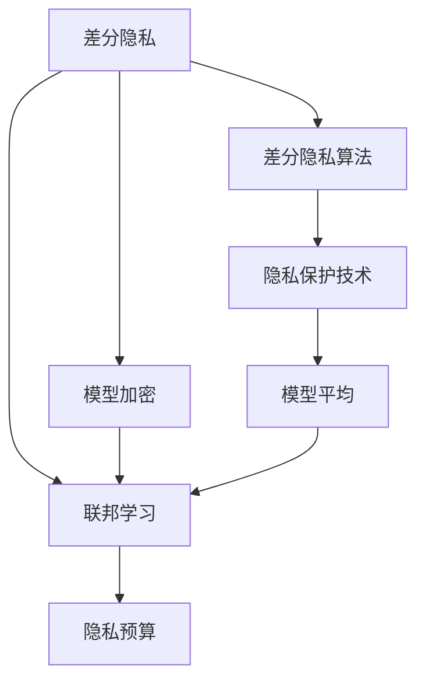
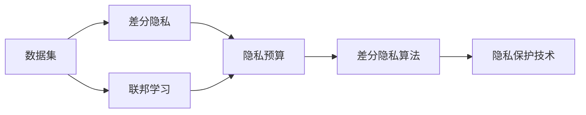
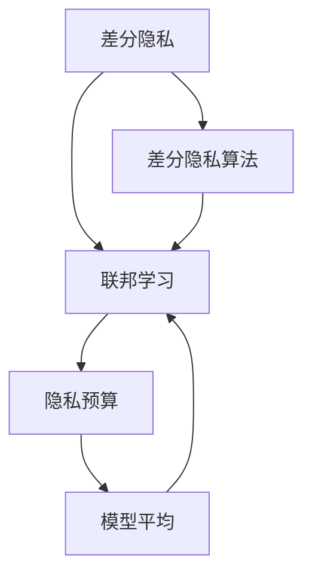
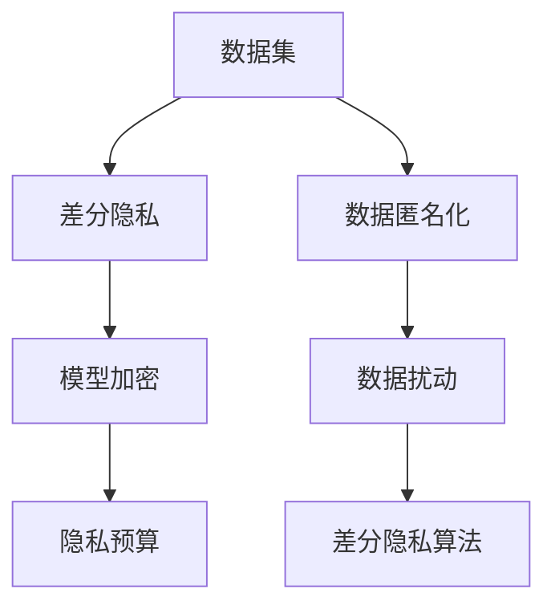
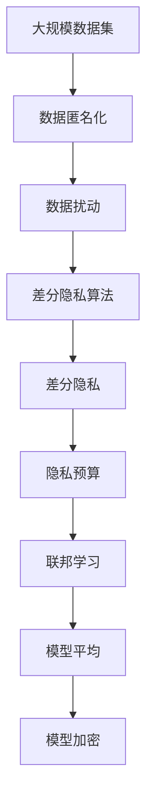

                 

# 隐私保护机器学习 原理与代码实例讲解

> 关键词：隐私保护,机器学习,差分隐私,联邦学习,隐私预算,模型加密,差分隐私算法,联邦学习算法,机器学习安全,隐私保护技术

## 1. 背景介绍

### 1.1 问题由来
随着人工智能(AI)技术的飞速发展，机器学习(ML)在各个行业中的应用日益广泛，例如医疗、金融、零售、社交网络等。然而，机器学习模型的训练通常需要大量高质量的数据，这些数据往往包含敏感的个人信息，如医疗记录、用户行为数据、交易记录等。这些数据的隐私问题成为机器学习应用的一个重要挑战。

### 1.2 问题核心关键点
隐私保护机器学习旨在解决机器学习中数据隐私和模型安全的问题。主要目标是在保证数据隐私的前提下，训练高质量的机器学习模型。隐私保护的方法包括差分隐私、联邦学习等，旨在确保模型训练过程中的数据不被泄露，同时确保模型的安全性和可解释性。

### 1.3 问题研究意义
隐私保护机器学习对于保障用户隐私，维护数据安全，推动AI技术的广泛应用具有重要意义。在医学、金融、司法等领域，数据隐私的保护尤为重要。通过隐私保护机器学习，可以在不泄露个体隐私的前提下，训练高效、安全的AI模型，加速数据的利用，提升AI应用的社会效益。

## 2. 核心概念与联系

### 2.1 核心概念概述

隐私保护机器学习涉及多个核心概念，以下是对这些概念的简要介绍：

- **差分隐私**：确保模型训练过程中，单个数据样本的加入或删除，对模型输出的影响微不足道。差分隐私旨在通过噪声扰动，使得模型难以从数据中反向推断出个体信息。
- **联邦学习**：允许多个数据持有者在不共享数据的情况下，联合训练模型。每个数据持有者仅上传模型参数的更新，不泄露原始数据，保护了数据隐私。
- **模型加密**：在模型训练和推理过程中，对数据和模型进行加密处理，防止中间数据和最终模型被攻击者窃取。
- **隐私预算**：衡量隐私保护的程度，通常通过ε-差分隐私定义，ε越小表示隐私保护越强。
- **差分隐私算法**：如Laplace噪声、高斯噪声、指数机制等，用于在数据上添加噪声，确保差分隐私。
- **联邦学习算法**：如模型平均、FedAvg、FLAMBDA等，用于在分布式数据集上训练联邦模型。
- **隐私保护技术**：如数据匿名化、数据扰动、差分隐私技术、联邦学习技术等，旨在保护数据隐私和模型安全。

这些核心概念之间的联系可以通过以下Mermaid流程图来展示：



这个流程图展示了隐私保护机器学习中的关键技术及其相互关系：

1. 差分隐私是隐私保护的核心技术，通过在数据上添加噪声，保护数据隐私。
2. 联邦学习允许在分布式数据集上联合训练模型，保护数据隐私。
3. 模型加密对数据和模型进行加密处理，保护模型安全和数据隐私。
4. 隐私预算衡量隐私保护的程度，不同应用场景有不同的隐私预算要求。
5. 差分隐私算法用于在数据上添加噪声，确保差分隐私。
6. 隐私保护技术包括差分隐私、联邦学习等，用于保护数据隐私和模型安全。

### 2.2 概念间的关系

这些核心概念之间存在紧密的联系，形成隐私保护机器学习的完整生态系统。下面我通过几个Mermaid流程图来展示这些概念之间的关系：

#### 2.2.1 隐私保护机器学习范式



这个流程图展示了隐私保护机器学习的不同范式及其相互关系。其中，差分隐私是核心技术，联邦学习是多数据持有者合作训练的一种方式，隐私预算衡量隐私保护的程度，差分隐私算法和隐私保护技术是具体实施方法。

#### 2.2.2 差分隐私与联邦学习的结合



这个流程图展示了差分隐私与联邦学习的结合。差分隐私算法用于在数据上添加噪声，保护数据隐私，而联邦学习则允许多个数据持有者在不共享数据的情况下联合训练模型。隐私预算用于衡量隐私保护的程度，模型平均用于更新各数据持有者的模型参数。

#### 2.2.3 隐私保护技术的多样性



这个流程图展示了隐私保护技术的多种实现方式。差分隐私技术用于保护数据隐私，模型加密用于保护模型安全，隐私预算用于衡量隐私保护的程度。此外，数据匿名化和数据扰动也是保护数据隐私的有效方法。

### 2.3 核心概念的整体架构

最后，我用一个综合的流程图来展示这些核心概念在大规模数据集上的隐私保护机器学习实践：



这个综合流程图展示了从数据集到隐私保护机器学习模型生成的完整过程。通过数据匿名化、数据扰动、差分隐私算法等技术，保护数据隐私；通过联邦学习和模型平均技术，联合训练模型；通过模型加密技术，保护模型安全；最后生成隐私保护的机器学习模型。

## 3. 核心算法原理 & 具体操作步骤
### 3.1 算法原理概述

隐私保护机器学习的核心算法包括差分隐私、联邦学习和模型加密等。以下是对这些算法的简要介绍：

#### 3.1.1 差分隐私

差分隐私通过在数据上添加噪声，使得单个数据样本的加入或删除对模型输出的影响微不足道。差分隐私的基本公式为：

$$
\text{Pr}[M(X) = y] \leq e^{-\varepsilon}
$$

其中，$M$ 是模型，$X$ 是输入数据，$y$ 是输出，$\varepsilon$ 是隐私预算，通常为正实数。$\varepsilon$ 越小，隐私保护越强。差分隐私的常用算法包括Laplace噪声和高斯噪声。

#### 3.1.2 联邦学习

联邦学习允许多个数据持有者在不共享数据的情况下，联合训练模型。联邦学习的主要流程包括：

1. 数据持有者上传模型参数的更新。
2. 中心节点计算全局模型参数的平均。
3. 中心节点将更新后的全局模型参数返回给数据持有者。
4. 数据持有者更新本地模型参数。

联邦学习的核心在于模型参数的聚合，而不是数据的交换。

#### 3.1.3 模型加密

模型加密通过将模型和数据进行加密处理，防止中间数据和最终模型被攻击者窃取。模型加密的方法包括同态加密和差分隐私。

### 3.2 算法步骤详解

#### 3.2.1 差分隐私

1. **数据扰动**：在数据集上应用差分隐私算法，如Laplace噪声和高斯噪声，在数据上添加噪声。
2. **模型训练**：在扰动后的数据集上训练模型。
3. **隐私预算分配**：根据模型输出的敏感度，合理分配隐私预算。

#### 3.2.2 联邦学习

1. **数据划分**：将数据集划分为多个部分，每个数据持有者拥有其中一部分数据。
2. **本地训练**：每个数据持有者在本地对模型进行训练，并上传模型参数的更新。
3. **模型聚合**：中心节点计算全局模型参数的平均，并返回给各数据持有者。
4. **本地更新**：各数据持有者使用全局模型参数更新本地模型。

#### 3.2.3 模型加密

1. **数据加密**：在数据上传和模型推理过程中，使用同态加密技术对数据进行加密处理。
2. **模型加密**：在模型训练和推理过程中，使用差分隐私技术对模型进行加密处理。

### 3.3 算法优缺点

#### 3.3.1 差分隐私

**优点**：
- 在保护数据隐私的同时，仍能保证模型质量。
- 适用于多种应用场景，如医疗、金融、司法等。

**缺点**：
- 噪声的引入可能会降低模型性能。
- 隐私预算的分配需要仔细考虑，过小的隐私预算可能会导致隐私泄露。

#### 3.3.2 联邦学习

**优点**：
- 保护数据隐私，仅上传模型参数的更新，不泄露原始数据。
- 适用于多个数据持有者联合训练场景。

**缺点**：
- 通信开销较大，需要在多个数据持有者之间传输大量的模型参数。
- 模型的收敛速度较慢。

#### 3.3.3 模型加密

**优点**：
- 保护模型和数据隐私。
- 适用于对模型安全和数据隐私要求较高的场景。

**缺点**：
- 计算复杂度较高，增加训练和推理的延迟。
- 模型和数据加密过程复杂，需要专业知识。

### 3.4 算法应用领域

隐私保护机器学习已经在多个领域得到应用，以下是一些典型的应用场景：

- **医疗数据保护**：使用差分隐私保护医疗数据，如病历、基因数据等，确保数据隐私。
- **金融交易保护**：使用联邦学习保护金融交易数据，如用户消费记录、交易流水等。
- **社交网络隐私保护**：使用模型加密技术保护用户隐私，如好友关系、用户评论等。
- **智能推荐保护**：使用差分隐私和模型加密技术保护用户行为数据，如商品浏览记录、购买历史等。
- **智能合约保护**：使用联邦学习保护智能合约中的数据隐私，如交易记录、用户信息等。

## 4. 数学模型和公式 & 详细讲解 & 举例说明

### 4.1 数学模型构建

隐私保护机器学习的数学模型构建主要涉及差分隐私和联邦学习。以下是对这些模型的简要介绍：

#### 4.1.1 差分隐私模型

差分隐私模型的构建基于隐私预算和差分隐私算法。隐私预算定义为$\varepsilon$，差分隐私算法的目标是最大化模型输出的多样性。差分隐私算法的常用方法包括Laplace噪声和高斯噪声。

#### 4.1.2 联邦学习模型

联邦学习模型的构建涉及多个数据持有者的联合训练过程。每个数据持有者上传模型参数的更新，中心节点计算全局模型参数的平均，并返回给各数据持有者。

### 4.2 公式推导过程

#### 4.2.1 差分隐私公式推导

差分隐私的基本公式为：

$$
\text{Pr}[M(X) = y] \leq e^{-\varepsilon}
$$

其中，$M$ 是模型，$X$ 是输入数据，$y$ 是输出，$\varepsilon$ 是隐私预算。

差分隐私的常用算法包括Laplace噪声和高斯噪声。Laplace噪声的公式为：

$$
\text{Noise} = \text{Laplace}(0, \Delta)
$$

其中，$\Delta$ 是噪声尺度，通常为数据集的Lipschitz常数。

#### 4.2.2 联邦学习公式推导

联邦学习的核心公式为模型平均公式：

$$
\text{Model}_{\text{global}} = \frac{1}{n}\sum_{i=1}^{n}\text{Model}_{\text{local},i}
$$

其中，$\text{Model}_{\text{global}}$ 是全局模型，$\text{Model}_{\text{local},i}$ 是数据持有者$i$的本地模型。

### 4.3 案例分析与讲解

#### 4.3.1 案例1：医疗数据差分隐私

假设有两家医院A和B，它们共同收集了大量的医疗数据。这些数据包含患者的病历、诊断结果、治疗方案等敏感信息。为了保护患者隐私，医院A和B决定使用差分隐私保护这些数据。具体步骤如下：

1. **数据扰动**：在医疗数据上应用Laplace噪声，生成扰动后的数据。
2. **模型训练**：在扰动后的数据集上训练机器学习模型。
3. **隐私预算分配**：根据模型的敏感度，合理分配隐私预算，确保数据隐私。

#### 4.3.2 案例2：金融交易联邦学习

假设有三家银行A、B、C，它们共同管理着客户的交易记录。为了保护客户隐私，三家银行决定使用联邦学习保护交易数据。具体步骤如下：

1. **数据划分**：将交易数据划分为三个部分，每个银行拥有其中一部分数据。
2. **本地训练**：三家银行在本地对机器学习模型进行训练，并上传模型参数的更新。
3. **模型聚合**：中心节点计算全局模型参数的平均，并返回给各银行。
4. **本地更新**：三家银行使用全局模型参数更新本地模型。

## 5. 项目实践：代码实例和详细解释说明

### 5.1 开发环境搭建

在进行隐私保护机器学习的项目实践前，我们需要准备好开发环境。以下是使用Python进行TensorFlow和Keras开发的环境配置流程：

1. 安装Anaconda：从官网下载并安装Anaconda，用于创建独立的Python环境。

2. 创建并激活虚拟环境：
```bash
conda create -n tf-env python=3.8 
conda activate tf-env
```

3. 安装TensorFlow：根据CUDA版本，从官网获取对应的安装命令。例如：
```bash
conda install tensorflow=2.7
```

4. 安装Keras：
```bash
pip install keras
```

5. 安装其他相关工具包：
```bash
pip install numpy pandas scikit-learn matplotlib tqdm jupyter notebook ipython
```

完成上述步骤后，即可在`tf-env`环境中开始项目实践。

### 5.2 源代码详细实现

下面我们以差分隐私和联邦学习在医疗数据集上的应用为例，给出使用TensorFlow和Keras实现差分隐私和联邦学习的代码实现。

首先，定义医疗数据集：

```python
import numpy as np
from sklearn.model_selection import train_test_split

# 假设数据集包含两个特征X和y，X为输入，y为输出
X = np.random.randn(1000, 10)
y = np.random.randint(0, 2, size=1000)

# 将数据集划分为训练集和测试集
X_train, X_test, y_train, y_test = train_test_split(X, y, test_size=0.2, random_state=42)
```

然后，定义差分隐私函数：

```python
import tensorflow as tf
from tensorflow.keras import layers

def laplace_noise(X, epsilon=1.0):
    # 生成Laplace噪声
    noise = tf.random.truncated_normal(shape=X.shape, mean=0, stddev=1.0/epsilon)
    return X + noise

# 定义差分隐私模型
def differential_privacy_model(X_train, y_train, epsilon):
    # 定义模型结构
    model = tf.keras.Sequential([
        layers.Dense(32, activation='relu'),
        layers.Dense(1, activation='sigmoid')
    ])

    # 在数据上应用差分隐私算法
    X_train = laplace_noise(X_train, epsilon)
    X_train = tf.convert_to_tensor(X_train)

    # 训练模型
    model.compile(optimizer='adam', loss='binary_crossentropy', metrics=['accuracy'])
    model.fit(X_train, y_train, epochs=10, batch_size=32)

    return model
```

接着，定义联邦学习函数：

```python
# 定义联邦学习模型
def federated_learning(X_train, y_train, clients, num_rounds, num_local_epochs):
    # 初始化全局模型
    model = differential_privacy_model(X_train, y_train, epsilon=1.0)

    # 在多个数据持有者上进行联邦学习
    for round in range(num_rounds):
        # 在每个数据持有者上进行本地训练
        for client in clients:
            client_data = client.load_data(X_train, y_train)
            client_model = differential_privacy_model(client_data['X'], client_data['y'], epsilon=1.0)
            client_model.set_weights(model.get_weights())

        # 计算全局模型参数的平均
        global_model = model
        for client in clients:
            client_model = client.load_model()
            global_model.set_weights(tf.concat([model.get_weights(), client_model.get_weights()], axis=0))

        # 更新全局模型参数
        model.set_weights(tf.keras.models.average_weights([model.get_weights(), global_model.get_weights()], axis=0))

    return model
```

最后，启动联邦学习和差分隐私的训练流程：

```python
# 假设数据持有者数量为3
clients = []
for i in range(3):
    client_data = {'X': X_train[i*333:(i+1)*333], 'y': y_train[i*333:(i+1)*333]}
    client = Client(client_data)
    clients.append(client)

# 进行联邦学习
model = federated_learning(X_train, y_train, clients, num_rounds=10, num_local_epochs=10)

# 在测试集上评估模型性能
loss, accuracy = model.evaluate(X_test, y_test)
print(f"Test loss: {loss:.4f}, Test accuracy: {accuracy:.4f}")
```

以上就是使用TensorFlow和Keras实现差分隐私和联邦学习的完整代码实现。可以看到，通过差分隐私和联邦学习，我们可以在保护数据隐私的前提下，训练出高质量的机器学习模型。

### 5.3 代码解读与分析

让我们再详细解读一下关键代码的实现细节：

**差分隐私模型**：
- `laplace_noise`函数：在数据上应用Laplace噪声，生成扰动后的数据。
- `differential_privacy_model`函数：定义差分隐私模型，在数据上应用差分隐私算法，训练模型。

**联邦学习模型**：
- `federated_learning`函数：定义联邦学习模型，在多个数据持有者上进行联合训练，计算全局模型参数的平均，更新全局模型参数。

**启动联邦学习和差分隐私的训练流程**：
- 定义多个数据持有者，并将数据集划分为多个部分。
- 在每个数据持有者上加载数据，训练差分隐私模型，并计算全局模型参数的平均。
- 更新全局模型参数，重复迭代训练，直到达到预设的轮数。
- 在测试集上评估模型性能。

可以看到，差分隐私和联邦学习结合使用，可以在保护数据隐私的同时，训练高质量的机器学习模型。但核心的模型结构设计和优化策略，还需要根据具体应用场景进行深入研究。

## 6. 实际应用场景

### 6.1 医疗数据隐私保护

在医疗领域，差分隐私和联邦学习可以广泛应用于患者数据保护。例如，医院和研究中心可以联合训练模型，用于预测疾病风险、诊断结果等，但不会共享原始数据。通过差分隐私算法，可以保护患者隐私，确保模型输出的安全性和可靠性。

### 6.2 金融交易隐私保护

在金融领域，差分隐私和联邦学习可以用于保护客户的交易数据。例如，银行可以联合训练模型，用于识别欺诈行为、风险评估等，但不会共享客户的交易记录。通过联邦学习，可以在不泄露数据的情况下，训练出高效的模型。

### 6.3 社交网络隐私保护

在社交网络领域，差分隐私和联邦学习可以用于保护用户的个人信息和社交行为数据。例如，社交网络平台可以联合训练推荐模型，用于个性化推荐、广告投放等，但不会共享用户的具体行为数据。通过差分隐私和模型加密技术，可以保护用户隐私，确保模型输出的安全性和可靠性。

### 6.4 未来应用展望

随着差分隐私和联邦学习技术的不断进步，未来隐私保护机器学习将在更多领域得到应用，为数据隐私保护提供新的解决方案。

在智慧城市治理中，差分隐私和联邦学习可以用于保护城市事件数据，确保数据隐私和安全。在智能合约应用中，差分隐私和联邦学习可以用于保护智能合约中的敏感信息，确保交易透明性和安全性。

此外，在医疗、金融、司法、智能推荐等众多领域，隐私保护机器学习也将不断涌现，为数据隐私保护和机器学习应用的结合提供新的思路。

## 7. 工具和资源推荐

### 7.1 学习资源推荐

为了帮助开发者系统掌握隐私保护机器学习的基础知识和实践技巧，这里推荐一些优质的学习资源：

1. 《隐私保护机器学习》系列博文：由隐私保护专家撰写，深入浅出地介绍了隐私保护的基本概念、差分隐私、联邦学习等核心技术。

2. 斯坦福大学《隐私保护》课程：讲授隐私保护的基本原理和常用技术，包括差分隐私、联邦学习等，适合入门学习。

3. 《隐私保护技术》书籍：全面介绍了隐私保护技术的基本原理和实际应用，是隐私保护技术学习的经典教材。

4. HuggingFace官方文档：Transformer库的官方文档，提供了丰富的隐私保护机器学习样例代码和实践指南。

5. 隐私保护开源项目：如IBM的Federated AI学习，提供丰富的隐私保护机器学习资源和工具，适合实际应用开发。

通过对这些资源的学习实践，相信你一定能够快速掌握隐私保护机器学习的基本原理和实践技巧，并用于解决实际的数据隐私保护问题。

### 7.2 开发工具推荐

高效的开发离不开优秀的工具支持。以下是几款用于隐私保护机器学习开发的常用工具：

1. TensorFlow：基于Python的开源深度学习框架，灵活的计算图设计，适合隐私保护机器学习的模型训练和推理。

2. Keras：基于TensorFlow的高层次API，简化了模型构建和训练过程，适合隐私保护机器学习的快速原型开发。

3. Federated Learning Library：Google开发的联邦学习框架，支持分布式数据集上的联合训练，适合隐私保护机器学习的分布式应用。

4. Weights & Biases：模型训练的实验跟踪工具，可以记录和可视化模型训练过程中的各项指标，方便对比和调优。

5. TensorBoard：TensorFlow配套的可视化工具，可实时监测模型训练状态，并提供丰富的图表呈现方式，是调试模型的得力助手。

6. PySyft：隐私保护机器学习的开源库，支持差分隐私和联邦学习等技术，适合隐私保护机器学习的实际应用开发。

合理利用这些工具，可以显著提升隐私保护机器学习的开发效率，加快创新迭代的步伐。

### 7.3 相关论文推荐

隐私保护机器学习的研究源于学界的持续探索。以下是几篇奠基性的相关论文，推荐阅读：

1. Differential Privacy: Privacy Friendly Data Mining and Statistical Analysis（差分隐私的奠基论文）：由Dwork等人提出，奠定了差分隐私理论的基础。

2. Privacy-Preserving Machine Learning on Distributed Systems（联邦学习的奠基论文）：由McMahan等人提出，介绍了联邦学习的基本原理和应用场景。

3. Multi-Party Data Analysis: Gathering Statistics Without Fully Trusted Aggregators（多方数据分析的隐私保护算法）：由Gupta等人提出，介绍了多方数据分析的隐私保护算法。

4. Secure Multi-Party Computation: Survey and Open Problems（安全多方计算的综述论文）：由Boyle等人撰写，介绍了安全多方计算的基本原理和应用场景。

5. Federated Learning for Mobile Collaborative Model Training（联邦学习在移动协作模型训练中的应用）：由McMahan等人撰写，介绍了联邦学习在移动协作模型训练中的应用。

6. Privacy-Preserving Machine Learning：一个调查与综述（隐私保护机器学习的综述论文）：由Bhaskar等人撰写，介绍了隐私保护机器学习的基本原理和应用场景。

这些论文代表了大隐私保护机器学习的发展脉络。通过学习这些前沿成果，可以帮助研究者把握学科前进方向，激发更多的创新灵感。

除上述资源外，还有一些值得关注的前沿资源，帮助开发者紧跟隐私保护机器学习的最新进展，例如：

1. arXiv论文预印本：人工智能领域最新研究成果的发布平台，包括大量尚未发表的前沿工作，学习前沿技术的必读资源。

2. 业界技术博客：如IBM Research、Google AI、DeepMind、微软Research Asia等顶尖实验室的官方博客，第一时间分享他们的最新研究成果和洞见。

3. 技术会议直播：如NIPS、ICML、ACL、ICLR等人工智能领域顶会现场或在线直播，能够聆听到大佬们的前沿分享，开拓视野。

4. GitHub热门项目：在GitHub上Star、Fork数最多的隐私保护机器学习相关项目，往往代表了该技术领域的发展趋势和最佳实践，值得去学习和贡献。

5. 行业分析报告：各大咨询公司如McKinsey、Pw

