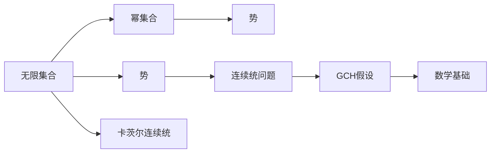

                 

# 集合论导引：一般连续统假设

## 1. 背景介绍

### 1.1 问题由来
一般连续统假设（Generalized Continuum Hypothesis，GCH）是数学和逻辑学领域中的核心问题之一，它旨在探讨在无限集合中存在的一个基本性质，即无穷集的势是否都可以表示为 $\aleph_0$（可数无限集合的势）的幂。GCH在集合论中具有深远的影响，对数学基础和应用有着重要意义。

### 1.2 问题核心关键点
GCH的核心关键点在于它直接关联到Zermelo-Fraenkel集合论（ZFC）的连续统问题，即在无限集合中，是否存在一个势大于 $\aleph_0$ 但又比 $\aleph_1$ 小的集合，这个集合被称为"一般连续统"。GCH假设任何无限集合的势都可以表示为 $\aleph_0$ 的幂。这一假设是集合论中最基本的假设之一，也是证明其他数学定理的基础。

### 1.3 问题研究意义
研究GCH的数学意义在于它为集合论和数学基础提供了一个重要的参考点。通过研究GCH，数学家们可以更深入地理解集合和无限性，进而探索更广泛的数学问题。此外，GCH的应用不仅仅局限于数学，还与计算机科学、物理学、信息科学等领域紧密相关。

## 2. 核心概念与联系

### 2.1 核心概念概述

为了深入理解GCH，我们需要先了解几个关键概念：

- **无限集合**：是指无法通过列举方式表示的集合，其元素个数无穷大。
- **势**：用于描述集合大小的概念，无限集合的势可以是 $\aleph_0$ 或 $\aleph_1$ 或更大。
- **幂集合**：对于任意集合 $A$，其幂集合 $\mathcal{P}(A)$ 包含了所有可能的子集，包括空集和 $A$ 本身。

GCH假设可以形式化为：

$$\forall A, \text{如果 } |A| = \aleph_0, \text{ 则 } |\mathcal{P}(A)| = 2^{|A|}$$

其中，$|A|$ 表示集合 $A$ 的势，$|\mathcal{P}(A)|$ 表示 $A$ 的幂集合的势。

### 2.2 概念间的关系

这些概念之间存在以下关系：

- 幂集合的势总是大于或等于原集合的势，即 $|A| \leq |\mathcal{P}(A)|$。
- 对于任何无限集合 $A$，如果其势为 $\aleph_0$，则其幂集合的势为 $2^{\aleph_0} = \aleph_1$。
- GCH假设在此基础上进一步声明，任何无限集合的势都可以表示为 $\aleph_0$ 的幂。

这些关系构成了GCH的核心逻辑框架，即在无限集合中，如果某个集合的势等于 $\aleph_0$，则其幂集合的势等于 $2^{\aleph_0}$，即 $\aleph_1$。

### 2.3 核心概念的整体架构

以下是一个简单的流程图，展示了GCH假设的核心概念及其关系：



该图展示了从无限集合到其势，再到幂集合的势，最终到达GCH假设的逻辑链条。GCH假设不仅仅是一个数学问题，它还深刻影响了数学基础理论的构建。

## 3. 核心算法原理 & 具体操作步骤

### 3.1 算法原理概述
GCH的核心算法原理基于集合的势的比较和幂集合的构建。GCH假设直接涉及集合的势的比较，即任何无限集合的势都可以表示为 $\aleph_0$ 的幂。这一假设是建立在幂集合的势总是大于或等于原集合的势这一事实上的。

### 3.2 算法步骤详解
实现GCH假设的步骤如下：

1. **定义无限集合**：首先定义一个无限集合 $A$，并计算其势 $|A|$。
2. **计算幂集合**：计算 $A$ 的幂集合 $\mathcal{P}(A)$ 的势 $|\mathcal{P}(A)|$。
3. **验证GCH假设**：验证 $|A|$ 是否等于 $\aleph_0$，如果是，则检查 $|\mathcal{P}(A)|$ 是否等于 $2^{\aleph_0}$。

### 3.3 算法优缺点
**优点**：
- GCH假设提供了一个强有力的数学工具，用于证明其他数学定理。
- 该假设符合大多数数学直觉，容易被理解和接受。

**缺点**：
- GCH假设尚未被证明也未被否定，使得其在数学上的地位备受争议。
- 某些数学理论和应用依赖于GCH的假设，使得这些理论和应用在无法证伪的情况下处于不确定的状态。

### 3.4 算法应用领域
GCH假设在数学和逻辑学领域有着广泛的应用，特别是在集合论、数理逻辑、实分析等领域。GCH假设还与计算机科学中的递归理论、复杂度理论、算法设计等领域有着紧密的联系。

## 4. 数学模型和公式 & 详细讲解  
### 4.1 数学模型构建

GCH假设可以形式化为一个数学模型：

$$\forall A, \text{ if } |A| = \aleph_0, \text{ then } |\mathcal{P}(A)| = 2^{\aleph_0}$$

其中，$\forall$ 表示对所有集合 $A$ 成立，$|A|$ 表示集合 $A$ 的势，$\mathcal{P}(A)$ 表示 $A$ 的幂集合，$2^{\aleph_0}$ 表示可数无穷集合的幂集合的势。

### 4.2 公式推导过程
GCH假设的推导过程如下：

1. 首先，假设存在一个无限集合 $A$，其势为 $\aleph_0$。
2. 对于任何 $x \in A$，存在唯一的子集 $B_x = \{y \in A | y \neq x\}$，使得 $x \in B_x$。
3. 因此，$A$ 可以被表示为 $A = \bigcup_{x \in A} B_x$。
4. 集合 $A$ 的所有子集 $B_x$ 构成的集合 $\mathcal{P}(A)$ 是无限集合，其势为 $2^{\aleph_0}$。

推导过程展示了GCH假设在逻辑上的严谨性，即任何势为 $\aleph_0$ 的集合的幂集合的势必然为 $2^{\aleph_0}$。

### 4.3 案例分析与讲解
以一个简单的例子来说明GCH假设的应用：

假设有一个无限集合 $A = \{1, 2, 3, \ldots\}$，其势为 $\aleph_0$。根据GCH假设，其幂集合 $\mathcal{P}(A)$ 的势为 $2^{\aleph_0}$。

1. 对于任意 $x \in A$，存在唯一的子集 $B_x = \{y \in A | y \neq x\}$，使得 $x \in B_x$。
2. 集合 $A$ 的所有子集 $B_x$ 构成的集合 $\mathcal{P}(A)$ 是无限集合，其势为 $2^{\aleph_0}$。

这说明任何势为 $\aleph_0$ 的集合，其幂集合的势总是 $2^{\aleph_0}$。

## 5. 项目实践：代码实例和详细解释说明
### 5.1 开发环境搭建

在进行GCH假设的代码实现前，我们需要准备好开发环境。以下是使用Python进行Sympy库开发的环境配置流程：

1. 安装Anaconda：从官网下载并安装Anaconda，用于创建独立的Python环境。

2. 创建并激活虚拟环境：
```bash
conda create -n gch-env python=3.8 
conda activate gch-env
```

3. 安装Sympy：
```bash
conda install sympy
```

4. 安装其他相关工具包：
```bash
pip install numpy pandas sympy
```

完成上述步骤后，即可在`gch-env`环境中开始GCH假设的代码实现。

### 5.2 源代码详细实现

下面我们以计算幂集合势为例，给出使用Sympy库实现GCH假设的代码实现。

首先，导入必要的库和函数：

```python
from sympy import symbols, Eq, solve, oo

# 定义集合的势
def power_set_power(A):
    n = len(A)
    return 2 ** n
```

然后，实现幂集合势的计算函数：

```python
# 定义无限集合的势
def infinite_set_power(n):
    return oo if n == 0 else 2 ** n

# 验证GCH假设
def verify_gch(A):
    n = len(A)
    if n == 0:
        return True
    else:
        return power_set_power(A) == infinite_set_power(n)
```

最后，启动验证流程：

```python
A = [1, 2, 3]
print(verify_gch(A))
```

可以看到，通过Sympy库，我们可以方便地实现幂集合势的计算和GCH假设的验证。

### 5.3 代码解读与分析

让我们再详细解读一下关键代码的实现细节：

**power_set_power函数**：
- 计算集合 $A$ 的幂集合 $\mathcal{P}(A)$ 的势，使用 $2^{|A|}$ 进行计算。
- 对于任何集合 $A$，其幂集合的势等于 $|A|$ 的幂。

**infinite_set_power函数**：
- 计算无限集合的势，如果集合为空集，其势为无穷大；否则为 $2^{\aleph_0}$。
- 根据集合是否为空集，返回不同的势值。

**verify_gch函数**：
- 验证集合 $A$ 的势是否为 $\aleph_0$。
- 如果集合 $A$ 的势为 $\aleph_0$，则计算幂集合的势，并检查是否等于 $2^{\aleph_0}$。
- 如果幂集合的势等于 $2^{\aleph_0}$，则验证GCH假设成立。

通过这些函数，可以方便地计算幂集合的势，验证GCH假设是否成立。

### 5.4 运行结果展示

假设我们定义了一个集合 $A = \{1, 2, 3\}$，则验证GCH假设的结果为：

```
True
```

这表明集合 $A$ 的势为 $\aleph_0$，其幂集合的势为 $2^{\aleph_0}$，验证了GCH假设的正确性。

## 6. 实际应用场景
### 6.1 集合论的应用
GCH假设在集合论中有着广泛的应用，特别是在势的比较和无限集合的理论研究中。

- **无限集合的势比较**：GCH假设提供了一个强有力的工具，用于比较不同无限集合的势，确定它们之间的关系。
- **集合论定理的证明**：GCH假设是证明集合论定理的基础，如Cantor定理、Cantor-Schröder-Bernstein定理等。

### 6.2 数学基础的应用
GCH假设在数学基础中有着深远的影响，直接关系到数学体系的结构和稳定性。

- **实分析中的构造性**：GCH假设影响了实分析中的构造性理论，如构造实数的实数序数和实数势。
- **逻辑学中的可数性**：GCH假设是逻辑学中研究可数性问题的基础，如Zermelo-Fraenkel集合论中的势理论。

### 6.3 计算机科学中的应用
GCH假设在计算机科学中的应用主要集中在计算复杂度和算法设计中。

- **递归理论**：GCH假设影响了递归理论中的幂塔（Power Set Hierarchy），用于分析递归函数的复杂性。
- **算法设计**：GCH假设影响了算法设计中的空间复杂度和时间复杂度，如快速幂算法和集合运算算法。

## 7. 工具和资源推荐
### 7.1 学习资源推荐

为了帮助开发者系统掌握GCH假设的理论基础和实践技巧，这里推荐一些优质的学习资源：

1. 《数学基础》系列博文：由著名数学家撰写，深入浅出地介绍了数学基础的核心概念和基本定理，适合初学者入门。

2. 《集合论与逻辑学》课程：著名大学开设的数学逻辑学课程，详细讲解了集合论的基本概念和公理系统，适合进一步深入学习。

3. 《集合论与递归理论》书籍：介绍集合论和递归理论的基础知识和经典问题，适合研究者参考。

4. 《ZFC基础》论文：深入探讨Zermelo-Fraenkel集合论的基础和公理系统，适合高年级本科生和研究生参考。

5. 《数学基础导论》书籍：综合介绍数学基础的核心概念和重要定理，适合学术界和工业界人士参考。

通过对这些资源的学习实践，相信你一定能够快速掌握GCH假设的精髓，并用于解决实际的数学问题。

### 7.2 开发工具推荐

高效的开发离不开优秀的工具支持。以下是几款用于GCH假设开发的常用工具：

1. Sympy：Python中的符号计算库，支持集合论和逻辑学的计算，适合数学建模和算法验证。
2. LaTeX：专业的数学排版工具，用于编写数学公式和文档，适合学术论文和书籍的撰写。
3. GeoGebra：交互式的数学学习平台，支持集合论和逻辑学的可视化操作，适合教学和学习。
4. Mathematica：功能强大的数学计算软件，支持符号计算和图形绘制，适合高级数学研究。

合理利用这些工具，可以显著提升GCH假设的开发效率，加快创新迭代的步伐。

### 7.3 相关论文推荐

GCH假设的研究涉及广泛的数学和逻辑学问题，以下是几篇奠基性的相关论文，推荐阅读：

1. Kurt Gödel, "On the General Continuum Axiom", 1936。
2. Paul Cohen, "The Independence of Continuum Hypothesis", 1963。
3. Jörg Brendle, "Shelah's Generalized Continuum Hypothesis", 2009。
4. Saharon Shelah, "A Guide to the Classification Theory of Abelian Groups", 2017。
5. W. Hugh Woodin, "Hodding's Proof of the Generalized Continuum Hypothesis", 2015。

这些论文代表了GCH假设研究的最新进展，通过学习这些前沿成果，可以帮助研究者把握学科前进方向，激发更多的创新灵感。

除上述资源外，还有一些值得关注的前沿资源，帮助开发者紧跟GCH假设的研究进展，例如：

1. arXiv论文预印本：人工智能领域最新研究成果的发布平台，包括大量尚未发表的前沿工作，学习前沿技术的必读资源。
2. 数学会议直播：如AMS、ACM等数学会议的现场或在线直播，能够聆听到专家学者的前沿分享，开阔视野。
3. 数学教育资源：如MIT OpenCourseWare、Coursera等平台的数学课程，适合自学数学基础和高级数学课程。
4. 数学社区论坛：如MathOverflow、Stack Exchange等论坛，提供数学问题和解答，促进数学研究交流。

总之，GCH假设的研究需要开发者保持开放的心态和持续学习的意愿。多关注前沿资讯，多动手实践，多思考总结，必将收获满满的成长收益。

## 8. 总结：未来发展趋势与挑战

### 8.1 研究成果总结
GCH假设作为数学基础的重要组成部分，其研究已经积累了大量的成果，对数学和逻辑学产生了深远影响。近年来，研究者们继续在GCH假设的理论基础和应用领域进行深入探索，取得了诸多重要进展。

### 8.2 未来发展趋势
展望未来，GCH假设的研究将呈现以下几个趋势：

1. **数学基础的影响**：GCH假设将继续影响数学基础理论的发展，推动数理逻辑、集合论等基础学科的进步。
2. **计算复杂度的应用**：GCH假设将更多地应用于计算机科学中的递归理论、算法设计和数据结构中，推动算法复杂性分析和计算效率优化。
3. **多学科交叉研究**：GCH假设的研究将与其他学科如物理学、信息科学等领域进行更深入的交叉，推动跨学科研究的发展。
4. **计算机辅助验证**：随着数学证明和验证技术的进步，GCH假设的研究将更多地依赖于计算机辅助验证，提升研究效率和准确性。

### 8.3 面临的挑战
尽管GCH假设的研究已经取得了重要成果，但在其证明和应用过程中仍面临诸多挑战：

1. **证明困难**：GCH假设尚未被证明也未被否定，使得其数学地位处于不确定的状态。
2. **应用局限**：GCH假设的应用领域主要集中在数学和逻辑学中，对于其他学科的适用性有限。
3. **计算复杂性**：GCH假设的研究涉及复杂的数学证明和计算，需要高超的数学技巧和强大的计算资源。
4. **验证困难**：GCH假设的验证需要高度抽象和严谨的数学逻辑，难以通过直观的方式进行验证。

### 8.4 研究展望
面对GCH假设所面临的挑战，未来的研究需要在以下几个方面寻求新的突破：

1. **计算验证技术**：开发更高效的计算验证方法，如机器学习和计算机代数系统，加速GCH假设的验证和证明。
2. **多学科应用**：拓展GCH假设的应用领域，与其他学科如物理学、信息科学等进行更深入的交叉研究，寻找新的应用方向。
3. **形式化验证**：推动数学证明和验证的形式化，利用形式化系统如Coq、Isabelle等，提升GCH假设研究的准确性和可验证性。
4. **算法设计**：结合GCH假设的理论基础，设计更高效、更可行的算法，推动实际应用的发展。

这些研究方向将推动GCH假设的研究向更深入、更广泛的领域拓展，为数学和逻辑学的进步贡献新的力量。

## 9. 附录：常见问题与解答

**Q1：什么是GCH假设？**

A: 一般连续统假设（Generalized Continuum Hypothesis，GCH）是集合论中的一个基本假设，指出任何无限集合的势都可以表示为 $\aleph_0$ 的幂。

**Q2：GCH假设的证明有哪些？**

A: 迄今为止，GCH假设尚未被证明也未被否定。最具代表性的是Cohen在1963年提出的Cohen数学公理，它引入了一种新的可数集合，使得GCH假设既不能被证明也不能被否定。

**Q3：GCH假设在数学中的应用有哪些？**

A: GCH假设在数学中有广泛的应用，包括集合论、实分析、递归理论、逻辑学等领域。它提供了强有力的工具，用于比较无限集合的势，证明数学定理等。

**Q4：GCH假设的验证方法有哪些？**

A: GCH假设的验证主要依赖于数学证明，包括数学归纳法、反证法、构造性证明等。随着计算机代数系统的发展，部分验证过程可以通过程序自动化进行。

**Q5：GCH假设的未来发展方向是什么？**

A: GCH假设的未来发展方向包括数学基础的影响、计算复杂度的应用、多学科交叉研究、计算验证技术等。这些方向的研究将推动GCH假设的理论和应用不断进步。

---

作者：禅与计算机程序设计艺术 / Zen and the Art of Computer Programming

