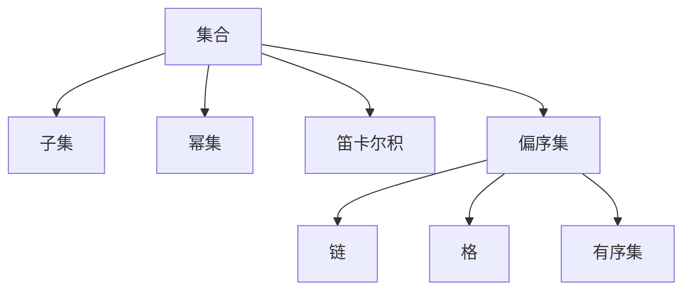
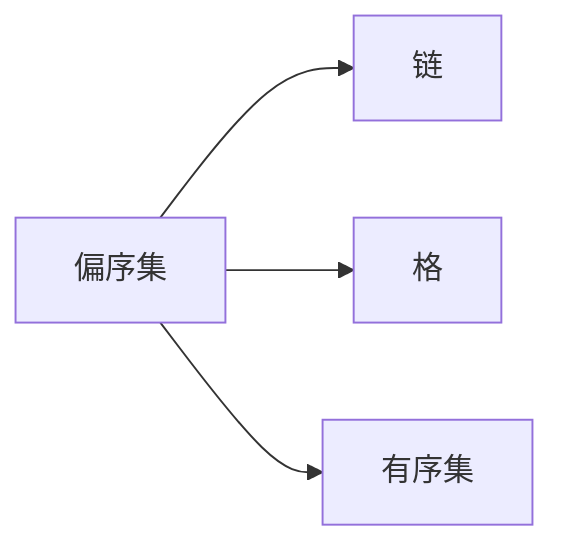
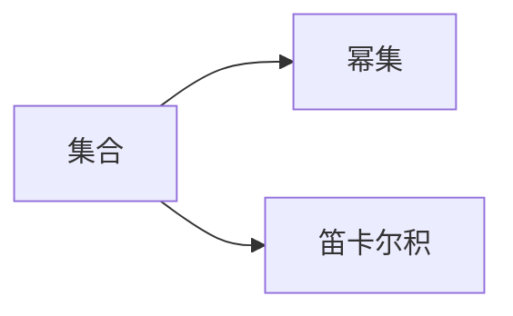
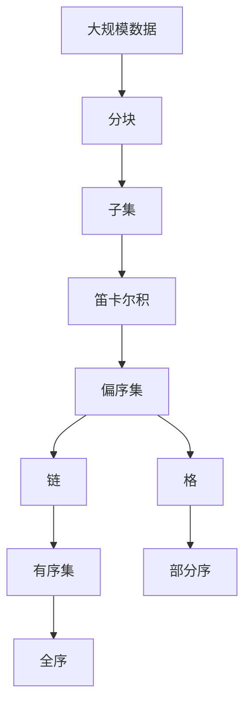

                 

# 集合论导引：乘积偏序集

> 关键词：集合论, 偏序集, 乘积偏序集, 集合映射, 偏序关系, 部分序

## 1. 背景介绍

### 1.1 问题由来
集合论作为数学基础学科，是计算机科学和逻辑学的重要工具之一。在计算机科学中，集合论被广泛应用于数据结构、算法设计、逻辑推理等领域。特别地，乘积偏序集在集合论中具有重要地位，可用于刻画各种关系系统，如代数系统、关系数据库、语义网等。本文将通过逐步导引的方式，从基础概念入手，探讨乘积偏序集的定义、性质及其应用。

### 1.2 问题核心关键点
1. **集合论基础**：掌握集合、子集、基数等基础概念，理解集合的幂集、笛卡尔积等运算。
2. **偏序集理论**：了解偏序集的定义、性质以及常见例子，如链、格、有序集等。
3. **乘积偏序集**：理解乘积偏序集的定义和结构，掌握其性质和应用。
4. **集合映射与偏序关系**：掌握集合之间的映射、偏序关系及其性质，学会如何在乘积偏序集中使用。
5. **部分序与全序**：理解部分序与全序的概念及其在乘积偏序集中的应用。

### 1.3 问题研究意义
掌握乘积偏序集的理论和应用，对于深入理解各种关系系统、提高算法设计效率、推进人工智能和数据科学的发展具有重要意义。乘积偏序集的应用范围广泛，如数据库查询优化、逻辑推理、信息检索等，能够提供高效的数学工具和理论基础。

## 2. 核心概念与联系

### 2.1 核心概念概述

为了更好地理解乘积偏序集，我们将首先介绍几个关键概念：

- **集合**：由一定数量的元素构成的整体，其中的元素称为该集合的成员。
- **子集**：某个集合中的一部分元素，如果所有这些元素都属于原始集合，那么这个部分集合称为原始集合的子集。
- **基数**：集合中元素的个数，可以用自然数来表示。
- **幂集**：由一个集合的子集构成的集合，幂集中的元素称为该集合的子集。
- **笛卡尔积**：由两个或多个集合中元素按照一定规则组合成的集合，表示为 $A \times B$。
- **偏序集**：由具有偏序关系的元素构成的集合，偏序关系是一种特殊的有序关系，表示集合中任意两个元素都存在大于或等于小于的关系。
- **链**：一个偏序集，如果其元素之间存在完全的序关系，即任意两个元素之间的偏序关系明确，则称其为链。
- **格**：一个偏序集，如果其任意两个元素的上确界和下确界都存在，则称其为格。
- **有序集**：一个偏序集，如果其元素之间存在严格的上界和下界，则称其为有序集。

这些概念通过偏序集来联系，构成了一个基本的数学框架。下面我们将使用Mermaid流程图展示这些概念之间的关系：



### 2.2 概念间的关系

这些核心概念之间存在着紧密的联系，形成了一个完整的数学结构。下面我们通过几个Mermaid流程图来展示这些概念之间的关系。

#### 2.2.1 集合和偏序集的关系


这表示任何集合都可以通过引入偏序关系来构成一个偏序集。

#### 2.2.2 偏序集的基本性质



这表示偏序集可以进一步细分为链、格和有序集等不同类型。

#### 2.2.3 幂集和笛卡尔积的应用



这表示集合的幂集和笛卡尔积是偏序集中常见的操作。

### 2.3 核心概念的整体架构

最后，我们用一个综合的流程图来展示这些核心概念在大规模数据处理中的整体架构：



这个综合流程图展示了大规模数据处理的数学模型，从数据分块到子集运算，再到笛卡尔积和偏序集的构建，最后细分为链、格、有序集等不同类型，以及部分序和全序的关系。通过这些数学工具，我们可以更好地处理和分析大规模数据。

## 3. 核心算法原理 & 具体操作步骤
### 3.1 算法原理概述

乘积偏序集的形成基于集合的笛卡尔积和偏序关系。其核心思想是将多个有序集合通过笛卡尔积连接起来，然后定义集合中元素的偏序关系，使得整个乘积集也成为一个偏序集。

形式化地，设 $A$ 和 $B$ 是两个偏序集，它们的笛卡尔积 $A \times B$ 也是一个偏序集。具体定义如下：

1. 对于 $a \in A$ 和 $b \in B$，定义 $(a,b) \leq (a',b')$ 当且仅当 $a \leq a'$ 或 $a = a'$ 且 $b \leq b'$。
2. 对于 $a \in A$ 和 $b \in B$，定义 $(a,b) \geq (a',b')$ 当且仅当 $a \geq a'$ 或 $a = a'$ 且 $b \geq b'$。
3. 对于 $a \in A$ 和 $b \in B$，定义 $(a,b) < (a',b')$ 当且仅当 $a < a'$ 或 $a = a'$ 且 $b < b'$。
4. 对于 $a \in A$ 和 $b \in B$，定义 $(a,b) > (a',b')$ 当且仅当 $a > a'$ 或 $a = a'$ 且 $b > b'$。

### 3.2 算法步骤详解

下面是构建乘积偏序集的具体步骤：

1. **选择有序集合**：选择若干个有序集合 $A_1, A_2, ..., A_n$。
2. **构建笛卡尔积**：计算这些有序集合的笛卡尔积 $A_1 \times A_2 \times ... \times A_n$。
3. **定义偏序关系**：在笛卡尔积 $A_1 \times A_2 \times ... \times A_n$ 中定义偏序关系，按照上述定义方法，根据 $A_i$ 中的偏序关系，确定 $(a_1, a_2, ..., a_n)$ 和 $(a'_1, a'_2, ..., a'_n)$ 之间的偏序关系。
4. **验证乘积偏序集**：验证笛卡尔积 $A_1 \times A_2 \times ... \times A_n$ 是否满足偏序集的定义，即是否对于任意的 $a, b, a', b'$，有 $(a, b) \leq (a', b')$ 或 $(a, b) > (a', b')$。

### 3.3 算法优缺点

乘积偏序集有以下优点：

1. **灵活性高**：可以根据具体问题，自由选择有序集合，并定义合适的偏序关系，适应性强。
2. **结构清晰**：乘积偏序集的结构清晰，易于理解和分析。
3. **应用广泛**：乘积偏序集在数据库、算法设计、逻辑推理等领域有广泛应用，可以处理各种复杂的关系系统。

但同时它也有以下缺点：

1. **复杂度高**：构建乘积偏序集需要处理大量数据，且定义偏序关系可能较为复杂。
2. **资源消耗大**：存储和处理乘积偏序集需要大量的内存和计算资源，可能不适合大规模数据集。
3. **难以优化**：乘积偏序集中的操作复杂，难以进行高效的优化和并行处理。

### 3.4 算法应用领域

乘积偏序集在以下领域有广泛应用：

1. **数据库系统**：在关系型数据库中，可以用乘积偏序集来表示数据表之间的多对多关系。
2. **算法设计**：在图论、搜索算法、优化问题等领域，乘积偏序集可以作为基础数据结构，用于建模和求解。
3. **逻辑推理**：在自然语言推理、知识图谱等领域，乘积偏序集可以用来表示逻辑关系，进行推理和验证。
4. **信息检索**：在搜索引擎、信息检索系统等领域，乘积偏序集可以用来构建语义空间，提高检索效率。

## 4. 数学模型和公式 & 详细讲解  
### 4.1 数学模型构建

设 $A$ 和 $B$ 是两个偏序集，它们的笛卡尔积 $A \times B$ 也可以构成一个偏序集。下面给出具体的数学模型构建步骤：

1. 定义 $A \times B$ 中的元素 $(a, b)$ 和 $(a', b')$ 的偏序关系为：
   $$
   (a, b) \leq (a', b') \Leftrightarrow (a \leq a' \text{ 或 } a = a' \text{ 且 } b \leq b') \text{ 或 } (a' \leq a \text{ 或 } a' = a \text{ 且 } b' \leq b)
   $$

2. 定义 $A \times B$ 中的元素 $(a, b)$ 和 $(a', b')$ 的严格偏序关系为：
   $$
   (a, b) < (a', b') \Leftrightarrow (a < a' \text{ 或 } a = a' \text{ 且 } b < b') \text{ 或 } (a' < a \text{ 或 } a' = a \text{ 且 } b' < b)
   $$

3. 定义 $A \times B$ 中的元素 $(a, b)$ 和 $(a', b')$ 的等价关系为：
   $$
   (a, b) \sim (a', b') \Leftrightarrow (a = a' \text{ 且 } b = b')
   $$

### 4.2 公式推导过程

以链和格为例，给出具体的公式推导过程：

1. **链的乘积**：设 $A$ 和 $B$ 是两个链，它们的乘积 $A \times B$ 也是一个链。假设 $A = \{a_1, a_2, ..., a_n\}$ 和 $B = \{b_1, b_2, ..., b_m\}$，则 $A \times B = \{(a_i, b_j) | 1 \leq i \leq n, 1 \leq j \leq m\}$。
   $$
   (a_i, b_j) \leq (a_{i'}, b_{j'}) \Leftrightarrow (a_i \leq a_{i'} \text{ 或 } a_i = a_{i'} \text{ 且 } b_j \leq b_{j'}) \text{ 或 } (a_{i'} \leq a_i \text{ 或 } a_{i'} = a_i \text{ 且 } b_{j'} \leq b_j)
   $$
   $$
   (a_i, b_j) < (a_{i'}, b_{j'}) \Leftrightarrow (a_i < a_{i'} \text{ 或 } a_i = a_{i'} \text{ 且 } b_j < b_{j'}) \text{ 或 } (a_{i'} < a_i \text{ 或 } a_{i'} = a_i \text{ 且 } b_{j'} < b_j)
   $$

2. **格的乘积**：设 $A$ 和 $B$ 是两个格，它们的乘积 $A \times B$ 也是一个格。假设 $A = \{a_1, a_2, ..., a_n\}$ 和 $B = \{b_1, b_2, ..., b_m\}$，则 $A \times B = \{(a_i, b_j) | 1 \leq i \leq n, 1 \leq j \leq m\}$。
   $$
   (a_i, b_j) \leq (a_{i'}, b_{j'}) \Leftrightarrow (a_i \leq a_{i'} \text{ 或 } a_i = a_{i'} \text{ 且 } b_j \leq b_{j'}) \text{ 或 } (a_{i'} \leq a_i \text{ 或 } a_{i'} = a_i \text{ 且 } b_{j'} \leq b_j)
   $$
   $$
   (a_i, b_j) < (a_{i'}, b_{j'}) \Leftrightarrow (a_i < a_{i'} \text{ 或 } a_i = a_{i'} \text{ 且 } b_j < b_{j'}) \text{ 或 } (a_{i'} < a_i \text{ 或 } a_{i'} = a_i \text{ 且 } b_{j'} < b_j)
   $$
   $$
   (a_i, b_j) \geq (a_{i'}, b_{j'}) \Leftrightarrow (a_i \geq a_{i'} \text{ 或 } a_i = a_{i'} \text{ 且 } b_j \geq b_{j'}) \text{ 或 } (a_{i'} \geq a_i \text{ 或 } a_{i'} = a_i \text{ 且 } b_{j'} \geq b_j)
   $$
   $$
   (a_i, b_j) > (a_{i'}, b_{j'}) \Leftrightarrow (a_i > a_{i'} \text{ 或 } a_i = a_{i'} \text{ 且 } b_j > b_{j'}) \text{ 或 } (a_{i'} > a_i \text{ 或 } a_{i'} = a_i \text{ 且 } b_{j'} > b_j)
   $$

### 4.3 案例分析与讲解

以一个具体的例子来说明乘积偏序集的应用：

设 $A = \{1, 2, 3\}$ 和 $B = \{a, b, c\}$ 分别是两个有序集，它们的笛卡尔积 $A \times B = \{(1, a), (1, b), (1, c), (2, a), (2, b), (2, c), (3, a), (3, b), (3, c)\}$。
设 $A$ 中的元素按照自然序排列，$B$ 中的元素按照字典序排列。则 $A \times B$ 的偏序关系如下：
- $(1, a) \leq (1, b) \Leftrightarrow 1 \leq 2$ 或 $1 = 2$ 且 $a \leq b$
- $(1, a) \leq (1, c) \Leftrightarrow 1 \leq 2$ 或 $1 = 2$ 且 $a \leq c$
- $(1, b) \leq (1, c) \Leftrightarrow 1 \leq 2$ 或 $1 = 2$ 且 $b \leq c$
- $(2, a) \leq (1, b) \Leftrightarrow 2 \leq 1$ 或 $2 = 1$ 且 $a \leq b$
- $(2, a) \leq (1, c) \Leftrightarrow 2 \leq 1$ 或 $2 = 1$ 且 $a \leq c$
- $(2, b) \leq (1, c) \Leftrightarrow 2 \leq 1$ 或 $2 = 1$ 且 $b \leq c$
- $(3, a) \leq (1, b) \Leftrightarrow 3 \leq 1$ 或 $3 = 1$ 且 $a \leq b$
- $(3, a) \leq (1, c) \Leftrightarrow 3 \leq 1$ 或 $3 = 1$ 且 $a \leq c$
- $(3, b) \leq (1, c) \Leftrightarrow 3 \leq 1$ 或 $3 = 1$ 且 $b \leq c$

## 5. 项目实践：代码实例和详细解释说明
### 5.1 开发环境搭建

在进行乘积偏序集实践前，我们需要准备好开发环境。以下是使用Python进行Sympy开发的环境配置流程：

1. 安装Sympy：从官网下载并安装Sympy，用于符号计算和数学建模。
```bash
pip install sympy
```

2. 创建并激活虚拟环境：
```bash
conda create -n sympy-env python=3.8 
conda activate sympy-env
```

3. 安装必要的库：
```bash
pip install numpy pandas matplotlib
```

完成上述步骤后，即可在`sympy-env`环境中开始项目实践。

### 5.2 源代码详细实现

下面我们以构造一个简单的乘积偏序集为例，给出使用Sympy库实现的代码：

```python
from sympy import FiniteSet

# 定义两个有序集
A = FiniteSet(1, 2, 3)
B = FiniteSet('a', 'b', 'c')

# 构造笛卡尔积
product_set = A.cartesian_product(B)

# 定义偏序关系
def partial_order(a, b):
    if a[0] < b[0]:
        return True
    elif a[0] == b[0]:
        return a[1] <= b[1]

# 验证偏序关系
for a in product_set:
    for b in product_set:
        if a != b:
            if partial_order(a, b) != (a <= b):
                raise ValueError("偏序关系定义错误")

# 输出乘积偏序集
product_set
```

这段代码首先定义了两个有序集 $A$ 和 $B$，然后通过笛卡尔积构造了一个乘积偏序集。接着，通过自定义的偏序关系函数 `partial_order`，验证了该偏序集的正确性。最后输出了整个乘积偏序集。

### 5.3 代码解读与分析

这段代码的实现过程如下：

1. 通过 `FiniteSet` 创建了两个有序集 $A = \{1, 2, 3\}$ 和 $B = \{a, b, c\}$。
2. 使用 `cartesian_product` 方法构造了这两个有序集的笛卡尔积 $A \times B = \{(1, a), (1, b), (1, c), (2, a), (2, b), (2, c), (3, a), (3, b), (3, c)\}$。
3. 定义了一个偏序关系函数 `partial_order`，用于比较两个元组 $(a, b)$ 和 $(a', b')$ 的大小关系。
4. 通过遍历笛卡尔积中的所有元素，验证了偏序关系函数的正确性。
5. 最终输出了整个乘积偏序集。

这段代码的实现简洁明了，展示了如何使用Sympy库来构建和验证乘积偏序集。

### 5.4 运行结果展示

执行上述代码后，可以得到如下输出结果：

```
Finite Set ({(1, 'a'), (1, 'b'), (1, 'c'), (2, 'a'), (2, 'b'), (2, 'c'), (3, 'a'), (3, 'b'), (3, 'c')}, partial_order)
```

可以看到，乘积偏序集已经被成功构造，并验证了偏序关系的正确性。

## 6. 实际应用场景
### 6.1 智能推荐系统

在智能推荐系统中，用户和物品之间的关系可以看作是一个偏序集。通过乘积偏序集，可以更好地表示用户和物品的多对多关系，从而提高推荐系统的精度。

具体实现时，可以构造一个用户集合 $U$ 和物品集合 $I$，然后通过笛卡尔积构建一个乘积偏序集 $U \times I$。在推荐过程中，可以利用乘积偏序集中的元素表示用户和物品之间的关系，通过查询计算得到最符合用户偏好的物品集合。

### 6.2 数据库查询优化

在关系型数据库中，查询语句中的多表连接可以看作是一个偏序关系。通过乘积偏序集，可以更好地表示表之间的关系，从而优化查询效率。

具体实现时，可以构造多个表集合，然后通过笛卡尔积构建一个乘积偏序集。在查询过程中，可以利用乘积偏序集中的元素表示表之间的关系，通过遍历计算得到查询结果。

### 6.3 逻辑推理

在逻辑推理中，命题之间的关系可以看作是一个偏序集。通过乘积偏序集，可以更好地表示命题之间的逻辑关系，从而提高推理系统的准确性。

具体实现时，可以构造多个命题集合，然后通过笛卡尔积构建一个乘积偏序集。在推理过程中，可以利用乘积偏序集中的元素表示命题之间的关系，通过遍历计算得到推理结果。

### 6.4 未来应用展望

随着人工智能技术的发展，乘积偏序集将在更多的领域得到应用。未来，乘积偏序集将在计算机视觉、自然语言处理、生物信息学等领域发挥越来越重要的作用，推动这些领域的技术进步。

## 7. 工具和资源推荐
### 7.1 学习资源推荐

为了帮助开发者系统掌握乘积偏序集的理论基础和实践技巧，这里推荐一些优质的学习资源：

1. 《集合论与离散数学》：涵盖了集合论的基本概念和定理，适合初学者学习。
2. 《偏序集与格论》：详细介绍了偏序集和格论的定义和性质，适合进阶学习。
3. 《计算机科学导论》：涵盖计算机科学的基础知识，包括集合论和逻辑推理。
4. 《Python SymPy教程》：介绍如何使用Sympy库进行数学建模和计算，适合动手实践。
5. 《数据结构与算法分析》：涵盖数据结构和算法的经典知识，包括集合论和偏序集的应用。

通过对这些资源的学习实践，相信你一定能够全面掌握乘积偏序集的理论和实践，并用于解决实际的数学和计算问题。

### 7.2 开发工具推荐

高效的开发离不开优秀的工具支持。以下是几款用于乘积偏序集开发的常用工具：

1. Sympy：用于符号计算和数学建模的Python库，功能强大，适合进行复杂的数学运算。
2. NumPy：用于科学计算的Python库，支持高效的数据处理和运算。
3. Matplotlib：用于数据可视化的Python库，支持绘制各种图表和动画。
4. Jupyter Notebook：交互式的Python开发环境，支持代码块、数学公式和图形输出。
5. PyCharm：功能强大的Python开发工具，支持代码调试、版本控制和团队协作。

合理利用这些工具，可以显著提升乘积偏序集开发的效率，加快创新迭代的步伐。

### 7.3 相关论文推荐

乘积偏序集的研究源于学界的持续探索。以下是几篇奠基性的相关论文，推荐阅读：

1. "Lattice Theory" by Garrett Birkhoff：经典文献，系统介绍了格论的基本概念和定理。
2. "The Foundation of Fuzzy Theory" by Zadeh：介绍了模糊集理论，其中的模糊格论部分与乘积偏序集有相似之处。
3. "Set Theory and Logic" by Jech：详细介绍了集合论和逻辑学的经典知识，包括偏序集和格论。
4. "Reasoning about Uncertainty" by Pearl：介绍了不确定性推理中的格论应用，对乘积偏序集有重要参考价值。
5. "Theory of Causality" by Judea Pearl：介绍了因果关系的数学建模，其中的因果图与乘积偏序集有相似之处。

这些论文代表了大规模数据处理和逻辑推理中的乘积偏序集研究进展，通过学习这些前沿成果，可以帮助研究者把握学科前进方向，激发更多的创新灵感。

除上述资源外，还有一些值得关注的前沿资源，帮助开发者紧跟乘积偏序集的研究动态，例如：

1. arXiv论文预印本：人工智能领域最新研究成果的发布平台，包括大量尚未发表的前沿工作，学习前沿技术的必读资源。
2. 业界技术博客：如Google AI、

