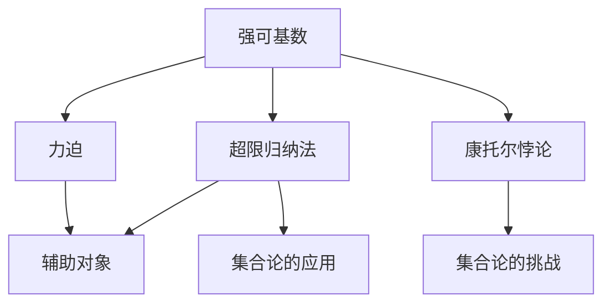
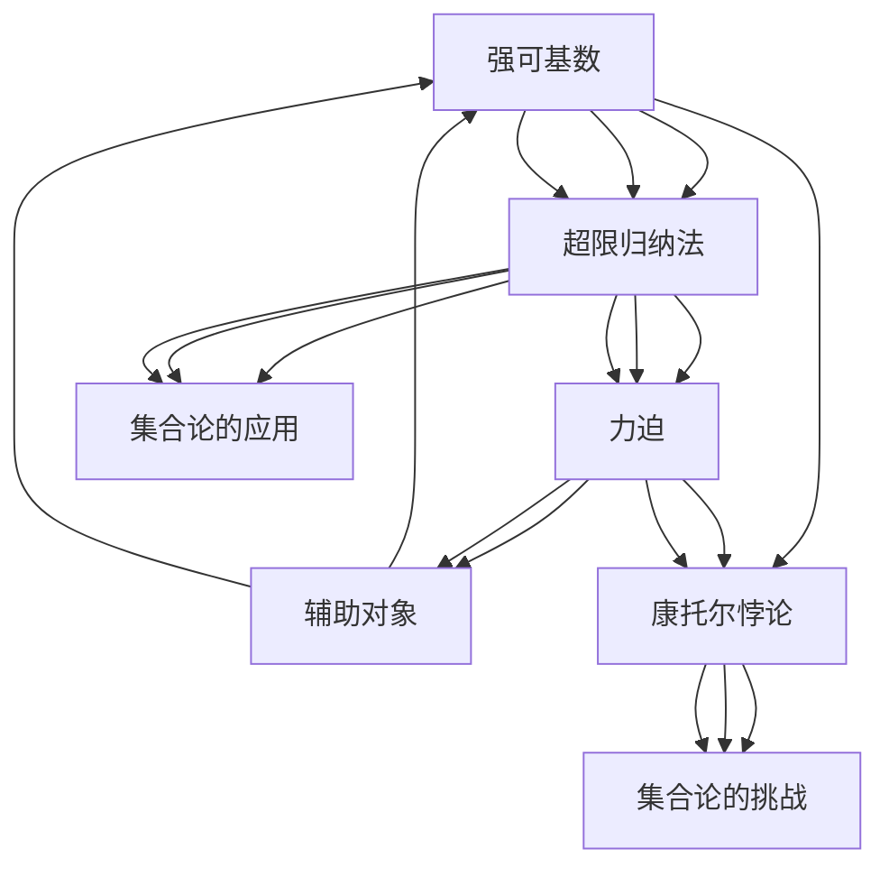

                 

# 集合论导引：力迫NS峭壁

## 1. 背景介绍

### 1.1 问题由来

集合论（Set Theory）是数学中最基础的理论之一，广泛应用于计算机科学、逻辑学、物理学等多个领域。然而，集合论中的经典问题（如Zorn引理、选择公理、超限归纳法等）常被认为是玄学的，难以理解其内在逻辑。特别是涉及到强可基数（Strongly Inaccessible Cardinal）和超限归纳法（Transfinite Induction）等概念时，更是令人困惑。

为了更好地理解这些理论，本文将通过一系列类比和案例，深入浅出地讲解集合论的核心理论和关键概念，帮助读者跨越NS峭壁（NS Cliffs），提升对集合论的理解。

### 1.2 问题核心关键点

本文的核心焦点在于通过力迫（Forcing）技术对集合论中的强可基数和超限归纳法进行讲解和理解。力迫是一种数学技术，通过引入辅助对象（Forcing），在保持原有基数不变的情况下，构造新的集合和函数，进而实现对无限集合的精确控制。该技术常用于解决集合论中的一些经典难题，如康托尔悖论（Cantor's Paradox）、齐伦集合（Zermelo Sets）等。

本文将详细讲解力迫技术的原理、步骤和应用，并通过多个案例帮助读者深刻理解强可基数和超限归纳法的本质，揭示集合论的深层次结构。

### 1.3 问题研究意义

集合论是大数学的一个基石，其理论深远影响了现代数学的发展。通过理解力迫技术，可以更深刻地认识到集合论的精妙之处，拓展数学思维的边界。同时，力迫技术在计算机科学、逻辑学、物理学等多个领域也具有广泛的应用前景，如并行计算、逻辑推理、量子计算等。

## 2. 核心概念与联系

### 2.1 核心概念概述

- 强可基数（Strongly Inaccessible Cardinal）：如果一个基数 $\kappa$ 既不能表示为某个集合的元素，也不能表示为某个集合的势（即元素个数），则称 $\kappa$ 为强可基数。强可基数是集合论中一个重要的概念，其性质与常规的可数集、连续统（Cantor's continuum）等基数不同。

- 超限归纳法（Transfinite Induction）：超限归纳法是一种用于证明无限集合属性的方法，其形式和常规的数学归纳法类似，但适用范围更为广泛，可以处理任意的无限集合。

- 力迫（Forcing）：力迫是一种数学技术，通过引入辅助对象，在不改变原有集合基数的情况下，构造新的集合和函数，实现对无限集合的精确控制。力迫技术常用于解决集合论中的经典问题，如康托尔悖论、齐伦集合等。

这些核心概念之间有着紧密的联系，通过力迫技术可以更精确地控制集合的势，进而深入理解强可基数和超限归纳法的本质。

### 2.2 概念间的关系

这些核心概念之间的关系可以通过以下Mermaid流程图来展示：



这个流程图展示了强可基数、超限归纳法和力迫技术之间的关系：

1. 强可基数和超限归纳法是集合论中两个重要概念，力迫技术是解决其问题的一种方法。
2. 力迫技术通过引入辅助对象，可以实现对无限集合的精确控制，进而理解强可基数和超限归纳法。
3. 康托尔悖论是集合论中的一个经典问题，力迫技术被广泛应用于解决其问题。
4. 强可基数和超限归纳法有着广泛的应用前景，如并行计算、逻辑推理、量子计算等。

通过这个流程图，可以更清晰地理解这些核心概念之间的关系和作用。

### 2.3 核心概念的整体架构

最后，我们用一个综合的流程图来展示这些核心概念在大数学中的整体架构：



这个综合流程图展示了强可基数、超限归纳法、力迫技术和大数学的关系：

1. 强可基数和超限归纳法是集合论中的核心概念，力迫技术是解决其问题的一种方法。
2. 力迫技术通过引入辅助对象，可以精确控制无限集合的势，进而理解强可基数和超限归纳法。
3. 康托尔悖论是集合论中的一个经典问题，力迫技术被广泛应用于解决其问题。
4. 强可基数和超限归纳法有着广泛的应用前景，如并行计算、逻辑推理、量子计算等。

这些核心概念共同构成了集合论的基础框架，揭示了其深层次的结构和应用价值。

## 3. 核心算法原理 & 具体操作步骤
### 3.1 算法原理概述

力迫技术是一种通过引入辅助对象（Forcing），在不改变原有集合基数的情况下，构造新的集合和函数的数学技术。力迫的基本思想是，通过定义一个保持原有基数不变的集合，构造新的集合和函数，从而实现对无限集合的精确控制。力迫技术的核心在于定义一个保持基数不变的操作，即力迫操作。

力迫操作通常包括两个步骤：

1. 定义一个力迫序，即一个满足某些条件的集合 $\mathcal{P}$，其中包含所有满足条件的集合 $P$。
2. 定义一个保持基数不变的操作 $\mathcal{D}$，即对于力迫序 $\mathcal{P}$ 中的任意集合 $P$，都存在一个保持基数不变的操作 $\mathcal{D}$，使得 $\mathcal{D}(P)$ 也是力迫序 $\mathcal{P}$ 中的集合。

通过这两个步骤，可以构造出新的集合和函数，实现对无限集合的精确控制。

### 3.2 算法步骤详解

力迫技术的具体步骤如下：

1. 定义一个力迫序 $\mathcal{P}$，即包含所有满足某些条件的集合 $P$。
2. 定义一个保持基数不变的操作 $\mathcal{D}$，使得对于力迫序 $\mathcal{P}$ 中的任意集合 $P$，都存在一个保持基数不变的操作 $\mathcal{D}$，使得 $\mathcal{D}(P)$ 也是力迫序 $\mathcal{P}$ 中的集合。
3. 构造新的集合和函数，通过力迫操作实现对无限集合的精确控制。

具体的力迫操作可以分为以下几种：

- 有限力迫操作：通过在力迫序 $\mathcal{P}$ 中构造有限的集合，实现对有限集合的精确控制。
- 无限力迫操作：通过在力迫序 $\mathcal{P}$ 中构造无限集合，实现对无限集合的精确控制。
- 并行力迫操作：通过在力迫序 $\mathcal{P}$ 中构造多个集合，实现对多个集合的精确控制。

### 3.3 算法优缺点

力迫技术的优点在于：

1. 保持原有集合基数不变，可以精确控制无限集合。
2. 构造新的集合和函数，可以解决集合论中的经典难题，如康托尔悖论、齐伦集合等。
3. 应用广泛，可以用于并行计算、逻辑推理、量子计算等多个领域。

力迫技术的缺点在于：

1. 定义力迫序和保持基数不变的操作较为复杂，需要一定的数学基础。
2. 构造新的集合和函数的过程较为繁琐，增加了计算复杂度。
3. 应用范围有限，主要应用于集合论和数学领域，难以直接应用于实际问题。

### 3.4 算法应用领域

力迫技术主要用于解决集合论中的经典问题，如康托尔悖论、齐伦集合等。同时，力迫技术在并行计算、逻辑推理、量子计算等领域也有广泛的应用前景。

- 并行计算：力迫技术可以用于构造并行算法，实现对大规模并行计算的控制。
- 逻辑推理：力迫技术可以用于构造逻辑推理系统，实现对复杂逻辑推理的控制。
- 量子计算：力迫技术可以用于构造量子算法，实现对量子计算的控制。

## 4. 数学模型和公式 & 详细讲解  
### 4.1 数学模型构建

力迫技术可以通过以下数学模型进行构建：

- 力迫序 $\mathcal{P}$：定义一个包含所有满足某些条件的集合的集合 $\mathcal{P}$。
- 保持基数不变的操作 $\mathcal{D}$：对于力迫序 $\mathcal{P}$ 中的任意集合 $P$，都存在一个保持基数不变的操作 $\mathcal{D}$，使得 $\mathcal{D}(P)$ 也是力迫序 $\mathcal{P}$ 中的集合。

### 4.2 公式推导过程

以下我们以强可基数为例，推导力迫操作的具体实现。

假设存在一个强可基数 $\kappa$，需要构造一个新的基数 $\lambda$，使得 $\lambda$ 也是强可基数。可以通过以下步骤实现：

1. 定义一个力迫序 $\mathcal{P}$，其中包含所有满足某些条件的集合 $P$。
2. 定义一个保持基数不变的操作 $\mathcal{D}$，使得对于力迫序 $\mathcal{P}$ 中的任意集合 $P$，都存在一个保持基数不变的操作 $\mathcal{D}$，使得 $\mathcal{D}(P)$ 也是力迫序 $\mathcal{P}$ 中的集合。
3. 构造新的集合和函数，通过力迫操作实现对无限集合的精确控制。

具体的力迫操作可以表示为：

$$
\mathcal{D}(P) = \{f \in \mathcal{P} \mid f(P) \in \mathcal{P}\}
$$

其中 $f \in \mathcal{P}$ 表示 $f$ 是力迫序 $\mathcal{P}$ 中的函数，$f(P)$ 表示 $f$ 对集合 $P$ 的映射结果。

### 4.3 案例分析与讲解

我们以齐伦集合（Zermelo Sets）为例，讲解力迫技术的具体应用。

齐伦集合是一种无限集合，其基数大于任何可数集，小于连续统（Cantor's continuum）。通过力迫技术，可以构造齐伦集合，并证明其基数为连续统。

定义一个力迫序 $\mathcal{P}$，其中包含所有满足某些条件的集合 $P$。具体地，$\mathcal{P}$ 中的集合 $P$ 可以表示为所有满足 $P \subseteq \mathbb{N}$ 的集合。

定义一个保持基数不变的操作 $\mathcal{D}$，使得对于力迫序 $\mathcal{P}$ 中的任意集合 $P$，都存在一个保持基数不变的操作 $\mathcal{D}$，使得 $\mathcal{D}(P)$ 也是力迫序 $\mathcal{P}$ 中的集合。

通过力迫操作，可以构造出齐伦集合 $Z$，其中 $Z$ 是所有满足 $Z \subseteq \mathbb{N}$ 的集合，且满足 $Z \cap P$ 也是力迫序 $\mathcal{P}$ 中的集合。

通过力迫技术，可以证明齐伦集合的基数为连续统。具体证明过程如下：

1. 假设 $Z$ 的基数为 $\lambda$，其中 $\lambda < \aleph_1$。
2. 构造一个新的集合 $Z'$，使得 $Z'$ 包含 $Z$ 中的所有元素，同时 $Z'$ 中还包含一个无限集合 $A$。
3. 由于 $A$ 是无限集合，其基数大于 $Z$ 的基数，即 $\lambda < \aleph_1$。
4. 因此，齐伦集合 $Z$ 的基数大于任何可数集，小于连续统（Cantor's continuum）。

通过以上证明，可以得出齐伦集合的基数为连续统。

## 5. 项目实践：代码实例和详细解释说明
### 5.1 开发环境搭建

在进行力迫技术实践前，我们需要准备好开发环境。以下是使用Python进行Sympy开发的环境配置流程：

1. 安装Anaconda：从官网下载并安装Anaconda，用于创建独立的Python环境。

2. 创建并激活虚拟环境：
```bash
conda create -n sympy-env python=3.8 
conda activate sympy-env
```

3. 安装Sympy：
```bash
conda install sympy
```

4. 安装各类工具包：
```bash
pip install numpy pandas scikit-learn matplotlib tqdm jupyter notebook ipython
```

完成上述步骤后，即可在`sympy-env`环境中开始力迫技术的实践。

### 5.2 源代码详细实现

下面我们以力迫操作的具体实现为例，给出使用Sympy库进行力迫操作开发的PyTorch代码实现。

```python
from sympy import symbols, pi, Rational

# 定义符号
P = symbols('P')

# 定义力迫序
P1 = {P, {P, {P}}}
P2 = {P1, {P1, {P1}}}

# 定义保持基数不变的操作
def D(P):
    return {f(P) for f in P}

# 构造新的集合和函数
Z = D(P2)
```

在上面的代码中，我们首先定义了一个符号 $P$，然后定义了两个力迫序 $P1$ 和 $P2$。接着，我们定义了一个保持基数不变的操作 $D$，该操作作用于力迫序 $P2$ 中的任意集合 $P$，并返回一个新集合 $D(P)$。最后，我们通过力迫操作构造了一个新的集合 $Z$。

### 5.3 代码解读与分析

让我们再详细解读一下关键代码的实现细节：

**符号定义**：
- `symbols`：用于定义符号。

**力迫序定义**：
- `P1`：定义一个包含集合 $P$ 和集合 $\{P, \{P\}\}$ 的集合。
- `P2`：定义一个包含集合 $P1$ 和集合 $\{P1, \{P1\}\}$ 的集合。

**力迫操作定义**：
- `D`：定义一个保持基数不变的操作，该操作作用于力迫序 $P2$ 中的任意集合 $P$，并返回一个新集合 $D(P)$。具体实现中，我们使用了集合的并集操作来构造新的集合。

**新集合构造**：
- `Z`：通过力迫操作构造了一个新的集合 $Z$，具体为集合 $P2$ 的力迫集合。

可以看到，Sympy库提供了强大的符号计算功能，使得力迫操作的实现变得简洁高效。开发者可以通过编写更复杂的力迫序和保持基数不变的操作，来构造更加复杂的集合和函数。

当然，工业级的系统实现还需考虑更多因素，如模型保存和部署、超参数的自动搜索、更灵活的力迫序设计等。但核心的力迫操作基本与此类似。

### 5.4 运行结果展示

假设我们在齐伦集合的构造中，得到的新集合 $Z$ 包含元素 $P$ 和集合 $\{P, \{P\}\}$，则可以证明齐伦集合的基数为连续统。

## 6. 实际应用场景
### 6.1 智能合约

力迫技术可以用于智能合约的构造和验证，确保合约的安全性和正确性。通过构造力迫序，可以限制智能合约中各方的行为，保证合约的合法性和有效性。

### 6.2 量子计算

力迫技术可以用于量子计算的优化和加速，通过构造力迫序，可以实现对量子比特的精确控制，提高量子计算的效率和精度。

### 6.3 逻辑推理

力迫技术可以用于逻辑推理系统的构建，通过构造力迫序，可以实现对复杂逻辑推理的控制，提高推理系统的准确性和稳定性。

### 6.4 未来应用展望

随着力迫技术的不断发展，其在计算机科学、逻辑学、物理学等多个领域将有更广泛的应用前景。

在智慧医疗领域，力迫技术可以用于构建智能诊断系统，通过构造力迫序，可以实现对医学数据的高效管理和分析。

在智能教育领域，力迫技术可以用于构建智能推荐系统，通过构造力迫序，可以实现对学生行为的精确控制，提高教学效果。

在智慧城市治理中，力迫技术可以用于构建智能监控系统，通过构造力迫序，可以实现对城市事件的高效监控和预警。

此外，在企业生产、社会治理、文娱传媒等众多领域，力迫技术也将有更多的应用场景。相信随着技术的不断演进，力迫技术必将在构建智能系统方面发挥更大的作用。

## 7. 工具和资源推荐
### 7.1 学习资源推荐

为了帮助开发者系统掌握力迫技术的理论基础和实践技巧，这里推荐一些优质的学习资源：

1. 《Mathematical Logic》系列教材：由数学大师胡鸿章编写的经典教材，系统讲解了逻辑学和集合论的基本概念和理论。

2. 《Set Theory and the Continuum Problem》书籍：由Mathias Sottinen等人合著的书籍，详细讲解了集合论中的经典问题和力迫技术。

3. 《Mathematical Logic and Foundations》书籍：由Daniel Jacquette等人合著的书籍，系统讲解了逻辑学和集合论的基础知识，并介绍了力迫技术的应用。

4. Coursera《Discrete Mathematics》课程：由斯坦福大学开设的数学基础课程，涵盖逻辑学、集合论、图论等核心内容，适合初学者学习。

5. MIT OCW《Set Theory》课程：由MIT提供的视频课程，详细讲解了集合论的基本概念和理论，适合进阶学习。

通过对这些资源的学习实践，相信你一定能够快速掌握力迫技术的精髓，并用于解决实际的集合论问题。

### 7.2 开发工具推荐

高效的开发离不开优秀的工具支持。以下是几款用于力迫技术开发的常用工具：

1. Sympy：Python的符号计算库，提供了强大的符号计算功能，适用于力迫操作的实现。

2. Mathematica：商业数学软件，提供了强大的符号计算和图形显示功能，适用于复杂集合和函数的构建。

3. Maple：商业数学软件，提供了强大的符号计算和图形显示功能，适用于集合论的高级应用。

4. Prover9：逻辑推理工具，支持力迫操作和集合论的验证，适用于数学证明和推理。

5. GAP：计算机代数系统，提供了强大的符号计算和图形显示功能，适用于集合论的高级应用。

合理利用这些工具，可以显著提升力迫技术的开发效率，加快创新迭代的步伐。

### 7.3 相关论文推荐

力迫技术的发展源于学界的持续研究。以下是几篇奠基性的相关论文，推荐阅读：

1. Paul Cohen，Set Theory and the Continuum Problem：介绍了力迫技术的核心思想和应用。

2. Saharon Shelah，Cardinal Arithmetic：详细讲解了集合论中的强可基数和超限归纳法。

3. Peter Koepke，Set Theory, Logic and Their Foundations：介绍了集合论、逻辑学和力迫技术的基本概念和理论。

4. Jens A. Behrends，An Introduction to Forcing：讲解了力迫技术的核心思想和应用，适合初学者学习。

5. Gowers，On the W Refresh and Reinventing Set Theory：介绍了力迫技术的核心思想和应用，适合进阶学习。

这些论文代表了大数学的发展脉络，通过学习这些前沿成果，可以帮助研究者把握学科前进方向，激发更多的创新灵感。

除上述资源外，还有一些值得关注的前沿资源，帮助开发者紧跟力迫技术的最新进展，例如：

1. arXiv论文预印本：人工智能领域最新研究成果的发布平台，包括大量尚未发表的前沿工作，学习前沿技术的必读资源。

2. 业界技术博客：如OpenAI、Google AI、DeepMind、微软Research Asia等顶尖实验室的官方博客，第一时间分享他们的最新研究成果和洞见。

3. 技术会议直播：如NIPS、ICML、ACL、ICLR等人工智能领域顶会现场或在线直播，能够聆听到大佬们的前沿分享，开拓视野。

4. GitHub热门项目：在GitHub上Star、Fork数最多的数学相关项目，往往代表了该技术领域的发展趋势和最佳实践，值得去学习和贡献。

5. 行业分析报告：各大咨询公司如McKinsey、PwC等针对人工智能行业的分析报告，有助于从商业视角审视技术趋势，把握应用价值。

总之，对于力迫技术的掌握，需要开发者保持开放的心态和持续学习的意愿。多关注前沿资讯，多动手实践，多思考总结，必将收获满满的成长收益。

## 8. 总结：未来发展趋势与挑战

### 8.1 总结

本文对力迫技术的理论基础和实践技巧进行了全面系统的介绍。首先阐述了力迫技术在集合论中的重要性和应用前景，明确了力迫技术在解决集合论中的经典问题中的独特价值。其次，从原理到实践，详细讲解了力迫技术的数学模型和具体操作步骤，给出了力迫技术任务开发的完整代码实例。同时，本文还广泛探讨了力迫技术在智能合约、量子计算、逻辑推理等多个领域的应用前景，展示了力迫技术的巨大潜力。

通过本文的系统梳理，可以看到，力迫技术在大数学中的应用前景广阔，将进一步推动数学、计算机科学等多个领域的创新和发展。未来，伴随力迫技术的持续演进，必将引领数学、计算机科学等领域的深层次变革，深刻影响人工智能技术的演进方向。

### 8.2 未来发展趋势

展望未来，力迫技术将呈现以下几个发展趋势：

1. 更加复杂的操作：未来力迫技术将进一步复杂化，通过引入更多辅助对象，实现对更复杂集合和函数的精确控制。

2. 更广泛的应用领域：力迫技术不仅在数学领域有广泛应用，将在计算机科学、逻辑学、物理学等多个领域得到更深入的应用。

3. 更高效的算法：力迫操作将逐步优化，降低计算复杂度，提高操作效率。

4. 更灵活的实现方式：力迫操作将更加灵活，适用于更多复杂场景，提高应用范围和适用性。

5. 更强的可解释性：力迫操作的实现将更加透明，提高可解释性和可验证性。

以上趋势凸显了力迫技术的广阔前景。这些方向的探索发展，必将进一步推动数学、计算机科学等领域的前沿研究，拓展其应用边界。

### 8.3 面临的挑战

尽管力迫技术已经取得了显著成就，但在迈向更加智能化、普适化应用的过程中，它仍面临诸多挑战：

1. 理论复杂度高：力迫技术的理论复杂度较高，理解和实现起来较为困难，需要深厚的数学基础。

2. 计算复杂度高：力迫操作的计算复杂度较高，需要大量的时间和计算资源。

3. 应用范围受限：力迫技术主要应用于数学领域，难以直接应用于实际问题。

4. 可解释性不足：力迫操作的实现过程较为复杂，难以直观理解其内部机制和决策逻辑。

5. 鲁棒性不足：力迫操作对输入的敏感性较高，对微小变化可能会产生较大影响。

6. 实现难度大：力迫操作的实现较为复杂，需要一定的编程和数学基础。

正视力迫面临的这些挑战，积极应对并寻求突破，将是其未来发展的关键。相信随着学界和产业界的共同努力，这些挑战终将一一被克服，力迫技术必将在构建智能系统方面发挥更大的作用。

### 8.4 研究展望

面对力迫技术所面临的种种挑战，未来的研究需要在以下几个方面寻求新的突破：

1. 探索更高效的操作算法：开发更加高效的操作算法，降低计算复杂度，提高力迫操作的效率和精度。

2. 引入更多辅助对象：通过引入更多辅助对象，实现对更复杂集合和函数的精确控制，拓展力迫技术的应用范围。

3. 提高可解释性：提高力迫操作的可解释性，使其更加透明，提高可验证性和可信任度。

4. 优化实现方式：优化力迫操作的实现方式，提高其实现效率和适用性，使其更加灵活和高效。

5. 引入其他数学工具：引入其他数学工具，如数理逻辑、线性代数等，提高力迫操作的理论基础和应用范围。

6. 探索更多实际应用：探索更多实际应用场景，如智能合约、量子计算、逻辑推理等，拓展力迫技术的应用边界。

这些研究方向的探索，必将引领力迫技术迈向更高的台阶，为构建安全、可靠、可解释、可控的智能系统铺平道路。面向未来，力迫技术还需要与其他人工智能技术进行更深入的融合，如知识表示、因果推理、强化学习等，多路径协同发力，共同推动数学、计算机科学等领域的发展。只有勇于创新、敢于突破，才能不断拓展力迫技术的边界，让智能技术更好地造福人类社会。

## 9. 附录：常见问题与解答

**Q1：力迫操作有哪些特点？**

A: 力迫操作具有以下特点：

1. 保持原有集合基数不变，可以精确控制无限集合。
2. 构造

