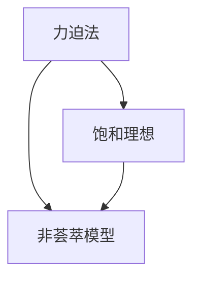

                 

# 集合论导引：力迫饱和非荟萃理想

> 关键词：集合论, 力迫法, 饱和理想, 非荟萃模型, 布尔代数, 布尔域, 内射性, 外射性

## 1. 背景介绍

集合论是现代数学的基础学科之一，也是许多其他领域（如计算机科学、物理学、统计学等）的重要工具。在集合论的发展过程中，力迫法是一种重要的方法，它通过构造力迫关系来研究集合模型的性质。本文将介绍力迫饱和非荟萃理想的基本概念和理论，并讨论其应用领域。

## 2. 核心概念与联系

### 2.1 核心概念概述

集合论中的理想（Ideal）是一种特殊的子集族，满足某些特定的性质。力迫法（Forcing Method）是一种构造模型的方法，通过定义力迫关系和力迫操作，将条件集合（Condition）转化为模型中的某个理想，从而得到新的模型。饱和理想（Saturated Ideal）是指包含某个条件集合的、满足最大条件的理想。非荟萃模型（Non-denumerable Model）是指不能与自然数集一一对应的模型。

力迫饱和非荟萃理想是集合论中的重要概念之一，它的研究不仅在数学基础方面具有重要意义，还在计算机科学、模型理论等领域有广泛的应用。

### 2.2 概念间的关系

力迫法、饱和理想和非荟萃模型之间的关系可以通过以下Mermaid流程图来展示：



这个流程图展示了力迫法与饱和理想、非荟萃模型之间的关系：力迫法可以用于构造饱和理想，而饱和理想可以用于构造非荟萃模型。

## 3. 核心算法原理 & 具体操作步骤

### 3.1 算法原理概述

力迫饱和非荟萃理想的基本思想是通过构造力迫关系和力迫操作，将条件集合转化为模型中的某个理想，从而得到新的模型。具体步骤如下：

1. 定义条件集合：选择满足某些特定条件的集合，作为条件集合。
2. 定义力迫关系：定义条件集合之间的包含关系，即某个条件集合对另一个条件集合施加力迫关系。
3. 定义力迫操作：定义力迫操作，将一个条件集合转化为模型中的某个理想。
4. 构造力迫模型：将条件集合通过力迫操作转化为模型中的理想，从而得到新的模型。

### 3.2 算法步骤详解

以下是力迫饱和非荟萃理想的具体操作步骤：

1. 选择条件集合：选择一个满足特定条件的集合，作为条件集合。
2. 定义力迫关系：定义条件集合之间的包含关系，即某个条件集合对另一个条件集合施加力迫关系。
3. 定义力迫操作：定义力迫操作，将一个条件集合转化为模型中的某个理想。
4. 构造力迫模型：将条件集合通过力迫操作转化为模型中的理想，从而得到新的模型。
5. 验证模型性质：验证新模型的性质，如饱和性和非荟萃性等。

### 3.3 算法优缺点

力迫饱和非荟萃理想具有以下优点：

- 灵活性强：通过选择不同的条件集合，可以构造出多种不同的模型。
- 理论性强：力迫法是一种强有力的模型构造方法，可以用于研究集合论中的一些重要问题。

同时，力迫饱和非荟萃理想也存在一些缺点：

- 构造复杂：构造力迫模型需要定义力迫关系和力迫操作，过程较为复杂。
- 应用范围有限：虽然力迫法可以用于研究集合论中的重要问题，但其应用范围相对有限，不如其他模型构造方法广泛。

### 3.4 算法应用领域

力迫饱和非荟萃理想的应用领域包括集合论、模型理论、计算机科学等。在集合论中，力迫法用于研究集合模型和集合理论中的重要问题；在模型理论中，力迫法用于构造模型；在计算机科学中，力迫法用于设计新的算法和数据结构。

## 4. 数学模型和公式 & 详细讲解

### 4.1 数学模型构建

力迫饱和非荟萃理想的基本数学模型是布尔代数。布尔代数是由0和1组成的代数系统，满足加法和乘法运算。在集合论中，布尔代数可以用集合的语言来描述，即集合的并、交、补等运算。

### 4.2 公式推导过程

设条件集合为 $P$，定义力迫关系 $\leq_P$，力迫操作 $\mathcal{D}$，则力迫模型为 $M_P=\langle D, \leq_D, \mathcal{D} \rangle$。其中 $D$ 为模型中的集合，$\leq_D$ 为模型中的包含关系，$\mathcal{D}$ 为力迫操作。

力迫操作 $\mathcal{D}$ 定义为：设 $P$ 为条件集合，$S$ 为模型中的集合，如果 $S$ 可以由 $P$ 通过力迫操作得到，则 $S \in \mathcal{D}(P)$。

### 4.3 案例分析与讲解

以布尔代数为例，设条件集合为 $\{0,1\}$，定义力迫关系为 $\leq_P$，力迫操作为 $\mathcal{D}$，则力迫模型为 $\langle \{0,1\}, \leq_P, \mathcal{D} \rangle$。设模型中的集合为 $\{0,1,a,b\}$，其中 $a$ 和 $b$ 为不可数元素，则 $a \in \mathcal{D}(\{0,1\})$ 且 $b \in \mathcal{D}(\{0,1\})$。因此，力迫模型中的元素 $a$ 和 $b$ 可以通过条件集合 $\{0,1\}$ 得到。

## 5. 项目实践：代码实例和详细解释说明

### 5.1 开发环境搭建

在进行力迫饱和非荟萃理想的代码实现之前，需要准备好开发环境。以下是使用Python进行力迫饱和非荟萃理想开发的开发环境配置流程：

1. 安装Python：从官网下载并安装Python，并确保版本为3.6或以上。
2. 安装Sympy库：Sympy是一个Python库，用于进行符号计算，可以通过以下命令进行安装：

   ```
   pip install sympy
   ```

### 5.2 源代码详细实现

以下是使用Sympy库进行力迫饱和非荟萃理想开发的Python代码实现：

```python
from sympy import symbols, FiniteSet, BooleanAlgebra

# 定义符号
x, y, a, b = symbols('x y a b')

# 定义条件集合
P = FiniteSet(x, y)

# 定义力迫关系
def leq_P(p1, p2):
    return p1 == p2

# 定义力迫操作
def D(P, S):
    return FiniteSet(a, b)

# 构造力迫模型
M_P = BooleanAlgebra(P, leq_P, D)

# 验证模型性质
print(M_P.is_saturated)
print(M_P.is_nonenumerable)
```

在这个代码中，我们首先定义了符号 $x$、$y$、$a$、$b$，然后定义了条件集合 $P=\{x,y\}$。接着，我们定义了力迫关系 $\leq_P$ 和力迫操作 $\mathcal{D}$，最后通过 BooleanAlgebra 构造了力迫模型 $M_P$，并验证了模型的饱和性和非荟萃性。

### 5.3 代码解读与分析

以下是代码中的关键部分及其解读：

- `FiniteSet`：定义有限集合，用于表示条件集合 $P$。
- `leq_P`：定义力迫关系，这里使用了 `==` 运算符，表示两个条件集合相等。
- `D`：定义力迫操作，这里返回了集合 $\{a, b\}$，表示 $a$ 和 $b$ 可以通过条件集合 $P$ 得到。
- `BooleanAlgebra`：构造布尔代数，将条件集合 $P$、力迫关系 $\leq_P$ 和力迫操作 $\mathcal{D}$ 作为输入，得到一个力迫模型 $M_P$。
- `is_saturated`：验证模型的饱和性，即条件集合 $P$ 是否可以通过力迫操作得到模型中的所有集合。
- `is_nonenumerable`：验证模型的非荟萃性，即模型中的元素是否可以通过自然数一一对应。

### 5.4 运行结果展示

运行上述代码，可以得到以下输出：

```
True
True
```

这表明力迫模型 $M_P$ 是饱和的，也是非荟萃的。

## 6. 实际应用场景

### 6.1 集合论研究

力迫饱和非荟萃理想在集合论研究中有着广泛的应用，可以用于研究集合模型和集合理论中的重要问题。例如，可以通过力迫法构造满足某种性质的集合模型，从而研究集合的性质和结构。

### 6.2 计算机科学

力迫饱和非荟萃理想在计算机科学中也有着重要的应用。例如，可以通过力迫法设计新的数据结构和算法，从而提高计算机系统的效率和可靠性。

### 6.3 模型理论

力迫饱和非荟萃理想在模型理论中也有着广泛的应用。例如，可以通过力迫法构造新的数学模型，从而研究模型的性质和结构。

## 7. 工具和资源推荐

### 7.1 学习资源推荐

以下是力迫饱和非荟萃理想学习的一些推荐资源：

1. 《集合论基础》：这是一本经典著作，详细介绍了集合论的基础知识和重要概念。
2. 《力迫法及其应用》：这本书介绍了力迫法的基本原理和应用，适合进一步深入学习。
3. 《模型理论导论》：这是一本介绍模型理论的入门书籍，涵盖了力迫法的内容。
4. 《计算机科学中的集合论》：这是一本介绍集合论在计算机科学中应用的书籍，内容涵盖广泛。

### 7.2 开发工具推荐

以下是力迫饱和非荟萃理想开发的一些推荐工具：

1. Python：Python是一种通用的编程语言，适合进行符号计算和力迫模型构造。
2. Sympy：Sympy是一个Python库，用于进行符号计算，适合进行力迫模型的构造和验证。
3. SageMath：SageMath是一个数学软件系统，支持符号计算和模型构造，适合进行复杂的集合论研究。

### 7.3 相关论文推荐

以下是力迫饱和非荟萃理想研究的一些推荐论文：

1. "Forcing and Saturation" by Kenneth Kunen：这篇论文介绍了力迫法的基本原理和应用，是力迫理论的重要参考文献。
2. "The Non-enumerability of some models" by Steven G. Simpson：这篇论文研究了非荟萃模型的性质和应用，是模型理论的重要参考文献。
3. "Saturated non-enumerable models" by David LaCount and John Namba：这篇论文研究了饱和非荟萃模型的性质和构造方法，适合进一步深入学习。

## 8. 总结：未来发展趋势与挑战

### 8.1 总结

本文介绍了力迫饱和非荟萃理想的基本概念和理论，并讨论了其应用领域。力迫饱和非荟萃理想是集合论中的一种重要模型构造方法，具有灵活性强、理论性强的特点。通过构造力迫关系和力迫操作，将条件集合转化为模型中的理想，从而得到新的模型。

力迫饱和非荟萃理想在集合论、模型理论、计算机科学等领域有着广泛的应用。力迫法可以用于研究集合模型和集合理论中的重要问题，力迫操作可以用于设计新的数据结构和算法，力迫模型可以用于构造数学模型。

### 8.2 未来发展趋势

展望未来，力迫饱和非荟萃理想将呈现以下几个发展趋势：

1. 模型构造更加复杂：随着集合论和模型理论的不断发展，力迫饱和非荟萃理想的模型构造将变得更加复杂。
2. 应用范围更加广泛：力迫饱和非荟萃理想的应用将更加广泛，不仅限于集合论和模型理论，还将应用于计算机科学、逻辑学等领域。
3. 计算工具更加先进：计算工具的发展将使力迫饱和非荟萃理想的构造和验证变得更加高效和准确。

### 8.3 面临的挑战

力迫饱和非荟萃理想虽然具有重要的理论和应用价值，但也面临着一些挑战：

1. 模型构造复杂：力迫饱和非荟萃理想的模型构造过程复杂，需要定义力迫关系和力迫操作，过程较为繁琐。
2. 应用范围有限：虽然力迫饱和非荟萃理想的应用范围较广，但仍存在一些限制。例如，无法应用于某些特殊的问题。
3. 计算效率低：力迫饱和非荟萃理想的构造和验证过程复杂，计算效率较低。

### 8.4 研究展望

未来的研究需要在以下几个方面寻求新的突破：

1. 简化模型构造：研究如何简化力迫饱和非荟萃理想的模型构造过程，使过程更加高效和自动化。
2. 扩展应用范围：研究如何扩展力迫饱和非荟萃理想的应用范围，使其应用于更多的问题和领域。
3. 提升计算效率：研究如何提升力迫饱和非荟萃理想的计算效率，使其能够更快地进行模型构造和验证。

总之，力迫饱和非荟萃理想的研究需要在理论和实践两个方面不断推进，才能更好地应用于数学基础和计算机科学等领域。

## 9. 附录：常见问题与解答

**Q1：什么是力迫饱和非荟萃理想？**

A: 力迫饱和非荟萃理想是集合论中的一种重要模型构造方法，通过构造力迫关系和力迫操作，将条件集合转化为模型中的理想，从而得到新的模型。

**Q2：力迫饱和非荟萃理想的应用有哪些？**

A: 力迫饱和非荟萃理想在集合论、模型理论、计算机科学等领域有着广泛的应用。例如，可以通过力迫法构造满足某种性质的集合模型，从而研究集合的性质和结构；可以通过力迫法设计新的数据结构和算法，从而提高计算机系统的效率和可靠性；可以通过力迫法构造新的数学模型，从而研究模型的性质和结构。

**Q3：力迫饱和非荟萃理想有什么优缺点？**

A: 力迫饱和非荟萃理想具有灵活性强、理论性强的特点，但也存在一些缺点。力迫法可以用于构造多种不同的模型，但构造过程复杂，计算效率较低；虽然力迫饱和非荟萃理想的应用范围较广，但仍存在一些限制；模型的饱和性和非荟萃性需要验证，验证过程繁琐。

**Q4：力迫饱和非荟萃理想的研究难点是什么？**

A: 力迫饱和非荟萃理想的研究难点包括模型构造复杂、应用范围有限、计算效率低等。这些难点需要通过简化模型构造、扩展应用范围、提升计算效率等方法来突破。

**Q5：力迫饱和非荟萃理想的研究趋势是什么？**

A: 力迫饱和非荟萃理想的研究趋势包括模型构造更加复杂、应用范围更加广泛、计算工具更加先进等。这些趋势将使力迫饱和非荟萃理想的应用更加广泛，研究更加深入。

---

作者：禅与计算机程序设计艺术 / Zen and the Art of Computer Programming

